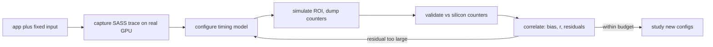

# GPU Simulation Methodology and Evidence — From CUDA to Validated Kernel Results

```mermaid
flowchart LR
    SRC["framework / CUDA-like source + inputs"] --> COMP["graph + kernel compilation"]
    COMP --> ISA["target ISA / code object + resource metadata"]
    ISA --> FUNC["functional threads / warps / addresses"]
    FUNC --> TIM["scheduler / pipeline / coalescer / cache / HBM timing"]
    TIM --> SCALE["NoC / multi-GPU / collective timing"]
    SCALE --> RAW["instructions / transactions / stalls / cycles"]
    RAW --> MET["kernel + service metrics"]
    MET --> VAL["hardware counter and output validation"]
```

> **Two complementary views.** The diagram above is the *data path inside one run* — source to validated metrics. The loop below is the *engineer's workflow across a study*: capture one trace, configure a timing model, validate its counters against silicon, correlate the trend, then iterate or reuse. Sections 3–9 detail each stage.

> **First-time reader orientation:** GPU simulation has two programs and several instruction forms. Host CPU code allocates memory, transfers data, launches kernels, and synchronizes. Device code is represented as virtual PTX and target machine SASS. An execution-driven simulator interprets a device representation; a trace-driven simulator replays the SASS path captured on real hardware. The artifact boundary determines what can change in simulation.

> **Abbreviation key — skim now and return as needed:** CUDA programming platform; parallel thread execution (PTX); CUDA binary (cubin); CUDA fat binary (fatbin); NVIDIA native GPU machine representation (SASS); NVIDIA binary instrumentation tool (NVBit); streaming multiprocessor (SM); single instruction, multiple threads (SIMT); program counter (PC); high-bandwidth memory (HBM); region of interest (ROI); instructions per cycle (IPC); comma-separated values (CSV); power, performance, and area (PPA).

> **Hands off to:** [GPU Simulators](../04_Simulation/01_GPU_Simulators.md), which instantiates this workflow in GPGPU-Sim and Accel-Sim.

---

## 0. Freeze both host and device workload

Preserve source/input hashes, build commands, CUDA toolkit, target `-arch`/`-code`, driver, libraries, math/optimization flags, launch parameters, streams, device, and output checksum. State whether the result includes:

- host preprocessing and control;
- allocation and host-device transfers;
- launch and synchronization overhead;
- kernel execution only;
- result copies and verification.

A kernel-cycle number is not automatically application latency.

## 1. CUDA source becomes host code and device artifacts

~~~text
CUDA .cu source
├─ host path -> host compiler/object -> CPU executable
└─ device path -> PTX virtual ISA -> ptxas -> target cubin/SASS
                         PTX + one or more cubins -> fatbin in host object
~~~

PTX is a virtual ISA that preserves thread-level semantics but not final physical-register allocation or every SASS scheduling decision. `ptxas` converts PTX for a target compute capability into a cubin containing SASS. A fatbin can carry PTX and several cubins. At runtime, the driver chooses a compatible cubin or just-in-time compiles PTX.

Compiler/toolkit/target changes can alter instruction selection, register count, spills, control flow, and numerical behavior. Preserve the actual cubin/fatbin or a hash, not just `.cu` source.

## 2. Launch metadata creates GPU work

The host runtime supplies kernel entry, arguments, grid dimensions, block dimensions, dynamic shared memory, stream, and dependencies. The model allocates blocks to SMs subject to:

- registers per thread/block;
- shared memory per block;
- threads/warps per SM;
- architectural block and barrier limits.

Each block becomes warps. One static SASS instruction can execute many times for many warps. A dynamic warp instruction carries PC/opcode, source/destination information, and an active-lane mask. A memory instruction also carries lane addresses; coalescing converts them into transactions.

## 3. Execution-driven PTX simulation

**Intuition — re-perform vs replay.** Treat the device program as a recorded performance. *Execution-driven* simulation (this section) **re-performs** it: the model runs the PTX itself, so changing the machine can change the addresses, branch outcomes, and divergence it produces. *Trace-driven* simulation (§4) **replays** a recording captured once on silicon: the SASS instructions, active masks, and addresses are fixed, and only their timing is recomputed. Re-performing reacts to design changes but may lower PTX to machine code differently than real hardware; replaying is fast and instruction-faithful but frozen — it cannot produce a path the recording never took. That trade-off is the spine of this methodology.

In an execution-driven path, intercepted runtime calls create GPU state and the functional frontend interprets PTX threads. It computes:

- register values and predicates;
- branch outcomes and divergence/reconvergence behavior;
- effective addresses;
- barriers, atomics, and memory-space semantics;
- program output.

Threads are grouped into warps for timing. The timing model allocates blocks, chooses eligible warps, checks scoreboard dependencies and pipeline ports, advances cache/NoC/HBM requests, and schedules completions. Functional values decide what happens; timing decides when.

This path can respond when timing affects synchronization or dynamic behavior, but it approximates PTX-to-machine mapping. It cannot exactly recreate an undocumented compiler backend's SASS scheduling and spills.

## 4. Trace-driven SASS simulation

Accel-Sim's NVBit workflow runs the compiled application on a compatible real GPU and records a dynamic SASS trace. A trace includes a kernel list and per-warp records needed to reconstruct PC/opcode class, masks, registers, memory addresses/widths, and relevant control/synchronization behavior.

The trace is already dynamic and target-compiled. It freezes the path observed for that device, binary, input, and capture timing. The simulator does not replay capture timestamps; it feeds records through a new modeled scheduler/cache/NoC/HBM timing configuration. This enables controlled configuration comparison but cannot automatically generate a different path caused by atomics, races, spin loops, or changed synchronization timing.

If $\Pi(\mu)$ denotes the dynamic instruction/address/mask stream produced by microarchitecture and timing configuration $\mu$, replaying a trace captured at $\mu_0$ to study $\mu_1$ assumes $\Pi(\mu_1)=\Pi(\mu_0)$. That is often reasonable for deterministic kernels whose addresses depend only on input values, but unsafe when changed timing changes synchronization, race outcomes, dynamic work creation, or memory-system feedback. The trace can be instruction-faithful and still be structurally unable to answer such a question.

Trace provenance must include capture GPU, toolkit/driver, binary hash, input, tracer revision/options, completed kernel list, and trace hash.

## 5. GPU timing events

Before kernel cycle zero, the model knows grid/block resources and instruction/trace metadata. It then repeatedly:

1. assigns waiting blocks to SMs when resource limits permit;
2. creates resident warps and control/reconvergence state;
3. identifies eligible warps whose operands/barriers/memory ordering permit issue;
4. selects warps and pipelines subject to scheduler and port limits;
5. coalesces lane memory requests and allocates cache/miss/NoC/HBM resources;
6. processes completions, clears scoreboard dependencies, and wakes warps;
7. releases completed-block resources and admits more blocks;
8. finishes after all blocks and required pending work complete.

Stall counters arise at gates: no eligible warp, scoreboard dependency, pipeline full, operand-collector/RF conflict, miss queue full, NoC backpressure, memory-partition queue, barrier, or atomic serialization.

### 5.1 Latency, initiation interval, and parallel pipelines

Represent each GPU operation class by $(L,II,P)$: latency $L$ until its result can clear scoreboard dependencies, initiation interval $II$ between accepts on one pipeline, and parallel pipeline count $P$. A tensor instruction may have high $L$ but $II=1$, so many independent warps fill the pipeline; a special-function unit may have both limited $P$ and a larger $II$. The operation-class acceptance ceiling is $P/II$ warp instructions per cycle before scheduler, operand, dependency, and writeback limits.

This record also clarifies abstraction. One warp-level matrix instruction can be modeled as one calibrated $(L,II)$ operation, or as several target-machine sub-operations with their own dependencies. The finer form is useful only if its decomposition and constants are validated; otherwise several small errors can accumulate beyond one calibrated coarse error.

### 5.2 Contention emerges from service events

Each L1 port, L2 slice, NoC link, memory-partition queue, DRAM bank, and return path is a finite-rate server. Requests carry arrival time and wait until a legal service opportunity. Their grant-minus-arrival time is queueing latency; no separate “contention term” is required. For offered rate $\lambda$, service rate $\mu$, and $\rho=\lambda/\mu$, the simple $1/(\mu-\lambda)$ residence-time shape explains the rapid latency rise near saturation, while the event model resolves the actual burst/interleave behavior.

Trace replay is faster largely because it removes functional execution per thread. If $n_{event}$ is timing events per target cycle and $i_{event}$ is host work per event, simulator cost scales roughly with $n_{event}i_{event}$. Captured values, masks, and addresses reduce $i_{event}$; coarser cache/interconnect models reduce $n_{event}$ but can erase the very contention under study. Profile host time and remove fidelity only outside the claim boundary.

### 5.3 Kernel sampling for tractable studies

**What.** Rather than simulate every kernel invocation in detail, simulate a representative *subset* and extrapolate the rest — the GPU analogue of sampled CPU simulation (SimPoint/SMARTS). A single run can issue thousands to millions of launches, and §5.2's per-event cost is paid for each, so a full detailed run can take days to weeks.

**Why.** Most invocations are near-duplicates: the same kernels re-launch across loop iterations with the same shapes and memory behavior, so detailed simulation re-derives the same timing again and again. Sampling spends the budget once per distinct behavior.

*Worked example.* An application issues $N = 12{,}000$ kernel invocations in its measured region; a full detailed run would take about $300$ hours (about $90$ s per invocation). Clustering the invocations by static kernel, launch shape, and dynamic signature yields $K = 40$ distinct behaviors. Simulating one representative per cluster costs $40 \times 90\,\text{s} = 3600\,\text{s} = 1$ hour — an ideal $12{,}000 / 40 = 300\times$ speedup. The realized speedup is smaller: reaching each representative means functionally fast-forwarding past skipped work and warming caches before its ROI, and that overhead — not detailed simulation — then dominates.

**How.** Cluster invocations by static kernel plus launch shape plus a dynamic signature (instruction mix, footprint, divergence); choose one or a few representatives per cluster; fast-forward or restore a checkpoint to reach each representative's architectural state; warm caches and predictors so the ROI is not cold-start biased; simulate the representative in detail; then weight each cluster's per-invocation metrics by its dynamic share and sum to reconstruct application totals. Report the sampling fraction and per-cluster variance with the estimate — repeating one deterministic trace is reproducible but does not by itself bound extrapolation error (§9.1).

## 6. Measurement boundaries

A reliable sequence is:

~~~text
initialize application and input
perform unmeasured warm-up launches
synchronize
reset simulator/statistical counters
launch the exact kernel/stream set
synchronize at the intended completion boundary
dump raw counters and logs
verify kernel count, exit status, and output
~~~

Asynchronous launches require a completion event or synchronization before ending the ROI. Otherwise host time can stop while GPU work remains in flight. Multi-kernel overlap requires stream/event dependency modeling, not a sum of isolated kernel times.

## 7. Raw GPU metrics and denominators

$$
\text{warp IPC}_{SM}=\frac{N_{warp\ issue/retire,SM}}{C_{active,SM}},
$$

$$
\eta_{lane}=\frac{N_{active\ lane\ instructions}}{W\,N_{warp\ instructions}},
\qquad
\text{occupancy}=\frac{\overline{N_{resident\ warps}}}{N_{warp\ slots}},
$$

$$
T_{kernel}=\frac{C_{kernel}}{f_{modeled}},\qquad
BW_{HBM}=\frac{B_{post-coalescing}}{T_{kernel}}.
$$

Warp instructions, active-lane instructions, thread instructions, transactions, sectors, and bytes are different domains. State per-SM versus chip aggregate. Define whether bytes are useful, cache-sector, NoC, or HBM transfer bytes.

For Accel-Sim, preserve raw per-kernel logs; tools such as `get_stats.py` extract selected fields into tables such as `stats.csv`, which are derived artifacts. Save extraction options and column definitions.

## 8. Correctness and conservation

- Hardware trace capture must finish correctly and match expected output.
- Simulated grid/block/kernel counts must match launch metadata.
- Active lanes cannot exceed warp width.
- Resident blocks/warps must respect registers/shared/architectural limits.
- Coalesced transactions must account for active memory lanes and request sizes.
- Cache/NoC/HBM request and byte counts must reconcile at boundaries.
- Kernel completion requires all blocks plus required outstanding work.
- Energy must equal event counts times per-event costs under the stated model.

## 9. Validation hierarchy

Compare the same binary/input/configuration against hardware:

1. kernel launches and instruction counts;
2. register use, occupancy, active lanes, and operation mix;
3. L1/L2 hit rates and memory transactions;
4. eligible/issued warps and stall reasons;
5. HBM traffic/bandwidth;
6. kernel cycles/time;
7. power/energy if modeled.

Validate across compute, latency, cache, bandwidth, divergent, atomic, and synchronization workloads. Calibration on one GPU does not guarantee accuracy for a different generation whose scheduling, caches, tensor paths, or memory changed.

### 9.1 GPU-specific error budget

GPU model errors often enter at different boundaries: compiler/SASS mismatch changes the instruction stream; trace capture freezes divergence and addresses; scheduler/scoreboard abstraction changes eligible warps; coalescer/cache/interconnect models change traffic amplification; HBM parameters change service; and power models multiply event-count error by per-event-energy error. Preserve these categories instead of quoting one average cycle error.

A SASS trace can faithfully preserve the captured target instructions, active masks, and addresses while still omitting feedback that would change those values under another cache, memory-consistency, or dynamic-parallelism design. Conversely, an execution-driven PTX model can react to architectural changes but may lower virtual instructions differently from real hardware. State which uncertainty dominates the claim.

Validate trend resolution as well as absolute error. High correlation across configurations can make a consistent timing bias acceptable for ranking; configuration-dependent residuals determine whether two close kernels or designs are distinguishable. Repeating the same deterministic trace does not measure model-form error. Use multiple kernels/shapes, silicon counters, microbenchmarks, and—where available—RTL evidence to bound it.

*Worked example — bias vs correlation.* Five kernels, hardware cycles $H$ against simulated $S$, where the model overpredicts by a constant $15\%$ ($S = 1.15\,H$):

| kernel | $H$ | $S$ | error |
|---|---|---|---|
| K1 | 100 | 115 | +15% |
| K2 | 200 | 230 | +15% |
| K3 | 400 | 460 | +15% |
| K4 | 800 | 920 | +15% |
| K5 | 1600 | 1840 | +15% |

Absolute error is $15\%$ (MAPE), yet the points are perfectly collinear, so Pearson $r = 1.00$ (real data lands near, not at, $1$). The model therefore *ranks* all five kernels correctly, and one $1/1.15$ gain factor removes the bias — a consistent bias is acceptable for ranking. Resolution is the stricter test: if two candidate designs are predicted at $1015$ and $1005$ cycles (about $1\%$ apart) while the model's kernel-to-kernel residual spread is $\pm 3\%$, that gap sits inside the noise and the model cannot reliably call one design faster than the other.

## 10. GPU simulator/tool selection

| Tool/path | Strong use | Key limitation |
|---|---|---|
| analytical roofline/occupancy model | early kernel/config screening | no detailed contention or scheduling |
| GPGPU-Sim PTX path | execution-driven functional/timing studies | approximate final machine mapping |
| Accel-Sim SASS trace path | target instruction fidelity and correlation | frozen captured dynamic path |
| hardware profiler | ground truth counters/timing for existing GPU | limited visibility and no hypothetical structures |
| RTL/emulation/custom model | implementation-specific accelerator/GPU blocks | cost and availability |

Choose the input boundary explicitly. A PTX result and a SASS instruction count are not directly interchangeable.

## 11. Reproducible result package

Preserve host/device source and input hashes, build commands, fatbin/cubin information, disassembly where available, launch log, trace metadata/hash, simulator configuration/revision, raw logs, counter extraction, formulas, validation comparison, and uncertainty. A plotted point must be traceable back to the exact kernel artifacts and input.

## Cross-references

- [GPU Simulators](../04_Simulation/01_GPU_Simulators.md) provides tool internals and worked timing/power examples.
- [SIMT Scheduling and Occupancy](../01_Core_Architecture/02_SIMT_Scheduling_and_Occupancy.md) explains resident/eligible/issued state.
- [GPU PPA and Physical Implementation](02_GPU_PPA_and_Physical_Implementation.md) checks modeled resource bandwidth and clock feasibility.

## References

1. NVIDIA, *CUDA C++ Programming Guide* and *CUDA Compiler Driver NVCC*.
2. Accel-Sim official framework documentation and papers.
3. A. Bakhoda et al., “Analyzing CUDA Workloads Using a Detailed GPU Simulator,” ISPASS 2009.
4. M. Khairy et al., “Accel-Sim,” ISCA 2020.

---

← [GPU PPA and Physical Implementation](02_GPU_PPA_and_Physical_Implementation.md) · [GPU book index](../00_Index.md) · next → [Core Architecture](../01_Core_Architecture/00_Index.md)
