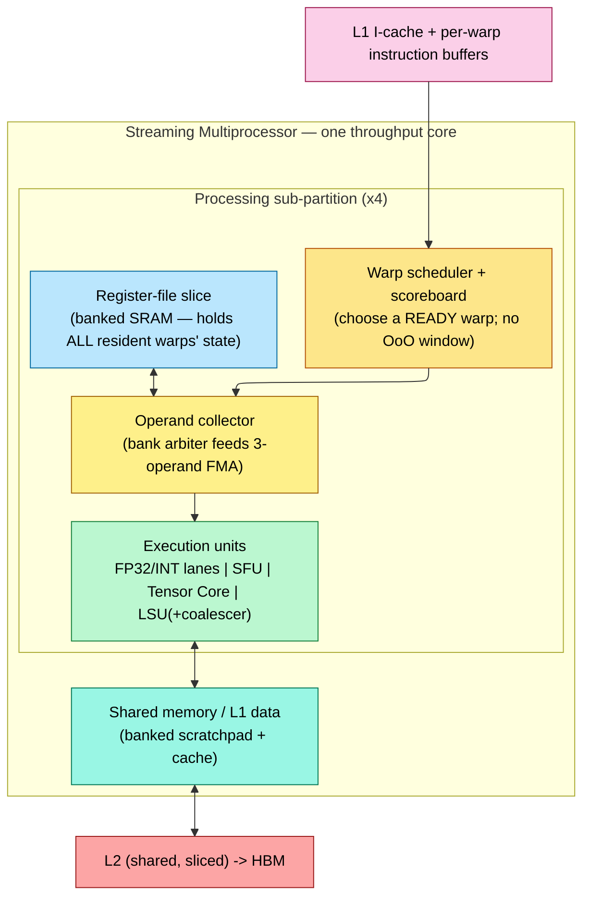

# Graphics Processing Unit (GPU) Architecture — The Throughput Machine

> **First-time reader orientation:** A GPU is designed to complete large amounts of parallel work rather than minimize the latency of one control-heavy thread. A streaming multiprocessor (SM) holds many thread groups, register state, schedulers, and arithmetic lanes. When one group waits, another ready group can use the execution pipelines.

> **Abbreviation key — skim now and return as needed:** central processing unit (CPU); neural processing unit (NPU); instruction set architecture (ISA); instruction-level parallelism (ILP); memory-level parallelism (MLP);
> design-space exploration (DSE); out-of-order (OoO); reorder buffer (ROB); miss status holding register (MSHR); load-store queue (LSQ);
> physical register file (PRF); arithmetic logic unit (ALU); load-store unit (LSU); register file (RF); single instruction, multiple data (SIMD);
> single instruction, multiple threads (SIMT); static random-access memory (SRAM); dynamic random-access memory (DRAM); high-bandwidth memory (HBM); double data rate (DDR);
> level-one cache (L1); level-two cache (L2); level-three cache (L3); network on chip (NoC); direct memory access (DMA);
> dynamic voltage and frequency scaling (DVFS); general matrix multiplication (GEMM); general-purpose computing on graphics processing units (GPGPU); Parallel Thread Execution (PTX); NVIDIA native machine instructions (SASS);
> Peripheral Component Interconnect Express (PCIe); program counter (PC); streaming multiprocessor (SM); artificial intelligence (AI); fused multiply-add (FMA);
> floating-point operation (FLOP); tera floating-point operations per second (TFLOP); kilobyte (KB); megabyte (MB); gigabyte (GB);
> terabyte (TB); gigahertz (GHz).

> **Prerequisites:** [OoO_Execution](../../01_CPU_Architecture/03_Out_of_Order_Backend/01_OoO_Execution.md) (the latency-hiding machine this page is defined *against* — the "which structure saturates first" framing and the ROB "derive what it must hold" method), [Cache_Microarchitecture](../../01_CPU_Architecture/04_Cache_Hierarchy/01_Cache_Microarchitecture.md) (MSHRs, sectored lines, banking), [Memory](../00_Design_Methodology/02_GPU_PPA_and_Physical_Implementation.md) (banked / multi-ported SRAM and register-file arrays), [GPU workload and performance methods](../00_Design_Methodology/01_GPU_Workloads_Performance_and_DSE.md) (the roofline / occupancy model).
> **Hands off to:** [Full-Chip Modeling §4.3](../../04_SoC_and_Chiplet_Architecture/01_System_Modeling/01_Full_Chip_Modeling.md) (GPU power/occupancy modeling and the power-cap/DVFS loop), [GPU Simulators](../04_Simulation/01_GPU_Simulators.md), and the self-contained [AI Workloads and Serving](../05_AI_Workloads_and_Serving/00_Index.md) section for operator mapping, tensor-core pipelines, KV-cache behavior, multi-GPU inference, and service-level analysis. The companion **AI-infra notebook** [silicon-to-serving](https://github.com/Wty2003328/silicon-to-serving) remains optional product- and software-stack reading rather than a prerequisite.

---

## 0. Why this page exists

The CPU book describes a **latency machine**: a CPU core spends substantial hardware on rename, a reorder buffer (ROB), issue queues, branch prediction, and large caches ([OoO_Execution](../../01_CPU_Architecture/03_Out_of_Order_Backend/01_OoO_Execution.md)) to reduce the time to finish *one* instruction stream. A GPU inverts the objective. It does not optimize one control-heavy thread for minimum latency; it makes the *aggregate* fast by keeping thousands of independent threads in flight so that whenever one stalls on memory, another is ready to issue. That change of goal — **throughput per watt and per mm², not single-thread latency** — drives the warp, the SIMT stack, the enormous banked register file, the coalescer, and occupancy limits.

This page takes the notebook's hardware-design lens ("*what must this block do or hold, and why — then what does that cost*", the method used for the ROB in [OoO Execution §3](../../01_CPU_Architecture/03_Out_of_Order_Backend/01_OoO_Execution.md)) and applies it to the GPU. It derives the generic SM, matrix-instruction path, memory hierarchy, and occupancy rules. Generation-specific instruction encodings and capacities vary, but the architectural roles remain: hide latency with resident parallelism, amortize control through SIMT, and keep reusable tensor data near the execution pipelines.

---

## 1. Throughput, not latency — why the machine is shaped differently

Start from the constraint that decides everything. A DRAM access on a modern part costs several hundred core cycles (§7). A latency machine hides that gap with an out-of-order window: fetch far ahead, rename away false dependencies, and let ~100–300 in-flight instructions overlap the miss. But the window is bounded by the ROB/PRF (physical register file)/LSQ (load-store queue), and each extra slot costs quadratic port area and a longer wakeup path — the ILP (instruction-level parallelism) you can buy this way saturates around a few instructions per cycle ([OoO_Execution §2.3, §3.2](../../01_CPU_Architecture/03_Out_of_Order_Backend/01_OoO_Execution.md)).

**The throughput machine hides the same latency with a completely different resource: independent threads.** The amount of concurrency you must keep in flight to hide a latency at a target rate is a form of Little's law:

$$N_{\text{in-flight}} \;=\; \lambda \cdot L$$

where $\lambda$ = the rate at which the machine wants to *issue* the latency-bound operation (e.g. memory instructions/cycle) and $L$ = the latency being hidden (cycles).

Little's law is the load-bearing identity, so derive it rather than quote it. Over a long window $[0,T]$ the SM issues latency-bound operations at rate $\lambda$ and each spends $L$ cycles outstanding before it clears. Count the accumulated *op·cycles* two ways: $\int_0^T N(t)\,dt = \sum_i L_i$ — the area under the in-flight-count curve $N(t)$ equals the sum of every op's residence time. Divide by $T$: the time-average in-flight count is $\overline N = \tfrac1T\sum_i L_i = \big(\tfrac{\#\text{ops}}{T}\big)\big(\tfrac{\sum_i L_i}{\#\text{ops}}\big) = \lambda\,\overline L$. The identity is *distribution-free* — it assumes only steady state (arrivals balance departures), exactly the regime a warp scheduler runs in.

Specialize to warps. Let $t_{\text{issue}} = 1/\lambda$ be the issue interval the scheduler wants to sustain ($t_{\text{issue}}=1$ cyc for a one-instruction-per-cycle slot). If each resident warp keeps at most one latency-bound op outstanding at a time, the number of *warps* that must be resident to keep that slot full while the oldest op's latency $L_{\text{mem}}$ drains is

$$W_{\text{needed}} \;=\; \big\lceil \lambda\,L_{\text{mem}} \big\rceil \;=\; \Big\lceil \frac{L_{\text{mem}}}{t_{\text{issue}}} \Big\rceil$$

where $L_{\text{mem}}$ = memory latency (cycles) and $t_{\text{issue}}$ = cycles per issue. *Worked number:* hiding $L_{\text{mem}}=400$ cycles at $t_{\text{issue}}=1$ cyc needs $W_{\text{needed}}=400$ warps. **Below that count the slot runs dry:** with $W < W_{\text{needed}}$ warps each stalling for the full latency, the issue slot is busy only a fraction $W/W_{\text{needed}}$ of cycles, so sustained issue is $\min(1, W/W_{\text{needed}})$ of peak — the 64-warp hardware cap (§7) reaches just $64/400 = 16\%$ from stalled warps alone. Real GPUs recover the missing $\sim6\times$ with *per-warp* parallelism (each warp keeping $k$ independent ops in flight, so it re-issues before stalling), which lowers the requirement to $W_{\text{needed}} = \lceil L_{\text{mem}}/(t_{\text{issue}}\,k)\rceil$ — the calculation completed in §10-problem 2.

To hide a 400-cycle miss while issuing a memory op every few cycles, you need on the order of *hundreds* of independent operations queued — far more than one thread's ROB holds, but trivially available if you have thousands of resident threads. So the design answer is **massive multithreading**: hold so many threads' state on-chip that the scheduler always finds a ready one.

Two hardware arguments say this is the *cheaper* way to buy performance when the work is abundant and parallel:

- **Amortized control (why SIMT, §2).** A scalar OoO core pays its whole front end — fetch, decode, predict, rename, schedule — *per instruction stream*. If 32 threads are executing the same instruction, running them as one **warp** amortizes one fetch/decode/schedule over 32 lanes, spending the transistors on datapath and register state instead of 32 copies of control.
- **Diminishing returns on a single core (why many small cores).** Single-thread performance scales roughly as **Pollack's rule** — $\text{perf} \propto \sqrt{\text{area}}$ — because extra area goes into ever-deeper speculation. So doubling a core's area buys ~1.4× on one thread but ~2× if spent as *two* throughput cores running independent work. When the workload is thousands of independent lanes (graphics fragments, GEMM (general matrix-multiply) tiles, batched tokens), the many-small-cores design wins decisively on throughput per mm² and per watt.

The result is a machine of **many simple SIMT cores** (Streaming Multiprocessors, §4), each holding many warps, each warp lock-stepping 32 lanes — no rename, no ROB, no speculation past a branch, and a scoreboard instead of an issue window. It is optimal exactly when the work is abundant and data-parallel, and it is *terrible* at a single latency-bound serial thread — which is why real systems pair a CPU (latency) with a GPU (throughput). The rest of this page is the consequences of that one trade.

### 1.1 How the parallel work reaches the machine — grid, block, warp

§1 says the SM must keep thousands of independent threads resident; this is *how they get there* — the system-level path a CPU has no equivalent of, because a GPU is not autonomous but a **coprocessor a host CPU drives.** Trace the work from host to lane:

1. **Host → driver → command queue.** An application on the CPU issues a **kernel launch** through a runtime (CUDA / HIP); the **driver** validates it and pushes a command onto a **stream** — an in-order queue of GPU work in host-visible memory. The GPU's front-end command processor pulls from these streams, so the CPU runs ahead asynchronously and the GPU never blocks on it; independent streams overlap copy and compute.
2. **Kernel and grid.** A **kernel** is the single function every thread runs; the launch fixes a **grid** — a 1–3-D array of **thread-blocks** (CUDA name: a *CTA*, cooperative thread array) — and the threads-per-block. The programmer chooses this shape.
3. **Work distributor → SM.** A global **work distributor** (NVIDIA's GigaThread engine) hands *whole blocks* to SMs that have room. **The block is the unit of dispatch and of resource allocation:** an SM admits a block only if it can *simultaneously* fit that block's registers, shared memory, warp slots, and a block slot — which is exactly the `min` in §7's occupancy formula. Once placed, a block runs to completion on that one SM (its threads share that SM's shared memory and can barrier-synchronize) and never migrates.
4. **Block → warps → lanes.** The SM splits each resident block into **warps** of 32 threads (§2), and the schedulers (§4) interleave *all* resident warps from *all* resident blocks to hide latency (§1).

So the "**block slots**", "**blocks**", and "**warps/block**" that appear in the occupancy formula (§7) are not free knobs — they are this dispatch hierarchy: the launch carves the grid into blocks, the work distributor packs blocks onto SMs subject to the resource `min`, and each block becomes the warps the scheduler feeds. It is also why a kernel with oversized blocks or heavy per-thread resource use launches at low occupancy — the distributor cannot fit enough blocks onto each SM. [End-to-End GPU AI Inference and Serving](../05_AI_Workloads_and_Serving/02_End_to_End_GPU_AI_Inference_and_Serving.md) follows the host/runtime queue through model steps; the hardware fact is that a GPU is a **queue-fed, block-granular work engine** attached to a CPU.

---

## 2. SIMT — amortizing the front end over 32 lanes

The **warp** (NVIDIA: 32 threads; AMD wavefront: 32 or 64) is the load-bearing design decision. One instruction is fetched, decoded, and scheduled *once* and executed on 32 datapath lanes in lock-step — Single-Instruction, Multiple-Thread. SIMT is *not* the same bargain as SIMD (single-instruction, multiple-data):

- **SIMD** (a CPU vector unit, [CPU_Architecture](../../01_CPU_Architecture/01_Core_Foundations/01_CPU_Architecture.md)) exposes the vector *width to the programmer/compiler*: you write a 512-bit operation and are responsible for masking, alignment, and remainder loops.
- **SIMT** exposes a *scalar thread* programming model; the hardware groups threads into warps and lock-steps them. Each lane has its **own registers and its own memory address**, so lanes can follow data-dependent addresses and (with a cost, §3) data-dependent control flow. This is what makes GPUs pleasant to program relative to hand-vectorized SIMD, and it is a *hardware* choice: the SM builds per-lane register addressing and per-lane address generation into the datapath.

From "one instruction drives 32 lanes," derive what the hardware must hold for each warp:

1. **A single PC** (program counter) (pre-Volta) or a convergence-optimized set of per-thread PCs (Volta+, §3) — the warp advances through the program together.
2. **An active mask** — 32 bits saying which lanes participate in this instruction (lanes are masked off at warp edges and under divergence).
3. **The full register state of every lane, for every resident warp at once** — because the whole latency-hiding scheme (§1) depends on switching warps for free, which is only possible if no context ever has to be saved/restored (§4, §5).

That third item is the expensive one and the reason the register file dominates the SM. Everything in §4–§5 follows from it.

---

## 3. Warp divergence and reconvergence — the hardware cost of the SIMT bargain

SIMT promises a scalar programming model, but the hardware issues *one* instruction per warp per cycle. So the moment a branch sends some lanes one way and the rest another, the machine faces a problem it must solve in hardware. Derive the mechanism the way we derived the ROB's fields ([OoO_Execution §3](../../01_CPU_Architecture/03_Out_of_Order_Backend/01_OoO_Execution.md)) — from the jobs it must do:

1. **It must remember which lanes go which way.** A divergent branch splits the 32-bit active mask into a *taken* subset and a *not-taken* subset. Both subsets have work to do, but only one instruction can issue at a time — so the hardware must **serialize the paths**, executing one subset under a reduced mask while the other waits.
2. **It must know where the paths rejoin, so it can stop serializing.** Left alone, once-diverged lanes would run separate paths forever and the 32× throughput collapses permanently. Hardware picks the **immediate post-dominator (IPDOM)** of the branch — the first instruction *every* path must reach — as the reconvergence point, and re-merges the full mask there.
3. **It must nest correctly**, because a branch inside a branch splits an already-reduced mask.

The structure that satisfies all three is a **per-warp SIMT reconvergence stack**. Each entry is a triple `(next-PC, active-mask, reconvergence-PC)`. On a divergent branch the hardware pushes the two path entries plus the reconvergence entry; it executes each path with its reduced mask; when a path's PC hits the reconvergence-PC it pops, and when the stack unwinds to the reconvergence entry the full mask is restored. This is a genuine hardware block — a small stack SRAM per warp plus the mask-manipulation datapath — and it is what a GPU has *instead of* a branch predictor and misprediction-recovery machinery.

**The cost is throughput, and it is quantifiable.** While a warp runs a divergent region, masked-off lanes do no useful work, so the SIMT execution efficiency is

$$\eta_{\text{SIMT}} \;=\; \frac{\overline{\text{active lanes per issued instruction}}}{32}$$

A fully divergent 32-way branch (e.g. a `switch` on `threadIdx`) drops $\eta$ toward $1/32 \approx 3\%$ — the hardware still issues 32-wide but 31 lanes are dark. This is *the* first-order GPU performance rule and it is a direct consequence of amortizing one front end over 32 lanes: you save the control, you pay it back whenever the lanes disagree. Memory divergence (lanes wanting scattered addresses) is the same pathology one level down, and its hardware answer is the coalescer (§6).

**How often is that cost paid? Almost always, for a data-dependent branch.** Model each lane as taking the branch independently with probability $p$; the warp stays convergent only if all 32 lanes agree, so it diverges with probability

$$P_{\text{div}} \;=\; 1 - p^{32} - (1-p)^{32}$$

which is unforgiving: even a lightly-taken branch ($p=0.1$) diverges a warp **~97 %** of the time ($0.9^{32}\approx 0.034$), and a balanced one ($p=0.5$) essentially always. A data-dependent branch *inside* a warp is the common case, not the corner case — which is why hoisting branches to be uniform across a warp is a first-order rule, not a micro-optimization. Once split into a taken side of length $\ell_T$ and a not-taken side $\ell_N$ that run back-to-back, the region's efficiency is $\eta = (q\,\ell_T + (1-q)\,\ell_N)/(\ell_T+\ell_N)$ for a taken fraction $q$ — exactly $1/2$ for any balanced if-else, and multiplied down again by every *nested* level of divergence. The reconvergence stack bounds the damage (paths are guaranteed to re-merge at the IPDOM) but cannot erase it.

**Derive the region efficiency from lane-cycles.** SIMT efficiency is, by definition, the fraction of issued lane-slots that do useful work: $\eta_{\text{SIMT}} = (\text{useful lane-instructions}) / (32\times\text{issued instructions})$. Take one un-nested if-else whose taken arm is $\ell_T$ instructions run by $k$ lanes and whose not-taken arm is $\ell_N$ instructions run by the other $32-k$. Because only one instruction issues per cycle the arms run *serially*, so the region costs $\ell_T+\ell_N$ issued instructions, each occupying all 32 lane-slots — $32(\ell_T+\ell_N)$ lane-slots total — while the useful lane-instructions number only $k\ell_T + (32-k)\ell_N$. Hence

$$\eta \;=\; \frac{k\,\ell_T + (32-k)\,\ell_N}{32\,(\ell_T+\ell_N)} \;=\; \frac{q\,\ell_T + (1-q)\,\ell_N}{\ell_T+\ell_N}, \qquad q=\frac{k}{32}$$

with $q$ = fraction of lanes taking the branch. For **balanced arms** $\ell_T=\ell_N$ the length cancels and $\eta=\tfrac12$ *for every split $q$*: an if-else halves throughput whether it splits 16/16 or 1/31, because the machine pays for both arms' *lengths* no matter how many lanes walk each. Stated as time, this is the **reconvergence cost** — an idealized per-lane MIMD (multiple-instruction, multiple-data) would run the arms concurrently in $\max(\ell_T,\ell_N)$ cycles, but SIMT serialization takes $\ell_T+\ell_N$, a slowdown of $(\ell_T+\ell_N)/\max(\ell_T,\ell_N)$, exactly $2\times$ for balanced arms. The reconvergence stack *bounds* this (the IPDOM re-merge guarantees the paths rejoin, so the penalty is set by branch structure, never unbounded), and **nesting composes multiplicatively**: $d$ independent balanced levels give $\eta = 2^{-d}$ — a 3-deep balanced nest is already $\eta=\tfrac18=12.5\%$, since each level halves the mask of the region beneath it.

*Worked number — a data-dependent branch.* A warp executes `if (data[i] > 0)` with per-lane taken probability $p$ and equal arms $\ell_T=\ell_N=10$. At $p=0.5$ it diverges with probability $P_{\text{div}}=1-2(0.5)^{32}\approx 1$; given divergence $\eta=\tfrac12$, so the region issues $\ell_T+\ell_N=20$ instructions to deliver the useful work of 10 — a hard $2\times$ loss. At $p=0.1$ it still diverges $P_{\text{div}}=1-0.9^{32}-0.1^{32}\approx 96.6\%$ of the time, and — the counter-intuitive part — the efficiency is *still* $\eta=\tfrac12$ in issued-slots, because balanced arm *lengths*, not the 90/10 lane split, set the cost: ~97% of warps have at least one lane on each arm, so both 10-instruction arms are issued regardless. The lever is therefore the arm *length*, not the branch probability: **predication** turns a short arm into masked straight-line code (no second arm issued at all), which is why compilers predicate small, unbalanced `if`s and branch only when both arms are long.

**Independent Thread Scheduling (ITS)** changed the *bookkeeping*, not the physics. Volta-generation and later NVIDIA designs give each thread its own PC and call stack and let the scheduler interleave diverged sub-groups, enabling finer-grained progress and synchronization. Diverged paths still consume separate issue opportunities: ITS improves flexibility and correctness, not the $\eta_{\text{SIMT}}$ ceiling. The trade-off is more per-thread convergence-tracking state. The software contract is to keep control flow uniform where possible; the hardware lesson is that reconvergence is a *paid-for* structure. [Advanced GPU Execution](04_Independent_Thread_Scheduling_and_Asynchronous_Pipelines.md) treats the scheduling and synchronization consequences in depth.

---

## 4. The Streaming Multiprocessor as a hardware block

The SM (AMD: Compute Unit) is the GPU's core — one throughput engine. Do not memorize its parts; *derive* them from the jobs §1–§3 hand it, exactly as the ROB's fields fell out of its three jobs:

1. **Keep enough independent warps resident to hide memory latency (§1).** ⇒ **warp slots** (a hardware cap on resident warps) and — the killer requirement — a **register file large enough to hold the live registers of *every* resident warp simultaneously**, so a warp switch is a pointer change with **zero save/restore** (§5). This is the opposite of a CPU, which context-switches by spilling registers to memory.
2. **Every cycle, pick a ready warp and issue it (§1, §3).** ⇒ **warp scheduler(s)** plus a **scoreboard** that marks a warp ineligible while its next instruction's source registers are still pending (a long-latency load in flight). No rename, no ROB — dependence is enforced by *not scheduling* a warp until its operands land, and latency is hidden by issuing *other* warps meanwhile.
3. **Feed wide datapaths with 3-operand instructions without a prohibitively multi-ported RF.** ⇒ a **banked register file + operand collector** (§5).
4. **Execute the actual instruction mix.** ⇒ **execution units**: FP32/INT arithmetic logic unit (ALU) lanes, **special-function units (SFUs)** for operations such as exponential and reciprocal square root, **load/store units** with the coalescer (§6), and **matrix pipelines** that execute cooperative matrix multiply–accumulate (MMA) instructions (§4.1). No one pipeline replaces the others: an AI kernel commonly uses matrix units for dot products, SIMT/SFU lanes for address math and softmax, and load/store/asynchronous-copy units for tile movement.
5. **Supply operands with on-chip reuse and lane-to-lane sharing.** ⇒ a **shared-memory / L1 pool**: a banked SRAM that is *part* software-managed scratchpad (explicit reuse, tiling) and *part* hardware cache.

Modern SMs partition items 2–4 into **processing sub-partitions** (typically 4), each with its own scheduler, RF slice, and execution lanes, so scheduling and operand delivery stay local and scale by replication rather than by ever-wider shared structures. Conceptually:

### 4.1 Matrix execution is a cooperative dataflow, not one giant scalar instruction

An MMA instruction computes a small matrix update

$$D=A\times B+C$$

but its operands and result are **distributed across a cooperating lane group** rather than stored as four ordinary scalar registers. A compiler/kernel maps fragments of $A$, $B$, and accumulator $C$ to lanes, registers, shared memory, or a matrix-adjacent storage structure. The matrix instruction then drives many fused multiply–accumulate datapaths from one scheduled operation. That is how the front-end and instruction-issue cost is amortized over far more arithmetic than an ordinary lane-wise FMA.

Trace one tiled matrix multiply through the SM:

1. **Coalesced global load.** Producer lanes or an asynchronous tensor-copy engine read aligned tiles from HBM/L2.
2. **Shared-memory staging.** Tiles enter a banked scratchpad in a layout chosen to avoid bank conflicts and match matrix-fragment consumption.
3. **Barrier/phase handoff.** Consumers cannot read a buffer until the copy completes; producers cannot overwrite it until the last consumer releases it.
4. **Fragment delivery.** Register-file banks, operand collectors, shared-memory ports, and any matrix-adjacent storage feed the MMA pipeline.
5. **Matrix issue and accumulation.** A warp or cooperating warp group issues MMA operations while accumulator fragments remain live across the reduction dimension.
6. **Epilogue.** SIMT lanes apply scaling, bias, activation, quantization, or residual operations and coalesce the output store.

With transfer time $T_L$, matrix time $T_M$, and epilogue time $T_E$, a correctly buffered steady-state pipeline approaches

$$T_{tile}\ge\max(T_L,T_M,T_E),$$

not their sum. Achieving that bound requires enough buffers and independent matrix groups, but each buffer consumes shared memory and each accumulator consumes register or matrix-storage capacity. The resource trade is therefore circular: deeper buffering hides latency, raises per-block state, may reduce occupancy, and can leave too few blocks to tolerate remaining stalls.

Matrix peak rate also assumes the requested data type, instruction shape, and sparsity mode, and it counts issued arithmetic rather than useful model work. Edge tiles, padding, masked elements, rejected speculation, or sparse metadata can consume hardware operations without contributing useful output. [AI Workload and Operator Mapping](../05_AI_Workloads_and_Serving/01_AI_Workload_and_Operator_Mapping.md) connects this datapath to GEMM, attention, quantization, and decode shapes; [Advanced GPU Execution](04_Independent_Thread_Scheduling_and_Asynchronous_Pipelines.md) derives the asynchronous/barrier machinery.

The unifying idea, and the reason to read the SM this way: **an SM is a machine that converts *resident parallelism* into *sustained issue*, and its throughput is set by whichever resource runs out first** — warp slots, registers, shared memory, an execution-unit's initiation interval, operand-delivery bandwidth, or memory bandwidth. That is the same “which structure saturates first” diagnosis as the out-of-order core and exactly what a GPU timing simulator reports. Vendor-specific counts should be taken from the target architecture documentation rather than generalized across generations.

---

## 5. The register file and operand delivery — the SM's defining structure

The SM's largest and most characteristic SRAM is not a cache — it is the **register file**. A datacenter-class SM holds **256 KB of registers (65,536 × 32-bit)**, *bigger than its L1*. That inversion is the whole point of §1: the RF must hold **all resident threads' registers at once** so that switching warps costs nothing. Size it: with $W_{\max}$ resident warps of 32 lanes each using $r_t$ registers per thread,

$$R_{\text{needed}} \;=\; W_{\max}\cdot 32 \cdot r_t \quad(\times 4\,\text{B})$$

where $W_{\max}$ = hardware warp-slot cap (e.g. 64), $r_t$ = registers/thread. At 64 warps × 32 lanes × 32 registers × 4 B = 256 KB — which is exactly why the file is that big. The zero-cost context switch that makes latency-hiding work is *bought* with this SRAM.

You cannot build a 256 KB SRAM with enough true ports to feed 32 lanes × 3 operands (FMA: $a\cdot b+c$) every cycle — a true multi-ported array's area grows as $O(\text{ports}^2)$ ([Memory](../00_Design_Methodology/02_GPU_PPA_and_Physical_Implementation.md) on multi-port SRAM). So the RF is built from **many single-ported banks** (4-byte interleaved, ~32 banks), and an **operand collector** arbitrates bank accesses across cycles to assemble each instruction's operands. When two operands a warp needs live in the same bank, they **bank-conflict** and serialize — a real, if second-order, throughput limiter that good register allocation avoids. This is the same area-vs-bandwidth trade as the CPU PRF ([OoO_Execution §2.3](../../01_CPU_Architecture/03_Out_of_Order_Backend/01_OoO_Execution.md)), pushed to an extreme by the 32-wide, all-threads-resident requirement.

The consequence that ripples upward: **registers-per-thread is a hard cap on how many warps can be resident**, hence on how much latency the SM can hide. A kernel that uses 64 registers/thread can keep at most half the warps of one that uses 32 — this is the register term of the occupancy limit in §7, and it is why "register pressure" is a first-order GPU tuning knob.

---

## 6. Memory coalescing — why it exists and the hardware that does it

Section 3 was control divergence; this is its memory twin. A single warp LD/ST presents **32 independent byte addresses** (SIMT gives every lane its own address, §2). But DRAM and caches do not move bytes — they move **fixed-granularity blocks**: GPUs transact global memory in **32-byte sectors**, four of which make a 128-byte L1 line. If the hardware naively issued one transaction per lane, a warp load would cost up to 32 transactions and waste most of the bytes fetched.

**The coalescer** — a hardware unit in the Load/Store Unit — exists to prevent that. It inspects the 32 active per-lane addresses *at issue time* and merges them into the **minimum set of aligned sector transactions** that covers them:

$$N_{\text{txn}} \;=\; \Big|\big\{\ \lfloor a_i / G \rfloor \;:\; i \in \text{active lanes}\ \big\}\Big|$$

where $a_i$ = byte address of lane $i$ and $G$ = transaction granularity (32 B). Best case — 32 lanes read 32 consecutive 4-byte words — the addresses fall in one or a few sectors and the warp is served in the fewest transactions (a 128-byte line = 4 sectors, fully utilized). Worst case — a scattered/strided pattern — every lane lands in a different sector and $N_{\text{txn}}$ explodes toward 32, so the warp fetches up to 32× the bytes it uses and effective bandwidth collapses by the same factor.

Formalized, this is the memory analogue of $\eta_{\text{SIMT}}$ (§3): with $n_a$ active lanes each consuming $w$ bytes, the fraction of moved bytes actually used is

$$\varepsilon \;=\; \frac{n_a\,w}{N_{\text{txn}}\cdot G}$$

which is **1** for a stride-1 float warp ($32\times4 / (4\times32)$) and as low as **1/8** when each lane lands in its own 32-byte sector to use 4 bytes ($32\times4 / (32\times32)$). Coalescing is thus the same "keep the 32 lanes in agreement" discipline as branch convergence, moved from the control plane to the address plane — and the two efficiencies multiply (§10).

**Bounds and the three canonical patterns.** Two inequalities frame $N_{\text{txn}}$: you can never do better than packing the useful bytes into full sectors, $N_{\text{txn}}\ge\lceil n_a w/G\rceil$, nor worse than one sector per lane, $N_{\text{txn}}\le n_a$. So $\varepsilon = \tfrac{n_a w}{N_{\text{txn}} G}\le 1$, with equality iff the accessed words exactly tile whole sectors. Evaluate the three patterns every GPU programmer learns, for an aligned warp of $n_a=32$ lanes reading $w=4$-byte words at granularity $G=32$ B (8 words/sector):

- **Unit stride (stride-1).** The 32 words are contiguous, spanning $32\times4=128$ B $=4$ full sectors: $N_{\text{txn}}=4$, $\varepsilon=\tfrac{32\cdot4}{4\cdot32}=1$. Perfect — the case data layout should always target.
- **Power-of-two stride $s$ (in words).** Consecutive lanes are $4s$ B apart, so $8/s$ lanes share a sector (for $s\le 8$) and the warp touches $N_{\text{txn}}=4s$ sectors, each only $1/s$ used: $\varepsilon = 1/s$. Stride-2 → $N_{\text{txn}}=8,\ \varepsilon=\tfrac12$; stride-4 → $16,\ \tfrac14$. Once $s\ge 8$ (stride $\ge32$ B) every lane owns a sector: $N_{\text{txn}}=32,\ \varepsilon = w/G = \tfrac18$.
- **Random / scattered (`a[idx[i]]`).** Model the 32 sector-indices as i.i.d. uniform over $m$ candidate sectors; by linearity of expectation (each sector empty with probability $(1-1/m)^{32}$),

$$\mathbb{E}[N_{\text{txn}}] = m\Big(1-\big(1-\tfrac1m\big)^{32}\Big)$$

where $m$ = distinct sectors in the footprint. For a footprint far larger than a warp ($m\gg32$) this $\to 32$ — every lane its own sector, $\varepsilon\to w/G=\tfrac18$ (and $\tfrac1{32}$ for 1-byte accesses). For a *confined* footprint the collisions help: $m=32$ gives $\mathbb{E}[N_{\text{txn}}]=32\big(1-(31/32)^{32}\big)\approx 32(1-0.362)=20.4$ sectors, $\varepsilon\approx\tfrac{128}{20.4\cdot32}\approx0.20$ — random-but-local still wastes $\sim5\times$ the bandwidth of unit stride. Efficiency falling as $1/s$ across the stride sweep is why a single badly-strided array can dominate a kernel's HBM (high-bandwidth memory) time.

Why is this *hardware* and not only a compiler job? Because addresses are often data-dependent and known only at runtime (`a[idx[i]]`), so the load/store unit sees the actual address vector and forms the transaction set. The compiler/programmer must choose a layout that makes adjacent lanes touch adjacent data; the hardware coalescer must merge the addresses that actually occur. [AI Workload and Operator Mapping](../05_AI_Workloads_and_Serving/01_AI_Workload_and_Operator_Mapping.md) applies this contract to tensor tiles, KV pages, quantized weights, and MoE dispatch. Simulators model the post-coalescing request stream because those requests, not source-level loads, enter caches and HBM.

---

## 7. The memory hierarchy and occupancy — resource-limited concurrency

A GPU's hierarchy is shaped, like everything else, by throughput. From the lane outward:

- **Registers** (§5) — per-thread, the only truly cheap operand.
- **Shared memory / L1** — a per-SM banked SRAM, split (configurably, up to ~228 KB as shared memory on Hopper-class parts out of a 256 KB structure) between a **software-managed scratchpad** (explicit reuse/tiling — the programmer stages a tile once and reuses it, saving HBM traffic) and a **hardware L1 cache**. The scratchpad half is a GPU-specific idea: because the compiler/programmer knows the reuse pattern of a GEMM tile, an *addressed* SRAM beats a cache that would thrash.
- **L2** — one **shared, sliced/banked** cache across all SMs (tens of MB), address-hashed across slices to avoid a few hot slices serializing traffic (partition camping), the on-die analogue of DRAM bank-hashing ([DDR_Controller](../../04_SoC_and_Chiplet_Architecture/02_Shared_Memory/01_DDR_Controller.md)); traffic to it crosses the on-chip crossbar/NoC ([Network_on_Chip](../../04_SoC_and_Chiplet_Architecture/04_On_Chip_Networks/01_Network_on_Chip.md)).
- **HBM** — stacked DRAM behind many controllers, delivering **multi-TB/s** of bandwidth that is a **single pool shared by every SM**. It is the first-class resource of the whole design, and the reason the memory hierarchy exists at all is to keep as much traffic as possible *off* it.

**Occupancy** ties this back to §1. It is the ratio of resident warps to the hardware maximum, and it is *capped by whichever per-SM resource runs out first*:

$$\text{warps}_{\text{resident}} = \min\!\Big(\underbrace{\big\lfloor \tfrac{R_{\max}}{32\,r_t}\big\rfloor}_{\text{registers}},\; \underbrace{\big\lfloor \tfrac{S_{\max}}{s_b}\big\rfloor\cdot w_b}_{\text{shared memory}},\; \underbrace{W_{\max}}_{\text{warp slots}},\; \underbrace{B_{\max}\cdot w_b}_{\text{block slots}}\Big), \qquad \text{occupancy} = \frac{\text{warps}_{\text{resident}}}{W_{\max}}$$

where $R_{\max}$ = registers/SM, $r_t$ = registers/thread, $S_{\max}$ = shared memory/SM, $s_b$ = shared memory/block, $w_b$ = warps/block, $W_{\max}$ = warp-slot cap (e.g. 64 = 2048 threads), $B_{\max}$ = resident-block cap. **This is the concrete "which resource saturates first" of §4**: registers (§5), shared memory, or slots — spend too much of any one per thread/block and resident parallelism, hence latency-hiding, drops.

**Why a *minimum* — and why not a sum.** Each budget caps residency independently: registers admit $c_{\text{reg}}=\lfloor R_{\max}/(32 r_t)\rfloor$ warps, shared memory $c_{\text{smem}}=\lfloor S_{\max}/s_b\rfloor\,w_b$, the warp-slot table $c_{\text{warp}}=W_{\max}$, the block table $c_{\text{blk}}=B_{\max}\,w_b$. A residency $n$ is feasible only if it obeys **all** caps at once, so the feasible set is the intersection $\{n:n\le c_k\ \forall k\}$ and the largest admissible residency is $\min_k c_k$ — the single **binding** resource ($\arg\min$). It is a minimum, not a sum, because the resources are not fungible: spare shared memory cannot buy back a warp the register file has no room for. (Hardware allocates registers and shared memory in *quanta* — a warp-allocation granularity, a shared-memory page — so each floor is if anything slightly *more* pessimistic than the clean division; the formula is an upper bound on residency.)

**The tie back to Little's law is the whole point of the metric.** §1 set the *demand* $W_{\text{needed}}=\lceil L_{\text{mem}}/t_{\text{issue}}\rceil$; occupancy sets the *supply* $W_{\text{res}}=\min_k c_k$. Latency is hidden only when supply meets demand, $W_{\text{res}}\ge W_{\text{needed}}$; below it the SM reaches the memory roof only at a **fill factor** $\phi=\min(1,\,W_{\text{res}}/W_{\text{needed}})$ and the rest of the latency is *exposed*. *Worked number — register pressure caps occupancy, latency leaks.* A kernel at $r_t=64$ regs/thread on $R_{\max}=65{,}536$ makes registers bind: $c_{\text{reg}}=\lfloor 65{,}536/(32\cdot64)\rfloor=32$ warps $<W_{\max}=64$, so occupancy is capped at $32/64=50\%$ *by registers alone*, whatever the other budgets allow. Feed that into §1: at per-warp concurrency $k=6$ the demand is $W_{\text{needed}}=\lceil 400/6\rceil=67$ warps, but supply is 32, so $\phi=32/67\approx48\%$ — **under half the memory latency is hidden**, and the kernel runs latency-exposed at roughly half its attainable memory-roof rate *before bandwidth is even the limit*. Recompiling to $r_t=32$ restores $c_{\text{reg}}=64$ warps, lifts $\phi=\min(1,64/67)\approx1$, and closes the leak — the mechanism behind "registers/thread is the highest-leverage occupancy knob" (§5, §10-problem 1).

The subtlety that closes the loop with the roofline ([GPU workload and performance methods](../00_Design_Methodology/01_GPU_Workloads_Performance_and_DSE.md)): **occupancy is a *ceiling on latency-hiding, not throughput itself.*** By Little's law (§1) you need enough resident warps to cover memory latency — but *past* that point, more warps buy nothing, because performance is then set by whether you are left or right of the roofline knee:

$$\text{Perf} = \min\!\big(\text{Peak FLOP/s},\; I \cdot B_{\text{HBM}}\big), \qquad I^\star = \frac{\text{Peak FLOP/s}}{B_{\text{HBM}}}$$

where $I$ = arithmetic intensity (useful FLOP per byte moved from HBM) and $I^\star$ = the knee. The two roofs come from one accounting identity (derived on the DSE page, [GPU roofline model](../00_Design_Methodology/01_GPU_Workloads_Performance_and_DSE.md#3-arithmetic-intensity-and-the-gpu-roofline)): a kernel doing $F$ FLOP while moving $Q$ bytes runs the array and HBM concurrently, so its time is at least $\max(F/\pi,\,Q/B_{\text{HBM}})$ and its attainable rate is $F/\text{time}=\min(\pi,\,(F/Q)B_{\text{HBM}})=\min(\pi,\,I\,B_{\text{HBM}})$ with $\pi$ = peak FLOP/s; the two branches cross at $I=I^\star$. **Left of the knee** ($I<I^\star$, low reuse) the kernel is **HBM-bound** and *every* SM stalls on the same shared pool — adding occupancy or SMs only adds contention, the collapse quantified in [Full_Chip_Modeling §4.3](../../04_SoC_and_Chiplet_Architecture/01_System_Modeling/01_Full_Chip_Modeling.md). **Right of it** ($I>I^\star$) you are compute-bound and want the tensor cores busy. This is why "maximize occupancy" is a rule of thumb, not a law: you need *enough* to hide latency and *reuse* (via shared memory) to move the knee — not the last few percent of warps.

**Where the three SM pathologies move a kernel on the roofline.** The roofline is a *ceiling*; §3, §6, and occupancy each pull attainable performance below it in a distinct, separable direction, and (first order, treating the losses as independent multipliers) the combined attainable rate is

$$P \;=\; \underbrace{\phi}_{\text{occupancy}}\cdot \min\!\Big(\underbrace{\eta_{\text{SIMT}}}_{\text{divergence}}\,\pi,\ \underbrace{\varepsilon}_{\text{coalescing}}\,B_{\text{HBM}}\,I\Big)$$

where $\phi=\min(1,W_{\text{res}}/W_{\text{needed}})$ = latency-hiding fill factor, $\eta_{\text{SIMT}}$ = SIMT efficiency (§3), $\varepsilon$ = coalescing efficiency (§6), $\pi$ = peak FLOP/s. Each factor acts on a different part of the diagram: **divergence lowers the compute roof** $\pi\to\eta_{\text{SIMT}}\pi$ (dark lanes waste FLOP capacity), sliding the ridge *left* to $\eta_{\text{SIMT}}\pi/B_{\text{HBM}}$; **poor coalescing lowers the memory roof** $B_{\text{HBM}}\to\varepsilon B_{\text{HBM}}$ (you move $1/\varepsilon\times$ the useful bytes), sliding the ridge *right* to $\pi/(\varepsilon B_{\text{HBM}})$, so a once-compute-bound kernel can fall back into HBM-bound; **occupancy shortfall drops you straight down** by $\phi$ from whichever roof binds — a vertical loss that moves no ridge and cannot be reclassified away. *Worked number:* a kernel with true $I=8$ FLOP/byte on $B_{\text{HBM}}=3$ TB/s has a memory roof of $I\,B=24$ TFLOP/s; run it with stride-4 access ($\varepsilon=\tfrac14$) at half occupancy ($\phi=0.5$) and it delivers $0.5\times\tfrac14\times3\times8 = 3$ TFLOP/s — an $8\times$ hole under the roof, coalescing owning $4\times$ and occupancy $2\times$, *neither closable by adding SMs.* The roofline names which knob is live; $\phi,\varepsilon,\eta_{\text{SIMT}}$ say how far below the live roof the kernel actually sits.

### 7.1 Beyond one GPU — the multi-GPU domain, and where a kernel's operands live

Everything above is *one* GPU; modern AI work spans many, and the system a GPU sits in is just the on-chip hierarchy's "keep traffic local" logic pushed one level out — into ever-slower, ever-larger shared pools. Past HBM sits **NVLink**, a point-to-point GPU-to-GPU link (~0.9 TB/s per Hopper GPU), and an **NVSwitch** crossbar that fuses 8–72 GPUs into one **NVLink domain** where any GPU reads another's HBM at a large fraction of local bandwidth — a memory pool an order of magnitude larger than one card's 80–192 GB. Past that domain, GPUs reach the host over **PCIe** and other nodes over the datacenter network (InfiniBand / RoCE NICs, usually with GPUDirect-RDMA so the NIC DMAs straight out of HBM, bypassing the CPU). Each boundary is a **bandwidth cliff** — HBM (TB/s) → NVLink domain (hundreds of GB/s per GPU) → network (tens of GB/s) — which is why large-model training pins the heaviest collective (tensor-parallel `AllReduce`) *inside* the NVLink domain and tolerates the slowest (data-parallel gradient sync) across the network. That is the same collective-placement problem the NPU page frames as ring-`AllReduce` over a torus ICI ([NPU_Accelerators §6](../../03_NPU_Architecture/01_Compute_Dataflows/01_NPU_Accelerators.md)). The architect's lesson mirrors §7's roofline one scale up: **past a single GPU the *interconnect* is the roofline, and a kernel's effective bandwidth is set by which pool its operands live in** — registers/shared-memory, local HBM, a neighbor's HBM over NVLink, or another node across the network, each an order of magnitude apart.

---

## 8. Clocking and power at throughput — why wide-and-slow wins

A GPU runs at **~1–2 GHz**; a CPU core at **3–5+ GHz**. That is a *deliberate* design choice, and it falls straight out of the power model. Dynamic power is

$$P_{\text{dyn}} = \alpha\,C\,V^2 f, \qquad \text{and since } V \text{ must rise with } f \text{ to meet timing},\; P_{\text{dyn}} \sim f^{3}$$

where $\alpha$ = activity factor, $C$ = switched capacitance, $V$ = supply voltage, $f$ = clock. Now hold *throughput* fixed. Throughput is roughly $T \approx N_{\text{lanes}} \cdot f$. A latency machine has few lanes and buys performance with high $f$ — paying cubically. A throughput machine buys the same $T$ with **many lanes at low $f$**, paying only *linearly* in lane count (area) while each lane sits at an efficient low-voltage point. For a workload that offers thousands of independent lanes, **wide-and-slow is dramatically better perf-per-watt than narrow-and-fast** — which is the entire economic case for the GPU. Concretely, at fixed throughput the energy per operation scales as $V^2 \propto f^2$, so a lane clocked at ~1.5 GHz spends on the order of $(1.5/4.5)^2 \approx 1/9$ the switching energy of a 4.5 GHz CPU lane doing the same work — *before* counting the front-end control SIMT already amortized away (§2). Two multiplicative wins from one choice. The low clock also relaxes the timing pressure that forces a CPU to spend area on deep pipelines and speculative recovery.

The flip side is **power density**: an SM is almost all active datapath and register SRAM, so a full die is a very dense, very hot power source. That makes the GPU a **power- and thermal-capped** device: board power is limited (`nvidia-smi -pl`), and a Boost/DVFS (dynamic voltage-frequency scaling) controller continuously picks the highest clock such that $P \le P_{\text{cap}}$ and $T \le T_{\text{limit}}$. A compute-heavy (tensor-core) phase raises current and the controller *lowers* the clock to stay under the cap; a memory-bound phase draws less core power and may clock *up* (which does not help, since HBM is the bottleneck). Modeling that perf↔power↔thermal loop correctly — rather than quoting peak-TFLOPS × peak-clock × all-SMs — is the job of [Full_Chip_Modeling §3, §4.3](../../04_SoC_and_Chiplet_Architecture/01_System_Modeling/01_Full_Chip_Modeling.md).

Finally, **data-movement energy is the real budget.** Reading an operand from the register file costs a fraction of a pJ; from shared memory a bit more; from L2 more; from **HBM ~1–2 orders of magnitude more per byte** than on-chip, and off-package (NVLink/PCIe) more still ([Full_Chip_Modeling §4.3](../../04_SoC_and_Chiplet_Architecture/01_System_Modeling/01_Full_Chip_Modeling.md) gives representative pJ/bit). So the memory hierarchy of §7 exists **as much to save energy as to save time**: every byte kept in the register file or shared-memory scratchpad instead of HBM is both faster *and* cheaper, and at throughput scale the energy term dominates the design.

---

## 9. Numbers to memorize

| Quantity | Value | Why it matters |
|---|---|---|
| Warp width | 32 threads (SIMT lock-step) | the unit of fetch/schedule; the divergence granularity |
| Warps to hide latency | $W_{\text{needed}}=\lceil L_{\text{mem}}/t_{\text{issue}}\rceil=\lambda L$ | 400-cyc latency @1 issue/cyc → 400 warps (Little's law, §1) |
| Single-thread scaling | $\text{perf}\propto\sqrt{\text{area}}$ (Pollack) | why many small cores beat one big OoO core for parallel work |
| SIMT efficiency | $\eta=\overline{\text{active lanes}}/32$ | balanced if-else $\to\tfrac12$; $d$-nested $\to2^{-d}$; full 32-way $\to\sim3\%$ (§3) |
| Register file / SM | 256 KB (65,536 × 32-bit) | holds *all* resident warps $\to$ zero-cost warp switch |
| Combined L1 / shared mem / SM | ~256 KB (up to ~228 KB as smem, Hopper) | the reuse pool that keeps traffic off HBM |
| Resident warps / SM (cap) | up to 64 (= 2048 threads) | the warp-slot term of occupancy |
| Coalescing / transaction | 32-B sector; $\varepsilon=n_a w/(N_{\text{txn}}G)$ | stride-$s\to\varepsilon=1/s$; scattered $\to\tfrac18$; 1 vs 32 txns (§6) |
| Occupancy | $\min$(registers, smem, warp slots, blocks) | resource-limited latency-hiding ceiling |
| Roofline knee | $I^\star=\text{Peak}/B_{\text{HBM}}$ | left ($I<I^\star$) = HBM-bound, right = compute-bound (§7) |
| GPU clock | ~1–2 GHz (vs CPU 3–5 GHz) | wide-and-slow: $P\sim f^3$, so throughput/W wins low |
| H100 (Hopper) | 132 SMs, 80 GB HBM3 @ >3 TB/s, 700 W, 80 B tr. | the datacenter reference part |
| B200 (Blackwell) | dual-die (208 B tr.), 192 GB HBM3e @ 8 TB/s, 5th-gen TC | the 2025–26 frontier; FP4 for AI throughput |

---

## 10. Worked problems

**1 — Occupancy is a *min*, and registers usually bind it (§5, §7).** An SM has $R_{\max}=65{,}536$ registers and $W_{\max}=64$ warp slots (2048 threads). A kernel compiles to $r_t=64$ registers/thread, so the register term caps residency at $\lfloor 65{,}536/(32\times 64)\rfloor = 32$ warps → occupancy $=32/64=50\%$: registers bind well before the slot cap. Recompiling to $r_t=32$ doubles the cap to $\lfloor 65{,}536/1024\rfloor=64$ warps $=100\%$. This is why registers/thread (`__launch_bounds__` / `maxrregcount`) is the highest-leverage occupancy knob — the file is fixed, so every register a thread holds is subtracted directly from latency-hiding depth (§5).

**2 — How many warps actually hide the latency (Little's law, §1, §7).** A warp that issues one global load and then waits $L\approx 400$ cycles contributes only $\approx 1/400$ instr/cycle, so feeding a scheduler that wants 1 instr/cycle from stalled warps alone would need ~400 of them — six times the 64-slot cap. Slots alone cannot hide DRAM. The escape is *per-warp* parallelism: if each warp keeps $k\approx 6$ independent instructions (ILP) or several loads (MLP, memory-level parallelism) in flight before it must wait, the requirement falls to $\approx 400/6 \approx 67$ warps ≈ the cap. So $\lambda L$ is met by *slots × per-warp parallelism together* — the precise reason "just raise occupancy" is only half the story (§7).

**3 — Which side of the roofline, and why $B_{\text{HBM}}$ keeps growing (§7).** An H100-class part: FP16 tensor peak $\approx 990$ TFLOP/s, HBM3 $\approx 3.35$ TB/s → knee $I^\star = 990/3.35 \approx 295$ FLOP/byte. A well-tiled fused-attention kernel keeps the $N\times N$ scores on-chip (FlashAttention), so from HBM it reads only $Q,K,V$ and writes $O$ — $\approx 4Nd$ elements — for $\approx 4N^2d$ FLOP, giving $I \approx N/2$ FLOP/byte (bf16); at sequence length $N\approx 1{,}000$ that is $I\approx 500 > 295$, so it sits *right* of the knee (**compute-bound**) — spend effort on tensor-core utilization, not more warps. A vector-add at $I\approx 0.1$ FLOP/byte sits far *left*: it can reach only $0.1\times 3.35 \approx 0.34$ TFLOP/s, ~0.03 % of peak, and no amount of occupancy helps — only raising $I$ by fusion / shared-memory reuse does. This is also why each generation lifts $B_{\text{HBM}}$ (H100 3.35 → B200 8 TB/s), which *lowers* the knee $I^\star=\pi/B$, and adds low-precision formats (FP4/FP8) that shrink the bytes moved per value and so *raise* a kernel's $I$ — both push more kernels onto the compute side of the knee.

**4 — The two first-order penalties multiply (§3, §6).** A kernel branches on `data[i]` (≈ 50 % of lanes taken, equal-length arms) and reads `src[idx[i]]` through an indirection. Divergence gives $\eta_{\text{SIMT}}\approx 1/2$; the scatter gives coalescing efficiency $\varepsilon\approx 1/8$ (each lane in its own sector). They compose to effective throughput $\approx \tfrac12\times\tfrac18 = 1/16$ of peak. Because the two factors are independent, hoisting the branch and coalescing the access each recover their factor on their own — which is why *uniform control flow* and *coalesced access* are the two rules every GPU kernel is tuned against first.

---

## Cross-references

- **Advanced GPU core machinery:** [SIMT Scheduling and Occupancy](02_SIMT_Scheduling_and_Occupancy.md) → [Operand Collectors, Register Files, and Scoreboards](03_Operand_Collectors_Register_Files_and_Scoreboards.md) → [Independent-Thread Scheduling and Asynchronous Pipelines](04_Independent_Thread_Scheduling_and_Asynchronous_Pipelines.md).

- **Down the stack:** [Memory](../00_Design_Methodology/02_GPU_PPA_and_Physical_Implementation.md) (the banked / multi-ported SRAM and register-file arrays the RF and shared memory are built from), [Cache_Microarchitecture](../../01_CPU_Architecture/04_Cache_Hierarchy/01_Cache_Microarchitecture.md) (MSHRs and sectored lines behind L1/L2), [DDR_Controller](../../04_SoC_and_Chiplet_Architecture/02_Shared_Memory/01_DDR_Controller.md) (the HBM/GDDR device and controller behind the bandwidth pool), [Network_on_Chip](../../04_SoC_and_Chiplet_Architecture/04_On_Chip_Networks/01_Network_on_Chip.md) (the SM↔L2 crossbar/mesh contention layer).
- **Up / across the stack:** [OoO_Execution](../../01_CPU_Architecture/03_Out_of_Order_Backend/01_OoO_Execution.md) (the latency machine this is defined against, and the "derive what it must hold / which structure saturates first" method borrowed here), [GPU workload and performance methods](../00_Design_Methodology/01_GPU_Workloads_Performance_and_DSE.md) (the roofline/occupancy model), [Full_Chip_Modeling §4.3](../../04_SoC_and_Chiplet_Architecture/01_System_Modeling/01_Full_Chip_Modeling.md) (**GPU power/occupancy modeling** — the HBM knee under the power-cap/DVFS loop; SM→GPC→chip roll-up in §4.1), [GPU_Simulators](../04_Simulation/01_GPU_Simulators.md) (**how a GPU is simulated** — GPGPU-Sim/Accel-Sim SIMT-core timing, coalescer, occupancy), [Root Index](../../../Index.md).
- **AI workload and serving depth:** [AI Workloads and Serving](../05_AI_Workloads_and_Serving/00_Index.md) maps GEMM, attention, KV state, quantization, MoE, and serving schedules onto the machinery derived here. The companion [silicon-to-serving](https://github.com/Wty2003328/silicon-to-serving) notebook is optional further reading for product-specific generations and programming examples.

---

## References

- Lindholm, Nickolls, Oberman, Montrym. *NVIDIA Tesla: A Unified Graphics and Computing Architecture.* IEEE Micro, 2008. (The origin of SIMT and the warp.)
- Fung, Sham, Yuan, Aamodt. *Dynamic Warp Formation and Scheduling for Efficient GPU Control Flow.* MICRO 2007. (Divergence, the reconvergence stack, IPDOM.)
- NVIDIA. *NVIDIA H100 Tensor Core GPU Architecture* (Hopper whitepaper) and *NVIDIA Hopper Architecture In-Depth.* 2022. [[blog]](https://developer.nvidia.com/blog/nvidia-hopper-architecture-in-depth/) — 132 SMs, 128 FP32/SM, 256 KB RF/SM, 256 KB L1+smem/SM, 50 MB L2, 80 GB HBM3 @ >3 TB/s, 700 W.
- NVIDIA. *NVIDIA Tesla V100 GPU Architecture* (Volta whitepaper), 2017. (Independent Thread Scheduling: per-thread PC and reconvergence.)
- NVIDIA. *CUDA C++ Programming Guide* — SIMT architecture, independent thread scheduling, coalesced global-memory access (32-byte sectors). [[docs]](https://docs.nvidia.com/cuda/cuda-programming-guide/)
- Xu, Sun, et al. *Microbenchmarking NVIDIA's Blackwell Architecture: An In-Depth Architectural Analysis.* arXiv:2512.02189, 2025. [[html]](https://arxiv.org/html/2512.02189v1) — dual-die 208 B transistors, 192 GB HBM3e, TMEM 256 KB/SM, 5th-gen tensor cores (`tcgen05`), measured FP4/FP8 throughput.
- Modal. *GPU Glossary — Memory Coalescing*, and Cornell Virtual Workshop, *Understanding GPU Architecture — SIMT and Warps.* [[coalescing]](https://modal.com/gpu-glossary/perf/memory-coalescing) · [[SIMT]](https://cvw.cac.cornell.edu/gpu-architecture/gpu-characteristics/simt_warp)
- Hennessy & Patterson. *Computer Architecture: A Quantitative Approach*, 6th ed. (Ch. 4, data-level parallelism and GPUs; the throughput-vs-latency and Pollack's-rule framing.)
