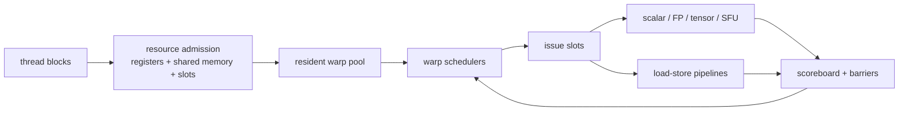

# Single Instruction, Multiple Threads (SIMT) Scheduling and Occupancy

> **First-time reader orientation:** In SIMT execution, one issued instruction controls a scheduled group of threads called a warp, while each lane keeps its own register values and activity state. Occupancy counts resident warps; eligibility counts warps actually ready to issue. High occupancy helps hide latency only until another execution or memory resource becomes the bottleneck.

> **Abbreviation key — skim now and return as needed:** graphics processing unit (GPU); instruction-level parallelism (ILP); memory-level parallelism (MLP); arithmetic logic unit (ALU); load-store unit (LSU);
> single instruction, multiple data (SIMD); simultaneous multithreading (SMT); high-bandwidth memory (HBM); level-two cache (L2); program counter (PC);
> streaming multiprocessor (SM); floating point (FP); kibibyte (KiB).

> **Prerequisites:** [GPU Architecture](01_GPU_Architecture.md) (SIMT/SM overview), [SMT, SIMD, and Vector Execution](../../01_CPU_Architecture/01_Core_Foundations/03_SMT_SIMD_and_Vector_Execution.md), and basic CUDA-like thread/block terminology.
> **Hands off to:** [GPU Memory System](../02_Memory_System/01_Coalescing_Caches_and_Shared_Memory.md) for memory transactions and [Multi-GPU Interconnect and Execution](../03_Scale_Up/01_Multi_GPU_Interconnect_and_Execution.md) above one device.

---

## 0. Why this page exists

A GPU does not make one warp's long-latency load cheap. It keeps many warps resident and issues from another while the first waits. This works only if the scheduler has eligible work, the register/shared-memory allocation admits enough warps, and independent execution/memory pipelines are balanced.

Occupancy is a capacity ceiling; issue eligibility and instruction-level parallelism determine whether that capacity becomes throughput.

## Before the details: resident does not mean ready

A GPU groups threads into warps. The warp scheduler chooses a warp whose next instruction has ready inputs and an available execution pipeline. A resident warp has allocated registers and shared memory and is present on the streaming multiprocessor; an eligible warp is resident **and** can issue now. Barriers, dependencies, memory misses, or unavailable pipelines can make many resident warps ineligible.

Occupancy is a capacity ratio determined by threads per block, registers per thread, shared memory per block, and hardware limits. It matters because more resident warps create more opportunities to hide latency. It stops helping once the scheduler already finds ready work every cycle or another resource—memory bandwidth, instruction issue, arithmetic pipelines—saturates. Excess occupancy can even force smaller register allocations and spills.

**Beginner checkpoint:** do not optimize the occupancy percentage alone. Measure eligible warps, issued instructions, stall reasons, spills, and useful throughput while varying block size and resource use.

## 1. Warp state and SIMT execution

A warp groups $W$ threads sharing an instruction issue stream. Per-warp state includes:

- PC/reconvergence state and active-lane mask;
- architectural registers per thread;
- scoreboard dependencies;
- barrier and memory-fence state;
- outstanding memory/atomic transactions;
- call/return and exception state;
- scheduling priority/age.

The scheduler issues one warp instruction to a lane group. Inactive lanes do no useful work but may still consume parts of the pipeline cycle. SIMT efficiency for instruction $i$ is

$$
\eta_{active,i}=\frac{n_{active,i}}{W}.
$$

Aggregate branch efficiency should weight by issued lane-slots, not average masks across branches.

## 2. Divergence and reconvergence

When lanes choose different control paths, the warp executes path subsets serially under masks, then reconverges. For paths $p$ with instruction counts $I_p$ and active fractions $a_p$, useful lane efficiency is approximately

$$
\eta_{div}=\frac{\sum_p a_pI_p}{\sum_p I_p}.
$$

Nested divergence needs a stack/token mechanism or independent thread scheduling state that preserves per-lane PCs and convergence. Loops with lane-dependent trip counts can keep a warp alive for one straggler lane.

Compilers reduce divergence through predication, if-conversion, data layout, and warp-uniform branches. Predication executes both sides for short regions; it trades control overhead for inactive work.

## 3. Resource-limited occupancy

For an SM with maximum resident warps $W_{max}$, registers $R_{SM}$, shared memory $S_{SM}$, block slots $B_{max}$, warp size $T_w$, block size $T_b$, registers/thread $r$, and shared memory/block $s$:

$$
B_{reg}=\left\lfloor\frac{R_{SM}}{rT_b}\right\rfloor,\quad
B_{smem}=\left\lfloor\frac{S_{SM}}{s}\right\rfloor,\quad
B_{warp}=\left\lfloor\frac{W_{max}}{\lceil T_b/T_w\rceil}\right\rfloor.
$$

Resident blocks are

$$
B_{res}=\min(B_{max},B_{reg},B_{smem},B_{warp},B_{thread}),
$$

and occupancy is resident warps divided by $W_{max}$. Allocation granularities round register/shared-memory use upward, producing occupancy cliffs.

High occupancy is not always better. Reducing registers may introduce spills to local/global memory; smaller tiles may reduce data reuse; more warps may increase cache/MHSR contention.

## 4. Latency-hiding requirement

If each scheduler issues one instruction/cycle and a warp has a dependency latency $L$, then $L$ independent ready warp-instructions are needed to fill every cycle in the worst regular case. With $S$ schedulers and issue probability/ILP factors, a rough requirement is

$$
N_{ready}\gtrsim SL/I_{warp},
$$

where $I_{warp}$ captures independent issue opportunities per warp before waiting. Real scheduling mixes instruction types and pipelines; the equation explains why occupancy alone is incomplete.

For a memory latency of 400 cycles, 32 resident warps do not hide latency if every warp issues one load then immediately waits. They need enough independent operations/loads per warp, coalesced transactions, and outstanding-memory capacity.

## 5. Scoreboarding and eligibility

A warp can be resident but ineligible because:

- source register not ready;
- destination hazard or structural scoreboard constraint;
- barrier/membar waiting;
- instruction/data cache miss;
- memory dependency or atomic completion;
- execution pipeline unavailable;
- dispatch/operand collector unavailable;
- all active lanes exited.

Schedulers need fast ready masks across many warps. Scoreboards mark pending writes and sometimes per-subregister/lane dependencies. Conservative tracking prevents hazards but can serialize independent sub-elements.

Operand collectors decouple register-bank reads from execution issue. A warp selected by policy can still fail dispatch due to bank conflicts; count selection and actual issue separately.

## 6. Warp scheduling policies

| Policy | Idea | Strength | Risk |
|---|---|---|---|
| round-robin | rotate ready warps | fairness, simplicity | weak locality, may spread stalls |
| oldest/greedy-then-oldest (GTO) | keep issuing one warp, then oldest ready | locality and fewer active working sets | younger starvation without safeguards |
| two-level | partition active/pending groups | smaller scheduler and controlled working set | promotion policy complexity |
| memory-aware | deprioritize/promote long-latency or cache-thrashing warps | reduces memory contention | prediction and fairness errors |
| criticality-aware | prioritize warps/blocks on completion critical path | tail and block progress | criticality estimation |

Policy interacts with caches. GTO may improve per-warp locality; round-robin may expose more MLP but enlarge the concurrent working set. Evaluate scheduler and memory hierarchy together.

## 7. Dual issue and pipeline balance

An SM may have several scheduler/dispatch partitions and specialized pipelines: integer, FP, tensor/matrix, special-function, load/store, branch. Peak issue requires eligible instructions of compatible types.

For pipeline class $j$ with capacity $C_j$ instructions/cycle and demand fraction $f_j$ at target issue $I$,

$$
If_j\le C_j
$$

must hold. A kernel with 40% load/store operations cannot sustain four instructions/cycle if the SM accepts one memory instruction/cycle, regardless of ALU count.

Dual-issue rules may prohibit arbitrary pairs from one warp or scheduler. Report achieved issue by pipeline and “not selected/selected but blocked” reasons.

## 8. Barriers and block residency

Barriers synchronize warps in a block. Early-arriving warps wait while the slowest finishes, but the SM can issue other blocks if resources allow. If one block consumes all shared memory, no independent block exists to hide barrier tails.

Barrier state tracks arrived threads/warps, active masks, and named barrier identity. Divergent execution must not leave active threads permanently unable to reach a required barrier.

Block-level completion affects scheduling: a nearly finished block can free a large resource allocation. Policies may prioritize its remaining warps to improve “resource liberation,” especially under tail effects.

## 9. Tensor/matrix operations

Matrix instructions describe work across lanes/fragments and feed dense tensor pipelines. They raise arithmetic throughput but require:

- operand fragment mapping and register bandwidth;
- shared-memory/global-memory tiling;
- accumulator precision and hazards;
- pipeline issue constraints;
- enough independent matrix operations to cover latency;
- synchronization around asynchronous copies.

Peak tensor operations are meaningless if fragment loads or shared-memory movement dominate. Model tensor pipeline utilization separately from overall issue and active-lane efficiency.

## 10. Preemption, context switching, and isolation

GPU context state is large: registers for thousands of threads, shared memory, barrier state, outstanding memory, and scheduler state. Preemption granularity can be instruction, warp, block, kernel, or context boundary. Finer preemption reduces latency but increases save/restore complexity and safe-point logic.

Multi-tenant designs partition SMs, time-slice contexts, or create hardware instances. Shared L2/HBM/fabric interference persists even with SM partitioning. Security requires clearing/partitioning registers, shared memory, caches, predictors, and performance state as defined.

## 11. Observability

Per kernel/SM count:

- theoretical and achieved occupancy plus limiting resource;
- resident, ready, eligible, selected, and issued warps;
- stall cycles by scoreboard, barrier, memory, instruction fetch, dispatch, pipeline;
- active lanes and branch/reconvergence efficiency;
- issue rate by pipeline and dual-issue pairing;
- register/shared-memory allocation rounding waste;
- blocks resident/completed and tail-residency time;
- tensor pipeline utilization;
- preemption/context-save latency.

Avoid “not selected” as a root cause: it may simply mean another warp was ready. The limiting signal is cycles with unused issue capacity and why no compatible warp could issue.

## 12. Numbers to remember

- Occupancy is bounded by the minimum of block, warp/thread, register, and shared-memory limits.
- Allocation granularity creates occupancy cliffs.
- Resident warps are not necessarily eligible warps.
- Latency hiding needs independent ready work and memory transactions, not only threads.
- Divergence consumes issued lane-slots even when inactive lanes produce no useful work.
- Scheduler policy changes memory locality, MLP, fairness, and block tail behavior.

## 13. Worked problems

### Problem 1 — occupancy

An SM has 65,536 registers, 64 resident-warps maximum, 16 block slots, and 128 KiB shared memory. A 256-thread block uses 64 registers/thread and 32 KiB shared memory. Register limit is $\lfloor65536/(256\times64)\rfloor=4$ blocks; shared memory also gives 4; warp capacity gives $64/(256/32)=8$. Four blocks = 32 warps = 50% occupancy.

### Problem 2 — divergence efficiency

A warp executes 20 instructions with all 32 lanes, then two divergent paths of 10 instructions each with 12 and 20 active lanes. Useful lane work is $20\times32+10\times12+10\times20=960$ lane-instructions; issued capacity is $40\times32=1280$, so active efficiency is 75%.

### Problem 3 — resource trade

Reducing registers from 64 to 48 raises residency from 4 to 5 blocks but adds 20 local-memory operations/thread. The occupancy calculator alone cannot choose. Compare added spill transactions/latency against improved ready-warp and block-tail behavior using counters or simulation.

## Cross-references

- **Overview and memory:** [GPU Architecture](01_GPU_Architecture.md), [GPU Memory System](../02_Memory_System/01_Coalescing_Caches_and_Shared_Memory.md).
- **Advanced core machinery:** [Operand Collectors, Register Files, and Scoreboards](03_Operand_Collectors_Register_Files_and_Scoreboards.md), [Independent-Thread Scheduling and Asynchronous Pipelines](04_Independent_Thread_Scheduling_and_Asynchronous_Pipelines.md).
- **Parallelism relatives:** [SMT, SIMD, and Vector Execution](../../01_CPU_Architecture/01_Core_Foundations/03_SMT_SIMD_and_Vector_Execution.md), [Systolic, Spatial, and Vector Dataflows](../../03_NPU_Architecture/01_Compute_Dataflows/02_Systolic_Spatial_and_Vector_Dataflows.md).
- **Simulation:** [GPU Simulators](../04_Simulation/01_GPU_Simulators.md).

## References

1. NVIDIA, [CUDA C++ Best Practices Guide](https://docs.nvidia.com/cuda/cuda-c-best-practices-guide/).
2. NVIDIA, [CUDA Programming Guide](https://docs.nvidia.com/cuda/cuda-programming-guide/).
3. T. Rogers, M. O'Connor, and T. Aamodt, “Cache-Conscious Wavefront Scheduling,” MICRO 2012.
4. V. Narasiman et al., “Improving GPU Performance via Large Warps and Two-Level Warp Scheduling,” MICRO 2011.
5. H. Wong et al., “Demystifying GPU Microarchitecture through Microbenchmarking,” ISPASS 2010.

---

**Navigation:** [GPU Core Architecture index](00_Index.md) · [GPU index](../00_Index.md)
