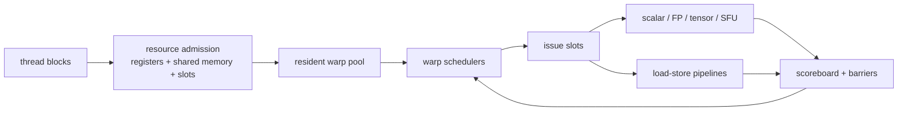
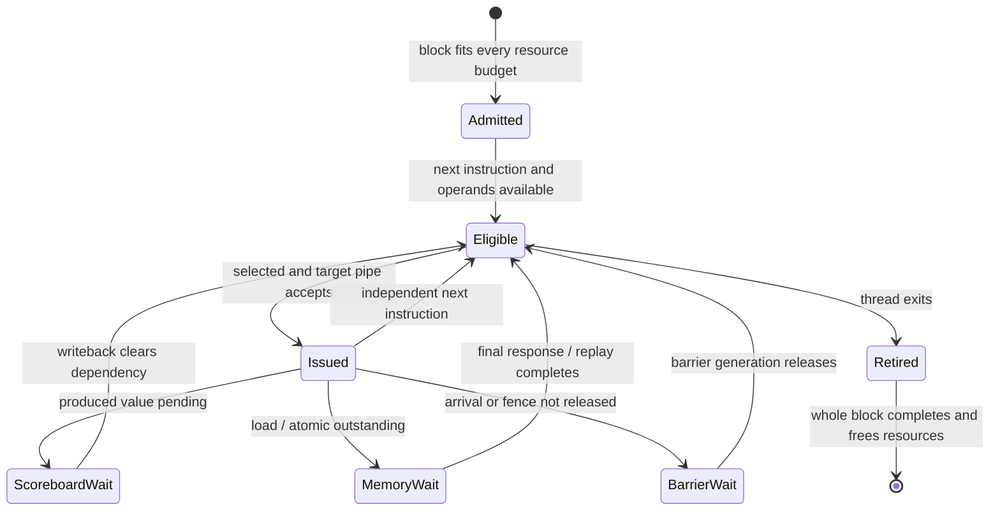
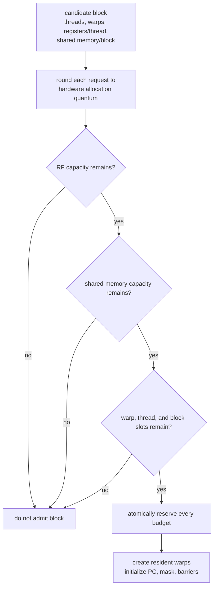
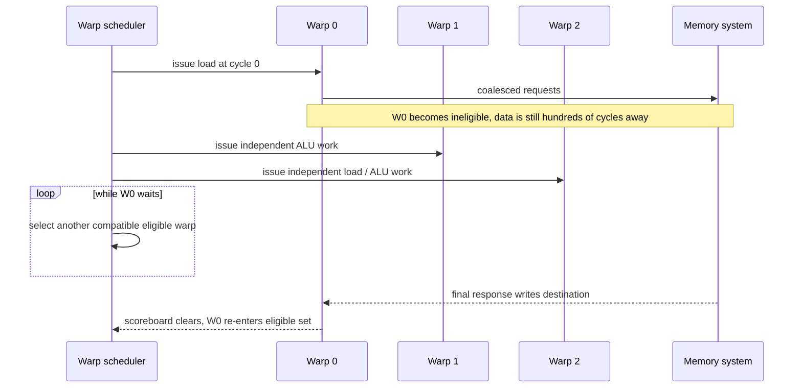
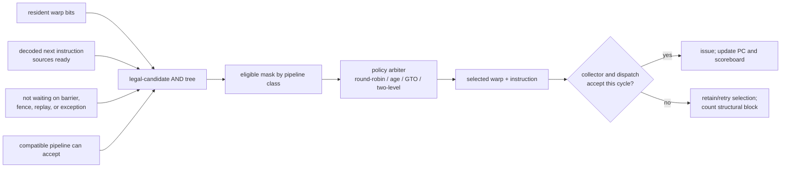
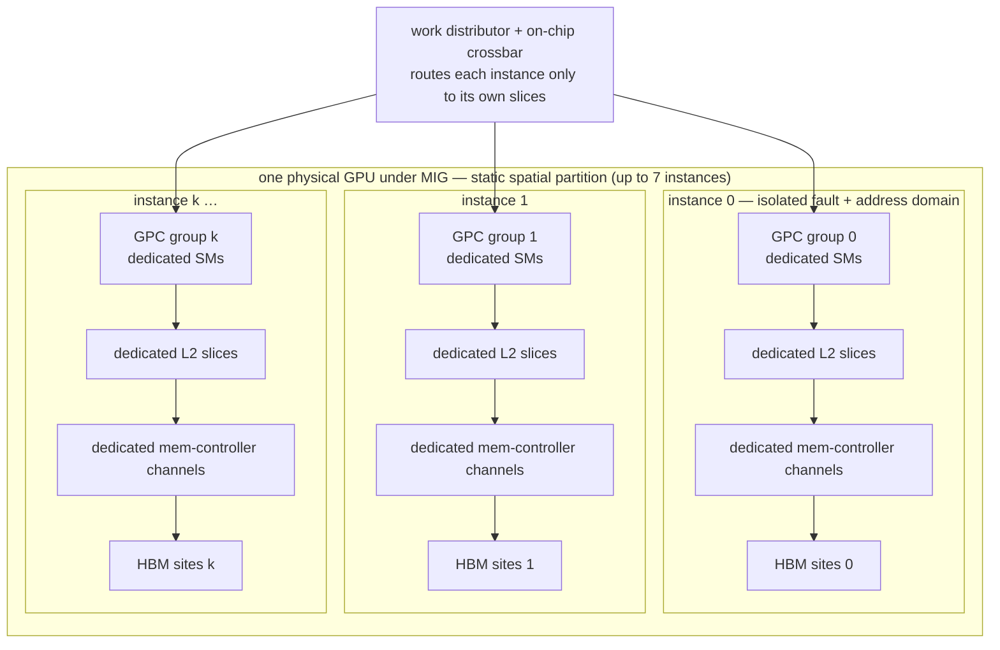

# Single Instruction, Multiple Threads (SIMT) Scheduling and Occupancy

> **First-time reader orientation:** In SIMT execution, one issued instruction controls a scheduled group of threads called a warp, while each lane keeps its own register values and activity state. Occupancy counts resident warps; eligibility counts warps actually ready to issue. High occupancy helps hide latency only until another execution or memory resource becomes the bottleneck.

> **Abbreviation key — skim now and return as needed:** graphics processing unit (GPU); instruction-level parallelism (ILP); memory-level parallelism (MLP); arithmetic logic unit (ALU); load-store unit (LSU);
> single instruction, multiple data (SIMD); simultaneous multithreading (SMT); high-bandwidth memory (HBM); level-two cache (L2); program counter (PC);
> streaming multiprocessor (SM); floating point (FP); kibibyte (KiB).

> **Prerequisites:** [GPU Architecture](01_GPU_Architecture.md) (SIMT/SM overview), [SMT, SIMD, and Vector Execution](../../01_CPU_Architecture/01_Core_Foundations/03_SMT_SIMD_and_Vector_Execution.md), and basic CUDA-like thread/block terminology.
> **Hands off to:** [GPU Memory System](../02_Memory_System/01_Coalescing_Caches_and_Shared_Memory.md) for memory transactions and [Multi-GPU Interconnect and Execution](../03_Scale_Up/01_Multi_GPU_Interconnect_and_Execution.md) above one device.

---

## 0. Why this page exists

A GPU does not make one warp's long-latency load cheap. It keeps many warps resident and issues from another while the first waits. This works only if the scheduler has eligible work, the register/shared-memory allocation admits enough warps, and independent execution/memory pipelines are balanced.

Occupancy is a capacity ceiling; issue eligibility and instruction-level parallelism determine whether that capacity becomes throughput.

### 0.1 How the scheduler evolved from the throughput objective

Begin with a lane array and one warp. It runs efficiently until an instruction waits; then every lane is idle. Each subsequent mechanism repairs the newly exposed failure:

The important split is **mechanism versus policy**. The scoreboard, barrier table, and pipeline-ready signals establish which issues are legal; scheduling policy chooses among those legal candidates. Policy may change performance or fairness, but it must never override a dependency or synchronization constraint.

## Before the details: resident does not mean ready

A GPU groups threads into warps. The warp scheduler chooses a warp whose next instruction has ready inputs and an available execution pipeline. A resident warp has allocated registers and shared memory and is present on the streaming multiprocessor; an eligible warp is resident **and** can issue now. Barriers, dependencies, memory misses, or unavailable pipelines can make many resident warps ineligible.

“Ready” is often used loosely; this state model forces precision. A warp can be dependency-ready but not **issue-eligible for a particular slot** because the required load/store, special-function, or matrix pipeline cannot accept it. Performance counters should preserve these distinctions rather than collapse them into a single stall bucket.

Occupancy is a capacity ratio determined by threads per block, registers per thread, shared memory per block, and hardware limits. It matters because more resident warps create more opportunities to hide latency. It stops helping once the scheduler already finds ready work every cycle or another resource—memory bandwidth, instruction issue, arithmetic pipelines—saturates. Excess occupancy can even force smaller register allocations and spills.

**Beginner checkpoint:** do not optimize the occupancy percentage alone. Measure eligible warps, issued instructions, stall reasons, spills, and useful throughput while varying block size and resource use.

## 1. Warp state and SIMT execution

A warp groups $W$ threads sharing an instruction issue stream. Per-warp state includes:

- PC/reconvergence state and active-lane mask;
- architectural registers per thread;
- scoreboard dependencies;
- barrier and memory-fence state;
- outstanding memory/atomic transactions;
- call/return and exception state;
- scheduling priority/age.

At admission, the block allocator reserves the warp-state entries and maps each warp to a register-file allocation. Fetch then supplies an instruction at the warp's program counter (PC); decode identifies source/destination registers and execution class; the scoreboard turns source readiness into a dependency-ready bit; barrier and memory-order logic contribute further legal bits; pipeline availability is applied last. On issue, the PC advances or changes, the destination is marked pending, and the instruction is handed to operand collection. On completion, writeback clears only the matching destination generation. This explicit sequence explains why “scheduler” is not one comparator—it is a control loop distributed across fetch, scoreboard, dispatch, and completion.

The scheduler issues one warp instruction to a lane group. Inactive lanes do no useful work but may still consume parts of the pipeline cycle. SIMT efficiency for instruction $i$ is

$$
\eta_{active,i}=\frac{n_{active,i}}{W}.
$$

Aggregate branch efficiency should weight by issued lane-slots, not average masks across branches.

## 2. Divergence and reconvergence

When lanes choose different control paths, the warp executes path subsets serially under masks, then reconverges. For paths $p$ with instruction counts $I_p$ and active fractions $a_p$, useful lane efficiency is approximately

$$
\eta_{div}=\frac{\sum_p a_pI_p}{\sum_p I_p}.
$$

Nested divergence needs a stack/token mechanism or independent thread scheduling state that preserves per-lane PCs and convergence. Loops with lane-dependent trip counts can keep a warp alive for one straggler lane.

Compilers reduce divergence through predication, if-conversion, data layout, and warp-uniform branches. Predication executes both sides for short regions; it trades control overhead for inactive work.

## 3. Resource-limited occupancy

For an SM with maximum resident warps $W_{max}$, registers $R_{SM}$, shared memory $S_{SM}$, block slots $B_{max}$, warp size $T_w$, block size $T_b$, registers/thread $r$, and shared memory/block $s$:

$$
B_{reg}=\left\lfloor\frac{R_{SM}}{rT_b}\right\rfloor,\quad
B_{smem}=\left\lfloor\frac{S_{SM}}{s}\right\rfloor,\quad
B_{warp}=\left\lfloor\frac{W_{max}}{\lceil T_b/T_w\rceil}\right\rfloor.
$$

Resident blocks are

$$
B_{res}=\min(B_{max},B_{reg},B_{smem},B_{warp},B_{thread}),
$$

and occupancy is resident warps divided by $W_{max}$. Allocation granularities round register/shared-memory use upward, producing occupancy cliffs.

Admission must be all-or-nothing because a block's warps communicate through shared memory and barriers. Reserving registers first and later discovering that shared memory does not fit would either leak capacity or require rollback. Implementations may pipeline the checks, but the architectural result must appear atomic: a partially admitted block must never become schedulable.

High occupancy is not always better. Reducing registers may introduce spills to local/global memory; smaller tiles may reduce data reuse; more warps may increase cache/MSHR contention.

## 4. Latency-hiding requirement

If each scheduler issues one instruction/cycle and a warp has a dependency latency $L$, then $L$ independent ready warp-instructions are needed to fill every cycle in the worst regular case. With $S$ schedulers and issue probability/ILP factors, a rough requirement is

$$
N_{ready}\gtrsim SL/I_{warp},
$$

where $I_{warp}$ captures independent issue opportunities per warp before waiting. Real scheduling mixes instruction types and pipelines; the equation explains why occupancy alone is incomplete.

For a memory latency of 400 cycles, 32 resident warps do not hide latency if every warp issues one load then immediately waits. They need enough independent operations/loads per warp, coalesced transactions, and outstanding-memory capacity.

Trace the intended overlap. Warp 0's miss is not accelerated; its empty cycles are filled with other warps whose next operations are independent:

This succeeds only if the other warps do not encounter the same correlated stall. If every warp misses on the same memory partition, waits at the same barrier, or targets a saturated load/store pipe, resident count is high but the eligible set still empties.

## 5. Scoreboarding and eligibility

A warp can be resident but ineligible because:

- source register not ready;
- destination hazard or structural scoreboard constraint;
- barrier/membar waiting;
- instruction/data cache miss;
- memory dependency or atomic completion;
- execution pipeline unavailable;
- dispatch/operand collector unavailable;
- all active lanes exited.

Schedulers need fast ready masks across many warps. Scoreboards mark pending writes and sometimes per-subregister/lane dependencies. Conservative tracking prevents hazards but can serialize independent sub-elements.

Operand collectors decouple register-bank reads from execution issue. A warp selected by policy can still fail dispatch due to bank conflicts; count selection and actual issue separately.

## 6. Warp scheduling policies

### 6.1 The issue decision in one cycle

For each scheduler partition, the implementation can be understood as mask construction followed by priority selection:

The diagram exposes a common modeling error: selecting a warp is not proof that it issued. A register-bank conflict or full collector may reject it after policy arbitration. A cycle-accurate simulator and RTL counter design should record at least `candidate`, `selected`, `dispatch-accepted`, and `completed` events separately.

| Policy | Idea | Strength | Risk |
|---|---|---|---|
| round-robin | rotate ready warps | fairness, simplicity | weak locality, may spread stalls |
| oldest/greedy-then-oldest (GTO) | keep issuing one warp, then oldest ready | locality and fewer active working sets | younger starvation without safeguards |
| two-level | partition active/pending groups | smaller scheduler and controlled working set | promotion policy complexity |
| memory-aware | deprioritize/promote long-latency or cache-thrashing warps | reduces memory contention | prediction and fairness errors |
| criticality-aware | prioritize warps/blocks on completion critical path | tail and block progress | criticality estimation |

Policy interacts with caches. GTO may improve per-warp locality; round-robin may expose more MLP but enlarge the concurrent working set. Evaluate scheduler and memory hierarchy together.

No policy dominates because the objective changes with the bottleneck:

| Workload condition | Feature that appears attractive | Why it can win | Losing case / required guardrail |
|---|---|---|---|
| independent arithmetic across many warps | round-robin | simple fairness and broad latency hiding | scatters the active working set and may lose instruction/data locality |
| one warp has a reusable hot tile | greedy-then-oldest (GTO) | finishes a run of local operations before switching | can delay old or critical warps; needs age/fairness escape |
| too many concurrent misses thrash L1/L2 | two-level or memory-aware throttling | limits active memory working set | too much throttling destroys memory-level parallelism (MLP) |
| a nearly complete block holds scarce shared memory | completion-aware priority | retires the block and liberates capacity | prioritizing a truly stalled tail cannot create progress |
| several pipeline classes are imbalanced | per-class arbitration / dual issue | matches ready work to idle resources | extra issue width loses when RF, collectors, or one pipeline already binds |

A policy experiment is incomplete unless it reports the mechanism by which throughput changed: eligible-set size, issue-slot utilization, cache miss/queue pressure, block release time, and fairness or tail latency.

## 7. Dual issue and pipeline balance

An SM may have several scheduler/dispatch partitions and specialized pipelines: integer, FP, tensor/matrix, special-function, load/store, branch. Peak issue requires eligible instructions of compatible types.

For pipeline class $j$ with capacity $C_j$ instructions/cycle and demand fraction $f_j$ at target issue $I$,

$$
If_j\le C_j
$$

must hold. A kernel with 40% load/store operations cannot sustain four instructions/cycle if the SM accepts one memory instruction/cycle, regardless of ALU count.

Dual-issue rules may prohibit arbitrary pairs from one warp or scheduler. Report achieved issue by pipeline and “not selected/selected but blocked” reasons.

## 8. Barriers and block residency

Barriers synchronize warps in a block. Early-arriving warps wait while the slowest finishes, but the SM can issue other blocks if resources allow. If one block consumes all shared memory, no independent block exists to hide barrier tails.

Barrier state tracks arrived threads/warps, active masks, and named barrier identity. Divergent execution must not leave active threads permanently unable to reach a required barrier.

Block-level completion affects scheduling: a nearly finished block can free a large resource allocation. Policies may prioritize its remaining warps to improve “resource liberation,” especially under tail effects.

## 9. Tensor/matrix operations

Matrix instructions describe work across lanes/fragments and feed dense tensor pipelines. They raise arithmetic throughput but require:

- operand fragment mapping and register bandwidth;
- shared-memory/global-memory tiling;
- accumulator precision and hazards;
- pipeline issue constraints;
- enough independent matrix operations to cover latency;
- synchronization around asynchronous copies.

Peak tensor operations are meaningless if fragment loads or shared-memory movement dominate. Model tensor pipeline utilization separately from overall issue and active-lane efficiency.

## 10. Preemption, context switching, and isolation

GPU context state is large: registers for thousands of threads, shared memory, barrier state, outstanding memory, and scheduler state. Preemption granularity can be instruction, warp, block, kernel, or context boundary. Finer preemption reduces latency but increases save/restore complexity and safe-point logic.

Multi-tenant designs partition SMs, time-slice contexts, or create hardware instances. Shared L2/HBM/fabric interference persists even with SM partitioning. Security requires clearing/partitioning registers, shared memory, caches, predictors, and performance state as defined.

### 10.1 Multi-Instance GPU (MIG) and spatial partitioning

The paragraph above lists three multi-tenant options — partition SMs, time-slice, or "create hardware instances" — but leaves the last unexplained. Derive it from what a datacenter actually needs: not only sharing, but performance *and* fault isolation with a per-tenant service-level objective (SLO).

**Why time-slicing and MPS are not enough.** Preemption and context switching (§10) give *temporal* isolation — one tenant owns the whole GPU during its slice — but two failure modes survive. First, **interference through shared state**: alternating tenants pollute each other's L2 sets, translation caches, and DRAM (dynamic random-access memory) row buffers, and the Multi-Process Service (MPS) — the mechanism that runs several processes' kernels *concurrently* on the shared streaming multiprocessors — has them contend for the same L2 slices and high-bandwidth memory (HBM) channels *at the same instant*. A single bandwidth-hungry neighbor then steals L2 capacity and DRAM bandwidth from everyone, and because tail latency near memory saturation diverges (the M/M/1 knee $W_q=\lambda/(\mu(\mu-\lambda))$ of [HBM §3](../02_Memory_System/02_HBM_and_Advanced_Memory_Systems.md)), a *well-behaved* tenant's 99th-percentile latency collapses through no fault of its own. Second, **no fault containment**: a hang, illegal access, or uncorrectable error in one context can stall or reset the whole device. MPS adds spatial *sharing* but no isolation whatsoever.

**Mechanism — a static spatial partition of the datapath.** Multi-Instance GPU (MIG) carves one physical GPU into up to seven **instances**, each a self-contained small GPU. The partition follows the physical hierarchy: SMs are grouped into GPU Processing Clusters (GPCs); the L2 is sliced; and HBM sits behind several memory controllers, each owning channels. An instance is assigned *dedicated* GPCs (hence SMs), *dedicated* L2 slices, and *dedicated* memory-controller channels — so it owns a fixed fraction of both HBM capacity and HBM bandwidth — plus a separate address space and fault domain. The on-chip crossbar routes each instance's traffic only to its own slices and channels; no path exists from one instance's SMs to another's L2 or DRAM. Bandwidth and faults are therefore contained *by construction*, not by scheduling policy.

Each instance owns a private GPC→L2-slice→channel→HBM path; no arc crosses an instance boundary, and *that missing arc is the isolation*. Place the three options on one axis, sharing versus isolation:

| Option | Concurrency | Isolation | Cost |
|---|---|---|---|
| time-sliced preemption / context switch (§10) | one tenant at a time | temporal only (leaves cache/row-buffer state) | save/restore cost; no overlap |
| MPS (spatial *sharing*) | many, concurrent on shared SMs/L2/HBM | none — full interference | a noisy neighbor steals bandwidth and can fault the device |
| MIG (spatial *partition*) | many, concurrent on disjoint hardware | bandwidth + capacity + fault + address space | stranded idle capacity; coarse, static granularity |

**Derivation — isolation versus utilization.** Let the GPU have aggregate bandwidth $B$ and $S$ SMs, split into $g$ instances with fractions $\phi_i$, $\sum_i\phi_i\le 1$ (some capacity is lost to partition overhead). Under MIG, instance $i$'s achievable bandwidth is $\phi_i B$ *regardless of its neighbors* — the guaranteed rate equals the allocated rate, so its tail latency depends only on its own load against its own $\phi_i B$. Under MPS/time-slicing the instantaneous bandwidth left to a tenant is $B-\sum_{j\ne i}d_j$ for whatever the co-runners demand $d_j$; once $\sum_j d_j>B$ the shared HBM saturates and *every* tenant's queueing latency diverges at the same knee. MIG's guarantee is thus the reservation-versus-statistical-multiplexing trade of network quality of service (QoS): it converts *statistical* capacity into *guaranteed* capacity.

That guarantee is not free. A static partition cannot lend an idle instance's share to a busy one: if instance $i$ runs at utilization $u_i$, the stranded fraction is $\sum_i\phi_i(1-u_i)$, permanently unusable by neighbors. Time-slicing/MPS statistically multiplex — a busy tenant borrows idle tenants' share — so their *mean* utilization is higher, bought with the loss of any guarantee. The choice is a reservation (bounded tail, stranded capacity) against over-subscription (high mean throughput, unbounded tail under an adversarial neighbor).

**Worked number — a 7-instance partition.** Take a GPU with $B=2$ TB/s aggregate HBM bandwidth, 40 GB HBM, 40 MB L2, and $S\approx 98$ SMs, split into seven equal instances. Each gets $\phi_i=1/7$: $\approx 286$ GB/s guaranteed bandwidth, $\approx 5.7$ GB HBM, $\approx 5.7$ MB L2, and 14 SMs. Now run seven tenants each needing a sustained 250 GB/s (total demand 1.75 TB/s $<$ 2 TB/s):

- *Under MIG:* each has 286 GB/s dedicated; $250<286$, so every tenant meets its SLO with headroom and the tails are independent.
- *Under MPS/shared:* let six behave (250 GB/s each) but one misbehave and stream 1.0 TB/s. Total demand $=6\times250+1000=2.5$ TB/s $>2$ TB/s → the shared HBM crosses its saturation knee, utilization $\to 1$, and $W_q$ diverges: *all seven*, including the six innocents, see tail latency spike several-fold. MIG would have capped the hog at its own 286 GB/s and protected the rest.

The isolation costs utilization: if the seven instances average $u_i=60\%$ busy, MIG strands $\sum_i\phi_i(1-u_i)=40\%$ of the GPU — bandwidth and SMs that a shared scheme could have reclaimed. MIG trades up to that $\sim40\%$ mean throughput for the bounded tail and the fault domain.

**Trade-off — when the simpler option wins.** Time-slicing/preemption (§10) wins when a *single* job wants the whole GPU's peak (training a large model — seven $1/7$ slices cannot run one big matrix multiply), or when priorities must change faster than MIG can reconfigure (repartitioning drains the instance, a coarse and slow operation). **MPS** wins when tenants are mutually trusting and bursty and the goal is maximum *utilization* — many small kernels from one pipeline that individually under-fill the GPU pack together and reclaim exactly the idle capacity MIG would strand, with no isolation needed. **MIG** wins when hard multi-tenant isolation, predictable per-tenant tail latency, and fault containment are the product requirement — right-sizing several small models onto one card under per-customer SLOs. The lesson mirrors occupancy one level up: a partition helps only when *isolation*, not raw throughput, is the binding constraint; if one workload can use the whole device, any static partition merely strands capacity.

## 11. Observability

Per kernel/SM count:

- theoretical and achieved occupancy plus limiting resource;
- resident, ready, eligible, selected, and issued warps;
- stall cycles by scoreboard, barrier, memory, instruction fetch, dispatch, pipeline;
- active lanes and branch/reconvergence efficiency;
- issue rate by pipeline and dual-issue pairing;
- register/shared-memory allocation rounding waste;
- blocks resident/completed and tail-residency time;
- tensor pipeline utilization;
- preemption/context-save latency.

Avoid “not selected” as a root cause: it may simply mean another warp was ready. The limiting signal is cycles with unused issue capacity and why no compatible warp could issue.

Use a procedural diagnosis rather than reading occupancy in isolation:

1. **Was an issue slot unused?** If no, the scheduler is not the immediate bottleneck; inspect the saturated execution or memory pipeline.
2. **Was any warp dependency-ready?** If no, split waits into long-scoreboard, barrier/fence, instruction-fetch, and memory/replay causes.
3. **Was a compatible pipeline available?** If no, compare instruction mix with per-class capacity; extra generic issue width will not help.
4. **Was a candidate selected but not dispatched?** If yes, inspect operand-collector fullness, register-bank conflicts, and dispatch-crossbar arbitration.
5. **Would more resident warps create new eligible work?** Check the binding admission resource and spill/reuse cost before reducing registers or shared memory.
6. **Are stalls correlated?** If all warps wait on the same cache partition or barrier, increasing occupancy amplifies contention rather than hiding it.

The corresponding scheduler verification plan should assert:

1. a selected group is resident, nonempty, and legal under its register, barrier, memory-order, and exception state;
2. the warp PC and destination scoreboard change only when dispatch accepts the instruction, never on a rejected selection;
3. two schedulers cannot issue the same warp instruction unless the architecture explicitly permits and identifies the pair;
4. block resources remain reserved until every warp exits and every architecturally relevant late response is completed or canceled;
5. a barrier releases only the matching block, participant set, barrier identifier, and generation;
6. an eligible warp eventually receives service under the stated fairness contract, unless higher-priority traffic is allowed to starve it explicitly;
7. reset, trap, preemption, and context teardown cannot leave a stale eligible bit pointing at a reused warp slot.

Random tests should vary dependency latency, bank/collector backpressure, barrier arrival order, block packing, and pipeline availability independently. Directed worst cases—one perpetually eligible warp, all warps targeting one pipe, simultaneous block retirement/admission, and a late completion after slot reuse—exercise bugs that average-throughput workloads rarely expose.

## 12. Numbers to remember

- Occupancy is bounded by the minimum of block, warp/thread, register, and shared-memory limits.
- Allocation granularity creates occupancy cliffs.
- Resident warps are not necessarily eligible warps.
- Latency hiding needs independent ready work and memory transactions, not only threads.
- Divergence consumes issued lane-slots even when inactive lanes produce no useful work.
- Scheduler policy changes memory locality, MLP, fairness, and block tail behavior.
- Spatial partitioning (Multi-Instance GPU, MIG) converts *statistical* capacity into *guaranteed* per-instance bandwidth/SM/L2 slices and a contained fault domain; it strands the idle capacity that time-slicing or the Multi-Process Service (MPS) would reclaim, but those expose every tenant to a noisy neighbor's tail latency.

## 13. Worked problems

### Problem 1 — occupancy

An SM has 65,536 registers, 64 resident-warps maximum, 16 block slots, and 128 KiB shared memory. A 256-thread block uses 64 registers/thread and 32 KiB shared memory. Register limit is $\lfloor65536/(256\times64)\rfloor=4$ blocks; shared memory also gives 4; warp capacity gives $64/(256/32)=8$. Four blocks = 32 warps = 50% occupancy.

### Problem 2 — divergence efficiency

A warp executes 20 instructions with all 32 lanes, then two divergent paths of 10 instructions each with 12 and 20 active lanes. Useful lane work is $20\times32+10\times12+10\times20=960$ lane-instructions; issued capacity is $40\times32=1280$, so active efficiency is 75%.

### Problem 3 — resource trade

Reducing registers from 64 to 48 raises residency from 4 to 5 blocks but adds 20 local-memory operations/thread. The occupancy calculator alone cannot choose. Compare added spill transactions/latency against improved ready-warp and block-tail behavior using counters or simulation.

## Cross-references

- **Overview and memory:** [GPU Architecture](01_GPU_Architecture.md), [GPU Memory System](../02_Memory_System/01_Coalescing_Caches_and_Shared_Memory.md).
- **Isolation and partitioning (§10.1):** [HBM and Advanced Memory Systems](../02_Memory_System/02_HBM_and_Advanced_Memory_Systems.md) (the L2 slices, memory-controller channels, and saturation knee a MIG partition fences off), [Multi-GPU Interconnect and Execution](../03_Scale_Up/01_Multi_GPU_Interconnect_and_Execution.md), [QoS, Ordering, and IO Coherence](../../04_SoC_and_Chiplet_Architecture/05_IO_and_Chiplets/01_QoS_Ordering_and_IO_Coherence.md) (reservation versus statistical multiplexing), [Page Walkers, IOMMUs, and Virtualization](../../01_CPU_Architecture/05_Virtual_Memory/02_Page_Walkers_IOMMUs_and_Virtualization.md) (isolated address spaces and fault domains).
- **Advanced core machinery:** [Operand Collectors, Register Files, and Scoreboards](03_Operand_Collectors_Register_Files_and_Scoreboards.md), [Independent-Thread Scheduling and Asynchronous Pipelines](04_Independent_Thread_Scheduling_and_Asynchronous_Pipelines.md).
- **Parallelism relatives:** [SMT, SIMD, and Vector Execution](../../01_CPU_Architecture/01_Core_Foundations/03_SMT_SIMD_and_Vector_Execution.md), [Systolic, Spatial, and Vector Dataflows](../../03_NPU_Architecture/01_Compute_Dataflows/02_Systolic_Spatial_and_Vector_Dataflows.md).
- **Simulation:** [GPU Simulators](../04_Simulation/01_GPU_Simulators.md).

## References

1. NVIDIA, [CUDA C++ Best Practices Guide](https://docs.nvidia.com/cuda/cuda-c-best-practices-guide/).
2. NVIDIA, [CUDA Programming Guide](https://docs.nvidia.com/cuda/cuda-programming-guide/).
3. T. Rogers, M. O'Connor, and T. Aamodt, “Cache-Conscious Wavefront Scheduling,” MICRO 2012.
4. V. Narasiman et al., “Improving GPU Performance via Large Warps and Two-Level Warp Scheduling,” MICRO 2011.
5. H. Wong et al., “Demystifying GPU Microarchitecture through Microbenchmarking,” ISPASS 2010.

---

**Navigation:** [GPU Core Architecture index](00_Index.md) · [GPU index](../00_Index.md)
