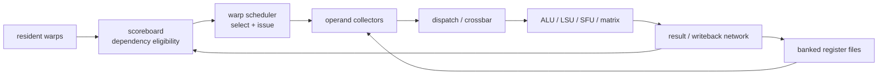
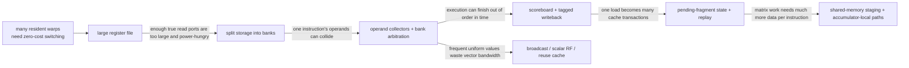
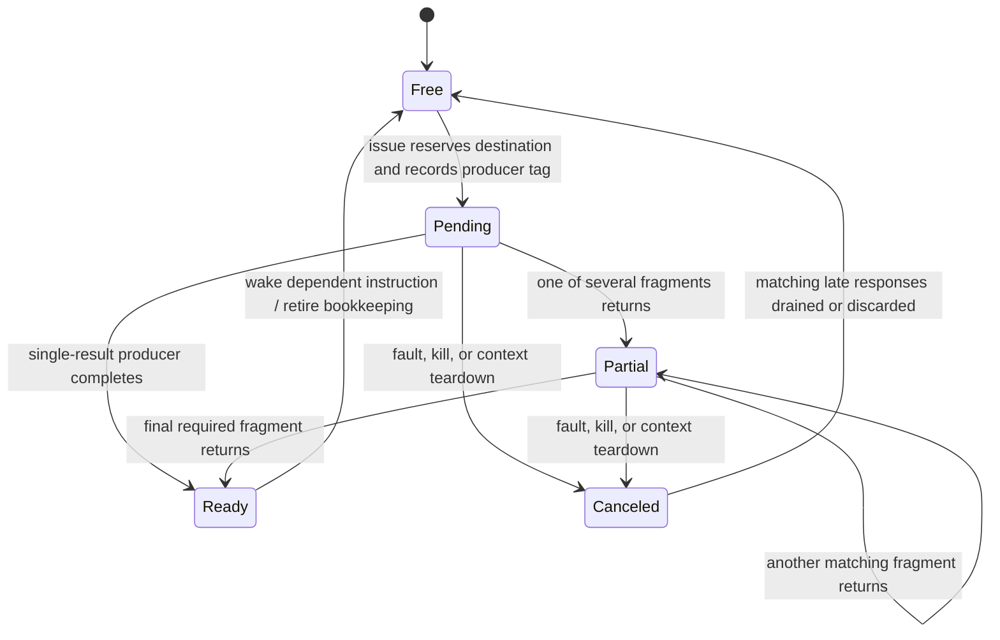
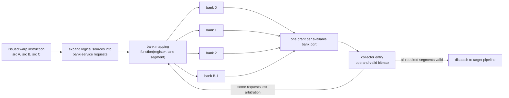
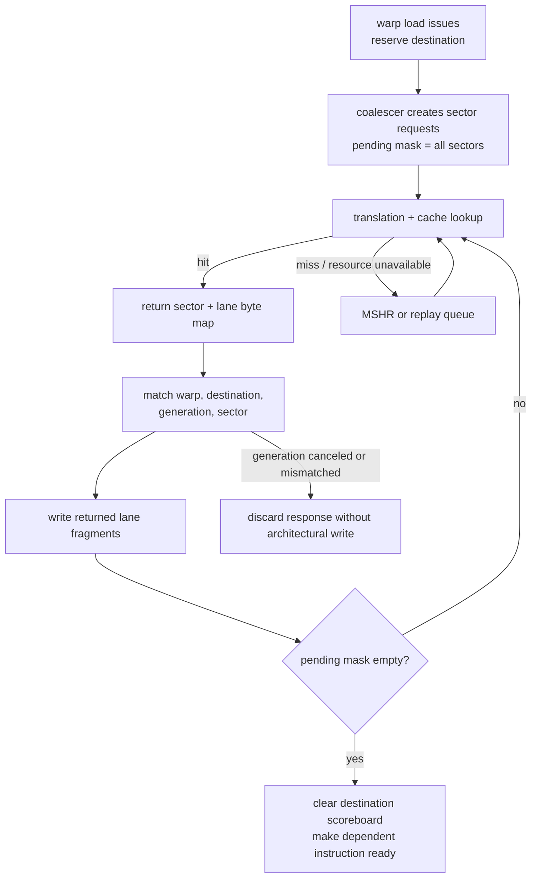
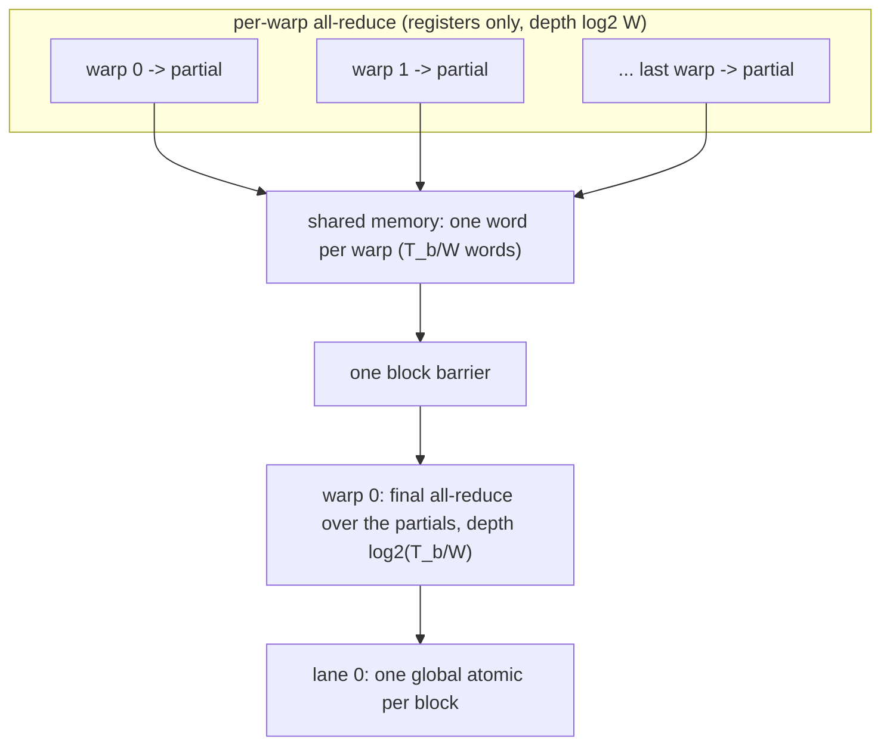

# GPU Operand Delivery — Register Files, Operand Collectors, Scoreboards, and Replay

> **First-time reader orientation:** A graphics processing unit (GPU) can keep thousands of threads ready, but its arithmetic lanes still need actual operand bits every cycle. The structures that choose a ready warp, read a heavily banked register file, collect its operands, and route them to the correct pipeline often limit performance before the arithmetic units do.

> **Abbreviation key — skim now and return as needed:** graphics processing unit (GPU); single instruction, multiple threads (SIMT); streaming multiprocessor (SM); register file (RF); vector register file (VRF); scalar register file (SRF); arithmetic logic unit (ALU); floating point (FP); load/store unit (LSU); special function unit (SFU); matrix multiply-accumulate (MMA); level-one cache (L1); instructions per cycle (IPC); first in, first out (FIFO); read-after-write (RAW); write-after-read (WAR); write-after-write (WAW).

> **Prerequisites:** [GPU Architecture](01_GPU_Architecture.md) for the streaming-multiprocessor map and [SIMT Scheduling and Occupancy](02_SIMT_Scheduling_and_Occupancy.md) for warps, residency, and eligibility.
> **Hands off to:** [Independent Threads and Asynchronous Pipelines](04_Independent_Thread_Scheduling_and_Asynchronous_Pipelines.md) for modern execution control and [GPU Memory System](../02_Memory_System/00_Index.md) for coalescing, caches, and outstanding misses.

---

## 0. Why “many ready warps” is only half the design

A warp scheduler may identify an eligible instruction, yet issue can still fail because:

- its source register banks conflict;
- no operand collector is free;
- a destination writeback collides with another result;
- the required execution pipeline is busy;
- a long-latency load has not cleared the scoreboard;
- a barrier or memory-order dependency blocks the warp.

The execution path is therefore a sequence of separately capacity-limited stages:



Peak lane count describes only `X`. Sustained throughput is the minimum capacity along the whole chain.

### 0.1 Why these structures appear in this order

The operand path is another feature-evolution chain:



Each step trades generality for feasible bandwidth. Banking replaces expensive physical ports with time-multiplexed service; collectors recover throughput by buffering around the resulting conflicts; specialized scalar, reuse, and matrix paths then avoid sending every operand through the general vector register file (VRF). A design that adds arithmetic lanes without evolving this path merely builds idle arithmetic.

## 1. Warp state and the scoreboard

A **scoreboard** tracks whether an instruction's dependencies are safe. In a simple design, decoding a destination register marks it pending; writeback clears it. A later instruction reading that register is ineligible while the bit is set.

GPU scoreboards differ from a CPU issue queue in emphasis:

- a GPU keeps state per warp and chooses among many warps rather than searching one large pool of individual operations;
- register names are usually not dynamically renamed, so false dependencies may remain within a warp;
- long memory latency is tolerated by switching to another warp instead of building a very deep OoO window;
- barriers, fences, and asynchronous-copy tokens add non-register dependencies.

An advanced scoreboard may track readiness per register, instruction class, memory transaction, barrier phase, or asynchronous event. “Warp ready” is therefore shorthand for a conjunction:

$$
ready = operands\_ready \land barrier\_clear \land memory\_legal \land pipe\_available.
$$

Keeping pipeline availability out of the persistent scoreboard can simplify state: the scheduler first finds dependency-ready warps, then arbitrates among them for current resources.

### 1.1 Reconstructing a scoreboard entry and its lifecycle

The minimum per-warp implementation needs a pending-writer indication for every architecturally visible register, plus dependency state for barriers and long-lived operations. A practical entry often separates:

- **destination identity:** register number, width or segment mask, and warp/context generation;
- **producer identity:** execution class or transaction tag, needed when several pipelines complete independently;
- **completion state:** pending fragments or lane segments, exception/replay state, and a valid bit;
- **non-register waits:** barrier generation, memory fence, asynchronous-operation group, and reconvergence state.

The generation tag prevents an old result from clearing a new warp that reused the same physical slot. The lifecycle is:



For a simple arithmetic operation, `Pending → Ready` may take a fixed number of cycles. For a coalesced load, the same logical destination can traverse `Partial` many times because different cache sectors return separately. Clearing on the first response is a silent data-corruption bug; refusing all partial completion is correct but may delay consumers that only need an independently trackable subrange. That precision-versus-state trade-off is why scoreboards may track whole registers, register groups, or segments.

## 2. Why the GPU register file is difficult

Each resident thread owns architectural registers. If an SM holds $T$ threads and each thread receives $R_t$ 32-bit registers, storage is

$$
C_{RF}=4T R_t\ \text{bytes}.
$$

For 2,048 threads at 64 registers/thread, this is 512 KiB before error protection and peripheral logic. More important, one warp instruction may request two or three operands for 32 lanes at once. Building 64–96 independent reads in a conventional multiported memory is impractical.

GPU RFs therefore use many banks and time/space multiplexing. Register mapping spreads lane/register combinations across banks. If several requests target the same bank in the same service slot, some must wait unless the hardware can broadcast one shared value.



“A bank conflict” therefore does not mean the instruction is incorrect or necessarily replayed from the beginning. It means two requests compete for a service opportunity that the physical bank cannot provide together. The arbiter grants one, retains the others as pending, and the collector remembers already returned segments. Exact bank mapping and service width are implementation-specific; the invariant is that every required active-lane segment arrives exactly once before dispatch.

The register file creates three coupled limits:

1. **capacity** limits resident warps and therefore latency hiding;
2. **bank bandwidth** limits issued operand groups;
3. **wire energy** grows because large lane-wide values travel between banks, collectors, and execution units.

This is why reducing registers per thread can improve performance even when no spill occurs: it may admit another block or warp and increase the number of alternatives the scheduler can choose.

## 3. Operand collectors

An **operand collector** is a temporary holding structure between issue and execution. It accepts an instruction, requests its source operands from RF banks over one or more cycles, stores arriving values, and dispatches only when the full operand set is ready.

Collectors decouple two mismatched widths:

- issue sees a whole warp instruction;
- the RF may deliver only a subset of its lane operands per cycle.

They also let bank arbitration interleave operands from several instructions. While instruction A waits for a conflicting bank, instruction B may collect from idle banks.

A collector entry typically holds:

- warp and instruction identity;
- destination and execution-unit class;
- one valid bit per source operand segment;
- pending bank requests;
- active-lane mask and control metadata;
- replay or exception state.

Too few collectors backpressure issue. Too many increase storage, crossbar inputs, and arbitration cost. Allocate them by observed residency time:

$$
N_{collector}\gtrsim \lambda_{issue}T_{collect},
$$

using Little's law, then add headroom for bank-conflict bursts.

### 3.1 One instruction through a collector

The control protocol can be reconstructed cycle by cycle:

```mermaid
sequenceDiagram
    participant S as Scheduler
    participant C as Free collector entry
    participant A as Per-bank arbiters
    participant R as RF banks
    participant X as Execution pipeline
    S->>C: allocate {warp, op, mask, sources, destination}
    C->>A: present pending source-segment requests
    A->>R: grant at most each bank's port capacity
    R-->>C: return tagged operand segments
    Note over C: set valid bits; keep ungranted requests pending
    loop until every required segment is valid
        C->>A: retry only pending requests
        R-->>C: capture additional segments
    end
    C->>X: dispatch assembled operands + control
    X-->>C: accept
    Note over C: entry becomes free only after acceptance
```

Backpressure must be lossless at both boundaries. If no collector is free, the scheduler must not advance the warp PC or reserve a destination as though issue succeeded. If the target pipeline refuses a fully collected instruction, the collector must retain its operands and identity; rereading the RF wastes energy and can be wrong if the architectural source is overwritten after the original read under a different execution model.

## 4. Bank conflicts and broadcast

Assume $B$ banks and $K$ independent operand requests whose bank mapping is approximately uniform. The expected number of distinct banks used is

$$
E[U]=B\left(1-\left(1-\frac{1}{B}\right)^K\right).
$$

The difference $K-E[U]$ is a first estimate of requests that collide. It is optimistic when register allocation or lane mapping creates patterns.

Hardware can mitigate conflicts with:

- more banks or dual-pumped banks;
- compiler-aware register allocation;
- bank-aware warp selection;
- operand reuse caches;
- broadcast when all lanes read one scalar value;
- separate scalar and vector register files;
- collector scheduling that steals otherwise idle banks.

AMD-style scalar datapaths make a useful principle explicit: values uniform across a wavefront need not be stored and read 32 or 64 times. A scalar register file and scalar execution unit remove redundant vector RF traffic for addresses, loop bounds, and common control.

## 5. Issue, dispatch, and pipeline specialization

“Issued” can mean the scheduler selected an instruction, while “dispatched” means collected operands entered an execution pipeline. Keeping those events separate explains why headline issue width may not equal completed instruction width.

An SM usually has several pipeline families:

- integer and FP ALUs;
- branch/control;
- load/store address and data paths;
- special functions such as reciprocal or transcendental approximation;
- tensor/matrix pipelines;
- asynchronous data-movement engines.

One instruction cannot use any arbitrary lane. Scheduler partitions, collector sets, and dispatch crossbars are often specialized to a subset of pipelines. Dual issue helps only when a warp or scheduler partition finds two independent instructions targeting compatible resources and when RF/collector bandwidth can feed both.

## 6. Writeback, bypass, and result reuse

Results return through another bandwidth-limited network. A design may:

- write the RF and wake the scoreboard;
- bypass a result directly to a following instruction;
- keep recently used operands in a small reuse cache;
- accumulate matrix results internally for several cycles before exposing them;
- route load data through a separate path.

Unlike a CPU's deeply connected bypass network, a GPU can often tolerate an extra latency cycle by scheduling a different warp. This favors energy-efficient RF writeback over universal forwarding. But tensor kernels create long dependency chains inside a small number of warps; modern designs add targeted forwarding or accumulator storage where switching warps does not hide the delay.

Writeback arbitration must preserve identity across replay. A late load response needs a warp, destination register, active mask, and generation tag. If the warp has been canceled or its slot reused, the response must be dropped.

## 7. Memory scoreboard and replay

A global-memory instruction can generate several coalesced transactions. Some sectors hit while others miss. The warp cannot blindly clear its destination when the first sector returns.

Implementations track:

- the destination register range;
- outstanding sector or request count;
- per-lane participation;
- fault and retry state;
- ordering against fences, atomics, and barriers.

Replay may occur for a cache miss, translation miss, structural conflict, or failed coalescer allocation. The instruction can remain in a replay buffer while the warp scheduler runs other work. Completion clears the scoreboard only when every required fragment has arrived and any exception decision is resolved.

This is a distributed transaction: scheduler, coalescer, cache, translation unit, and writeback path all hold pieces of its state. Transaction identity is as important in a GPU as in a CPU MSHR.



The miss status holding register (MSHR) records an outstanding cache miss so later accesses can merge with it. It is not a substitute for warp-side state: the cache may know that a sector is outstanding while only the coalescer/replay record knows which lanes and destination bytes consume it. Verification must connect these identities across module boundaries and arbitrary response order.

## 8. Matrix and tensor operand delivery

An MMA instruction consumes fragments rather than ordinary scalar operands. The visible instruction may represent many fused operations, but the microarchitecture still has to stage matrices into the format expected by the matrix pipeline.

Possible paths include:

- RF fragments collected and routed to tensor cores;
- shared-memory tiles loaded into registers first;
- asynchronous matrix instructions reading selected operands from shared memory;
- dedicated accumulator registers retained across multiple MMA steps.

The design goal is to avoid using the general RF as a high-energy conveyor belt. Hopper-era asynchronous warp-group MMA and Tensor Memory Accelerator flows make this explicit: producer warps move tiles into shared memory, consumer warp groups launch matrix work, and barriers carry readiness instead of every thread executing address and copy instructions.

## 9. Register pressure versus occupancy

If an SM contains $R_{SM}$ registers and a block has $T_b$ threads using $R_t$ registers each, the RF capacity bound on resident blocks is

$$
B_{RF}=\left\lfloor\frac{R_{SM}}{T_bR_t}\right\rfloor,
$$

after applying architecture-specific allocation granularity. The actual block count is the minimum of RF, shared-memory, warp, thread, and block limits.

Reducing $R_t$ may raise occupancy but can introduce spills to local memory. More occupancy is useful only if it produces additional *eligible* warps. The correct optimization is not “maximize occupancy”; it is “provide enough alternatives to hide the measured stall without creating spill traffic.”

## 10. Observability and verification

Counters should distinguish:

- no dependency-ready warp;
- ready warp but target pipeline busy;
- collector full;
- RF bank conflict;
- dispatch crossbar conflict;
- writeback conflict;
- memory scoreboard wait;
- barrier wait;
- register-capacity occupancy limit;
- local-memory spill traffic.

Key correctness properties include:

1. A scoreboard bit clears only after all writers for that logical destination complete.
2. A collector never combines operands from different warp generations.
3. Bank retries neither lose nor duplicate an operand.
4. Inactive lanes cannot write architectural destinations.
5. A replayed instruction completes exactly once.
6. Barriers release only the threads or warps belonging to the same barrier phase.
7. A canceled warp drops late cache, translation, and execution responses.

For performance diagnosis, walk the path in order instead of attributing every bubble to “scoreboard”:

1. If dependency-ready warps are scarce, determine whether register, memory-fragment, barrier, or asynchronous-token state holds them.
2. If ready warps exist but scheduler issue is low, inspect execution-class compatibility and arbitration policy.
3. If selected instructions exceed dispatched instructions, inspect collector allocation, RF bank grants, and dispatch acceptance.
4. If collectors remain occupied for many cycles, histogram collection latency and separate bank conflicts from a blocked target pipeline.
5. If writeback backs up, split conflicts by ALU, load return, and matrix/accumulator source; adding RF read banks cannot repair a write-port bottleneck.
6. If lowering registers/thread helps, verify whether the gain came from another resident block, less bank pressure, or a changed compiler schedule—and check that spill traffic did not move the bottleneck to memory.

## 11. Worked examples

**1 — RF occupancy bound.** An SM has 65,536 32-bit registers. A 256-thread block uses 80 registers/thread: 20,480 registers/block, so at most $\lfloor65{,}536/20{,}480\rfloor=3$ blocks fit by RF capacity. Reducing to 64 registers/thread uses 16,384 registers/block and permits four blocks—a 33% increase in block residency if no other resource binds.

**2 — Collector sizing.** Two warp instructions issue per cycle and operand collection takes 3 cycles on average. Little's law gives six occupied collectors. Eight collectors leave two entries of burst headroom; four guarantee issue backpressure even without unusual bank conflicts.

**3 — Expected bank use.** Eight requests map independently to eight banks. $E[U]=8(1-(7/8)^8)\approx5.25$ banks, so about $8-5.25=2.75$ requests collide in the first service opportunity. Mapping and broadcast can improve this; a single-cycle eight-request design cannot assume eight useful banks merely because eight banks exist.

## 12. Warp shuffle and warp/block reductions

Reductions, scans, transposes, and the softmax normalization step all need lanes of one warp to read each other's live register values. Staging those exchanges through shared memory costs a store, a barrier, and a load — plus bank-conflict risk (§3 of [Coalescing, Caches, and Shared Memory](../02_Memory_System/01_Coalescing_Caches_and_Shared_Memory.md)) — even though the datum never has to leave the register plane. A **warp shuffle** removes the round-trip: a lane-permute network in the SM datapath lets every lane read another lane's *source register* in a single issue.

### 12.1 The permute network

The shuffle unit is a width-$W$ crossbar on the register read path. Each lane supplies a source-lane index; the network routes that lane's operand back in one cycle. Hardware exposes four index-generation modes so the common patterns need no explicit index arithmetic:

- **indexed** — read an arbitrary lane $\sigma(i)$;
- **xor / butterfly** — read lane $i\oplus m$ (the exclusive-OR (XOR) bit-toggle partner), the pattern reductions and scans use;
- **up** — read lane $i-\delta$ (shift toward higher lanes);
- **down** — read lane $i+\delta$ (shift toward lower lanes).

An out-of-range or inactive source returns the requesting lane's own value, and a returned predicate flags whether the source was in range. The predicate-reduction collectives (ballot, any, all) are the one-bit case: they combine a per-lane predicate across the active mask — logical AND for *all*, logical OR for *any*, and identity for *ballot*, which returns the active mask itself.

This is the register-plane generalization of the operand-broadcast path of §4. Broadcast is the degenerate shuffle in which every lane names one common source lane; the crossbar merely widens that one-source fan-out into an arbitrary lane permutation $\sigma$. It reuses §4's insight — a value already in the register file need not make a shared-memory round-trip to move between lanes — one level up from the scalar/uniform broadcast of §2 and §4.

### 12.2 A warp reduction is a $\log_2 W$ butterfly

Let lane $i$ hold input $v_i^{(0)}=x_i$, with $W=2^p$ lanes and a reduction operator $\oplus$ that is commutative and (in exact arithmetic) associative. The XOR-butterfly reduction iterates, for $k=0,1,\dots,p-1$,

$$
v_i^{(k+1)} \;=\; v_i^{(k)} \,\oplus\, v_{\,i\oplus 2^k}^{(k)},
$$

where $i\oplus 2^k$ toggles bit $k$ of the lane index and the right operand is delivered by one xor-mode shuffle.

**Claim.** After step $k$, $v_i^{(k)}=\bigoplus_{j\in G_k(i)}x_j$, where $G_k(i)$ is the aligned block of $2^k$ lanes agreeing with $i$ in every index bit $\ge k$.

*Proof (induction on $k$).* At $k=0$, $G_0(i)=\{i\}$ and $v_i^{(0)}=x_i$. Assume the claim at $k$. The two operands cover $G_k(i)$ and $G_k(i\oplus 2^k)$ — identical high bits except bit $k$, with the low $k$ bits free. Those sets are disjoint and their union is exactly the lanes agreeing with $i$ in all bits $\ge k+1$, i.e. $G_{k+1}(i)$; commutativity and associativity let the combine ignore the order in which the two halves are merged, so $v_i^{(k+1)}=\bigoplus_{j\in G_{k+1}(i)}x_j$. $\square$

At $k=p$ every $G_p(i)=\{0,\dots,W-1\}$, so **every** lane holds the full reduction after exactly $p=\log_2 W$ steps. For $W=32$ that is **5** shuffle-and-combine rounds, with no shared memory and no barrier. The XOR form is an all-reduce — every lane ends with the total, which is what softmax needs when each lane then divides by the sum. If only one lane consumes the result (e.g. immediately before a single atomic), the **down** variant $v_i \leftarrow v_i \oplus v_{i+\delta}$ for $\delta=W/2,W/4,\dots,1$ leaves the total in lane 0 in the same $p$ steps.

### 12.3 Block reduction: two shuffle passes and one shared word per warp

A block of $T_b$ threads is $T_b/W$ warps. A whole-block reduction composes the warp primitive with a single shared-memory hop:



Only $T_b/W$ words ever touch shared memory, one barrier separates the two passes, and each block emits exactly one global atomic. The device-scope ordering that makes that atomic and the shared-memory handoff safe across blocks is the scoped consistency contract of §14 of the memory page, and the same shuffle network is what the cooperative-groups collectives and grid barrier of §13 of [Independent Threads and Asynchronous Pipelines](04_Independent_Thread_Scheduling_and_Asynchronous_Pipelines.md) build on.

### 12.4 Worked number — traffic versus a shared-memory tree

Take $T_b=1024$ ($32$ warps, $W=32$).

*Hierarchical shuffle.* Phase A: 32 independent warp all-reduces, depth 5, entirely in registers — zero shared-memory words, zero barriers. Phase B: 32 partials written to shared memory (128 B, one conflict-free 32-bank transaction). One block barrier. Phase C: warp 0 reads the 32 partials (one transaction) and all-reduces them in 5 register rounds; lane 0 issues one atomic. Totals: **1 barrier, 32 live shared-memory words, 1 atomic**.

*Pure shared-memory tree over the same 1024 values.* All 1024 values are first staged in shared memory, then reduced in $\log_2 1024 = 10$ rounds, each a shared-memory read-modify-write separated by a block barrier. Totals: **10 barriers**, 1024 live shared-memory words, and $O(T_b)$ word-accesses in the early rounds.

So the hierarchy cuts barriers from $\log_2 T_b=10$ to $1$ and the live shared-memory footprint from $T_b=1024$ to $T_b/W=32$ words — a factor of the warp width $W$ — because all intra-warp combining stays in the register plane.

### 12.5 Determinism: the tree order is part of the answer

$\oplus$ is associative only in exact arithmetic. In IEEE-754 binary32 the unit in the last place (ULP) of $1.0$ is $2^{-23}$, and $2^{-24}$ is exactly half a ULP, so $1.0\oplus 2^{-24}$ rounds to $1.0$ (round-to-nearest-even, since $1.0$'s mantissa LSB is $0$). A left-to-right sum of $\{1.0,\,2^{-24},\,2^{-24}\}$ therefore yields $1.0$; but the butterfly pairs the two small lanes first, $2^{-24}\oplus2^{-24}=2^{-23}$, then $1.0\oplus2^{-23}=1+2^{-23}$ — one full ULP larger. Both orders are legal; the result's last bit depends on the reduction tree.

The butterfly fixes one order per warp (deterministic given the lane assignment), but the final per-block atomics combine in completion order, which is not deterministic. Bit-exact reproducibility therefore requires replacing the global atomic with a fixed-order second pass (write per-block partials, then reduce them in a defined order); see §9 on atomic serialization in the memory page.

### 12.6 Trade-off, and when shared memory still wins

Shuffle wins whenever the exchange is confined to one warp's lanes and to a type the shuffle width carries directly: it spends no shared-memory capacity, no barrier, and no bank arbitration, so it both lowers latency and frees shared memory for tiles. Its limits are structural — it cannot reach across warp boundaries (a block-wide reduction still needs the one shared-memory hop above), a 64-bit or wider datum costs several shuffles, and the exchanging lanes must be converged in the same warp under the same active mask, which §2's independent-thread regrouping can change.

The simpler shared-memory tree wins when the reduction spans the whole block regardless — the barrier is paid once either way — or when the operands already live in shared memory (a tile just produced by an asynchronous copy), so staging back into registers only to shuffle would add work. Choose the shuffle for warp-scoped collectives inside a larger kernel; choose the shared-memory tree when the collective *is* the block-wide step and the data is already on chip.

## Numbers to remember

| Quantity | Typical scale | Why it matters |
|---|---:|---|
| warp/wave width | commonly 32 or 64 threads | multiplies logical operand demand |
| RF capacity per SM | tens to hundreds of KiB | often the largest local storage and an occupancy bound |
| source operands | commonly 2–3 | sets bank and collector pressure |
| collector residence | several cycles under conflict | sizes the decoupling buffer |
| resident warps | often tens per SM | scheduler alternatives for latency hiding |
| matrix instruction | many fused lane-level operations | makes operand staging more important than instruction count |
| warp reduction depth | $\log_2 W=5$ steps for $W=32$ | register-only all-reduce; no shared memory, no barrier |

## Cross-references

- [SIMT Scheduling and Occupancy](02_SIMT_Scheduling_and_Occupancy.md) explains how eligible warps are chosen.
- [Independent Threads and Asynchronous Pipelines](04_Independent_Thread_Scheduling_and_Asynchronous_Pipelines.md) adds per-thread control, barriers, and producer–consumer specialization.
- [Coalescing, Caches, and Shared Memory](../02_Memory_System/01_Coalescing_Caches_and_Shared_Memory.md) continues the memory transaction after issue.
- [NPU Systolic and Spatial Dataflows](../../03_NPU_Architecture/01_Compute_Dataflows/02_Systolic_Spatial_and_Vector_Dataflows.md) contrasts GPU RF-fed lanes with explicit accelerator dataflow.
- §12 (warp shuffle and reductions) underlies the cooperative-groups collectives and grid barrier of [Independent Threads and Asynchronous Pipelines](04_Independent_Thread_Scheduling_and_Asynchronous_Pipelines.md) §13, and its determinism depends on the scoped ordering model of [Coalescing, Caches, and Shared Memory](../02_Memory_System/01_Coalescing_Caches_and_Shared_Memory.md) §14.

## References

1. NVIDIA, “Fermi Compute Architecture Whitepaper” — [PDF](https://www.nvidia.com/content/pdf/fermi_white_papers/nvidiafermicomputearchitecturewhitepaper.pdf).
2. NVIDIA, “Volta Architecture Whitepaper” — [PDF](https://images.nvidia.com/content/volta-architecture/pdf/volta-architecture-whitepaper.pdf).
3. AMD, “CDNA Architecture Whitepaper” — [PDF](https://www.amd.com/content/dam/amd/en/documents/instinct-business-docs/white-papers/amd-cdna-white-paper.pdf).
4. A. Zulfiqar et al., “Software-Directed Techniques for Improved GPU Register File Utilization,” TACO 2018 — [NVIDIA Research](https://research.nvidia.com/publication/2018-09_software-directed-techniques-improved-gpu-register-file-utilization).
5. S. Chen et al., “Bank Stealing for Conflict Mitigation in GPGPU Register File,” 2015 — [project page](https://sc2682cornell.github.io/publication/bank/).

---

← [SIMT Scheduling and Occupancy](02_SIMT_Scheduling_and_Occupancy.md) · [Core Architecture index](00_Index.md) · next → [Independent Threads and Asynchronous Pipelines](04_Independent_Thread_Scheduling_and_Asynchronous_Pipelines.md)
