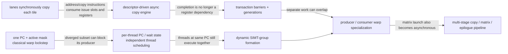
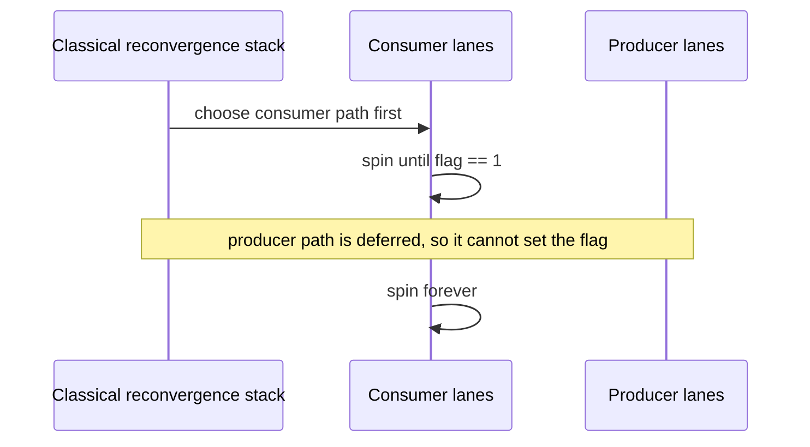
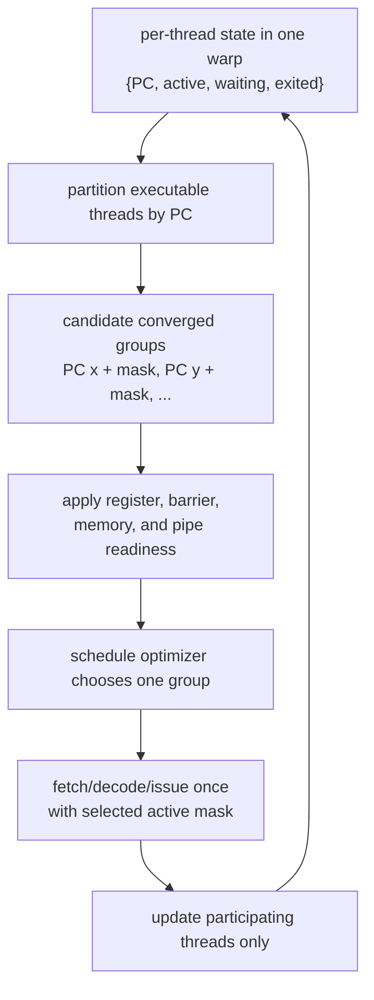
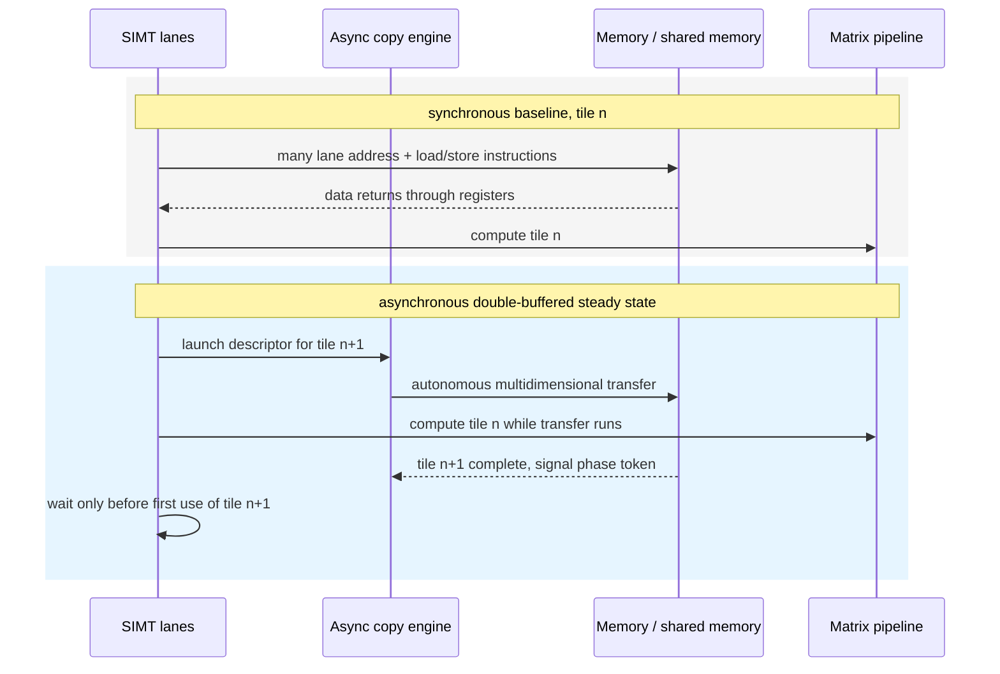
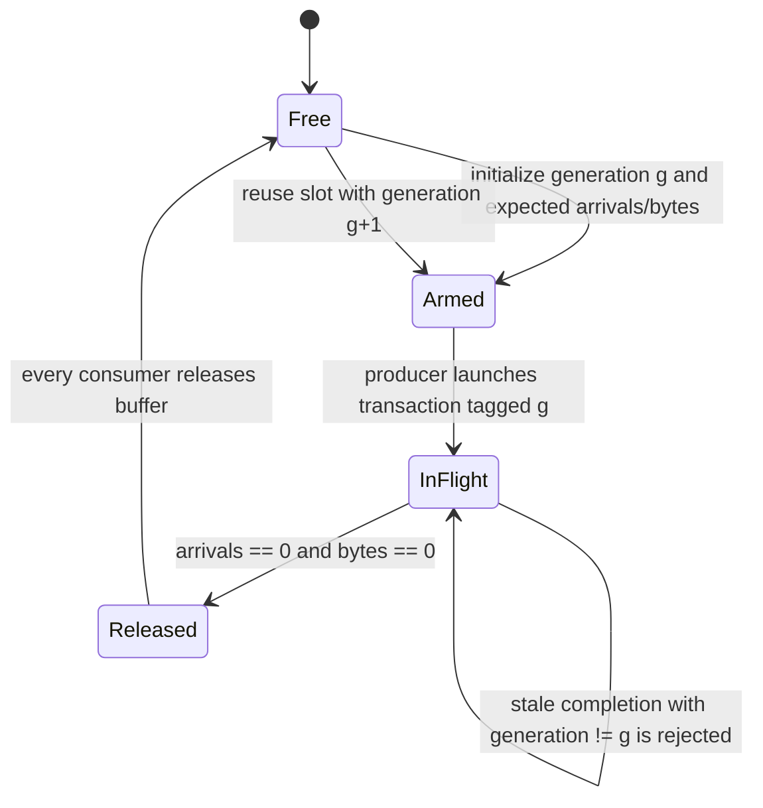
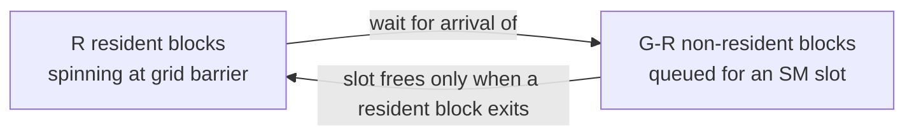

# Advanced GPU Execution — Independent Threads, Warp Specialization, and Asynchronous Pipelines

> **First-time reader orientation:** Traditional GPU explanations say that all threads in a warp share one program counter and execute in lockstep. That is a useful starting model, but modern GPUs keep finer-grained thread state and add autonomous copy and matrix engines. Performance increasingly comes from coordinating specialized producer and consumer warps rather than making every thread perform every step.

> **Abbreviation key — skim now and return as needed:** graphics processing unit (GPU); single instruction, multiple threads (SIMT); streaming multiprocessor (SM); program counter (PC); cooperative thread array (CTA); GPU processing cluster (GPC); distributed shared memory (DSM); Tensor Memory Accelerator (TMA); matrix multiply-accumulate (MMA); warp-group matrix multiply-accumulate (WGMMA); global memory (GMEM); shared memory (SMEM); level-one cache (L1); level-two cache (L2); first in, first out (FIFO).

> **Prerequisites:** [SIMT Scheduling and Occupancy](02_SIMT_Scheduling_and_Occupancy.md) for the classical warp model and [GPU Operand Delivery](03_Operand_Collectors_Register_Files_and_Scoreboards.md) for scoreboards and register delivery.
> **Hands off to:** [Coalescing, Caches, and Shared Memory](../02_Memory_System/01_Coalescing_Caches_and_Shared_Memory.md) for memory behavior and [Multi-GPU Execution](../03_Scale_Up/01_Multi_GPU_Interconnect_and_Execution.md) for cooperation beyond one GPU.

---

## 0. The change in mental model

The old mental model is:

> fetch one instruction for a warp, execute it for every active lane, and use a reconvergence stack when lanes branch.

The modern mental model is:

> maintain enough per-thread control state to form executable SIMT groups dynamically, and coordinate several asynchronous engines with explicit dependency tokens.

The machine is still a throughput processor. It does not become 32 tiny out-of-order CPUs. Instructions are still issued in SIMT groups and share execution pipelines. The added state makes divergence, fine-grained synchronization, and producer–consumer pipelines more flexible.

The features in this chapter form two connected evolution paths:

Independent thread scheduling (ITS) repairs a control-progress problem; asynchronous engines repair an issue-bandwidth and overlap problem. Neither creates free throughput. ITS consumes finer-grained control state and may execute smaller masks; asynchronous operation consumes descriptors, queues, buffers, barrier phases, and memory bandwidth.

## 1. Classical reconvergence

Before independent thread scheduling, a warp commonly carried one PC, one active mask, and a stack of reconvergence records. At a divergent branch:

1. evaluate the branch for all active lanes;
2. choose one path and mask off lanes taking the other;
3. push the deferred path and reconvergence PC;
4. execute the chosen path;
5. pop and execute the deferred path;
6. reunite lanes at the reconvergence point.

This model is efficient when divergence is structured and short. It is awkward when threads in one warp need to wait for or signal one another. If the currently executing subset spins while the producer subset is masked off, software can deadlock even though the source code appears to have runnable threads.

This is not a cache-coherence failure: the producer instruction is structurally prevented from issuing. Classical structured branches avoid the pattern because each path runs to the immediate post-dominator; ad hoc warp-synchronous communication can violate that assumption. Finer per-thread wait state lets the consumer subset suspend so an executable producer subset can be formed.

## 2. Independent thread scheduling

Volta-class NVIDIA GPUs introduced execution state per thread, including a PC and call stack, plus a schedule optimizer that groups active threads from the same warp into SIMT issue units. “Independent” means threads may be suspended and regrouped at sub-warp granularity; it does not promise that arbitrary threads issue independently every cycle.

Microarchitectural state now includes:

- per-thread PC and call/return state;
- active, exited, waiting, and barrier state;
- reconvergence metadata or compiler-provided convergence information;
- warp-level register allocation and shared-memory ownership;
- masks identifying the threads participating in an issued instruction.

This enables fine-grained synchronization but removes implicit warp-synchronous assumptions. Code that exchanges data through shared memory must use an explicit warp or group synchronization primitive when required. The hardware is free to regroup threads differently from older lockstep behavior.

### 2.1 What the scheduler actually chooses

A useful abstraction is two-level selection:

1. choose a warp with at least one executable thread group;
2. form or select a converged group at the same PC and issue its instruction with an active mask.

The group may contain all lanes, a branch subset, or threads released by a fine-grained event. Group formation trades utilization against scheduling flexibility: waiting briefly may reconverge more lanes; issuing immediately reduces latency but may execute the same instruction again for another subset.

The implementation must retain warp ownership even when the issued mask is a subset: register allocation, block identity, exception context, and most pipeline resources remain warp- or block-scoped. A scheduler that independently mixes lanes from unrelated warps would need a different register-addressing and recovery contract; ITS does not imply that design.

## 3. From synchronous copies to asynchronous operations

In a synchronous tiled kernel, threads calculate addresses, issue global loads, wait, write shared memory, synchronize, and then compute. The same SIMT lanes and registers act as a data-movement engine and arithmetic engine.

Asynchronous copy separates initiation from completion:

1. issue a descriptor describing a transfer;
2. receive a transaction or barrier token;
3. continue independent computation;
4. wait only before consuming the destination tile.

The dependency is no longer “instruction B waits for register r7.” It becomes “consumer phase 3 waits for transaction count 4096 bytes.” Scoreboards and barriers therefore expand beyond register readiness.

The baseline and the added mechanism differ in where the wait occurs:

The async version removes per-element address/copy instructions and intermediate registers from the lanes, but the destination buffer still cannot be read early or overwritten late. The design therefore trades implicit in-order waiting for explicit ownership and completion state.

## 4. Tensor Memory Accelerator

Hopper's **Tensor Memory Accelerator (TMA)** is a dedicated engine for moving one- to five-dimensional tensors between global and shared memory, and between shared memories in a thread-block cluster. A small number of threads—or one elected thread—can launch a large transfer described by base address, shape, strides, and element format.

Microarchitecturally, TMA removes repeated work from the SM pipelines:

- lane-by-lane address generation;
- many load instructions;
- intermediate registers holding copied data;
- explicit per-thread stores into shared memory.

It adds descriptor storage, address-generation hardware, bounds/fill behavior, request queues, and completion signaling. The copy engine still competes for cache, memory, and shared-memory bandwidth; “asynchronous” hides latency but does not create bandwidth.

## 5. Transaction barriers

A normal barrier counts arriving threads. An asynchronous transaction barrier must account for both thread arrival and outstanding byte or transaction completion. Conceptually, a barrier phase contains:

- an expected arrival count;
- an expected transaction count or byte count;
- a phase/generation bit;
- waiters to release when both reach zero.

Generation identity is essential. If a double-buffered loop reuses barrier slot 0 for tile 2 while a late completion from tile 0 arrives, that completion must not release the new phase. This is the asynchronous equivalent of preventing a stale cache response from completing a recycled miss entry.

The barrier must define atomicity between arming and launching. If completion can race ahead of expected-count initialization, the counter may underflow or a waiter may observe a false release. A robust protocol either initializes before the engine can complete, or uses a combined arrive-and-expect operation whose ordering is guaranteed by the interface.

## 6. Warp specialization

**Warp specialization** assigns different roles to warps in one thread block or cluster:

- producer warps launch TMA transfers;
- consumer warps issue matrix operations;
- another warp may perform epilogue, reduction, or output stores;
- control warps manage barriers and tile descriptors.

Specialization improves efficiency when the roles overlap. If transfer time is $T_m$, matrix time is $T_c$, and epilogue time is $T_e$, a well-buffered steady-state tile interval approaches

$$
T_{tile}\approx\max(T_m,T_c,T_e)
$$

rather than their sum. This is the same max-versus-sum benefit as double buffering in an NPU scratchpad.

For a two-buffer implementation, the steady-state control loop is procedural:

1. A producer acquires buffer `b = tile mod 2` only after its **free** barrier for the previous generation releases.
2. It arms the buffer's **ready** barrier with the new generation and expected byte count, then launches the descriptor carrying that generation.
3. While the engine fills `b`, consumers operate on the other buffer. The producer may sleep; its warp slot and registers remain allocated.
4. The engine's final matching completion releases `ready[b]`. Consumer warps acquire that phase before any shared-memory read.
5. Consumers launch all matrix operations using `b`, wait for those operations before reusing their source storage, perform any required epilogue, and release `free[b]` only after the final read.
6. The next producer generation may now overwrite `b`. Early free corrupts live operands; late free creates a bubble; a missing release deadlocks the block.

This protocol makes buffer ownership explicit and is sufficient to reconstruct the essential controller: two buffer-state records, ready/free phase generations, expected transaction counts, producer/consumer participation masks, and launch/completion tags.

### 6.1 Costs and deadlocks

Specialized warps consume registers and warp slots even when waiting. A producer waiting for a free buffer can deadlock with consumers that were not admitted because producer resources reduced occupancy. Cluster kernels add another constraint: all blocks in a cluster must be co-scheduled.

A safe protocol needs:

- bounded buffers with explicit full/free phases;
- acquire before consume and release after final use;
- consistent barrier participation masks;
- enough resident producer and consumer roles to make progress;
- cancellation behavior for exceptions or early exit.

The architecture must guarantee forward progress under its scheduling rules; software must obey the documented barrier protocol.

## 7. Asynchronous matrix execution

Tensor cores decouple one visible instruction from many internal multiply-accumulates. Hopper adds warp-group matrix operations that are launched by a cooperating group of warps and may read operands from shared memory. The instruction creates an in-flight matrix transaction; later wait operations limit how many groups remain outstanding or ensure results are ready.

This changes the critical resource set:

- matrix-operation queue depth;
- shared-memory read bandwidth;
- accumulator register capacity;
- dependency-group identifiers;
- barrier and completion bandwidth;
- producer–consumer balance.

A scoreboard that only knows “register ready” is insufficient. It must represent outstanding matrix groups and the ordering of accumulator use.

## 8. Thread-block clusters and distributed shared memory

Thread-block clusters group blocks that are co-scheduled within a GPU processing cluster. Blocks can synchronize at cluster scope and access each other's shared memory as **distributed shared memory (DSM)**.

DSM creates an intermediate locality level:

$$
\text{local SMEM} < \text{remote DSM} < \text{L2/global memory}
$$

in expected latency and energy, although exact values are implementation-dependent. It can hold a tile too large for one SM, enable inter-block reductions, or multicast data to several consumer blocks.

The microarchitecture requires routing, address translation from cluster rank to target SM, remote-bank arbitration, atomics, and cluster-lifetime protection. A block must not exit while another block can still access its shared memory. Cluster admission also creates fragmentation: a cluster needing eight blocks cannot launch until enough compatible SM capacity is available together.

## 9. Persistent kernels and dynamic work distribution

A conventional grid launches many blocks and lets a global distributor assign them. A persistent kernel launches roughly enough blocks to occupy the machine and pulls tasks from a software queue. This keeps state resident, supports fine-grained dynamic workloads, and can reduce launch overhead.

It shifts scheduling into the kernel:

- atomic or distributed work queues assign tasks;
- work stealing balances uneven task durations;
- explicit termination detection replaces grid completion;
- long-lived state raises fairness and preemption concerns;
- queue contention can become the new serial bottleneck.

Persistent execution combines naturally with warp specialization: one role fetches descriptors while others process them. It is especially useful for irregular graphs, mixture-of-experts token batches, and fused multi-stage pipelines.

## 10. Resource accounting for an asynchronous pipeline

For $K$ pipeline stages and $D$ tiles buffered, account for:

- shared memory: $D$ copies of live tile storage;
- barriers: at least one ready/free phase per reusable buffer;
- TMA descriptors and outstanding slots;
- producer and consumer warp slots;
- accumulator registers for outstanding matrix groups;
- memory requests generated by all prefetched tiles.

More buffering helps only until another resource binds. If memory latency is $L$ cycles and a new tile is consumed every $T$ cycles, the number of in-flight tiles needed to cover latency is roughly

$$
D\gtrsim\left\lceil\frac{L}{T}\right\rceil.
$$

If shared-memory capacity only permits two buffers while the ratio is four, the kernel cannot fully hide latency without smaller tiles, more work per tile, or additional occupancy.

### 10.1 When the added machinery loses

Asynchrony wins only when useful overlap exceeds its setup and resource cost. A rough lower bound for $N$ tiles is

$$
T_{async}\approx T_{fill}+(N-1)\max(T_m,T_c,T_e)+T_{drain}+N T_{control},
$$

where $T_{control}$ includes descriptor creation, barrier operations, and queueing. Compare it with $T_{sync}=N(T_m+T_c+T_e)$. Small $N$, tiny tiles, or a dominant stage with no overlap opportunity may not amortize fill/drain and control. Other losing cases are structural:

| Added feature | Helps when | Loses when | Observable evidence |
|---|---|---|---|
| deeper buffering | latency exceeds tile consumption interval | shared memory or accumulators reduce resident blocks | occupancy limiter changes; buffer memory rises; exposed latency does not fall |
| producer warp specialization | copy/control work can overlap consumers | producer holds scarce registers/warp slots but is mostly idle | producer idle high; consumer admission or ready-warps low |
| TMA-style copy | regular multidimensional tiles amortize a descriptor | tiny or highly irregular transfers waste setup and fragment memory requests | low bytes/descriptor; queue/translation stalls; no instruction-count benefit |
| asynchronous matrix groups | several independent reductions can remain in flight | accumulator capacity or shared-memory reads serialize them | matrix queue full or accumulator-limited occupancy |
| clusters and distributed shared memory | remote reuse avoids L2/global traffic | cluster co-scheduling fragments capacity or remote banks contend | cluster admission delay; remote-DSM latency/conflict counters |

The optimization order is therefore: identify the serial stage, prove that overlap exists, size the minimum depth that covers it, then verify that the extra state did not reduce residency enough to expose a larger stall.

## 11. Verification and counters

Hardware properties should cover:

1. a barrier phase cannot observe completion from an older generation;
2. a TMA destination is not readable before its transaction completes;
3. no shared-memory buffer is overwritten before every consumer releases it;
4. inactive or exited threads do not count toward the wrong barrier;
5. cluster blocks are admitted and retired as a legal group;
6. remote DSM access cannot outlive the target block;
7. outstanding matrix groups retire in the documented dependency order;
8. preemption or fault handling preserves or cancels asynchronous state consistently.

Counters should separate TMA queue full, barrier wait, tensor queue full, SMEM bank conflict, DSM remote traffic, cluster admission delay, producer idle, consumer idle, and epilogue bottleneck.

Debug the pipeline by following one `(block, buffer, generation, tile)` identity across modules. Log descriptor launch, barrier arm, each transaction completion, ready release, first consumer read, matrix-group launch/completion, final consumer release, and next overwrite. Then check both safety and liveness: no read-before-ready or overwrite-before-free, and every armed phase eventually either releases or is explicitly canceled. Aggregate utilization counters alone can hide a rare stale-generation release that corrupts one tile after millions of correct ones.

## 12. Worked examples

**1 — Pipeline overlap.** Transfer takes 320 cycles, matrix compute 500, and epilogue 140. Serial execution costs 960 cycles/tile. With enough buffers and roles, steady-state cost approaches $\max(320,500,140)=500$ cycles/tile, a theoretical $960/500=1.92\times$ throughput increase. Compute remains the bottleneck.

**2 — Buffer depth.** Memory-to-shared latency is 900 cycles and consumers use one tile every 300 cycles. At least $\lceil900/300\rceil=3$ tiles must be in flight. Double buffering cannot fully cover the latency; triple buffering can, if shared memory and TMA slots permit.

**3 — Cluster admission.** An eight-block cluster uses one block per SM. A GPC has 16 suitable SM slots, so two clusters can reside. If unrelated work occupies one slot, only one whole cluster fits even though seven slots remain idle. This is the cluster-fragmentation trade-off behind co-scheduling guarantees.

## 13. Cooperative groups and grid-wide synchronization

The block barrier of §1–§2 synchronizes the threads of one block; it cannot make one block wait for another. Yet several single-kernel algorithms need exactly that grid-wide barrier: a large reduction that must combine every block's partial before a final pass, iterative solvers and graph/breadth-first sweeps that alternate a compute step with a global exchange each level, the persistent kernels of §9 that reuse resident state across many rounds, and some fused-attention variants that reduce across the grid. Splitting at each such point into separate kernel launches is always possible; this section derives when a single kernel can instead carry the barrier itself, and what the hardware must guarantee for that to be safe.

### 13.1 Why the grid must be co-resident

Let the grid have $G$ blocks, the GPU have $M$ streaming multiprocessors, and let the kernel's occupancy admit at most $\omega$ resident blocks per SM, where

$$
\omega=\min\!\left(\left\lfloor\frac{\text{warp slots}}{w_b}\right\rfloor,\ \left\lfloor\frac{R_{SM}}{T_b R_t}\right\rfloor,\ \left\lfloor\frac{S_{SM}}{S_b}\right\rfloor,\ \beta_{\max}\right)
$$

is the minimum over the warp-slot, register ($R_t$ per thread, $T_b$ threads per block), shared-memory ($S_b$ per block), and hardware block-slot ($\beta_{\max}$) limits — the same occupancy bound as §9 of [GPU Operand Delivery](03_Operand_Collectors_Register_Files_and_Scoreboards.md). The machine can therefore hold at most

$$
R \;=\; M\,\omega
$$

blocks at once. If $G>R$, only $R$ blocks are resident; the remaining $G-R$ wait in the launch queue for an SM slot, and a slot frees **only when a resident block exits the kernel**.

Now arm a grid barrier. Every resident block reaches it and spins until all $G$ blocks have arrived. But the $G-R$ non-resident blocks cannot arrive — they were never scheduled — and the resident blocks cannot exit — they are spinning at the barrier. The two waits close a cycle:

The over-subscribed grid deadlocks. Hence a grid barrier is legal only when the whole grid is co-resident,

$$
G \;\le\; R \;=\; M\,\omega,
$$

and a **cooperative launch** enforces exactly this ceiling: it refuses to launch a grid larger than the co-resident capacity computed from the kernel's own occupancy. Work beyond $R$ blocks must be folded into each block as a grid-stride loop *between* barriers, never added as more blocks.

### 13.2 The global barrier handshake

Given co-residency, a grid barrier is a centralized sense-reversing barrier whose "processors" are blocks and whose shared state — an arrival counter and a release flag — lives in device-scope global memory, with the L2 as the atomic and coherence point. Each episode alternates an expected sense $s\in\{0,1\}$:

1. one elected thread per block performs a device-scope atomic increment of the arrival counter;
2. if it is the $G$-th arriver, it resets the counter and writes the release flag to $s$ with a **device-scope release**, publishing every prior write of its block;
3. otherwise it spins, reading the flag with a **device-scope acquire** until it observes $s$;
4. a block barrier then propagates the release to all threads of the block;
5. the next barrier episode uses sense $\lnot s$.

Sense reversal is what lets a fast block that laps the others avoid mistaking the previous episode's release for the current one: because the expected value alternates, a stale flag left from episode $t$ never satisfies the wait of episode $t{+}1$. The ordering annotations are not decoration. The counter and flag are shared across SMs, so a *block*-scope release would publish the producer's writes only within its own L1 and leave them invisible to a consumer block on another SM — precisely the scope-to-cache-level mapping of §14 of [Coalescing, Caches, and Shared Memory](../02_Memory_System/01_Coalescing_Caches_and_Shared_Memory.md). The handshake must synchronize at device scope so the writes reach the shared L2.

### 13.3 Cooperative Groups as an explicit-scope discipline

**Cooperative Groups (CG)** is the software layer that names a synchronization domain as a first-class object and binds it to the hardware mechanism that can synchronize *that* domain:

| Group | What it is | Underlying mechanism |
|---|---|---|
| tiled partition ($\le$ warp) | a static power-of-two lane group | shuffle network + active-mask collectives, §12 of [GPU Operand Delivery](03_Operand_Collectors_Register_Files_and_Scoreboards.md) |
| coalesced group | the currently-converged lanes, renumbered $0..n{-}1$ | a handle on the ITS active mask of §2 |
| thread block | all threads of one block | shared memory + block barrier |
| cluster | co-scheduled blocks in a GPC | cluster-scope barrier over distributed shared memory, §8 |
| grid | all blocks of the grid | the global handshake of §13.2 under a cooperative launch |

A tile's reduce, scan, ballot, any, and all are thin wrappers over the warp primitives of §12; a coalesced group is the ITS active mask made addressable so a shuffle indexes the *group*, not the physical lane. The value of the discipline is that the synchronization scope becomes explicit in the algorithm and is matched to the cheapest sufficient mechanism — a shuffle for $\le$ warp, a shared-memory barrier for a block, a cluster barrier for co-scheduled blocks, a global counter for the grid.

### 13.4 Worked number — the grid-sync ceiling

Take $M=132$ SMs and a kernel whose occupancy allows $\omega=2$ resident blocks per SM. Then $R=M\omega=264$ blocks may participate in a grid barrier; at $256$ threads per block that is $67{,}584$ co-resident threads. A cooperative launch caps the grid at 264 blocks — request 265 and the launch is rejected, because by §13.1 it would deadlock. To reduce $N=10^8$ elements in one kernel, each of the 264 blocks grid-strides over $\approx N/R \approx 3.8\times10^5$ elements, the grid barrier runs once, and a final pass combines the 264 partials. If the kernel instead consumes enough shared memory to force $\omega=1$, the ceiling halves to $R=132$ and the per-block stride doubles.

### 13.5 Trade-off versus multiple kernel launches

Splitting the algorithm at each global sync point into separate launches gives an *implicit* grid barrier: kernel $k{+}1$ does not begin until kernel $k$'s grid has fully retired, enforced by the stream, and that retirement is itself a device/system-visible ordering point. Its costs and benefits mirror the in-kernel barrier:

| | Grid barrier (single kernel) | Multiple launches |
|---|---|---|
| grid size | capped at $R=M\omega$ (no oversubscription) | any size; oversubscribe freely |
| load balance | a straggler block stalls all; poor tail behavior | later waves absorb imbalance |
| state across the barrier | registers, shared memory, warm L2 kept resident | cold restart; state re-read from global memory |
| per-barrier cost | one global-atomic handshake, growing with block count | full kernel relaunch latency |
| best when | many cheap iterations (solvers, BFS levels) | few sync points, large per-phase work |

The simpler multiple-launch structure wins when sync points are few and each phase does enough work to amortize relaunch, when the grid must oversubscribe for load balance, or when portability without cooperative-launch guarantees matters. The grid barrier wins when iterations are numerous and cheap and keeping state resident across the barrier — the same residency argument as the persistent kernels of §9 — dominates the relaunch overhead it removes.

## Numbers to remember

| Quantity | Typical scale | Why it matters |
|---|---:|---|
| NVIDIA warp | 32 threads | basic SIMT scheduling and specialization unit |
| thread-block cluster | portable size up to 8 blocks in CUDA | co-scheduled locality across SMs |
| TMA tensor rank | 1D through 5D transfers | moves multidimensional tiles without lane address loops |
| buffering | commonly 2–4 live tiles | overlaps transfer, matrix, and epilogue stages |
| warp group | multiple cooperating warps | launch unit for advanced matrix operations |
| asynchronous identity | slot plus phase/generation | prevents stale completion from releasing reused state |
| grid-sync ceiling | $R=M\omega$ co-resident blocks | cooperative-launch cap; an over-subscribed grid deadlocks |

## Cross-references

- [GPU Operand Delivery](03_Operand_Collectors_Register_Files_and_Scoreboards.md) explains the scoreboard and RF underneath these mechanisms.
- [GPU Memory System](../02_Memory_System/00_Index.md) follows TMA and DSM traffic through caches and high-bandwidth memory.
- [AI Workload and Operator Mapping](../05_AI_Workloads_and_Serving/01_AI_Workload_and_Operator_Mapping.md) shows how GEMM and attention kernels use producer/consumer warps, asynchronous tiles, and matrix pipelines.
- [End-to-End GPU AI Inference and Serving](../05_AI_Workloads_and_Serving/02_End_to_End_GPU_AI_Inference_and_Serving.md) connects persistent execution and dynamic work queues to continuous batching and MoE serving.
- [NPU Transformer and Attention Engines](../../03_NPU_Architecture/01_Compute_Dataflows/03_Transformer_and_Attention_Engine_Microarchitecture.md) shows how similar producer–consumer pipelines appear in dedicated accelerators.
- [NPU Decoupled Access–Execute](../../03_NPU_Architecture/02_Mapping_and_Memory/03_Decoupled_Access_Execute_and_Scratchpad_Scheduling.md) generalizes descriptors, scratchpad phases, and event tokens.
- The grid barrier of §13 rests on the warp shuffle collectives of [GPU Operand Delivery](03_Operand_Collectors_Register_Files_and_Scoreboards.md) §12 and the scoped consistency model of [Coalescing, Caches, and Shared Memory](../02_Memory_System/01_Coalescing_Caches_and_Shared_Memory.md) §14.

## References

1. NVIDIA, “Volta Architecture Whitepaper” — [PDF](https://images.nvidia.com/content/volta-architecture/pdf/volta-architecture-whitepaper.pdf).
2. NVIDIA, “CUDA Programming Guide — Programming Model” — [documentation](https://docs.nvidia.com/cuda/cuda-programming-guide/01-introduction/programming-model.html).
3. NVIDIA, “Hopper Tuning Guide” — [documentation](https://docs.nvidia.com/cuda/hopper-tuning-guide/).
4. NVIDIA, “Hopper Architecture In-Depth” — [technical article](https://developer.nvidia.com/blog/nvidia-hopper-architecture-in-depth/).
5. A. Bikshandi et al., “Task-Based Tensor Computations on Modern GPUs,” PLDI 2025 — [NVIDIA Research](https://research.nvidia.com/publication/2025-06_task-based-tensor-computations-modern-gpus).

---

← [GPU Operand Delivery](03_Operand_Collectors_Register_Files_and_Scoreboards.md) · [Core Architecture index](00_Index.md) · next → [GPU Memory System](../02_Memory_System/00_Index.md)
