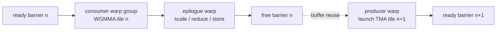

# Advanced GPU Execution — Independent Threads, Warp Specialization, and Asynchronous Pipelines

> **First-time reader orientation:** Traditional GPU explanations say that all threads in a warp share one program counter and execute in lockstep. That is a useful starting model, but modern GPUs keep finer-grained thread state and add autonomous copy and matrix engines. Performance increasingly comes from coordinating specialized producer and consumer warps rather than making every thread perform every step.

> **Abbreviation key — skim now and return as needed:** graphics processing unit (GPU); single instruction, multiple threads (SIMT); streaming multiprocessor (SM); program counter (PC); cooperative thread array (CTA); GPU processing cluster (GPC); distributed shared memory (DSM); Tensor Memory Accelerator (TMA); matrix multiply-accumulate (MMA); warp-group matrix multiply-accumulate (WGMMA); global memory (GMEM); shared memory (SMEM); level-one cache (L1); level-two cache (L2); first in, first out (FIFO).

> **Prerequisites:** [SIMT Scheduling and Occupancy](02_SIMT_Scheduling_and_Occupancy.md) for the classical warp model and [GPU Operand Delivery](03_Operand_Collectors_Register_Files_and_Scoreboards.md) for scoreboards and register delivery.
> **Hands off to:** [Coalescing, Caches, and Shared Memory](../02_Memory_System/01_Coalescing_Caches_and_Shared_Memory.md) for memory behavior and [Multi-GPU Execution](../03_Scale_Up/01_Multi_GPU_Interconnect_and_Execution.md) for cooperation beyond one GPU.

---

## 0. The change in mental model

The old mental model is:

> fetch one instruction for a warp, execute it for every active lane, and use a reconvergence stack when lanes branch.

The modern mental model is:

> maintain enough per-thread control state to form executable SIMT groups dynamically, and coordinate several asynchronous engines with explicit dependency tokens.

The machine is still a throughput processor. It does not become 32 tiny out-of-order CPUs. Instructions are still issued in SIMT groups and share execution pipelines. The added state makes divergence, fine-grained synchronization, and producer–consumer pipelines more flexible.

## 1. Classical reconvergence

Before independent thread scheduling, a warp commonly carried one PC, one active mask, and a stack of reconvergence records. At a divergent branch:

1. evaluate the branch for all active lanes;
2. choose one path and mask off lanes taking the other;
3. push the deferred path and reconvergence PC;
4. execute the chosen path;
5. pop and execute the deferred path;
6. reunite lanes at the reconvergence point.

This model is efficient when divergence is structured and short. It is awkward when threads in one warp need to wait for or signal one another. If the currently executing subset spins while the producer subset is masked off, software can deadlock even though the source code appears to have runnable threads.

## 2. Independent thread scheduling

Volta-class NVIDIA GPUs introduced execution state per thread, including a PC and call stack, plus a schedule optimizer that groups active threads from the same warp into SIMT issue units. “Independent” means threads may be suspended and regrouped at sub-warp granularity; it does not promise that arbitrary threads issue independently every cycle.

Microarchitectural state now includes:

- per-thread PC and call/return state;
- active, exited, waiting, and barrier state;
- reconvergence metadata or compiler-provided convergence information;
- warp-level register allocation and shared-memory ownership;
- masks identifying the threads participating in an issued instruction.

This enables fine-grained synchronization but removes implicit warp-synchronous assumptions. Code that exchanges data through shared memory must use an explicit warp or group synchronization primitive when required. The hardware is free to regroup threads differently from older lockstep behavior.

### 2.1 What the scheduler actually chooses

A useful abstraction is two-level selection:

1. choose a warp with at least one executable thread group;
2. form or select a converged group at the same PC and issue its instruction with an active mask.

The group may contain all lanes, a branch subset, or threads released by a fine-grained event. Group formation trades utilization against scheduling flexibility: waiting briefly may reconverge more lanes; issuing immediately reduces latency but may execute the same instruction again for another subset.

## 3. From synchronous copies to asynchronous operations

In a synchronous tiled kernel, threads calculate addresses, issue global loads, wait, write shared memory, synchronize, and then compute. The same SIMT lanes and registers act as a data-movement engine and arithmetic engine.

Asynchronous copy separates initiation from completion:

1. issue a descriptor describing a transfer;
2. receive a transaction or barrier token;
3. continue independent computation;
4. wait only before consuming the destination tile.

The dependency is no longer “instruction B waits for register r7.” It becomes “consumer phase 3 waits for transaction count 4096 bytes.” Scoreboards and barriers therefore expand beyond register readiness.

## 4. Tensor Memory Accelerator

Hopper's **Tensor Memory Accelerator (TMA)** is a dedicated engine for moving one- to five-dimensional tensors between global and shared memory, and between shared memories in a thread-block cluster. A small number of threads—or one elected thread—can launch a large transfer described by base address, shape, strides, and element format.

Microarchitecturally, TMA removes repeated work from the SM pipelines:

- lane-by-lane address generation;
- many load instructions;
- intermediate registers holding copied data;
- explicit per-thread stores into shared memory.

It adds descriptor storage, address-generation hardware, bounds/fill behavior, request queues, and completion signaling. The copy engine still competes for cache, memory, and shared-memory bandwidth; “asynchronous” hides latency but does not create bandwidth.

## 5. Transaction barriers

A normal barrier counts arriving threads. An asynchronous transaction barrier must account for both thread arrival and outstanding byte or transaction completion. Conceptually, a barrier phase contains:

- an expected arrival count;
- an expected transaction count or byte count;
- a phase/generation bit;
- waiters to release when both reach zero.

Generation identity is essential. If a double-buffered loop reuses barrier slot 0 for tile 2 while a late completion from tile 0 arrives, that completion must not release the new phase. This is the asynchronous equivalent of preventing a stale cache response from completing a recycled miss entry.

## 6. Warp specialization

**Warp specialization** assigns different roles to warps in one thread block or cluster:

- producer warps launch TMA transfers;
- consumer warps issue matrix operations;
- another warp may perform epilogue, reduction, or output stores;
- control warps manage barriers and tile descriptors.

Specialization improves efficiency when the roles overlap. If transfer time is $T_m$, matrix time is $T_c$, and epilogue time is $T_e$, a well-buffered steady-state tile interval approaches

$$
T_{tile}\approx\max(T_m,T_c,T_e)
$$

rather than their sum. This is the same max-versus-sum benefit as double buffering in an NPU scratchpad.

### 6.1 Costs and deadlocks

Specialized warps consume registers and warp slots even when waiting. A producer waiting for a free buffer can deadlock with consumers that were not admitted because producer resources reduced occupancy. Cluster kernels add another constraint: all blocks in a cluster must be co-scheduled.

A safe protocol needs:

- bounded buffers with explicit full/free phases;
- acquire before consume and release after final use;
- consistent barrier participation masks;
- enough resident producer and consumer roles to make progress;
- cancellation behavior for exceptions or early exit.

The architecture must guarantee forward progress under its scheduling rules; software must obey the documented barrier protocol.

## 7. Asynchronous matrix execution

Tensor cores decouple one visible instruction from many internal multiply-accumulates. Hopper adds warp-group matrix operations that are launched by a cooperating group of warps and may read operands from shared memory. The instruction creates an in-flight matrix transaction; later wait operations limit how many groups remain outstanding or ensure results are ready.

This changes the critical resource set:

- matrix-operation queue depth;
- shared-memory read bandwidth;
- accumulator register capacity;
- dependency-group identifiers;
- barrier and completion bandwidth;
- producer–consumer balance.

A scoreboard that only knows “register ready” is insufficient. It must represent outstanding matrix groups and the ordering of accumulator use.

## 8. Thread-block clusters and distributed shared memory

Thread-block clusters group blocks that are co-scheduled within a GPU processing cluster. Blocks can synchronize at cluster scope and access each other's shared memory as **distributed shared memory (DSM)**.

DSM creates an intermediate locality level:

$$
\text{local SMEM} < \text{remote DSM} < \text{L2/global memory}
$$

in expected latency and energy, although exact values are implementation-dependent. It can hold a tile too large for one SM, enable inter-block reductions, or multicast data to several consumer blocks.

The microarchitecture requires routing, address translation from cluster rank to target SM, remote-bank arbitration, atomics, and cluster-lifetime protection. A block must not exit while another block can still access its shared memory. Cluster admission also creates fragmentation: a cluster needing eight blocks cannot launch until enough compatible SM capacity is available together.

## 9. Persistent kernels and dynamic work distribution

A conventional grid launches many blocks and lets a global distributor assign them. A persistent kernel launches roughly enough blocks to occupy the machine and pulls tasks from a software queue. This keeps state resident, supports fine-grained dynamic workloads, and can reduce launch overhead.

It shifts scheduling into the kernel:

- atomic or distributed work queues assign tasks;
- work stealing balances uneven task durations;
- explicit termination detection replaces grid completion;
- long-lived state raises fairness and preemption concerns;
- queue contention can become the new serial bottleneck.

Persistent execution combines naturally with warp specialization: one role fetches descriptors while others process them. It is especially useful for irregular graphs, mixture-of-experts token batches, and fused multi-stage pipelines.

## 10. Resource accounting for an asynchronous pipeline

For $K$ pipeline stages and $D$ tiles buffered, account for:

- shared memory: $D$ copies of live tile storage;
- barriers: at least one ready/free phase per reusable buffer;
- TMA descriptors and outstanding slots;
- producer and consumer warp slots;
- accumulator registers for outstanding matrix groups;
- memory requests generated by all prefetched tiles.

More buffering helps only until another resource binds. If memory latency is $L$ cycles and a new tile is consumed every $T$ cycles, the number of in-flight tiles needed to cover latency is roughly

$$
D\gtrsim\left\lceil\frac{L}{T}\right\rceil.
$$

If shared-memory capacity only permits two buffers while the ratio is four, the kernel cannot fully hide latency without smaller tiles, more work per tile, or additional occupancy.

## 11. Verification and counters

Hardware properties should cover:

1. a barrier phase cannot observe completion from an older generation;
2. a TMA destination is not readable before its transaction completes;
3. no shared-memory buffer is overwritten before every consumer releases it;
4. inactive or exited threads do not count toward the wrong barrier;
5. cluster blocks are admitted and retired as a legal group;
6. remote DSM access cannot outlive the target block;
7. outstanding matrix groups retire in the documented dependency order;
8. preemption or fault handling preserves or cancels asynchronous state consistently.

Counters should separate TMA queue full, barrier wait, tensor queue full, SMEM bank conflict, DSM remote traffic, cluster admission delay, producer idle, consumer idle, and epilogue bottleneck.

## 12. Worked examples

**1 — Pipeline overlap.** Transfer takes 320 cycles, matrix compute 500, and epilogue 140. Serial execution costs 960 cycles/tile. With enough buffers and roles, steady-state cost approaches $\max(320,500,140)=500$ cycles/tile, a theoretical $960/500=1.92\times$ throughput increase. Compute remains the bottleneck.

**2 — Buffer depth.** Memory-to-shared latency is 900 cycles and consumers use one tile every 300 cycles. At least $\lceil900/300\rceil=3$ tiles must be in flight. Double buffering cannot fully cover the latency; triple buffering can, if shared memory and TMA slots permit.

**3 — Cluster admission.** An eight-block cluster uses one block per SM. A GPC has 16 suitable SM slots, so two clusters can reside. If unrelated work occupies one slot, only one whole cluster fits even though seven slots remain idle. This is the cluster-fragmentation trade-off behind co-scheduling guarantees.

## Numbers to remember

| Quantity | Typical scale | Why it matters |
|---|---:|---|
| NVIDIA warp | 32 threads | basic SIMT scheduling and specialization unit |
| thread-block cluster | portable size up to 8 blocks in CUDA | co-scheduled locality across SMs |
| TMA tensor rank | 1D through 5D transfers | moves multidimensional tiles without lane address loops |
| buffering | commonly 2–4 live tiles | overlaps transfer, matrix, and epilogue stages |
| warp group | multiple cooperating warps | launch unit for advanced matrix operations |
| asynchronous identity | slot plus phase/generation | prevents stale completion from releasing reused state |

## Cross-references

- [GPU Operand Delivery](03_Operand_Collectors_Register_Files_and_Scoreboards.md) explains the scoreboard and RF underneath these mechanisms.
- [GPU Memory System](../02_Memory_System/00_Index.md) follows TMA and DSM traffic through caches and high-bandwidth memory.
- [AI Workload and Operator Mapping](../05_AI_Workloads_and_Serving/01_AI_Workload_and_Operator_Mapping.md) shows how GEMM and attention kernels use producer/consumer warps, asynchronous tiles, and matrix pipelines.
- [End-to-End GPU AI Inference and Serving](../05_AI_Workloads_and_Serving/02_End_to_End_GPU_AI_Inference_and_Serving.md) connects persistent execution and dynamic work queues to continuous batching and MoE serving.
- [NPU Transformer and Attention Engines](../../03_NPU_Architecture/01_Compute_Dataflows/03_Transformer_and_Attention_Engine_Microarchitecture.md) shows how similar producer–consumer pipelines appear in dedicated accelerators.
- [NPU Decoupled Access–Execute](../../03_NPU_Architecture/02_Mapping_and_Memory/03_Decoupled_Access_Execute_and_Scratchpad_Scheduling.md) generalizes descriptors, scratchpad phases, and event tokens.

## References

1. NVIDIA, “Volta Architecture Whitepaper” — [PDF](https://images.nvidia.com/content/volta-architecture/pdf/volta-architecture-whitepaper.pdf).
2. NVIDIA, “CUDA Programming Guide — Programming Model” — [documentation](https://docs.nvidia.com/cuda/cuda-programming-guide/01-introduction/programming-model.html).
3. NVIDIA, “Hopper Tuning Guide” — [documentation](https://docs.nvidia.com/cuda/hopper-tuning-guide/).
4. NVIDIA, “Hopper Architecture In-Depth” — [technical article](https://developer.nvidia.com/blog/nvidia-hopper-architecture-in-depth/).
5. A. Bikshandi et al., “Task-Based Tensor Computations on Modern GPUs,” PLDI 2025 — [NVIDIA Research](https://research.nvidia.com/publication/2025-06_task-based-tensor-computations-modern-gpus).

---

← [GPU Operand Delivery](03_Operand_Collectors_Register_Files_and_Scoreboards.md) · [Core Architecture index](00_Index.md) · next → [GPU Memory System](../02_Memory_System/00_Index.md)
