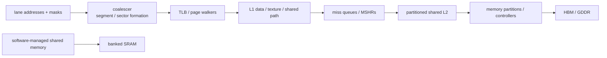
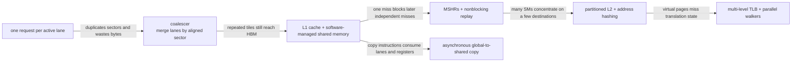
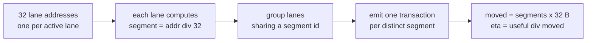
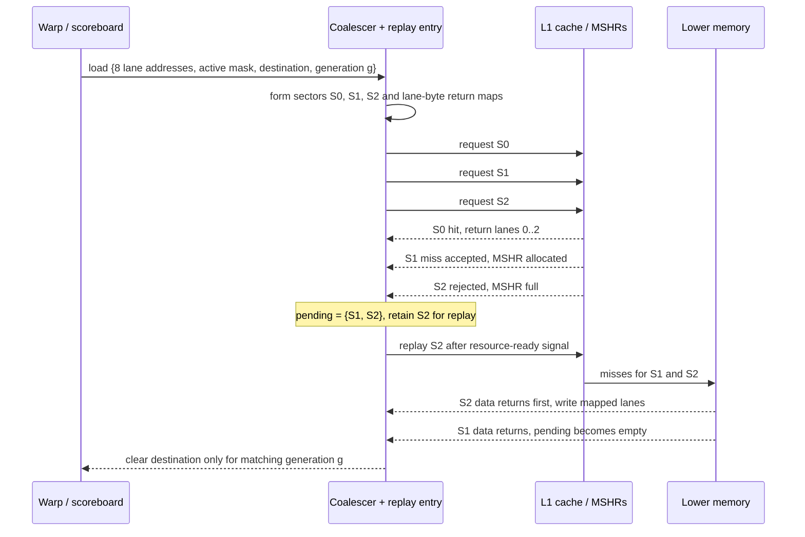
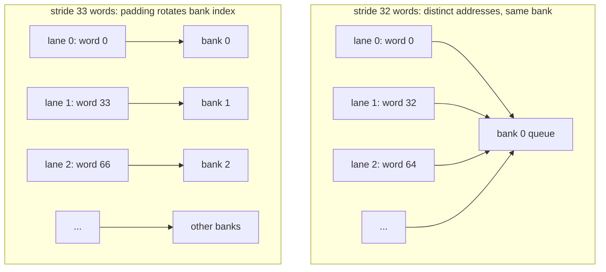
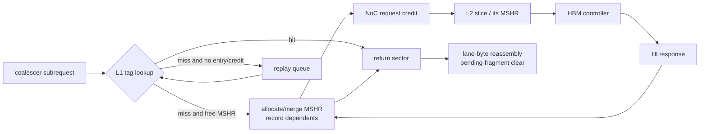
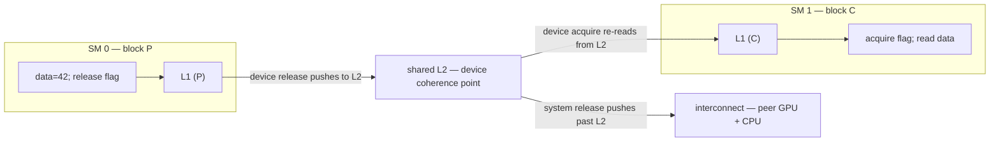

# Coalescing, Caches, and Shared Memory — Turning GPU Lane Addresses into Bandwidth

> **First-time reader orientation:** Threads in one warp may request many addresses at once. Coalescing groups those lane requests into the fewest aligned memory transactions. Shared memory is fast software-managed on-chip storage, but its independent banks can conflict. The chapter separates bytes requested by software from bytes and transactions actually moved by hardware.

> **Abbreviation key — skim now and return as needed:** central processing unit (CPU); graphics processing unit (GPU); instruction set architecture (ISA); memory-level parallelism (MLP); translation lookaside buffer (TLB);
> input-output memory management unit (IOMMU); miss status holding register (MSHR); single instruction, multiple threads (SIMT); static random-access memory (SRAM); dynamic random-access memory (DRAM);
> high-bandwidth memory (HBM); level-one cache (L1); level-two cache (L2); network on chip (NoC); quality of service (QoS);
> direct memory access (DMA); Address Translation Services (ATS); program counter (PC); streaming multiprocessor (SM); exclusive OR (XOR);
> gigabyte (GB); kibibyte (KiB); mebibyte (MiB).

> **Prerequisites:** [GPU Architecture](../01_Core_Architecture/01_GPU_Architecture.md), [SIMT Scheduling and Occupancy](../01_Core_Architecture/02_SIMT_Scheduling_and_Occupancy.md), [Cache Microarchitecture](../../01_CPU_Architecture/04_Cache_Hierarchy/01_Cache_Microarchitecture.md), and [HBM](02_HBM_and_Advanced_Memory_Systems.md).
> **Hands off to:** compiler/kernel tiling, GPU simulation, and multi-GPU placement. This page owns the on-device transaction and storage path.

---

## 0. Why this page exists

A warp instruction can name one address per active lane. The memory system must merge those addresses into aligned transactions, translate them, track misses, distribute them across partitions, and return data to the right lanes. The ratio of useful bytes to moved bytes often determines GPU performance more than arithmetic count.

Optimization is a hierarchy: coalesce lanes, reuse on chip, expose enough MLP, and balance memory partitions.

### 0.1 How the path evolved from a lane load

Start with the simplest possible implementation: each active lane sends its own request directly to memory. It is functionally correct, but it immediately exposes several throughput failures. The memory hierarchy evolves by repairing them in order:

An **MSHR** (miss status holding register) is the metadata entry that represents an outstanding cache miss and remembers which later requests depend on its fill. “Nonblocking” means other independent accesses can proceed while that miss is outstanding. Every feature adds state that must survive replay: lane masks, byte enables, destination identity, warp/context generation, and the set of fragments still owed.

## Before the details: one instruction can create many transactions

A warp executes one memory instruction, but each active lane supplies its own address. Hardware groups those addresses into aligned memory sectors or cache-line transactions. Consecutive addresses usually coalesce well; a large stride or scattered pattern may require many transactions and move far more bytes than the program requested.

Shared memory is different: it is on-chip storage explicitly used by a thread block. Addresses select independent banks so several accesses can proceed together. If multiple lanes need different words from the same bank, service may serialize; if they request the same supported broadcast value, hardware may combine them. Cache behavior adds locality, miss tracking, and replacement above those transaction rules.

**Beginner checkpoint:** distinguish requested bytes, transferred bytes, transactions, and useful reuse. “Fully coalesced” only says the current warp instruction used transactions efficiently; it does not prove that data was reused, partitions were balanced, or memory bandwidth was sufficient.

## 1. Coalescing and sector utilization

**Intuitively:** DRAM and the caches never move an isolated byte — they move data only in fixed-size aligned blocks (sectors, e.g. 32 bytes; a cache line is a few sectors). Coalescing is the hardware packing a warp's 32 lane requests into as few of those blocks as possible. Neighboring lanes wanting neighboring bytes ride in the same block, so a handful of blocks serve the whole warp; lanes wanting scattered bytes each drag in a separate block whose extra bytes are fetched and then thrown away. The efficiency metric below just counts that waste.

For an active warp, group requested bytes by aligned transaction segment/sector. The number of transactions depends on address distribution, element size, alignment, and architecture granularity.

Define byte efficiency

$$
\eta_{bytes}=\frac{\text{unique bytes requested by active lanes}}{\text{bytes transferred by memory transactions}}.
$$

Adjacent 4-byte lane accesses from a 32-thread warp touch 128 useful bytes. With 32-byte transaction sectors and suitable alignment, four sectors provide 100% byte utilization. A 4-byte misalignment can require five sectors, reducing utilization to 80% even though addresses remain contiguous.

For stride $s$ bytes between lanes, touched span is roughly $(W-1)s+E$. Once lanes fall in distinct sectors, transaction count approaches active-lane count and useful bandwidth collapses.

Putting the three regimes side by side (32 lanes, 4-byte `float`s, 32-byte sectors, $b$ a sector-aligned base address; the segment of an address is $\lfloor\text{addr}/32\rfloor$ and hardware emits one transaction per distinct segment touched):

| Access pattern | Lane $i$ address | Distinct segments | Bytes moved | $\eta_{bytes}$ |
|---|---|---|---|---|
| contiguous, aligned | $b+4i$ | 4 | 128 | 100% |
| contiguous, $+4$ B misaligned | $b+4+4i$ | 5 | 160 | 80% |
| strided by 128 B | $b+128i$ | 32 | 1024 | 12.5% |

All three request the same 128 useful bytes. The strided kernel moves $8\times$ the traffic purely because each lane lands in its own sector, so 28 of every 32 fetched bytes are discarded — a bandwidth loss no downstream cache can recover.

The mechanism is a per-lane segment index followed by a dedup: lanes that compute the same segment collapse into one transaction, so the transaction count — and therefore bytes moved — is just the number of distinct segments the warp touches.

## 2. Coalescer microarchitecture

The coalescer takes lane address, byte mask, destination register/lane, and memory-operation attributes. It:

1. detects active lanes and faults/permissions;
2. groups lanes by cache line/sector;
3. creates one subrequest per group;
4. records lane-to-byte return mapping;
5. merges with existing misses where possible;
6. reassembles/forwards responses and marks the warp destination ready.

A single warp instruction may occupy several miss-queue entries. Partial responses need per-sector valid masks. Replay policy may retry the whole instruction or only failed segments; whole-warp replay is simpler but amplifies traffic.

Stores merge byte masks/data from lanes. Conflicting lanes writing the same address have ISA-defined or undefined ordering depending on operation; atomics require explicit serialization, not arbitrary merge.

### 2.1 One load, including partial completion and replay

Trace an eight-lane example (shortened from a 32-lane warp) in which the lanes touch three sectors and one sector cannot allocate an MSHR on its first attempt:

Replay is a resource protocol, not permission to duplicate architectural effects. The coalescer must retry only unaccepted work (or explicitly suppress duplicate accepted responses), merge out-of-order fragments into the right lane bytes, and wake the warp exactly once. A killed warp leaves its lower-level transactions in flight; the generation tag lets returning data be discarded instead of corrupting a newly admitted warp that reused the slot.

## 3. Shared memory: a programmer-controlled cache

Shared memory is banked on-chip SRAM allocated per block. Software/compiler explicitly stages tiles, avoiding tag/replacement overhead and making reuse predictable.

**Intuitively:** picture the $B$ banks as $B$ parallel service windows, each handing out one word per cycle. A warp arrives as up to 32 requests at once. If the requested words fall in 32 different banks, every window works in parallel and the warp is served in one cycle; if several requested words share a bank, that window serves them one after another and the access stretches to as many cycles as the busiest bank has distinct words. The address-to-bank rule below decides who ends up queued behind whom.

If $B$ banks serve one word/cycle and lane $i$ accesses word address $a_i$, bank is commonly $a_i\bmod B$ (details vary). A request with $k$ distinct addresses in one bank needs up to $k$ serialized bank services; broadcasts of one address may be optimized.

Bank-conflict degree

$$
d=\max_b |\{\text{distinct requested words mapping to bank }b\}|
$$

sets the idealized service multiplier. Padding a 2D tile changes row stride and can remove power-of-two conflicts.

**Worked example — column access of a $32\times32$ tile.** Declare `__shared__ float tile[32][32]` (32 banks, 4-byte words, so bank $=\text{word index}\bmod 32$). A warp reads down one column, lane $i$ taking `tile[i][k]` for a fixed $k$. Its word index is $32i+k$, so its bank is $(32i+k)\bmod 32 = k$ — **every lane hits bank $k$**. That is a 32-way conflict: the request serializes into 32 bank cycles instead of 1. Pad the row to 33 words, `__shared__ float tile[32][33]`: now `tile[i][k]` sits at word index $33i+k$ with bank $(33i+k)\bmod 32 = (i+k)\bmod 32$, distinct for every lane $i$ — conflict-free, back to a single cycle. The pad wastes one word per row (32 floats, 128 B per tile) and converts a $32\times$ slowdown into none. The diagram below traces exactly this stride-32 versus stride-33 mapping.

Both layouts store the same logical tile; the extra padding changes only the physical row stride seen by `bank = word_address mod B`. The first pattern needs one bank to serve many distinct words serially. The second exposes bank-level parallelism. A true broadcast—many lanes reading the **same** word—is different from a conflict and may be served once with replicated delivery.

Shared memory trades occupancy for reuse. A larger tile reduces global traffic but consumes more shared memory per block, potentially reducing resident blocks and latency hiding.

## 4. L1 organization and policy

GPU L1 may combine or partition data cache, texture/read-only paths, and shared memory capacity. Compared with CPU L1, it faces:

- many concurrent warps and a large working set;
- sector requests and partial-line validity;
- high miss throughput rather than minimum single-load latency;
- weak temporal locality for streaming kernels;
- write-through/write-back choices coupled to coherence scope;
- software-managed shared memory as an alternative.

Bypass/streaming hints prevent one-use data from evicting reused lines. Replacement should consider warp/block/request PC and sector utilization. A cache hit that returns only one needed sector may coexist with misses for other sectors in the same line.

## 5. Miss tracking and memory-level parallelism

Outstanding capacity is distributed across warp scoreboard entries, coalescer queues, L1 MSHRs, network credits, L2 MSHRs, memory partition queues, and DRAM banks.

To sustain bandwidth $BW$ with latency $L$ and average transaction size $Q$:

$$
N_{out}\gtrsim\frac{BWL}{Q}.
$$

GPU demand may require thousands of transactions device-wide. Per-SM limits can strand HBM bandwidth even when many warps are resident. Conversely, excessive MLP can saturate queues and increase tail latency/replay.

Merge same-line requests but retain per-warp/lane completion. A single missing sector can hold a warp destination dependent on the operation's completion semantics.

The full miss path is a chain of independently backpressured ownership transfers:

Increasing one queue helps only if it is the binding stage. More L1 MSHRs can simply move backpressure to NoC credits or L2 miss entries; more outstanding work can also inflate queueing latency and evict useful lines. Capacity sweeps therefore need occupancy histograms and full-cycle counters at every boundary, not just a final bandwidth number.

## 6. L2 partitions and address camping

Shared L2 is split into slices/partitions near memory controllers. An address hash selects partition. Regular strides can map disproportionate traffic to a subset (“partition camping”), leaving other bandwidth idle.

Balance efficiency is

$$
\eta_{part}=\frac{\sum_i BW_i}{P\max_i BW_i}
$$

for $P$ partitions. Hash/XOR mappings reduce simple stride camping but interact with page allocation, compression, and locality.

L2 is also a coherence and atomic point for host/device or peer access in some systems. It may hold copy-engine/DMA traffic, page migration, and multiple kernels; QoS needs requestor attribution and MSHR/bandwidth controls, not only cache capacity.

## 7. Translation at GPU scale

Thousands of threads can touch many pages concurrently. GPU translation structures include per-SM/L1 TLBs, shared L2 TLBs, page-walk caches, many walker slots, and replay buffers. Unified virtual memory adds page faults, migration, and access counters.

Translation reach must match the active working set. A 2 MiB huge page covers 512× more bytes than a 4 KiB page per entry, but fragmentation/migration granularity increases. TLB misses can arrive in bursts at kernel launch or phase boundaries.

Page walks themselves consume cache/NoC/memory resources. Faulting a page can stall all warps whose transactions target it; fault batching and migration overlap are system-level decisions.

## 8. Asynchronous copies and multistage tiling

Modern programming models allow asynchronous global→shared movement while prior tiles compute. A double-buffered pipeline ideally overlaps

$$
T_{tile}=\max(T_{load},T_{compute},T_{store})
$$

rather than summing them. It needs at least two buffer sets and synchronization that prevents overwrite-before-use.

Deeper staging covers latency variation but consumes more shared memory/registers, reducing occupancy. The optimum minimizes exposed transfer while retaining enough resident blocks.

Copies should be coalesced, aligned, and scheduled to avoid shared-bank conflicts. The hardware tracks copy groups/barriers and exceptions separately from ordinary register-producing loads.

## 9. Atomics and contention

Warp atomics may combine requests to the same address before reaching L2, reducing traffic. Different addresses still spread across partitions. A hot global atomic serializes at a cache/home/memory point and can dominate kernel time.

Use hierarchical aggregation:

- lane/warp reduction;
- block-local shared-memory atomic/reduction;
- one global update per block;
- sharded global counters.

Atomic throughput is governed by serialization service time and partition distribution, not peak HBM bandwidth.

## 10. Cache coherence and host/peer memory

GPU memory may be device-private, system-coherent, or coherent only at selected levels/scopes. Host mappings and peer access add:

- cacheability and ownership rules;
- system/agent scope fences;
- remote versus local page placement;
- L2 flush/invalidate behavior;
- page migration and faulting;
- IOMMU/ATS translation;
- atomic scope support.

State the scope. “Unified address” does not imply uniform latency, physical location, or hardware coherence for every allocation.

## 11. Performance diagnosis

Measure:

- global requested versus transferred bytes and transactions;
- coalescing sectors/warp instruction and byte efficiency;
- shared-memory bank-conflict degree;
- L1/L2 hit rates by request type and sector;
- MSHR/queue occupancy, merge, replay, and full cycles;
- TLB hit/page-walk/fault/migration;
- memory-partition utilization and camping;
- DRAM row locality, bandwidth, and latency;
- load/store/atomic issue stalls;
- asynchronous-copy overlap and barrier wait.

A low “memory utilization” percentage may mean poor coalescing, insufficient outstanding requests, partition imbalance, cache hits doing useful work, or compute-bound execution. Diagnose the path, not one headline counter.

Use the transaction conservation laws as verification anchors:

1. every active requested byte is mapped to exactly one architectural return or a defined fault; inactive lanes create no side effect;
2. the set of accepted sectors plus replay-pending sectors equals the set formed by the coalescer—no loss and no duplicate acceptance;
3. an MSHR fill wakes every matching dependent and no nonmatching warp generation;
4. dirty bytes and store byte-enables survive merge, eviction, retry, and writeback without widening into neighboring bytes;
5. shared-memory arbitration serves every distinct bank address once, while a legal broadcast returns the same value to every participating lane;
6. translation, cache, and coherence permissions are checked before an architectural load/store/atomic completes;
7. fences and asynchronous-copy barriers release only after all operations in their declared scope reach the required visibility point.

For performance diagnosis, compare adjacent event counts: lane requests → coalesced sectors → L1 misses → L2 misses → HBM transactions. The first ratio that changes unexpectedly identifies traffic amplification or lost reuse; the first queue whose full cycles rise identifies where additional memory-level parallelism stops helping.

## 12. Numbers to remember

- Coalescing efficiency is useful unique bytes divided by transferred bytes.
- Misalignment can add a whole transaction even to contiguous access.
- Shared-memory bank conflicts serialize distinct addresses within a bank; broadcast may be special-cased.
- Shared-memory tile size trades global reuse against occupancy.
- Device-wide outstanding demand must cover bandwidth × latency.
- Unified virtual addressing does not imply uniform memory or universal coherence.
- Synchronization scope sets the cache level a fence reaches: block→L1, device→L2, system→interconnect; name the smallest scope covering all participants.

## 13. Worked problems

### Problem 1 — coalescing

Thirty-two lanes read contiguous 4-byte words starting 4 bytes into a 32-byte-aligned segment. Requested bytes span offsets 4–131 and touch five 32-byte segments. Efficiency is $128/(5\times32)=80\%$.

### Problem 2 — shared-memory conflict

With 32 banks and 4-byte words, lane $i$ reads element `tile[i*32]`. Word index is $32i$, so every lane maps to bank 0: a 32-way conflict unless broadcast applies (addresses differ, so it does not). Padding row stride to 33 maps lanes across all banks.

### Problem 3 — outstanding demand

Target 900 GB/s, round-trip 300 ns, 128 B average transactions:

$$
N\ge900\times10^9\times300\times10^{-9}/128\approx2109.
$$

This is device-wide; coalescing, warp eligibility, MSHRs, network credits, and HBM banks must jointly sustain it.

## 14. The GPU memory consistency model (scoped, relaxed)

Section 10 stated the coherence *scope* of an allocation — who may cache it and at which level — but not the *ordering contract*: given two writes by one thread, when is another thread guaranteed to see them in order? Every producer→consumer handoff, every flag spin-wait, and every lock-free structure is correct only against that contract. "The flag is set, therefore the payload is ready" is an assumption until the model makes it a theorem.

### 14.1 Weak, data-race-free, and scoped

The GPU model is **weak** and **data-race-free (DRF)**: a program in which every pair of conflicting accesses (same location, at least one a write) is ordered by synchronization behaves as if **sequentially consistent (SC)**; a race on ordinary memory is undefined behavior, not merely a stale read. Ordinary loads and stores are **relaxed** — the compiler and hardware may reorder them freely — so happens-before edges exist only where an *atomic* creates one. Each synchronizing atomic carries two orthogonal parameters:

- an **order**: *relaxed* (atomicity only, no ordering); *acquire* on a load (no later access is hoisted above it); *release* on a store (no earlier access sinks below it); *acq_rel* on a read-modify-write; *seq_cst* (a single total order among sequentially-consistent operations);
- a **scope**: the set of threads over which that ordering and the resulting visibility actually hold — **thread block (cooperative thread array, CTA)**, **cluster** (on parts with thread-block clusters), **device** (the whole GPU), or **system** (this GPU, peer GPUs, and the CPU).

A release/acquire pair creates a happens-before edge — the producer's pre-release writes become visible to the consumer after its acquire — **only if both threads lie within the named scope**. Scope is not a hint; it bounds the guarantee. A device-scope release is invisible to a peer GPU until some *system*-scope operation carries it across.

### 14.2 Scope selects the cache level the synchronization must reach

Why a scope can be too small follows directly from where the participants' cached copies live. The scope names the deepest level of the hierarchy at which a release must make its prior writes visible — and to which the matching acquire must reach to re-read fresh data — before the edge holds:

| Scope | Participants share | Coherence point | A release must… |
|---|---|---|---|
| thread block (CTA) | one SM, one L1 | L1 | order writes within that L1 only — cheapest |
| cluster | a GPC and its distributed shared memory | cluster / L2 | reach cluster-visible state |
| device (GPU) | all SMs, one shared L2 | L2 | push writes past the local L1 to L2; the matching acquire bypasses or invalidates a stale L1 line |
| system | GPU(s) + CPU | interconnect / system coherence | push past L2 to the fabric (NVLink/PCIe, IOMMU/ATS) — most expensive |

So the mapping is **block → L1, device → L2, system → interconnect**. A release *publishes* prior writes downward to that level; the paired acquire *invalidates or bypasses* upward to it. All threads of a block run on one SM and share its L1, which is why block scope need not touch L2 at all; two blocks on different SMs share only L2, which is why a cross-block handoff must be device scope; two GPUs share only the interconnect, which is why a cross-GPU handoff must be system scope.

### 14.3 Litmus: a mis-scoped release breaks a cross-block handoff

Take the message-passing (MP) test with a producer block P on SM 0 and a consumer block C on SM 1, and `data = flag = 0` initially:

| Producer P (SM 0) | Consumer C (SM 1) |
|---|---|
| `data = 42` | `while (load(flag, acquire, S) == 0) {}` |
| `store(flag, 1, release, S)` | `r = data` |

Is `r == 42` guaranteed? It depends entirely on the scope `S`:

- **`S` = block (CTA):** broken. P's release orders and publishes `data` only within SM 0's L1; it need never reach L2. C, on SM 1, has a different L1, and its acquire only orders within that L1, so it can observe `flag == 1` (if the flag happens to become device-visible) while reading a stale `data == 0`. `r` can be $0$. The synchronizing scope does not cover both participants.
- **`S` = device (GPU):** correct. The release pushes `data` to the shared L2 and orders it before the flag; C's device-scope acquire re-reads `data` from L2, bypassing any stale L1 copy. Observing `flag == 1` now implies `data == 42`. Both blocks lie within device scope.
- **P and C on different GPUs:** even device scope fails — a device-scope release on GPU 0 stops at GPU 0's L2 and never crosses the interconnect. The handoff must use **system** scope so the write reaches the system coherence point where GPU 1 (or the CPU) can observe it.

The bug in the first case is silent: the code compiles, and on any run where `data` happens to reach L2 before C reads it, it even produces the right answer. It fails only under the timing the model explicitly refuses to forbid.

### 14.4 Contrast with CPU total store order

An x86 CPU runs under **total store order (TSO)**: a single global coherence domain in which all cores agree on one total order of stores, ordinary loads carry acquire-like and stores release-like semantics, and the only relaxation is a store buffered ahead of a younger load to a different address. There is **no scope parameter** — MESI-style coherence keeps every core's cache in one domain and a full fence is total. See [Memory Consistency and Atomics](../../01_CPU_Architecture/06_Coherence_and_Consistency/02_Memory_Consistency_and_Atomics.md) for the CPU contract and the same MP litmus without scope.

The GPU relaxes TSO on two axes at once. First, ordinary accesses are *relaxed*, not TSO-ordered, so even the same-thread order between two plain stores is not guaranteed to any observer without a release. Second, synchronization is *scoped*, not global: the programmer chooses how far each edge must reach. TSO's global order is the special case "every operation is system scope with acquire/release semantics" — correct everywhere, but paying the widest fence for every access.

### 14.5 Trade-off — cheaper fences and more MLP versus harder reasoning

Weakness and scope are bought for performance. A block-scope release compiles to L1-level ordering and touches no L2; only a system-scope operation pays the interconnect. Because ordinary accesses carry no implied order, the memory system may keep far more requests in flight — the outstanding-demand budget $N_{out}\gtrsim BW\cdot L/Q$ of §5 stays full precisely because relaxed loads need not wait for older stores to become globally visible. The price is reasoning: an under-scoped release is a real bug that passes almost every test, because the illegal reordering is rare and timing-dependent (§14.3).

The stronger, simpler choice wins in two regimes. If a handoff is provably confined to one block, block scope is *both* the cheapest and the correct answer — widening it only adds fence cost. If a handoff crosses blocks but stays on one device, device scope is the safe default, and only genuine cross-GPU or GPU↔CPU handoffs justify the expensive system scope. Reflexively using system scope everywhere is always correct and simply discards the fence-cost and MLP advantage the model exists to provide; the discipline is to name the smallest scope that covers every participant — no smaller, no larger.

## Cross-references

- **Core scheduling:** [GPU Architecture](../01_Core_Architecture/01_GPU_Architecture.md), [SIMT Scheduling and Occupancy](../01_Core_Architecture/02_SIMT_Scheduling_and_Occupancy.md).
- **Memory foundations:** [Cache Microarchitecture](../../01_CPU_Architecture/04_Cache_Hierarchy/01_Cache_Microarchitecture.md), [HBM](02_HBM_and_Advanced_Memory_Systems.md), [Page Walkers and IOMMUs](../../01_CPU_Architecture/05_Virtual_Memory/02_Page_Walkers_IOMMUs_and_Virtualization.md), [Memory Consistency and Atomics](../../01_CPU_Architecture/06_Coherence_and_Consistency/02_Memory_Consistency_and_Atomics.md) for the CPU TSO contract that §14 relaxes.
- **Consistency users:** the grid barrier of [Independent Threads and Asynchronous Pipelines](../01_Core_Architecture/04_Independent_Thread_Scheduling_and_Asynchronous_Pipelines.md) §13 and the warp/block reductions of [GPU Operand Delivery](../01_Core_Architecture/03_Operand_Collectors_Register_Files_and_Scoreboards.md) §12 depend on the scoped model of §14.
- **Simulation/scale:** [GPU Simulators](../04_Simulation/01_GPU_Simulators.md), [Multi-GPU Interconnect and Execution](../03_Scale_Up/01_Multi_GPU_Interconnect_and_Execution.md).
- **AI use:** [AI Workload and Operator Mapping](../05_AI_Workloads_and_Serving/01_AI_Workload_and_Operator_Mapping.md) applies coalescing, tiling, paging, and cache reuse to weights, attention, KV state, quantization, and MoE.

## References

1. NVIDIA, [CUDA C++ Best Practices Guide — Coalesced Access](https://docs.nvidia.com/cuda/cuda-c-best-practices-guide/).
2. NVIDIA, [CUDA Programming Guide](https://docs.nvidia.com/cuda/cuda-programming-guide/).
3. NVIDIA, CUDA Programming Guide sections on memory hierarchy, shared-memory banks, and unified memory.
4. V. Volkov and J. Demmel, “Benchmarking GPUs to Tune Dense Linear Algebra,” SC 2008.
5. A. Bakhoda et al., “Analyzing CUDA Workloads Using a Detailed GPU Simulator,” ISPASS 2009.

---

**Navigation:** [GPU Memory System index](00_Index.md) · [GPU index](../00_Index.md)
