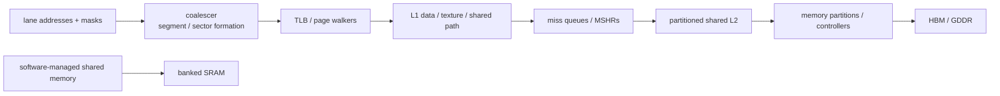

# Coalescing, Caches, and Shared Memory — Turning GPU Lane Addresses into Bandwidth

> **First-time reader orientation:** Threads in one warp may request many addresses at once. Coalescing groups those lane requests into the fewest aligned memory transactions. Shared memory is fast software-managed on-chip storage, but its independent banks can conflict. The chapter separates bytes requested by software from bytes and transactions actually moved by hardware.

> **Abbreviation key — skim now and return as needed:** central processing unit (CPU); graphics processing unit (GPU); instruction set architecture (ISA); memory-level parallelism (MLP); translation lookaside buffer (TLB);
> input-output memory management unit (IOMMU); miss status holding register (MSHR); single instruction, multiple threads (SIMT); static random-access memory (SRAM); dynamic random-access memory (DRAM);
> high-bandwidth memory (HBM); level-one cache (L1); level-two cache (L2); network on chip (NoC); quality of service (QoS);
> direct memory access (DMA); Address Translation Services (ATS); program counter (PC); streaming multiprocessor (SM); exclusive OR (XOR);
> gigabyte (GB); kibibyte (KiB); mebibyte (MiB).

> **Prerequisites:** [GPU Architecture](../01_Core_Architecture/01_GPU_Architecture.md), [SIMT Scheduling and Occupancy](../01_Core_Architecture/02_SIMT_Scheduling_and_Occupancy.md), [Cache Microarchitecture](../../01_CPU_Architecture/04_Cache_Hierarchy/01_Cache_Microarchitecture.md), and [HBM](02_HBM_and_Advanced_Memory_Systems.md).
> **Hands off to:** compiler/kernel tiling, GPU simulation, and multi-GPU placement. This page owns the on-device transaction and storage path.

---

## 0. Why this page exists

A warp instruction can name one address per active lane. The memory system must merge those addresses into aligned transactions, translate them, track misses, distribute them across partitions, and return data to the right lanes. The ratio of useful bytes to moved bytes often determines GPU performance more than arithmetic count.

Optimization is a hierarchy: coalesce lanes, reuse on chip, expose enough MLP, and balance memory partitions.

## Before the details: one instruction can create many transactions

A warp executes one memory instruction, but each active lane supplies its own address. Hardware groups those addresses into aligned memory sectors or cache-line transactions. Consecutive addresses usually coalesce well; a large stride or scattered pattern may require many transactions and move far more bytes than the program requested.

Shared memory is different: it is on-chip storage explicitly used by a thread block. Addresses select independent banks so several accesses can proceed together. If multiple lanes need different words from the same bank, service may serialize; if they request the same supported broadcast value, hardware may combine them. Cache behavior adds locality, miss tracking, and replacement above those transaction rules.

**Beginner checkpoint:** distinguish requested bytes, transferred bytes, transactions, and useful reuse. “Fully coalesced” only says the current warp instruction used transactions efficiently; it does not prove that data was reused, partitions were balanced, or memory bandwidth was sufficient.

## 1. Coalescing and sector utilization

For an active warp, group requested bytes by aligned transaction segment/sector. The number of transactions depends on address distribution, element size, alignment, and architecture granularity.

Define byte efficiency

$$
\eta_{bytes}=\frac{\text{unique bytes requested by active lanes}}{\text{bytes transferred by memory transactions}}.
$$

Adjacent 4-byte lane accesses from a 32-thread warp touch 128 useful bytes. With 32-byte transaction sectors and suitable alignment, four sectors provide 100% byte utilization. A 4-byte misalignment can require five sectors, reducing utilization to 80% even though addresses remain contiguous.

For stride $s$ bytes between lanes, touched span is roughly $(W-1)s+E$. Once lanes fall in distinct sectors, transaction count approaches active-lane count and useful bandwidth collapses.

## 2. Coalescer microarchitecture

The coalescer takes lane address, byte mask, destination register/lane, and memory-operation attributes. It:

1. detects active lanes and faults/permissions;
2. groups lanes by cache line/sector;
3. creates one subrequest per group;
4. records lane-to-byte return mapping;
5. merges with existing misses where possible;
6. reassembles/forwards responses and marks the warp destination ready.

A single warp instruction may occupy several miss-queue entries. Partial responses need per-sector valid masks. Replay policy may retry the whole instruction or only failed segments; whole-warp replay is simpler but amplifies traffic.

Stores merge byte masks/data from lanes. Conflicting lanes writing the same address have ISA-defined or undefined ordering depending on operation; atomics require explicit serialization, not arbitrary merge.

## 3. Shared memory: a programmer-controlled cache

Shared memory is banked on-chip SRAM allocated per block. Software/compiler explicitly stages tiles, avoiding tag/replacement overhead and making reuse predictable.

If $B$ banks serve one word/cycle and lane $i$ accesses word address $a_i$, bank is commonly $a_i\bmod B$ (details vary). A request with $k$ distinct addresses in one bank needs up to $k$ serialized bank services; broadcasts of one address may be optimized.

Bank-conflict degree

$$
d=\max_b |\{\text{distinct requested words mapping to bank }b\}|
$$

sets the idealized service multiplier. Padding a 2D tile changes row stride and can remove power-of-two conflicts.

Shared memory trades occupancy for reuse. A larger tile reduces global traffic but consumes more shared memory per block, potentially reducing resident blocks and latency hiding.

## 4. L1 organization and policy

GPU L1 may combine or partition data cache, texture/read-only paths, and shared memory capacity. Compared with CPU L1, it faces:

- many concurrent warps and a large working set;
- sector requests and partial-line validity;
- high miss throughput rather than minimum single-load latency;
- weak temporal locality for streaming kernels;
- write-through/write-back choices coupled to coherence scope;
- software-managed shared memory as an alternative.

Bypass/streaming hints prevent one-use data from evicting reused lines. Replacement should consider warp/block/request PC and sector utilization. A cache hit that returns only one needed sector may coexist with misses for other sectors in the same line.

## 5. Miss tracking and memory-level parallelism

Outstanding capacity is distributed across warp scoreboard entries, coalescer queues, L1 MSHRs, network credits, L2 MSHRs, memory partition queues, and DRAM banks.

To sustain bandwidth $BW$ with latency $L$ and average transaction size $Q$:

$$
N_{out}\gtrsim\frac{BWL}{Q}.
$$

GPU demand may require thousands of transactions device-wide. Per-SM limits can strand HBM bandwidth even when many warps are resident. Conversely, excessive MLP can saturate queues and increase tail latency/replay.

Merge same-line requests but retain per-warp/lane completion. A single missing sector can hold a warp destination dependent on the operation's completion semantics.

## 6. L2 partitions and address camping

Shared L2 is split into slices/partitions near memory controllers. An address hash selects partition. Regular strides can map disproportionate traffic to a subset (“partition camping”), leaving other bandwidth idle.

Balance efficiency is

$$
\eta_{part}=\frac{\sum_i BW_i}{P\max_i BW_i}
$$

for $P$ partitions. Hash/XOR mappings reduce simple stride camping but interact with page allocation, compression, and locality.

L2 is also a coherence and atomic point for host/device or peer access in some systems. It may hold copy-engine/DMA traffic, page migration, and multiple kernels; QoS needs requestor attribution and MSHR/bandwidth controls, not only cache capacity.

## 7. Translation at GPU scale

Thousands of threads can touch many pages concurrently. GPU translation structures include per-SM/L1 TLBs, shared L2 TLBs, page-walk caches, many walker slots, and replay buffers. Unified virtual memory adds page faults, migration, and access counters.

Translation reach must match the active working set. A 2 MiB huge page covers 512× more bytes than a 4 KiB page per entry, but fragmentation/migration granularity increases. TLB misses can arrive in bursts at kernel launch or phase boundaries.

Page walks themselves consume cache/NoC/memory resources. Faulting a page can stall all warps whose transactions target it; fault batching and migration overlap are system-level decisions.

## 8. Asynchronous copies and multistage tiling

Modern programming models allow asynchronous global→shared movement while prior tiles compute. A double-buffered pipeline ideally overlaps

$$
T_{tile}=\max(T_{load},T_{compute},T_{store})
$$

rather than summing them. It needs at least two buffer sets and synchronization that prevents overwrite-before-use.

Deeper staging covers latency variation but consumes more shared memory/registers, reducing occupancy. The optimum minimizes exposed transfer while retaining enough resident blocks.

Copies should be coalesced, aligned, and scheduled to avoid shared-bank conflicts. The hardware tracks copy groups/barriers and exceptions separately from ordinary register-producing loads.

## 9. Atomics and contention

Warp atomics may combine requests to the same address before reaching L2, reducing traffic. Different addresses still spread across partitions. A hot global atomic serializes at a cache/home/memory point and can dominate kernel time.

Use hierarchical aggregation:

- lane/warp reduction;
- block-local shared-memory atomic/reduction;
- one global update per block;
- sharded global counters.

Atomic throughput is governed by serialization service time and partition distribution, not peak HBM bandwidth.

## 10. Cache coherence and host/peer memory

GPU memory may be device-private, system-coherent, or coherent only at selected levels/scopes. Host mappings and peer access add:

- cacheability and ownership rules;
- system/agent scope fences;
- remote versus local page placement;
- L2 flush/invalidate behavior;
- page migration and faulting;
- IOMMU/ATS translation;
- atomic scope support.

State the scope. “Unified address” does not imply uniform latency, physical location, or hardware coherence for every allocation.

## 11. Performance diagnosis

Measure:

- global requested versus transferred bytes and transactions;
- coalescing sectors/warp instruction and byte efficiency;
- shared-memory bank-conflict degree;
- L1/L2 hit rates by request type and sector;
- MSHR/queue occupancy, merge, replay, and full cycles;
- TLB hit/page-walk/fault/migration;
- memory-partition utilization and camping;
- DRAM row locality, bandwidth, and latency;
- load/store/atomic issue stalls;
- asynchronous-copy overlap and barrier wait.

A low “memory utilization” percentage may mean poor coalescing, insufficient outstanding requests, partition imbalance, cache hits doing useful work, or compute-bound execution. Diagnose the path, not one headline counter.

## 12. Numbers to remember

- Coalescing efficiency is useful unique bytes divided by transferred bytes.
- Misalignment can add a whole transaction even to contiguous access.
- Shared-memory bank conflicts serialize distinct addresses within a bank; broadcast may be special-cased.
- Shared-memory tile size trades global reuse against occupancy.
- Device-wide outstanding demand must cover bandwidth × latency.
- Unified virtual addressing does not imply uniform memory or universal coherence.

## 13. Worked problems

### Problem 1 — coalescing

Thirty-two lanes read contiguous 4-byte words starting 4 bytes into a 32-byte-aligned segment. Requested bytes span offsets 4–131 and touch five 32-byte segments. Efficiency is $128/(5\times32)=80\%$.

### Problem 2 — shared-memory conflict

With 32 banks and 4-byte words, lane $i$ reads element `tile[i*32]`. Word index is $32i$, so every lane maps to bank 0: a 32-way conflict unless broadcast applies (addresses differ, so it does not). Padding row stride to 33 maps lanes across all banks.

### Problem 3 — outstanding demand

Target 900 GB/s, round-trip 300 ns, 128 B average transactions:

$$
N\ge900\times10^9\times300\times10^{-9}/128\approx2109.
$$

This is device-wide; coalescing, warp eligibility, MSHRs, network credits, and HBM banks must jointly sustain it.

## Cross-references

- **Core scheduling:** [GPU Architecture](../01_Core_Architecture/01_GPU_Architecture.md), [SIMT Scheduling and Occupancy](../01_Core_Architecture/02_SIMT_Scheduling_and_Occupancy.md).
- **Memory foundations:** [Cache Microarchitecture](../../01_CPU_Architecture/04_Cache_Hierarchy/01_Cache_Microarchitecture.md), [HBM](02_HBM_and_Advanced_Memory_Systems.md), [Page Walkers and IOMMUs](../../01_CPU_Architecture/05_Virtual_Memory/02_Page_Walkers_IOMMUs_and_Virtualization.md).
- **Simulation/scale:** [GPU Simulators](../04_Simulation/01_GPU_Simulators.md), [Multi-GPU Interconnect and Execution](../03_Scale_Up/01_Multi_GPU_Interconnect_and_Execution.md).

## References

1. NVIDIA, [CUDA C++ Best Practices Guide — Coalesced Access](https://docs.nvidia.com/cuda/cuda-c-best-practices-guide/).
2. NVIDIA, [CUDA Programming Guide](https://docs.nvidia.com/cuda/cuda-programming-guide/).
3. NVIDIA, CUDA Programming Guide sections on memory hierarchy, shared-memory banks, and unified memory.
4. V. Volkov and J. Demmel, “Benchmarking GPUs to Tune Dense Linear Algebra,” SC 2008.
5. A. Bakhoda et al., “Analyzing CUDA Workloads Using a Detailed GPU Simulator,” ISPASS 2009.

---

**Navigation:** [GPU Memory System index](00_Index.md) · [GPU index](../00_Index.md)
