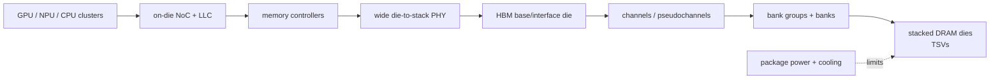
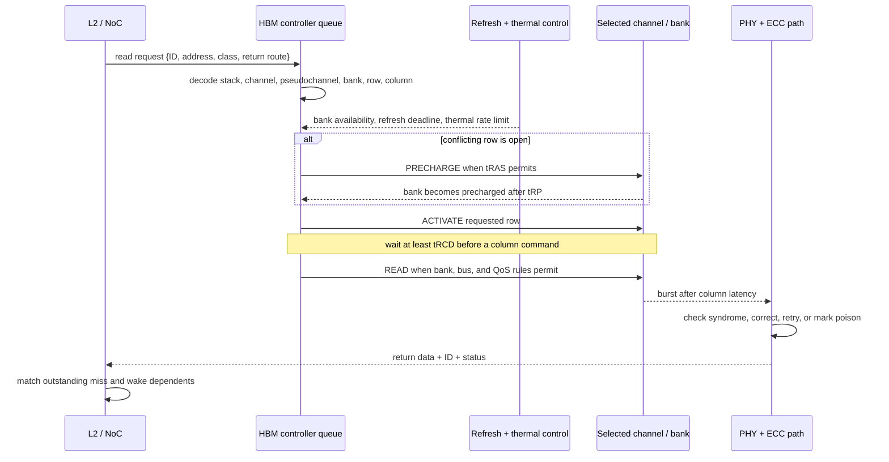
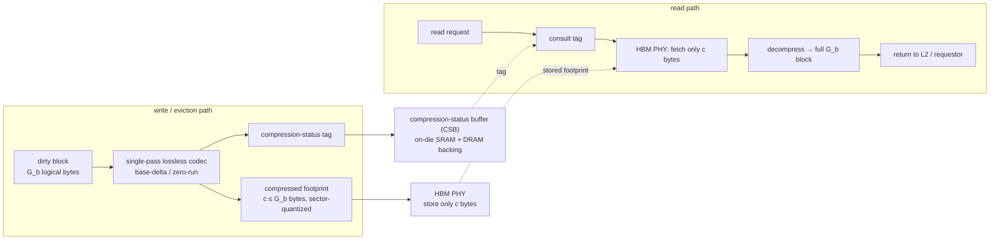

# High-Bandwidth Memory (HBM) and Advanced GPU Memory Systems

> **First-time reader orientation:** High-bandwidth memory stacks dynamic random-access memory dies close to a processor and uses many package wires to provide wide aggregate bandwidth. Peak pin rate is only a ceiling: useful bandwidth also requires enough independent requests, balanced channels and banks, efficient transaction sizes, thermal headroom, and suitable address mapping.

> **Abbreviation key — skim now and return as needed:** central processing unit (CPU); graphics processing unit (GPU); neural processing unit (NPU); miss status holding register (MSHR); static random-access memory (SRAM);
> dynamic random-access memory (DRAM); double data rate (DDR); error-correcting code (ECC); level-one cache (L1); last-level cache (LLC);
> network on chip (NoC); quality of service (QoS); first come, first served (FCFS); Compute Express Link (CXL); Peripheral Component Interconnect Express (PCIe);
> reliability, availability, and serviceability (RAS); program counter (PC); exclusive OR (XOR); non-uniform memory access (NUMA); service-level objective (SLO);
> physical-layer interface (PHY); gigabyte (GB); terabyte (TB); gibibyte (GiB).

> **Prerequisites:** [DDR Controller](../../04_SoC_and_Chiplet_Architecture/02_Shared_Memory/01_DDR_Controller.md) (banks, timing, scheduling, refresh), [Memory Arrays and Technologies](../00_Design_Methodology/02_GPU_PPA_and_Physical_Implementation.md), and [Network on Chip](../../04_SoC_and_Chiplet_Architecture/04_On_Chip_Networks/01_Network_on_Chip.md).
> **Hands off to:** [GPU Memory System](01_Coalescing_Caches_and_Shared_Memory.md), [NPU Tensor Tiling](../../03_NPU_Architecture/02_Mapping_and_Memory/01_Tensor_Tiling_and_Data_Movement.md), and package/thermal design.

---

## 0. Why this page exists

High Bandwidth Memory (HBM) does not make one memory access magically fast. It replaces a small number of very fast off-package channels with many wide, lower-frequency channels connected through dense package wiring and through-silicon vias. The architectural gain is **parallel bandwidth and energy/bit**; the price is package complexity, capacity, thermal coupling, and traffic-management discipline.



This page owns the full architectural path from offered traffic to achieved stack bandwidth, including address mapping, scheduling, ECC/RAS, thermals, and multi-stack scaling.

### 0.1 Why wide memory still needs a controller evolution

HBM widens the physical interface, but width alone leaves most pins idle for irregular traffic. The controller hierarchy evolves as each new bottleneck appears:

```mermaid
flowchart LR
    A["wide interface<br/>single serial request stream"] -->|"row cycle is tens of ns"| B["many channels, pseudochannels,<br/>bank groups, and banks"]
    B -->|"addresses may camp on one resource"| C["striped / hashed address mapping"]
    C -->|"commands have readiness and turnaround constraints"| D["per-bank queues + FR-FCFS scheduling"]
    D -->|"reads, writes, and requestors interfere"| E["drain modes + age / QoS control"]
    E -->|"stacked arrays expose faults and retention work"| F["ECC, repair, scrub, refresh"]
    F -->|"temperature raises refresh and limits rate"| G["thermal sensing + throttling"]
```



First-ready, first-come, first-served (**FR-FCFS**) means the controller first prefers commands that are legal now—often open-row hits—and uses arrival age among suitable requests. It improves bus use over strict arrival order, but requires age or quality-of-service (QoS) escape so a stream of row hits cannot starve an older row miss.

## Before the details: peak bandwidth needs enough independent work

High-bandwidth memory obtains a large peak rate from many relatively narrow channels operating in parallel, connected through a silicon interposer or advanced package. Each channel still contains banks, timing restrictions, queues, refresh, and read/write turnarounds. The interface can transfer at peak only when requests are large enough, distributed well, and available early enough to keep channels busy.

A processor exposes memory-level parallelism by having multiple independent misses or memory operations outstanding. Address mapping decides which address bits select channel, bank, row, and column; a poor mapping can concentrate traffic on one channel while others idle. Thermal limits and error handling can further reduce sustainable bandwidth.

**Beginner checkpoint:** report useful application bytes divided by time, not only pin rate. Then explain the gap with transaction efficiency, channel/bank balance, queue occupancy, row behavior, refresh, and temperature. More stacks do not help a workload that cannot generate parallel requests.

## 1. Bandwidth comes from width × rate × parallel channels

For interface width $W$ bits, transfer rate $R$ transfers/s/pin, and $C$ independent channels/interfaces,

$$
BW_{peak}=\frac{WRC}{8}.
$$

HBM exposes very wide aggregate interfaces and many channels/pseudochannels. Peak is only the transport ceiling. Achieved bandwidth is

$$
BW_{ach}=BW_{peak}\eta_{cmd}\eta_{row}\eta_{rw}\eta_{refresh}\eta_{balance}\eta_{thermal},
$$

where command scheduling, row locality, read/write turnarounds, refresh, channel balance, and throttling multiply efficiency down.

A design with 1.2 TB/s nominal bandwidth and 65% aggregate efficiency delivers 780 GB/s. Roofline calculations should use achieved bandwidth for the target access pattern, not the product headline.

## 2. Stack organization

HBM stacks multiple DRAM dies above a base/interface die or logic base using microbumps and through-silicon vias (TSVs). The package/interposer supplies thousands of short connections to the compute die.

Logical hierarchy:

$$
\text{stack}\rightarrow\text{channel}\rightarrow\text{pseudochannel}\rightarrow\text{bank group}\rightarrow\text{bank}\rightarrow\text{row/column}.
$$

Pseudochannels split command/address control while sharing parts of the physical interface, increasing request concurrency and reducing the chance one long access stream blocks another. The exact organization is generation-specific; controllers must be parameterized rather than embedding one layout.

## 3. Latency: many parallel queues, not an L1 cache

HBM access still pays controller queueing, command constraints, activate/precharge, column access, data movement, and NoC traversal. Short package wires save I/O energy and some PHY delay, but random unloaded latency can remain comparable to other DRAM systems.

Queueing dominates near saturation. If arrival rate $\lambda$ approaches service rate $\mu$, even the idealized M/M/1 wait

$$
W_q=\frac{\lambda}{\mu(\mu-\lambda)}
$$

diverges. Real DRAM has banks, scheduling priorities, burst service, and nonuniform traffic, but the saturation knee remains. Keep sustained utilization below the point where tail latency violates the product SLO.

## 4. Address mapping is a load-balancing function

Physical-address bits choose stack, channel/pseudochannel, bank, row, and column. Mapping goals conflict:

- stripe sequential lines across channels for bandwidth;
- keep neighboring columns in one open row for locality;
- distribute hot pages across stacks/controllers;
- avoid pathological power-of-two strides mapping to one bank;
- preserve large transfer bursts;
- support page coloring, encryption, RAS, and interleaving granularity.

XOR/hash mappings mix higher bits into bank/channel selection to break strides, but they complicate debugging and physical-page placement. Expose the mapping to simulators and performance tools.

For $C$ channels, ideal striping needs balanced traffic. Define balance efficiency

$$
\eta_{balance}=\frac{\sum_i BW_i}{C\max_i BW_i}.
$$

If one channel is saturated while others idle, aggregate capacity cannot compensate.

## 5. Controller scheduling for wide parallel memory

First-ready, first-come, first-served (FR-FCFS) still favors ready row hits, but accelerators add large streams and service classes. A practical scheduler considers:

- command readiness/timing;
- row hit and age;
- read/write drain mode;
- requestor priority/deadline;
- bank/channel occupancy balance;
- thermal/power limits;
- atomic or coherence ordering;
- refresh and repair events.

Batching writes reduces bus turnarounds but can create read-tail spikes. Per-requestor queues and age escalation prevent a high-row-locality bulk stream from starving latency-sensitive traffic.

### 5.1 Carry one read from the last-level cache to corrected data

Assume an L2 miss reaches a bank whose requested row is not open. One request record must carry at least transaction identity, return destination, requestor/QoS class, physical address, read/write/atomic type, byte mask, age, and error/poison state. The controller then performs this sequence:



`PRECHARGE` closes an open row and restores the bitline reference; `ACTIVATE` opens a row into the bank's sense amplifiers; `READ` selects columns from that open row. The timing names are elapsed guards: $t_{RAS}$ protects restore before precharge, $t_{RP}$ covers precharge, and $t_{RCD}$ covers activation-to-column delay. A row hit skips precharge and activation, which is why FR-FCFS values it; a row miss pays them but must still receive bounded service.

```wavedrom
{ "signal": [
  { "name": "CK",      "wave": "p............." },
  { "name": "CMD",     "wave": "x3..4...5....x", "data": ["PRE", "ACT", "READ"] },
  { "name": "BANK_OK", "wave": "0.1..........." },
  { "name": "DQ",      "wave": "x..........3.x", "data": ["read burst"] },
  { "name": "RESP",    "wave": "0...........10" }
], "head": { "text": "Qualitative HBM row-conflict read: scheduling guards precede data and corrected response" } }
```

The waveform is qualitative; exact cycles depend on the HBM generation and speed bin. Refresh can hold `BANK_OK` low before `PRE/ACT`, and a thermal controller can reduce command/data opportunities or lower the interface rate. ECC checking sits after the burst; a correctable error may add decode/correction latency, while an uncorrectable error returns poison/fault status instead of silently releasing normal data.

## 6. Memory-level parallelism must reach the stack

Peak bandwidth requires enough outstanding independent cache lines to cover round-trip latency:

$$
N_{out}\gtrsim\frac{BW_{target}L}{B}.
$$

At 800 GB/s, 250 ns, and 64 B lines,

$$
N_{out}\gtrsim\frac{800\times10^9\times250\times10^{-9}}{64}\approx3125
$$

requests across the system. This parallelism must exist through core/accelerator queues, cache MSHRs, NoC credits, controller queues, channels, and banks. A 16-MSHR producer cannot individually consume a terabyte/s random stream.

Large accelerator bursts reduce per-request metadata and exploit contiguous columns, while gather/scatter and embedding workloads need far more concurrency and careful bank distribution.

## 7. Capacity, bandwidth, and tiling

HBM capacity per package may be more constrained/costly than commodity DIMM capacity. Architects decide:

- keep all active data in HBM;
- use HBM as flat local memory plus slower host memory;
- use it as a hardware/software-managed cache;
- partition model/tensors across several accelerators;
- spill cold data over CXL/PCIe/fabric.

For a tile with computation $O$ operations and external traffic $Q$ bytes, arithmetic intensity $I=O/Q$ must exceed the compute-to-bandwidth ratio to be compute-bound. Increasing HBM bandwidth moves the roofline knee but does not fix a tile that rereads data due to insufficient on-chip SRAM.

### 7.1 Memory-side compression multiplies effective bandwidth

§1 derived the *physical* achieved bandwidth and every efficiency in $BW_{ach}=BW_{peak}\eta_{cmd}\eta_{row}\cdots$ pulled it **down**. There is one lever that multiplies **effective** bandwidth back **up**, without adding a single pin, channel, or stack: if the data is compressible, move fewer bytes. On a bandwidth-bound machine (left of the roofline knee, §7) every byte not transferred is bandwidth *and* capacity reclaimed, and real accelerator traffic is often compressible — post-activation zeros, padded tensors, low-entropy or quantized weights, duplicated values.

**Mechanism.** Compression lives in the L2/DRAM controller and operates on a fixed **block** of one or a few cache lines (say $G_b=128$ B). On the write/eviction path a fixed, single-pass lossless codec (base-plus-delta, zero-run, or a small dictionary — *not* entropy coding, which is too slow for the datapath) shrinks the block to a footprint of $c\le G_b$ bytes, quantized up to a transfer granule (a multiple of the 32 B sector of §5.1). The controller writes only those $c$ bytes over the physical-layer interface (PHY) and records a per-line **compression-status tag** — how many sectors the line occupies, or which codec — in a **compression-status buffer (CSB)**: on-die static random-access memory (SRAM) with a DRAM-backed spill. On a read it consults the tag, fetches only the $c$ compressed bytes across the PHY, and decompresses into the full block before returning it. If the codec cannot shrink a block it flags the tag "uncompressed" and stores it raw — the codec never *expands* the payload.



Two regimes matter. **Bandwidth-only compression** keeps the uncompressed physical address (the block still *reserves* $G_b$ bytes in DRAM) and merely transfers fewer sectors — it saves bandwidth on every access with no fragmentation and no address indirection, but recovers no capacity. **Bandwidth-plus-capacity compression** packs the variable-size footprints so the freed bytes hold more data — it recovers capacity too, at the price of an indirection table, fragmentation, and compaction. Most GPU memory compression is bandwidth-only, precisely to keep addressing (§4) simple.

**Derivation of $B_{eff}=B_{phy}/\bar r$.** Let a block hold $G_b$ logical bytes and compress to $c_i$ physical bytes; define its compressed fraction $r_i=c_i/G_b\in(0,1]$ ($r_i=1$ is incompressible). Over a traffic stream the mean compressed fraction is

$$\bar r=\frac{\sum_i c_i}{\sum_i G_b}=\mathbb{E}[r_i]\qquad(\text{so a 2:1 compression is }\bar r=\tfrac12,\text{ not }2).$$

Transferring $N$ logical blocks moves $\sum_i c_i=\bar r\,N G_b$ physical bytes over the PHY. At physical transport rate $B_{phy}$ (the achieved bandwidth of §1) the time is $t=\bar r N G_b/B_{phy}$, so the *effective* bandwidth — logical bytes delivered per unit time — is

$$B_{eff}=\frac{N G_b}{t}=\frac{N G_b}{\bar r N G_b/B_{phy}}=\frac{B_{phy}}{\bar r}.$$

For compressible data $\bar r<1$, so $B_{eff}>B_{phy}$: compression multiplies the §1 transport ceiling by $1/\bar r$, and (packed variant) multiplies effective capacity by the same factor. It is the one term in the whole bandwidth budget that can exceed unity.

**Why incompressible data pays only a small tax.** Each block also carries its tag. With an $m$-bit tag on a $G_b$-byte block, transferred bytes become $\bar r N G_b + N m/8$, so

$$B_{eff}=\frac{B_{phy}}{\bar r + m/(8G_b)}.$$

The tax $m/(8G_b)$ is tiny: for $m=2$ bits and $G_b=128$ B it is $2/1024\approx0.002$. So even fully incompressible data ($\bar r=1$) loses only $\approx0.2\%$ — *provided the tag is served from the on-die CSB*; a CSB miss adds a metadata fetch, which is why tags are cached on-die with only a DRAM backing. Because the codec never expands a block ($r_i\le1$) and the tag is bounded, memory compression is a near-free option: large upside on compressible traffic, negligible downside otherwise.

**Worked number.** Take $B_{phy}=3$ TB/s achieved HBM bandwidth. Post-activation (ReLU) tensors are $\sim50\%$ zeros; a zero-run/base-delta codec compresses such blocks $\approx2{:}1$, i.e. $\bar r=0.5$, so $B_{eff}=3/0.5=6$ TB/s effective — a memory-bound activation-streaming layer runs at *twice* the rate with the numbers unchanged. Capacity (packed variant): the same 2:1 lets 40 GB of HBM hold 80 GB of compressible logical tensor. On incompressible weights ($\bar r=1$, $m=2$ b, $G_b=128$ B): $B_{eff}=3/1.002\approx2.994$ TB/s — 0.2% lost. And on the roofline (§7): raising $B_{HBM}\to B_{eff}$ moves the knee $I^\star=\pi/B_{eff}$ left by $\bar r$, so a kernel at intensity $I=4$ FLOP/byte with compute peak $\pi=24$ TFLOP/s climbs from a $4\times3=12$ TFLOP/s memory roof to $4\times6=24$ TFLOP/s — onto the compute knee, throughput doubled.

**Trade-offs.**

- *Metadata storage:* the CSB costs on-die SRAM plus a DRAM-backed table, and a tag miss costs an extra access, so sizing the tag cache is the central design point — the same "extra bytes per line" machinery as inline ECC (§8).
- *Variable latency:* decompression adds a few cycles on read, and the data-dependent footprint size makes transaction size — and thus latency — variable, complicating the controller's burst scheduling (§5). Fine for bandwidth-bound streaming; poor for latency-critical traffic.
- *Alignment / fragmentation:* variable footprints are free in the bandwidth-only regime (fixed addressing) but force an allocator, indirection, and compaction in the capacity-packing regime.
- *Lossless versus lossy:* lossless memory compression (this section) is numerically **transparent** — safe on any tensor — but its ratio is data-dependent and modest ($<2{:}1$ typical, $\to 1$ on high-entropy data). Lossy compression (quantization to FP8/FP4) delivers **guaranteed**, larger ratios (4:1, 8:1) but changes the values and needs accuracy validation; it is a *compute-format* lever, not a memory-transport one. Weights are usually quantized (lossy, guaranteed); activation zeros are captured by lossless memory compression (transparent, opportunistic); the two compose.

**When the simpler option wins.** If the data is high-entropy (already-quantized weights, encrypted, random), $\bar r\to1$ and compression buys nothing but the tag tax — disable it. If the kernel is compute-bound (right of the knee), effective bandwidth is not the limiter and the codec is wasted area and energy. If latency is the SLO, the variable decode latency can hurt. And when bandwidth must be *guaranteed* regardless of data content, only physically wider/faster HBM (more channels or stacks, §1, §10) delivers it — compression is a statistical gain, not a floor.

## 8. ECC, repair, and availability

A stack combines many dies and interconnects; RAS must cover data arrays, TSV/lane failures, command/address paths, and controller state. Techniques include:

- inline/on-die ECC and end-to-end ECC;
- spare rows/columns, channels, lanes, or TSVs;
- lane remapping and training;
- patrol scrub and error counters;
- poison propagation and page retirement;
- stack sparing/mirroring at system level.

ECC overhead affects capacity, bandwidth, burst format, and write energy. Correctable-error storms can consume service bandwidth and predict impending failure; expose them to firmware.

ECC protection has several possible boundaries. On-die correction may repair cell faults internally without exposing a syndrome; controller-visible or end-to-end ECC protects the transfer and storage path seen by the accelerator. The architectural response must distinguish clean data, corrected data, retryable transport failure, uncorrectable poisoned data, and a retired or remapped resource. A retry retains the original transaction identity and ordering obligation. It must not create a second architectural completion if the first response later arrives.

## 9. Thermals and power delivery

Stacked dies impede heat removal, while the neighboring GPU/NPU is often the package hotspot. DRAM temperature increases refresh demand and leakage; controllers may throttle or change refresh behavior.

These effects feed the scheduler directly rather than appearing only as a power report. A refresh deadline temporarily removes a bank, pseudochannel, or larger domain from the legal-command set. Higher-temperature refresh shortens the useful service interval; thermal throttling may insert command gaps or select a lower data rate. Both reduce $\eta_{refresh}$ or $\eta_{thermal}$ in §1 and increase queue residence, so a temperature rise can lower achieved bandwidth even when the offered request stream is unchanged.

Power includes:

- DRAM activate/precharge/read/write/refresh;
- base die and PHY;
- interposer/package I/O;
- memory-controller and NoC activity;
- extra cooling and power-delivery margin.

Energy/bit is an HBM advantage, but total memory power can rise because the system actually uses far more bandwidth. Model both energy/bit and traffic volume.

Place stacks and controller interfaces with floorplan-aware wire lengths. A compute die with many HBM PHY edges constrains bump maps, NoC topology, and routing channels.

## 10. Multi-stack and heterogeneous memory

With $S$ stacks, uniform bandwidth requires software/hardware placement across memory domains. First-touch, interleaving, page migration, or compiler partitioning decides locality. Remote-stack traffic crosses more on-die fabric and can create asymmetric latency.

Heterogeneous systems may combine HBM, DDR, and CXL-attached memory. A tiering policy should consider:

- reuse/hotness and migration cost;
- bandwidth versus capacity demand;
- coherence and address-translation overhead;
- failure/isolation domain;
- NUMA placement and collective communication;
- page granularity versus tensor/object semantics.

Migration consumes the same bandwidth it tries to optimize. Benefit over residency interval must exceed copy and coherence/translation cost.

## 11. Observability and verification

Counters per stack/channel/pseudochannel/bank:

- reads/writes/bytes and achieved utilization;
- row hits/misses/conflicts;
- queue occupancy and age distributions;
- command-blocked cycles by timing constraint;
- read/write turnaround and refresh stalls;
- address-mapping balance;
- ECC corrections, retry/repair, throttling and temperature;
- requestor/QoS attribution;
- NoC and MSHR backpressure.

Invariants:

- all Joint Electron Device Engineering Council (JEDEC)/HBM timing and power-state constraints hold;
- responses preserve request identity and required ordering;
- ECC/poison behavior is end-to-end consistent;
- refresh/repair eventually services every required region;
- throttling cannot deadlock coherence or mandatory traffic;
- address mapping is bijective over implemented capacity and handles disabled resources.

### 11.1 Reconstruct achieved bandwidth from the event ledger

Do not fit one opaque “HBM efficiency.” Measure where interface opportunities were lost:

| Lost opportunity | State/event that enables it | Counter evidence | Typical losing case |
|---|---|---|---|
| command not legal | per-bank open row and timing timestamps | blocked cycles by `tRCD`, `tRP`, `tRAS`, bank-group/power rule | random rows or too few banks active |
| no request for an idle channel | upstream MSHRs/credits and channel mapping | empty-queue cycles; outstanding-request histogram | insufficient memory-level parallelism or channel camping |
| bus-direction bubble | read/write mode and turnaround timestamp | read→write and write→read guard cycles | small alternating bursts |
| refresh/repair unavailability | refresh deadline, bank/rank busy state, remap table | refresh wait, scrub/retry/repair cycles | hot stack or error storm |
| ECC/retry overhead | syndrome, retry count, poison state | corrected/uncorrected errors and replay bytes | marginal link/cell or aggressive operating point |
| thermal throttling | temperature sensors and selected rate/command budget | throttled cycles, temperature, clock/rate state | sustained bandwidth beside a hot compute die |
| unbalanced service | decoded channel/bank and per-queue occupancy | per-channel bytes and balance efficiency | stride/address-hash mismatch |

Useful achieved bandwidth is `architectural payload bytes / elapsed time`; raw bus bandwidth includes ECC, retry, scrub, and transferred-but-unused bytes. Reconcile the two with byte conservation, then reconcile elapsed interface slots as `payload + protocol/ECC + turnaround + refresh/repair + throttled/idle`. If those categories do not account for the measured interval, the instrumentation is incomplete.

Verification should replay the §5.1 trace under row hit, row miss, refresh collision, correctable error, retry, poison, and thermal state changes. Assert that command guards are never violated, every accepted request terminates exactly once with data or a defined error, age/QoS rules guarantee required progress, refresh deadlines are met, and remapping never aliases two physical locations into one architectural address.

## 12. Numbers to remember

- HBM's primary advantage is aggregate bandwidth and energy/bit, not cache-like random latency.
- Achieved bandwidth is peak multiplied by command, locality, turnaround, refresh, balance, and thermal efficiencies.
- Outstanding demand needed is $BW\times latency/transaction\ size$.
- Address mapping is an architectural load-balancing decision.
- On-chip SRAM reuse still determines whether an accelerator can exploit HBM.
- Stacks couple memory architecture to package routing, yield, cooling, RAS, and capacity planning.
- Memory-side lossless compression multiplies *effective* bandwidth and capacity: $B_{eff}=B_{phy}/\bar r$ for mean compressed fraction $\bar r$; a 2:1 ratio on activations ($\bar r=0.5$) doubles effective TB/s, while incompressible data ($\bar r=1$) pays only the per-line tag tax $\approx m/(8G_b)$ ($\approx0.2\%$).

## 13. Worked problems

### Problem 1 — peak and achieved bandwidth

A stack exposes 1024 data bits at 7.2 Gb/s/pin equivalent transfer rate:

$$
BW_{peak}=1024\times7.2/8=921.6\ \text{GB/s}.
$$

At 72% total efficiency, achieved bandwidth is 663.6 GB/s.

### Problem 2 — outstanding requests

To sustain 600 GB/s with 200 ns round trip and 128 B transactions:

$$
N\ge\frac{600\times10^9\times200\times10^{-9}}{128}=937.5.
$$

About 938 independent transactions must exist system-wide; queue/credit sizing needs additional headroom.

### Problem 3 — migration break-even

Moving a 2 GiB region at effective 200 GB/s costs about 10.7 ms one way ($2\ \text{GiB}/200\ \text{GB/s}$), ignoring contention. If HBM saves 2 ms per subsequent iteration, more than six iterations are needed just to recover copy time; dirty writeback and service interference raise the threshold.

## Cross-references

- [AI Workload and Operator Mapping](../05_AI_Workloads_and_Serving/01_AI_Workload_and_Operator_Mapping.md) derives weight, activation, and KV traffic; [End-to-End GPU AI Inference and Serving](../05_AI_Workloads_and_Serving/02_End_to_End_GPU_AI_Inference_and_Serving.md) turns HBM capacity/bandwidth into admission, batching, and TPOT constraints.

- **DRAM mechanics:** [DDR Controller](../../04_SoC_and_Chiplet_Architecture/02_Shared_Memory/01_DDR_Controller.md), [Memory Arrays and Technologies](../00_Design_Methodology/02_GPU_PPA_and_Physical_Implementation.md).
- **Consumers:** [GPU Memory System](01_Coalescing_Caches_and_Shared_Memory.md), [Tensor Tiling and Data Movement](../../03_NPU_Architecture/02_Mapping_and_Memory/01_Tensor_Tiling_and_Data_Movement.md).
- **Package/fabric:** [Chiplets, CXL, and Die-to-Die](../../04_SoC_and_Chiplet_Architecture/05_IO_and_Chiplets/02_Chiplets_CXL_and_Die_to_Die.md), [IC Packaging](../../../07_Manufacturing_and_Bringup/02_IC_Packaging.md).
- **Compression and sparsity (§7.1):** [Sparsity, Quantization, and Compression](../../03_NPU_Architecture/02_Mapping_and_Memory/02_Sparsity_Quantization_and_Compression.md) (the lossy weight-side counterpart and structured-sparsity metadata); the effective-bandwidth lever feeds the roofline knee of [GPU Workloads, Performance, and DSE](../00_Design_Methodology/01_GPU_Workloads_Performance_and_DSE.md).

## References

1. JEDEC, High Bandwidth Memory standards (JESD235 family).
2. Micron, [HBM3E Product Brief](https://www.micron.com/content/dam/micron/global/public/documents/products/product-flyer/hbm3e-product-brief.pdf).
3. B. Jacob, S. Ng, and D. Wang, *Memory Systems: Cache, DRAM, Disk*.
4. O. Mutlu and L. Subramanian, “Research Problems and Opportunities in Memory Systems,” Supercomputing Frontiers 2014.
5. Micron, DRAM system power and HBM technical documentation.

---

**Navigation:** [Main Memory index](../../04_SoC_and_Chiplet_Architecture/02_Shared_Memory/00_Index.md) · [Memory index](../00_Design_Methodology/00_Index.md)
