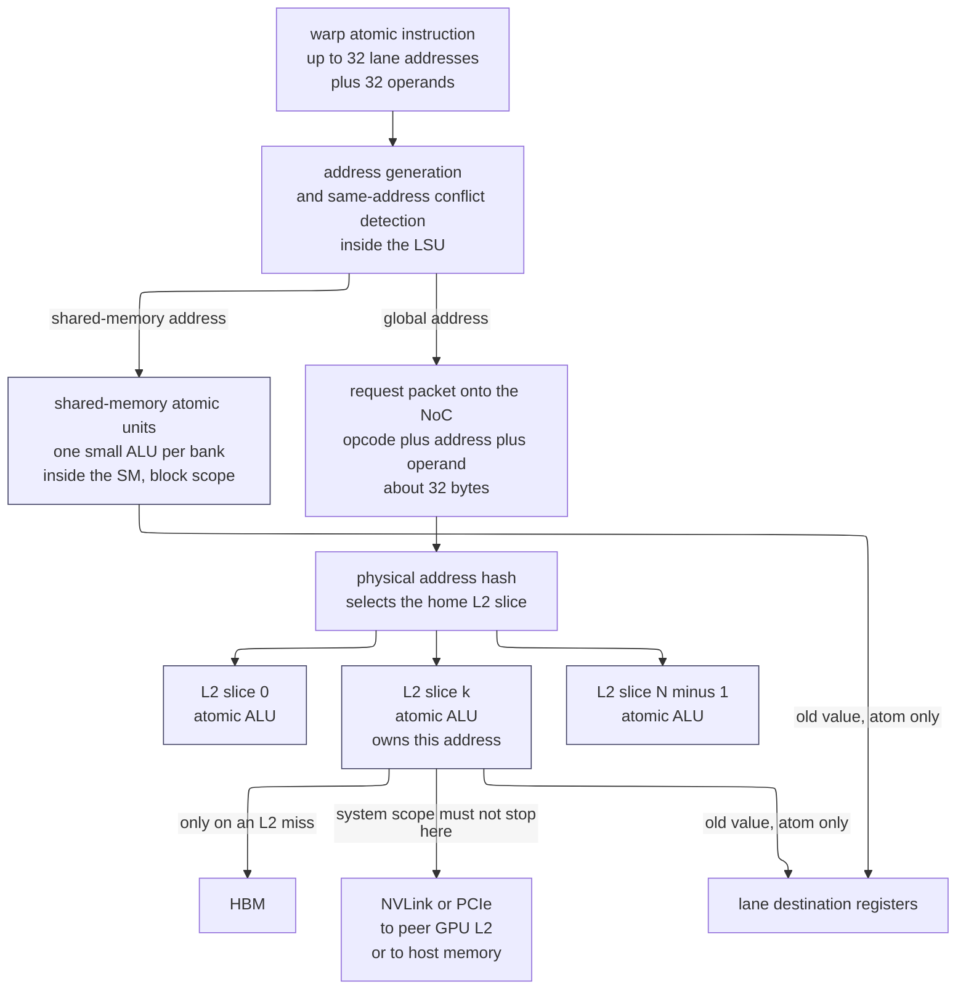
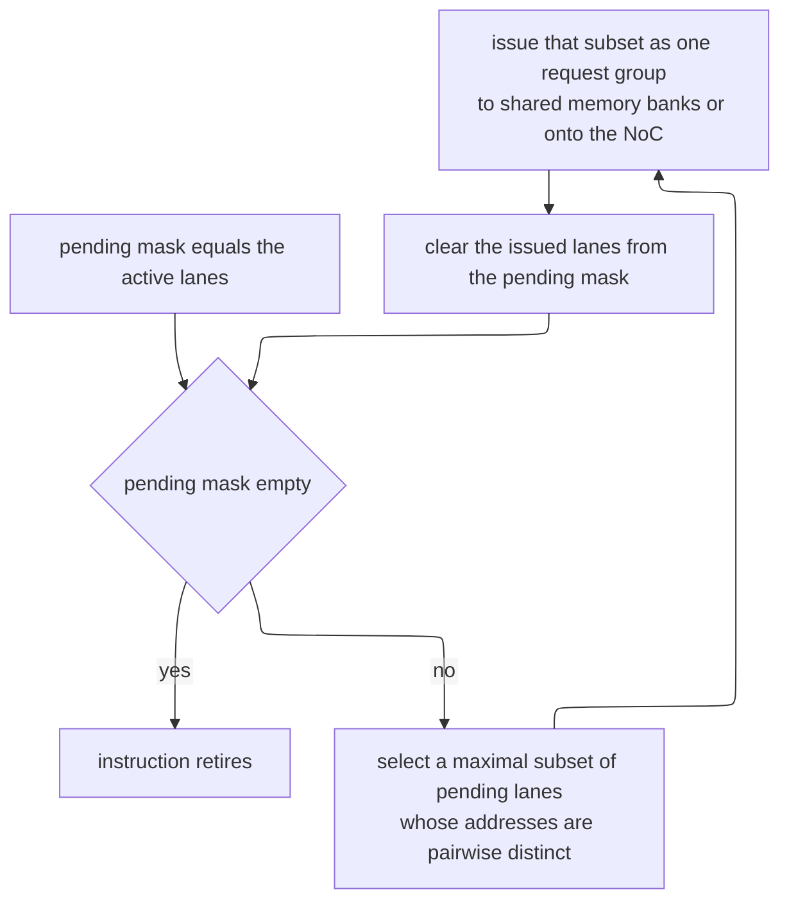
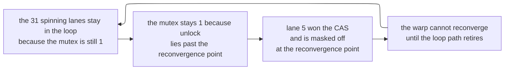
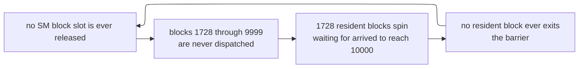

# GPU Atomics and Synchronization — Serializing Millions of Threads Without Serializing the Machine

> **First-time reader orientation:** An *atomic* operation reads a memory location, changes it, and writes it back as one indivisible step, so that two threads doing it concurrently cannot lose an update. On a CPU that is a rare event contended by a handful of cores. On a GPU, one instruction can launch 32 atomics at the same address in one cycle, and one kernel can launch millions. Every mechanism on this page — where the read-modify-write physically executes, how the hardware serializes lanes that collide, why non-returning atomics are cheaper, why the classic spin lock hangs — exists because that changes the *arithmetic*, not because the *semantics* changed.

> **Abbreviation key — skim now and return as needed:** central processing unit (CPU); graphics processing unit (GPU); streaming multiprocessor (SM); single instruction, multiple threads (SIMT); cooperative thread array (CTA, one thread block); independent thread scheduling (ITS); arithmetic logic unit (ALU); load/store unit (LSU); address generation unit (AGU); read-modify-write (RMW); compare-and-swap (CAS); level-one cache (L1); level-two cache (L2); last-level cache (LLC); network on chip (NoC); static random-access memory (SRAM); dynamic random-access memory (DRAM); high-bandwidth memory (HBM); raster operations unit (ROP); graphics processing cluster (GPC); distributed shared memory (DSMEM); Modified-Exclusive-Shared-Invalid coherence protocol (MESI);
> Parallel Thread Execution virtual ISA (PTX); Streaming Assembler, the native GPU machine code (SASS); instruction set architecture (ISA); compute capability (cc); single-precision binary floating point (FP32); double-precision binary floating point (FP64); unit in the last place (ulp); unit roundoff ($u$);
> Peripheral Component Interconnect Express (PCIe); NVIDIA's GPU-to-GPU link (NVLink); scalable hierarchical aggregation and reduction protocol (SHARP);
> nanosecond (ns); microsecond ($\mu$s); millisecond (ms); giga-operations per second (Gop/s); kibibyte (KiB); mebibyte (MiB).

> **Prerequisites:** [Coalescing, Caches, and Shared Memory](01_Coalescing_Caches_and_Shared_Memory.md) (the L1/L2 path, the shared-memory bank structure, and §14 there — the scoped, relaxed consistency model, which this page assumes and does not restate), [SIMT Scheduling and Occupancy](../01_Core_Architecture/02_SIMT_Scheduling_and_Occupancy.md) (warps, the active mask, divergence and reconvergence), [Cache Coherence](../../01_CPU_Architecture/06_Coherence_and_Consistency/01_Cache_Coherence.md) (MESI, directories, and what a line hand-off costs), and [Atomic Operations](../../01_CPU_Architecture/06_Coherence_and_Consistency/04_Atomic_Operations.md) (the CPU baseline this page dismantles).
> **Hands off to:** [Multi-GPU Interconnect and Execution](../03_Scale_Up/01_Multi_GPU_Interconnect_and_Execution.md) (system-scope atomics across NVLink and PCIe, and in-network reduction), [AI Workload and Operator Mapping](../05_AI_Workloads_and_Serving/01_AI_Workload_and_Operator_Mapping.md) (scatter-add, embedding gradients, and top-k, all of which are atomics problems), and [GPU Simulators](../04_Simulation/01_GPU_Simulators.md) (modeling the replay loop and the L2 atomic unit). This page owns the on-device atomic path and the synchronization primitives built from it.

---

## 0. Why this page exists

A single global counter incremented once by each of $10^6$ GPU threads is the shortest program that can be a thousand times slower than the machine it runs on. Reading $10^6$ four-byte inputs is 4 MB of traffic; at 1.5 TB/s that is $2.7\ \mu\text{s}$. The naive counter takes $0.7$ ms, and if you had built the GPU the way a CPU is built it would take $350$ ms. The same workload, written with the transforms on this page, lands back at about $3\ \mu\text{s}$ — at the bandwidth floor. Five orders of magnitude separate the worst and best versions of one line of code, and none of that spread comes from the *semantics* of atomicity. It comes entirely from **where the serialization point lives** and **how much work you do before you reach it**.

That is the whole subject. A CPU atomic and a GPU atomic promise the same thing: an indivisible read-modify-write. But a CPU issues them one core at a time, a few million per second, from cores that each hold the contended line in a private cache. A GPU issues them 32 at a time from one instruction, from 108 SMs at once, with no coherent private caches at all. The CPU's answer — *drag the cache line to the core that wants it, do the arithmetic there, and hand it on* — is not merely slower on a GPU; it is structurally impossible, because the hardware that would make it work (a coherence directory over 110,000 L1 lines) was deliberately not built. §1 shows that collapse with numbers, and §2 derives the replacement: on a GPU, **the operation travels to the data**, not the data to the operation.

Everything after that is consequence. Because the RMW happens at a fixed home point, the cost of a contended atomic is a *service time* at one arbiter, not a *transfer time* between caches — so the optimization target becomes "reduce the number of requests that reach the arbiter," which is what warp aggregation (§5), shared-memory privatization (§6), and sharding all do. Because 32 lanes issue at once, the hardware needs a conflict-detection and replay loop inside the SM (§3), and its cost model — passes proportional to the worst same-address multiplicity — is what makes an identically-coded histogram seven times slower on a photograph of the sky than on white noise. Because a GPU thread cannot be assumed to make independent forward progress, the textbook mutex deadlocks (§8) and the textbook global barrier deadlocks (§9), each for a different and instructive reason. And because floating-point addition is not associative, an `atomicAdd` on a float destroys bit-exact reproducibility in a way no amount of tuning fixes (§10).

After this page you should be able to look at a kernel and say, without profiling, roughly how many requests reach the atomic arbiter and how many arbiters they reach; choose between `atom` and `red`, between device and block scope, between privatization and sharding, with arithmetic rather than folklore; recognize the two GPU synchronization deadlocks on sight; and read the four Nsight Compute counters that separate "this kernel is bandwidth-bound" from "this kernel is standing in a queue behind one 32-bit word" (§12). What you should *not* look for here is the ordering contract itself — when a write becomes visible to whom, and what a release or acquire promises at each scope. That is §14 of [Coalescing, Caches, and Shared Memory](01_Coalescing_Caches_and_Shared_Memory.md), and this page links to it rather than repeating it.

---

## 1. Why the CPU answer does not transfer

### 1.1 The CPU scheme, restated as a cost model

The CPU implementation of `lock xadd [addr], 1` is a coherence maneuver, not an arithmetic one. Restated as a sequence:

1. The core issues a **read-for-ownership** for the line containing `addr`.
2. The coherence fabric invalidates every other cached copy and collects acknowledgments, leaving this core's L1 with the line in **Modified** state.
3. The core performs the increment in its own L1, holding the line locked against snoop responses for the few cycles the RMW takes.
4. The line stays in that L1 until some other core asks for it.

Three properties make this good on a CPU. First, the RMW itself is nearly free — an L1-resident add is one or two cycles. Second, if the same core does many atomics on the same line, steps 1 and 2 are paid *once*: a thread incrementing its own private counter in a loop runs at roughly one increment every 18–20 core cycles, about 5.5 ns at 3.5 GHz. Third, the number of competitors is small: 8, 64, maybe 128 cores.

Write the cost model. Let $L_{xfer}$ be the time to move a line from one core's L1 to another's (invalidate, ack, transfer), and $R$ be the in-cache RMW service time. If a core performs $b$ back-to-back atomics on the line before losing it, the sustained throughput of one contended location is

$$T = \frac{b}{L_{xfer} + b\,R}.$$

On a large server part $L_{xfer} \approx 20\text{–}30$ ns for an on-die, LLC-mediated hand-off and $100\text{–}200$ ns across sockets; $R \approx 1$ ns. With $b = 1$ — which is what happens when every core is hammering the same counter and loses the line immediately — $T \approx 1/(25\ \text{ns}) = 40$ Mop/s on-die, and $T \approx 1/(150\ \text{ns}) \approx 6.7$ Mop/s across sockets. That is the well-known CPU result: **a contended atomic costs a cache-line transfer, and a hot counter tops out in the tens of millions of operations per second no matter how many cores you add.** See [Atomic Operations](../../01_CPU_Architecture/06_Coherence_and_Consistency/04_Atomic_Operations.md) for the full derivation and the CPU-side mitigations.

### 1.2 Scaling it to a warp

Now issue a GPU warp instruction. One `atomicAdd` instruction names up to 32 addresses and 32 operands. Suppose all 32 lanes target the same counter.

Within one SM, the CPU scheme actually survives this. The line arrives once; the SM does 32 sequential RMWs on it locally; $b = 32$, so $T = 32/(L_{xfer} + 32R)$. With $L_{xfer} \approx 350$ ns (see below) and $R \approx 0.7$ ns, that is $32/(372\ \text{ns}) = 86$ Mop/s. Fine — better than the CPU, because the warp amortizes the transfer 32 ways.

The problem is not the warp. The problem is that there are 6,912 of them.

### 1.3 Scaling it to a grid — where it collapses

Take an Ampere-class part: 108 SMs, up to 64 resident warps per SM, so up to 6,912 warps co-resident, and a grid of $10^6$ threads = 31,250 warps. Every one of them wants the same 4-byte word.

First fix $L_{xfer}$ for a GPU. The SM↔L2 round trip is roughly 250 SM clocks; at 1.41 GHz that is 178 ns. A line hand-off between two SMs requires invalidating the current owner and pulling the line — two such traversals, call it $L_{xfer} \approx 350$ ns. Now walk the ladder:

| Scheme | Hand-offs for $10^6$ atomics | Time |
|---|---|---|
| Line migrates once per *thread* (full divergence, or one thread per warp active) | $10^6 \times 350$ ns | **350 ms** |
| Line migrates once per *warp* ($b=32$) | $31{,}250 \times 350$ ns | **11 ms** |
| RMW executes in place at L2, one per L2 clock | $10^6 / 1.41\times10^9$ | **0.71 ms** |
| Warp-aggregated to one atomic per warp (§5), still at L2 | $31{,}250 / 1.41\times10^9$ | **22 $\mu$s** |
| Block-privatized: one atomic per 256-thread block (§6) | $3{,}906 / 1.41\times10^9$ | **2.8 $\mu$s** |
| *Reference: reading the $10^6$ inputs at 1.5 TB/s* | 4 MB | *2.7 $\mu$s* |

Read the top three rows as the argument of this section. Migrating the line, even with 32-way warp amortization, is **15× worse** than executing the RMW in place, and the gap is exactly the ratio $L_{xfer}/(32R) = 350/(32\times0.7) \approx 15$. Drop the warp amortization — which is what happens the moment lanes diverge, or under [independent thread scheduling](../01_Core_Architecture/04_Independent_Thread_Scheduling_and_Asynchronous_Pipelines.md) where sub-warp groups run separately — and it is **500× worse**, the raw ratio $L_{xfer}/R$. On a CPU with 64 cores you never see this, because $L_{xfer}/R \approx 25$ and only 64 agents ever compete. On a GPU with 6,912 warps and $L_{xfer}/R \approx 500$, the line-migration scheme does not degrade gracefully; it stops being an implementation.

Note also what the bottom rows say: even the *correct* hardware (row 3) is 260× off the bandwidth floor when the program is written naively. The hardware fix in §2 buys a factor of 15–500; the software transforms in §5 and §6 buy the remaining factor of 250. Both are necessary.

### 1.4 The directory you would have to build, and its price

Suppose you wanted row 2 or 3 of that table to be *correct* rather than merely slow — that is, you wanted GPU L1 caches to be coherent so an atomic could execute in L1 at all. Price the directory.

- A100-class L1: 128 KiB of data per SM (of a 192 KiB unified L1/shared array), 128-byte lines → $128\text{ KiB}/128\text{ B} = 1024$ lines per SM, $\times\,108$ SMs $= 110{,}592$ trackable lines.
- A full-map directory at L2 needs one entry per **L2** line: $40\ \text{MiB}/128\ \text{B} = 327{,}680$ entries.
- Each entry: a 108-bit sharer vector plus ~4 bits of state $\approx 112$ bits $= 14$ B.
- Directory SRAM: $327{,}680 \times 14\ \text{B} = 4{,}587{,}520\ \text{B} = 4.375\ \text{MiB}$, or **10.9% of the L2 array added purely for bookkeeping** — before any of the tag, control, or ordering logic.

The area is the smaller objection. The traffic is the larger one. A write to a widely shared line must broadcast up to 108 invalidations across the NoC and collect 108 acknowledgments, on the same NoC that is already asked to carry 1.5–2 TB/s of demand traffic between the SMs and the L2 slices. Even at 30 ns per request/ack pair with perfect pipelining, a broadcast-and-collect is a microsecond-class event. Against a 0.7 ns in-place RMW, that is a factor of $10^3$ paid to enable a mechanism whose only purpose was to avoid a 178 ns trip to L2.

So NVIDIA GPUs simply do not build it. L1 is write-through (or write-evict) for global data, is not kept coherent between SMs, and is invalidated at synchronization points instead — which is legal precisely because the programming model is data-race-free and requires explicit synchronization at every handoff (§14 of the coalescing page). The absence of L1 coherence is not an oversight to be worked around; it is the choice that makes the L1 cheap, and it *forces* the design in §2.

---

## 2. Where a GPU atomic executes

### 2.1 The requirement, stated minimally

Atomicity needs exactly one thing: **for each address, a single arbiter that sees every request to that address and orders them.** Nothing else. It does not need a cache line to move, it does not need exclusive ownership, and it does not need a protocol. Those are CPU-specific *means* of manufacturing a single arbiter out of a set of caches that each want to own data locally.

So the design question becomes: what is the *shallowest* level of the GPU memory hierarchy at which every request to a given address is guaranteed to pass through one point? Walk up:

- **Registers** — private per thread. Not a candidate.
- **Shared memory** — private to one SM, physically an array of 32 banks. Every request from *that block's threads* passes through it, and no other SM can even address it. So shared memory **is** a valid arbiter, but only for block scope.
- **L1** — per SM, and not coherent. Two SMs can hold the same line, so two SMs could each RMW it. **Not** an arbiter.
- **L2** — one logical cache, physically sliced, with each address homed to exactly one slice by a hash of its physical address. Every global request to an address, from every SM, lands at the same slice. **This is the shallowest global arbiter, and it is free** — the property already exists for reasons of bandwidth and slicing.
- **HBM / memory controller** — also an arbiter, but behind L2, so every operation would cost a DRAM access.

The answer is therefore forced: **shared memory for block scope, L2 for device scope.** Put a small ALU next to each of those arrays and you have GPU atomics.



*Contract:* every atomic instruction is routed by address space to exactly one arbiter, and the operand — not the data — is what moves. Shaded boxes are the arbiters. *Trace:* a lane executes `atomicAdd(&counter, 1)` where `counter` is a global address whose physical address hashes to slice $k$. The LSU forms one packet carrying the opcode `add.u32`, the address, and the operand `1`; the packet crosses the NoC; slice $k$ reads the word from its own SRAM, adds 1, writes it back, and — only if the instruction was the returning form — sends the old value back to the lane's destination register. The line never leaves slice $k$; no other cache ever holds it in a writable state; no invalidation is sent to anyone. *Trade-off:* the RMW is now unconditionally at least one NoC round trip away (~200 ns) even when uncontended, whereas a CPU's L1-resident atomic is 5 ns. The GPU pays a much worse *latency* for the uncontended case and buys a 15–500× better *throughput* for the contended case (§1.3). That is exactly the right trade for a machine with 6,912 warps to hide latency with, and exactly the wrong trade for a machine with 8 cores.

### 2.2 Why the operation travels to the data

Three independent arguments converge on the same answer, which is worth stating separately because each one alone would be sufficient.

**Payload.** The useful state of an integer add is 4 bytes. A cache line is 128 bytes. Shipping the operation to the data moves ~32 bytes of packet; shipping the data to the operation moves 128 bytes each way, plus invalidation and acknowledgment packets. The operation-shipping form moves roughly $8\times$ less data per contended update, and the ratio only worsens as line size grows.

**Protocol.** If the RMW happens where the data already lives, there is *no* protocol. No states, no transient states, no ack collection, no directory (§1.4). The entire coherence engine is deleted, not optimized.

**Pipelining.** This is the decisive one. When the arbiter is fixed, back-to-back RMWs on the *same word* are a pipeline hazard internal to one ALU, resolvable by forwarding the result of clock $n$ into the operand of clock $n+1$. Service time is one clock. When the arbiter moves, every change of owner is a full round trip that cannot be pipelined away, because the next owner cannot start until it has the line.

```wavedrom
{ "signal": [
  {"name": "l2_clk",        "wave": "p.........."},
  {"name": "req_in",        "wave": "0.1......0."},
  {"name": "rmw_active",    "wave": "0..1......0"},
  {"name": "word_in_slice", "wave": "=..=======.", "data": ["7","8","9","10","11","12","13","14"]},
  {"name": "old_out",       "wave": "x..=======x", "data": ["7","8","9","10","11","12","13"]}
 ],
 "head": {"text": "L2 slice atomic ALU: same-address RMWs retire one per clock via internal forwarding"}
}
```

*Contract:* once a stream of same-address atomic requests is queued at the home slice, they retire at one per L2 clock; the accumulator never leaves the slice, and each requester's returned old value is the previous cycle's result. *Trace:* seven lanes send `add.u32 1` to a word holding 7. On successive clocks the slice emits old values 7, 8, 9, 10, 11, 12, 13 and leaves 14 in place. Total: 7 clocks $\approx 5$ ns. *Trade-off:* the same seven operations under line migration would be seven ownership changes at 350 ns each $= 2.45\ \mu$s, roughly 500× worse — but the in-place scheme gives up the CPU's ability to keep a *privately owned* counter in L1 at 5 ns per update, which is why a per-thread private counter is fast on a CPU and impossible on a GPU. That is precisely why GPU programs must build privacy in software (§6) rather than inheriting it from the cache.

The general form: with $L$ the round-trip latency and $R$ the in-place service time, the sustained throughput on one contended address is $1/R$ for operation-shipping and $b/(L + bR)$ for data-shipping with $b$ updates per migration. Operation-shipping wins by a factor of $1 + L/(bR)$, and $L/R \approx 500$ on this hardware. $b$ would have to reach the hundreds for data-shipping to be competitive, and $b$ is bounded above by the warp width.

### 2.3 Where the atomic units actually are, by generation

This is not just historical color; each move is one of the derivations above being acted on.

| Generation | Global atomics execute at | Consequence |
|---|---|---|
| G80 / GT200 (pre-2010) | ROP units at the memory partitions, **uncached** | Every atomic is a DRAM RMW, service time in the hundreds of ns; a contended counter runs at a few Mop/s |
| Fermi (2010) onward | **Atomic ALUs in the unified L2 slices** | Service time drops to one L2 clock; NVIDIA reported roughly 20× faster atomics, attributed to more atomic units *and* the new L2 |
| Fermi / Kepler shared memory | **Emulated** with a lock/update/unlock retry loop over the shared-memory banks | A shared atomic costs a multi-instruction sequence; often slower than the global path |
| Maxwell (2014) onward | **Native shared-memory atomic units**, 32-bit integer arithmetic plus 32/64-bit CAS | Shared atomics become a single instruction; privatization (§6) becomes the default histogram strategy |
| Pascal onward | FP64 `atomicAdd` native at L2 | The CAS-loop emulation of §10.3 stops being necessary |
| Volta onward | Same, plus `match.any.sync` in the SM for address-group discovery | Generalized warp aggregation (§5.3) becomes a two-instruction preamble |
| Hopper onward | Plus atomics into **DSMEM** — another SM's shared memory within a thread-block cluster | A new intermediate arbiter between block and device scope |

The pre-Fermi row is the cleanest confirmation of §2.2's pipelining argument. Executing the RMW at the memory controller already had "the operation travels to the data" — the operand was shipped, not the line. It was still slow, because the *arbiter's* service time was a DRAM access, not a cycle. Moving the ALU from the memory controller to the L2 slice changed $R$ from ~300 ns to ~0.7 ns without changing anything else about the scheme. Where the arbiter is matters; how fast the arbiter is matters just as much.

### 2.4 The consequence for scope

Because the execution site is chosen by *address space*, not by the scope annotation, one point must be stated plainly to prevent a common misreading: **the scope qualifier on a global atomic does not move where the RMW executes.** A `.cta`-scoped atomic on a global address still executes at the L2 slice, because L1 is not an arbiter and cannot be made one. What the scope changes is the *ordering and visibility obligation* around it — which caches must be flushed or invalidated for the associated release/acquire edge to hold. §7 develops that, and §14 of the coalescing page owns the formal contract.

---

## 3. Intra-warp conflict — the replay loop

### 3.1 What the conflict logic must decide

A warp memory instruction produces up to 32 addresses. For an ordinary **load**, lanes hitting the same address are a *gift*: the value is fetched once and broadcast to all of them at no extra cost. For an **atomic**, the same situation is the worst case, because each lane's operation must be applied separately and — in the returning form — each lane must receive a *different* old value. Lanes that share an address cannot be merged; they must be sequenced.

So the LSU carries a comparison network that partitions the active lanes into same-address groups. On Volta and later this circuit is exposed at the ISA level as `__match_any_sync(mask, value)`, which returns, for each lane, the bitmask of lanes in `mask` holding the same `value` — the hardware was already doing this internally for atomics and shared-memory conflict resolution, and Volta made it a user-visible instruction. That fact is useful in itself: it tells you the partition is computed in a small number of cycles by dedicated logic, not by a loop.

### 3.2 The replay loop and its cost model



*Contract:* the instruction occupies the LSU for one pass per iteration of this loop, and the number of iterations is determined entirely by the address pattern, not by the opcode. *Trace:* eight active lanes with addresses `[A,A,A,B,B,C,D,D]`. Pass 1 takes one lane each from the A, B, C and D groups — four lanes issued. Pass 2 takes another A, another B, another D — three lanes. Pass 3 takes the last A — one lane. Three passes. *Trade-off:* this loop is what allows a single instruction to express 32 independent atomics at all; the price is that the instruction's LSU occupancy is data-dependent, so the same compiled code has a cost that varies by up to 32× with the input distribution. No compiler flag changes this.

The cost model that follows has two separate terms, and conflating them is the most common analysis error.

**Term 1 — SM-side passes.** With $g$ distinct addresses among the active lanes and multiplicities $m_1,\dots,m_g$ (so $\sum m_i = $ active lane count), the loop takes

$$P = \max_i m_i$$

passes, because each pass can drain one lane from every group simultaneously. The *number of distinct addresses does not appear.* What costs you is the **worst same-address multiplicity**. Full 32-lane collision on one address gives the worst case $P = 32$.

**Term 2 — arbiter-side service.** Every active lane's operation must still be *performed*. For shared memory that means $\sum m_i$ bank accesses, spread over up to 32 banks. For global atomics it means $\sum m_i$ RMWs at the L2, and — this is the term that actually matters — they are not spread evenly. Let $r_s$ be the number of requests routed to slice $s$. The L2 cost of the instruction is

$$C_{L2} = \max_s r_s \text{ L2 clocks},$$

because slices work in parallel but each slice serializes. Here the number of **distinct addresses and how they hash across slices** is what matters: 32 distinct addresses across 32 different slices cost one clock; 32 distinct addresses inside one 128-byte line cost 32 clocks at that line's single home slice, even though $P = 1$ and the SM saw no conflict at all.

Both terms must be checked. A kernel can be limited by SM replay (many lanes on one address) or by slice hot-spotting (many addresses, all homed to one slice), and the fixes differ: aggregation (§5) attacks the first, sharding and padding attack the second.

### 3.3 Worked example — identical code, 7× apart

Take a 256-bin, 8-bit histogram: `atomicAdd(&hist[img[i]], 1)`, one pixel per thread.

**Case A — white noise.** Pixel values uniform over 256 bins. For a 32-lane warp, the expected number of *distinct* bins hit is

$$E[g] = 256\left(1 - \left(\tfrac{255}{256}\right)^{32}\right) = 256\left(1 - e^{-32/256}\right) \approx 256 \times 0.1175 = 30.1.$$

With 32 lanes in ~30 groups, almost all multiplicities are 1 and one or two are 2, so $P = 2$ typically. Two passes; near-ideal.

**Case B — a photograph of a sky.** One value (say 210) occupies 45% of pixels. The number of lanes in that group is $\text{Binomial}(32, 0.45)$, mean $32 \times 0.45 = 14.4$, standard deviation $\sqrt{32 \times 0.45 \times 0.55} = \sqrt{7.92} = 2.81$. So $P \approx 14 \pm 3$, and the remaining ~17.6 lanes scatter over ~17 other bins with multiplicity 1.

**The comparison.** $P$ goes from 2 to 14 — a **7× increase in LSU occupancy for byte-identical machine code**, caused only by the input. The L2 side concentrates as well, though by less than the pass count suggests. The 256 bins occupy $256 \times 4 = 1024$ B, which is only eight 128-byte lines, so case A's 32 requests spread over at most eight home slices: $\max_s r_s \approx 4$. In case B the line holding bin 210 absorbs that bin's ~14 lanes plus whatever its 31 line-mates draw, giving $\max_s r_s \approx 16$ — a 4× concentration onto one slice out of 64 while most of the rest idle.

Convert to time. Say each pass costs ~4 SM clocks of LSU occupancy. Case A: 8 clocks per warp-atomic. Case B: 56 clocks. Over an 8-megapixel image, that is $8\times10^6/32 = 250{,}000$ warp-atomics; an SM has 4 LSU-capable schedulers, so at ~4 clocks of occupancy per pass one SM retires roughly one pass per clock and 108 SMs retire roughly 108. Case B then needs $250{,}000 \times 14 / 108 = 32{,}407$ clocks $= 23\ \mu$s of pure replay against $3.3\ \mu$s for case A — but only if the L2 side keeps up, which it does not: bin 210 alone receives $0.45 \times 8\times10^6 = 3.6\times10^6$ RMWs at one slice, $3.6\times10^6/1.41\times10^9 = 2.55$ **ms**. The single hot bin, not the replay loop, is the wall. That is the number §6 must beat.

The lesson generalizes past histograms: **the cost of an atomic-heavy kernel is a property of the input distribution, and a benchmark on synthetic uniform data will under-report the production cost by an order of magnitude.** Always profile on the real distribution.

---

## 4. `atom` versus `red` — returning and non-returning atomics

### 4.1 The return value is not free

PTX exposes two instructions for the same arithmetic:

```text
atom.global.add.u32  %r2, [%rd1], %r1;   // r2 <- old value at [rd1]; then [rd1] <- old + r1
red.global.add.u32        [%rd1], %r1;   // [rd1] <- old + r1; nothing returned
```

They compile to SASS `ATOMG`/`ATOM` and `RED` respectively (shared-memory forms are `ATOMS`). The difference in cost is much larger than "one fewer register write," because the return value is what forces the expensive parts of the machine to participate:

- **Register allocation.** `atom` needs a destination register per lane — 32 lanes × 4 B = 128 B of register file per warp instruction, permanently held from issue to writeback. On a register-limited kernel that directly costs occupancy; see [Operand Collectors, Register Files, and Scoreboards](../01_Core_Architecture/03_Operand_Collectors_Register_Files_and_Scoreboards.md).
- **Long-scoreboard dependency.** The warp cannot reuse that register until the round trip completes, ~200–400 ns. If the compiler cannot schedule ~300 cycles of independent work behind it, the warp stalls on `long_scoreboard`. `red` has no result, so the instruction retires from the warp's point of view as soon as it is accepted by the memory pipeline.
- **Return-path traffic.** A warp's worth of `atom` returns 32 × 4 = 128 B across the NoC, roughly doubling the bytes the operation costs the interconnect.
- **Order becomes observable.** This is the deep one. If 32 lanes each demand a *distinct* old value, the hardware has committed to producing a total order of those 32 operations and revealing it. It cannot combine them. With `red`, no thread observes any intermediate, so the memory system is free to reduce first and update once — see §4.3.

### 4.2 When the compiler may drop the return

CUDA C++ has only one spelling, `atomicAdd`, which *always* returns the old value. The compiler emits `red` when it can prove the returned value is dead:

```cuda
// (a) result unused -> NVCC emits RED.E.ADD
atomicAdd(&counter, 1);

// (b) result used -> NVCC must emit ATOMG.E.ADD
int slot = atomicAdd(&counter, 1);
out[slot] = value;

// (c) result used only in a way the compiler cannot see through -> ATOMG
int slot = atomicAdd(&counter, 1);
if (slot < 0) __trap();          // still live: keeps the returning form
```

This is ordinary dead-value analysis and it is reliable at `-O3` within a single function, but it is defeated by anything that makes the value escape: storing it, passing it to a non-inlined function, or using it in a condition. The practical rule is **write `atomicAdd(p, v);` as a bare statement whenever you do not need the slot index**, and check the SASS with `cuobjdump`/`nvdisasm` if the kernel is atomic-bound:

```text
$ cuobjdump -sass hist.cubin | grep -E 'ATOM|RED'
        /*0130*/    RED.E.ADD.STRONG.GPU [R4.64], R7 ;
```

Seeing `ATOMG` where you expected `RED` is a concrete, actionable finding: it means a return value is live somewhere and the warp is paying a scoreboard stall for it.

### 4.3 Combining, and why it is not a guarantee

For an associative and commutative operation — `add`, `min`, `max`, `and`, `or`, `xor` — a non-returning reduction admits an optimization that the returning form forbids: the 32 lane operands targeting one address can be folded in a reduction tree *before* the request leaves the SM, and a single request carrying the total can be sent to L2. Thirty-two RMWs become one. This is not legal for `atom` (each lane needs its own old value), and not legal for `exch` or `cas` at all (neither is associative).

Hardware does perform some intra-warp combining for reductions: warp atomics may combine requests to the same address before they reach L2. But **it is a microarchitectural optimization, not an ISA guarantee.** Its presence, its width, and the operations it covers vary by generation, and PTX documents no promise about it. That is exactly why the software transform in §5 continues to be worth writing: it converts 32 requests into 1 *unconditionally*, in a way you can read in the SASS and count in the profiler, rather than hoping the LSU does it for you this generation.

The arithmetic, for the $10^6$-thread counter of §1.3: with per-warp combining, $10^6$ threads become 31,250 L2 RMWs, $22\ \mu$s. Without it, $10^6$ RMWs, $710\ \mu$s. A 32× swing that you cannot see in the source and cannot control from it — which is an argument for making it explicit.

---

## 5. Warp-aggregated atomics

### 5.1 The transform

The canonical target is the *slot allocator*: every thread that passes some test wants a unique index into an output array. Written naively, every passing lane of a warp performs an atomic on the same counter — the exact 32-way collision of §3.

The transform is: elect a leader, have the leader perform **one** atomic for the whole warp's total, and hand each lane its own slot by adding its rank within the warp to the base the leader received.

```cuda
// One atomicAdd per warp instead of one per active lane.
// Returns a unique slot per calling lane.
__device__ __forceinline__ int atomicAggInc(int *ctr)
{
    unsigned int active = __activemask();          // lanes co-executing this instruction
    unsigned int lid;
    asm volatile("mov.u32 %0, %%laneid;" : "=r"(lid));

    int leader = __ffs(active) - 1;                       // lowest active lane index
    int rank   = __popc(active & ((1u << lid) - 1u));     // how many active lanes precede me
    int total  = __popc(active);                          // how many of us there are

    int base = 0;
    if (rank == 0)                                        // exactly the leader
        base = atomicAdd(ctr, total);                     // ONE global atomic for the warp

    base = __shfl_sync(active, base, leader);             // broadcast the base
    return base + rank;                                   // my unique slot
}
```

The mechanism in four instructions: `__activemask()` is a ballot giving the set of co-executing lanes; `__popc` of the bits *below* my lane is a one-instruction exclusive prefix sum over a 0/1 predicate; `__popc` of the whole mask is the warp's total; `__shfl_sync` broadcasts the leader's result. Note that `rank == 0` identifies the leader without a separate comparison, and that `(1u << lid) - 1u` is well-defined for `lid` in $[0,31]$.

The cleaner and officially sanctioned spelling uses cooperative groups, which handles the mask discipline for you and is correct under independent thread scheduling:

```cuda
#include <cooperative_groups.h>
namespace cg = cooperative_groups;

__device__ __forceinline__ int atomicAggInc(int *ctr)
{
    cg::coalesced_group g = cg::coalesced_threads();   // the lanes actually here, now
    int base = 0;
    if (g.thread_rank() == 0)
        base = atomicAdd(ctr, g.size());
    return g.shfl(base, 0) + g.thread_rank();
}

__global__ void filter(int *dst, int *nres, const int *src, int n, int thresh)
{
    int i = blockIdx.x * blockDim.x + threadIdx.x;
    if (i < n && src[i] > thresh)
        dst[atomicAggInc(nres)] = src[i];     // stream compaction
}
```

### 5.2 The traffic arithmetic and the break-even

Let $p$ be the fraction of threads passing the test, so a warp has $k = 32p$ active lanes at the atomic on average.

**Naive.** All $k$ lanes hit one address: $P = k$ replay passes at the SM, and $k$ RMWs at one L2 slice. With ~4 SM clocks per pass, the LSU cost is $\approx 4k$ clocks and the slice cost is $k$ L2 clocks.

**Aggregated.** One ballot, one `popc`, one `shfl`, one predicated branch $\approx 4$ warp instructions $\approx 4$ clocks, plus a single conflict-free atomic pass $\approx 4$ clocks $= 8$ clocks total, and **1** RMW at the slice.

Set them equal for the SM term:

$$4k = 8 \quad\Longrightarrow\quad k = 2 \quad\Longrightarrow\quad p = \tfrac{2}{32} = 6.25\%.$$

So aggregation pays for itself above roughly a **6% pass rate**, and the gain grows linearly after that:

| Pass rate $p$ | Lanes contending $k$ | L2 RMWs per warp, naive | Aggregated | Reduction |
|---|---|---|---|---|
| 1.00 | 32 | 32 | 1 | **32×** |
| 0.50 | 16 | 16 | 1 | 16× |
| 0.25 | 8 | 8 | 1 | 8× |
| 0.0625 | 2 | 2 | 1 | 2× (break-even in clocks) |
| 0.03 | 1 | 1 | 1 | 1× — pure overhead |

For a fully-passing compaction over $10^6$ elements: naive $10^6$ RMWs at one slice $=710\ \mu$s; aggregated $31{,}250$ RMWs $=22\ \mu$s. The reported speedups for real filter kernels are smaller than 32× — typically single-digit on Kepler-class parts and often under 2× on Pascal and later — because the rest of the kernel (loading `src`, storing `dst`) does not shrink, and because newer hardware already does some of the combining in the LSU (§4.3). The transform's value is that it makes the 32× *guaranteed and visible* rather than generation-dependent.

### 5.3 The general form — aggregating by address

The simple version above is only correct when every participating lane targets the **same** address. The histogram case does not satisfy that: lane 3 wants bin 210 and lane 4 wants bin 17. Volta's `__match_any_sync` closes the gap by exposing the same-address partition (§3.1) to software, so aggregation can be done per group:

```cuda
__device__ __forceinline__ unsigned int lane_id()
{
    unsigned int id;
    asm volatile("mov.u32 %0, %%laneid;" : "=r"(id));
    return id;
}

// One atomicAdd per distinct bin per warp, instead of one per lane. sm_70+.
__device__ __forceinline__ unsigned int histAggInc(unsigned int *bins, int bin)
{
    unsigned int active = __activemask();
    unsigned int peers  = __match_any_sync(active, bin);   // my same-bin group
    unsigned int lid    = lane_id();

    int leader = __ffs(peers) - 1;
    int rank   = __popc(peers & ((1u << lid) - 1u));
    int total  = __popc(peers);

    unsigned int base = 0u;
    if (rank == 0)
        base = atomicAdd(&bins[bin], (unsigned int)total);

    return __shfl_sync(peers, base, leader) + (unsigned int)rank;
}
```

Each group runs its own `__shfl_sync` with its own `peers` mask; since `leader` is the lowest set bit of `peers`, it is always a member, which is what `__shfl_sync` requires. Applied to case B of §3.3 — 32 lanes, one bin holding ~14 of them and ~17 singleton bins — the RMW count per warp instruction falls from 32 to about 18, and the *hot slice's* count falls from 14 to 1. The hot slice was the wall, so this is a ~14× improvement on the binding constraint at the cost of two more warp instructions than the same-address form of §5.1 — the `match` and the second `popc`.

### 5.4 When aggregation does not apply

Six cases, each for a different structural reason:

1. **The operation is not associative.** `atomicExch` and `atomicCAS` cannot be folded into a single leader operation at all. `atomicMin`/`atomicMax` *can* (take the warp-wide min first, then one atomic), but only if no lane needs its own old value.
2. **Lanes need their true old values, not just distinct slots.** Aggregation gives every lane a unique slot, but the slot it gives is `base + rank` — i.e. slots are assigned in lane order within the warp. If your algorithm depends on the actual interleaving order the hardware would have produced, aggregation changes the answer. For compaction this is harmless: the output order differs from the naive version, but the naive version's order was already nondeterministic across warps.
3. **The pass rate is low.** Below $p \approx 6\%$ the four extra instructions cost more than the collisions they remove (§5.2).
4. **Addresses differ and you are on pre-Volta hardware.** Without `__match_any_sync` the group partition costs a software loop over candidate values, which is rarely worth it beyond 2–4 distinct values.
5. **`__activemask()` returns something other than what you assumed.** Under independent thread scheduling the set of co-executing lanes is a scheduling artifact, not a program property: the compiler may split a warp at any point, and `__activemask()` reports whatever happens to be converged at that instant. It is *safe* for opportunistic aggregation — a smaller mask means less aggregation, never a wrong answer — but it is not safe as a synchronization primitive. Prefer `cg::coalesced_threads()`, which makes the "whoever is here" semantics explicit. See [Independent Thread Scheduling and Asynchronous Pipelines](../01_Core_Architecture/04_Independent_Thread_Scheduling_and_Asynchronous_Pipelines.md).
6. **The contention was never intra-warp.** If each warp already touches a distinct address but 6,912 warps touch the same one, aggregation within a warp buys 1×. The fix there is privatization (§6) or sharding, which aggregate across warps and blocks.

---

## 6. Shared-memory atomics, banks, and the histogram

### 6.1 The bank rule inverts

Shared memory is 32 banks, each serving one 4-byte word per clock; a word's bank is $(\text{byte address}/4) \bmod 32$. For ordinary accesses the rules are:

- Lanes hitting **different banks** — one clock, fully parallel.
- Lanes hitting the **same address** — one clock; the value is *broadcast*.
- Lanes hitting **different addresses in the same bank** — a $k$-way conflict, $k$ clocks.

For atomics, the middle rule inverts:

- Lanes hitting the **same address** — $k$ passes. There is no broadcast for a read-modify-write, because each lane's update must be applied and (for the returning form) each must get its own old value.

That inversion is the single most important fact about shared-memory atomics, and it catches people who have internalized "same address is free." A `__shared__` array read by 32 lanes at one index costs one clock; the same array *incremented* by 32 lanes at one index costs 32.

The two bad patterns therefore differ:

| Pattern | Ordinary access | Atomic |
|---|---|---|
| 32 lanes, 32 distinct banks | 1 clock | 1 pass |
| 32 lanes, same address | 1 clock (broadcast) | **32 passes** |
| 32 lanes, same bank, distinct words | 32 clocks | 32 passes |

Both atomic failure modes are avoided by the same discipline — spread the targets — but they need different padding, because bank conflicts are about the *low 5 bits of the word index* while same-address conflicts are about the *whole address*.

### 6.2 Privatization — the transform and its arithmetic

The histogram of §3.3 was limited by $3.6\times10^6$ RMWs landing on the one L2 slice owning bin 210, costing 2.55 ms. Privatization inserts a per-block copy of the histogram in shared memory, so the hot bin is contended only by the 256 threads of one block instead of by the whole grid:

1. Each block zeroes a `__shared__` histogram of $B$ bins.
2. `__syncthreads()`.
3. Each thread does `atomicAdd_block` into the *shared* copy for each of its pixels.
4. `__syncthreads()`.
5. The block performs $B$ **global** atomics, one per bin, adding its private totals into the global histogram.

Count the global atomics. With $N = 8\times10^6$ pixels, 256 threads per block, and 32 pixels per thread via a grid-stride loop, each block consumes $256 \times 32 = 8192$ pixels, so $N_{blk} = 8\times10^6/8192 = 977$ blocks. Global atomics:

$$N_{atomic}^{global} = N_{blk} \times B = 977 \times 256 = 250{,}112 \quad\text{versus}\quad 8\times10^6.$$

The reduction factor is exactly

$$\frac{N}{N_{blk} B} = \frac{\text{pixels per block}}{B} = \frac{8192}{256} = 32.$$

Better still, those 250,112 atomics are now perfectly *uniform* — exactly 977 per bin, regardless of image content, because step 5 does not care how many pixels went into a bin. The skew is gone. The 256 bins occupy $256 \times 4 = 1024$ B = eight 128-byte lines, so at most eight slices are involved, each seeing $977 \times 32 = 31{,}264$ RMWs $= 22\ \mu$s.

Now the shared-memory side. Per block: 8192 pixels = 256 warp-atomics, each replaying $P \approx 14$ times under the skewed distribution → 3,584 shared-atomic passes ≈ 3,584 clocks. Over 977 blocks on 108 SMs, that is $977/108 \approx 9$ block-generations, $9 \times 3584 = 32{,}256$ clocks $= 23\ \mu$s per SM, overlapped across concurrently resident blocks.

**Total: roughly 45 $\mu$s against 2.55 ms — a 57× speedup**, entirely from moving the contention from a device-wide arbiter (one L2 slice, shared by 6,912 warps) to a block-wide one (one shared-memory bank, shared by 8 warps).

A note on the input loads: reading `img[i]` one byte per thread is a poor access pattern. Loading `uchar4` or a packed `unsigned int` per thread and unpacking cuts the transaction count 4×; see [Coalescing, Caches, and Shared Memory](01_Coalescing_Caches_and_Shared_Memory.md).

### 6.3 Replication, and the padding trick that makes it work

Privatization reduced *global* contention but left $P \approx 14$ in shared memory. The fix is to replicate the private histogram $R$ times within the block and assign thread $t$ to copy $t \bmod R$, which divides the expected same-address multiplicity by up to $R$.

The naive layout `s[r*B + b]` is a trap. With $B = 256$ and 4-byte bins, the bank of element $rB+b$ is $(256r + b) \bmod 32 = b \bmod 32$ — **every replica of bin $b$ lands in the same bank.** You have converted a 14-way same-address conflict into a 14-way *bank* conflict and gained nothing.

Pad the replica stride to $B+1 = 257$ words. Then the bank is $(257r + b) \bmod 32 = (r + b) \bmod 32$, so consecutive replicas sit in consecutive banks and $R \le 32$ replicas of one bin occupy $R$ distinct banks.

```cuda
#define NBINS  256
#define NCOPY  4
#define STRIDE (NBINS + 1)   // 257 words: replica r of bin b lands in bank (r + b) % 32

__global__ void hist256(unsigned int *__restrict__ gHist,
                        const unsigned char *__restrict__ img,
                        size_t n)
{
    __shared__ unsigned int s[NCOPY * STRIDE];

    for (int i = threadIdx.x; i < NCOPY * STRIDE; i += blockDim.x)
        s[i] = 0u;
    __syncthreads();

    const int base = (threadIdx.x & (NCOPY - 1)) * STRIDE;   // my replica

    for (size_t i = blockIdx.x * (size_t)blockDim.x + threadIdx.x;
         i < n;
         i += (size_t)gridDim.x * blockDim.x)
        atomicAdd_block(&s[base + img[i]], 1u);              // CTA-scope shared atomic

    __syncthreads();

    for (int b = threadIdx.x; b < NBINS; b += blockDim.x) {
        unsigned int sum = 0u;
        #pragma unroll
        for (int r = 0; r < NCOPY; ++r)
            sum += s[r * STRIDE + b];
        if (sum) atomicAdd(&gHist[b], sum);                  // device scope, one per bin per block
    }
}
```

With $R = 4$, the 14-lane group on bin 210 splits into four sub-groups of ~3.5, so $P$ drops from 14 to 4 — a **3.5× cut in shared-atomic passes** for $4 \times 257 \times 4\ \text{B} = 4112$ B of shared memory instead of 1024 B. The `if (sum)` guard in the final loop is worth keeping: on a sparse histogram it eliminates most of the global atomics outright.

### 6.4 Where privatization stops winning

Four independent boundaries, each a real design constraint rather than a caveat.

**Bin count against capacity.** With the §6.3 padding the private table costs $R(B+1) \cdot 4$ bytes per block. With a 100 KiB per-SM shared-memory budget on Ampere-class parts:

| $B$ | $R$ | Bytes/block | Blocks/SM from shared memory | Verdict |
|---|---|---|---|---|
| 256 | 4 | 4112 B = 4.02 KiB | 24 | no occupancy impact |
| 1024 | 2 | 8200 B = 8.01 KiB | 12 | fine |
| 4096 | 1 | 16388 B = 16.0 KiB | 6 | occupancy starts to bind |
| 16384 | 1 | 65540 B = 64.0 KiB | 1 | latency hiding collapses |
| 65536 | 1 | 262148 B = 256 KiB | 0 | **does not fit at all** |

A 16-bit histogram cannot be privatized whole. The standard remedy is to privatize a *slice* of the bin range and make multiple passes over the input, which trades $\lceil B/B_{fit}\rceil$ extra reads of the input for the contention reduction — worth it only while the input is small relative to $B$.

**Aggregation cost against input size.** The global atomic count is $N_{blk} \cdot B$; the naive count is $N$. Privatization wins only while

$$N_{blk} B \ll N \quad\Longleftrightarrow\quad \frac{N}{N_{blk}} \gg B \quad\Longleftrightarrow\quad \textbf{pixels per block} \gg \textbf{bins}.$$

At 8192 pixels per block and $B = 256$, the ratio is 32 — a solid win. At $B = 8192$ the ratio is 1: you have paid for zeroing, two `__syncthreads()`, and shared atomics to achieve *exactly zero* reduction in global atomics. That is the boundary, and it is a computation you can do before writing the kernel.

**Zeroing cost.** Each block clears $R(B+1)$ words: $R(B+1)/\text{blockDim.x}$ stores per thread, plus a barrier. For $B = 4096$, $R = 1$, 256 threads, that is 16 stores per thread before any useful work — visible when blocks are short-lived, which argues for larger grid-stride chunks per block.

**Extreme skew.** If one bin takes 99% of the input, $P \to 32$ even in shared memory and replication is bounded by $R \le 32$ (and by capacity). At that point the right transform is not privatization at all but *specialization*: detect the dominant value with a warp ballot and count it with `__popc` into a register, doing zero atomics for it, and use the histogram path only for the rest. The general principle — when contention is a property of one value, handle that value out of band — recurs in sparse and mixture-of-experts kernels.

---

## 7. Scope on the atomic itself

Every CUDA atomic carries a scope, and CUDA C++ spells it in the function name:

| CUDA C++ | PTX | Participants the guarantee covers | Coherence point the associated fence must reach |
|---|---|---|---|
| `atomicAdd_block(p, v)` | `atom.cta.add` / `red.cta.add` | threads of one block, on one SM | L1 |
| `atomicAdd(p, v)` | `atom.add` / `atom.gpu.add` | all threads on this GPU | L2 |
| `atomicAdd_system(p, v)` | `atom.sys.add` | this GPU, peer GPUs, and the CPU | interconnect / system coherence |

The libcu++ form is more explicit and composes ordering with scope:

```cuda
#include <cuda/atomic>

cuda::atomic<int, cuda::thread_scope_block>  block_ctr;
cuda::atomic<int, cuda::thread_scope_device> device_ctr;
cuda::atomic<int, cuda::thread_scope_system> system_ctr;

device_ctr.fetch_add(1, cuda::memory_order_relaxed);   // atomicity only, no ordering
device_ctr.store(1,     cuda::memory_order_release);   // publishes prior writes to L2
```

Three things about cost, and one warning.

**What scope does not do.** As established in §2.4, the scope qualifier on a *global* address does not change where the RMW executes — it is at L2 either way. `atomicAdd_block` on a global pointer is not "an atomic in L1"; there is no such thing. What it changes is the strength of the ordering the instruction implies and therefore the cache maintenance the compiler and hardware must attach to it.

**What scope does cost.** The expense is in the paired fences and invalidations, not the RMW:
- **Block scope** on a **shared-memory** address is genuinely local: the RMW happens in the SM's shared-memory atomic unit, latency ~20–30 clocks, and nothing crosses the NoC. This is the cheap case and it is the one §6 exploits.
- **Device scope** requires that a release push dirty data past the local L1 to L2 and that the paired acquire invalidate or bypass L1 (`ld.global.cg`). The atomic itself costs ~200–400 clocks of latency; the *invalidation* costs you the subsequent L1 misses, which is often the larger number.
- **System scope** must reach the interconnect. It cannot be satisfied by L2 residency at all when the target is host or peer memory, so no on-device aggregation is possible; §11 quantifies the 10–20× latency penalty.

**The intermediate scope.** On Hopper and later, thread-block clusters add a `.cluster` scope qualifier in PTX and atomics into distributed shared memory: a thread can `atomicAdd` into another SM's shared memory within the same cluster, via `cluster.map_shared_rank()`. The arbiter is the target SM's shared-memory unit, so the operation stays inside a GPC and never reaches L2. For a 16-block cluster that is a 16× privatization win with L2-free cost — the same transform as §6.2, one level up. Note that libcu++ still exposes only thread, block, device and system scopes; there is no `cuda::thread_scope_cluster`, so this scope is reached through the cooperative-groups and PTX paths rather than through `cuda::atomic`.

**The warning.** Choosing a scope larger than necessary is always *correct* and always wastes fence cost; choosing one smaller than necessary is a silent, timing-dependent bug that passes almost every test. The discipline is to name the smallest scope that covers every participant. The full ordering contract — what release, acquire, and `seq_cst` guarantee at each scope, and the message-passing litmus test that shows a mis-scoped release failing — is §14 of [Coalescing, Caches, and Shared Memory](01_Coalescing_Caches_and_Shared_Memory.md), and it is a prerequisite for writing any lock-free structure on this hardware.

---

## 8. The SIMT spin-lock deadlock

### 8.1 The broken code

This is the single most reproduced GPU synchronization bug, and it is instructive because it is *correct C* and *correct on a CPU*:

```cuda
// BROKEN on any architecture with warp-lockstep reconvergence.
__device__ void lock(int *mutex)   { while (atomicCAS(mutex, 0, 1) != 0) ; }
__device__ void unlock(int *mutex) { atomicExch(mutex, 0); }

__global__ void bad(int *mutex, int *data)
{
    lock(mutex);
    *data += 1;          // critical section
    unlock(mutex);
}
```

On a pre-Volta GPU this hangs the kernel, permanently, on the first warp that reaches it. It is not a race, not a rare interleaving, and not a memory-ordering problem. It is a guaranteed deadlock.

### 8.2 The reconvergence mechanism that hangs it

Recall the pre-Volta execution model: a warp has **one** program counter and a **reconvergence stack** whose entries are triples of (reconvergence PC, next PC, active mask). On a divergent branch the hardware pushes the immediate post-dominator as the reconvergence point, then executes one side of the divergence at a time with the corresponding active mask, popping when a path reaches the reconvergence PC. See [SIMT Scheduling and Occupancy](../01_Core_Architecture/02_SIMT_Scheduling_and_Occupancy.md).

Now trace `bad`:

1. All 32 lanes execute `atomicCAS(mutex, 0, 1)`. The L2 arbiter serializes them. Exactly one — say lane 5 — receives `0`, meaning it swapped and now holds the lock. The other 31 receive `1`.
2. `while (... != 0)` is a divergent branch: 31 lanes take the loop back-edge, 1 lane falls through.
3. The hardware pushes the fall-through mask (lane 5 only) with the reconvergence PC, and continues executing **the loop path** with the 31-lane mask. Lane 5 is masked off, parked at the reconvergence point.
4. The 31 lanes spin. Each iteration re-executes `atomicCAS`, which returns `1` every time, because the mutex is 1.
5. The warp will pop lane 5's entry and let it run only when the 31-lane path retires — which happens only when the loop exits — which happens only when the mutex becomes 0 — which happens only when lane 5 executes `unlock`, which is past the reconvergence point.



*Contract:* under a single-PC warp with stack-based reconvergence, a lane cannot execute past a divergence point until every co-divergent path retires. *Trace:* the four nodes above, taken in order, return to the start with no state changed — a closed cycle with no exit edge, which is the definition of deadlock. *Trade-off:* the single-PC design is what makes a warp cheap — one instruction fetch, one decode, one scheduler entry for 32 threads, and a reconvergence stack of a few dozen bytes instead of 32 program counters and 32 call stacks. The deadlock is the price of that consolidation, and it is why the mechanism had to change (§8.3) rather than be worked around forever.

The general statement is worth memorizing: **any construct in which one lane must make progress while co-divergent lanes of the same warp wait for it is a deadlock under lockstep reconvergence.** Mutexes are the obvious instance. So are producer/consumer flag spins between lanes of one warp, and hand-rolled ticket locks.

### 8.3 What independent thread scheduling changed

Volta replaced the single-PC warp with per-thread program counters and call stacks, plus explicit *convergence barriers*. The warp scheduler may now interleave execution of divergent subgroups: it can run the 31 spinning lanes for a while, then switch to lane 5, let it execute `unlock`, and switch back. The cycle in the diagram acquires an exit edge, and the naive lock usually runs.

Three qualifications keep this from being a fix:

- **"May" is the guarantee, not "will."** ITS provides *starvation-freedom* for divergent subgroups — the scheduler will eventually run every subgroup — but the code is still relying on a scheduling property rather than a program property, and its performance is terrible: 31 lanes spin on a global `atomicCAS`, each iteration a full L2 round trip, saturating one slice.
- **Reconvergence is no longer implicit.** Because subgroups may run apart, any code that assumed lockstep — a `__shfl` without `_sync`, a `__ballot` without `_sync`, a shared-memory handoff between lanes without `__syncwarp()` — is now undefined. The `_sync` family exists precisely to name the participating lanes explicitly.
- **The lock is still relaxed.** `atomicCAS` and `atomicExch` in CUDA C++ provide atomicity but *no ordering*. Nothing in `bad` prevents the compiler or hardware from sinking the critical section's stores past the `atomicExch`, so another block can acquire the lock and read stale data; and nothing on the acquiring side invalidates that block's L1, so it can read a stale copy even when the previous holder's release did reach L2. Both halves of the missing acquire/release pair survive ITS untouched.

### 8.4 Correct patterns

**Pattern 1 — do not lock per thread; lock per warp.** Elect one lane to acquire on behalf of the whole warp and let `__syncwarp()` hold the others. The divergence is now *inside* the leader's branch, and no lane waits on a co-divergent lane of its own warp.

```cuda
__device__ void lock_warp(int *mutex)
{
    if ((threadIdx.x & 31u) == 0u)                       // one acquirer per warp
        while (atomicCAS(mutex, 0, 1) != 0)
            __nanosleep(64);                             // fixed backoff, sm_70+
    __syncwarp();                                        // all lanes wait for the leader
    __threadfence();                                     // acquire: do not read stale L1
}

__device__ void unlock_warp(int *mutex)
{
    __syncwarp();          // all lanes' critical-section writes are issued and warp-ordered
    __threadfence();       // publish them device-wide BEFORE the release store
    if ((threadIdx.x & 31u) == 0u)
        atomicExch(mutex, 0);
}
```

The ordering in these two functions is not decorative; the fences are a matched acquire/release pair. In `lock_warp`, `__syncwarp()` holds the non-leader lanes until the leader has the lock, and the `__threadfence()` that follows is the *acquire*: without it the critical section's loads may be served from L1 lines that still hold the previous owner's data. In `unlock_warp`, `__syncwarp()` both reconverges the warp and provides memory ordering among the participating lanes, so the leader's subsequent fence covers the other lanes' writes; `__threadfence()` (PTX `membar.gl`) then makes those writes visible at the device coherence point before the release store that lets another block in. Remove any one of the four and the lock is silently broken.

**Pattern 2 — use a real atomic with real ordering.** libcu++ gives you the release/acquire pair directly, which is both clearer and lets the compiler emit the minimum fence:

```cuda
#include <cuda/atomic>
using mutex_t = cuda::atomic<int, cuda::thread_scope_device>;

__device__ void lock(mutex_t &m)
{
    int expected = 0;
    while (!m.compare_exchange_weak(expected, 1,
                                    cuda::memory_order_acquire,     // on success
                                    cuda::memory_order_relaxed)) {  // on failure
        expected = 0;                                   // CAS wrote the observed value back
        __nanosleep(32);
    }
}

__device__ void unlock(mutex_t &m) { m.store(0, cuda::memory_order_release); }
```

Resetting `expected = 0` after a failed exchange is mandatory: `compare_exchange_weak` overwrites `expected` with the value it actually observed. Still call this from one lane per warp.

**Pattern 3 — do not use a lock at all.** Most GPU "critical sections" are one of: a counter increment, a slot allocation, a min/max update, or a small reduction. All four have lock-free atomic forms. The CAS retry loop below looks superficially like the broken spin lock but is structurally different:

```cuda
__device__ float atomicMaxFloat(float *addr, float value)      // for value >= 0
{
    unsigned int *ai = (unsigned int *)addr;
    unsigned int old = *ai, assumed;
    do {
        assumed = old;
        if (__uint_as_float(assumed) >= value) break;          // already large enough
        old = atomicCAS(ai, assumed, __float_as_uint(value));
    } while (assumed != old);                                  // compare bits, not floats
    return __uint_as_float(old);
}
```

**The distinction that matters: a CAS retry loop is *lock-free*; a mutex is *blocking*.** In the retry loop, no lane's progress depends on another lane executing a specific later instruction — every lane's loop terminates as soon as some lane's update sticks, and the *system* always makes progress. There is no cycle to close, so lockstep execution cannot deadlock it. In a mutex, one lane's progress depends on another lane reaching `unlock`, which is exactly the dependency lockstep forbids. When you must synchronize on a GPU, prefer constructions with no blocking window.

The retry loop's cost is the one thing to watch, and it is worse than it first looks. The replay loop of §3 serializes the warp's lanes at the arbiter, so within one warp-wide `atomicCAS` only the lane whose `assumed` still matches memory succeeds — exactly one per iteration. With $k$ lanes contending on one address the loop therefore runs $k$ iterations, not $\log k$: 32 for a fully contended warp. Each iteration is a full L2 round trip of ~200 ns, so a 32-way contended CAS loop takes on the order of $32 \times 200\ \text{ns} = 6.4\ \mu$s to drain. That is why native `atomicAdd` for FP64 (Pascal onward) mattered so much (§10.3): it replaced exactly this loop with one RMW.

---

## 9. Atomics as grid-scale synchronization

### 9.1 Arrive-and-elect: the last block does the reduction

The workhorse pattern for a device-wide reduction without a second kernel launch. Every block reduces its own slice, publishes the partial result, and atomically takes a ticket; the block that draws the last ticket knows all partials are complete and finishes the job.

```cuda
__device__ unsigned int retirementCount = 0;

__global__ void reduceSum(const float *__restrict__ in,
                          volatile float *__restrict__ partial,
                          float *__restrict__ out,
                          unsigned int n)
{
    float sum = blockReduceSum(in, n);        // fixed-shape tree over this block's slice of in[]

    __shared__ bool amLast;
    if (threadIdx.x == 0) {
        partial[blockIdx.x] = sum;
        __threadfence();                      // (A) publish partial[] device-wide FIRST
        unsigned int ticket = atomicInc(&retirementCount, gridDim.x - 1);   // (B)
        amLast = (ticket == gridDim.x - 1);
    }
    __syncthreads();                          // broadcast amLast to the block

    if (amLast) {
        float total = 0.0f;
        for (unsigned int i = threadIdx.x; i < gridDim.x; i += blockDim.x)
            total += partial[i];              // safe: (A) happened before every (B)
        total = blockReduceSumReg(total);     // same tree, register input, thread 0 holds it
        if (threadIdx.x == 0) {
            *out = total;
            retirementCount = 0;              // atomicInc already wrapped it, but be explicit
        }
    }
}
```

Three mechanisms, each load-bearing.

**`atomicInc` and why it is not `atomicAdd`.** `atomicInc(p, val)` computes `old >= val ? 0 : old + 1`. Passing `gridDim.x - 1` means the block that observes `old == gridDim.x - 1` is the last one *and* the counter wraps to 0 in the same operation, leaving it ready for the next launch. With `atomicAdd` you would need a separate reset, which races with the next kernel. This wrap-at-N behavior is the entire reason `atomicInc` exists as a distinct instruction.

**The fence at (A).** Without it, the store to `partial[blockIdx.x]` and the atomic at (B) are unordered: the counter increment can become visible before the partial value does, and the last block can read a stale or uninitialized `partial[i]`. `__threadfence()` is the release; the ticket increment is the publication. On the reader side, `volatile` on `partial` prevents the compiler from caching it in a register and forces a `ld.volatile` that bypasses stale L1 state — the acquire half. The formal statement of why this pair is necessary and sufficient is §14 of the coalescing page; the practical rule is that **a fence must separate the data write from the flag write, on every producer, every time.**

**Cost.** Exactly one global atomic per block. For a 1024-block grid that is 1024 RMWs at one slice $\approx 0.7\ \mu$s, plus one L2 round trip. Compare the alternative of ending the kernel and launching a second one: 3–10 $\mu$s of launch latency, or 1–2 $\mu$s as a captured CUDA-graph node. The pattern wins, and it additionally keeps `in` warm in L2.

### 9.2 The naive global barrier, and why it deadlocks

The tempting generalization is a full barrier: every block arrives, and every block waits until all have arrived.

```cuda
// DANGEROUS: deadlocks whenever gridDim.x exceeds the resident block count.
__device__ volatile unsigned int arrived    = 0;
__device__ volatile unsigned int generation = 0;

__device__ void naiveGridBarrier()
{
    __syncthreads();
    if (threadIdx.x == 0) {
        unsigned int gen = generation;
        __threadfence();
        if (atomicAdd((unsigned int *)&arrived, 1u) == gridDim.x - 1) {
            arrived = 0;
            __threadfence();
            atomicAdd((unsigned int *)&generation, 1u);   // release everyone
        } else {
            while (generation == gen) ;                   // spin
        }
    }
    __syncthreads();
}
```

The memory ordering here is fine. The problem is scheduling, and it is fatal.

**A CUDA grid is not gang-scheduled.** Blocks are dispatched to SMs as slots free up, in no guaranteed order, and — in the general model — a block that has begun executing is not preempted off its SM until it finishes. There is no forward-progress guarantee *between* blocks. So:



*Contract:* a barrier over $N$ blocks is satisfiable only if all $N$ blocks can be simultaneously resident. *Trace:* 108 SMs × 16 resident blocks = 1,728 slots; launch `gridDim.x = 10000`. Blocks 0–1727 arrive and spin; `arrived` reaches 1728 and stops; blocks 1728–9999 sit in the dispatch queue waiting for a slot that will never be freed. The kernel hangs until the watchdog kills it. *Trade-off:* the non-preemptive, oversubscribable block dispatcher is what lets a GPU run a grid of arbitrary size with no scheduler state per block and no context-switch cost — the property that makes `gridDim.x = 10000000` a legal and efficient thing to write. A grid-wide barrier is the one construct that property forbids, and it is forbidden *by construction*, not by a bug.

Note that the failure is silent on small test grids and appears on the first production-size launch. That is the worst possible failure signature, and it is why the correct construction has to be enforced by the runtime rather than by discipline.

### 9.3 Cooperative groups: making residency a precondition

`cooperative_groups::grid_group::sync()` is the same arrive/wait counter, with one addition that changes everything: the launch API *refuses* a grid larger than the co-resident capacity.

```cuda
#include <cooperative_groups.h>
namespace cg = cooperative_groups;

__global__ void jacobi(float *a, float *b, int n)
{
    cg::grid_group grid = cg::this_grid();
    for (int it = 0; it < 100; ++it) {
        stencil_pass(a, b, n);
        grid.sync();            // safe: every block is co-resident by construction
        float *t = a; a = b; b = t;
    }
}
```

Host side, the grid must be sized from the occupancy query, and launched through the cooperative entry point:

```c
int dev = 0, numSms = 0, blocksPerSm = 0, threads = 256;
cudaDeviceGetAttribute(&numSms, cudaDevAttrMultiProcessorCount, dev);

int coopOk = 0;
cudaDeviceGetAttribute(&coopOk, cudaDevAttrCooperativeLaunch, dev);   // must be 1

cudaOccupancyMaxActiveBlocksPerMultiprocessor(&blocksPerSm, (void *)jacobi, threads, 0);

dim3 grid(blocksPerSm * numSms), block(threads);      // the maximum legal cooperative grid
void *args[] = { &a, &b, &n };
cudaLaunchCooperativeKernel((void *)jacobi, grid, block, args, 0, stream);
```

Two consequences follow from this, and both are the point.

**The residency bound becomes your grid size.** You no longer choose `gridDim` from the problem size; you choose it from the occupancy query and write a grid-stride loop over the data. A kernel with high register pressure gets a *smaller* legal grid, so register usage now feeds directly into whether the algorithm is expressible at all.

**Cost.** `grid.sync()` is $N_{blk}$ atomics on one address plus two L2 round trips plus straggler skew. For the $N_{blk} = 1728$ of §9.2 — 128-thread blocks, 16 per SM, which is what fills 108 SMs at 2,048 threads each; the 256-thread launch above fills the machine with half as many blocks — $1728/1.41\times10^9 = 1.2\ \mu$s of atomic service, $\approx 0.4\ \mu$s of round trips, so $2\text{–}5\ \mu$s in practice — the same order as a kernel launch. The reason to use it anyway is not the barrier cost but what survives across it: registers, shared memory, and L2-resident working sets all persist through `grid.sync()` and are destroyed by a kernel boundary. For an iterative stencil with a 5 MB working set that fits in L2, keeping the data resident across 100 iterations is worth far more than the barrier costs.

On Hopper and later, `cg::cluster_group::sync()` gives an intermediate barrier over a thread-block cluster (up to 16 blocks in one GPC), costing a fraction of a grid sync because it never leaves the GPC. Prefer the smallest barrier that covers the dependency, exactly as with scopes (§7).

---

## 10. Floating-point atomics and reproducibility

### 10.1 The problem, stated exactly

`atomicAdd` supports `float` from cc 2.0, `double` from cc 6.0, `__half2` from 6.0, `__half` from 7.0, `__nv_bfloat16` from 8.0, and vector `float2`/`float4` forms from 9.0. Each individual operation is correctly rounded. The problem is not the operation; it is that **floating-point addition is not associative**, and an atomic determines its combining order by hardware arbitration, which varies from run to run.

A minimal exact demonstration in FP32, where the unit roundoff is $u = 2^{-24} \approx 5.96\times10^{-8}$ and the spacing of representable values just above 1.0 is $2^{-23}$:

- Add $1.0$, then $2^{-24}$, then $2^{-24}$. First step: the exact result $1 + 2^{-24}$ lies exactly halfway between $1.0$ and $1 + 2^{-23}$; round-to-nearest-**even** selects $1.0$, whose significand ends in 0. Second step: identical, still $1.0$. **Result: $1.0$.**
- Add $2^{-24}$, then $2^{-24}$, then $1.0$. First step: $2^{-24} + 2^{-24} = 2^{-23}$, exact. Second step: $1 + 2^{-23}$ is representable exactly. **Result: $1.00000011920928955078125$.**

The two orders differ by exactly one ulp of 1.0. Three summands, no rounding error in the "wrong" order, and a different answer. See [Floating Point](../../../00_Fundamentals/04_Floating_Point.md) for the representation details.

Nothing about the atomic is at fault. The order is decided by which SM's request reaches the L2 slice first, which depends on block dispatch order, clock jitter, DVFS state, ECC retry, and what other kernels are on the device. **Two runs of the same binary on the same input on the same GPU produce different bits.**

### 10.2 How large is the spread

Use the standard recursive-summation bound. For $n$ additions with unit roundoff $u$, the worst-case error satisfies $|\hat{s} - s| \le \gamma_{n-1}\sum_i |x_i|$ with $\gamma_k = ku/(1-ku)$, while for randomly ordered summands the error behaves like a random walk and grows as $\sqrt{n}\,u$.

| Precision | $u$ | $n = 10^6$ worst case | $n = 10^6$ typical, $\sqrt{n}u$ |
|---|---|---|---|
| FP32 | $5.96\times10^{-8}$ | $6.0\times10^{-2}$ (6%) | $6.0\times10^{-5}$ |
| FP64 | $1.11\times10^{-16}$ | $1.1\times10^{-10}$ | $1.1\times10^{-13}$ |

So an FP32 scatter-add over a million contributions has a run-to-run spread on the order of $6\times10^{-5}$ relative — about 600× a $10^{-7}$ regression tolerance, and enough that a training loss curve, a convergence criterion, or a hash of the output tensor differs between identical runs. FP64 is usually below test tolerances but is still not bit-exact, which is precisely what a bisect-a-regression workflow needs.

The practical consequences are concrete: `torch.use_deterministic_algorithms(True)` makes atomic-based kernels — `index_add`, `scatter_add`, `index_select` backward, several pooling and embedding backward passes — either switch to a deterministic implementation or raise an error, because their nondeterminism comes from exactly this mechanism.

### 10.3 Deterministic alternatives, and what each costs

**(a) Fix the order: sort-then-segmented-reduce.** Radix-sort the (destination, value) pairs by destination, then run a segmented reduction. The combining order is now determined by index, not by arrival time, so it is identical every run. Cost: a full radix sort plus a scan, typically **2–4× the naive atomic time** for large $n$, plus $O(n)$ scratch memory. This is what CUB's `DeviceRadixSort` + `DeviceSegmentedReduce` gives you, and it is the standard deterministic scatter-add.

**(b) Fix the order: a tree reduction with a fixed shape.** For a plain sum (no scatter), a two-pass block reduction with a fixed block-to-partial mapping is deterministic *and* more accurate than sequential summation, because the tree's error grows like $u\log_2 n$ instead of $un$. For $n = 10^6$: $20u = 1.2\times10^{-6}$ worst case versus $6\times10^{-2}$. Cost: one extra kernel or a `grid.sync()` (§9.3), roughly **1.1–1.5×**. Note the §9.1 arrive-and-elect pattern is *not* deterministic by itself — the last block sums `partial[]` in index order, which is deterministic, but only if each block's own partial was computed deterministically.

**(c) Change the arithmetic: fixed-point accumulation.** Integer addition *is* associative and commutative, so an `atomicAdd` on `unsigned long long` is order-independent and therefore bit-reproducible with no ordering constraint at all. Convert each contribution to a scaled integer, accumulate atomically, and convert back once.

```cuda
// Deterministic scatter-add for |v| <= VMAX with at most NMAX contributions per bin.
#define FP_SHIFT 40                                   // 2^-40 resolution
__device__ __forceinline__ long long to_fixed(float v)
{
    return (long long)llrintf(v * (float)(1ull << FP_SHIFT));
}
__device__ void detScatterAdd(unsigned long long *acc, int bin, float v)
{
    atomicAdd(&acc[bin], (unsigned long long)to_fixed(v));   // two's-complement wraps correctly
}
```

Size the headroom. With $S = 2^{40}$ and $|v| \le 2^{10}$, each scaled term is bounded by $2^{50}$; summing $n$ of them stays inside the signed 64-bit range while $n \le 2^{63}/2^{50} = 2^{13} = 8192$ contributions per bin. Raise $n$ by lowering the shift: $S = 2^{30}$ gives $2^{23} = 8.4$ million contributions per bin at a resolution of $2^{-30} = 9.3\times10^{-10}$ — still $2^{7} = 128\times$ finer than FP32's ulp at magnitude 1, which is $2^{-23}$. The cost is a range analysis you must actually do, plus one integer multiply per contribution, and the atomic is 64-bit so it moves 8 bytes instead of 4. **This is the cheapest deterministic option when the dynamic range is bounded**, which for normalized gradients and probabilities it usually is.

**(d) Improve accuracy without fixing order: compensated summation.** A Kahan or two-sum accumulator packed into a 64-bit word and updated with `atomicCAS` reduces the error to roughly $2u\sum|x_i|$ regardless of $n$. It does **not** restore determinism — the order still varies, and the compensated result still depends on it. Use this when you need accuracy, not when you need reproducibility. The two requirements are different and are frequently confused.

**(e) The historical CAS loop.** Before cc 6.0, FP64 `atomicAdd` did not exist and was emulated:

```cuda
__device__ double atomicAddDoubleCAS(double *addr, double val)
{
    unsigned long long *p = (unsigned long long *)addr;
    unsigned long long old = *p, assumed;
    do {
        assumed = old;
        old = atomicCAS(p, assumed,
                        __double_as_longlong(val + __longlong_as_double(assumed)));
    } while (assumed != old);            // bit comparison: correct even for NaN payloads
    return __longlong_as_double(old);
}
```

Worth keeping in mind for two reasons: it is the template for atomically applying *any* function that hardware does not implement, and its cost model (§8.4 — $k$ retries, each a full L2 round trip, ~6.4 $\mu$s to drain a fully contended warp at $k=32$) is a concrete measure of what native atomic support is worth.

---

## 11. Multi-GPU and system-scope atomics

The principle of §2.2 — the operation travels to the data — holds one level up, but the constants change by an order of magnitude and one of the mechanisms may not exist at all.

**Peer atomics over NVLink.** NVLink carries native atomic transactions, so an `atomicAdd_system` on a peer GPU's memory executes at the **home GPU's L2 slice**, not locally. The requesting SM ships opcode, address, and operand across the link; the owning L2 does the RMW. Same design, longer wire. Latency is roughly $0.6\text{–}1.5\ \mu$s against ~200 ns for a local L2 atomic, so **3–8×**. The binding constraint is not bandwidth but *packet rate*: an atomic carries 4 or 8 bytes of payload in a ~32–64 byte packet, so link efficiency is 6–12%, and a link that streams 25 GB/s of bulk data sustains only on the order of $10^8$ atomic requests per second.

**Peer atomics over PCIe.** These require **PCIe AtomicOps** — `FetchAdd` (32/64-bit), `Swap`, and `CAS` (32/64/128-bit), introduced in PCI Express Base Specification 3.0. Every component in the path must advertise AtomicOp Completer and Routing capability: the endpoint, every switch, and the root complex. Many consumer and some server root complexes do not. Consequences to check at runtime rather than assume:

```c
int canPeer = 0, hostNativeAtomics = 0;
cudaDeviceCanAccessPeer(&canPeer, srcDev, dstDev);
cudaDeviceGetAttribute(&hostNativeAtomics,
                       cudaDevAttrHostNativeAtomicSupported, srcDev);
```

`cudaDeviceCanAccessPeer` returning 1 tells you loads and stores work; it does **not** tell you atomics work. `cudaDevAttrHostNativeAtomicSupported == 0` means system-scope atomics on host memory are not natively supported on this platform, and code that relies on them is not portable there.

**System-scope atomics on host memory.** Three separate penalties compound:

1. The arbiter for host memory is the CPU's coherence point — its LLC or memory controller — so the RMW crosses PCIe or NVLink-C2C. There is no shorter path; that is what "system scope" means.
2. It cannot be satisfied by GPU L2 residency, so **none** of the on-device combining, caching, or aggregation applies. Every operation is a full crossing.
3. On PCIe platforms it depends on AtomicOp support end to end (above).

Latency is $2\text{–}4\ \mu$s versus 200 ns locally — **10–20×** — and the throughput consequence is brutal. One million system-scope atomics to a single host address, serialized at $3\ \mu$s each:

$$10^6 \times 3\ \mu\text{s} = 3\ \text{s}.$$

Against $710\ \mu$s for the same million device-scope atomics, that is a **4,000× penalty**, and against the $2.8\ \mu$s block-privatized version it is a factor of a million. The rule that follows is absolute: **aggregate on-device first, then cross the boundary once.** Reduce to a device-scope counter with the transforms of §5 and §6, and perform exactly one system-scope operation at the end — $3\ \mu$s instead of 3 seconds.

**Where the constants change.** On NVLink-C2C platforms such as Grace Hopper, host memory is hardware-coherent with the GPU across a ~450 GB/s link, and the coherence point is shared rather than reached over PCIe. System-scope atomics on host memory become native and cost on the order of $0.5\text{–}0.9\ \mu$s instead of a PCIe round trip. And with NVSwitch-based **NVLink SHARP**, a collective reduction can be performed *in the switch*: instead of $N$ GPUs each atomically updating one GPU's memory, the fabric combines the contributions on the way, turning an $N$-way serialization at one L2 slice into a tree in the network. That is the same "reduce before you reach the arbiter" transform as warp aggregation, applied to the interconnect. See [Multi-GPU Interconnect and Execution](../03_Scale_Up/01_Multi_GPU_Interconnect_and_Execution.md) for the topology, link budgets, and collective algorithms.

---

## 12. Throughput numbers and diagnosis

### 12.1 The numbers to plan with

Ampere-class data-center part, 1.41 GHz, ~64 L2 slices:

| Operation | Latency | Sustained throughput | Note |
|---|---|---|---|
| Shared-memory atomic, conflict-free warp | 20–30 clocks | ~1 warp-op per 2–4 clocks per SM | native since Maxwell |
| Shared-memory atomic, 32-way same address | 32 passes | 1 lane-op per pass | the §6.1 inversion |
| Global atomic, addresses spread over all slices | 200–400 clocks | ~1 warp-op/clock aggregate, $\approx 90$ Gop/s | $N_{slice} \times f$ |
| Global atomic, single hot address | 200–400 clocks | ~1 op per L2 clock, $\approx 1.4$ Gop/s | one slice, pipelined |
| Global atomic, 32 distinct words in one line | 200–400 clocks | 32 L2 clocks | one slice, no SM replay |
| Peer atomic over NVLink | 0.6–1.5 $\mu$s | packet-rate bound | 6–12% link efficiency |
| System-scope atomic, host memory over PCIe | 2–4 $\mu$s | $\approx 0.3$ Mop/s single address | no aggregation possible |
| `grid.sync()` over 1728 blocks | 2–5 $\mu$s | — | comparable to a kernel launch |

The two numbers to carry in your head are **1.4 Gop/s on one address** and **90 Gop/s spread across slices**. Their ratio, 64, is the entire payoff of sharding, and it equals the slice count.

### 12.2 Counters that answer specific questions

Nsight Compute metric names (`ncu --metrics ...`):

| Question | Metric | Reading |
|---|---|---|
| How many atomic *instructions* did I execute? | `smsp__inst_executed_op_global_atom.sum`, `..._op_global_red.sum`, `..._op_shared_atom.sum` | `red` vs `atom` split confirms §4.2 |
| How much did the replay loop cost? | `l1tex__data_pipe_lsu_wavefronts_mem_shared_op_atom.sum` ÷ `smsp__inst_executed_op_shared_atom.sum` | ratio 1 = conflict-free; ratio $\to$ 32 = fully serialized |
| Shared-memory atomic bank conflicts specifically | `l1tex__data_bank_conflicts_pipe_lsu_mem_shared_op_atom.sum` | non-zero means the §6.3 padding is wrong |
| How much L2 traffic is atomic? | `lts__t_sectors_srcunit_tex_op_atom.sum`, `..._op_red.sum` | as a fraction of `lts__t_sectors.sum` |
| Is one slice hot? | `lts__t_sectors.max` ÷ `lts__t_sectors.avg` | > 2 means the address hash is not spreading the hot lines |
| Are warps waiting on returning atomics? | `smsp__warp_issue_stalled_long_scoreboard_per_warp_active.pct` | high + atomic-heavy ⇒ convert to `red` or aggregate |
| Are fences the cost? | `smsp__warp_issue_stalled_membar_per_warp_active.pct` | `__threadfence()` in a hot loop |

### 12.3 A triage procedure

Four steps, in order, roughly five minutes:

1. **Is the kernel far below both the DRAM roofline and the compute roofline, with L2 throughput also low?** That combination — nothing is saturated but the kernel is slow — is the signature of a queue, and atomics are the most common queue. Bandwidth-bound and compute-bound kernels do not look like this.
2. **Is `lts__t_sectors_srcunit_tex_op_atom.sum` a large fraction of L2 sectors?** If atomics are under a few percent of L2 traffic, stop; the problem is elsewhere.
3. **Is `lts__t_sectors.max / lts__t_sectors.avg > 2`?** If yes, the problem is slice hot-spotting: too few distinct addresses, or many addresses hashing to one slice. The fix is sharding (replicate the counter $S$ ways, index by `blockIdx.x % S`, reduce at the end) or padding the hot structure so its elements land in different lines.
4. **The decisive experiment.** Replace the atomic with a plain store — accepting deliberately wrong results — and re-time. If the kernel does not get materially faster, atomics were not the bottleneck and steps 1–3 misled you. If it gets 10× faster, you now know the exact size of the prize before spending a day on the transform. This is the highest-information-per-minute measurement in GPU optimization and it is almost never done.

Once you know the prize, the order of remedies is: (i) make sure the compiler emitted `RED` and not `ATOM` (§4.2 — free); (ii) warp-aggregate (§5 — four instructions); (iii) privatize into shared memory (§6 — restructures the kernel); (iv) shard the global target across slices; (v) if all of that is insufficient, change the algorithm to one that does not need a scatter, such as sort-then-segmented-reduce, which as a bonus is deterministic (§10.3).

For simulation-side modeling of the replay loop and the L2 atomic unit, see [GPU Simulators](../04_Simulation/01_GPU_Simulators.md) and [GPU Simulation Methodology and Evidence](../00_Design_Methodology/03_GPU_Simulation_Methodology_and_Evidence.md).

---

## Numbers to memorize

| Quantity | Value | Why it matters |
|---|---|---|
| Uncontended CPU atomic, L1-resident | 18–20 core cycles, ~5.5 ns | The baseline the GPU cannot match on latency (§1.1) |
| CPU contended-counter ceiling | 6–40 Mop/s | A line hand-off per update; scales *down* with core count (§1.1) |
| GPU SM↔L2 round trip | ~250 clocks, ~178 ns | The $L$ in every latency argument (§1.3) |
| GPU line hand-off, hypothetical | ~350 ns | Two traversals; the cost the L2-atomic design deletes (§1.3) |
| $L/R$ for a GPU | ~500 | Why the operation travels to the data, not the reverse (§2.2) |
| Full-map L1 directory cost | 4.375 MiB, 10.9% of a 40 MiB L2 | Why GPU L1 is not coherent (§1.4) |
| Same-address global atomic throughput | ~1 per L2 clock, **1.4 Gop/s** | The hard ceiling on any single global counter (§12.1) |
| All-slices global atomic throughput | **~90 Gop/s** on ~64 slices | The payoff of sharding equals the slice count (§12.1) |
| Warp replay passes | $P = \max_i m_i$, worst case 32 | Cost is the worst *same-address multiplicity*, not the address count (§3.2) |
| L2 cost of a warp atomic | $\max_s r_s$ slice-clocks | Distinct addresses matter here, via the slice hash (§3.2) |
| Distinct bins hit by 32 lanes over 256 | $\approx 30.1$ | Uniform data gives $P \approx 2$; skew gives $P \approx 14$ (§3.3) |
| Warp-aggregation break-even | pass rate $p \approx 6.25\%$ | Below it, the four extra instructions cost more (§5.2) |
| Warp aggregation ceiling | 32 atomics → 1 | The reduction factor is $32p$ (§5.2) |
| Privatization reduction factor | elements per block ÷ bins | Wins only while that ratio $\gg 1$ (§6.4) |
| Replica stride padding | $B+1$ words → bank $(r+b) \bmod 32$ | Stride $B=256$ puts every replica in one bank (§6.3) |
| FP32 unit roundoff $u$ | $2^{-24} = 5.96\times10^{-8}$ | One ulp at 1.0 is $2^{-23}$; the reorder error floor (§10.1) |
| FP32 run-to-run spread, $n=10^6$ | $\sqrt{n}\,u \approx 6\times10^{-5}$ | 600× above a $10^{-7}$ test tolerance (§10.2) |
| Peer atomic over NVLink | 0.6–1.5 $\mu$s, 3–8× local | Packet-rate bound, 6–12% link efficiency (§11) |
| System-scope atomic to host over PCIe | 2–4 $\mu$s, 10–20× local | $10^6$ of them = 3 seconds; aggregate first (§11) |
| `grid.sync()` over 1728 blocks | 2–5 $\mu$s | Comparable to a kernel launch; the win is data residency (§9.3) |

---

## Worked problems

**1 — Sizing a sharded counter.** A kernel of $2\times10^7$ threads must count how many threads satisfy a predicate; 40% do. The kernel's other work takes $180\ \mu$s. You want the counting to add less than 10% to runtime. Design the counter.

*Solution.* Budget: $0.10 \times 180 = 18\ \mu$s.

*Step 1 — naive.* Passing threads: $0.40 \times 2\times10^7 = 8\times10^6$ atomics on one address at 1.4 Gop/s $= 8\times10^6/1.41\times10^9 = 5.67$ ms. Over budget by 315×.

*Step 2 — warp-aggregate.* Pass rate 0.40 > 6.25%, so aggregation applies (§5.2). Warps: $2\times10^7/32 = 625{,}000$. Essentially all of them contain at least one passing lane ($1 - 0.6^{32} \approx 1$), so 625,000 atomics $= 443\ \mu$s. Still 25× over.

*Step 3 — block-privatize.* With 256-thread blocks, do a warp aggregation into a shared counter, then one global atomic per block. Blocks: $2\times10^7/256 = 78{,}125$, one atomic each $= 78{,}125/1.41\times10^9 = 55\ \mu$s. Closer, 3× over.

*Step 4 — shard.* Replicate the global counter $S$ ways, `atomicAdd(&ctr[blockIdx.x % S], n)`. To use distinct slices the shards must be in distinct 128-byte lines, so pad to `struct alignas(128) { unsigned long long v; }`. With $S$ shards on $S$ distinct slices the time is $78{,}125/(S \times 1.41\times10^9)$. Need $\le 18\ \mu$s:

$$S \ge \frac{78{,}125}{18\times10^{-6} \times 1.41\times10^9} = \frac{78{,}125}{25{,}380} = 3.08 \Rightarrow S = 4.$$

*Step 5 — check the tail.* The final reduction of 4 shards is one thread reading 4 words: negligible. Memory cost: $4 \times 128\ \text{B} = 512$ B. **Answer: warp aggregation + block privatization + 4 shards padded to 128-byte alignment, $\approx 14\ \mu$s, 7.8% of runtime.** Note that step 4 alone, without steps 2 and 3, would have required $S = 8\times10^6/25{,}380 = 316$ shards — more than the slice count, so it would not have worked at all. The transforms compose multiplicatively and the cheap ones must come first.

**2 — Histogram design under a shared-memory budget.** 4096 bins, 32-bit counters, $10^9$ input elements, distribution such that the most common bin holds 12% of elements. The SM offers 100 KiB of shared memory and you want at least 4 blocks resident per SM for latency hiding. Choose block size, replication factor, and elements per block; verify the privatization actually pays.

*Solution.*

*Step 1 — capacity.* 4 blocks/SM at 100 KiB gives 25 KiB per block. One private histogram is $4096 \times 4 = 16$ KiB. With the $B+1$ padding, $R$ replicas cost $R \times 4097 \times 4 = 16{,}388R$ B. $R=1$: 16.0 KiB (fits). $R=2$: 32.0 KiB (exceeds 25 KiB). **$R = 1$.**

*Step 2 — the conflict this leaves.* At 12% skew, a 32-lane warp puts $32 \times 0.12 = 3.84$ lanes on the hot bin, so $P \approx 4$. Tolerable; had it been $P \approx 20$ we would have had to drop to 2 blocks/SM to afford $R=2$ and compare.

*Step 3 — does privatization pay?* The break-even (§6.4) is elements per block $\gg B = 4096$. Choose 512 threads and 64 elements per thread via a grid-stride loop: $512 \times 64 = 32{,}768$ elements per block, ratio $32{,}768/4096 = 8$. So global atomics drop 8×, from $10^9$ to $10^9/8 = 1.25\times10^8$. A win, but only 8× — much weaker than the 32× of §6.2 because the bin count is 16× larger.

*Step 4 — count the blocks and the tail.* Blocks: $10^9/32{,}768 = 30{,}518$. Global atomics: $30{,}518 \times 4096 = 1.25\times10^8$, confirming step 3. Those spread over $4096 \times 4 = 16$ KiB = 128 lines, so across essentially all slices: $1.25\times10^8/(64 \times 1.41\times10^9) = 1.4$ ms.

*Step 5 — the zeroing tax.* Each block clears 4097 words with 512 threads = 8 stores per thread, plus a barrier, against 64 useful elements per thread. That is a 12.5% overhead on the input loop — acceptable, but it is the reason for choosing 64 elements per thread rather than 8. With 8 elements per thread the zeroing would cost as much as the work and the elements-per-block ratio would fall to 1, making privatization worthless.

*Step 6 — the alternative worth checking.* If the input were $10^7$ instead of $10^9$, elements per block would have to be ~4096 to keep the block count reasonable, the ratio would fall to 1, and privatization would buy nothing. At that point the right answer is global atomics with `__match_any_sync` warp aggregation (§5.3), which costs no shared memory and no zeroing pass.

**3 — Reading a broken spin lock.** A colleague reports that their kernel hangs on a Pascal-generation GPU but runs correctly on a Volta-generation one. The code is `bad()` from §8.1. Explain both observations, then say why the Volta result is still a bug, and fix it.

*Solution.*

*The Pascal hang.* Pascal uses a single-PC warp with a reconvergence stack. Trace §8.2: one lane wins the CAS, the loop is a divergent branch, the hardware executes the 31-lane loop path with the winner masked off at the reconvergence point, and the loop cannot exit until the winner runs `unlock`, which it cannot do until the loop exits. The cycle has no exit edge. This is deterministic, not a race — it hangs on the first warp, every run.

*The Volta pass.* Volta gives each thread its own PC and permits the scheduler to interleave divergent subgroups. It may run the winner forward through `unlock` while the 31 lanes are still spinning, which breaks the cycle. The program now completes.

*Why it is still a bug — three reasons.* (i) It relies on a *scheduling* property, not a program property; nothing in the ISA promises which subgroup runs when, only that all eventually do. (ii) Performance is pathological: 31 lanes spin on a global `atomicCAS`, each iteration a full ~200 ns L2 round trip, saturating one slice with useless traffic; the critical section is a single add. (iii) Most importantly, **the memory ordering is missing entirely.** `atomicCAS` and `atomicExch` in CUDA C++ are relaxed. Nothing stops the store to `*data` from becoming visible after the `atomicExch` that releases the lock, so a second block can acquire the lock and read a stale `*data`; and nothing makes the acquiring block invalidate its own L1 either, so it can miss a release that did land. That defect is independent of the deadlock and survives on every architecture.

*The fix.* Replace the per-thread lock with a per-warp acquire, add the ordering, and back off:

```cuda
__global__ void good(int *mutex, int *data)
{
    if ((threadIdx.x & 31u) == 0u)
        while (atomicCAS(mutex, 0, 1) != 0) __nanosleep(64);
    __syncwarp();
    __threadfence();                                 // acquire: do not read stale L1

    if ((threadIdx.x & 31u) == 0u) *data += 1;      // critical section, one lane

    __syncwarp();
    __threadfence();                                 // release: publish before unlocking
    if ((threadIdx.x & 31u) == 0u) atomicExch(mutex, 0);
}
```

*The better fix.* The critical section is `*data += 1`, which is an atomic increment. Delete the lock: `if ((threadIdx.x & 31u) == 0u) atomicAdd(data, 1);` — or, if every thread should count, `atomicAggInc` from §5.1. A lock-free construction has no blocking window, so it cannot deadlock under any execution model (§8.4), and it runs in one L2 round trip instead of a contended CAS loop.

**4 — Deciding between determinism and speed.** An embedding-gradient kernel scatter-adds $5\times10^7$ FP32 contributions into a table of $10^6$ rows × 128 columns. The team needs bit-exact reproducibility for regression bisection. The atomic version takes $2.1$ ms. Quantify the nondeterminism, then choose a remedy with its cost.

*Solution.*

*Step 1 — quantify.* Each table entry receives on average $5\times10^7/(10^6 \times 128) = 0.39$ contributions, but embedding access is Zipfian: the hottest rows may take $10^4$–$10^5$. Take $n = 10^4$ per hot entry. FP32 typical reorder spread is $\sqrt{n}\,u = 100 \times 5.96\times10^{-8} = 6.0\times10^{-6}$ relative. Worst case $nu = 5.96\times10^{-4}$. So the hot rows of the gradient differ between identical runs at the $10^{-6}$–$10^{-4}$ level, which after an optimizer step and a few hundred iterations is a completely different trajectory. Bisection is impossible.

*Step 2 — option (a), sort-then-reduce.* Radix-sort $5\times10^7$ (row, column, value) triples by destination and segmented-reduce. Deterministic, exact ordering by index. Cost: 2–4× the atomic version $= 4.2$–$8.4$ ms, plus $5\times10^7 \times 8\ \text{B} = 400$ MB of scratch. Correct but expensive in both time and memory.

*Step 3 — option (c), fixed-point.* Gradients after clipping satisfy $|g| \le 1$. Choose $S = 2^{40}$: each scaled term is $\le 2^{40}$, and the 64-bit signed range allows $2^{63}/2^{40} = 2^{23} = 8.4\times10^6$ contributions per entry, comfortably above the $10^5$ worst case. Resolution $2^{-40} = 9.1\times10^{-13}$, which is $2^{17} = 1.3\times10^5$ times finer than FP32's ulp at magnitude 1 — so the fixed-point accumulator is *more* accurate than the FP32 atomic as well as deterministic.

*Step 4 — its cost.* The atomic becomes 64-bit, so L2 traffic per operation doubles from 4 B to 8 B, and one integer multiply plus a rounding conversion is added per contribution. If the kernel was atomic-throughput-bound the runtime roughly doubles to $\approx 4$ ms; if it was bandwidth-bound on reading the contributions, the increase is smaller. A final pass converts $10^6 \times 128 = 1.28\times10^8$ accumulators back to FP32: $1.28\times10^8 \times 12\ \text{B} = 1.5$ GB of traffic at 1.5 TB/s $= 1.0$ ms.

*Step 5 — decide.* Fixed-point costs $\approx 4 + 1 = 5$ ms with 512 MB of extra table storage ($1.28\times10^8$ accumulators at 8 B instead of 4 B, so 1.02 GB rather than 512 MB) and no scratch; sort-then-reduce costs 4.2–8.4 ms with 400 MB of scratch and a more complex kernel. **Choose fixed-point**, because the range analysis is trivially satisfied here ($10^5 \ll 8.4\times10^6$ headroom), it is more accurate, and it leaves the kernel structure unchanged. Choose sort-then-reduce instead if the dynamic range cannot be bounded a priori — that is the one condition under which fixed-point fails, and it fails silently by overflowing.

---

## Cross-references

- **Down the stack (what this consumes):** [Coalescing, Caches, and Shared Memory](01_Coalescing_Caches_and_Shared_Memory.md) — the L1/L2 path, the shared-memory bank structure, and §14, the scoped relaxed consistency model that gives every fence and scope on this page its meaning; [HBM and Advanced Memory Systems](02_HBM_and_Advanced_Memory_Systems.md) — the DRAM behind the L2, and why pre-Fermi atomics at the memory controller were so slow; [SIMT Scheduling and Occupancy](../01_Core_Architecture/02_SIMT_Scheduling_and_Occupancy.md) — warps, active masks, the reconvergence stack that §8 breaks; [GPU Architecture](../01_Core_Architecture/01_GPU_Architecture.md) — SM and L2 slice organization; [Operand Collectors, Register Files, and Scoreboards](../01_Core_Architecture/03_Operand_Collectors_Register_Files_and_Scoreboards.md) — the long-scoreboard dependency a returning atomic creates; [Cache Coherence](../../01_CPU_Architecture/06_Coherence_and_Consistency/01_Cache_Coherence.md) and [Atomic Operations](../../01_CPU_Architecture/06_Coherence_and_Consistency/04_Atomic_Operations.md) — the CPU baseline §1 dismantles; [Memory Consistency and Atomics](../../01_CPU_Architecture/06_Coherence_and_Consistency/02_Memory_Consistency_and_Atomics.md) — total store order, for the contrast; [Floating Point](../../../00_Fundamentals/04_Floating_Point.md) — rounding, ulp, and non-associativity for §10.
- **Up the stack (what consumes this):** [Independent Thread Scheduling and Asynchronous Pipelines](../01_Core_Architecture/04_Independent_Thread_Scheduling_and_Asynchronous_Pipelines.md) — what per-thread PCs changed for §5.4 and §8.3; [Multi-GPU Interconnect and Execution](../03_Scale_Up/01_Multi_GPU_Interconnect_and_Execution.md) — NVLink and PCIe atomics, and in-network reduction; [AI Workload and Operator Mapping](../05_AI_Workloads_and_Serving/01_AI_Workload_and_Operator_Mapping.md) — scatter-add, embedding gradients, top-k and mixture-of-experts routing, all atomics-bound; [GPU AI Performance Analysis and Research Methods](../05_AI_Workloads_and_Serving/03_GPU_AI_Performance_Analysis_and_Research_Methods.md) — the profiling workflow §12 plugs into; [GPU Simulators](../04_Simulation/01_GPU_Simulators.md) and [GPU Simulation Methodology and Evidence](../00_Design_Methodology/03_GPU_Simulation_Methodology_and_Evidence.md) — modeling the replay loop and the L2 atomic unit; [GPU Memory and Scale-Up Implementation Blueprint](../06_Implementation_Blueprints/02_GPU_Memory_and_Scale_Up_Implementation_Blueprint.md) — building an atomic unit into an L2 slice.
- **Section index:** [00_Index](00_Index.md).

---

## References

1. NVIDIA, *CUDA C++ Programming Guide* — sections on Atomic Functions, Memory Fence Functions, Independent Thread Scheduling, Warp Match Functions, and Cooperative Groups. The normative source for `atomicAdd`/`atomicInc`/`atomicCAS` semantics, the `_block`/`_system` scope variants, `__syncwarp` memory ordering, and `cudaLaunchCooperativeKernel`.
2. NVIDIA, *Parallel Thread Execution ISA* — the `atom` and `red` instructions, the `.cta`/`.cluster`/`.gpu`/`.sys` scope qualifiers, `membar`, and `match.any.sync`. Used here for the returning versus non-returning distinction and the scope-to-coherence-point mapping.
3. NVIDIA, *NVIDIA's Next Generation CUDA Compute Architecture: Fermi* (whitepaper, 2009) — the introduction of the unified L2 with atomic units and the reported improvement over the GT200 ROP-based path.
4. NVIDIA, *Tuning CUDA Applications for Maxwell* — native shared-memory atomic operations and 32/64-bit CAS, replacing the earlier lock/update/unlock emulation.
5. NVIDIA, *Nsight Compute Kernel Profiling Guide* and the accompanying metrics reference — the `l1tex__`, `lts__`, and `smsp__` counter families used in §12.
6. D. Lustig, S. Sahasrabuddhe, and O. Giroux, "A Formal Analysis of the NVIDIA PTX Memory Consistency Model," ASPLOS 2019 — the formal scoped model underlying §7 and the fence placement in §9.1.
7. T. Sorensen, A. F. Donaldson, M. Batty, G. Gopalakrishnan, and Z. Rakamarić, "Portable Inter-workgroup Barrier Synchronisation for GPUs," OOPSLA 2016 — forward-progress assumptions and occupancy-bounded barriers; the formal treatment of the §9.2 deadlock.
8. S. Xiao and W. Feng, "Inter-block GPU Communication via Fast Barrier Synchronization," IPDPS 2010 — the original atomics-based global barrier and its residency requirement.
9. A. Adinetz, "CUDA Pro Tip: Optimized Filtering with Warp-Aggregated Atomics," NVIDIA Developer Blog, 2014 — the warp-aggregation transform of §5.1 and measured filter-kernel results.
10. V. Podlozhnyuk, *Histogram Calculation in CUDA* (NVIDIA technical report, 2007) and R. Shams and R. A. Kennedy, "Efficient Histogram Algorithms for NVIDIA CUDA Compatible Devices," ICSPCS 2007 — the privatization and replication strategies of §6.
11. N. J. Higham, *Accuracy and Stability of Numerical Algorithms*, 2nd ed., SIAM, 2002 — the recursive-summation error bounds $\gamma_{n-1}\sum|x_i|$ and the $\sqrt{n}u$ random-ordering behavior used in §10.2.
12. D. Goldberg, "What Every Computer Scientist Should Know About Floating-Point Arithmetic," *ACM Computing Surveys* 23(1), 1991 — non-associativity and round-to-nearest-even, for the exact §10.1 example.
13. A. Li, S. L. Song, J. Chen, J. Li, X. Liu, N. R. Tallent, and K. J. Barker, "Evaluating Modern GPU Interconnect: PCIe, NVLink, NV-SLI, NVSwitch and GPUDirect," *IEEE Transactions on Parallel and Distributed Systems*, 2020 — measured peer latency and bandwidth used for the §11 ranges.
14. PCI-SIG, *PCI Express Base Specification*, Revision 3.0 and later — the AtomicOp transactions (`FetchAdd`, `Swap`, `CAS`) and the Completer/Routing capability requirements behind §11.

---

⬅ prev [HBM and Advanced Memory Systems](02_HBM_and_Advanced_Memory_Systems.md) · [Section Index](00_Index.md) · [Root Index](../../../Index.md)
