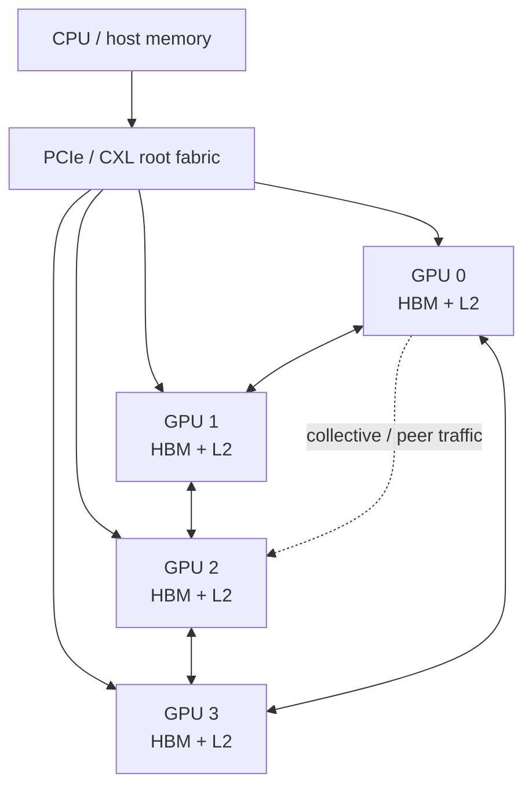
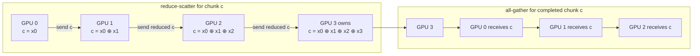
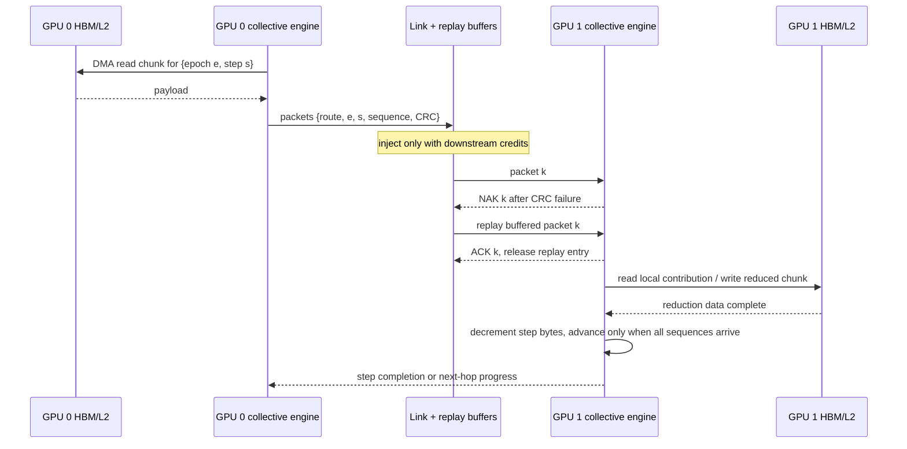

# Multi–Graphics Processing Unit (GPU) Interconnect and Execution

> **First-time reader orientation:** Multiple GPUs exchange data over peer links arranged in a topology. Collective operations coordinate all devices; all-reduce, for example, combines values and returns the result to every participant. At scale, communication volume, link placement, synchronization, and overlap with independent computation can limit performance before arithmetic capacity does.

> **Abbreviation key — skim now and return as needed:** central processing unit (CPU); design-space exploration (DSE); input-output memory management unit (IOMMU); high-bandwidth memory (HBM); error-correcting code (ECC);
> level-two cache (L2); Compute Express Link (CXL); Peripheral Component Interconnect Express (PCIe); Address Translation Services (ATS); operating system (OS);
> streaming multiprocessor (SM); gigabyte (GB); terabyte (TB); gibibyte (GiB).

> **Prerequisites:** [GPU Architecture](../01_Core_Architecture/01_GPU_Architecture.md), [GPU Memory System](../02_Memory_System/01_Coalescing_Caches_and_Shared_Memory.md), [Network on Chip](../../04_SoC_and_Chiplet_Architecture/04_On_Chip_Networks/01_Network_on_Chip.md), and basic parallel-program decomposition.
> **Hands off to:** runtime/compiler collective scheduling, datacenter networking, and package/fabric implementation. This page owns device topology, placement, communication algorithms, remote memory, and overlap.

---

## 0. Why this page exists

Adding GPUs multiplies peak compute and local HBM, but it also partitions memory and inserts communication. Scaling is determined by the slowest of compute, local memory, inter-GPU fabric, host/device path, and synchronization.

The architecture question is not “how many GPUs?” It is which tensor/data state resides where, which communication pattern follows, and whether that pattern matches topology bandwidth and latency.

### 0.1 How scale-up mechanisms evolve

Replicating a kernel on more GPUs is the baseline. It scales only independent work; any partitioned tensor introduces a new movement and synchronization problem. The scale-up stack grows in response:

```mermaid
flowchart LR
    A["independent GPUs<br/>host stages every transfer"] -->|"host path copies twice and bottlenecks"| B["peer DMA / peer virtual addressing"]
    B -->|"many peers need the same group operation"| C["collective engines and algorithms"]
    C -->|"one algorithm performs poorly on nonuniform links"| D["topology discovery + hierarchical collectives"]
    D -->|"communication sits on the step critical path"| E["chunking + compute/communication overlap"]
    E -->|"shared HBM and injection resources interfere"| F["admission, channels, QoS, congestion control"]
    F -->|"link/device faults grow likely at scale"| G["CRC, replay, timeout, reconfiguration, checkpoint"]
```

Direct memory access (**DMA**) means a copy engine moves data without making scalar GPU lanes execute each load and store. Peer DMA removes the host from the payload path, but not from setup, address authorization, or completion control. A collective adds a distributed state machine above DMA: every rank must agree on participant set, tensor range, reduction operation, sequence number, and completion epoch.

## Before the details: a collective is an algorithm placed on links

A multi-GPU system is a graph: GPUs are vertices and physical links are edges with bandwidth, latency, direction, and sharing rules. Software tensors or tasks are placed on vertices. Communication algorithms choose paths and schedule chunks over edges. The same nominal link rate can produce very different performance depending on topology and placement.

Collectives express common group operations. In all-reduce, every GPU contributes data, a reduction combines the contributions, and all GPUs receive the result. A ring moves chunks through neighbors with high bandwidth efficiency for large messages but several sequential steps. A tree reduces step count for small messages but can concentrate traffic. Real runtimes may use hierarchical combinations across links, sockets, and nodes.

**Beginner checkpoint:** separate startup latency, transferred bytes, effective link bandwidth, and synchronization. Communication is hidden only when independent computation exists at the same time and the hardware can progress both without fighting for the same memory bandwidth.

## 1. Topology and path semantics

Common organizations:

- host-rooted PCIe tree/switch;
- direct peer links in ring, mesh, or fully connected local group;
- package-scale GPU modules with dense die-to-die links;
- multi-node fabric with network interface and switch hierarchy;
- hybrid: fast intra-node links, slower inter-node network.

For pair $(i,j)$ characterize:

$$
(BW_{ij},\ L_{ij},\ H_{ij},\ shared\ links,\ peer\ access,\ atomic/coherence\ scope).
$$

A single “fabric bandwidth” number hides oversubscription and nonuniform paths. Build a topology matrix and identify bisection cuts (partitions splitting the device set into two halves) used by each collective.

## 2. Communication cost model

The alpha–beta model for message size $n$ bytes is

$$
T(n)=\alpha+\beta n,
$$

where $\alpha$ is startup/software/protocol latency and $\beta=1/BW_{effective}$. Multi-hop/contention adds terms; LogGP-like models distinguish per-message and per-byte overhead, sender/receiver gaps, and in-flight capacity.

Small synchronization/control messages are latency-bound; gradients/activation transfers are bandwidth-bound. Batching small messages amortizes $\alpha$ but delays readiness and increases buffer demand.

## 3. Parallel decomposition creates traffic

| Decomposition | Partitioned state | Dominant communication |
|---|---|---|
| data parallel | input/batch; model replicated | gradient all-reduce |
| tensor/model parallel | tensor dimensions/layers | all-reduce, all-gather, reduce-scatter per layer |
| pipeline parallel | layer stages | activation point-to-point, pipeline bubbles |
| expert parallel | experts | all-to-all token dispatch/return |
| sequence/context parallel | sequence dimensions | gather/reduce around attention/state |

The decomposition must fit memory and minimize communication on slow topology levels. Place tightly communicating ranks on high-bandwidth local links; map larger-granularity pipeline/data groups across nodes.

## 4. Collective algorithms

### 4.1 Ring all-reduce

Reduce-scatter plus all-gather around $P$ participants. Each sends approximately

$$
V_{ring}=2\frac{P-1}{P}N
$$

bytes for tensor size $N$, with $2(P-1)$ steps. Each of the two phases runs $P-1$ steps that each move an $N/P$ chunk, giving $(P-1)N/P$ bytes per phase. It is bandwidth-efficient for large messages but latency grows with $P$.

Track one chunk in a four-GPU ring. The reduce-scatter phase accumulates one contribution at each hop until one GPU owns the reduced chunk; the all-gather phase circulates that completed chunk so every GPU receives it. Other chunks execute the same path in a pipelined rotation.

Here `⊕` denotes the chosen associative reduction, such as floating-point addition; it is not necessarily bitwise XOR. Actual floating-point order matters numerically, so algorithm/ring-order changes can alter rounding even when every implementation is mathematically an all-reduce.

### 4.2 Tree all-reduce

Reduction up and broadcast down use $O(\log P)$ steps, good for latency/smaller messages. Links near the root can bottleneck unless the topology/tree is balanced.

### 4.3 Hierarchical collectives

Reduce within fast local groups, exchange among group leaders, then distribute locally. This matches hybrid topology and keeps bulk traffic off slower cuts. Algorithm selection should depend on message size, topology, concurrency, and available channels.

### 4.4 All-to-all

Expert/token exchange stresses bisection bandwidth and endpoint queues. Every participant sends distinct data to every other. Routing imbalance and incast (many senders converging on one receiver) can dominate even if aggregate bytes look acceptable.

### 4.5 One chunk through DMA, link credits, reduction, and replay

A chunk descriptor needs communicator/epoch, source and destination ranges, collective step, peer/route, reduction type and precision, byte count, packet sequence range, and completion event. One hop proceeds as follows:

A **credit** is permission indicating downstream buffer space; it prevents the sender from overwriting a full receiver. A cyclic-redundancy check (**CRC**) detects corrupted link packets; a negative acknowledgement (**NAK**) asks the transmitter to resend from its replay buffer. Replay repairs transport, not collective semantics: duplicate packet sequence numbers must be suppressed so a reduction is not applied twice. The collective step completes only after all required packets are accepted, reduced/stored at the required visibility scope, and any error policy resolves.

## 5. Scaling efficiency

Strong-scaling efficiency for $P$ devices is

$$
\eta_P=\frac{T_1}{PT_P}.
$$

Per-step time can be decomposed:

$$
T_P=T_{compute}/P+T_{local-memory}+T_{comm}+T_{sync}+T_{imbalance}.
$$

Communication often grows or stops shrinking while compute/device falls as $1/P$. The scaling knee occurs when communication plus imbalance approaches compute.

For roofline-style analysis, add fabric operational intensity $I_f=operations/communicated\ byte$ and fabric roof $BW_fI_f$. A kernel can be HBM-compute-bound on one GPU and fabric-bound after partitioning.

## 6. Overlap and chunking

If communication depends on completed compute chunks, pipeline them:

$$
T_{step}\approx T_{startup}+\max(T_{compute},T_{comm})+T_{drain}
$$

under ideal overlap. Real overlap competes for SMs, copy engines, HBM, L2, and fabric injection.

Chunk size trades startup against overlap:

- small chunks begin early but pay more $\alpha$, headers, kernel launches, and synchronization;
- large chunks achieve bandwidth but expose an end-of-step tail;
- too many in-flight chunks exhaust queues/buffers and contend with compute memory traffic.

Use separate streams/engines and dependency events, then measure actual simultaneous compute/fabric/HBM utilization rather than assuming overlap.

| Change | Why it can help | When it loses | Required evidence |
|---|---|---|---|
| smaller chunks | starts communication earlier and shortens drain tail | startup/header/event cost dominates; too many queue entries | exposed tail falls more than message-rate and queue stalls rise |
| more collective channels | uses parallel links/routes | channels contend for the same HBM, L2, or bottleneck cut | per-link balance improves without HBM slowdown |
| aggressive overlap | hides communication behind independent kernels | compute and DMA share HBM/L2 or reserve too many SM resources | simultaneous timeline plus compute-only and comm-only baselines |
| compression/low precision | moves fewer bytes | conversion cost, error, or poor compressibility dominates | payload reduction, conversion time, and numerical/convergence result |
| hierarchical algorithm | keeps bulk traffic on fast local links | leader or upper-tier phase becomes serialized | bytes and time per topology tier, not aggregate fabric utilization |

## 7. Peer memory and address spaces

Peer access lets one GPU load/store another's memory through the fabric. Benefits: avoids explicit copy and enables fine-grained sharing. Costs:

- remote latency and lower/bottleneck bandwidth;
- address translation/IOMMU/ATS state;
- cacheability/coherence scope uncertainty;
- remote atomics support/serialization;
- topology-dependent performance;
- page placement and fault migration.

Unified virtual addressing provides a common pointer namespace, not uniform physical memory. Managed/unified memory may migrate or map pages remotely. Page thrashing occurs when alternating GPUs repeatedly fault/write the same pages.

Prefer explicit ownership and bulk movement for predictable high-volume reuse; use remote access for sparse/irregular sharing when copy amplification would be worse.

## 8. Coherence and consistency choices

Possible domains:

- no hardware coherence across GPU memories; explicit copies/synchronization;
- coherent system memory at host/device scope;
- peer L2 or package-coherent domain within a module;
- software-managed collective state with memory fences/atomics.

Hardware coherence simplifies shared data structures but creates directory/fabric traffic and remote ownership latency. Bulk ML/HPC workloads often perform better with explicit partitioning and collectives because communication is semantically coarse.

Specify fence/atomic scope: thread, block, device, system, or cluster. A device-scope completion may not make data visible to a peer/host without a stronger operation.

## 9. HBM and fabric contention

Collectives read/write local HBM in addition to transmitting. Ring all-reduce can consume roughly the communicated volume at HBM ingress/egress for reduction/copy. Concurrent compute may be HBM-bound, so “communication engine” traffic steals memory bandwidth even when fabric links are independent.

Track three roofs:

$$
P\le\min(P_{compute},\ BW_{HBM}I_{HBM},\ BW_{fabric}I_{fabric}).
$$

Compression/quantization reduces fabric/HBM bytes but costs compute and may alter numerical convergence. In-network reduction reduces endpoint traffic at greater switch/precision/programmability complexity.

## 10. Load balance and tails

Synchronous steps complete at the slowest rank. Imbalance sources:

- uneven tensor/expert/token assignment;
- topology-asymmetric placement;
- thermal/power throttling;
- HBM faults/ECC/retries;
- OS/runtime noise and host staging;
- network congestion;
- data-dependent sparse work.

Step time is approximately $\max_i T_i$, so small per-rank variance grows into a collective tail with many ranks. Use work stealing/dynamic routing where semantics permit, expert capacity controls, and topology-aware placement.

## 11. Reliability, reset, and checkpointing

At scale, device/link failures are expected over long jobs. Architecture/runtime needs:

- link CRC/replay and lane degradation;
- collective timeout and fault attribution;
- device reset without corrupting peers;
- communicator reconfiguration or job restart;
- checkpoint placement and bandwidth scheduling;
- poison/ECC propagation;
- redundant routes or spare capacity.

Checkpointing competes with training data/collectives for HBM and fabric bandwidth. Incremental/partitioned checkpoints reduce bursts but add recovery complexity.

## 12. Observability

Per link/path/rank/collective:

- payload and protocol bytes, effective bandwidth, message rate;
- startup and transfer latency percentiles;
- topology route and shared-link utilization;
- copy/collective engine occupancy and queue depth;
- overlap timeline with compute and HBM;
- collective algorithm/chunk size and per-step stalls;
- remote-page accesses, migrations, faults, thrashing;
- atomic/fence latency by scope;
- rank skew and slowest-rank causes;
- retry/errors/degraded links.

Profile the complete step timeline. Device kernel metrics alone cannot explain scale-up efficiency.

### 12.1 Verification and procedural diagnosis

Correctness properties should cover both transport and collective state:

1. each packet sequence is accepted at most once per communicator epoch and collective step, even across CRC replay;
2. a credit is consumed only when a packet occupies the corresponding downstream resource and returned exactly once when that resource is freed;
3. reduction completion includes every required rank exactly once and cannot mix tensor ranges, data types, operations, or epochs;
4. DMA completion is not reported before data reaches the promised visibility point; system- or peer-scope consumers use the required fence;
5. timeout, link reset, or rank failure either completes reconfiguration consistently across ranks or terminates the collective—no subset may silently continue in the old communicator;
6. route/channel arbitration guarantees the documented progress class and cannot deadlock a cyclic request/response dependency;
7. overlapping compute cannot overwrite a chunk until its last collective reader releases it.

Diagnose a slow collective in path order: confirm all ranks entered the same operation; locate the slowest rank and first delayed chunk; separate DMA-read, injection-credit, link-transfer/replay, remote reduction/write, and synchronization time; identify the hottest physical cut; then compare that interval with HBM and compute activity. This avoids “fabric bound” as a catch-all when the actual limit is source HBM, endpoint reduction, rank skew, or a missing overlap dependency.

## 13. Numbers to remember

- Topology is a matrix of path bandwidth/latency/shared cuts, not one fabric number.
- Ring all-reduce communicates about $2(P-1)N/P$ bytes per participant for tensor size $N$.
- Tree collectives reduce steps to $O(\log P)$; ring emphasizes large-message bandwidth.
- Unified addressing does not imply uniform location, latency, or coherence.
- Communication also consumes local HBM/L2 and may contend with compute.
- Synchronous job time follows the slowest rank; variance becomes a scaling cost.

## 14. Worked problems

### Problem 1 — ring volume/time

Eight GPUs all-reduce a 4 GiB gradient. Per GPU volume is

$$
2\frac78\times4=7\ \text{GiB}.
$$

At effective 100 GB/s, transfer floor is about 75 ms (using GiB/GB carefully; $7\ \text{GiB}/100\ \text{GB/s}$), plus 14 startup steps and local reduction/HBM overhead.

### Problem 2 — overlap

Compute takes 120 ms and communication 80 ms. Without overlap, 200 ms. Ideal overlap gives about 120 ms plus startup/drain. Measured 150 ms implies 50 ms hidden; remaining 30 ms is exposed due to dependency tails/resource contention.

### Problem 3 — strong scaling knee

One GPU compute is 800 ms. Fixed communication/synchronization is 60 ms. At eight GPUs, ideal compute is 100 ms and total 160 ms, speedup 5×, efficiency $5/8=62.5\%$. Further GPUs rapidly expose the fixed 60 ms.

## Cross-references

- **Single-device roots:** [GPU Architecture](../01_Core_Architecture/01_GPU_Architecture.md), [GPU Memory System](../02_Memory_System/01_Coalescing_Caches_and_Shared_Memory.md), [HBM](../02_Memory_System/02_HBM_and_Advanced_Memory_Systems.md).
- **Fabric:** [Chiplets, CXL, and Die-to-Die](../../04_SoC_and_Chiplet_Architecture/05_IO_and_Chiplets/02_Chiplets_CXL_and_Die_to_Die.md), [Network on Chip](../../04_SoC_and_Chiplet_Architecture/04_On_Chip_Networks/01_Network_on_Chip.md).
- **Modeling:** [Full-Chip Modeling](../../04_SoC_and_Chiplet_Architecture/01_System_Modeling/01_Full_Chip_Modeling.md), [Performance Modeling and DSE](../00_Design_Methodology/01_GPU_Workloads_Performance_and_DSE.md).
- **AI deployment:** [AI Workload and Operator Mapping](../05_AI_Workloads_and_Serving/01_AI_Workload_and_Operator_Mapping.md) maps TP/DP/PP/EP to collectives, while [End-to-End GPU AI Inference and Serving](../05_AI_Workloads_and_Serving/02_End_to_End_GPU_AI_Inference_and_Serving.md) covers KV transfer, MoE all-to-all, routing, and disaggregated prefill/decode.

## References

1. NVIDIA, NCCL documentation and collective algorithm guidance.
2. NVIDIA, [CUDA Programming Guide](https://docs.nvidia.com/cuda/cuda-programming-guide/) (peer/unified memory and synchronization scopes).
3. P. Patarasuk and X. Yuan, “Bandwidth Optimal All-reduce Algorithms for Clusters of Workstations,” JPDC 2009.
4. A. Alexandrov et al., “MPI/Complete Exchange on Multi-GPU Systems,” architecture and collective literature.
5. UCIe and CXL consortium specifications for package/off-package fabrics.

---

**Navigation:** [Multi-GPU Scale-Up index](00_Index.md) · [GPU index](../00_Index.md)
