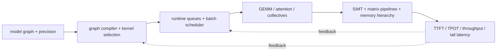

# Graphics Processing Unit (GPU) Architecture › Artificial Intelligence Workloads and Serving

> **First-time reader:** This section starts with an artificial intelligence (AI) model graph and follows it down to instructions, data movement, GPU queues, and measured serving latency. It treats an AI service as one coupled architecture: software choices change tensor shapes and schedules; those choices determine whether streaming multiprocessors (SMs), matrix units, high-bandwidth memory (HBM), or GPU-to-GPU links become the bottleneck.

## Terms introduced here

| Term | Meaning |
|---|---|
| inference | running a trained model to produce predictions or generated tokens |
| serving | accepting requests, scheduling inference, and returning results under latency and throughput objectives |
| prefill | processing all prompt tokens and constructing the initial attention state |
| decode | producing autoregressive output one step at a time |
| key-value (KV) cache | saved attention keys and values reused by later decode steps |
| time to first token (TTFT) | request arrival to availability of the first generated token |
| time per output token (TPOT) | average time between generated tokens after the first |
| service-level objective (SLO) | latency, throughput, availability, or quality target the service promises to meet |
| general matrix multiplication (GEMM) | matrix–matrix multiply, usually with many rows of activations |
| general matrix–vector multiplication (GEMV) | matrix–vector multiply, common at very small decode batches |
| operational intensity | useful operations divided by bytes crossing a named memory or fabric boundary |
| continuous batching | rebuilding the active request batch at each decode iteration |
| mixture of experts (MoE) | model in which a router sends each token to a subset of expert sub-networks |
| tensor parallelism (TP) | partitioning a tensor operation across devices |
| data parallelism (DP) | replicating a model or stage while partitioning requests or training samples |
| pipeline parallelism (PP) | assigning different layer ranges to different devices |
| expert parallelism (EP) | placing different MoE experts on different devices |

## Reading order

1. [AI Workload and Operator Mapping](01_AI_Workload_and_Operator_Mapping.md) — derive how Transformer and other AI operators become SIMT, matrix, memory, and collective work.
2. [End-to-End GPU AI Inference and Serving](02_End_to_End_GPU_AI_Inference_and_Serving.md) — trace weights and one request from storage through HBM, prefill, KV-cache management, decode, and response streaming.
3. [GPU AI Performance Analysis and Research Methods](03_GPU_AI_Performance_Analysis_and_Research_Methods.md) — build roofline, capacity, communication, queueing, profiling, simulation, and evidence workflows.
4. [GPU Framework, Compiler, Kernel, and Runtime Blueprint](04_GPU_Framework_Compiler_Kernel_and_Runtime_Implementation_Blueprint.md) — graph/IR contracts, compiler legality, kernel ABI/code generation, autotuning, memory, streams/events/graphs, and multi-GPU plans.
5. [GPU Serving Engine, Scheduler, and KV-State Blueprint](05_GPU_Serving_Engine_Scheduler_and_KV_Implementation_Blueprint.md) — admission, iteration scheduling, paged/prefix KV, speculative state, collectives, disaggregated handoff, and failure behavior.
6. [GPU AI-Stack Verification, Operations, and Deployment](06_GPU_AI_Stack_Verification_Operations_and_Deployment_Blueprint.md) — compiler/kernel/runtime validation, telemetry, performance qualification, worker readiness, canary/drain/rollback, security, and fault recovery.

## The cross-layer contract

Every serious analysis must preserve this chain. A kernel-only speedup can disappear in launch gaps; higher throughput can violate a tail-latency SLO; more batching can exhaust KV capacity; a lower-precision matrix unit is useful only if conversion, scaling, and memory layout do not erase its benefit.

The implementation completion target is stronger: a reader should be able to derive the graph/compiler/runtime artifacts, kernel and dependency contracts, request/KV state machines, multi-GPU transfer protocol, validation matrix, telemetry schema, and fleet rollout/runbook.

The chapters apply the notebook-wide [Research-Depth and Evidence Standard](../../../Research_Depth_and_Evidence_Standard.md): claims connect workload → mechanism → theory/assumptions → observables → validation and failure boundary.

## Prerequisites and handoffs

- **Before this section:** [GPU Architecture](../01_Core_Architecture/01_GPU_Architecture.md), [Advanced GPU Execution](../01_Core_Architecture/04_Independent_Thread_Scheduling_and_Asynchronous_Pipelines.md), [GPU Memory System](../02_Memory_System/00_Index.md), and [Multi-GPU Scale-Up](../03_Scale_Up/00_Index.md).
- **For detailed simulation:** [GPU Simulation](../04_Simulation/00_Index.md).
- **For dedicated spatial accelerators:** [NPU Architecture](../../03_NPU_Architecture/00_Index.md).

---

[GPU Architecture](../00_Index.md) · [Architecture book](../../00_Index.md)
