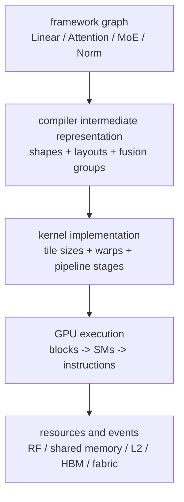

# Artificial-Intelligence Workload and Operator Mapping to GPU Microarchitecture

> **First-time reader orientation:** A framework operator such as `linear`, `attention`, or `layer_norm` is not a hardware operation. A compiler and runtime decompose it into kernels; each kernel becomes thread blocks and warps; instructions then use scalar/vector lanes, matrix pipelines, load/store units, registers, shared memory, caches, and high-bandwidth memory. This chapter derives that mapping and explains why shape, layout, reuse, precision, and batching decide performance.

> **Abbreviation key:** artificial intelligence (AI); graphics processing unit (GPU); central processing unit (CPU); streaming multiprocessor (SM); single instruction, multiple threads (SIMT); high-bandwidth memory (HBM); level-one/level-two cache (L1/L2); register file (RF); static random-access memory (SRAM); special-function unit (SFU); input/output (IO); floating-point operation (FLOP); general matrix multiplication (GEMM); general matrix–vector multiplication (GEMV); multiply–accumulate (MAC); matrix multiply–accumulate (MMA); key-value (KV); multi-head attention (MHA); grouped-query attention (GQA); multi-query attention (MQA); mixture of experts (MoE); time to first token (TTFT); time per output token (TPOT); network interface controller (NIC); direct memory access (DMA); tensor/data/pipeline/expert parallelism (TP/DP/PP/EP); operations per second (OPS); Compute Unified Device Architecture (CUDA); Heterogeneous-Computing Interface for Portability (HIP); Radeon Open Compute platform (ROCm).

---

## 0. Start from a workload contract, not a peak-arithmetic number

Freeze these inputs before predicting performance:

1. **Model:** layer count, hidden width $d$, intermediate width $d_{ff}$, attention head count, KV-head count, vocabulary, dense or MoE, activation functions, normalization, and precision by tensor.
2. **Shapes:** batch $B$, prompt length $S_p$, generated length $S_o$, image resolution, expert capacity, padding/raggedness, and whether shapes vary between requests.
3. **Semantics:** training versus inference, exact or approximate attention, deterministic requirements, allowable quantization error, sparsity structure, and sampling method.
4. **Deployment:** GPU generation, HBM capacity/bandwidth, device count and topology, CPU/NIC/storage path, compiler/runtime, kernel library, power cap, and concurrency.
5. **Objective:** throughput, TTFT, TPOT, energy/token, cost/token, tail percentile, or a constrained combination.

Peak arithmetic is only one ceiling. The same model can be matrix-compute-bound during a long prefill, HBM-bandwidth-bound during small-batch decode, fabric-bound under tensor parallelism, or scheduler-bound when kernels are tiny.

## 1. The five-stage mapping stack

At each boundary ask a different question:

| Boundary | Question | Common failure |
|---|---|---|
| graph → compiler | which operations may fuse or reorder without changing semantics? | dynamic shape or aliasing prevents fusion |
| compiler → kernel | which library/template and tile shape match this tensor? | a shape falls onto a low-efficiency fallback |
| kernel → launch | how many blocks, warps, registers, and shared-memory bytes? | too little parallel work or too much per-block state |
| launch → SM | which instruction pipelines and dependency chains are active? | tensor pipeline starves on operands or epilogue |
| SM → memory/fabric | how many useful bytes cross each boundary? | poor reuse, uncoalesced access, or collective contention |

This is why “the operator uses Tensor Cores” is incomplete. The matrix instruction may be fast while tile loads, register exchange, dequantization, softmax, or a collective controls wall time.

## 2. Transformer layer: operator graph to hardware paths

For hidden state $X\in\mathbb{R}^{M\times d}$, where $M$ is the number of tokens processed together, a decoder-only Transformer layer contains roughly:

1. normalization;
2. query/key/value projections;
3. attention score and value products;
4. output projection;
5. normalization;
6. feed-forward projections and pointwise activation;
7. residual additions.

The dense projection $Y=XW$ with $W\in\mathbb{R}^{d\times n}$ performs approximately

$$F_{matmul}=2Mdn$$

FLOPs when a fused multiply-add is counted as two operations. The mapping changes sharply with $M$:

- **large $M$:** GEMM exposes many output tiles. Matrix pipelines can remain busy and weights are reused across rows;
- **small $M$:** GEMM becomes tall-and-thin or GEMV-like. There are fewer independent tiles, weights have little reuse, and HBM bandwidth or launch overhead dominates;
- **ragged $M$:** padding wastes lane slots; grouped/ragged kernels reduce padding but add indexing and irregularity.

The residual and normalization kernels have $O(Md)$ work and $O(Md)$ bytes. They are usually bandwidth-bound unless fused into the producer or consumer. A compiler that fuses bias, activation, scaling, residual, and quantization into the GEMM epilogue avoids repeated HBM round trips.

## 3. GEMM mapping: from tiles to matrix pipelines

Consider $C_{M\times N}=A_{M\times K}B_{K\times N}$. A high-performance kernel partitions the output into thread-block tiles $B_M\times B_N$ and iterates over $K$ in chunks $B_K$:

1. a producer warp or warp group loads $A$ and $B$ tiles from HBM/L2 into shared memory;
2. address-generation work is coalesced so adjacent lanes form efficient transactions;
3. asynchronous copy machinery may move multidimensional tiles and signal a barrier;
4. consumer warps load matrix fragments and issue MMA operations;
5. accumulators remain in registers or a matrix-adjacent storage structure while the $K$ loop advances;
6. an epilogue applies bias, activation, scale, residual, or type conversion and stores $C$.

The ideal steady-state tile interval is

$$T_{tile}\ge\max(T_{load},T_{mma},T_{epilogue}),$$

but only if enough buffers exist and the stages overlap. With $D$ buffered tiles, shared-memory demand grows approximately as

$$S_{block}\approx D\,b\,(B_MB_K+B_KB_N)+S_{metadata},$$

where $b$ is bytes/element. Larger tiles increase data reuse but consume registers/shared memory and may reduce resident blocks. The optimum is not maximum occupancy; it is enough concurrency to cover latency while preserving a tile with high reuse and an efficient matrix instruction shape.

### 3.1 Reuse and operational intensity

Ignoring cache effects, one tile performs $2B_MB_NB_K$ FLOPs and loads about $b(B_MB_K+B_KB_N)$ input bytes. Its input operational intensity, after the shared $B_K$ factor cancels, is

$$I_{tile}\approx\frac{2B_MB_N}{b(B_M+B_N)}.$$

For square tiles this grows with tile width. The equation explains why on-chip SRAM and register capacity indirectly buy compute utilization: they make larger reusable tiles possible. It also explains why a matrix engine cannot be evaluated separately from its operand-delivery system.

### 3.2 Matrix versus SIMT pipelines

AI kernels use at least three execution families concurrently:

- **matrix pipelines:** dot products and MMA for projections and attention products;
- **SIMT arithmetic/special-function pipelines:** address math, reductions, activation, exponential, reciprocal, masking, and conversions;
- **load/store and asynchronous-copy pipelines:** HBM/L2/shared-memory traffic.

Moving work between these families can improve balance. A lower-precision matrix format may speed MMA but require SIMT scaling, zero-point correction, or outlier handling. A research-quality result reports the whole pipeline, not only matrix-instruction issue rate.

## 4. Prefill and training-like GEMM: why long token dimensions help

During **prefill**, all prompt tokens pass through the model together, so $M\approx B S_p$. Projection and feed-forward layers become sizable GEMMs. During training, token dimensions are usually larger still and forward, activation-gradient, and weight-gradient GEMMs dominate.

For a model with $N_p$ parameters, a useful first-order inference estimate is

$$F_{prefill}\approx2N_pBS_p+F_{attention},$$

subject to architecture-specific terms and sparsity. Long prompts increase both work and parallel tile count. Once matrix pipelines saturate, adding batch may not improve throughput and instead raises queueing delay or KV capacity pressure.

Prefill still contains non-GEMM limits:

- causal attention and masking;
- normalization and residual bandwidth;
- transposes/layout conversion between kernels;
- compilation/launch gaps for small layers;
- collectives when weights are sharded;
- power capping when many matrix units switch simultaneously.

## 5. Decode: why a matrix-rich model becomes a memory system workload

Autoregressive **decode** adds one token per active sequence per iteration. If $B$ sequences are active, projection shapes have $M=B$. At $B=1$, a large weight matrix is read to perform one vector product; reuse across rows is minimal. Approximate weight-only intensity is

$$I_{decode,weights}\approx\frac{2BN_p}{b_wN_p}=\frac{2B}{b_w}\quad\text{FLOP/byte},$$

where $b_w$ is average bytes/weight including packing metadata. Batching raises intensity because one weight read serves more sequences, until other traffic or compute becomes binding.

Bytes at different boundaries must not be added and divided by one bandwidth. Let $Q_{HBM}$ include physical HBM traffic from weights, KV, activations, and any collective staging; let $Q_{fabric}$ be payload plus protocol traffic on the GPU fabric; and let $Q_k$ represent another named cache/link boundary. A resource lower bound is

$$
T_{step}\ge\max\left(
\frac{Q_{HBM}}{BW_{HBM,eff}},
\frac{Q_{fabric}}{BW_{fabric,eff}},
\max_k\frac{Q_k}{BW_{k,eff}},
T_{compute},T_{dependency}
\right).
$$

The `max` assumes the bounds could overlap ideally. A dependency trace determines the observed critical path and how much communication remains exposed; summing total HBM and fabric service times would double-count overlapping work. Long contexts increase KV traffic; tensor parallelism adds collective traffic; quantization adds metadata and dequantization; cache misses and imperfect coalescing lower effective bandwidth.

**GEMV is not just a small GEMM.** It offers fewer independent output tiles, reductions along $K$ are longer, epilogue cost is less amortized, and the device may lack enough blocks to occupy every SM. Serving runtimes batch decode tokens partly to transform this unfavorable mapping back toward GEMM.

## 6. Attention: algorithmic equivalence, different memory traffic

Scaled dot-product attention is

$$O=\operatorname{softmax}\left(QK^T/\sqrt{d_h}\right)V.$$

A naive implementation materializes the score/probability matrix in HBM. An IO-aware tiled implementation keeps score tiles and online-softmax state on chip, avoiding those round trips. For each query tile it:

1. loads a key/value tile;
2. computes a score tile with matrix instructions;
3. updates the row maximum and normalization sum;
4. rescales the prior accumulator when the maximum changes;
5. accumulates probability-weighted values;
6. writes only the final output.

The running maximum $m_j$ and normalization $\ell_j$ after tile $j$ obey

$$m_j=\max(m_{j-1},\max s_j),$$

$$\ell_j=e^{m_{j-1}-m_j}\ell_{j-1}+\sum_{x\in s_j}e^{x-m_j}.$$

The output accumulator is rescaled by the same factor, preserving exact softmax subject to floating-point effects. FlashAttention is therefore an **IO-complexity improvement**, not an approximation: tiling changes where intermediate state lives.

### 6.1 Prefill attention versus decode attention

| Phase | Query shape | Key/value span | Typical mapping pressure |
|---|---|---|---|
| prefill | many query rows | prompt triangle | tiled matrix work, SRAM capacity, causal load balance |
| decode | one query row per sequence | full prefix | KV-cache HBM bandwidth, irregular pages, too few query tiles |

Decode attention may split a long KV sequence across blocks/SMs and reduce partial softmax results. That creates more parallelism at the price of extra reduction traffic and synchronization. The crossover depends on sequence length, batch, head count, and GPU size.

## 7. The KV cache maps a data structure into the memory hierarchy

For $L$ layers, $H_{kv}$ KV heads, head dimension $d_h$, and $b_{kv}$ bytes/element, the stored KV bytes per token are

$$C_{token}=2LH_{kv}d_hb_{kv}.$$

The factor $2$ counts the stored key and value tensors.

For sequences with lengths $S_i$,

$$C_{KV}=C_{token}\sum_i S_i.$$

MHA uses one KV head per query head. GQA shares KV across groups of query heads; MQA shares one KV head. Reducing $H_{kv}$ lowers both capacity and decode bandwidth, but changes the model architecture and potentially quality.

Production engines allocate KV in fixed-size token blocks. A per-sequence block table maps logical token blocks to physical HBM blocks. The attention kernel gathers pages while maintaining coalescing as well as possible. This resembles virtual memory conceptually but is a software/runtime mapping, not a hardware translation lookaside buffer (TLB): block-table lookup and address generation occur in the kernel or prepared metadata.

Block size trades:

- smaller blocks: less internal fragmentation and finer prefix sharing, more metadata and scattered access;
- larger blocks: simpler indexing and longer contiguous runs, more wasted tail capacity and coarser eviction;
- layout across layer/head/token dimensions: changes burst length, vectorization, and whether GQA reuse hits L2.

## 8. Quantization: reduce bytes only after accounting for conversion

Quantization represents weights, activations, or KV state with fewer bits. Its benefits are distinct:

1. **capacity:** more model/KV state fits in HBM;
2. **bandwidth:** fewer bytes cross HBM/fabric;
3. **compute:** supported low-precision matrix instructions may provide higher throughput.

The effective bytes include scales, zero points, group metadata, padding, and any unpacked intermediates:

$$b_{effective}=b_{payload}+\frac{b_{scale}+b_{zero}+b_{metadata}}{n_{group}}.$$

The runtime may dequantize into registers/shared memory and feed a wider accumulator. A design can be bandwidth-improved but SIMT-bound on dequantization, or compute-improved but accuracy-limited. Measure:

- packed bytes actually read;
- conversion and scaling instructions;
- matrix-pipeline utilization;
- register pressure from scales/accumulators;
- end-to-end quality on the intended distribution.

Dynamic activation quantization adds reduction work to find scales. Weight-only quantization helps small-batch decode especially because weights dominate traffic. KV quantization matters increasingly with long context and high concurrency.

## 9. Mixture-of-experts mapping: irregularity reaches every layer

An MoE layer computes router scores, selects $k$ experts per token, permutes tokens by expert, runs expert feed-forward networks, and unpermutes outputs. Let $T$ be tokens and $E$ experts. If expert $e$ receives $T_e$ tokens, ideal balance has $T_e\approx kT/E$, but data-dependent routing creates variance.

GPU mapping:

1. **router:** small GEMM plus top-$k$ selection; reductions and sorting may be SIMT-bound;
2. **histogram/prefix sum:** count tokens per expert and compute offsets;
3. **dispatch:** scatter/gather; coalescing depends on permutation design;
4. **expert compute:** grouped GEMM over many unequal $T_e$ shapes;
5. **combine:** weighted gather and residual path;
6. **expert parallelism:** all-to-all sends tokens to GPUs owning selected experts and returns results.

With capacity factor $c$, an implementation may allocate approximately

$$T_{cap}=\left\lceil c\frac{kT}{E}\right\rceil$$

slots per expert. Larger $c$ reduces token dropping/overflow but increases padding and memory. The step waits for the slowest expert/rank, so tail imbalance matters more than average utilization. Persistent kernels and dynamic work queues can improve load balance, but queue atomics and fairness become microarchitectural costs.

## 10. Other AI workloads: do not overfit the model to Transformers

| Workload/operator | Dominant mapping | Frequent limiter |
|---|---|---|
| convolution | implicit-GEMM or direct tiled convolution | tensor utilization, activation reuse, layout conversion |
| embedding/recommendation | gather/scatter and reductions | HBM capacity, random access, cache/TLB misses, network fetch |
| graph neural network | sparse neighbor gather and segmented reduction | divergence, irregular memory, atomics, imbalance |
| diffusion/vision Transformer | repeated GEMMs, convolutions, attention | launch/fusion, tensor compute, activation memory |
| recurrent/state-space model | scan/convolution/state update | sequential dependence, fusion, state bandwidth |
| sparse matrix multiply | metadata decode plus nonzero MACs | load balance and useful work per fetched metadata byte |

The universal method is to count useful operations, bytes at each tier, independent tiles, synchronization, and variance. “AI workload” is not one roofline point.

## 11. Parallelism maps tensors onto a topology

### 11.1 Tensor parallelism

Partition a projection along output or input dimensions. One form produces partial outputs that require all-reduce; another requires all-gathered activations. For message size $n$ and $P$ GPUs, a ring all-reduce sends about

$$V_{ring}=2\frac{P-1}{P}n$$

bytes per GPU. The factor of two reflects a reduce-scatter then an all-gather, each moving $\frac{P-1}{P}n$ bytes per GPU. TP reduces per-GPU weight bytes and compute but inserts communication inside every layer, making low latency and fast scale-up links important.

### 11.2 Data parallelism

For inference, replicas serve independent request sets. DP scales aggregate throughput without per-layer communication, but each replica needs weights and adequate KV capacity. Routing and load variance decide tail latency. In training, DP adds gradient collectives.

### 11.3 Pipeline parallelism

Layer ranges live on different GPUs; activations flow between stages. With $P$ stages and $m$ microbatches, a simple training pipeline's ideal utilization approaches

$$\eta_{pipe}\approx\frac{m}{m+P-1},$$

before imbalance and communication. Here the $m$ useful microbatch steps run against a fill-and-drain bubble of $P-1$ steps. In autoregressive inference, token-by-token dependencies and small microbatches complicate bubble hiding.

### 11.4 Expert parallelism

Experts are partitioned across ranks. Each MoE layer performs all-to-all traffic proportional to dispatched token activations, with data-dependent destinations. EP should be placed on topology regions with high bisection bandwidth and monitored for incast (many ranks sending to one destination at once) and rank skew.

### 11.5 Combined parallelism

Large deployments build a process grid such as `DP × PP × TP × EP`. The product is not the analysis. Write down each tensor's owner, layout, collective, bytes, dependency point, and topology path. Then determine which communication can overlap with independent compute without competing for HBM or SM resources.

## 12. NVIDIA and AMD terminology without confusing concepts with products

| Concept | NVIDIA-oriented term | AMD-oriented term | Architectural role |
|---|---|---|---|
| scheduled lane group | warp | wavefront | SIMT issue/control group |
| throughput core | streaming multiprocessor (SM) | compute unit (CU) | resident groups, schedulers, RF, execution units |
| scratchpad | shared memory | local data share (LDS) | software-managed on-chip tile storage |
| matrix instruction family | MMA / warp-group MMA | matrix fused multiply-add (MFMA) | cooperative matrix operation |
| programming stack | CUDA | HIP/ROCm | host runtime, compiler, libraries, tools |

Exact lane-group width, instruction shape, memory size, and pipeline count are generation-specific. Portable reasoning uses the architectural roles; tuned code must query and target the actual device. Triton and compiler-generated kernels still need backend-specific lowering, scheduling, and validation.

### 12.1 What modern product evolution is trying to fix

Use named products as case studies in bottleneck response, not as lists of peak numbers:

- **Hopper-class NVIDIA GPUs:** Tensor Memory Accelerator (TMA) bulk tensor copies, transaction barriers, warp-group matrix operations, and thread-block clusters strengthen the producer→shared-memory→matrix pipeline. The architectural aim is to reduce lane address-generation/register traffic and enable larger asynchronous cooperative tiles.
- **SM100-class NVIDIA Blackwell GPUs:** the `tcgen05` matrix family uses a dedicated tensor-memory (TMEM) data locale for accumulators and selected operands. Moving long-lived accumulators away from the conventional register file can free RF bandwidth/capacity for producers and epilogues, but introduces a distinct allocation, movement, synchronization, and lifetime problem. Do not generalize this SM100 contract to every product carrying the Blackwell family name; target code must check compute capability and instruction support.
- **AMD MI300-series CDNA 3 GPUs:** accelerator complex dies (XCDs), I/O dies (IODs), shared last-level cache, HBM, and Infinity Fabric create a nonuniform package-scale memory/communication system. Compute units issue matrix fused multiply-add (MFMA), vector, scalar, memory, and local-data-share instructions. A kernel must balance those pipelines and preserve locality across compute-die/cache/HBM paths; a nominally single GPU can still have internal placement and traffic questions. Other CDNA generations need their own topology contract.

These designs converge on the same research problem: matrix arithmetic grows faster than the ability to deliver operands, retain accumulators, coordinate producers/consumers, and communicate between dies/devices. Compare them with a common vector:

$$\langle P_{matrix},\ BW_{RF},\ C_{acc},\ BW_{scratchpad},\ C_{last\ level},\ BW_{HBM},\ BW_{die},\ BW_{scale-up},\ P_{power}\rangle.$$

Here $C_{acc}$ is accumulator capacity and $P_{power}$ is the sustainable power envelope. Then test workload shapes against every component rather than declaring a winner from one peak value.

## 13. Observable evidence: close the workload→mechanism chain

| Workload claim | Hardware mechanism/model | Observable evidence | Validation or disconfirmation |
|---|---|---|---|
| long prefill is matrix-compute-bound | large GEMM tiles; $I_{HBM}>I^*$ | matrix instructions/rate, achieved FLOP/s, HBM bytes, eligible warps, power/clock | core-clock sensitivity with weak HBM-clock sensitivity supports it; low tile count or large launch gaps refutes it |
| small-batch decode is weight-bandwidth-bound | $I\approx2B/b_w$; weights streamed | physical HBM read bytes, bandwidth, L2 hit, kernel time versus batch | lower weight precision or higher HBM clock should help; unchanged bytes/time suggests another roof |
| long-context decode is KV-bound | $C_{token}BS$ read demand | attention HBM bytes, block-table/page statistics, context-length sweep | near-linear byte/time growth with $S$ supports it; cache reuse or split-reduction overhead can alter the slope |
| FlashAttention helps through IO reduction | scores/probabilities stay on-chip | HBM read/write bytes, shared-memory traffic, tensor/SFU mix | compare mathematically equivalent kernels at equal precision and shape; FLOP reduction is not the expected cause |
| MoE is imbalance/fabric-bound | $\max T_e$, all-to-all and grouped GEMM | expert/rank histograms, all-to-all bytes/tails, slowest-rank timeline | rebalance or topology remap should reduce critical-path skew; unchanged skew points to kernel shape or queueing |
| quantization helps decode | lower packed weight/KV bytes | actual payload+metadata bytes, conversion instructions, matrix format, quality | require equal quality target and an ablation separating bandwidth, compute-format, and dequantization effects |

Counters must be paired with exact timing boundaries. Kernel replay used for counter collection can serialize execution, so use an unperturbed timeline for latency and a matched profiled run for mechanism evidence.

## 14. A worked mapping diagnosis

Suppose one full dense-model decode pass applies $N_p=70$ billion weights at effective $b_w=0.5$ byte/weight, batch $B=8$, and effective HBM bandwidth $BW=2.5$ TB/s. This is a model-level aggregate over dense projections, not one projection kernel. Ignoring KV and other traffic:

$$Q_w=35\text{ GB},\qquad F=2BN_p=1.12\text{ TFLOP},$$

$$I=F/Q_w=32\text{ FLOP/byte},\qquad T_{HBM}\ge35/2500=14\text{ ms}.$$

If the low-precision compute roof is 500 TFLOP/s, $T_{compute}\ge1.12/500=2.24$ ms. The aggregate dense pass is HBM-bound under these assumptions. Increasing matrix throughput alone has little effect. Raising batch to 64 increases $I$ to 256 FLOP/byte; the same weight read serves eight times as many rows, so compute, KV traffic, or latency SLO may become the next constraint.

This is a hypothesis, not a result. Validate actual weight bytes, cache behavior, conversion work, achieved bandwidth, kernel occupancy, and service-level TPOT.

## 15. Validity boundaries and failure modes

The models in this chapter deliberately omit details until measurement supplies them:

- Roofline assumes steady throughput and adequate independent work; it does not predict launch gaps, dependency latency, bank conflicts, or queue tails.
- Tensor-size bytes are not physical traffic when caching, overfetch, compression, paging metadata, or collective buffers intervene.
- The $2N_p$ FLOP/token approximation fits dense projections at a high level; attention, MoE activation, embedding, multimodal encoders, and sparsity alter it.
- “Prefill compute-bound, decode memory-bound” is a common regime, not a law. Short prompts, small models, large decode batches, inefficient kernels, or slow fabrics can reverse it.
- Peak matrix rates assume supported shapes/types and count issued arithmetic. Padding, masked work, and rejected speculative branches lower useful efficiency.
- Vendor terms do not imply identical semantics across generations. Validate instruction behavior, resource limits, and counters on the target device.

Implementation failures include asynchronous buffer reuse before completion, shared-memory bank conflicts, excessive RF pressure, invalid quantization scales, KV-page aliasing, collective deadlock, MoE capacity overflow, and numerical instability in fused softmax/reductions. Each needs a correctness test in addition to a performance counter.

## 16. Research questions exposed by the mapping

- Can compilers choose tiles jointly across fused operators instead of optimizing each kernel locally?
- How should matrix, SIMT, and data-movement issue capacity be balanced for low-precision attention and MoE?
- Can KV layouts preserve paging flexibility while recovering long coalesced bursts and cache reuse?
- Which hardware queues and synchronization primitives best support persistent, dynamically batched kernels?
- How should power management distinguish compute-dense prefill from bandwidth-bound decode?
- Can topology-aware compilers map TP/EP groups using measured contention rather than nominal bandwidth?
- How can profiling attribute an end-to-end SLO miss to an operator, kernel, resource, and queueing decision without perturbing execution?

## Cross-references

- [GPU Core Architecture](../01_Core_Architecture/00_Index.md)
- [GPU Memory System](../02_Memory_System/00_Index.md)
- [Multi-GPU Interconnect and Execution](../03_Scale_Up/01_Multi_GPU_Interconnect_and_Execution.md)
- [End-to-End GPU AI Inference and Serving](02_End_to_End_GPU_AI_Inference_and_Serving.md)
- [GPU AI Performance Analysis and Research Methods](03_GPU_AI_Performance_Analysis_and_Research_Methods.md)

## References

1. S. Williams, A. Waterman, and D. Patterson, [“Roofline: An Insightful Visual Performance Model for Multicore Architectures,”](https://doi.org/10.1145/1498765.1498785) *Communications of the ACM*, 2009.
2. T. Dao et al., [“FlashAttention: Fast and Memory-Efficient Exact Attention with IO-Awareness,”](https://proceedings.neurips.cc/paper_files/paper/2022/hash/67d57c32e20fd0a7a302cb81d36e40d5-Abstract.html) NeurIPS 2022.
3. NVIDIA, [CUDA Programming Guide](https://docs.nvidia.com/cuda/cuda-programming-guide/).
4. AMD, [ROCm documentation](https://rocm.docs.amd.com/).
5. OpenAI, [Triton documentation](https://triton-lang.org/main/index.html).
6. M. Shoeybi et al., [“Megatron-LM: Training Multi-Billion Parameter Language Models Using Model Parallelism,”](https://arxiv.org/abs/1909.08053) 2019.
7. NVIDIA, [Blackwell Tuning Guide](https://docs.nvidia.com/cuda/blackwell-tuning-guide/).
8. NVIDIA CUTLASS, [`tcgen05` MMA Programming Guide](https://docs.nvidia.com/cutlass/latest/media/docs/pythonDSL/mma_docs/tcgen05_programming.html).
9. AMD, [CDNA Architecture](https://www.amd.com/en/technologies/cdna.html) and [MI300 Series Microarchitecture](https://instinct.docs.amd.com/develop/gpu-arch/mi300.html).
10. AMD, [ROCm Compute Profiler — Pipeline Metrics](https://rocm.docs.amd.com/projects/rocprofiler-compute/en/develop/conceptual/cdna/pipeline-metrics.html).

---

← [AI Workloads and Serving index](00_Index.md) · next → [End-to-End GPU AI Inference and Serving](02_End_to_End_GPU_AI_Inference_and_Serving.md)
