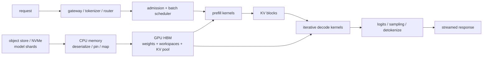

# End-to-End GPU Artificial-Intelligence Inference and Serving

> **First-time reader orientation:** Inference is the model computation; serving is the complete system that accepts requests, schedules those computations, manages persistent model and key-value state, and returns outputs under service objectives. This chapter follows both a cold model load and one live autoregressive request. Every stage identifies the software artifact, physical data location, GPU mechanism, synchronization point, and possible bottleneck.

> **Abbreviation key:** central processing unit (CPU); graphics processing unit (GPU); high-bandwidth memory (HBM); solid-state drive (SSD); non-volatile memory express (NVMe); Peripheral Component Interconnect Express (PCIe); network interface controller (NIC); direct memory access (DMA); remote direct memory access (RDMA); input/output (IO); key-value (KV); time to first token (TTFT); time per output token (TPOT); inter-token latency (ITL); service-level objective (SLO); tensor/data/pipeline/expert parallelism (TP/DP/PP/EP); general matrix multiplication (GEMM); mixture of experts (MoE).

---

## 0. The complete serving path



The latency seen by a client is not kernel time alone:

$$TTFT=T_{network,in}+T_{queue}+T_{tokenize}+T_{prefill}+T_{first\ sample}+T_{network,out}.$$

For $S_o$ output tokens, a useful decomposition is

$$T_{request}=TTFT+\sum_{j=2}^{S_o}ITL_j+T_{finish},$$

where $ITL_j$ is the interval before output token $j$. TPOT is commonly the mean of those intervals; a production system should also report their tail distribution.

## 1. Cold path: checkpoint bytes become resident weights

### 1.1 Storage artifact and sharding

A model checkpoint stores tensors plus metadata: names, shapes, data types, offsets, and possibly quantization scales. Large models are split into files or rank-oriented shards. Before loading, the deployment must define the target parallel layout:

- each TP rank owns slices of selected matrices;
- each PP rank owns selected layers;
- each EP rank owns selected experts;
- DP replicas own equivalent model partitions but independent serving state.

A mismatch between checkpoint layout and deployment layout causes host-side reshaping or GPU collectives during load. “Model size / SSD bandwidth” is therefore only a lower bound.

### 1.2 Storage → host memory

Traditional path:

$$\text{NVMe/network storage}\rightarrow\text{kernel page cache or user buffer}\rightarrow\text{pinned host buffer}.$$

The CPU parses metadata, validates tensors, and may dequantize, transpose, or repack them. Page faults, decompression, checksums, Python object creation, and many small reads can limit load time before bulk bandwidth does.

Pinned (page-locked) host memory lets a GPU copy engine DMA reliably and permits asynchronous host-to-device transfer. Pageable memory may require an implicit staging copy, which prevents the expected overlap.

### 1.3 Host/NVMe → GPU HBM

The ordinary data path traverses a PCI Express (PCIe) root complex into a GPU copy engine. With an appropriate direct-storage path, an NVMe device or NIC can DMA into registered GPU memory, reducing CPU copies. Direct does not mean free: storage, PCIe, address translation, HBM writes, and registration/setup still constrain throughput.

Let stage $j$ process $Q_j$ bytes at delivered bandwidth $B_j$ after startup latency $L_j$. If storage read, host transformation, PCIe transfer, and HBM installation are serialized, their lower bound is

$$
T_{load,serial}\ge\sum_j\left(L_j+\frac{Q_j}{B_j}\right).
$$

With chunking, double buffers, independent engines, and no hidden shared bottleneck, a pipelined loader approaches its slowest normalized stage plus fill/drain. If $W$ is the checkpoint-byte basis and transformations change byte counts, define $R_j=B_jW/Q_j$; then

$$
T_{load,pipeline}\gtrsim T_{fill/drain}+\frac{W}{\min_j R_j}.
$$

The serial sum and ideal pipeline bottleneck bracket common implementations; a timeline establishes the achieved overlap. With many replicas, shared storage/network fan-out can dominate even when one node loads quickly.

### 1.4 HBM residency plan

The allocator must reserve HBM for more than weights:

$$M_{HBM}=M_{weights}+M_{KV}+M_{workspace}+M_{runtime}+M_{graphs}+M_{fragmentation}+M_{safety}.$$

Workspaces include attention/GEMM scratch, collective buffers, sampling state, and temporary activations. A model that “fits” by comparing weights to nominal HBM can fail during engine build or at peak concurrency. Memory error correction, page granularity, and allocator pools can reduce usable capacity.

## 2. Engine construction, compilation, and warm-up

The framework graph is not launched operator-by-operator forever. An inference engine typically:

1. inspects model structure, precision, parallel layout, and maximum shapes;
2. selects library kernels or generates code;
3. fuses compatible operators;
4. chooses attention/KV layouts;
5. autotunes tile sizes for representative shapes;
6. allocates persistent workspaces and KV pools;
7. optionally captures repeatable launch sequences into a command graph;
8. runs warm-up inputs to compile just-in-time code, populate caches, initialize communication, and stabilize clocks.

### 2.1 Why dynamic shapes complicate compilation

Prompt length, active batch, KV block count, and speculative tree size vary. A compiler can:

- specialize many shape buckets: fast kernels, more compilation/cache memory;
- use a general dynamic kernel: fewer variants, more masking/index overhead;
- pad to buckets: simpler launches, wasted work;
- recapture command graphs when a shape changes: lower steady launch cost, expensive transitions.

Benchmark cold compilation separately from steady state. Hiding a minutes-long engine build behind a warm service does not make it irrelevant to rollout or recovery.

## 3. Request ingress and admission

The live path begins before the GPU:

1. a gateway authenticates, rate-limits, validates, and chooses a model;
2. a tokenizer converts text or multimodal inputs into token IDs/tensors on CPU or an accelerator;
3. a router selects a replica based on queue, topology, prefix locality, and KV capacity;
4. admission control checks memory and SLO budgets;
5. the request enters a prefill/decode scheduler.

CPU tokenization, serialization, and request routing can starve the GPU at high request rate. Pin worker threads, batch CPU work, use bounded queues, and measure enqueue-to-launch gaps rather than treating the host as instantaneous.

### 3.1 Admission is a capacity and queueing decision

For request $i$ with prompt $S_{p,i}$ and maximum output $S_{o,i}^{max}$, conservative KV reservation is

$$C_i=C_{token}(S_{p,i}+S_{o,i}^{max}).$$

Reserving the maximum protects against out-of-memory failure but wastes capacity because outputs often stop early. Allocating blocks on demand raises utilization but requires preemption, rejection, or backpressure when the pool fills. Admission should therefore use both current free blocks and a forecast of future growth.

## 4. Prefill: prompt tokens become first logits and KV state

The scheduler groups one or more prompts, possibly chunks long prompts, prepares position/mask metadata, and launches a forward pass. Per layer:

1. embeddings/normalization read prompt activations;
2. projection GEMMs produce queries, keys, and values;
3. an attention kernel computes causal attention while writing each token's K/V state into allocated KV blocks;
4. output and feed-forward GEMMs transform activations;
5. residual/normalization/quantization epilogues run, ideally fused;
6. TP/EP communication occurs at layer boundaries if the model is partitioned.

Prefill maps well to matrix pipelines because the token dimension is large. Its service cost is not just FLOPs: long prefills can occupy many SMs, consume power, and delay decode launches sharing the GPU. Chunked prefill limits each scheduling quantum so urgent decode work can run between chunks.

If a prompt has $S_p$ tokens and model parameter count is $N_p$, first-order dense-model work is

$$F_p\approx2N_pS_p+F_{attn}(S_p).$$

The attention term grows roughly quadratically with sequence length for dense attention, while projection work is linear in tokens. IO-aware attention avoids materializing the quadratic score matrix but does not remove its arithmetic.

## 5. KV allocation, layout, prefix sharing, and eviction

### 5.1 Block allocation

Divide a sequence's KV state into logical blocks of $P_t$ tokens. The engine maintains:

- a global pool of physical KV blocks in HBM;
- a free list/reference counts;
- one logical-to-physical block table per sequence;
- slot metadata passed to attention kernels;
- optional hashes/radix structures for reusable prefixes.

For logical position $s$:

$$q=\left\lfloor s/P_t\right\rfloor,\qquad o=s\bmod P_t,$$

then `physical_block = table[q]` and offset $o$ selects the token slot. This permits non-contiguous growth and prompt-prefix sharing, but paged attention kernels must gather across physical blocks.

### 5.2 Prefix caching

If requests share an identical token prefix under the same model, adapter, and relevant execution state, they can reference existing KV blocks. Correct cache identity must include every factor that changes KV values, not merely token text. Benefits depend on hit probability and prefix length:

$$E[T_{saved}]\approx p_{hit}\,T_{prefill}(S_{reused})-T_{lookup}-T_{copy/attach}.$$

Prefix locality-aware routing improves hit rate but may imbalance queues. Shared blocks need reference counts; eviction must not reclaim a block still referenced by a live request.

### 5.3 Eviction and preemption

When the pool is nearly full, choices include:

- reject or defer new work;
- evict unused prefix-cache blocks;
- preempt a live sequence and later recompute its prefix;
- swap KV state to CPU memory or storage;
- move the request to another replica if state transfer is cheaper.

Swapping helps only when transfer plus queuing is cheaper than recomputation and does not violate TPOT. Random eviction can create a feedback loop: recomputation consumes prefill compute, which delays decode, which increases residency time and memory pressure.

## 6. Decode: the iteration-level state machine

After prefill produces first logits, sampling selects a token. Each subsequent iteration:

1. choose active sequences and token budget;
2. allocate one or more future KV slots;
3. pack input token IDs, positions, block tables, sequence lengths, and sampling metadata;
4. run one target-model forward step;
5. append new K/V values;
6. produce logits, apply constraints/penalties, and sample;
7. emit accepted tokens and free finished sequences;
8. admit new work and repeat.

Decode is a **closed feedback loop**: sampled token $j$ is needed to compute token $j+1$. Kernel parallelism cannot remove this dependency across ordinary autoregressive steps.

### 6.1 Continuous batching

Static batching holds a fixed request set until all finish, wasting slots behind short sequences. Continuous batching rebuilds the active set each iteration. A completed sequence leaves immediately; a waiting request may enter at the next scheduling point.

```text
while service_running:
    reclaim_finished_KV()
    admit_requests(memory_budget, token_budget, SLO_policy)
    batch = choose_prefill_chunks_and_decode_tokens()
    metadata = build_positions_masks_and_block_tables(batch)
    launch_model_step(batch, metadata)
    sample_and_stream_outputs()
```

This raises utilization but makes shape and metadata dynamic. The scheduler trades:

- larger batch → better weight reuse and throughput;
- smaller scheduling quantum → better responsiveness and less head-of-line blocking;
- more prefills → lower waiting TTFT but more decode interference;
- more decode priority → stable TPOT but growing prefill queue.

## 7. Prefill/decode interference on one GPU

Prefill is often matrix-compute/power intensive; decode is often HBM intensive and latency sensitive. Co-locating them can be complementary, but only if hardware scheduling and resource demands allow overlap. They may interfere through:

- SM/block occupancy and non-preemptive kernels;
- HBM and L2 bandwidth;
- tensor/SIMT pipeline competition;
- power caps and clock throttling;
- launch ordering and stream priorities;
- collective channels and fabric links.

Chunked prefill caps the tokens processed in one iteration. If chunk size is $C$, a long prompt takes $\lceil S_p/C\rceil$ scheduling quanta. Smaller $C$ improves decode opportunities but increases launch, reduction, and state-management overhead. Choose $C$ from measured SLO and utilization curves, not a universal constant.

## 8. Speculative decoding changes the unit of work

A small draft model proposes $\gamma$ tokens. The target model scores the whole proposed continuation in a more parallel forward pass. An acceptance/rejection rule emits a prefix of accepted tokens while preserving the target distribution for exact speculative sampling.

Expected accepted draft tokens under a simplified independent acceptance probability $a$ are

$$E[A]=\sum_{i=1}^{\gamma}a^i=\frac{a(1-a^\gamma)}{1-a}.$$

Speedup is not simply $E[A]+1$. Include draft, verification, sampling, rejected work, and batch interactions:

$$S\approx\frac{E[\text{emitted tokens}]\,T_{ordinary\ step}}
{T_{draft}+T_{verify}+T_{accept}+T_{rollback}}.$$

GPU implications:

- verification increases the token dimension, improving matrix utilization;
- draft execution consumes GPU/CPU capacity and may contend with the target;
- tree proposals require masks, gather/scatter, and more KV slots;
- rejected branches require logical rollback or block reclamation;
- different requests accept different lengths, increasing batch raggedness;
- acceptance depends on workload, temperature, and draft quality.

A serving engine must schedule speculative sequences by **proposed token budget**, not only request count.

## 9. Quantization in the serving path

Weight quantization affects load size, HBM residency, decode bandwidth, and kernel selection. A typical kernel:

1. loads packed low-bit weights and group scales;
2. unpacks/dequantizes into registers/shared memory or uses a native supported format;
3. performs matrix operations with a wider accumulator;
4. applies output scaling and possibly requantizes activations/KV.

Calibration or dynamic scale computation can occur offline, at load time, or per request/token. Track quality and hardware cost at the same granularity. A format unsupported by the target matrix pipeline may save HBM bytes but execute through slow SIMT unpack paths.

## 10. MoE serving: router, all-to-all, grouped GEMM, return

For every MoE layer:

1. router logits and top-$k$ select expert IDs;
2. token counts determine per-expert offsets;
3. tokens are permuted into expert-contiguous buffers;
4. EP all-to-all sends tokens to expert owners;
5. grouped GEMMs run unequal expert batches;
6. a second all-to-all returns expert outputs;
7. outputs are unpermuted and combined.

The critical path includes the slowest destination and expert. Small decode batches create tiny expert GEMMs and latency-dominated messages; combining requests improves efficiency but can violate TPOT. Expert replication reduces hot-expert load but consumes weight memory. A topology-aware runtime places frequently communicating experts and EP groups within high-bisection regions.

## 11. Multi-GPU model execution

### 11.1 Tensor parallel step

A row- or column-parallel projection runs local GEMM, then an all-reduce, reduce-scatter, or all-gather. The next dependent layer cannot proceed until the necessary collective completes. Chunking the collective may overlap its early chunks with an epilogue or later independent work, but it also pays more startup operations and uses HBM for communication buffers.

### 11.2 Pipeline parallel step

Activations move stage to stage. For serving, different requests/tokens can occupy stages concurrently, but autoregressive dependencies and variable output lengths create bubbles and imbalance. Stage time is set by the slowest stage plus transfer; partition layers using measured work, not equal layer counts when MoE or heterogeneous blocks exist.

### 11.3 Data-parallel replicas

DP is the cleanest throughput scaling for inference because requests are independent. The router should account for:

- queueing and service-rate estimate;
- local prefix-cache hit;
- free KV blocks;
- replica topology/health;
- tenant priority and SLO;
- cost of moving an already-stateful request.

## 12. Disaggregated prefill and decode

Prefill and decode can run in separate GPU pools optimized and scheduled for their different regimes. Request lifecycle:

1. route request to a prefill worker;
2. allocate/write prompt KV while computing first logits;
3. reserve compatible KV blocks on a decode worker;
4. transfer KV plus metadata;
5. bind the sequence to that decode worker;
6. continue iterative decode.

KV transfer payload is approximately

$$Q_{transfer}=C_{token}S_p,$$

before headers/alignment. Transfer time has DMA, fabric, and synchronization terms. Without chunk-level overlap, the serial lower bound is

$$
T_{xfer,serial}\ge T_{setup}+\frac{Q_{transfer}}{BW_{src}}+\frac{Q_{transfer}}{BW_{fabric}}+\frac{Q_{transfer}}{BW_{dst}}+T_{visible\ tail}.
$$

If source reads, fabric transfer, and destination writes stream through independent engines with sufficient buffering, the ideal pipelined bound is

$$
T_{xfer,pipeline}\gtrsim T_{setup}+\max\left(\frac{Q_{transfer}}{BW_{src}},\frac{Q_{transfer}}{BW_{fabric}},\frac{Q_{transfer}}{BW_{dst}}\right)+T_{fill/drain}+T_{visible\ tail}.
$$

The `max` is valid only under that streaming/pipeline assumption; measure engine intervals and shared HBM contention to determine where the real transfer lies between the two bounds.

With layer-pipelined transfer, layer $l$'s KV can move while later prefill layers compute. This requires destination allocation, validity tracking, and a layout manifest. If prefill and decode use different TP degrees, KV heads must be redistributed; physical block IDs are local and cannot be copied as pointers.

Disaggregation helps when separate scaling/queuing improves SLOs more than KV transfer and operational complexity cost. It can lose for short prompts, low load, slow cross-node paths, or poor prefix locality.

## 13. CPU, NIC, storage, and GPU are one architecture

### CPU responsibilities

- tokenize/detokenize and protocol processing;
- schedule requests and construct dynamic metadata;
- manage GPU streams/graphs and memory pools;
- run sampling or constrained decoding when not fused on GPU;
- prepare collectives, monitor health, and handle faults.

### NIC/fabric responsibilities

- cross-node collectives and MoE all-to-all;
- KV state transfer for disaggregation/migration;
- remote model loading and request/response traffic;
- RDMA registration, congestion control, ordering, and retry.

### Storage responsibilities

- cold model load and replica startup;
- checkpoint/version distribution;
- optional KV/prefix spill tiers;
- failure recovery and rolling update staging.

DMA may bypass CPU copies but not CPU control or topology constraints. A path can be GPU-direct and still bottleneck on PCIe root sharing, NIC registration cache, network incast, or destination HBM traffic.

## 14. SLOs and throughput

Core metrics:

- **TTFT:** request arrival to first token;
- **TPOT:** mean decode interval after first token;
- **ITL percentile:** distribution of per-token gaps;
- **request throughput:** completed requests/s;
- **token throughput:** prompt and output tokens/s, reported separately;
- **goodput:** work completed while meeting all SLOs;
- **tail latency:** p95/p99/p99.9, not just mean;
- **energy/cost per accepted output token.**

At arrival rate $\lambda$ and mean time in system $W$, Little's law gives mean concurrent requests

$$L=\lambda W.$$

This is a capacity warning: increasing latency increases resident KV state even at unchanged request rate, which can trigger memory pressure and further latency. Queueing, memory, and execution form a feedback system.

Goodput under an SLO is

$$G=\frac{\#\text{completed requests satisfying every SLO}}{T_{measurement}}.$$

Maximizing raw tokens/s by over-batching can reduce goodput if TPOT or TTFT tails violate the contract.

## 15. A concrete request trace and critical path

Assume one 2,048-token prompt enters a warm multi-GPU replica:

1. **CPU, 0:** gateway timestamps arrival; tokenizer produces IDs.
2. **scheduler:** predicts prompt KV blocks, checks capacity, chooses replica/prefix cache.
3. **GPU metadata:** host fills pinned buffers; async copy places IDs/descriptors in HBM.
4. **prefill:** projection/attention kernels and TP collectives execute; K/V are written page by page.
5. **first sample:** logits reduction/top-$k$ or sampling produces token 1; response stream opens. TTFT ends here.
6. **decode iteration:** sequence joins current continuous batch; weights and all relevant KV pages are read; a new KV slot is appended.
7. **iteration boundary:** finished sequences leave; new prefills/chunks may enter; sampling emits accepted tokens.
8. **completion:** end-of-sequence frees private KV blocks; shared prefix blocks retain references; final accounting is recorded.

For every timeline gap classify it as queueing, CPU preparation, host-to-device copy, kernel launch, GPU execution, collective, synchronization, sampling, or network. “GPU utilization 70%” cannot identify which one owns the missing 30%.

### 15.1 Worked decision from the request trace

For the 2,048-token request, suppose correlated timestamps show 3 ms of tokenization, 5 ms of admission wait, 1 ms of metadata/copy preparation, 78 ms on the prefill critical path, and 2 ms for first sampling and client-visible emission. Then

$$TTFT=3+5+1+78+2=89\ \text{ms}.$$

During steady decode, one iteration takes 28 ms. Counters attribute 52.5 GB of HBM traffic delivered at 2.1 TB/s, giving a memory-service floor of

$$T_{HBM}\ge52.5/2100=25\ \text{ms}.$$

The compute floor is 6 ms. A tensor-parallel collective lasts 8 ms, but the dependency timeline shows 5 ms overlapped with other work, so only 3 ms is exposed. The resource maximum and trace agree that HBM is primary; the remaining few milliseconds cover exposed collective, launch, and dependency tails. Doubling matrix peak cannot reduce the 25-ms memory floor.

If a placement or compression change raises delivered bandwidth to 2.6 TB/s without changing bytes, the floor becomes $52.5/2600\approx20.2$ ms. Holding the exposed 3-ms tail approximately constant predicts a decode iteration near 23–24 ms, enough to cross a 25-ms TPOT objective. If instead the change adds dequantization or lowers effective bandwidth, the trace will reject that prediction. The decision is to prototype the byte/bandwidth intervention and verify physical HBM bytes and quality before spending area or power on more matrix pipelines.

## 16. Evidence boundaries for the serving stages

| Stage | Start/end timestamps | Mechanism evidence | Validation boundary |
|---|---|---|---|
| model load | file-open to weights-ready barrier | storage/PCIe/DMA throughput, CPU copies, shard completion, HBM allocation | cold cache versus warm cache; one replica versus concurrent fan-out |
| admission | request arrival to scheduled batch | queue length, KV reservation/free blocks, policy decision | include rejected/deferred requests; avoid survivor bias |
| prefill | first device work to first logits ready | kernel/collective critical path, FLOPs, HBM bytes, clocks/power | include metadata/copies according to declared TTFT boundary |
| KV management | allocation request to block valid/free | block events, fragmentation, page-table metadata, eviction/recompute | verify reference counts and no read-before-valid with stress/fault tests |
| decode | iteration admission to accepted-token ready | batch shape, launch graph, kernel/collective timeline, weight/KV bytes | separate verification/rejected speculative work from accepted-token goodput |
| network response | token ready to client-visible byte | serialization and network timestamps | synchronized clocks or same-host timestamp correlation |

Raw events become service metrics through explicit aggregation: `TTFT = first_token_visible - arrival`; `ITL_j = token_visible_j - token_visible_{j-1}`; goodput counts only requests meeting every declared SLO. Cross-host timestamp error, profiler perturbation, missing cancelled requests, and sampling intervals belong in the uncertainty budget.

## 17. Failure, backpressure, and correctness

Research-position depth includes behavior outside the fast path:

- **KV exhaustion:** stop admission before allocation fails; reclaim/evict/preempt deterministically;
- **GPU failure:** invalidate local KV ownership; retry from prompt or a replicated checkpoint;
- **collective failure:** time out all ranks consistently to prevent deadlock;
- **disaggregated transfer failure:** distinguish incomplete from valid KV blocks; never decode partially written state;
- **client cancellation:** propagate promptly and reclaim blocks without use-after-free;
- **numerical drift:** compare logits/tokens across precision and fused-kernel changes;
- **overload:** reject/degrade early rather than allow unbounded queues to destroy every SLO;
- **multi-tenancy:** enforce memory/compute quotas and clear/reuse buffers without data leakage.

Correctness invariants include: no token reads a KV slot before its write completes; block reuse occurs only after all streams/ranks release it; speculative rollback never exposes rejected state; and output ordering matches request identity despite dynamic batching.

## 18. Serving-architecture research problems

- Joint prefill/decode scheduling with explicit power, HBM, and SLO models.
- KV placement across HBM, peer memory, CPU memory, and storage with predictable tails.
- Dynamic TP/EP layouts that change with batch/sequence phase without excessive redistribution.
- Hardware support for paged/ragged attention address generation and block-table caching.
- Persistent GPU schedulers that reduce launch tax without harming fairness/preemption.
- Congestion-aware MoE routing that co-optimizes model balance and physical topology.
- Exact speculative decoding with adaptive proposal width under dynamic batches.
- Formal end-to-end correctness for asynchronous KV transfer, cancellation, and recovery.

## Cross-references

- [AI Workload and Operator Mapping](01_AI_Workload_and_Operator_Mapping.md)
- [GPU AI Performance Analysis and Research Methods](03_GPU_AI_Performance_Analysis_and_Research_Methods.md)
- [Advanced GPU Execution](../01_Core_Architecture/04_Independent_Thread_Scheduling_and_Asynchronous_Pipelines.md)
- [HBM and Advanced GPU Memory Systems](../02_Memory_System/02_HBM_and_Advanced_Memory_Systems.md)
- [Multi-GPU Interconnect and Execution](../03_Scale_Up/01_Multi_GPU_Interconnect_and_Execution.md)

## References

1. G.-I. Yu et al., [“Orca: A Distributed Serving System for Transformer-Based Generative Models,”](https://www.usenix.org/conference/osdi22/presentation/yu) OSDI 2022.
2. W. Kwon et al., [“Efficient Memory Management for Large Language Model Serving with PagedAttention,”](https://doi.org/10.1145/3600006.3613165) SOSP 2023.
3. Y. Leviathan, M. Kalman, and Y. Matias, [“Fast Inference from Transformers via Speculative Decoding,”](https://proceedings.mlr.press/v202/leviathan23a.html) ICML 2023.
4. NVIDIA, [CUDA Programming Guide — Asynchronous Execution](https://docs.nvidia.com/cuda/cuda-programming-guide/02-basics/asynchronous-execution.html).
5. NVIDIA, [GPUDirect documentation](https://docs.nvidia.com/cuda/gpudirect-rdma/).

---

← [AI Workload and Operator Mapping](01_AI_Workload_and_Operator_Mapping.md) · [AI Workloads and Serving index](00_Index.md) · next → [GPU AI Performance Analysis and Research Methods](03_GPU_AI_Performance_Analysis_and_Research_Methods.md)
