# GPU Artificial-Intelligence Performance Analysis, Profiling, and Research Methods

```mermaid
flowchart LR
    Q["falsifiable service/kernel question"] --> LEDGER["latency + operations + bytes ledger"]
    LEDGER --> ROOF["multi-level roofline + occupancy + communication bounds"]
    ROOF --> PROF["service timeline → kernel profile → counters"]
    PROF --> DIAG["active bottleneck and interference"]
    DIAG --> ABL["shape / batch / clock / topology ablation"]
    ABL --> VAL["validated model + uncertainty"]
    VAL --> R["research conclusion and losing cases"]
```

> **First-time reader orientation:** Performance analysis is causal inference about a machine: change one mechanism, observe the result, and rule out alternative explanations. Begin with end-to-end service objectives, descend through timelines and kernels to hardware counters, then validate a model that predicts both the baseline and controlled perturbations. A profiler counter is evidence, not a diagnosis by itself.

> **Abbreviation key:** graphics processing unit (GPU); streaming multiprocessor (SM); high-bandwidth memory (HBM); level-one/level-two cache (L1/L2); large language model (LLM); time to first token (TTFT); time per output token (TPOT); inter-token latency (ITL); service-level objective (SLO); instructions per cycle (IPC); floating-point operations per second (FLOP/s); operation (OP); general matrix multiplication (GEMM); key-value (KV); mixture of experts (MoE); tensor/expert parallelism (TP/EP); network interface controller (NIC); mean absolute percentage error (MAPE); confidence interval (CI); region of interest (ROI); design-space exploration (DSE); power, performance, and area (PPA).

---

## 0. State a falsifiable performance question

Weak question: “Why is GPU utilization low?”

Strong question: “At batch 16 and 8K context, is p99 TPOT limited by HBM traffic from weights/KV, by tensor-parallel all-reduce, or by gaps between decode launches?”

The strong question fixes workload, metric, percentile, and candidate mechanisms. A research study should declare:

- independent variable: architecture/runtime change;
- dependent metrics: service and mechanism measurements;
- controlled variables: model, inputs, precision, topology, clocks/power, software;
- hypothesized causal chain;
- expected counter/timeline changes if the hypothesis is true;
- disconfirming observations.

## 1. Metrics: distinguish useful work, rate, and contract

### 1.1 Kernel metrics

- elapsed time and launch count;
- useful FLOPs/OPS and achieved rate;
- useful bytes and physical bytes at L1/L2/HBM;
- occupancy and eligible warps;
- issue-slot and pipeline utilization;
- tensor/SIMT/load-store instruction mix;
- cache hit rate, sectors, transactions, replays;
- shared-memory bank conflicts;
- achieved HBM bandwidth;
- energy per kernel or operation.

### 1.2 Service metrics

- TTFT and TPOT/ITL distributions;
- prompt, output, and accepted output tokens/s;
- request throughput and goodput under all SLOs;
- queueing/admission delay;
- KV usage, fragmentation, prefix-cache hit, eviction/preemption;
- batch/token count per iteration;
- cost and energy per useful output token;
- error/cancellation/retry rate.

Report p50, p95, p99, and maxima with sample counts. An average hides queue bursts, long prompts, expert imbalance, thermal throttling, and network tails.

### 1.3 Utilization is not one number

“GPU utilization” may mean that any kernel was active during a sample. It does not reveal whether matrix pipelines, SIMT lanes, HBM, copy engines, or fabric were useful. Define numerator and denominator:

$$U_r=\frac{\text{time or work resource }r\text{ was productively used}}{\text{available time or capacity of }r}.$$

Productive is workload-specific: a warp executing padding, rejected speculation, or retransmission raises activity but not useful-token goodput.

## 2. Build an end-to-end latency ledger

For request $i$, a strictly serial accounting ledger is

$$T_{i,serial}=T_{front}+T_{queue}+T_{CPU}+T_{host\rightarrow device}+T_{launch\ gaps}+T_{kernels}+T_{collectives}+T_{sampling}+T_{device\rightarrow host/network}.$$

For steady decode iteration $j$, the analogous serial ledger is

$$T_{j,serial}=T_{schedule}+T_{metadata}+T_{graph/launch}+\sum_kT_{kernel,k}+\sum_cT_{collective,c}+T_{sync}+T_{sample}.$$

These equalities are valid only when the named intervals are mutually exclusive. Real streams overlap work, so observed $T_i$ and $T_j$ are the longest weighted paths through a dependency-directed acyclic graph (DAG), with queueing and resource contention reflected in the measured node durations. A task off the critical path can still consume resources and indirectly lengthen a critical task. Never sum flat profiler durations and call the result latency.

### 2.1 Overlap efficiency

For compute duration $T_c$ and communication duration $T_m$, ideal overlap is $\max(T_c,T_m)$. If observed joint duration is $T_{joint}$, define hidden fraction of the shorter component as

$$\eta_{overlap}=\frac{T_c+T_m-T_{joint}}{\min(T_c,T_m)},\quad 0\le\eta_{overlap}\le1$$

when the measurement obeys the simple two-task model. Report why overlap is incomplete: dependency tail, shared HBM/L2, SM use by collectives, insufficient channels, or scheduling gaps.

## 3. Multi-level roofline analysis

For work $F$ and bytes $Q_k$ crossing tier $k$, operational intensity is $I_k=F/Q_k$. Performance is bounded by

$$P\le\min\left(P_{compute},\;I_{L1}BW_{L1},\;I_{L2}BW_{L2},\;I_{HBM}BW_{HBM},\;I_{fabric}BW_{fabric}\right).$$

Use **measured physical traffic** for each tier, not tensor sizes alone. Cache reuse means L2 and HBM bytes differ. Sector overfetch means physical bytes exceed useful tensor bytes. Collectives read/write local HBM in addition to fabric payload.

### 3.1 Ridge point

For one memory tier,

$$I^*=\frac{P_{compute}}{BW}.$$

If $I<I^*$ the memory roof is lower; if $I>I^*$ compute is lower. The classification is conditional on adequate parallelism and efficient instruction mapping. A low-occupancy or dependency-limited kernel can sit far below both roofs.

### 3.2 Hierarchical arithmetic intensity

For tiled GEMM, the HBM intensity may be high because shared memory reuses inputs, while register-file traffic is enormous. For decode, weights can be reused across batch but KV bytes scale with batch and context. Compute each term:

$$Q_{decode}\approx Q_w+BC_{token}S+Q_{activation}+Q_{metadata}+Q_{collective}.$$

Then compare the model to profiler bytes. A discrepancy is useful: it reveals cache reuse, padding, workspace traffic, or an incorrect workload assumption.

### 3.3 Roofline perturbation tests

- double batch: expected weight intensity rises; if time hardly changes, weight bandwidth likely dominates;
- double context: KV attention traffic grows; observe HBM and TPOT response;
- halve precision: predicted bytes/compute change; conversion may become visible;
- fuse epilogue: HBM bytes and launch count should fall;
- cap HBM/core clocks separately where supported: sensitivity identifies the active roof;
- change TP degree: local work falls but collective terms rise.

One perturbation is insufficient; use several orthogonal tests.

## 4. Concurrency, occupancy, and latency hiding

Occupancy is resident warps divided by architectural capacity. It is limited by registers, shared memory, blocks, and warp slots. It does not guarantee eligible warps or useful issue.

Little's law gives the outstanding work needed to sustain request rate $\lambda$ across latency $L$:

$$N_{outstanding}\ge\lambda L.$$

Apply it to memory transactions, asynchronous tiles, collectives, and service requests. Diagnose three distinct shortages:

1. **residency shortage:** resource use prevents enough warps/blocks from residing;
2. **eligibility shortage:** resident warps wait on dependencies/barriers;
3. **parallel-work shortage:** grid/shape has too few blocks or tiles for the full device.

Counters for active warps do not distinguish these. Combine achieved occupancy, eligible warps per scheduler, stall reasons, active cycles, and grid size.

## 5. Memory capacity and KV-cache analysis

For HBM budget $M$:

$$M_{free}=M-M_w-M_{runtime}-M_{workspace}-M_{safety}.$$

The ideal token capacity is

$$N_{tokens}^{ideal}=\left\lfloor\frac{M_{free}}{C_{token}}\right\rfloor.$$

Real capacity subtracts allocator/block fragmentation and shared-prefix policy. With KV page size $P_t$, a sequence of length $S_i$ consumes $\lceil S_i/P_t\rceil P_t$ token slots, so utilization is

$$\eta_{KV}=\frac{\sum_iS_i}{P_t\sum_i\lceil S_i/P_t\rceil}.$$

Measure additional fragmentation from reserved-but-unused blocks, alignment, and stale cache entries. Capacity affects performance through admission and queueing, not only out-of-memory probability.

### 5.1 KV bandwidth model

For each decode iteration, attention reads existing K/V state and writes new state. Approximate bytes must account for GQA/MQA sharing, paging metadata, cache behavior, and split-K reduction. Compare:

$$T_{KV,pred}=Q_{KV}/BW_{HBM,effective}$$

against the attention-kernel interval. If predicted bytes match counters but time is longer, check latency/parallelism, bank/partition balance, instruction overhead, and reductions.

## 6. Communication analysis

For a message of $n$ bytes,

$$T(n)=\alpha+\frac{n}{BW_{effective}}+T_{queue}+T_{protocol}+T_{sync},$$

where $\alpha$ includes startup. For collectives include algorithm steps and topology. A ring all-reduce over $P$ ranks communicates approximately $2(P-1)n/P$ bytes per rank; tree algorithms reduce step count but use different link loads.

### 6.1 Communication operational intensity

$$I_{fabric}=\frac{F_{local}}{Q_{fabric}}.$$

Strong scaling reduces $F_{local}$ while communication may fall slowly or remain fixed. The scaling knee occurs when exposed communication, synchronization, and imbalance approach local compute.

### 6.2 Measure topology, not nominal link rate

Record rank-to-device mapping, route, hop count, shared PCIe switches, scale-up domain, NIC affinity, bisection cuts, collective algorithm, channel count, and concurrent traffic. Run pairwise bandwidth/latency and collective microbenchmarks with message sizes matching the workload. Report payload and local HBM traffic.

### 6.3 MoE imbalance

Let $T_e$ be tokens assigned to expert $e$. Useful balance measures include the coefficient of variation (CV) and a slowest-expert efficiency:

$$CV=\frac{\sigma(T_e)}{\mu(T_e)},\qquad \eta_{balance}=\frac{\sum_eT_e}{E\max_eT_e}.$$

The second approximates useful grouped-GEMM occupancy when the step waits for the largest expert batch. Also measure destination/rank totals; experts can be balanced globally yet create network incast.

## 7. Queueing, batching, and SLO modeling

For arrival rate $\lambda$ and mean service rate $\mu$ of a simple **M/M/1** approximation (memoryless arrivals, memoryless service, one server), utilization $\rho=\lambda/\mu$ and mean system time is

$$W=\frac{1}{\mu-\lambda}.$$

Real LLM service is not M/M/1: service times depend on prompt/output lengths, continuous batches share one iteration, and KV capacity constrains admission. The equation is still a warning that delay rises nonlinearly near saturation.

### 7.1 Batch-size trade

Let iteration time be $t(B,S)$ for active decode batch $B$ and context distribution $S$. If the iteration also executes $N_{prefill,input}$ prompt tokens, report semantically distinct rates:

$$
\Theta_{decode,output}=\frac{B_{decode}}{t(B,S)},\qquad
\Theta_{prefill,input}=\frac{N_{prefill,input}}{t(B,S)}.
$$

Do not add input and output tokens as though they were interchangeable work. If an optimizer requires one scalar, define and justify a weighted-work rate $(w_dB_{decode}+w_pN_{prefill,input})/t$; its weights are policy/model choices, not “tokens/s.” Decode TPOT is approximately $t(B,S)$ for one-token-per-sequence iterations. The throughput-optimal $B$ can violate TPOT; choose the largest batch satisfying tail constraints and memory capacity under the actual arrival distribution.

### 7.2 Goodput curve

Sweep offered load, not just batch. Plot:

- admitted/completed requests/s;
- TTFT/TPOT percentiles;
- output tokens/s;
- SLO goodput;
- queue length and KV occupancy;
- GPU/fabric/power metrics.

The sustainable operating point lies before the latency knee, not at maximum raw throughput.

## 8. Profiling workflow: descend one level at a time

### Stage 1 — service trace

Collect request timestamps for arrival, admission, prefill start/end, first token, every output token, completion/cancellation. Preserve request/model/replica/rank correlation IDs. Identify which population owns the tail: prompt length, tenant, model, batch, context, expert path, or hardware rank.

### Stage 2 — CPU/GPU/fabric timeline

Use a system timeline to see CPU scheduling, runtime calls, memory copies, GPU kernels, streams, collectives, and gaps. Answer:

- is the GPU continuously fed?
- which kernel/collective is on the critical path?
- do copy/communication overlap as intended?
- are long prefills blocking decode?
- does one rank arrive late at each collective?

### Stage 3 — kernel profile

Profile representative kernels with hardware counters. Counter collection may replay or serialize kernels and perturb timing, so do not use the instrumented run as the latency result. Gather only counter sets needed for a hypothesis.

### Stage 4 — microbenchmarks and perturbations

Measure isolated GEMM/attention/collective shapes, memory bandwidth, launch overhead, and allocation. Microbenchmarks establish ceilings and calibrate models; the end-to-end workload proves relevance.

### Stage 5 — model and validation

Predict behavior across shapes/configurations not used to fit parameters. A model that explains one point by assigning arbitrary efficiencies has no predictive power.

## 9. Counter-to-mechanism diagnosis

Counter names vary by GPU/tool; use semantic groups.

| Observation | Supporting counters/evidence | Competing explanations to rule out |
|---|---|---|
| tensor pipeline underused | tensor instructions/cycle, issue active, eligible warps | kernel is memory-bound; shape has too few tiles; power throttle |
| HBM-bound | high physical HBM bytes/bandwidth, low intensity, clock sensitivity | poor coalescing/overfetch; partition imbalance; fabric DMA |
| latency exposed | low eligible warps, dependency/memory stalls, low bandwidth | small grid; synchronization; occupancy cap |
| register pressure | registers/thread, occupancy cap, spill loads/stores | shared-memory cap or block cap binds first |
| shared-memory conflict | bank-conflict/replay metrics, barrier waits | producer starvation or incorrect tile layout |
| L2 ineffective | low hit/sector reuse, high HBM bytes | working set exceeds L2; access policy; inter-kernel eviction |
| launch-bound | timeline gaps, short kernels, CPU/runtime activity | graph recapture, synchronization, allocator, JIT compile |
| TP collective-bound | collective critical-path share, link counters, rank skew | HBM read/write contention or late compute rank |
| MoE imbalance | expert/rank token histogram, all-to-all skew | topology congestion or grouped-GEMM shape inefficiency |
| KV pressure | pool occupancy, allocation/eviction, preemption/recompute | workspace leak or allocator fragmentation |

### 9.1 Stall reasons are conditional

A high memory-dependency stall fraction does not prove HBM saturation. It may mean too few independent warps, a cache miss with low request rate, or a dependency chain. Conversely, a bandwidth-bound kernel can show eligible warps because more requests queue behind a saturated interface. Always pair stall state with achieved traffic and concurrency.

## 10. Experimental design for credible research

### 10.1 Workload representativeness

Publish or characterize:

- model/version and architecture;
- prompt/output length distributions and correlations;
- request arrival process, burstiness, and duration;
- precision/quantization and quality checks;
- batch/scheduler/KV configuration;
- topology and competing traffic;
- warm/cold state and prefix hit distribution.

Synthetic uniform lengths are useful controls but poor production proxies.

### 10.2 Control the platform

Record GPU model/stepping, driver/runtime/compiler/library versions, clocks/power cap, temperature, HBM errors, CPU/NIC/storage, firmware, topology, and environment variables. Warm caches and compilation deliberately; state what remains warm.

### 10.3 Repetition and uncertainty

Use independent runs, not millions of correlated token samples from one run. Report median/mean as appropriate, dispersion, and confidence intervals. For ratio speedup $S=T_b/T_n$, bootstrap paired runs if they share arrival traces.

Tail quantiles require enough observations: estimating p99 from 100 requests leaves essentially one tail sample. Run long enough to include thermal steady state, allocator cycles, and queue bursts.

### 10.4 Baselines and ablations

- compare against a tuned, current baseline;
- hold model quality and SLO constant;
- turn each optimization off independently;
- include combined and interaction effects;
- report negative cases and crossover points;
- separate algorithm, implementation, and hardware contributions.

An optimization that changes output distribution needs a quality/accuracy baseline, not only speed.

## 11. Analytical model, simulation, and hardware measurement

Use the least costly fidelity that answers the question:

| Method | Best for | Cannot establish alone |
|---|---|---|
| operation/byte model | feasibility, roofline, capacity, scaling knees | queue conflicts, exact stalls, compiler behavior |
| trace/timeline replay | scheduling and communication alternatives | control-flow/data-dependent changes absent from trace |
| GPU timing simulation | microarchitectural queues, cache, scheduling, new hardware | production-scale service without abstraction/sampling |
| emulator/functional model | correctness of new ISA/runtime behavior | realistic timing unless calibrated |
| real hardware profiling | end-to-end truth for available systems | unavailable future mechanisms or clean causal isolation |

### 11.1 Cross-layer simulation inputs

A serving study may combine:

1. request trace with arrival, prompt/output, prefix, and expert-routing distributions;
2. scheduler/KV allocator model generating batch shapes and state events;
3. kernel latency models or GPU-simulator results indexed by shape and state;
4. collective/fabric model calibrated by topology microbenchmarks;
5. discrete-event simulation producing TTFT/TPOT/goodput distributions.

Do not insert peak-TFLOPS latency for every kernel. Calibrate shape-dependent GEMM, attention, communication, launch, and metadata costs. Preserve causal dependencies between iterations and memory capacity.

### 11.2 Validation hierarchy

Validate bottom-up:

- instruction/kernel model against isolated counters/timing;
- memory/collective model against microbenchmarks;
- iteration model against warm engine traces;
- queueing model against controlled arrivals;
- final service model against unseen request distributions/configurations.

Report error by mechanism and regime. One aggregate MAPE can hide systematic failure on long contexts or low batches.

## 12. Reproducible evidence package

A result should preserve:

1. source commit/model checksum and checkpoint layout;
2. compiler flags, generated kernel identity, and cache artifacts;
3. full hardware/software/topology manifest;
4. workload trace generator or anonymized distribution;
5. exact command/configuration and random seeds;
6. raw service timestamps, timelines, counters, power/thermal logs;
7. reduction scripts and definitions of every derived metric;
8. run exclusions with reasons;
9. baseline and ablation results;
10. limitations and external-validity boundary.

Keep raw observations immutable. Derived tables must be regenerable. When counter multiplexing or replay changes execution, label that dataset separately.

## 13. Worked performance investigation

**Symptom:** p99 TPOT rises from 45 ms to 110 ms when offered load increases; average GPU activity is 95%.

1. **Service trace:** tail iterations contain long prefill chunks; KV pool is not full.
2. **Timeline:** decode kernels wait behind 70–90 ms non-preemptive prefill sequences; no CPU gaps.
3. **Kernel counters:** prefill is tensor/power intensive; decode is HBM intensive. Concurrent execution is limited by block residency and power cap.
4. **Hypothesis:** scheduling quantum, not insufficient arithmetic, causes head-of-line blocking.
5. **Perturbation:** cap prefill chunk tokens while holding offered load/model fixed.
6. **Expected evidence:** more launch boundaries, lower maximum blocking interval, stable decode HBM bytes, possibly lower prefill efficiency.
7. **Decision metric:** p99 TTFT and TPOT goodput jointly; do not accept a TPOT win that makes TTFT fail.

Now quantify the hypothesis. Suppose decode-only iterations take 45 ms and a non-preemptible prefill chunk occupies the shared execution path for 80 ms. A decode that becomes ready at a uniformly distributed point in that chunk sees residual blocking between 0 and 80 ms; its conditional p99 residual is approximately $0.99(80)=79.2$ ms. The simple bound predicts a tail near $45+79.2=124.2$ ms, the same regime as the observed 110 ms. The difference is expected because not every tail iteration encounters a prefill and overlap/resource sharing is not perfectly uniform.

Cap chunks at 20 ms and the analogous conditional bound becomes $45+0.99(20)=64.8$ ms. If splitting one 80-ms chunk into four adds 1.5 ms at each of three extra boundaries, prefill service grows by about 4.5 ms. With a 500-ms p99 TTFT objective and a measured 400-ms prefill path, that overhead fits; with a 60-ms TPOT objective, the predicted 64.8-ms tail still misses and a smaller chunk or reserved decode lane is required. Sweep 10/20/40/80-ms equivalents under the same arrival trace, measure actual boundary overhead and goodput, and select the largest chunk meeting both TTFT and TPOT. This calculation turns the trace into a falsifiable scheduling decision rather than “GPU utilization was high.”

## 14. Open research problems

### GPU microarchitecture

- Dynamic partitioning of registers/shared memory/matrix issue for prefill versus decode.
- Hardware address-generation/cache support for paged and compressed KV layouts.
- Efficient tiny/ragged matrix operations without large batching delay.
- Fine-grained preemption and quality-of-service for long-running fused/persistent kernels.
- Matrix-adjacent storage and asynchronous pipelines that reduce RF traffic without constraining generality.

### Runtime/compiler

- Cross-request fusion under continuous, ragged batches.
- Joint compiler/runtime selection of tile shape, quantization, and KV layout.
- Adaptive speculative width and prefill chunk size from online hardware feedback.
- Topology- and congestion-aware placement of TP/EP groups and KV state.
- Safe dynamic repartitioning between prefill and decode phases.

### Modeling/evaluation

- Fast simulators that preserve kernel/memory/fabric interference at serving scale.
- Tail-latency models with bursty arrivals, stateful KV allocation, and failures.
- Workload suites covering long context, multimodal, MoE, agents, and prefix reuse.
- Energy/carbon models tied to accepted useful tokens and model quality.
- Counterfactual attribution tools spanning request, runtime, kernel, and microarchitecture.

## 15. Research-interview checklist

Be able to derive, not merely name:

- why prefill and decode occupy different roofline regimes;
- how a tiled GEMM moves operands through HBM, L2, shared memory, registers, and MMA;
- why occupancy can be high while tensor utilization is low;
- KV bytes/token and concurrent-token capacity;
- how continuous batching trades TPOT against throughput;
- why FlashAttention reduces IO without approximating attention;
- ring collective volume and the TP scaling knee;
- MoE all-to-all and expert-imbalance costs;
- when speculative decoding speeds up and when it adds waste;
- how to move from an SLO regression to a falsifiable hardware/runtime hypothesis;
- how to validate a simulator or analytical model against unseen cases.

## Cross-references

- [GPU Workloads, Performance Modeling, and DSE](../00_Design_Methodology/01_GPU_Workloads_Performance_and_DSE.md)
- [GPU Simulation Methodology and Evidence](../00_Design_Methodology/03_GPU_Simulation_Methodology_and_Evidence.md)
- [GPU Simulators](../04_Simulation/01_GPU_Simulators.md)
- [AI Workload and Operator Mapping](01_AI_Workload_and_Operator_Mapping.md)
- [End-to-End GPU AI Inference and Serving](02_End_to_End_GPU_AI_Inference_and_Serving.md)

## References

1. NVIDIA, [Nsight Compute documentation](https://docs.nvidia.com/nsight-compute/NsightCompute/index.html).
2. NVIDIA, [Nsight Systems User Guide](https://docs.nvidia.com/nsight-systems/UserGuide/).
3. S. Williams, A. Waterman, and D. Patterson, [“Roofline: An Insightful Visual Performance Model for Multicore Architectures,”](https://doi.org/10.1145/1498765.1498785) 2009.
4. A. Bakhoda et al., [“Analyzing CUDA Workloads Using a Detailed GPU Simulator,”](https://doi.org/10.1109/ISPASS.2009.4919648) ISPASS 2009.
5. M. Khairy et al., [“Accel-Sim: An Extensible Simulation Framework for Validated GPU Modeling,”](https://doi.org/10.1109/ISCA45697.2020.00047) ISCA 2020.
6. G.-I. Yu et al., [“Orca,”](https://www.usenix.org/conference/osdi22/presentation/yu) OSDI 2022.
7. W. Kwon et al., [“PagedAttention,”](https://doi.org/10.1145/3600006.3613165) SOSP 2023.

---

← [End-to-End GPU AI Inference and Serving](02_End_to_End_GPU_AI_Inference_and_Serving.md) · [AI Workloads and Serving index](00_Index.md) · [GPU Architecture](../00_Index.md)
