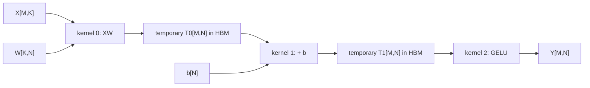
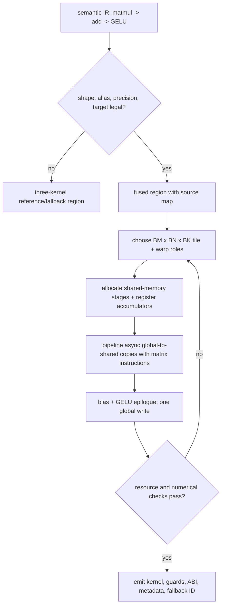
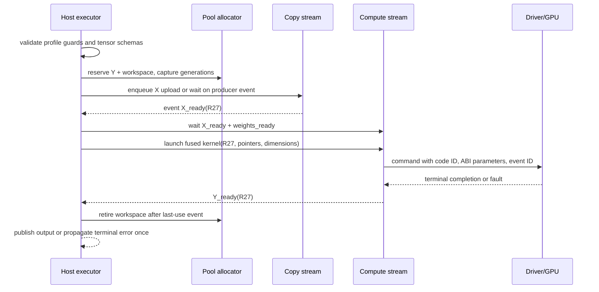

# GPU Framework, Compiler, Kernel, and Runtime Implementation Blueprint

> **Abbreviation key:** graphics processing unit (GPU); artificial intelligence (AI); intermediate representation (IR); single instruction, multiple threads (SIMT); general matrix multiplication (GEMM); high-bandwidth memory (HBM); application binary interface (ABI); just-in-time compilation (JIT); key-value (KV) cache.

## 0. Purpose and design ideology

This chapter reconstructs the path from a framework model to GPU kernels and command streams. The design ideology is **compile semantics into explicit work, then make locality and asynchrony first-class**. A GPU stack earns performance by choosing graph boundaries, layouts, fusion, tiles, memory lifetimes, streams, and kernel variants; it preserves correctness through typed IR, guards, dependency events, and reference fallbacks.

Read [AI Workload and Operator Mapping](01_AI_Workload_and_Operator_Mapping.md) for hardware mapping and [GPU Software, Simulator, Verification, and Bring-up](../06_Implementation_Blueprints/03_GPU_Software_Simulator_Verification_and_Bringup_Blueprint.md) for the lower driver/hardware contract.

## 1. Layer map and artifacts

~~~mermaid
flowchart LR
    FW["framework graph + parameters"] --> CAP["capture/export + guards"]
    subgraph AOT["ahead-of-time compile (frozen into the release)"]
        CAP --> IR["semantic tensor IR"]
        IR --> OPT["decompose / fuse / layout / precision"]
        OPT --> LOW["GPU schedule + kernel IR"]
        LOW --> BIN["kernel code objects + engine plan"]
    end
    subgraph RUN["per-invocation runtime"]
        RT["runtime: allocator / streams / events / graphs"]
        DRV["driver context + command queues"]
        GPU["SIMT / tensor / memory / collectives"]
    end
    BIN --> RT
    RT --> DRV
    DRV --> GPU
~~~

The release contains a source-model manifest, captured graph and guard set, compiler configuration, optimized IR, engine/execution plan, kernel code objects, constant/packed weights, shape profiles, workspace bound, target GPU/driver requirements, numerical contract, and validation evidence. Hash every input that changes generated work.

## 2. Tensor and IR contract

Each IR value stores element/accumulator type, logical shape or symbolic bounds, strides/layout, address space/device, quantization parameters, alias/lifetime, alignment, mutability, sharding, and source identity. Operations store semantic attributes, side effects, reduction order constraints, randomness, collective group, and shape guards.

Dynamic dimensions are not “unknown integers.” Represent symbols, bounds, divisibility/alignment constraints, and relationships. A specialized engine is selected only if guards hold; otherwise choose another profile, compile a new variant under policy, or fall back. Unbounded JIT on a request path creates latency and denial-of-service risk.

## 3. Compiler pass order and legality

1. capture/import framework operations and constants;
2. infer shapes/types/aliases and functionalize mutations where possible;
3. decompose unsupported operations into a target-independent core;
4. partition CPU/GPU regions and insert explicit transfers/synchronization;
5. choose precision/quantization and conversion boundaries from quality policy;
6. fuse producer/consumer regions under numerical, alias, resource, and dynamic-shape legality;
7. propagate layouts and select tensor-core-compatible forms;
8. plan parallelism and collectives across devices;
9. lower fused regions to library calls or generated kernel IR;
10. schedule tiles, warps, asynchronous copies, reductions, and epilogues;
11. allocate temporary buffers using dependency/lifetime intervals;
12. emit code, plan, guards, diagnostics, and reference mapping.

Passes must explain rejected fusion or tensor-core mapping: unsupported type/shape, alias, register/shared-memory pressure, numerical order, layout conversion, dynamic guard, or target limitation. This feedback lets hardware/software research distinguish an unavailable mechanism from a compiler miss.

## 4. Kernel contract and code generation

A kernel descriptor records function/code-object identity, parameter ABI, grid/block/cluster mapping, dynamic shared memory, registers/thread estimate, tensor/memory layouts, supported shape/stride/alignment/precision, workspace, stream/event dependencies, determinism, numerical tolerance, and target architecture.

Generated kernels choose:

- program/thread-block mapping of output tiles;
- warp/lane roles and divergence;
- global-memory transaction and shared-memory bank layouts;
- register tile and accumulator placement;
- asynchronous load stages and producer-consumer barriers;
- tensor versus SIMT instructions;
- reduction order and epilogue fusion;
- edge masks and bounds safety.

The compiler cost model estimates operations, useful/physical bytes by level, occupancy resource limits, instruction/array utilization, bank/coalescing efficiency, pipeline stages, launch count, and communication. It rejects candidates exceeding register/shared-memory/workspace or incompatible with shape guards.

## 5. Library, generated, persistent, and graph choices

Vendor/library kernels give broad optimized coverage and stable validation. Generated kernels specialize fusion/layout but expand compilation and test space. Persistent kernels retain scheduling/state on the GPU and reduce launches, but consume resident resources and require a command protocol. Captured GPU command graphs amortize repeated launch setup but need stable topology/addresses or update rules.

Execution-plan nodes therefore have one of: library call with algorithm ID, generated kernel, memory/collective operation, host callback, or persistent-worker command. Each node names inputs/outputs, dependencies, stream, workspace slice, fallback, and profiling identity. The plan executor must not infer dependencies from stream order when cross-stream events are required.

## 6. Autotuning system

The candidate key includes operation/fusion graph, shapes/strides, types, layouts, target GPU and clocks/power class, driver/compiler versions, workspace limit, determinism, and relevant topology. Candidate generation is bounded by legal tile, warp, stage, split/reduction, and algorithm choices.

For each candidate: allocate isolated workspace; initialize inputs; warm; verify output/reference/tolerance; measure repeated execution with device events plus system checks; reject outliers or instability; record work/bytes/resource metadata; and store best result with confidence and validity range. Tuning time and memory are budgets. Production may use offline tuning, a curated database, or guarded background tuning—not unlimited synchronous search.

## 7. Runtime memory, streams, events, and graphs

A device buffer record stores allocation/generation, virtual address, size/alignment, memory kind, owner context/model/request, tensor layout, readiness event, last-use dependencies, reference count, and free state. Use pool/arena allocators to avoid synchronization-heavy allocation, but generations detect stale handles after reuse.

A task/command node stores plan/node identity, kernel/collective/copy, parameter buffer, stream, dependencies, produced event, workspace, request/batch identity, cancel epoch, submission/completion status, and error. Event objects express cross-stream visibility. Free or reuse occurs only after all recorded last-use events complete.

Graph capture records a dependency DAG and command parameters. State which pointers/shapes may update, how updates are validated, and whether a new graph variant is built. A graph cannot safely reuse KV or batch pointers whose lifetimes/generations changed unless parameter update and dependency rules cover them.

## 8. Multi-GPU plan and collectives

The compiler/runtime creates device mesh, tensor sharding, stage/expert ownership, process/rank mapping, and collective groups. Each collective node specifies operation, group/version, tensor layout/count/type, stream dependencies, algorithm/topology hint, timeout, and failure semantics. All ranks must execute compatible collective sequence; divergent control causes hangs.

Overlap requires chunk dependencies: computation publishes a chunk event, collective consumes it, and downstream compute waits on completion. Measure exposed rather than total communication. Keep control-plane membership/version separate from fast data-plane commands; reconfiguration drains or aborts the old group before IDs are reused.

## 9. Numerical, performance, and failure contracts

Precision choice includes input/storage/compute/accumulator/output types, scaling, rounding, saturation, special values, reduction order, and quality threshold. Fusion or split reductions can change bits. Define bit-exact, deterministic-tolerance, or statistically bounded behavior.

Runtime faults include compilation/guard failure, illegal memory, launch/resource failure, out of memory, device lost/reset, collective timeout, poisoned data, and canceled epoch. Each plan node reports one terminal state; later dependent nodes do not run on invalid input unless a defined recovery/fallback reconstructs it.

Performance is bounded by plan critical path, not sum of kernels. Track launch/queue gaps, kernel time, transfers, collectives, allocator/compilation time, and overlap. A fused kernel wins only if removed traffic/launch exceeds reduced occupancy, recomputation, or longer critical-path effects.

## 10. Worked construction: `Y = GELU(XW + b)` from graph to completed event

This example makes every layer concrete. Let `X` be `[M,K]`, `W` be `[K,N]`, bias `b` be `[N]`, and `Y` be `[M,N]`. **GELU** is the Gaussian error linear unit activation. Assume half-precision inputs, wider accumulation, row-major logical tensors, and dimensions initially known only within profiles.

### 10.1 Minimum correct baseline and the bottleneck it exposes

The minimum stack can lower matrix multiplication, bias addition, and GELU to three validated library/generated kernels on one stream:



This baseline is valuable because it establishes reference semantics and a fallback. Its demonstrated cost is two extra full-tensor writes and reads through high-bandwidth memory (HBM), two extra launches, and two live temporaries. That evidence derives a fusion requirement: keep each accumulator tile on chip, add bias, apply GELU, and write `Y` once.

Fusion is legal only after the compiler proves that `T0/T1` do not escape, aliasing does not expose their intermediate values, the requested numerical tolerance permits the chosen activation approximation and accumulator conversion, and the fused kernel fits register/shared-memory limits. If any proof fails, retain the baseline region rather than silently changing semantics.

### 10.2 IR transformations must preserve a readable proof trail

The importer first creates semantic operations `matmul`, `broadcast_add`, and `gelu`. Shape inference proves `X.K == W.K` and `W.N == b.N`; alias analysis proves `Y` does not overlap a live input illegally. A fusion pass creates one region but retains a source map from each fused instruction range to the three original nodes. Layout selection may pack `W` into a tensor-core-friendly physical layout; the logical indexing contract and packing version remain in the executable.



For a candidate tile, the compiler materializes exact state: shared-memory buffers `A[stage][BM,BK]` and `B[stage][BK,BN]`; per-warp accumulator fragments; asynchronous-copy group/barrier phase; loop trip count `ceil(K/BK)`; edge predicates for partial `M/N/K` tiles; bias pointer/stride; and output conversion mode. Producer warps issue copies for tile `k+1` while consumer warps compute tile `k`. A stage cannot be overwritten until every consumer has acknowledged its phase. This is a bounded producer-consumer protocol, not merely an instruction-reordering hint.

### 10.3 One tile over time

```wavedrom
{ "signal": [
  { "name": "copy_stage0", "wave": "01..0........" },
  { "name": "stage0_ready", "wave": "0..1...0....." },
  { "name": "mma_stage0", "wave": "0...1..0....." },
  { "name": "copy_stage1", "wave": "0...1..0....." },
  { "name": "stage1_ready", "wave": "0......1...0." },
  { "name": "mma_stage1", "wave": "0.......1..0." },
  { "name": "epilogue", "wave": "0..........10" },
  { "name": "Y_write", "wave": "0...........1" }
] }
```

If stage 1's copy is delayed, the consumer waits on its ready phase while stage 0 is no longer reusable until its consumers release it. A correct scheduler does not advance the phase counter merely because a copy instruction was issued. If register pressure from the fused epilogue reduces occupancy enough that the wait cannot be hidden, the fused candidate can lose to a split kernel despite lower HBM traffic. The autotuner must compare end-to-end region time, not reward fusion by construction.

### 10.4 Runtime submission and exact object lifetimes

At model load, the runtime validates the executable target and code object, allocates or imports `W`, packs it if the packing-cache key misses, records a `weights_ready` event, and pins the allocation generation while the model version is live. For invocation `R27`, it then performs:



Every command captures allocation `(address, generation)` pairs, not bare pointers. If a canceled request releases workspace and the pool reuses the same address, a delayed command or completion from the old cancel epoch is rejected rather than corrupting the new owner. Cross-stream order comes from recorded events; host enqueue order is insufficient.

### 10.5 Failure, fallback, and replay boundaries

Failures at different layers have different safe recovery:

- **shape guard fails before submission:** choose another compatible compiled profile, then an explicitly allowed reference/fallback region, or reject. No GPU side effect has occurred, so whole-region replay is safe.
- **allocation fails before commands publish:** release reservations and retry under a smaller batch/profile if policy permits. A partially admitted batch retains its original request identities.
- **kernel reports illegal memory access/device loss:** the output and context may be poisoned. Do not rerun only the GELU portion because the fused kernel has no committed intermediate. Recover the context/device as required and replay the whole region from immutable inputs, or fail the invocation once.
- **collective or externally visible state follows the kernel:** replay requires an idempotence/epoch protocol across that boundary. A local kernel completion alone does not prove the distributed operation can be repeated.
- **numerical differential test fails during tuning:** quarantine that candidate and preserve its compiler/target/configuration identity; never put it in the performance cache.

The exact-once unit is the invocation/plan node, while transport commands may retry underneath it. Record states `Created → Guarded → ResourcesReserved → Submitted → Running → Completed`, with terminal alternatives `Failed` and `Canceled`. Only `Completed` publishes `Y_ready`; a reset-epoch mismatch turns a late completion into diagnostic evidence, not success.

### 10.6 Cost, observability, and verification closure

The added machinery consumes compile time, code-cache capacity, guard branches, packed-weight storage, runtime event records, pooled-memory fragmentation, registers, shared memory, and validation space. It loses for tiny matrices where launch and specialization costs dominate, for rare shapes that explode variants, for low-reuse weights whose packing cost is not amortized, or when fusion reduces occupancy/parallelism. Preserve the three-kernel baseline as both fallback and oracle.

An end-to-end trace for `R27` should connect framework node IDs, IR/fusion region, guard/profile choice, kernel/code-object ID, tile candidate, stream/command/event IDs, allocation generations, hardware counters, and terminal output. Verify adjacent boundaries: framework versus semantic IR; unfused versus fused output over edge shapes and special values; compiler-estimated versus measured resources; event dependency graph versus randomized stream delays; stale-generation and reset-epoch injection; allocator last-use safety; and the same request with fusion disabled. The stack is reproducible when a slow or wrong `Y` can be traced to an assumption, command, resource stall, or numerical transformation—not merely to “the GPU.”

## 11. Invariants, tests, and staged construction

Invariants: every generated kernel maps to source semantic nodes; guards dominate specialization; task dependencies cover every producer/consumer and mutable alias; device allocation generations reject stale commands; workspace slices do not overlap live uses; collective sequence/group matches all ranks; and each submitted task completes/faults/cancels once.

Build one static graph using validated library calls; add multi-stream dependencies and pooled memory; add generated kernels with differential tests; add fusion/layout/precision; add offline autotuning; add dynamic profiles/JIT with bounded cache; add command graphs/persistent kernels; then multi-GPU collectives. Preserve node/kernel/transaction identities through profiler and hardware counters.

---

← [GPU AI Performance and Research](03_GPU_AI_Performance_Analysis_and_Research_Methods.md) · next → [GPU Serving Engine, Scheduler, and KV State](05_GPU_Serving_Engine_Scheduler_and_KV_Implementation_Blueprint.md)
