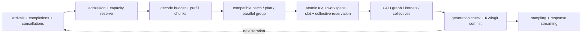

# GPU Serving-Engine, Scheduler, and KV-State Implementation Blueprint

A serving engine turns arriving requests into streamed tokens by repeating one scheduler iteration at a time; the loop below is that single iteration end to end, and Section 4 expands each stage.

> **Abbreviation key:** graphics processing unit (GPU); artificial intelligence (AI); key-value (KV) cache; service-level objective (SLO); time to first token (TTFT); time per output token (TPOT); high-bandwidth memory (HBM); remote direct memory access (RDMA); mixture of experts (MoE).

## 0. Purpose and design ideology

This chapter specifies a production GPU inference engine. Its design ideology is **schedule requests and memory state together**. A scheduler that optimizes tensor shape without reserving KV/workspace fails under capacity; an allocator that ignores deadlines causes avoidable tail latency; a distributed plan that ignores transfer ownership corrupts live state.

## 1. Engine components and ownership

The engine contains gateway/router, model registry/residency manager, tokenizer/preprocessor, admission controller, request scheduler, execution-plan runner, GPU memory/KV manager, sampling/output path, collective/transfer manager, and telemetry/fault supervisor.

The router owns request-to-replica choice. A worker owns admitted request state until an explicit migration/handoff. The model manager owns immutable weights/plans. The KV manager owns block lifetime and mappings. The scheduler owns phase/batch-slot transitions. The GPU runtime owns submitted commands until terminal event. Output owns tokens only after sampling commit.

## 2. Request, batch, and worker schemas

A request stores tenant/model/version, arrival/deadline/priority, prompt and maximum lengths, generated tokens, prefill offset/chunk, decode step, sampling/random state, speculative branch state, KV block table and generation, prefix reference, worker/device/parallel group, current batch/slot, cancel epoch, timestamps, output credits, and terminal status.

A batch record stores scheduler epoch, phase/mixed composition, request generations and slot mapping, token positions, shape/profile, plan/graph variant, KV page-table buffer, workspace reservation, device/stream group, expected completions, fault state, and profiling tag.

A worker record stores model/plan residency, GPU and parallel group, free/used weight/KV/workspace bytes, stream/queue capacity, active prefill/decode work, estimated service curves, health, power/thermal state, and drain epoch.

## 3. Admission and memory reserve

Admission validates request and model, then checks queue/deadline feasibility, worker health, model residency or load budget, KV worst-case/committed budget, workspace, batch slots, communication buffers, output backpressure, tenant quota, and failure reserve. Distinguish reserved maximum tokens from currently allocated tokens; allow overcommit only with an explicit preemption/swap/rejection policy.

Maintain low/high/finish-reserve watermarks. Above high water, stop or restrict new prefill because prefill creates future decode state. Finish reserve lets already admitted sequences allocate their next token blocks. Without it, all requests can deadlock near completion.

## 4. Iteration scheduler state machine

At every epoch:

1. consume GPU/collective/transfer completions and update request/KV state;
2. apply cancellations/deadlines/fault recovery and release safely reclaimable resources;
3. admit queued requests and bind model/worker/prefix state;
4. calculate decode token budget first for TPOT protection if policy requires;
5. select prefill chunks from remaining compute/token/KV/workspace budget;
6. group work by compatible model, plan, precision, parallel group, and shape profile;
7. atomically reserve KV blocks, batch slots, workspace, command/collective state, and output capacity;
8. build device metadata/page tables and submit the plan;
9. record the decision inputs, predicted cost, and next wake condition.

On completion, validate batch/request generations, publish produced KV ranges/logits, perform or enqueue sampling, stream committed tokens, advance/finish requests, and release per-iteration resources. A canceled/stale result is discarded but its runtime resources remain until device completion makes reclamation safe.

## 5. Continuous batching and chunked prefill

Continuous batching changes active sequences every iteration, improving decode utilization and eliminating fixed-batch tail blocking. It requires stable slot-to-request metadata and kernels that consume per-sequence lengths/page tables. Chunked prefill divides long prompts so decode work can interleave.

Choose a prefill chunk from remaining deadline slack, kernel efficiency curve, KV allocation, and decode interference. Too small raises launches and reduces GEMM shape efficiency; too large blocks decode and TTFT fairness. The scheduler cost model predicts kernel/collective time by phase, batch tokens/sequences, context distribution, and worker state, then calibrates with traces.

## 6. Paged KV and prefix implementation

A physical KV block stores block/generation, model/version, layer/tensor-parallel shard, token range/capacity, layout/precision, device/tier, owner request or prefix, reference count/lease, readiness event, transfer/dirty state, and eviction status. Per request, a logical block table maps token positions to physical blocks. Kernels consume a versioned device-resident table.

Allocation reserves new tail blocks before submitting a step. Completion publishes written token count. Prefix sharing references immutable full or valid-range blocks; branching performs copy-on-write for mutable tails. Prefix keys include exact tokens/digest, model and adapter/version, positional/attention configuration, tokenizer, KV layout/precision, and sharding. Hash collision must be detected by strong identity or token verification.

Eviction selects unreferenced prefix blocks before live requests unless preemption exists. Live-state swap/migration has states ReservedDestination → Copying → Verified → OwnershipCommitted → SourceReleased. The destination cannot schedule decode before commit; the source cannot free before transfer and all prior GPU readers complete.

## 7. Speculative decoding state

Store draft/target versions, proposal tokens/log probabilities as required, branch KV pages, verification batch, accepted prefix length, random state, and rollback point. Draft work and KV are tentative. Verification commits exactly the accepted prefix plus target token under algorithm semantics; rejected suffix pages are reclaimed after device use completes.

Scheduling uses expected accepted tokens divided by draft + verification + extra memory/communication cost, under the same SLO. Acceptance rate alone cannot select proposal length or placement.

## 8. Multi-GPU and disaggregated execution

Tensor/pipeline/expert parallel groups are immutable for an execution epoch. Batch metadata and collective sequence must match all ranks. For MoE, route counts, capacity/overflow, expert placement, all-to-all buffers, and return ordering are explicit; the slowest expert/route controls completion.

Prefill/decode disaggregation transfers KV with a handoff record: request/model/version, source/destination groups, sharding/layout/precision, token/layer ranges, block list, expected bytes/checksums, source completion events, transport IDs, destination allocation, commit generation, timeout, and retry/abort state. Route only after destination capacity reservation. Layer-pipelined transfer may expose partial ready ranges, each with its own commit event.

Remote transfer can use GPU fabric or RDMA, but completion semantics must mean destination-visible bytes, not merely source enqueue. Failure before commit leaves source authoritative; after commit ownership follows the logged protocol. Duplicate messages are rejected by transfer generation.

## 9. Policies and sizing

| Policy | Gain | Cost/failure region |
|---|---|---|
| largest-token batch | tensor/HBM efficiency | queue/TPOT and workspace |
| decode-first | protects active users | prefill starvation/TTFT |
| earliest deadline | SLO focus | prediction errors and fragmentation |
| prefix affinity routing | reuse | worker imbalance and failover cost |
| preemption/swap | overload flexibility | HBM/host/fabric traffic and tail |
| disaggregated phases | isolation/specialization | KV transfer and distributed failure |

Capacity includes weights, KV, prefix cache, workspaces, communication, graph parameter buffers, allocator fragmentation, and failure/rollout overlap. Queueing uses open-loop arrival distributions and phase-specific service curves. Goodput is the maximum offered load meeting TTFT/TPOT/error/quality targets, not maximum tokens/s after SLO collapse.

## 10. Invariants, faults, and staged build

Invariants: one worker owns a live request or a committed transfer changes ownership; batch slots and KV tables use matching generations; published KV covers only completed tokens; shared prefixes are immutable; collective sequence is compatible across ranks; canceled/stale GPU results cannot mutate current request state; output tokens commit once; quotas/accounting include all tiers and in-flight copies.

Build single-GPU static batches with contiguous KV; explicit request states/cancellation; continuous batching; paged KV; prefix sharing/copy-on-write; chunked prefill; speculative branches; multi-GPU groups; preemption/migration; disaggregated prefill/decode. At every stage expose scheduler decision, batch/plan, GPU timeline, KV ownership, collectives/transfers, sampling, and output.

---

← [GPU Framework/Compiler/Runtime](04_GPU_Framework_Compiler_Kernel_and_Runtime_Implementation_Blueprint.md) · next → [GPU AI Stack Verification, Operations, and Deployment](06_GPU_AI_Stack_Verification_Operations_and_Deployment_Blueprint.md)
