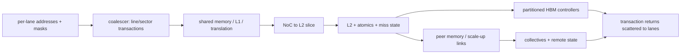

# GPU Memory and Scale-Up Implementation Blueprint

> **Abbreviation key:** graphics processing unit (GPU); streaming multiprocessor (SM); high-bandwidth memory (HBM); level-one/level-two cache (L1/L2); network on chip (NoC); translation lookaside buffer (TLB); error-correcting code (ECC); input/output memory management unit (IOMMU).

## 0. Purpose and design ideology

The GPU memory system converts lane-level addresses into a smaller number of transactions, supplies explicitly shared on-chip storage, hides many outstanding misses, and distributes traffic across cache and high-bandwidth-memory (HBM) partitions. At scale-up it must also preserve visibility and forward progress across GPUs. Its design ideology is **aggregate where spatial structure exists, partition where bandwidth exists, and expose locality to software when hardware cannot infer it cheaply**.

## 1. Memory-space and visibility contract

Specify global, local/thread, shared/block, constant/read-only, texture, peer, and host-visible spaces. For each, define address formation, cacheability, allocation, coherence, consistency, atomic scope, fence operation, translation context, fault behavior, and lifetime. “Unified address” does not imply uniform latency or automatic coherence.

A memory request from the SM carries warp/instruction identity, active-lane mask, per-lane address and byte mask, operation/atomic type, cache policy, ordering scope, translation context, and completion destination. The return must identify which lanes/bytes are satisfied and whether replay, fault, poison, or retry occurred.

## 2. Coalescer reconstruction

For each active lane, compute the addressed segment or cache line and byte mask. Group lanes with the same transaction key: physical line/sector, operation compatibility, memory attributes, ordering scope, and sometimes atomic address. One warp instruction can produce zero, one, or many transactions.

A coalescer entry stores warp instruction identity, unresolved/resolved lane masks, line address, sector/byte mask, participating lanes, per-lane extraction/placement metadata, transaction ID, returned mask, and error. It completes the warp instruction only after all lane obligations are resolved. If entry capacity is insufficient, either process lanes in waves or backpressure before partially issuing; never lose the remaining lane mask.

Efficiency can be expressed as

$$\eta_{coal}=\frac{\text{useful requested bytes}}{\text{bytes transferred below the coalescer}}.$$

Thirty-two lanes reading adjacent 4-byte words request 128 useful bytes. If aligned to a 128-byte segment, $\eta=1$. If the access crosses a boundary and causes two 128-byte transfers, $\eta=0.5$ before cache-sector optimizations. This directly changes HBM demand and the number of miss entries.

## 3. Shared memory and local cache path

Shared memory is a software-managed, banked SRAM. Define bank mapping, word width, broadcast/multicast behavior, atomic handling, and conflict service. For $N_b$ banks and bank-word size $B_b$, a common mapping is $bank=\lfloor address/B_b\rfloor\bmod N_b$. A $k$-way conflict takes at least $k$ bank service opportunities unless addresses support broadcast. Padding or layout transformation can eliminate systematic conflicts.

If shared memory and L1 cache share physical capacity, specify partition modes, tag/data ownership, reconfiguration drain/invalidate rules, and whether bandwidth ports are shared. A larger shared partition can enable tiling while shrinking cache hit capacity.

L1/L2 cache entries and miss-status handling registers need the same identity, merging, sector-valid, victim/writeback, error, and stale-response protections as CPU caches, but GPU throughput makes queue scale and partition imbalance dominant. State whether L1 is coherent and at what scope. GPU L1s are often optimized for private/streaming data; software fences may flush/invalidate rather than maintaining full coherence.

## 4. Translation, partitions, and HBM flow

Translation can occur per lane before coalescing, per page-group, or after virtual-address grouping with synonym safeguards. A translation miss must retain lane identity and may split one group across physical pages. Specify replay granularity: warp-wide replay is simple but repeats successful lanes; per-transaction replay needs finer state.

After L2 lookup, map the physical address to a memory partition/channel/bank. Hashing distributes sequential and common-stride accesses but complicates locality reasoning and reliability isolation. Publish enough mapping behavior for compiler/runtime placement or provide counters that reveal camping.

An L2 slice owns tags/data or directory state, miss entries, atomics, writebacks, and a queue toward its memory partition. The memory controller schedules HBM commands subject to bank timing, row state, refresh, bus turnaround, and quality of service. Define the completion point for a store and atomics; enqueue is not necessarily global visibility.

Bandwidth conservation is

$$B_{HBM,demand}=\frac{B_{useful}}{\eta_{coal}\eta_{cache}\eta_{protocol}},$$

where the efficiencies account for coalescing, cache-line usefulness, and protocol/error overhead. If useful kernel traffic is 1.2 TB/s with 0.75 coalescing, 0.8 line usefulness, and 0.95 protocol efficiency, demand is about 2.11 TB/s. A 1.8 TB/s subsystem cannot meet the target regardless of arithmetic peak.

Miss concurrency again follows $N\approx\lambda L$. Apply it per SM, per L2 slice, per NoC virtual channel, and per memory channel; a generous global count cannot fix a hot partition. Include return bandwidth and write/atomic traffic.

## 5. On-chip network and backpressure

Define separate request, data-response, write, atomic, translation, and control/probe traffic classes or prove their dependency graph safe when sharing queues. Each packet needs source, destination, transaction ID, traffic class, ordering domain, payload/byte mask, and error. Credit or ready/valid state must survive reset and throttling.

Partition camping occurs when address mapping sends a workload disproportionately to one slice/channel. Measure maximum partition load, not only average. Options include XOR hashing, page coloring/runtime placement, multiple outstanding destinations, or migration. Hashing helps regular strides but can destroy contiguous locality across peer links.

Reserve escape resources for responses and protocol progress. A GPU with thousands of outstanding requests can fill every buffer; unrestricted demand admission must not block the responses needed to free those buffers.

## 6. Peer memory and multi-GPU scale-up

Define whether a peer pointer is directly translated, remapped through an I/O memory-management unit, or serviced by a copy engine. A peer transaction needs requester/target GPU identity, address-space context, access rights, cache/ordering scope, route, and completion/error semantics.

Scale-up choices:

| Choice | Benefit | Cost/failure region |
|---|---|---|
| explicit copies | clear ownership, bulk bandwidth | extra capacity and synchronization; poor fine-grain sharing |
| direct peer loads/stores | simple programming, fine grain | remote latency, translation, ordering, partition hot spots |
| hardware coherence | transparent sharing | probes/directories, state scale, failure recovery |
| software-managed collective | topology-aware efficiency | compiler/runtime complexity and phase barriers |

For collective communication, the hardware contract supplies links, routing, ordering, and copy/reduction engines; the library chooses ring, tree, hierarchical, or topology-specific schedules. A ring all-reduce moves approximately $2(P-1)M/P$ bytes per participant for $P$ participants and message size $M$, excluding protocol overhead. Small messages are latency-dominated; large messages are bandwidth-dominated.

Failures are architectural. Specify link retry, poison, timeout, device reset, partial collective failure, and whether outstanding remote writes are known to be visible. A reset GPU must not silently reuse transaction identities still present in a peer; use epochs and fabric-level quiescence.

## 7. Policy and physical trade-offs

| Design choice | Gains | Costs |
|---|---|---|
| sector cache | avoids unused full-line transfer | more valid/dirty metadata and fill merging |
| write-through L1 | simpler visibility | bandwidth and L2 pressure |
| large L2 | reuse/KV capacity, fewer HBM accesses | area, bank latency, NoC traversal |
| more memory partitions | bandwidth | address mapping, controller/PHY area, imbalance risk |
| larger pages | TLB reach | fragmentation and migration granularity |
| more outstanding misses | latency tolerance | queue/ID area and congestion collapse risk |
| coherent peer caching | reuse and transparency | directory/probe traffic and recovery complexity |

Physically, coalescer comparisons, shared-memory crossbars, L1 tag/data banks, and SM-to-NoC injection are replicated hot structures. L2 slices belong near memory/NoC endpoints. HBM controllers/physical interfaces constrain die edge and package placement. Wire distance becomes a visible latency; pipeline it and update scoreboard/miss occupancy models.

## 8. Verification, invariants, and observability

The key invariants are: each accepted lane request completes or faults exactly once; returned bytes are placed in the lane and byte positions recorded at issue; a store/atomic becomes visible only at its declared scope; no transaction or context identifier is reused while an old response can return; credits and buffer slots are conserved; and progress-class traffic always retains a path to the resource that can retire it.

Use per-lane reference checking through coalescing and return scattering. Directed patterns cover alignment, page crossing, partial masks, duplicate addresses, atomics, gathers/scatters, sector returns out of order, translation faults in one lane, shared-bank conflicts, cache eviction under fill, and stale returns after context reset.

At scale, test all routes, partition hot spots, credit exhaustion, error/retry, peer reset, remote atomics, fence scopes, and collective failure. Assertions implement the invariants above at coalescer, cache, network, memory, and peer boundaries.

Expose coalescing transactions/warp, useful/transferred bytes, shared-memory conflict degree, L1/L2 hit by request class, MSHR occupancy/full cycles, TLB hit/walk, NoC injection/ejection and latency by class, per-slice/channel bandwidth, HBM row/bank/refresh stalls, remote/local bytes, link retries, and collective phase time. These counters should reproduce the bandwidth equation and locate imbalance.

## 9. Staged implementation

1. One SM with blocking, physically addressed global memory.
2. Coalescer with a lane-accurate scoreboard and one outstanding warp instruction.
3. Banked shared memory and synchronization.
4. Nonblocking L1/L2, sector fills, and arbitrary response ordering.
5. Translation, protection, faults, and context epochs.
6. Multiple slices/partitions with measurable address distribution.
7. Peer copies, then direct peer access and ordering.
8. Collectives, remote atomics, and optional coherence only after progress/error tests exist.

The reconstructed design is complete when per-lane semantics, transaction aggregation, queue sizing, partition mapping, visibility, errors, and scale-up progress are all specified—not merely when peak HBM bandwidth is known.

---

← [SIMT Core Blueprint](01_SIMT_Core_and_Tensor_Pipeline_Implementation_Blueprint.md) · next → [GPU Software, Simulator, Verification, and Bring-up](03_GPU_Software_Simulator_Verification_and_Bringup_Blueprint.md)
