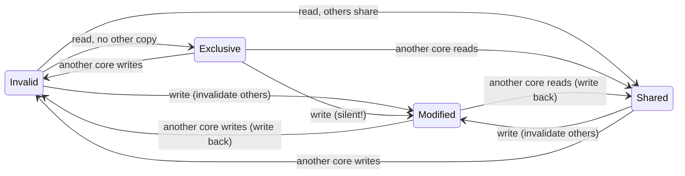

# CPU Architecture — The Pipelined Machine and Its Contract

> **Prerequisites:** [CMOS_Fundamentals](../00_Fundamentals/01_CMOS_Fundamentals.md) (the FO4 unit and the gate-delay budget a stage must fit), [Logic_Building_Blocks](../00_Fundamentals/02_Logic_Building_Blocks.md), [Adders_and_Multipliers](../00_Fundamentals/03_Adders_and_Multipliers.md) (the ALU that sits in EX).
> **Hands off to:** [RISC_V_ISA](04_RISC_V_ISA.md), [OoO_Execution](05_OoO_Execution.md), [Branch_Prediction_Deep_Dive](06_Branch_Prediction_Deep_Dive.md), [Cache_Microarchitecture](07_Cache_Microarchitecture.md), [TLB_and_Virtual_Memory](08_TLB_and_Virtual_Memory.md).

---

## 0. Why this page exists

Almost everything in a scalar CPU is a consequence of one decision: **overlap the execution of consecutive instructions instead of running them to completion one at a time.** Overlap is the only source of throughput a single ALU can offer — and it is also the sole reason hazards, forwarding, branch prediction, store buffers, and precise-state machinery exist at all. None of them is needed in a machine that finishes one instruction before fetching the next; every one is the *price* of the overlap that buys speed.

This page derives that machine from its purpose. We start from *why overlap raises throughput* and let the theory (ideal CPI, the frequency-versus-depth trade-off, the diminishing return of deeper pipes) tell us how far to push it. From the overlap itself we derive the three hazard classes and price each one. We present forwarding not as a table of bypass multiplexers but as the answer to a single timing gap. Then we place the pipelined core in the system it actually lives in — a memory hierarchy it must hide, a coherence invariant it must preserve, a consistency contract it must honour, sibling threads it can share with, and a speculation side-channel it must not leak through. For each we ask the same question: *what invariant does this thing maintain or break, and why must it exist?*

The deep dives — dynamic scheduling, the ROB and LSQ, TAGE prediction, cache and TLB internals — live on the sibling pages this one hands off to. Here we build the foundation they relax.

---

## 1. Pipelining: why overlap buys throughput, and how deep to go

### 1.1 The throughput argument

A non-pipelined core drives one instruction through fetch → decode → execute → memory → writeback and only then starts the next. Its clock must be slow enough for the *entire* datapath to settle, and it completes one instruction every $t_{\text{logic}}$ seconds. Throughput is $1/t_{\text{logic}}$; the expensive ALU sits idle four-fifths of the time.

Pipelining cuts the datapath into $N$ stages separated by registers and lets $N$ instructions occupy different stages at once. The clock now only has to cover the *slowest single stage*, and in steady state **one instruction completes every cycle** even though each still takes $N$ cycles end to end:

```text
cycle:   1    2    3    4    5    6    7    8
I1:     IF   ID   EX   MEM  WB
I2:          IF   ID   EX   MEM  WB
I3:               IF   ID   EX   MEM  WB
I4:                    IF   ID   EX   MEM  WB
                          └── steady state: one WB per cycle ──┘
```

The trade is explicit: per-instruction **latency** is unchanged (slightly worse, because of register overhead), but **throughput** rises by up to $N\times$. This is the whole game — latency for throughput — and it is why the *iron law* separates cleanly into three independent knobs:

$$
T_{\text{CPU}} \;=\; IC \times \text{CPI} \times t_{\text{clk}}
$$

where $IC$ = dynamic instruction count (set by ISA + compiler), $\text{CPI}$ = cycles per instruction (set by the microarchitecture's stalls), $t_{\text{clk}}$ = clock period (set by the slowest stage). Pipelining attacks $t_{\text{clk}}$; its **ideal CPI is 1** (one completion per cycle). Every mechanism in §2–§5 exists to keep the *actual* CPI near that ideal without giving back the $t_{\text{clk}}$ that pipelining won.

### 1.2 Overlap forces exactly two things to be built

Because up to $N$ instructions now coexist, two obligations follow directly and nothing else in the scalar core is fundamental:

1. **State per in-flight instruction.** Each stage must latch everything later stages will need — decoded controls, operands, the destination register, the PC. That is the *entire* reason pipeline registers exist; they hold the context that used to live implicitly in a single instruction's lifetime.
2. **Hazards.** With five instructions in flight, a later one can reach a stage needing a result an earlier one has not produced (data), the fetch stage must pick a next PC before an in-flight branch resolves (control), or two instructions want one resource in one cycle (structural). §2 derives all three from overlap and prices them.

### 1.3 How deep should the pipe be? The frequency-versus-depth trade-off

Deeper pipes clock faster — but not without limit, and not for free in CPI. Model the clock period as the per-stage logic plus a fixed overhead:

$$
t_{\text{clk}}(N) \;=\; \frac{t_{\text{logic}}}{N} \;+\; t_{\text{ovh}}
$$

where $t_{\text{logic}}$ = total combinational delay of the unpipelined datapath (FO4), $t_{\text{ovh}}$ = per-stage overhead (flop setup + clk-to-Q + skew + jitter), roughly constant per stage. As $N\to\infty$ the useful logic term vanishes and frequency saturates at $1/t_{\text{ovh}}$ — **the overhead wall**: past some depth, added stages are almost pure latch delay.

Meanwhile CPI *rises* with depth, because the branch-misprediction penalty is the number of stages between fetch and branch resolution, which grows with $N$. Writing the added mispredict CPI as $\beta N$:

$$
\text{CPI}(N) \;=\; 1 + \beta N, \qquad \beta \equiv b \cdot p_{\text{mp}} \cdot c
$$

where $b$ = branches per instruction ($\approx 0.2$), $p_{\text{mp}}$ = per-branch mispredict rate, $c$ = fraction of the added stages sitting between fetch and resolve. Per-instruction time is the product, and minimizing it gives the optimal depth:

$$
\tau(N) = (1+\beta N)\!\left(\frac{t_{\text{logic}}}{N}+t_{\text{ovh}}\right)
\;\;\Longrightarrow\;\;
\boxed{\,N^{*} = \sqrt{\dfrac{t_{\text{logic}}}{\beta\,t_{\text{ovh}}}}\,}
$$

The two effects — frequency gain $\propto 1/N$ shrinking, penalty cost $\propto N$ growing — cross at $N^{*}$; beyond it, every added stage costs more mispredict CPI than it recovers in frequency. This is *why* deeper is not always better, expressed as a knee rather than a slogan.

Two lessons drop out of $N^{*}$. First, the optimum tracks $\sqrt{1/\beta}$: a **better branch predictor (smaller $p_{\text{mp}}$) justifies a deeper pipe**, which is exactly why prediction accuracy and pipeline depth advanced together historically. Second, the pure-performance $N^{*}$ comes out *deep* — often tens of stages — which is why the early-2000s frequency race pushed pipelines to 20–31 stages. What pulls the real knee back to **14–20 stages** is not $N^{*}$ itself but two limits it ignores: the **overhead wall** — below roughly **6–8 FO4 of logic per stage** (Hrishikesh et al., 2002), $t_{\text{ovh}}$ consumes too large a share of each cycle for useful frequency to keep rising — and **power**, which grows with frequency and makes the performance-per-watt optimum shallower still. The Pentium 4 (~31 stages, ~20-cycle mispredict penalty) sat past that knee and paid in CPI on branchy code and in watts; modern high-performance cores settle at 14–20 stages, and in-order embedded cores at 5–8.

*(The complementary bound — how much of a program is even pipelineable/parallelizable — is Amdahl's law, $\text{Speedup}=1/((1-f)+f/S)$; it governs multicore scaling and is developed in [Performance_Modeling_and_DSE](01_Performance_Modeling_and_DSE.md).)*

---

## 2. Hazards: the three ways overlap breaks, and what each costs

A hazard is any situation where naively advancing every instruction one stage per cycle would compute the wrong answer or contend for a resource. Overlap creates exactly three root causes. Naming the *cost* of each up front is the point — the rest of the chapter is about paying those costs cheaply.

**Data hazards (RAW — read-after-write).** A consumer reaches the stage where it needs an operand before the producer has written it back. The register file is written in WB but read in ID, so a naive machine would read a stale value.
- *Cost if handled by waiting:* 1–3 stall cycles per dependent pair, equal to the distance between where the value is produced and where it is consumed.
- *How it is paid:* forwarding (§3) reclaims almost all of it. The one case forwarding *cannot* fix — the load-use hazard, where the datum does not physically exist early enough — costs an unavoidable **1-cycle bubble**.

**Control hazards.** The branch's direction and target are unknown when the *next* fetch must launch. Every cycle between fetch and branch resolution is a cycle of instructions fetched on an unverified path.
- *Cost:* the penalty equals the number of stages from fetch to resolution, charged on every taken/mispredicted branch. As a CPI adder:

$$
\Delta\text{CPI}_{\text{ctrl}} \;=\; b \times p_{\text{mp}} \times \text{penalty}
$$

  where $b$ = branch frequency, $p_{\text{mp}}$ = mispredict rate, penalty = resolve-distance in cycles.
- *How it is paid:* branch prediction (§4) moves the cost from *every* branch to only the mispredicted ones — the single most valuable idea in the front end, and the reason $\beta$ in §1.3 is small enough to justify deep pipes.

**Structural hazards.** Two instructions need the same hardware in the same cycle (one memory port for both fetch and load; one write port for two results).
- *Cost:* one instruction stalls.
- *How it is paid:* duplicate the resource (split I/D caches, multiple ALUs) or pipeline the shared unit so it accepts a new request each cycle. In a scalar pipe structural hazards are largely designed away; they return as a first-order concern in wide superscalar and shared-port designs.

Data and control hazards are the expensive ones in a scalar pipeline; §3 and §4 exist to drive their cost toward zero without serializing execution.

### 2.1 WAR and WAW are not real hazards — they are name collisions

Two more "dependences" appear the moment instructions can *complete* out of program order (which a scalar in-order pipe does not do, but its OoO successor will): **WAR** (write-after-read) and **WAW** (write-after-write). Neither carries a value from the earlier instruction to the later one; both are artifacts of two independent computations reusing the same architectural register *name*. Because the ISA exposes only ~32 names but a core keeps hundreds of results live, name reuse is constant and every reuse looks like a dependence the hardware must honour.

The fix is therefore not stalling or forwarding but **renaming**: give every new destination a fresh physical register and the collisions vanish, leaving only true RAW. This is why WAR/WAW belong to the out-of-order story, not the scalar one — the mechanism that removes them (register renaming) is derived in full in [OoO_Execution](05_OoO_Execution.md) §2, and previewed in §5 here.

---

## 3. Forwarding: closing one timing gap

Forwarding rests on a single observation. A result is **physically available at the end of the stage that computes it** — an ALU result is latched into the EX/MEM register at the end of EX — but the *register-file copy* a consumer would read is not written until WB, a couple of cycles later. A stall-only pipeline pretends the value does not exist until WB and waits. Forwarding instead **reads the value from where it already sits** — the pipeline latch — and muxes it straight into the ALU input.

So the entire forwarding network is forced by, and only by, that produce-at-EX-end / consume-at-EX-start gap. It must do exactly two things:

1. **Detect**, for each source operand of the instruction in EX, whether a later-stage pipeline register holds a not-yet-committed write to that same architectural register.
2. **Select the freshest** match when more than one later stage holds a write to that register — an EX/MEM forward (the more recent write) takes priority over a MEM/WB forward.

That is the whole idea. The signal-level realization (one comparator per source per forwarding stage, a small mux tree on each ALU input) is mechanical bookkeeping that follows from those two requirements; it is not worth memorizing and is not reproduced here.

**The load-use exception proves the rule.** Forwarding can route a value to an *earlier stage*, but it cannot route it *earlier in time than it is produced*. A load's datum does not exist until the end of MEM — one cycle after a dependent ALU op in the next slot needs it — so no bypass path can conjure it. A separate hazard-detection check must inject exactly one stall cycle, after which the value forwards normally. This is why detection (decide *when to wait*) is a distinct function from forwarding (decide *where to read*): the first handles the one gap the second cannot close. Compilers hide this bubble by scheduling an independent instruction into the load-delay slot.

**Why this machinery does not survive into wide out-of-order cores.** The explicit bypass network is an all-to-all set of paths from every producing stage to every consuming input. Its cost scales as roughly $O(\text{depth} \times W^{2})$ in a $W$-wide machine — every one of $W$ consumers this cycle may need a value from any of the in-flight producers — so wires, muxes, and the timing pressure on the ALU input all explode with width and depth. Beyond a few stages and a couple of lanes it stops being tractable as fixed wiring. The out-of-order core's answer is to replace *all* explicit bypass paths with **one broadcast**: a completing instruction drives its result tag onto a common data bus that every waiting consumer snoops, waking dependents regardless of pipeline distance. That single move — turning a wiring problem into a broadcast — is developed in [OoO_Execution](05_OoO_Execution.md) §4.

---

## 4. Control hazards and branch prediction — the concept

A branch stalls the front end for as many cycles as it takes to resolve. Prediction exists to change *when* that cost is paid: instead of stalling on every branch, the core **guesses** direction and target at fetch, speculatively fetches down the predicted path, and pays the penalty *only when the guess is wrong*. The CPI model of §2 makes the value obvious — with $b=0.2$ and a 2-cycle penalty, moving from 50 %-accurate static prediction to 97 %-accurate dynamic prediction cuts the branch tax from ~20 % to ~1 %, and (via $N^{*}$ in §1.3) unlocks the deeper pipe.

Two ideas carry the concept; their elaborate realizations belong to [Branch_Prediction_Deep_Dive](06_Branch_Prediction_Deep_Dive.md).

- **Hysteresis (the 2-bit counter).** A 1-bit predictor mispredicts *twice* per loop — once entering, once exiting — because a single anomalous outcome flips it. A 2-bit saturating counter requires *two* consecutive misses to change its prediction, so a loop's single not-taken exit does not unlearn the taken pattern; it mispredicts only once per loop. The lesson generalizes: predictors add a confidence dimension so that a lone counter-example does not erase a strong history.
- **Correlation (global history).** A branch's outcome often depends on *other recent branches*, not just its own history (`if (x) … if (!x) …`). Indexing a table by the recent global-outcome pattern (hashed with the PC, as in gshare) captures that correlation. Modern predictors (TAGE, perceptron) generalize this to many history lengths at once.

The separation of concerns is worth stating because it recurs everywhere in the front end: a **direction** predictor answers *whether* a branch is taken, while a **target** buffer (BTB) answers *where* it goes if taken; both are needed because the next fetch address requires both facts before the branch executes.

**Vendor accuracy** (why the branch horizon of §1.3 is where it is):

| Predictor | Accuracy (SPEC INT) | Shipped in |
|---|---|---|
| Static (always-taken / BTFNT) | 60–75 % | simple embedded |
| 2-bit BHT | 85–90 % | early RISC |
| gshare (global history) | 93–95 % | AMD K6 |
| Tournament (local+global) | 95–97 % | Alpha 21264 |
| TAGE-SC-L | 97–99 % | Intel Haswell+ |
| Perceptron + TAGE | 97–99 % | AMD Zen |

At 97–99 % accuracy a mispredict every ~200–300 instructions, not buffer area, is what caps the useful speculation window — the branch horizon that bounds ROB size in [OoO_Execution](05_OoO_Execution.md) §3.

---

## 5. Beyond in-order: the scalar ceiling and the four ideas that break it

The in-order scalar pipe has a hard performance floor. Its CPI cannot drop below 1 (one issue per cycle), a single long-latency instruction (a cache-missing load, a divide) stalls *every* instruction behind it even when independent work exists, and name reuse fabricates WAR/WAW stalls that carry no real data. Lifting each limit is a named idea, developed fully in [OoO_Execution](05_OoO_Execution.md); the concepts, and *why each must exist*, are these:

- **Register renaming** removes the WAR/WAW name collisions of §2.1 by mapping ~32 architectural names onto a large physical pool, so only true RAW can make an instruction wait. It is *exact*: it removes precisely the false dependences and nothing else.
- **Dynamic scheduling (Tomasulo's algorithm)** lets an instruction issue the moment its operands are *ready* rather than when its neighbours are, by having each waiting instruction watch a common data bus for the result tags it needs. Historically it introduced tag-based wakeup and the register-renaming-via-reservation-stations idea that every modern scheduler descends from. This is what lets independent work proceed *underneath* a stalled load — the source of CPI below 1.
- **The reorder buffer (ROB)** reconciles the contradiction the first two ideas create: instructions now *complete* in any order, yet software, interrupts, and exceptions must see architectural state change *in program order*. The ROB is the program-order queue that funnels out-of-order results back into in-order **commit**, which is the single point where speculation becomes architectural fact (precise state).
- **Superscalar width** raises the issue rate above one per cycle by widening fetch/decode/issue to $W$. Its cost is the $O(W^{2})$ dependency-check and rename-port growth (every one of $W$ instructions may depend on the others in its group), which — together with the port-cost walls in [OoO_Execution](05_OoO_Execution.md) §2–§4 — is why real cores rarely exceed 6–8-wide.

**Micro-op fusion** is the cheap complement to width: the decoder fuses an adjacent compare-and-branch (or a load-and-op) into a single internal op that occupies one ROB slot, one issue slot, and one scheduler entry, splitting only at the execution ports. It raises *effective* ROB capacity and issue width at no window-storage cost — Golden Cove fuses ~5–7 % of dynamic instructions for an ~8–10 % effective-ROB gain, and Apple's very wide cores lean on aggressive fusion to feed their back ends. It is an ISA-efficiency lever (x86's memory-operand instructions create more fusion opportunities), not a new structure.

Everything from here on is the *system* the core runs inside.

---

## 6. The memory hierarchy the pipeline must hide

The pipeline of §1 assumes a one-cycle memory. Real DRAM is 100–300 cycles away, so the entire memory system exists to make the common case look close while the rare case is amortized, not eliminated. The governing equation is **average memory access time**, applied recursively down the levels:

$$
\text{AMAT} = t_{\text{hit}} + m \cdot P_{\text{miss}}, \qquad
P_{\text{miss}} = t_{\text{hit}}^{(L2)} + m^{(L2)}\big(t_{\text{hit}}^{(L3)} + m^{(L3)}\,t_{\text{mem}}\big)
$$

where $t_{\text{hit}}$ = hit time of a level, $m$ = its miss rate, $P_{\text{miss}}$ = penalty (the AMAT of the next level down). The recursion is why hierarchy works: a small fast L1 catches most accesses, and each deeper level only pays for the traffic the level above missed. A typical modern stack — L1 4 cyc, L2 ~14 cyc, L3 ~40 cyc, DRAM ~200 cyc at L1/L2/L3 miss rates of ~10 %/2 %/20 % of the level above — yields an AMAT of ~5–6 cycles, versus ~24 cycles for L1-then-DRAM: a $\sim 4\times$ swing bought entirely by the middle levels. Cache internals (geometry, replacement, write policy, the three-Cs miss taxonomy) are the subject of [Cache_Microarchitecture](07_Cache_Microarchitecture.md); here only the latency they expose matters.

### 6.1 Memory-level parallelism: overlap, applied to misses

AMAT quietly assumes misses are *serial*. The escape is the same idea as pipelining — overlap. If the core can keep $N$ independent misses outstanding at once, their latencies overlap and the *effective* per-miss cost falls toward $t_{\text{miss}}/N$. This is **memory-level parallelism (MLP)**, and by Little's law the outstanding count the machine needs is the bandwidth–delay product $N = t_{\text{miss}} \times (\text{miss rate})$. MLP is a distinct axis from instruction-level parallelism: a dependency-bound loop has low ILP but a strided access pattern can still expose high MLP.

MLP is capped by hardware that tracks outstanding misses — **MSHRs** (miss-status holding registers), typically 8–16 at L1 — and generated by three mechanisms: out-of-order execution (issue independent loads past a miss), the hardware **prefetcher** (the dominant source in practice — a stride detector fires requests ahead of demand, converting would-be serial misses into parallel hits), and a deep enough window to expose the independent loads (the ROB-sizing argument of [OoO_Execution](05_OoO_Execution.md) §3). Pointer-chasing workloads (graph traversal, sparse linear algebra) defeat all three — their addresses are data-dependent, so neither prefetcher nor OoO can find parallelism the program does not contain.

This overlap-memory-with-compute principle is general: it is also what GPU warp scheduling (run one warp while another waits on memory) and tiled kernels like FlashAttention (load the next tile while computing the current one) exploit. A CPU reaches it dynamically through OoO + prefetch rather than by explicit software staging.

### 6.2 The store buffer, and store-to-load forwarding

Stores need a buffer between the pipeline and the L1 for three independent reasons, each a small invariant:

1. **Speculation** — a store on a mispredicted path must never reach the cache, so its write is held until the store is known non-speculative (commit). This is the memory-side mirror of deferring the register-map update to commit (precise state).
2. **Decoupling** — a store should not stall the pipeline waiting for a busy cache write port (e.g. behind a line fill); the buffer absorbs it.
3. **Out-of-order data readiness** — a store's address and data can be produced before older instructions retire; the buffer holds the result until in-order commit.

A buffered store is invisible to memory but *must* be visible to a younger load from the same address in the same thread — otherwise the thread would not see its own writes. So a load checks the store buffer and, on an address match, takes the data directly (**store-to-load forwarding**) instead of reading a stale cache. The hard cases are timing (the store address may resolve after the load) and *partial overlap* (a load spanning bytes from several stores plus the cache), which forces a per-byte merge or a stall until the stores commit — a documented 5–10 % of cycles on store-forwarding-heavy integer code. Store-buffer capacity is a real limiter for write-heavy code (memcpy/memset): **~32 (Cortex-X2), ~40 (Apple M1), ~48 (Zen 4), ~60 (Raptor Lake)**. The dynamic disambiguation of loads against older unknown-address stores — the store-set predictor and violation recovery — is the LSQ's job, in [OoO_Execution](05_OoO_Execution.md) §5.

---

## 7. Virtual memory and the TLB — the concept

Every load and store issues a *virtual* address that must be translated to a physical one before it can touch a cache tag or memory. The page table that holds the mapping is itself in memory and, on x86-64, is a four-level tree — so a naive translation costs four dependent memory accesses *before* the one the program wanted. That is intolerable on the pipeline's critical path, so the mapping is cached: the **TLB** is a small, fast associative memory holding recently used page translations, turning the common case into a one-cycle lookup.

Three ideas carry the topic; the microarchitecture (multi-level TLBs, page-walk caches, ASIDs, the Sv39/48 formats) is [TLB_and_Virtual_Memory](08_TLB_and_Virtual_Memory.md).

- **The TLB is a cache of translations,** so it has the same hit/miss/AMAT structure as §6. A hit is ~1 cycle; a miss triggers a page-table walk of ~10–60 cycles (walk entries usually themselves cached), or hundreds if the walk itself misses to DRAM, or millions on a true page fault (disk).
- **VIPT hides the TLB in the shadow of the cache.** If the cache is *indexed by virtual bits that lie within the page offset* (which translation never changes) and *tagged by the physical address* (from the TLB), then the TLB lookup and the cache-set access proceed **in parallel** — one cycle total instead of two serialized. The constraint is that index+offset bits must fit within the page-offset width; exceeding it (a too-large cache) reintroduces aliasing, resolved by higher associativity or page colouring. This is the standard L1 organization precisely because it removes translation from the load-use critical path.
- **Huge pages trade fragmentation for reach.** A 4 KB page maps 4 KB per TLB entry; a 2 MB page maps 512× more, so a fixed 64-entry TLB covers 128 MB instead of 256 KB and skips a walk level. The cost is internal fragmentation and allocation difficulty — the usual capacity-versus-granularity tension.

---

## 8. Cache coherence: the single-writer invariant

*This page owns the protocol-level view of coherence; the in-cache implementation (controller pipeline, MSHR interaction, inclusion) is [Cache_Microarchitecture](07_Cache_Microarchitecture.md) §9, and the on-chip-interconnect realization is [ACE_and_CHI](12_ACE_and_CHI.md).*

Private per-core caches create a correctness problem the single-core machine never had: the same memory line can sit in several caches at once, and one core's write must not leave another core reading a stale copy. Coherence is the protocol that preserves, across all those private copies, the illusion of **one shared memory**. Precisely, it maintains two invariants:

- **Single-Writer / Multiple-Reader (SWMR):** for any line, at any instant, either *one* cache may write it (and no other holds it) *or* any number may read it (and none writes). Writer and readers are mutually exclusive in time.
- **Data-Value:** a read returns the value of the *last* write to that line in the coherence order — no copy lags behind a completed write.

Every state and transition in MESI is the *minimal bookkeeping* needed to enforce those two invariants, and reading the states as answers to two yes/no questions is more useful than memorizing a transition table:

| State | "Am I the only cached copy?" | "Is memory stale (am I dirty)?" | What it buys |
|---|---|---|---|
| **Modified** | yes | yes | write freely, no bus traffic; must write back |
| **Exclusive** | yes | no | can write *silently* (E→M) with no bus transaction |
| **Shared** | no | no | read freely; must announce before writing |
| **Invalid** | — | — | not present; must fetch |

The four states are exactly the two bits those two questions need. **Why Exclusive exists** is the subtle part: without it, the extremely common read-then-modify pattern (load a line, then store to it) would need a bus invalidation on the store even when no other cache holds the line. E records "I am the only copy *and* clean," so the subsequent write upgrades E→M **silently** — a bus transaction saved on the most common private-data access pattern. That single optimization is why MESI is the baseline over the older MSI.



### 8.1 The two protocol trade-offs

**M→S wastes bandwidth; MOESI fixes it.** When a Modified line is read by another core, MESI forces a write-back to memory before sharing — even though a direct cache-to-cache transfer would suffice. **MOESI** adds an **Owned** state: the writer keeps the dirty line as Owner, supplies it directly to the requester (who gets Shared), and defers the memory write-back until eviction. This turns a memory round-trip into a cache-to-cache transfer on every producer→consumer sharing event — which is why **AMD uses MOESI** (MOESI-F, with a Forward state to pick one supplier among sharers) on its bandwidth-sensitive multi-die parts.

**Snooping does not scale; directories do.** The mechanism that answers "who else holds this line?" is the real scalability limiter:
- **Snooping** broadcasts every coherence request to *all* caches, which filter by address. Bandwidth grows as $O(N)$ per transaction with $N$ cores, and the shared bus saturates beyond ~8–16 cores. Simple and low-latency at small scale.
- **Directories** keep, per line, a record of which caches share it, and send **point-to-point** messages only to the caches that actually hold the line. This removes the broadcast, scaling to 100+ cores, at the cost of a directory lookup in the latency path and storage for the sharer vectors. Every large server fabric (AMD EPYC, Intel Xeon SP, ARM CMN) is directory-based; the choice is a pure bandwidth-scaling-versus-latency/area trade.

---

## 9. Memory consistency: the ordering contract

Coherence (§8) governs a *single* address across caches. **Consistency** governs the visible order of accesses to *different* addresses, across threads. It is a contract: the hardware promises never to expose a reordering the model forbids, and software promises to insert synchronization when it needs ordering the model does not guarantee by default. The models form a spectrum from strong-and-slow to weak-and-fast:

- **Sequential consistency (SC):** all operations appear in one global order that respects each thread's program order — no reordering is ever visible. Easiest to reason about, but every load must wait for all prior stores to become globally visible, so it forfeits the store buffer's latency hiding. No mainstream general-purpose CPU ships SC as its default.
- **Total store order (TSO — x86):** relaxes exactly *one* pair — a load may pass an older store to a *different* address (store→load reordering). This is precisely what the store buffer of §6.2 does naturally: a store sits in the buffer while younger loads to other addresses proceed, and same-address loads are covered by store-to-load forwarding. TSO is "the store buffer, made architectural."
- **Weak ordering (ARM, RISC-V default):** permits all four reorderings by default; software inserts **fences** or uses **acquire/release** annotations where ordering matters. A store-release orders all prior accesses before it (lock release); a load-acquire orders all subsequent accesses after it (lock acquire) — together they build a critical section without a full fence, which is cheaper because the LSQ enforces per-instruction ordering bits locally instead of draining the whole pipeline.

The design lesson is the direct trade: **stronger models cost performance** (less reordering freedom, more stalling) but **ease software reasoning**; weaker models expose more parallelism but push the ordering burden onto programmers and compilers. The LSQ machinery that actually enforces these constraints — speculating loads past unresolved stores and replaying on a violation — is in [OoO_Execution](05_OoO_Execution.md) §5; the fence encodings (`fence rw,rw`, `fence.i`, `sfence.vma`, `.aq`/`.rl`) are in [RISC_V_ISA](04_RISC_V_ISA.md).

---

## 10. Simultaneous multithreading: replicate state, share the engine

A single thread rarely sustains a wide core's peak IPC — it stalls on misses, mispredicts, and dependency chains, leaving execution ports idle. **SMT fills those idle slots** by running $t$ threads over one out-of-order datapath, so that when one thread stalls another's ready instructions use the ports. The organizing principle is one line: **replicate the architectural state that gives each thread its identity; share the throughput engine that SMT exists to keep busy.** The invariant preserved is that each thread's architectural state evolves exactly as if it ran alone — thread-ID tags on every shared entry keep the threads from aliasing.

| Resource | Policy | Why |
|---|---|---|
| PC, RAT, commit map, RAS | **replicated** | this *is* each thread's architectural identity |
| ROB, IQ, LSQ capacity | **partitioned** (dynamic, per-thread floor) | bound one thread's footprint so a stalled thread cannot monopolize the window |
| PRF, execution units, caches, predictors | **shared** | the throughput resources SMT is built to fill; tags already distinguish threads |

Speedup is the ratio of aggregate to single-thread throughput, and its ceiling is the reason SMT is a modest multiplier, not a doubling:

$$
\text{Speedup}_{\text{SMT}} = \frac{\sum_i \text{IPC}_i}{\text{IPC}_{\text{single}}} \approx 1 + \alpha(t-1), \quad \alpha \approx 0.2\text{–}0.4
$$

where $\alpha$ = per-thread resource-overlap factor. As threads are added they contend for the *same* ports, cache capacity, and memory bandwidth, so a second thread converts idle slots to work only until those shared resources saturate — after which it mostly adds cache pressure. SMT therefore helps memory-bound and branchy code most (many idle slots to reclaim) and compute-bound SIMD least (few idle slots, more contention).

**Vendor positions map directly onto that ceiling.** Intel and AMD ship SMT-2 (Golden Cove **1.25–1.35×**, Zen 4 **1.20–1.30×**); IBM POWER10 pushes SMT-8 (**1.6–2.2×**) for throughput-oriented server workloads with abundant idle slots. **Apple ships no SMT at all** — its very wide single-thread cores (8-wide decode, ~600-entry ROB) already extract most of the available ILP, and two independent non-SMT cores in the same area give more predictable performance while avoiding the shared-state side-channels of §11. The choice is thus workload- and security-driven, not merely a transistor count.

---

## 11. Speculative-execution security: the invariant speculation breaks

Speculation (branch prediction, out-of-order loads) rests on an assumption the whole machine is built around: **wrong-path work is invisible once squashed.** Architecturally that is true — a mispredicted path's register and memory writes are rolled back at commit. The Spectre/Meltdown class of attacks (2018) proved the assumption false at the *microarchitectural* level: speculation leaves footprints — cache lines filled, TLB entries installed, predictor state updated — that rollback does **not** undo. Those footprints are readable through timing, so a covert channel (usually cache-hit-versus-miss latency) can exfiltrate a secret that was touched only during the transient, "never-committed" window.

Two families exploit two different holes:

- **Meltdown (rogue data-cache load)** exploited a *deferred permission check*: on affected cores a user load from a kernel page returned its data to dependent instructions *before* the fault was raised at retirement, so the secret was transiently usable to index an attacker array and leave a cache footprint. The invariant broken: a permission fault must gate the *value*, not just the architectural result. The clean fix is architectural — check permissions **before** forwarding speculative data — and post-2018 silicon (AMD, ARM Cortex-A76+, Intel's later cores) does exactly that in hardware.
- **Spectre (bounds-check bypass / branch-target injection)** exploited *predictor training*: the attacker mistrains a shared direction or target predictor so the victim speculatively runs a gadget of the attacker's choosing (an out-of-bounds array read, or an indirect jump to a chosen address), again leaving a measurable cache footprint. The invariant broken: predictor state is a *shared, trainable* resource across security domains. Spectre is far harder to eliminate than Meltdown because speculation past a bound is not itself a fault — the machine is doing exactly what it was designed to do.

The mitigations are best read as attacks on one of three things — *close the window, isolate the predictor, or check before forwarding* — with the cost of each shown, because these are the numbers that appear in real deployment decisions:

| Mitigation | Principle | Typical cost |
|---|---|---|
| `lfence` / speculation barriers | close the window (serialize) | high where inserted |
| Retpoline | avoid the poisoned indirect predictor (use the RAS) | 5–15 % (indirect-heavy) |
| IBRS / STIBP | isolate predictor state across privilege / SMT sibling | 1–10 % |
| SSBD | disable speculative store-bypass | 0–3 % |
| KPTI (software) | unmap the kernel to hide it from user speculation | 5–10 % (syscall-heavy) |
| Full stack | all combined | 10–30 % worst case |

The enduring lesson for an architect: **a speculative optimization is only safe if it is truly invisible.** Because microarchitectural state is observable through timing, "we roll it back" is not the same as "it never happened" — and any future speculation feature must be evaluated against that standard, not just against correctness of the committed state.

---

## 12. Numbers to memorize

| Parameter | Typical | Range | Why this value (section) |
|---|---|---|---|
| Ideal pipeline CPI | 1 | — | one completion per cycle (§1.1) |
| Logic per stage (optimum) | ~6–8 FO4 | 5–12 | overhead wall vs mispredict penalty (§1.3) |
| Pipeline depth | 14–20 | 5–31 | $N^{*}=\sqrt{t_{\text{logic}}/(\beta t_{\text{ovh}})}$ (§1.3) |
| Load-use penalty | 1 cyc | — | datum not produced until end of MEM (§3) |
| Branch mispredict penalty | 12 cyc | 8–20 | resolve distance ≈ depth (§1.3, §4) |
| Branch-frequency $b$ | 0.2 | 0.15–0.25 | 1 in 5 instructions (§2, §4) |
| Predictor accuracy | 97 % | 60–99.5 % | sets branch tax and $N^{*}$ (§4) |
| L1 / L2 / L3 / DRAM latency | 4 / 14 / 40 / 200 cyc | — | the AMAT recursion (§6) |
| L1 MSHRs (MLP cap) | 8–16 | 4–32 | outstanding misses = MLP ceiling (§6.1) |
| Store buffer | ~48 | 32–60 | speculation + decouple + OoO data (§6.2) |
| TLB hit / miss | 1 / 10–60 cyc | — | cache of translations (§7) |
| MESI states | 4 | — | 2 questions × 2 bits (§8) |
| Snoop scaling limit | ~8–16 cores | — | $O(N)$ broadcast bandwidth (§8.1) |
| SMT-2 speedup | 1.2–1.35× | 1.1–1.4× | $1+\alpha(t{-}1)$, shared-resource ceiling (§10) |
| Full mitigation cost | 10–30 % | — | close window / isolate / check (§11) |

**The iron law** — $T_{\text{CPU}} = IC \times \text{CPI} \times t_{\text{clk}}$ — is the frame for all of it: frequency is not performance (a 2 GHz, CPI-1.5 core beats a 3 GHz, CPI-2.5 core), because throughput is $\text{IPC}\times f$, not $f$.

---

## 13. Worked problems

**1 — Optimal pipeline depth, and why it is deeper than real cores.** A datapath has total logic $t_{\text{logic}}=140$ FO4 and per-stage overhead $t_{\text{ovh}}=2$ FO4; aggregate depth-sensitive hazards add $\beta=0.02$ CPI per stage (branch mispredicts dominate). The performance-only optimum is $N^{*}=\sqrt{t_{\text{logic}}/(\beta\,t_{\text{ovh}})}=\sqrt{140/0.04}\approx 59$ stages — only ~2.4 FO4 of logic per stage. That is *deeper* than any real core, and deliberately illustrative: it is why the frequency-race designs (Pentium 4, ~31 stages) went as far as they did. Two limits pull the real knee back to **14–20 stages**: the overhead wall (below ~6–8 FO4/stage, $t_{\text{ovh}}$ eats too large a fraction of each cycle for useful frequency to keep rising) and dynamic power ($\propto f$), which makes the performance-per-watt optimum shallower still. Better prediction (smaller $\beta$) raises $N^{*}$ as $1/\sqrt{\beta}$ — the quantitative form of "accurate prediction justifies a deeper pipe" (§1.3).

**2 — Branch tax and why prediction beats width.** Ideal CPI 1, $b=0.2$, penalty 15. Static 50 %-accurate prediction: $\Delta\text{CPI}=0.2\times0.5\times15=1.5$ (CPI 2.5). A 97 % predictor: $\Delta\text{CPI}=0.2\times0.03\times15=0.09$ (CPI 1.09) — a 2.3× throughput swing from prediction alone, before touching issue width. This is why the front end's first lever is accuracy, not width (§4).

**3 — AMAT and the value of the middle levels.** L1 hit 4, miss rate 10 %; L2 hit 14, miss 2 %; L3 hit 40, miss 20 %; DRAM 200. $\text{AMAT}=4+0.10(14+0.02(40+0.20\times200))=4+0.10(14+0.02\times80)=4+0.10\times15.6=5.56$ cyc. Delete L2/L3: $4+0.10\times200=24$ cyc — the hierarchy buys a $4.3\times$ reduction (§6).

**4 — MLP turns latency into throughput.** A loop misses to DRAM ($t_{\text{miss}}=200$) every ~50 instructions at IPC 3. Serial, each miss stalls ~200 cyc. With MSHRs and OoO exposing MLP $=4$ independent misses, effective per-miss cost falls to $200/4=50$ cyc — the same overlap idea as pipelining, applied to memory (§6.1).

---

## Cross-references

- **Down the stack (what this machine is built from):** [CMOS_Fundamentals](../00_Fundamentals/01_CMOS_Fundamentals.md) (the FO4 unit and $t_{\text{ovh}}$ behind §1.3), [Logic_Building_Blocks](../00_Fundamentals/02_Logic_Building_Blocks.md), [Adders_and_Multipliers](../00_Fundamentals/03_Adders_and_Multipliers.md) (the EX-stage ALU whose delay sets $t_{\text{logic}}$).
- **Up the stack (what builds on it):** [OoO_Execution](05_OoO_Execution.md) (the renaming, dynamic scheduling, ROB, and LSQ of §5 in full — the machine this in-order pipe becomes), [Branch_Prediction_Deep_Dive](06_Branch_Prediction_Deep_Dive.md) (the TAGE/perceptron/BTB/RAS realization of §4), [Cache_Microarchitecture](07_Cache_Microarchitecture.md) (the cache internals of §6 and the in-cache coherence controller of §8), [TLB_and_Virtual_Memory](08_TLB_and_Virtual_Memory.md) (the translation microarchitecture of §7), [ACE_and_CHI](12_ACE_and_CHI.md) (the interconnect that carries the coherence protocol of §8), [Xiangshan_CPU_Design](14_Xiangshan_CPU_Design.md) (a complete open core composing all of this).
- **Adjacent:** [RISC_V_ISA](04_RISC_V_ISA.md) (the instruction set, trap model, and fence encodings referenced in §5/§9), [Performance_Modeling_and_DSE](01_Performance_Modeling_and_DSE.md) (Amdahl's law and the CPI stack that frame §1's iron law).

---

## References

1. Hennessy, J.L. and Patterson, D.A., *Computer Architecture: A Quantitative Approach*, 6th ed., Morgan Kaufmann, 2017. Appendix C (pipelining, hazards, forwarding) and Ch. 2/5 (memory hierarchy, coherence, consistency).
2. Hrishikesh, M.S. et al., "The Optimal Logic Depth Per Pipeline Stage is 6 to 8 FO4," *ISCA*, 2002. The empirical basis for §1.3.
3. Hartstein, A. and Puzak, T.R., "The Optimum Pipeline Depth for a Microprocessor," *ISCA*, 2002. The $\sqrt{}$ depth-optimum derivation.
4. Sorin, D.J., Hill, M.D., and Wood, D.A., *A Primer on Memory Consistency and Cache Coherence*, 2nd ed., Morgan & Claypool, 2020. SWMR/data-value invariants of §8 and the consistency models of §9.
5. Tomasulo, R.M., "An Efficient Algorithm for Exploiting Multiple Arithmetic Units," *IBM J. R&D*, 11(1), 1967. The dynamic scheduling of §5.
6. Tullsen, D.M., Eggers, S.J., and Levy, H.M., "Simultaneous Multithreading: Maximizing On-Chip Parallelism," *ISCA*, 1995. The SMT model of §10.
7. Kocher, P. et al., "Spectre Attacks: Exploiting Speculative Execution," *IEEE S&P*, 2019; Lipp, M. et al., "Meltdown: Reading Kernel Memory from User Space," *USENIX Security*, 2018. The attacks of §11.
