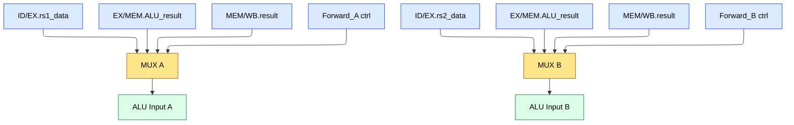
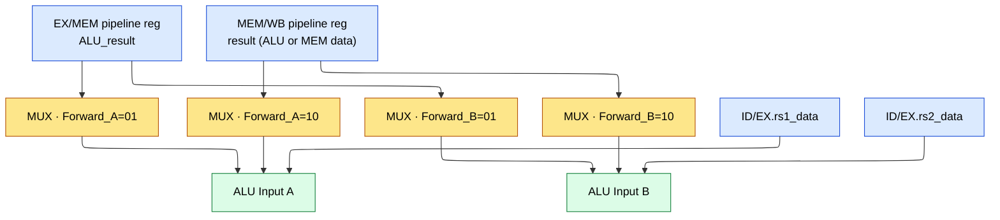
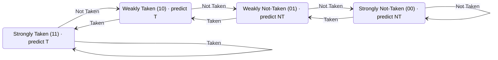
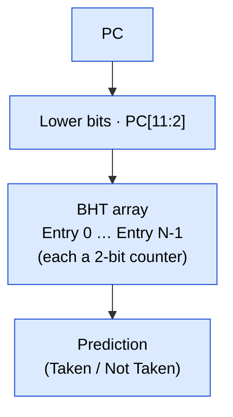
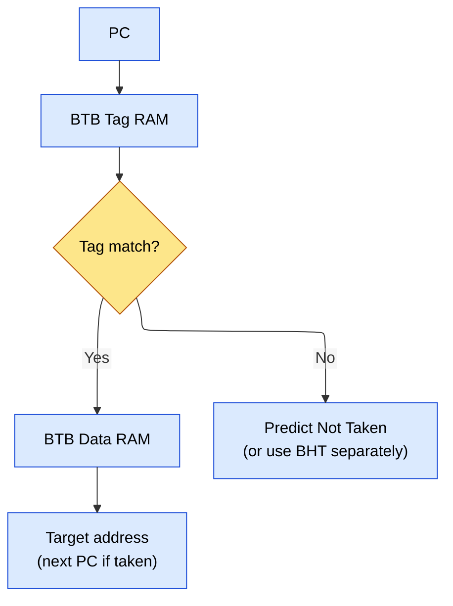
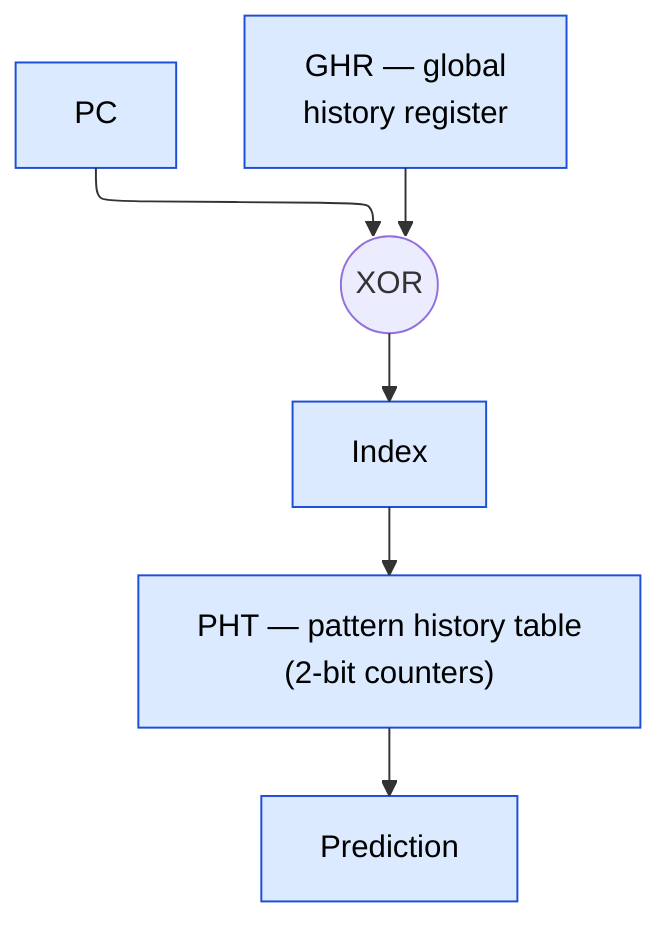
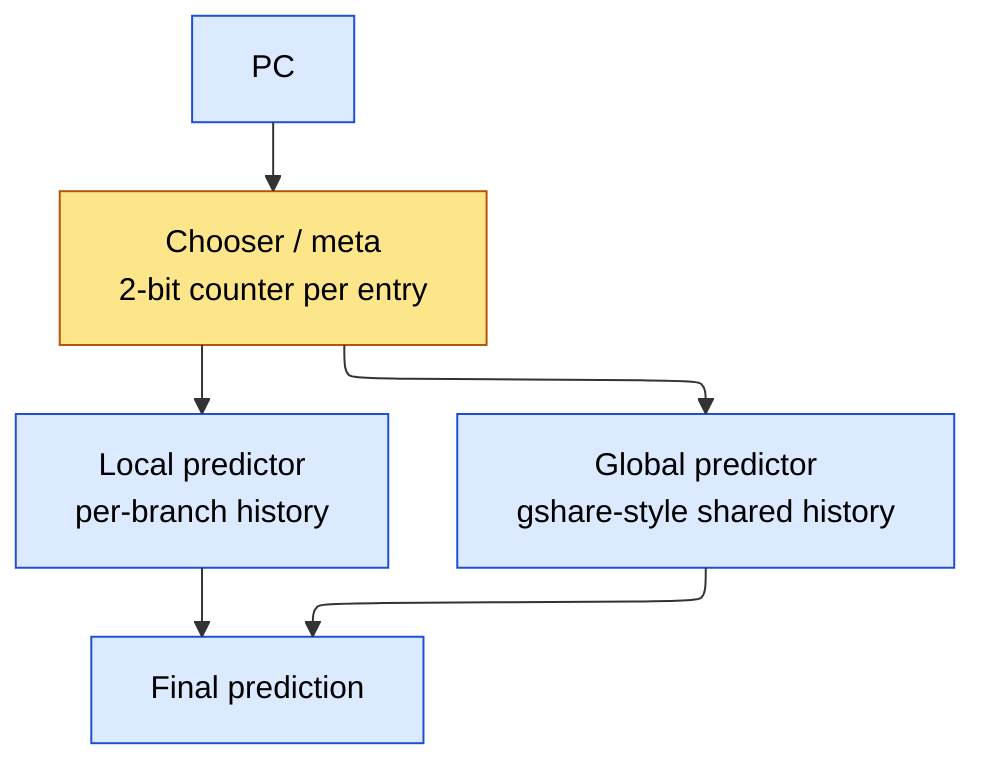
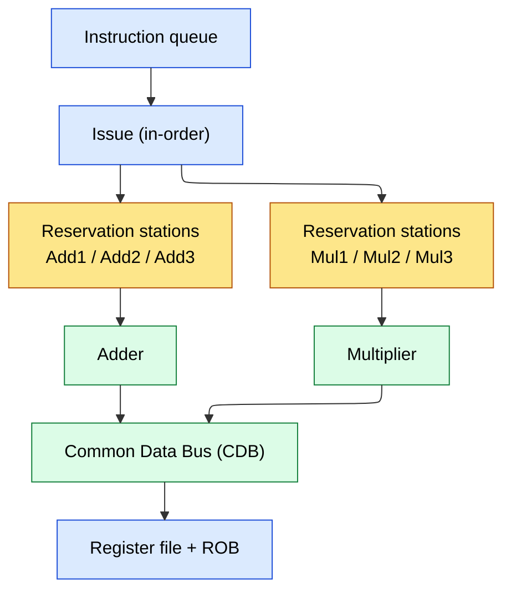
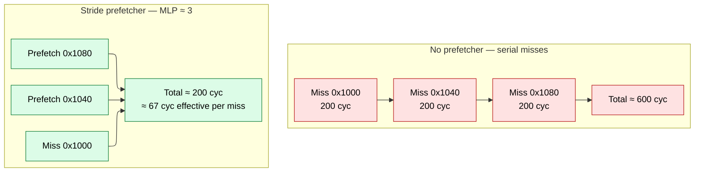
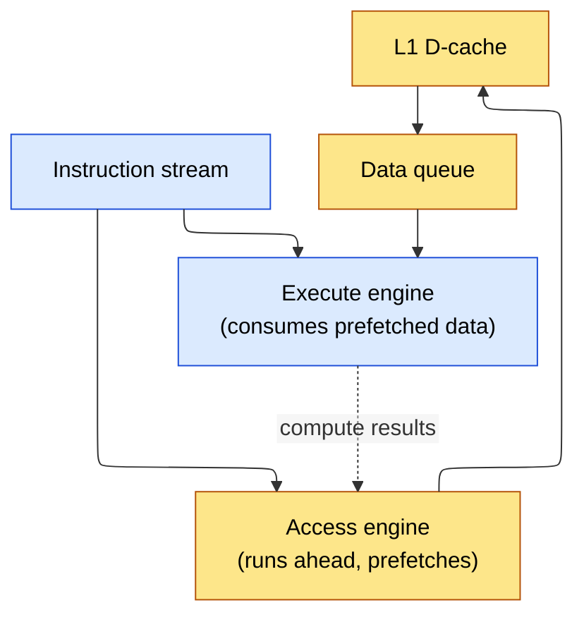

# CPU Architecture -- The Complete Interview Bible

## Table of Contents
1. Five-Stage Pipeline -- Detailed Microarchitecture
2. Pipeline Hazards with Instruction-Level Examples
3. Forwarding (Bypassing) -- Complete MUX Diagrams
4. Branch Prediction -- Deep Dive
5. Tomasulo's Algorithm -- Step-by-Step Execution
6. Superscalar and Register Renaming
7. Memory Hierarchy -- AMAT, Cache Design, Store Buffer, and MLP
8. Cache Coherence -- MESI with All Transitions
9. Virtual Memory and TLB
10. Performance Analysis
11. Fetch Unit Microarchitecture
12. RISC-V Instruction Examples
13. SMT Resource Partitioning
14. Exception Pipeline in Out-of-Order Execution
15. Memory Ordering and Consistency Models
16. Micro-op Fusion

---

## 1. Five-Stage Pipeline -- Detailed Microarchitecture

### 1.1 Stage 1: Instruction Fetch (IF)

```text
Inputs:  PC (Program Counter), Branch prediction signals
Outputs: Instruction bits, PC+4, predicted branch target

Components:
  - PC register (updated every cycle)
  - PC MUX: selects between:
    * PC + 4 (sequential)
    * Branch target (from branch predictor or resolved branch)
    * Exception/interrupt vector
  - Instruction Memory / I-Cache
  - Branch Target Buffer (BTB) lookup (parallel with I-Cache)
  - Next-PC logic

Operation:
  1. Send PC to I-Cache
  2. Simultaneously look up PC in BTB
  3. If BTB hit and BHT predicts taken: next PC  = BTB target
  4. If BTB miss or not taken: next PC           = PC + 4
  5. Fetch instruction from I-Cache (1 cycle for cache hit)
  6. On I-Cache miss: pipeline stalls, fill from L2 (10-20 cycles)

Pipeline register IF/ID:
  {instruction[31:0], PC+4, predicted_target, prediction_direction}
```
### 1.2 Stage 2: Instruction Decode / Register Read (ID)

```text
Inputs:  Instruction from IF/ID register
Outputs: Control signals, register values, immediate, decoded opcode

Components:
  - Instruction decoder (opcode -> control signals)
  - Register file (read ports: rs1, rs2; write port from WB stage)
  - Immediate generator (sign-extend, shift for different formats)
  - Hazard detection unit (detects RAW hazards, generates stalls)
  - Branch comparator (for branch-in-ID optimization)
  - Control signal generation:
    * ALUSrc (register or immediate)
    * ALUOp (add, sub, and, or, slt, etc.)
    * MemRead, MemWrite
    * RegWrite
    * MemtoReg (ALU result or memory data)
    * Branch type

Operation:
  1. Decode instruction opcode and function fields
  2. Read rs1 and rs2 from register file
  3. Generate immediate value
  4. Check for data hazards (compare rs1/rs2 with EX/MEM/WB destinations)
  5. If load-use hazard detected: insert pipeline bubble (stall IF, ID)

Pipeline register ID/EX:
  {rs1_data, rs2_data, immediate, rd, ALUOp, control_signals, PC+4}
```
### 1.3 Stage 3: Execute (EX)

```text
Inputs:  Operands from ID/EX register, forwarded values
Outputs: ALU result, branch decision, target address

Components:
  - ALU (arithmetic, logic, comparison)
  - Forwarding MUX on each ALU input (select: ID/EX, EX/MEM forward, MEM/WB forward)
  - Branch target adder (PC + immediate)
  - Branch resolution (compare register values)
  - Address calculation (for loads/stores: base + offset)

Operation:
  1. Select ALU operands (from register file or forwarded values)
  2. Execute ALU operation
  3. For branches: compare operands, determine taken/not-taken
  4. If branch misprediction: flush IF and ID stages, correct PC
  5. For loads/stores: compute effective address = rs1 + immediate

Pipeline register EX/MEM:
  {ALU_result, rs2_data (for store), rd, control_signals, branch_taken, target}
```
### 1.4 Stage 4: Memory Access (MEM)

```text
Inputs:  ALU result (address), store data from EX/MEM register
Outputs: Memory read data or ALU pass-through

Components:
  - Data Memory / D-Cache
  - Memory read/write control
  - Write buffer (for store buffering)

Operation:
  1. For loads: send address to D-Cache, receive data (1 cycle if hit)
  2. For stores: write data to D-Cache (or write buffer)
  3. For ALU instructions: pass ALU result through (no memory access)
  4. On D-Cache miss: pipeline stalls, fill from L2

Pipeline register MEM/WB:
  {ALU_result, mem_read_data, rd, control_signals}
```
### 1.5 Stage 5: Write Back (WB)

Inputs:  MEM/WB register
Outputs: Write to register file

**Components:**
   - Result MUX: select between ALU result and memory data
   - Register file write port

**Operation:**
   1. Select result (MemtoReg: memory data or ALU result)
2. Write to destination register rd (if RegWrite is asserted)
3. Write occurs on the first half of the clock cycle (allows
same-cycle read in ID stage -- "write-first" register file)

---

## 2. Pipeline Hazards with Instruction-Level Examples

### 2.1 RAW (Read After Write) -- True Data Dependency

```text
Instruction sequence (MIPS):
  I1: ADD  $1, $2, $3       # Writes $1 in WB (cycle 5)
  I2: SUB  $4, $1, $5       # Reads $1 in ID (cycle 3) -- $1 not yet written!
  I3: AND  $6, $1, $7       # Reads $1 in ID (cycle 4) -- $1 not yet written!
  I4: OR   $8, $1, $9       # Reads $1 in ID (cycle 5) -- $1 written this cycle (OK with write-first RF)

Pipeline without forwarding:
  Cycle:  1    2    3    4    5    6    7    8
  I1:    IF   ID   EX  MEM  WB
  I2:         IF   ID  stall stall EX  MEM  WB    <- 2-cycle stall for $1
  I3:              IF  stall stall ID   EX  MEM  WB
  I4:                   stall stall IF   ID   EX  MEM  WB

With forwarding (see Section 3):
  Cycle:  1    2    3    4    5    6    7    8
  I1:    IF   ID   EX  MEM  WB
  I2:         IF   ID   EX  MEM  WB               <- Forward from EX/MEM
  I3:              IF   ID   EX  MEM  WB          <- Forward from MEM/WB
  I4:                   IF   ID   EX  MEM  WB     <- Normal read (WB to ID same cycle)

  No stalls! Forwarding eliminates 2 stall cycles.
```
### 2.2 Load-Use Hazard (Forwarding Can't Solve It)

```text
  I1: LW   $1, 0($2)        # Load: data available END of MEM (cycle 4)
  I2: ADD  $4, $1, $5       # Needs $1 at BEGINNING of EX (cycle 3)

Pipeline:
  Cycle:  1    2    3    4    5    6    7
  I1:    IF   ID   EX  MEM  WB
  I2:         IF   ID  stall EX  MEM  WB     <- 1 stall UNAVOIDABLE
  I3:              IF  stall ID   EX  MEM  WB

Why forwarding can't help:
  I1 produces data at end of MEM (cycle 4 clock edge).
  I2 needs data at beginning of EX (cycle 3 clock edge).
  Data isn't ready yet! Must wait 1 cycle.

  After the stall: I2's EX is in cycle 4, and I1's MEM result is
  available at the end of cycle 4 -> can forward from MEM/WB to EX.

Compiler optimization (load delay slot scheduling):
  I1: LW   $1, 0($2)
  I3: AND  $6, $7, $8                        <- Independent instruction moved here
  I2: ADD  $4, $1, $5                        <- Now 1 cycle later, no stall needed
```
### 2.3 Control Hazards (Branch Penalty)

```text
  I1: BEQ  $1, $2, target   # Branch resolved in EX (cycle 3)
  I2: ADD  $3, $4, $5       # Fetched speculatively (may be wrong)
  I3: SUB  $6, $7, $8       # Fetched speculatively (may be wrong)

If branch is taken (mispredicted as not-taken):
  Cycle:  1    2    3    4    5
  I1:    IF   ID   EX  MEM  WB
  I2:         IF   ID  flush               <- Wrong path, flushed
  I3:              IF  flush               <- Wrong path, flushed
  target:               IF   ID   EX ...   <- Correct path starts

Branch penalty = 2 cycles (for branch resolved in EX)

If branch resolved in ID (some implementations):
  Penalty = 1 cycle

If branch resolved in MEM (deeply pipelined):
  Penalty = 3 cycles
```
### 2.4 WAR and WAW (Out-of-Order Only)

```text
WAR (Write After Read) - anti-dependency:
  I1: ADD  $1, $2, $3       # Reads $2 in cycle 2
  I2: SUB  $2, $4, $5       # Writes $2 in cycle 6

In-order pipeline: No hazard (I1 reads $2 before I2 writes it).
Out-of-order: I2 might execute before I1 if I2's operands are ready first.
  If I2 writes $2 before I1 reads it -> I1 gets wrong value.
Solution: Register renaming. I2 writes to physical reg P47 (renamed),
  I1 still reads from P12 (old mapping of $2). No conflict.

WAW (Write After Write):
  I1: ADD  $1, $2, $3       # Writes $1
  I2: SUB  $1, $4, $5       # Also writes $1

In-order: No hazard (I1 writes before I2, final value is from I2).
Out-of-order: I1 might write after I2, leaving $1 with I1's value (wrong!).
Solution: Register renaming. I1 writes P47, I2 writes P63 (different physical regs).
  Architectural register $1 maps to P63 after I2. P47 is freed later.
```
---

## 3. Forwarding (Bypassing) -- Complete MUX Diagrams

### 3.1 Forwarding Paths



Each MUX selects one of three inputs: `00` normal (register file via ID/EX); `01` forward from EX/MEM (1-cycle forward, ALU→ALU); `10` forward from MEM/WB (2-cycle forward, ALU→ALU or MEM→ALU). Load-to-use forwards from MEM/WB to EX after one stall cycle.

### 3.2 Forwarding Control Logic

```verilog
// Forward A (ALU input 1)
always @(*) begin
    if (EX_MEM_RegWrite && (EX_MEM_Rd != 0) && (EX_MEM_Rd == ID_EX_Rs1))
        ForwardA = 2'b01;  // Forward from EX/MEM
    else if (MEM_WB_RegWrite && (MEM_WB_Rd != 0) && (MEM_WB_Rd == ID_EX_Rs1))
        ForwardA = 2'b10;  // Forward from MEM/WB
    else
        ForwardA = 2'b00;  // No forwarding
end

// Forward B (ALU input 2) -- same logic with Rs2
always @(*) begin
    if (EX_MEM_RegWrite && (EX_MEM_Rd != 0) && (EX_MEM_Rd == ID_EX_Rs2))
        ForwardB = 2'b01;
    else if (MEM_WB_RegWrite && (MEM_WB_Rd != 0) && (MEM_WB_Rd == ID_EX_Rs2))
        ForwardB = 2'b10;
    else
        ForwardB = 2'b00;
end

// Priority: EX/MEM forward takes priority over MEM/WB forward
// (EX/MEM has the most recent value)
```
### 3.3 Hazard Detection Unit (for Load-Use Stall)

```text
// Detect load-use hazard: current ID stage reads what EX stage is loading
wire load_use_hazard = ID_EX_MemRead &&
                       ((ID_EX_Rd == IF_ID_Rs1) || (ID_EX_Rd == IF_ID_Rs2));

// When hazard detected:
//   1. Insert NOP into ID/EX register (bubble)
//   2. Stall IF and ID stages (don't advance PC, don't update IF/ID register)
//   3. After 1 cycle, the load result is available for forwarding from MEM/WB
```
---

### 3.4 Detailed Forwarding Network (N-wide Superscalar)

**Bypass paths in a 5-stage pipeline:**



Bypass paths: **EX→EX** (Forward=01) — result available after EX, forwarded to the next instruction's EX; **MEM→EX** (Forward=10) — result available after MEM, forwarded to an instruction two cycles later; **WB→EX** — not needed in a classic 5-stage pipeline with a write-first register file (WB writes in the first half of the cycle, ID reads in the second, so the value is available same-cycle).

In pipelines deeper than 5 stages a WB→EX (late-stage-to-early-stage) bypass *is* needed — e.g., a 7-stage pipeline with WB in stage 6 and a dependent EX in stage 4 must forward back two stages. In an out-of-order core the Common Data Bus handles this: on write-back, the result tag is broadcast to the issue queue's CAM, waking dependent instructions regardless of pipeline distance — replacing all explicit bypass paths with one broadcast.

**Which forwarding is needed to avoid stalls:**

| Dependency Distance | Source Stage | Consumer Stage | Forward Path | Stall? |
|---|---|---|---|---|
| 1 cycle apart (back-to-back ALU) | EX/MEM | EX | EX->EX (Forward=01) | No stall |
| 2 cycles apart (ALU, NOP, ALU) | MEM/WB | EX | MEM->EX (Forward=10) | No stall |
| Same cycle (WB->ID) | WB | ID | Write-first RF | No stall |
| Load -> ALU (1 cycle apart) | MEM/WB | EX | MEM->EX after 1 stall | **1 stall cycle** |
| 3+ cycles apart (deeper pipeline) | WB (or later) | EX | WB->EX bypass (deeper pipelines) or CDB broadcast (OoO) | No stall |

**Worked pipeline timing diagram showing data hazard resolution:**

```verilog
Instruction sequence:
  I1: ADD  $1, $2, $3     (writes $1)
  I2: SUB  $4, $1, $5     (reads $1 -- RAW hazard, distance 1)
  I3: AND  $6, $1, $7     (reads $1 -- RAW hazard, distance 2)
  I4: OR   $8, $1, $9     (reads $1 -- RAW hazard, distance 3)

Without forwarding:
  Cycle:  1    2    3    4    5    6    7    8    9   10   11
  I1:    IF   ID   EX  MEM  WB
  I2:         IF   ID  stall stall EX  MEM  WB
  I3:              IF  stall stall ID   EX  MEM  WB
  I4:                  stall stall IF   ID   EX  MEM  WB
  Total: 11 cycles, 4 stall cycles

With forwarding:
  Cycle:  1    2    3    4    5    6    7    8
  I1:    IF   ID   EX  MEM  WB
  I2:         IF   ID   EX  MEM  WB       <- EX->EX forward (EX/MEM.ALU_result -> I2's EX)
  I3:              IF   ID   EX  MEM  WB  <- MEM->EX forward (MEM/WB.result -> I3's EX)
  I4:                   IF   ID   EX  MEM WB  <- No forward needed (WB writes, ID reads same cycle)
  Total: 8 cycles, 0 stall cycles

Forwarding detail for each cycle:

  Cycle 3: I1 in EX, I2 in ID
    I1's ALU computes $1 = $2 + $3
    Result available at end of cycle 3 (written to EX/MEM register)

  Cycle 4: I1 in MEM, I2 in EX, I3 in ID
    Forward A for I2: EX/MEM.Rd=$1 matches I2.Rs1=$1 -> ForwardA=01
    I2's ALU input A = EX/MEM.ALU_result (forwarded from I1)
    I2 computes $4 = $1(forwarded) - $5

  Cycle 5: I1 in WB, I2 in MEM, I3 in EX, I4 in ID
    Forward A for I3: MEM/WB.Rd=$1 matches I3.Rs1=$1 -> ForwardA=10
    I3's ALU input A = MEM/WB.ALU_result (forwarded from I1)
    I3 computes $6 = $1(forwarded) & $7
    I4 reads $1 from register file (I1 wrote $1 in WB first half of cycle 5,
    I4 reads in ID second half of cycle 5 -- write-first register file)

Load-use hazard (1 stall, unavoidable):
  I1: LW   $1, 0($2)
  I2: ADD  $4, $1, $5

  Cycle:  1    2    3    4    5    6    7
  I1:    IF   ID   EX  MEM  WB
  I2:         IF   ID  stall EX  MEM  WB        <- 1 stall cycle
  I3:              IF  stall ID   EX  MEM  WB

  Why 1 stall: I1's data available at end of MEM (cycle 4).
  I2 needs data at start of EX (cycle 4 originally).
  After 1 stall, I2's EX is in cycle 5, I1's MEM data is available via MEM->EX forward.

  Forward in cycle 5: MEM/WB.mem_data forwarded to I2's ALU input A.
```

---

## 4. Branch Prediction -- Deep Dive

### 4.1 CPI Impact of Branches

```text
CPI = CPI_base + Branch_Frequency * Misprediction_Rate * Penalty

Example:
  CPI_base          = 1 (ideal pipeline)
  Branch_Frequency  = 20% (1 in 5 instructions is a branch)
  Penalty           = 2 cycles (branch resolved in EX)

  With always-not-taken prediction (50% accuracy for conditional branches):
    CPI = 1 + 0.2 * 0.5 * 2 = 1.2  (20% performance loss)

  With 2-bit predictor (90% accuracy):
    CPI = 1 + 0.2 * 0.1 * 2 = 1.04  (4% loss)

  With tournament predictor (97% accuracy):
    CPI = 1 + 0.2 * 0.03 * 2 = 1.012  (1.2% loss)

  With deep pipeline (20 stages, penalty  = 15 cycles):
    At 97% accuracy: CPI                  = 1 + 0.2 * 0.03 * 15 = 1.09  (9% loss!)
    Even excellent prediction hurts with deep pipelines.
```

### 4.2 Two-Bit Saturating Counter -- FSM with Transitions



Prediction rule: MSB = 1 → predict Taken; MSB = 0 → predict Not Taken. For a loop that runs 100×, a 1-bit predictor makes 2 mispredictions (first entry NT, last exit T); a 2-bit predictor makes only 1 (at exit — the weakly-taken state absorbs the first exit and stays taken for re-entry).

### 4.3 Branch History Table (BHT) Organization



BHT size is typically 1K–16K entries; the index is `PC[11:2]` for 1K entries (ignore the byte offset, align to instructions). The main problem is **aliasing** — different branches map to the same entry, with a collision rate that depends on table size and branch frequency.

### 4.4 BTB (Branch Target Buffer) Structure



Each BTB entry holds `{tag (upper PC bits), target_address, valid, branch_type}`; typical size 256–4K entries, 2–4-way set-associative. The BTB answers *where* to fetch if taken; the BHT answers *whether* to take (target vs PC+4). Both are needed for full prediction.

### 4.5 Gshare Predictor



The GHR is an N-bit shift register of the last N branch outcomes (Taken→1, Not Taken→0). `Index = PC[N-1:0] XOR GHR[N-1:0]`; the XOR gives a unique index per (PC, history) pair, capturing correlations such as "if the last two branches were taken, this one is usually not taken." Typical accuracy 93–95% on SPEC; GHR width 10–18 bits; PHT 2¹⁰–2¹⁸ entries.

### 4.6 Tournament Predictor



The chooser selects local or global. On each outcome: if local was right and global wrong, bias the chooser toward local (and vice-versa); if both agree, no change. Local history suits branches whose pattern is tied to their own history (loops); global history suits correlated branches (if-else chains). Tournament accuracy is 95–97% on SPEC (the Alpha 21264 used this).

### 4.7 Prediction Accuracy Comparison

```text
| Predictor           | Accuracy (SPEC) | Hardware Cost   | Used In           |
|---------------------|-----------------|-----------------|-------------------|
| Always Not Taken    | 30-40%          | None            | -                 |
| Always Taken        | 60-70%          | None            | -                 |
| BTFNT               | 65-75%          | Minimal         | Simple embedded   |
| 1-bit BHT (1K)      | 80-85%          | 1KB             | -                 |
| 2-bit BHT (4K)      | 85-90%          | 8KB             | Early RISC        |
| Gshare (14-bit)     | 93-95%          | 32KB            | AMD K6            |
| Tournament          | 95-97%          | 64KB            | Alpha 21264       |
| TAGE                | 97-99%          | 64-256KB        | Intel Haswell+    |
| Perceptron          | 95-97%          | 64KB            | AMD Zen           |
```

---

## 5. Tomasulo's Algorithm -- Step-by-Step Execution

### 5.1 Architecture Recap



### 5.2 Step-by-Step Example

**Code sequence:**

```text
I1: LD    F6, 34(R2)       # Load F6 from memory[R2+34]
I2: LD    F2, 45(R3)       # Load F2 from memory[R3+45]
I3: MULTD F0, F2, F4       # F0   = F2 * F4 (depends on I2)
I4: SUBD  F8, F6, F2       # F8   = F6 - F2 (depends on I1, I2)
I5: DIVD  F10, F0, F6      # F10  = F0 / F6 (depends on I3, I1)
I6: ADDD  F6, F8, F2       # F6   = F8 + F2 (depends on I4, I2)
```

**Execution trace (cycle by cycle):**

```text
Cycle 1: Issue I1 (LD F6, 34(R2))
  Load1 RS: Op=LD, Addr=R2+34, Dest=F6
  Register status: F6 -> Load1

Cycle 2: Issue I2 (LD F2, 45(R3))
  Load2 RS: Op=LD, Addr=R3+45, Dest=F2
  Register status: F2 -> Load2

Cycle 3: Issue I3 (MULTD F0, F2, F4)
  Mul1 RS: Op=MULT, Vj=?, Qj=Load2 (F2 not ready), Vk=F4 value, Qk=0
  Register status: F0 -> Mul1
  I1 executes (LD completes, CDB broadcasts: Load1 -> F6 value)
  Load1 result written to F6 in register file

Cycle 4: Issue I4 (SUBD F8, F6, F2)
  Add1 RS: Op = SUB, Vj=F6 value (now available from I1), Qj=0,
           Vk = ?, Qk=Load2 (F2 still loading)
  Register status: F8 -> Add1
  I2 may execute this cycle

Cycle 5: Issue I5 (DIVD F10, F0, F6)
  Mul2 RS: Op=DIV, Vj=?, Qj=Mul1 (F0 not ready), Vk=F6 value, Qk=0
  Register status: F10 -> Mul2
  I2 completes (CDB broadcasts: Load2 -> F2 value)
  Mul1 captures F2 value (Qj = Load2 matches, now Vj=F2 value, Qj=0)
  Add1 captures F2 value (Qk = Load2 matches, now Vk=F2 value, Qk=0)

Cycle 6: Issue I6 (ADDD F6, F8, F2)
  Add2 RS: Op=ADD, Vj=?, Qj=Add1 (F8 not ready), Vk=F2 value, Qk=0
  Register status: F6 -> Add2  (overwrite! WAW with I1 resolved by renaming)
  I3 begins execution (Mul1 has both operands)
  I4 begins execution (Add1 has both operands)

Cycle 7:
  I4 completes (Add1 result on CDB: F8  = F6 - F2)
  Add2 captures (Qj                     = Add1 matches, now Vj=F8 value)

Cycle 8:
  I6 begins execution (Add2 has both operands)

Cycle 9:
  I6 completes (Add2 result on CDB: F6 = F8 + F2)

Cycle 10 (or later, multiplier takes multiple cycles):
  I3 completes (Mul1 result on CDB: F0  = F2 * F4)
  Mul2 captures (Qj                     = Mul1 matches, now Vj=F0 value)

Cycle 11+:
  I5 begins execution (Mul2 has both operands, division is slow)

Cycle 40+ (division takes ~30 cycles):
  I5 completes (Mul2 result on CDB: F10 = F0 / F6)
```

### 5.3 How RAW, WAR, WAW Are Handled

**RAW (I3 depends on I2 for F2):**
   - I3 issues with Qj=Load2 (tag, not value). When I2 completes and broadcasts
   - on CDB, Mul1 snoops and captures the value. True data flow respected.

**WAR (I6 writes F6, which I5 reads):**
   - At issue time of I5, F6's value is already captured into Mul2's Vk.
   - When I6 later writes F6 (updating the register file), Mul2 already has
   - the old value. No conflict.

**WAW (I1 writes F6, I6 also writes F6):**
   - At I6's issue time, register status for F6 is updated from "Load1" to "Add2".
   - I1's result was already consumed. I6's result becomes the final F6 value.
   - Even if I1 completed after I6 (impossible in this example, but in general
   - with ROB), the ROB ensures in-order commit.

---

## 6. Superscalar and Register Renaming

### 6.1 Superscalar Pipeline

```text
2-wide superscalar: Issue up to 2 instructions per cycle

  Fetch:  [I0, I1]  [I2, I3]  [I4, I5]  ...  (fetch 2 per cycle)
  Decode: [I0, I1]  [I2, I3]  [I4, I5]  ...  (decode 2 per cycle)
  Rename: [I0->P5, I1->P6]  [I2->P7, I3->P8]  ... (rename 2 per cycle)
  Issue:  Check dependencies, issue to reservation stations
  Execute: Multiple FUs (2 ALUs, 1 FPU, 1 Load, 1 Store)
  Commit: ROB retires 2 per cycle (in program order)

Challenges:
  - Dependency checking: O(W^2) comparisons for W-wide issue
  - Register renaming: need W rename ports per cycle
  - Multiple FUs: 2+ ALUs, 1+ FPU, 1+ load/store unit
  - Branch prediction accuracy must be very high (deep speculation)
```

### 6.2 Register Renaming with Physical Register File

```text
Architectural registers: R0-R31 (ISA visible, 32 registers)
Physical registers: P0-P127 (128 physical registers, not ISA visible)

Register Alias Table (RAT):
  R0 -> P0 (R0 is always 0, hardwired)
  R1 -> P15
  R2 -> P42
  R3 -> P7
  ...

Free list: {P48, P51, P63, P72, ...}  (available physical registers)

Instruction: ADD R1, R2, R3

Rename process:
  1. Read source mappings: R2 -> P42, R3 -> P7 (from RAT)
  2. Allocate destination: R1 gets P48 (from free list)
  3. Update RAT: R1 -> P48 (old mapping P15 saved in ROB)
  4. Issue: ADD P48, P42, P7 (no architectural registers, all physical)

On commit:
  Free the OLD physical register (P15, the previous mapping of R1)
  P15 returns to the free list

On flush (misprediction):
  Restore RAT to committed state (from ROB snapshots)
  Free all speculative physical registers
```

### 6.3 Reorder Buffer (ROB) Management

ROB is a circular buffer — **Head** points to the oldest instruction (next to commit), **Tail** to the newest (most recently issued).

| # | Instr | Dest | Value | Done? | Exception | Notes |
|---|---|---|---|---|---|---|
| 0 | ADD | P48 | 42 | Yes | No | ← Head (ready to commit) |
| 1 | LW | P51 | 100 | Yes | No | |
| 2 | BEQ | – | – | Yes | No | ← branch: check prediction |
| 3 | MUL | P63 | – | No | – | ← not done yet |
| 4 | ADD | P72 | – | No | – | ← Tail |

Commit rules: (1) check the head entry; (2) if Done and no exception, commit — write to arch state and free the old physical reg; (3) if Done with exception, flush all entries from this one to the tail; (4) if not Done, wait — later entries cannot commit out of order; (5) advance head. Commit width is typically 2–8 per cycle (matching issue width).

---

## 7. Memory Hierarchy -- AMAT and Cache Design

### 7.1 AMAT (Average Memory Access Time)

```verilog
AMAT = Hit_Time + Miss_Rate * Miss_Penalty

For multi-level cache:
AMAT = L1_Hit_Time + L1_Miss_Rate * (L2_Hit_Time + L2_Miss_Rate * (L3_Hit_Time + L3_Miss_Rate * Mem_Latency))

Typical modern values:
  L1 I-Cache: 32-64 KB, 4-way, 1-4 cycles hit, ~5% miss rate
  L1 D-Cache: 32-64 KB, 8-way, 1-4 cycles hit, ~10% miss rate
  L2 Cache:   256KB-1MB, 8-way, 10-20 cycles hit, ~2% miss rate (of L1 misses)
  L3 Cache:   4-32 MB, 16-way, 30-50 cycles hit, ~20% miss rate (of L2 misses)
  Main Memory (DDR4): 100-300 cycles

Numerical AMAT example:
  AMAT = 4 + 0.10 * (15 + 0.02 * (40 + 0.20 * 200))
       = 4 + 0.10 * (15 + 0.02 * (40 + 40))
       = 4 + 0.10 * (15 + 0.02 * 80)
       = 4 + 0.10 * (15 + 1.6)
       = 4 + 0.10 * 16.6
       = 4 + 1.66
       = 5.66 cycles

  Without L2/L3:
  AMAT = 4 + 0.10 * 200 = 24 cycles  (4.2x worse!)
```

### 7.2 Cache Organization

```verilog
Cache parameters:
  Cache size:    S = 32 KB
  Block size:    B = 64 bytes (cache line size)
  Associativity: A = 8-way set-associative
  Number of sets: N = S / (B * A) = 32768 / (64 * 8) = 64 sets

Address breakdown (32-bit address, 64B block, 64 sets):
  [Tag (20 bits) | Set Index (6 bits) | Block Offset (6 bits)]

  Block Offset: log2(64) = 6 bits (byte within cache line)
  Set Index:    log2(64) = 6 bits (which set)
  Tag:          32 - 6 - 6 = 20 bits (unique identifier)
```

### 7.3 Cache Line Size Trade-offs

```verilog
Larger cache lines (e.g., 128B vs 64B):
  Pros:
    - Better spatial locality (more nearby data prefetched)
    - Fewer tag bits per byte (less overhead)
    - Higher bandwidth utilization per DDR burst
  Cons:
    - Higher miss penalty (more bytes to transfer per miss)
    - More wasted bandwidth on partial-line usage
    - Fewer total cache lines for same cache size (worse temporal locality)
    - False sharing in multi-core (larger granularity of coherence)

Typical cache line sizes:
  L1: 64 bytes (most common in x86, ARM)
  L2/L3: 64-128 bytes
  Memory bus: optimized for 64B bursts (matches L1 line size)
```

### 7.4 Write Policies

```verilog
Write-Through:
  Every write updates BOTH cache AND main memory
  Simple, memory always consistent
  High memory traffic (every store goes to memory)
  Often used with write buffer to reduce stalls

Write-Back:
  Writes only update cache, mark line "dirty"
  Dirty lines written to memory only on eviction
  Lower memory traffic (most writes stay in cache)
  More complex (dirty bit, write-back on eviction)
  Used in all modern high-performance caches

Write-Allocate (fetch on write miss):
  On write miss: fetch the block, then write into it
  Usually paired with write-back

No-Write-Allocate (write-around):
  On write miss: write directly to memory, don't fetch block
  Usually paired with write-through
```

### 7.5 Miss Types (3 C's)

```verilog
Compulsory (Cold): First access to a block. Unavoidable (except with prefetching).
Capacity: Cache is too small to hold all needed blocks. Reduce by increasing cache size.
Conflict: Two blocks map to the same set. Reduce by increasing associativity.

+ Coherence misses (4th C): Invalidation by another core in multi-core.

Reducing each:
  Compulsory: Prefetching (hardware or software)
  Capacity:   Larger cache, better replacement policy
  Conflict:   Higher associativity, victim cache
  Coherence:  Better data placement, private vs shared data separation
```

### 7.6 Store Buffer and Store-to-Load Forwarding

The store buffer sits between the execution units and the L1 data cache. When a
store instruction executes, its address and data are written to the store buffer,
not directly to the cache. The store commits (writes to the D-cache) only when it
is the oldest completed instruction at the head of the ROB -- this is in-order
retirement.

**Why stores are buffered:**

1. **Speculation** -- stores from a mispredicted branch must never reach the
   cache. Buffering lets the core discard them on a pipeline flush.
2. **Out-of-order execution** -- stores can execute as soon as the address and
   data are ready, without waiting for older instructions to retire.
3. **Port decoupling** -- the D-cache write port may be busy (e.g., a line fill
   from an earlier miss). The store buffer absorbs the write and drains to the
   cache when the port is free.

**Store-to-load forwarding (SLF):** When a subsequent load executes and its
address matches a pending store in the store buffer, the load can obtain the data
directly from the buffer instead of waiting for the store to commit to cache.

Store buffer (circular FIFO):

| Entry | Addr | Data |
|---|---|---|
| 0 (oldest) | 0x1000 | 42 |
| 1 | 0x1008 | 7 |
| 2 | 0x2000 | 99 |
| 3 (tail) | empty | — |

On `Load(addr=0x1008)`, a CAM search matches entry 1 and returns Data = 7 immediately — no D-cache access needed. This is store-to-load forwarding.

**Forwarding conditions:**

1. **Exact address match** -- the load's byte range must fall entirely within a
   single store's byte range. A 4-byte load at 0x1000 matches a store of 4
   bytes at 0x1000 exactly.
2. **Data ready** -- the store must have its data value available (the store
   address may be known before the data in some microarchitectures).
3. **Partial / overlapping matches** -- if the load spans bytes from multiple
   pending stores, the hardware must merge bytes from each store (and possibly
   the cache). Not all designs support this; some require a full stall until the
   stores commit.

**Store-forwarding hazard (SFX):** When a load depends on a recent store to the
same address but the forwarding check fails -- the store address is not yet
computed, or the overlap is partial -- the load must wait. This is a major
performance limiter. Intel's optimization manual reports SFX stalls account for
5-10% of cycles in typical integer workloads.

**Typical SFX pattern:**
   - STORE [rax], rcx          ; address = rax, data = rcx
   - LOAD  rdx, [rax]          ; same address -> must forward

Best case (address known, data ready): 1 extra cycle (forwarded)
Worst case (address unknown):         4-5 cycle stall on Intel
Partial overlap (load wider than store): ~15 cycle penalty (store must commit first)

**Store buffer sizing:** Modern CPUs typically have 30-60 entries.

| Microarchitecture | Store Buffer Entries |
|-------------------|----------------------|
| Apple M1          | ~40                  |
| Intel Raptor Lake | ~60                  |
| AMD Zen 4         | ~48                  |
| ARM Cortex-X2     | ~32                  |

When the store buffer is full, the processor cannot execute more stores and must
stall, which can become a bottleneck in write-heavy code (e.g., memcpy, memset).


### 7.7 LSQ, ROB, and Renaming — Summary (deep dives live in OoO_Execution)

The three big OoO bookkeeping structures deserve full pages of detail; this page keeps only the survey view (§5–§6 cover the concepts):

- **Load-Store Queue** — split LQ/SQ, CAM on address; enforces memory ordering, catches store→load ordering violations at store commit, and provides store-to-load forwarding (§7.6). Typical sizing: LQ 32–64 / SQ 24–56 entries. Full entry fields, CAM search, and violation recovery: [OoO_Execution](05_OoO_Execution.md) §5.
- **Reorder Buffer** — circular SRAM buffer (head = oldest uncommitted, tail = next free) that re-serializes out-of-order completion into in-order commit: precise exceptions, register reclamation, misprediction cleanup. Entry layout, commit logic, and pointer-arithmetic worked examples: [OoO_Execution](05_OoO_Execution.md) §3.
- **Register renaming** — RAT maps 32 architectural onto 100–200+ physical registers, eliminating WAR/WAW; RAM-based active table + checkpoints for recovery; free-list allocation and reclamation rules. Full implementation and worked rename trace: [OoO_Execution](05_OoO_Execution.md) §2.

Exception handling in an OoO pipeline (stage-by-stage detection, precise-exception walkthrough) is summarized in §14 and detailed in [OoO_Execution](05_OoO_Execution.md) §9.

### 7.8 Memory-Level Parallelism (MLP)

MLP measures how many outstanding cache misses a processor can tolerate
simultaneously. A processor with MLP $= N$ can have $N$ cache misses in flight
without stalling the core's independent execution.

**Relationship to AMAT.** With perfect overlap of $N$ independent cache misses,
each of latency $t_{\text{miss}}$:

$$
\text{AMAT}_{\text{effective}} = \frac{\text{Total latency}}{\text{Number of misses}} = \frac{t_{\text{miss}}}{N}
$$

Without overlap the same $N$ misses take $N \cdot t_{\text{miss}}$ cycles. MLP
converts serial latency into parallel throughput.

**Hardware support for MLP:**

1. **Non-blocking caches with MSHRs** -- a Miss Status Holding Register tracks
   each outstanding miss. The number of MSHR entries sets the maximum MLP.
   Typical sizes: 8-16 entries for L1, 32-64 for L2. Each entry records the
   missed address, the cache line state, and which load instructions are waiting.
2. **Out-of-order execution** -- the core continues past a cache miss, issuing
   independent loads that may also miss, naturally generating parallel misses.
3. **Hardware prefetcher** -- the dominant source of MLP in practice. A stride
   detector observes consecutive load addresses and generates prefetch requests
   ahead of the program, converting what would be serial compulsory misses into
   parallel prefetch hits.

**MLP vs ILP.** MLP is independent of instruction-level parallelism. A processor
can have low ILP (sequential dependency chain) but high MLP (strided access
pattern recognized by the prefetcher). The prefetcher detects a constant stride
$\Delta$ between successive load addresses and issues prefetches for addresses
$A + \Delta, A + 2\Delta, \ldots$ before the loads execute.



**MSHR sizing trade-off.** More MSHRs enable higher MLP but increase area and
power (each entry needs address comparators and state tracking). An L1 with 16
MSHRs can track 16 concurrent misses -- enough for most prefetch streams but a
bottleneck for pointer-chasing workloads (graph traversal, sparse matrix) where
addresses are data-dependent and the prefetcher cannot help.

### 7.9 Decoupled Access/Execute Architecture

A decoupled architecture splits the processor into two semi-independent engines
connected by an address/data queue:

1. **Access (memory) engine** -- executes address-generation instructions (loads,
   stores, address arithmetic) and runs ahead of the main instruction stream,
   prefetching data into the cache.
2. **Execute (compute) engine** -- consumes data from the queue and performs
   arithmetic, logic, and control-flow operations.



The access engine uses address-generation instructions whose inputs are
independent of the compute engine's results, so it can run arbitrarily far ahead.
The execute engine then sees a cache hit on nearly every load because the access
engine has already fetched the data.

**Why it is not mainstream.** General-purpose CPUs (x86, ARM) achieve a similar
effect through out-of-order execution with a large load/store queue and hardware
prefetcher. The explicit split adds complexity and restrictive programming
constraints without a clear advantage over the OoO approach for irregular code.

**Where it is used.** Some DSPs and embedded processors (e.g., ADSP-2100,
TMS320C6000) employ decoupled access/execute pipelines where deterministic
memory timing is more valuable than general-purpose flexibility.

**Interview significance.** The access/execute split illustrates the fundamental
principle that memory latency and compute can be overlapped -- the same principle
behind GPU warp scheduling (one warp computes while another waits on memory) and
FlashAttention's tiled computation (load next tile while computing the current
tile).

## 8. Cache Coherence -- MESI with All Transitions

*Scope: the protocol view — states, transitions, snooping/directory tradeoffs. The implementation view (coherence controllers inside a cache, MSHR interaction, inclusive/exclusive effects): [Cache_Microarchitecture](07_Cache_Microarchitecture.md) §9.*

### 8.1 MESI States

| State     | Valid | Dirty | Exclusive | Meaning                                    |
|-----------|-------|-------|-----------|--------------------------------------------|
| Modified  | Yes   | Yes   | Yes       | Only copy, modified. Must write back.      |
| Exclusive | Yes   | No    | Yes       | Only copy, clean. Can modify silently.     |
| Shared    | Yes   | No    | No        | May be in other caches. Read-only.         |
| Invalid   | No    | -     | -         | Not valid. Must fetch on access.           |

### 8.2 All State Transitions (Processor Events and Bus Events)

**Processor Events (local CPU actions):**
   - PrRd:  Processor read
   - PrWr:  Processor write

**Bus Events (snooped from other CPUs):**
   - BusRd:    Another CPU reads this address (bus read)
   - BusRdX:   Another CPU writes this address (bus read exclusive / invalidate)
   - BusUpgr:  Another CPU upgrades from Shared to Modified (bus upgrade)

**Transitions from INVALID (I):**
   - PrRd  -> fetch from memory
   - If no other cache has it: I -> E (Exclusive)
   - If another cache has it:  I -> S (Shared)
   - PrWr  -> fetch from memory with invalidation
   - I -> M (Modified), invalidate all other copies
   - Bus transaction: BusRdX

**Transitions from EXCLUSIVE (E):**
   - PrRd  -> E -> E (hit, no bus transaction)
   - PrWr  -> E -> M (silent upgrade, no bus transaction! This is the E state advantage)
   - BusRd -> E -> S (another CPU reads, must share; supply data)
   - BusRdX-> E -> I (another CPU writes, must invalidate; supply data)

**Transitions from SHARED (S):**
   - PrRd  -> S -> S (hit, no bus transaction)
   - PrWr  -> S -> M (must invalidate other copies)
   - Bus transaction: BusUpgr (invalidation, no data transfer needed)
   - BusRd -> S -> S (another CPU reads, still shared)
   - BusRdX-> S -> I (another CPU writes, must invalidate our copy)
   - BusUpgr-> S -> I (another CPU upgrading, must invalidate)

**Transitions from MODIFIED (M):**
   - PrRd  -> M -> M (hit, no bus transaction)
   - PrWr  -> M -> M (hit, no bus transaction)
   - BusRd -> M -> S (another CPU reads; must write back to memory, then share)
   - This is the expensive transition: writeback + state change
   - BusRdX-> M -> I (another CPU writes; must write back, then invalidate)

### 8.3 Snooping Example with 4 Cores

```verilog
Initial: Address X is not in any cache.

Step 1: Core 0 reads X
  Cache 0: I -> E (exclusive, fetched from memory)
  Bus: BusRd, memory responds, no other cache has it

Step 2: Core 1 reads X
  Core 1: I -> S
  Core 0: E -> S (snoops BusRd, supplies data or memory does)
  Bus: BusRd, Core 0 snoops and transitions

Step 3: Core 2 reads X
  Core 2: I -> S
  Cores 0,1: S -> S (no change needed)
  Bus: BusRd

Step 4: Core 0 writes X
  Core 0: S -> M
  Cores 1,2: S -> I (invalidated by BusUpgr)
  Bus: BusUpgr (no data transfer, just invalidation)

Step 5: Core 3 reads X
  Core 3: I -> S (needs data)
  Core 0: M -> S (must write back dirty data first!)
  Bus: BusRd from Core 3, Core 0 snoops, intervenes:
    Core 0 writes back X to memory
    Core 0: M -> S
    Core 3 gets data: I -> S

Step 6: Core 1 writes X
  Core 1: I -> M (was invalidated in Step 4, must fetch)
  Cores 0,3: S -> I
  Bus: BusRdX (fetch for write + invalidate)
```

### 8.4 Scalability Problem and Directory-Based Coherence

```verilog
Snooping problem: Every bus transaction is broadcast to ALL caches.
  With N cores: bus bandwidth = O(N * traffic_per_core)
  Beyond 8-16 cores: bus becomes the bottleneck

Directory-based protocol:
  A directory (in memory controller or distributed) tracks which caches
  hold each cache line.

  Directory entry for address X:
    State: {Uncached, Shared, Exclusive/Modified}
    Sharers: bit vector [Core0, Core1, Core2, ..., CoreN]

  On a read miss:
    Core sends request to directory
    Directory checks sharers list
    If exclusive in another core: forward request to owner, owner supplies data
    If shared: memory supplies data
    Directory updates sharers list

  No broadcast! Point-to-point messages.
  Scales to 100+ cores (AMD EPYC, ARM CMN-700, Intel Xeon SP)

  Trade-off: Higher latency per request (directory lookup + forwarding)
             vs scalable bandwidth
```

### 8.5 MOESI Protocol Extension

**Adds the Owned (O) state:**

O = line is dirty (modified from memory), but other caches have Shared copies.
Owner is responsible for supplying data on snoop requests.

**MESI problem:**
   - When M transitions to S (on BusRd), it must write back to memory.
   - This consumes memory bandwidth even though only a cache-to-cache transfer is needed.

**MOESI solution:**
   - M + BusRd -> O (Owner), requester gets S
   - Data goes directly from owner to requester (cache-to-cache transfer)
   - NO memory write-back! Saves memory bandwidth.
   - Memory is "stale" -- owner will write back on eviction.

AMD Zen uses MOESI (modified version called MOESI-F with F=Forward state).

---

## 9. Virtual Memory and TLB

### 9.1 Four-Level Page Table Walk (x86-64, 48-bit VA)

```verilog
48-bit Virtual Address:
  [PML4 (9)] [PDPT (9)] [PD (9)] [PT (9)] [Offset (12)]
  bits 47:39  bits 38:30  bits 29:21  bits 20:12  bits 11:0

CR3 register holds physical address of PML4 table

Walk:
  Step 1: PML4_entry = Memory[CR3 + VA[47:39] * 8]
  Step 2: PDPT_entry = Memory[PML4_entry.addr + VA[38:30] * 8]
  Step 3: PD_entry   = Memory[PDPT_entry.addr + VA[29:21] * 8]
  Step 4: PT_entry   = Memory[PD_entry.addr + VA[20:12] * 8]
  Step 5: PA = PT_entry.PFN || VA[11:0]

  Each step is a memory access -> 4 memory accesses per translation!
  Without TLB: every load/store takes 5 memory accesses (4 walk + 1 data)
  With TLB: 1 cycle (TLB hit) + 1 data access = 2 cycles

Page Table Entry (PTE) format (simplified):
  [PFN (physical frame number)] [Flags]
  Flags: Present, Read/Write, User/Supervisor, Accessed, Dirty, PAT, Global
```

### 9.2 TLB Design

```verilog
Typical TLB hierarchy:
  L1 ITLB: 64 entries, fully associative, 1-cycle lookup
  L1 DTLB: 64 entries, fully associative, 1-cycle lookup
  L2 STLB: 512-2048 entries, 8-12 way, 6-8 cycle lookup

TLB entry:
  {VPN (virtual page number), ASID, PFN, permissions, valid}

Fully associative: Compare incoming VPN against ALL entries simultaneously.
  Cost: parallel comparators for all entries.
  Benefit: No conflict misses, best hit rate.

Set-associative: L2 TLB often 8-way for larger capacity.
```

### 9.3 TLB Miss Penalty

```verilog
TLB miss -> page table walk:
  Best case (page walk cache hits): 10-30 cycles
  Typical: 30-60 cycles (page walk entries in L2/L3 cache)
  Worst case (page walk entries in memory): 200-400 cycles
  Page fault (page not in physical memory): 1-10 MILLION cycles (disk I/O)

TLB miss rate depends heavily on working set size:
  Working set < TLB coverage: ~0% miss rate
  Working set > TLB coverage: miss rate increases
  
  TLB coverage = entries * page_size
  L1 DTLB: 64 * 4KB = 256 KB (small!)
  L2 STLB: 2048 * 4KB = 8 MB
  With 2MB huge pages: 64 * 2MB = 128 MB (L1 DTLB alone)
```

### 9.4 Huge Pages

```verilog
4KB pages: 12-bit offset, 9 bits per level -> 4-level walk
2MB pages: 21-bit offset, skip PT level -> 3-level walk
1GB pages: 30-bit offset, skip PT and PD -> 2-level walk

Benefits of huge pages:
  1. Larger TLB coverage (64 entries * 2MB = 128MB vs 256KB)
  2. Fewer page table walk steps (3 vs 4)
  3. Fewer TLB misses for large working sets
  4. Less page table memory (fewer PTE entries)

Drawbacks:
  1. Internal fragmentation (allocating 2MB for a 4KB need)
  2. Memory allocation difficulty (need contiguous 2MB physical pages)
  3. Longer page fault handling (must zero 2MB, not 4KB)
```

### 9.5 VIPT (Virtually Indexed, Physically Tagged) Cache

**The problem:**
   - Cache lookup needs the physical address (tag comparison).
   - TLB provides physical address, but takes 1 cycle.
   - If cache uses physical index too, we need PA before indexing.
   - Total: 1 cycle (TLB) + 1 cycle (cache) = 2 cycles minimum.

**VIPT solution:**
   - INDEX the cache with virtual address bits (available immediately)
   - TAG the cache with physical address bits (from TLB)
   - TLB lookup and cache index happen IN PARALLEL -> 1 cycle total!

**Constraint:**
   - The virtual index bits must equal the physical index bits.
   - For a 32KB, 8-way cache with 64B lines:
   - Sets = 32768 / (8 * 64) = 64 sets
   - Index = 6 bits (log2(64)) = bits [11:6]
   - Offset = 6 bits = bits [5:0]
   - Total bits used for index+offset = 12 bits

For 4KB pages: page offset = 12 bits [11:0]
Index bits [11:6] are WITHIN the page offset -> same in VA and PA!
VIPT works without aliasing! (as long as index+offset <= page_offset_bits)

If cache is too large: index bits extend beyond page offset → VIPT becomes problematic (aliasing) → Solutions: page coloring, or increase associativity

---

## 10. Performance Analysis

### 10.1 Performance Equations

```verilog
CPU Time = Instruction_Count * CPI * Clock_Period

CPI = CPI_ideal + Stall_cycles_per_instruction

Stall_cycles = Memory_stalls + Branch_stalls + Structural_stalls

Memory_stalls = Memory_accesses_per_instr * Miss_rate * Miss_penalty

Branch_stalls = Branch_frequency * Misprediction_rate * Penalty

IPC = 1 / CPI (Instructions Per Cycle)

Throughput = IPC * Frequency
```

### 10.2 Amdahl's Law

- **Speedup** = `1 / ((1 - f) + f/S)`

where:
f = fraction of execution time that is improved
S = speedup of the improved portion

**Example:**
   - If 80% of execution is parallelizable and you have 8 cores:
   - Speedup = 1 / ((1-0.8) + 0.8/8) = 1 / (0.2 + 0.1) = 1 / 0.3 = 3.33x

Maximum speedup with infinite cores:
Speedup_max = 1 / (1 - 0.8) = 5x

Even with infinite parallelism, the serial 20% limits you to 5x!

### 10.3 Numerical Performance Example

```verilog
Processor A: 2 GHz, CPI = 1.5
Processor B: 3 GHz, CPI = 2.5

For a program with 10 billion instructions:
  Time_A = 10e9 * 1.5 / 2e9 = 7.5 seconds
  Time_B = 10e9 * 2.5 / 3e9 = 8.33 seconds

Processor A is faster despite lower frequency!
  IPC_A = 1/1.5 = 0.67
  IPC_B = 1/2.5 = 0.40
  Throughput_A = 0.67 * 2G = 1.33 GIPS
  Throughput_B = 0.40 * 3G = 1.20 GIPS
```

---

## 11. Fetch Unit Microarchitecture — Summary

A modern fetch unit is a pipeline of its own: the branch predictor writes predicted fetch targets into a **Fetch Target Queue (FTQ)** that decouples prediction from I-cache latency; fetch stages read the FTQ, access I-cache + ITLB, handle misses without blocking prediction, and **pre-decode** returned bytes (finding instruction boundaries and branches early). Fetch bandwidth — taken-branch breaks, cache-line straddling, alignment — commonly limits effective width more than execution resources do.

Full detail (FTQ entry fields, fetch pipeline stages, I-cache miss handling, bandwidth math, pre-decode): [Branch_Prediction_Deep_Dive](06_Branch_Prediction_Deep_Dive.md) §8 *Fetch Unit Architecture*.

## 12. RISC-V Instruction Examples

### 13.1 RV64I Base Instruction Formats

RISC-V uses six base encoding formats, all fixed at 32 bits. The opcode always
occupies bits [6:0], which makes early decode straightforward.

| Format | Fields (bit ranges) |
|--------|---------------------|
| R-type | funct7[31:25] rs2[24:20] rs1[19:15] funct3[14:12] rd[11:7] opcode[6:0] |
| I-type | imm[31:20] rs1[19:15] funct3[14:12] rd[11:7] opcode[6:0] |
| S-type | imm[31:25] rs2[24:20] rs1[19:15] funct3[14:12] imm[4:0][11:7] opcode[6:0] |
| B-type | imm[12\|10:5] rs2[24:20] rs1[19:15] funct3[14:12] imm[4:1\|11][11:7] opcode[6:0] |
| U-type | imm[31:12] rd[11:7] opcode[6:0] |
| J-type | imm[20\|10:1\|11\|19:12] rd[11:7] opcode[6:0] |

### 13.2 R-Type Example: ADD x5, x6, x7

```verilog
ADD x5, x6, x7
  funct7 = 0000000
  rs2    = 00111   (x7)
  rs1    = 00110   (x6)
  funct3 = 000
  rd     = 00101   (x5)
  opcode = 0110011 (OP)

Machine code: 0000000_00111_00110_000_00101_0110011
Hex: 0x007302B3
```

### 13.3 I-Type Example: ADDI x5, x6, -1

```verilog
ADDI x5, x6, -1
  imm    = 111111111111  (-1, sign-extended 12-bit = 0xFFF)
  rs1    = 00110   (x6)
  funct3 = 000
  rd     = 00101   (x5)
  opcode = 0010011 (OP-IMM)

Machine code: 111111111111_00110_000_00101_0010011
Hex: 0xFFF30293
```

### 13.4 Load Example: LD x5, 8(x6)

```verilog
LD x5, 8(x6)
  imm    = 000000001000  (8)
  rs1    = 00110   (x6)
  funct3 = 011     (doubleword = 64-bit load)
  rd     = 00101   (x5)
  opcode = 0000011 (LOAD)

Machine code: 000000001000_00110_011_00101_0000011
Hex: 0x00831283
```

### 13.5 Store Example: SD x5, 8(x6)

```verilog
SD x5, 8(x6)
  imm[11:5] = 0000000   (upper immediate bits)
  rs2       = 00101     (x5, data to store)
  rs1       = 00110     (x6, base address)
  funct3    = 011       (doubleword = 64-bit store)
  imm[4:0]  = 01000     (lower immediate bits = 8)
  opcode    = 0100011   (STORE)

Machine code: 0000000_00101_00110_011_01000_0100011
Hex: 0x00531423
```

### 13.6 Branch Example: BEQ x5, x6, offset

The B-type immediate is the most complex encoding in RISC-V. For a branch
offset of +4 (i.e., skip one instruction forward), the immediate is 4:

```verilog
offset = +4 decimal = 0x004 = 0000000000100 binary (13-bit signed)

B-type immediate layout (scattered):
  imm[12]    = bit 31    = 0
  imm[10:5]  = bits 30:25 = 000000
  imm[4:1]   = bits 11:8  = 0010
  imm[11]    = bit 7      = 0

BEQ x5, x6, +4
  imm[12|10:5] = 0_000000
  rs2          = 00101  (x5)
  rs1          = 00110  (x6)
  funct3       = 000    (BEQ)
  imm[4:1|11]  = 0010_0
  opcode       = 1100011 (BRANCH)

Machine code: 0_000000_00101_00110_000_0010_0_1100011
Hex: 0x00531463
```

The scattered immediate was an intentional design choice: it keeps the
rs1/rs2/opcode fields in the same bit positions as other formats, simplifying
decode hardware. The reassembly logic is:

$$
\text{offset} = \text{sign-ext}\!\left(\text{imm}[12] \,\|\, \text{imm}[11] \,\|\, \text{imm}[10{:}5] \,\|\, \text{imm}[4{:}1] \,\|\, 0\right)
$$

### 13.7 MIPS vs. RISC-V Quick Comparison

| Feature | MIPS (MIPS32/64) | RISC-V (RV64I) |
|---------|-------------------|-----------------|
| Register naming | $0--$31 (dollar prefix) | x0--x31 (or abi names: zero, ra, sp, ...) |
| x0 / $0 | Always zero | Always zero |
| Instruction count (base ISA) | ~150 (MIPS32r5) | ~40 (RV64I) |
| Encoding length | Fixed 32-bit | Fixed 32-bit (base); RVC extension adds 16-bit |
| Immediate encoding | Contiguous bit field | Scattered in B/J-types (for decode regularity) |
| Branch delay slot | Yes (1 slot, mandatory) | No (speculative execution preferred) |
| Conditional move | MOVZ/MOVN (separate) | Not in base ISA; added via Zicond or Zicsr |
| Multiply / divide | Optional DSP or MSA | M extension (standardized) |
| Privilege levels | Kernel / User (2) | M / S / U (3 levels, matches modern OS needs) |
| Page table format | Fixed 2-level | Sv39 / Sv48 / Sv57 (configurable) |
| CSR access | CP0 registers (coproc 0) | Dedicated CSR instructions (CSRRW, CSRRS, CSRRC) |
| Atomic operations | LL/SC (load-linked / store-conditional) | LR/SC + AMO (load-reserved / store-conditional + atomic memory ops) |
| Endianness | Big-endian (original) / bi-endian | Little-endian (base), bi-endian extension available |
| Commercial license | Proprietary (was MIPS Technologies) | Open (no license fee, governed by RISC-V International) |

Key design philosophy difference: MIPS accumulated instructions over decades
(backward-compatible additions), while RISC-V was designed with a small
frozen base ISA and modular extensions (M, A, F, D, C, V, ...) to keep
hardware minimal.

---

## 13. SMT Resource Partitioning

### 14.1 Simultaneous Multithreading Overview

Simultaneous Multithreading (SMT), commercially known as Intel Hyper-Threading,
allows two (or more) hardware threads to share a single out-of-order core.
Each thread has its own architectural state but competes for the same physical
resources. The goal is to improve utilization: when one thread stalls on a
long-latency event (cache miss, branch misprediction), the other thread can
consume the otherwise-idle execution units.

SMT throughput is typically:

$$
\text{SMT}_{\text{speedup}} = 1 + \alpha \cdot (n - 1)
$$

where $n$ is the number of threads and $\alpha$ is the per-thread resource
overlap factor ($\alpha \approx 0.2$--$0.4$ in practice). A 2-thread SMT core
delivers 1.2--1.4x the throughput of a single-threaded core, not 2x.

### 14.2 Resource Partitioning Table

The table below classifies every major microarchitectural structure by its
sharing policy in a typical 2-thread SMT design:

| Structure | Policy | Rationale |
|-----------|--------|-----------|
| L1 I-Cache | Fully shared | Code often shares libraries; capacity benefits both threads |
| L1 D-Cache | Fully shared | Data working sets overlap less, but L1 is fast enough to interleave |
| L2 Cache | Fully shared | Large enough for two working sets; partitioning would waste capacity |
| ROB | Dynamically partitioned | Each thread gets a guaranteed minimum (e.g., 50/50 split of 224 entries) but can borrow unused slots |
| Issue Queue (IQ) | Dynamically partitioned | Thread ID tagged on each entry; partitions rebalance each cycle |
| Physical Register File (PRF) | Dynamically partitioned | Free-list reserves floor per thread; excess distributed on demand |
| Load/Store Queue (LSQ) | Dynamically partitioned | Each thread's addresses are independent; partition prevents one thread from monopolizing entries |
| Common Data Bus (CDB) | Fully shared, arbitrated | Both threads' results multiplex onto the bus; priority alternates to ensure fairness |
| Front-end (fetch unit) | Time-multiplexed | Fetch alternates between threads each cycle (round-robin) or fetches from the thread with fewer in-flight instructions |
| Register Alias Table (RAT) | Replicated (one per thread) | Each thread has its own mapping of arch regs to physical regs |
| Program Counter (PC) | Replicated | Independent fetch PCs |
| Return Address Stack (RAS) | Replicated | Call/return prediction is per-thread |
| Branch Predictor (BHT / BTB) | Shared or partitioned BHT | BTB is shared (tag includes thread ID); BHT may be statically partitioned to reduce cross-thread interference |
| Next-Page Predictor / ITLB | Shared | ASID tagging distinguishes threads |
| Reorder Buffer commit port | Shared, round-robin | Alternate which thread's head entry commits each cycle |

### 14.3 Partitioning Policies in Detail

**Statically partitioned** (fixed split):
- Each thread is guaranteed a fixed number of entries (e.g., 112 ROB entries
  each in a 224-entry ROB).
- Advantage: predictable per-thread performance; no starvation.
- Disadvantage: if one thread is stalled, its unused entries cannot be
  reallocated to the other thread, leaving resources idle.

**Dynamically shared** (competitive):
- Both threads draw from a common pool up to a per-thread cap.
- Example: ROB has 224 entries, each thread can use up to 180, but combined
  cannot exceed 224. When Thread A has only 44 entries in use, Thread B can
  consume the remaining 180.
- Advantage: higher aggregate throughput when one thread is bottleneck-bound.
- Disadvantage: one aggressive thread can starve the other; requires fairness
  counters.

**Flush-and-reallocate policy**:
- On a long-latency event (L2 miss, TLB miss) detected for Thread A, the core
  reduces Thread A's resource cap to its minimum and grants the excess to
  Thread B. When Thread A's miss returns, the caps are rebalanced.
- This is analogous to a "resource loan" and is used in Intel's microarchitectures
  since Skylake.

### 14.4 SMT Interaction with the Memory Hierarchy

When both threads generate cache misses simultaneously:

1. **L1 D-cache contention** -- each thread competes for MSHRs (Miss Status
   Holding Registers). A typical core has 10--16 MSHRs; with two threads the
   effective per-thread miss bandwidth is halved.

2. **L2 / L3 bandwidth** -- the prefetcher may service both threads' streams,
   potentially interfering. Some designs implement per-thread prefetcher state.

3. **Memory-level parallelism (MLP)** -- SMT can actually *improve* MLP because
   two threads' misses are naturally independent and can be serviced concurrently
   by the memory controller's open-page policy.

4. **Store forwarding** -- each thread's stores only forward to its own loads
   (checked via thread ID tag on the store queue), so no cross-thread
   forwarding hazards exist.

---

## 14. Exception Pipeline in Out-of-Order Execution — Summary

**Precise exceptions**: when the handler runs, architectural state reflects exactly "everything older than the faulting instruction committed; nothing younger did." The ROB provides this for free: exceptions detected anywhere in the pipeline are *recorded* in the instruction's ROB entry, not acted upon; only when the faulting instruction reaches the ROB **head** does the core flush, redirect to the handler, and update CSRs (`mepc`, `mcause`, `mtval`). Interrupts are simply injected at the commit point. Detection is distributed (fetch: instruction page/access faults; decode: illegal instruction; execute: misaligned/arith; memory: data page faults) — commit is centralized.

Stage-by-stage detection tables, the full OoO exception walkthrough, sync vs async classes, priority/delegation: [OoO_Execution](05_OoO_Execution.md) §9.

## 15. Memory Ordering and Consistency Models

### 16.1 Why Memory Ordering Matters

In a single-threaded in-order pipeline, memory operations appear to execute in
program order. Out-of-order execution and compiler optimizations break this
assumption: a load may execute before an older store to a *different* address,
and stores may be reordered in the store buffer. A **memory consistency model**
defines which reorderings are architecturally visible to software. It is a
contract between hardware and software -- the hardware promises not to violate
the model, and software must insert explicit synchronization when it needs
ordering stronger than the default.

### 16.2 Sequential Consistency (SC)

All memory operations from every thread appear to execute in a single global
order that respects each thread's program order. No reordering of any kind is
visible. Simplest model to reason about, worst performance: every load must wait
for all prior stores to become globally visible, and the store buffer cannot
hide store latency across threads.

No mainstream general-purpose CPU implements SC as its default model.

### 16.3 Total Store Order (TSO / x86)

TSO relaxes exactly one ordering: a load may be reordered before an older store
to a **different** address (store-load relaxation). All other program-order
pairs are preserved:

```ascii-graph
Allowed reorderings under TSO:
  Store X --> Load Y  (X != Y):  YES  (store-load relaxation)
  All other pairs:               NO

Prohibited:
  Load  --> Load     (load-load)
  Store --> Store    (store-store)
  Load  --> Store    (load-store)
```

The store buffer provides this relaxation naturally: when a store is buffered,
subsequent loads to different addresses can bypass it. Loads to the *same*
address are satisfied by store-to-load forwarding (Section 7.6).

**Practical consequence:** on x86, `X=1; print(Y)` can observe Y before X=1 is
visible to other cores. This is not a bug -- it is TSO. Software that needs X=1
to be visible before reading Y must use `MFENCE`, `LOCK XCHG`, or an atomic
instruction with implicit full barrier semantics.

### 16.4 Weak Ordering (ARM, RISC-V Default)

Loads and stores can be reordered freely except where constrained by explicit
fences or acquire/release annotations:

```ascii-graph
Allowed reorderings under weak ordering:
  Load  --> Load:   YES
  Load  --> Store:  YES
  Store --> Store:  YES
  Store --> Load:   YES
```

All reorderings are permitted because the hardware does not enforce any
ordering by default. Software must insert fences or use annotated operations
when ordering is required (e.g., between releasing a lock and subsequent
accesses to protected data).

**RISC-V fencing primitives:**

| Instruction | Semantics |
|-------------|-----------|
| `fence r,rw` | Order all loads before subsequent loads and stores (load-load + load-store fence) |
| `fence rw,rw` | Full fence: order all prior memory operations before all subsequent memory operations |
| `fence.i` | Instruction-cache synchronization: modifications to code memory become visible to fetch |
| `sfence.vma` | TLB synchronization: page-table updates become visible to address translation |

### 16.5 Acquire and Release Semantics

Finer-grained ordering primitives that avoid the cost of a full fence:

- **Acquire** (load-acquire, RISC-V `ld.aq`): prevents all subsequent memory
  operations from being reordered before this load. Used at the entry of a
  critical section (acquiring a lock).

- **Release** (store-release, RISC-V `st.rl`): prevents all prior memory
  operations from being reordered after this store. Used at the exit of a
  critical section (releasing a lock).

```python
Thread 0:                        Thread 1:
  data = 42                        ld.aq flag_val, flag
  st.rl flag, 1                    if flag_val == 1:
                                     print(data)  // guaranteed to see 42

Release on Thread 0 orders "data=42" before "flag=1".
Acquire on Thread 1 orders "load flag" before "load data".
Together they guarantee Thread 1 sees data=42 after observing flag==1.
```

### 16.6 Microarchitectural Implications for OoO

The Load/Store Queue (LSQ) enforces memory-ordering constraints in hardware:

- **On TSO (x86):** the store buffer already provides store-load relaxation.
  The LSQ must only prevent load-load, store-store, and load-store reordering.
  The store buffer naturally gives TSO compliance with minimal hardware cost.

- **On weak ordering (ARM/RISC-V):** the LSQ must track fence instructions as
  ordering barriers. When a `fence` is encountered, the LSQ stalls issue of
  subsequent memory operations until all prior ones have completed. `ld.aq` and
  `st.rl` are cheaper: they carry per-instruction ordering bits that the LSQ
  checks locally without stalling the entire pipeline.

- **Speculation:** both models allow the LSQ to speculate past unresolved
  stores. On TSO, a load may execute before confirming that no older store to
  the same address is pending (address match). On weak ordering, loads may
  speculate past anything unless a fence blocks them. Misprediction recovery
  requires replaying the load from the ROB.

---

## 16. Micro-op Fusion

### 17.1 Macro-Fusion

Macro-fusion merges two adjacent instructions in the decode stage into a single
internal micro-operation (uop). The fused pair occupies one ROB entry, consumes
one issue slot, and traverses the pipeline as a single operation.

**Common fused patterns:**

```ascii-graph
CMP reg1, reg2    }                          TEST reg1, reg2    }
JE  target        } --> fused-cmp-branch      JZ  target        } --> fused-test-branch

ADD reg1, 1       }                          SUB reg1, 1       }
JO  target        } --> fused-add-overflow    JS  target        } --> fused-sub-sign
```

The decoder recognizes these patterns by checking whether the first instruction
is a flag-producing ALU operation and the second is a conditional branch that
tests exactly those flags. If the condition code does not match the produced
flags (e.g., `ADD` then `JNE` which checks ZF set by a different operation),
fusion does not occur.

**Benefit:** the fused uop counts as one entry in the ROB, issue queue, and
reorder logic. This effectively increases ROB capacity and issue width at no
additional hardware cost. For a 4-wide machine that fuses 5% of dynamic
instructions, the effective ROB capacity increases by approximately 5%.

### 17.2 Micro-Fusion

Micro-fusion combines the micro-ops produced by decomposing a single complex
instruction so that they travel through most of the pipeline as one entry.

**Common pattern -- memory operands:**

```verilog
ADD rax, [rbx]      -- complex instruction with memory operand
```

This decomposes into two micro-ops: (1) a load uop that reads from [rbx], and
(2) an ALU uop that adds the loaded value to rax. With micro-fusion, these two
uops share a single ROB entry and issue-queue entry, splitting only at the
execution units (load port for uop 1, ALU port for uop 2).

**Other micro-fused patterns:**

| Instruction | Decomposed uops | Fused through |
|-------------|-----------------|---------------|
| `ADD rax, [rbx]` | load + add | ROB, issue queue |
| `CMP rax, [rbx]` | load + compare | ROB, issue queue |
| `MOV [rbx], rax` | store-addr + store-data | ROB, issue queue |

### 17.3 Quantitative Impact

- **Intel Golden Cove (Alder Lake P-core):** macro-fusion handles ~5--7% of
  dynamic instructions. Combined with micro-fusion, effective ROB capacity
  increases by ~8--10% beyond the nominal 512 entries.

- **Apple M1:** extensive macro-fusion (compare+branch, test+branch, and
  additional patterns) contributes to the M1's very high IPC despite a
  comparatively moderate ROB size (~600 entries reported).

- **Limitation:** fusion only applies to adjacent instructions in program order.
  Compiler scheduling can increase fusion opportunities by placing flag-setting
  instructions immediately before dependent branches, but this is constrained by
  register pressure and other dependencies.

### 17.4 Interview Significance

Micro-op fusion is relevant in interviews because it explains why a processor's
effective issue width and ROB capacity can exceed their nominal values. When
analyzing pipeline throughput, counting fused uops separately would
underestimate the machine's capability. It also illustrates the interplay
between ISA complexity (x86's memory-operand instructions generate more
micro-fusion opportunities) and microarchitectural efficiency.

---

## 17. Modern SMT Implementations

### 18.1 Intel Hyper-Threading (SMT-2)

Intel has shipped 2-thread SMT on most client and server cores since the
Pentium 4 Northwood (2002). Key implementation details from Golden Cove
(Alder Lake P-core, 2021):

| Structure | Sharing Model | Details |
|-----------|--------------|---------|
| ROB | Dynamically shared | 512 total entries, each thread capped at 384 |
| IQ (unified) | Dynamically shared | ~128 entries, thread-ID tagged |
| Physical Register File | Dynamically shared | ~280 INT, ~224 FP entries |
| L1 D-Cache | Fully shared | 48 KB, 12-way |
| L2 Cache | Fully shared | 1.25 MB (Golden Cove), 2 MB (Raptor Cove) |
| Rename width | Time-multiplexed | 6 uops/cycle total, alternating fetch groups |
| Execution units | Fully shared | 6 INT ALUs, 2 FP FMA units, 3 load AGUs |

Typical SMT-2 speedup on Golden Cove: 1.25--1.35x on server workloads
(SPEC CPU2017 multi-copy), diminishing to 1.10x on workloads with heavy L2
cache contention.

### 18.2 AMD Zen 4 SMT-2

AMD Zen 4 (2022) implements 2-thread SMT with a different resource partitioning
philosophy:

| Structure | Details |
|-----------|---------|
| ROB | 320 entries, per-thread floor of 160 |
| IQ | Distributed: 64 INT + 44 FP + 48 AGU/load + 24 store entries |
| PRF | 224 INT + 192 FP physical registers, shared with per-thread floor |
| Load/Store Queue | 128 combined entries, dynamically partitioned |
| L1 D-Cache | 32 KB, 8-way, fully shared |
| L2 Cache | 1 MB per core, private, fully shared by both threads |
| Execution units | 4 INT ALU + 2 AGU + 2 FPU (shared) |

Zen 4 SMT-2 speedup: 1.20--1.30x. AMD publishes per-thread IPC guarantees
for real-time use cases.

### 18.3 IBM POWER10 SMT-4 / SMT-8

IBM POWER10 supports up to 8 hardware threads per core (SMT-8), the widest
commercial SMT implementation:

- 8 threads share a 512-entry ROB and 8 execution slices.
- Each thread gets its own architected register file and program counter.
- SMT-4 mode: 4 threads, each with ~128 ROB entries guaranteed.
- SMT-8 mode: 8 threads, ~64 ROB entries per thread.
- SMT-8 throughput: 1.6--2.2x over single-thread, depending on memory
  intensity.

### 18.4 Apple: No SMT

Apple's M-series cores (Firestorm, Avalanche, Everest) do not implement SMT.
Instead, Apple uses very wide single-thread cores (8-wide decode, 600+ entry
ROB) and relies on chip-area efficiency: two non-SMT cores in the same area as
one SMT-2 core provide more predictable performance and avoid security
vulnerabilities inherent in shared microarchitectural state.

### 18.5 SMT Design Tradeoffs Summary

| Vendor | Core | SMT Width | ROB | Decode Width | SMT Speedup |
|--------|------|-----------|-----|-------------|-------------|
| Intel | Golden Cove | 2 | 512 | 6 | 1.25--1.35x |
| AMD | Zen 4 | 2 | 320 | 4 (6 uop) | 1.20--1.30x |
| IBM | POWER10 | 8 | 512 | 8 | 1.6--2.2x |
| Apple | Avalanche | 1 | ~630 | 8 | N/A |
| ARM | Cortex-X4 | 1 | ~320 | 5 | N/A |

---

## 18. Pipeline Security: Spectre, Meltdown, and Mitigations

### 19.1 The Attack Class

The Spectre (2018) and Meltdown (2018) attacks exploit the microarchitectural
side-effects of speculative execution. The core vulnerability: when the
processor speculatively executes instructions on a wrong path (or with wrong
privilege), the changes to microarchitectural state (cache contents, TLB
entries, branch predictor state) are not rolled back even though the
architectural state is restored. An attacker can use a **covert channel**
(typically the data cache) to exfiltrate secret data that was loaded during
the speculative window.

**Spectre Variant 1 (Bounds Check Bypass):**
```verilog
if (index < array_size)            // Trains branch predictor to "taken"
    temp = array2[array1[index]];  // Speculative access: index may be out-of-bounds
```
The attacker mistrains the branch predictor, causes speculative execution with
a malicious index, and observes which cache line was loaded via a timing
side-channel on array2.

**Spectre Variant 2 (Branch Target Injection):**
The attacker poisons the indirect branch predictor (BTB) so that an indirect
branch in the victim speculatively jumps to a gadget chosen by the attacker.

**Meltdown (Rogue Data Cache Load):**
On affected Intel processors (pre-2018), a user-mode load from a
supervisor-only page faults, but the data reaches the cache before the fault
is processed. The attacker reads the cached data via a covert channel.

### 19.2 Hardware Mitigations

#### Retpoline (Return Trampoline)

A software+hardware mitigation for Spectre Variant 2. Instead of executing an
indirect branch (which may be poisoned in the BTB), the compiler replaces it
with a `call` + `ret` sequence:

```verilog
; Original: jmp *%rax
; Retpoline:
  call retpoline_target
retpoline_target:
  lfence          ; stop speculation
  jmp retpoline_target  ; infinite loop -- never reaches here speculatively
```

The `call` pushes a return address onto the RAS; the `ret` pops it. Because the
RAS is not poisoned by the BTB attack, the speculative path is safe. The
performance cost is ~5--15% on indirect-heavy workloads.

#### IBRS (Indirect Branch Restricted Speculation)

An x86 MSR (Model-Specific Register) that, when set, prevents indirect branch
predictions from using branch predictor state that was populated at a lower
privilege level. This creates a "predictor fence" on privilege transitions.
Intel introduced IBRS in microcode updates (2018). Performance cost: 1--5%
on system-call-heavy workloads.

#### STIBP (Single Thread Indirect Branch Predictor)

Prevents one SMT thread from influencing the other thread's indirect branch
predictions. When enabled, each SMT thread has its own branch predictor state
(partitioned BTB). Performance cost on SMT-2: 1--10% depending on workload.

#### Microarchitectural Buffer Flushing

On return from a higher-privilege exception handler, the processor flushes
internal buffers that could leak data:

| Buffer | Mitigation |
|--------|-----------|
| Load port buffers | Cleared on VM exit / privilege change |
| Store buffer | Drained and verified before returning to less-privileged mode |
| Line fill buffer | Invalidated on context switch |
| L1 D-Cache | May require flush on core sibling entry (L1D flush on VM entry, some Intel) |

#### Speculative Store Bypass Disable (SSBD)

Controls whether speculative loads may bypass older stores to the same address
(before the store address is resolved). Disabling store bypass prevents a
variant where speculative loads read stale data. Performance cost: 0--3%.

### 19.3 RISC-V Security Considerations

RISC-V cores are not immune to speculative side-channels. Mitigations in
RISC-V designs include:

1. **Speculation barriers:** `FENCE` with appropriate predecessors/successors
   can act as a speculation barrier. The `Zicom` extension adds conditional
   select instructions that avoid branches entirely (eliminating BTB attack
   surface).

2. **Data-independent timing (Zkt):** The Zkt extension mandates that
   certain instructions (MUL, DIV, AES round) execute in data-independent time,
   preventing timing side-channels on secret-dependent values.

3. **PMP/PMA access checks before speculation:** In properly designed RISC-V
   cores, the Physical Memory Protection (PMP) and Physical Memory Attributes
   (PMA) checks are performed before speculative data is returned to the cache
   fill buffer, preventing Meltdown-class attacks by design.

4. **Platform-level security (TEE):** The RISC-V Trusted Execution
   Environment (TEE) proposal uses PMP to isolate a secure monitor from the
   rich OS, preventing the OS from accessing secure-memory regions even via
   speculative execution.

### 19.4 Performance Impact Summary

| Mitigation | Mechanism | Typical Cost |
|-----------|-----------|-------------|
| Retpoline | Software (compiler) | 5--15% (indirect-heavy code) |
| IBRS | MSR (microcode) | 1--5% (syscall-heavy) |
| STIBP | MSR (partition BTB) | 1--10% (SMT workloads) |
| SSBD | MSR (block store bypass) | 0--3% |
| L1D flush on VM entry | Microcode | 1--3% per VM entry |
| KPTI (Kernel Page Table Isolation) | Software (OS) | 5--10% (syscall-heavy) |
| Full mitigation stack | All combined | 10--30% worst case |

KPTI is a software mitigation for Meltdown: the kernel runs with a separate
page table that maps only a small trampoline, forcing a TLB flush on every
syscall entry/exit. This is not needed on processors with hardware Meltdown
mitigations (AMD Zen, ARM Cortex-A76+, post-2018 Intel).