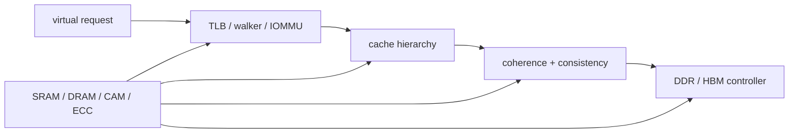

# Part 3 · Architecture › Memory

Memory is split by contract: local cache policy, address translation, distributed coherence/ordering, storage circuits, and package-level main memory.

## Subdomains

| Subdomain | Chapters | Contract it owns |
|---|---:|---|
| [Cache Hierarchy](01_Cache_Hierarchy/00_Index.md) | 2 | hit/miss concurrency, prefetch, replacement and shared-cache QoS |
| [Virtual Memory](02_Virtual_Memory/00_Index.md) | 2 | CPU/device translation, nested virtualization and invalidation |
| [Coherence and Consistency](03_Coherence_and_Consistency/00_Index.md) | 2 | authoritative copy and legal cross-core observation order |
| [Memory Technologies](04_Memory_Technologies/00_Index.md) | 1 | cells/arrays/ports/ECC/CAM and generated memory IP |
| [Main Memory](05_Main_Memory/00_Index.md) | 2 | DDR/HBM scheduling, bandwidth, RAS, package/thermal limits |

## Chapter map

| Chapter | Primary ownership |
|---|---|
| [Cache Microarchitecture](01_Cache_Hierarchy/01_Cache_Microarchitecture.md) | AMAT, associativity, nonblocking misses, writes and hierarchy |
| [Prefetching, Replacement, and QoS](01_Cache_Hierarchy/02_Prefetching_Replacement_and_QoS.md) | feedback-directed prediction, RRIP-like policy and end-to-end resource control |
| [TLB and Virtual Memory](02_Virtual_Memory/01_TLB_and_Virtual_Memory.md) | TLB reach, page walks, VIPT, superpages and shootdown |
| [Page Walkers, IOMMUs, and Virtualization](02_Virtual_Memory/02_Page_Walkers_IOMMUs_and_Virtualization.md) | nested walks, IOTLB/ATC, ATS/PRI, device isolation and invalidation |
| [Cache Coherence](03_Coherence_and_Consistency/01_Cache_Coherence.md) | stable/transient permissions, races, directories, safety/liveness |
| [Memory Consistency and Atomics](03_Coherence_and_Consistency/02_Memory_Consistency_and_Atomics.md) | SC/TSO/RVWMO reasoning, litmus tests, fences and atomic serialization |
| [Memory Arrays and Technologies](04_Memory_Technologies/01_Memory_Arrays_and_Technologies.md) | SRAM/DRAM cells, register files, compilers, ECC, CAM and emerging memory |
| [DDR Controller](05_Main_Memory/01_DDR_Controller.md) | DRAM state/timing, FR-FCFS, refresh, ECC and achieved bandwidth |
| [HBM and Advanced Memory Systems](05_Main_Memory/02_HBM_and_Advanced_Memory_Systems.md) | stacked channels, MLP, mapping, thermals, RAS and tiering |

## Reading paths

- **CPU load path:** TLB → Cache → Coherence → Consistency → DDR/HBM.
- **Accelerator/device path:** IOMMU → QoS/I/O coherence → HBM.
- **Shared-cache performance:** Cache → Prefetch/Replacement/QoS → Coherence → NoC → main memory.
- **Correctness review:** Consistency/Atomics and Cache Coherence as a pair.

---

⬅ [CPU](../02_CPU/00_Index.md) · [Architecture Contents](../00_Index.md) · next ➡ [Interconnect](../04_Interconnect/00_Index.md)
