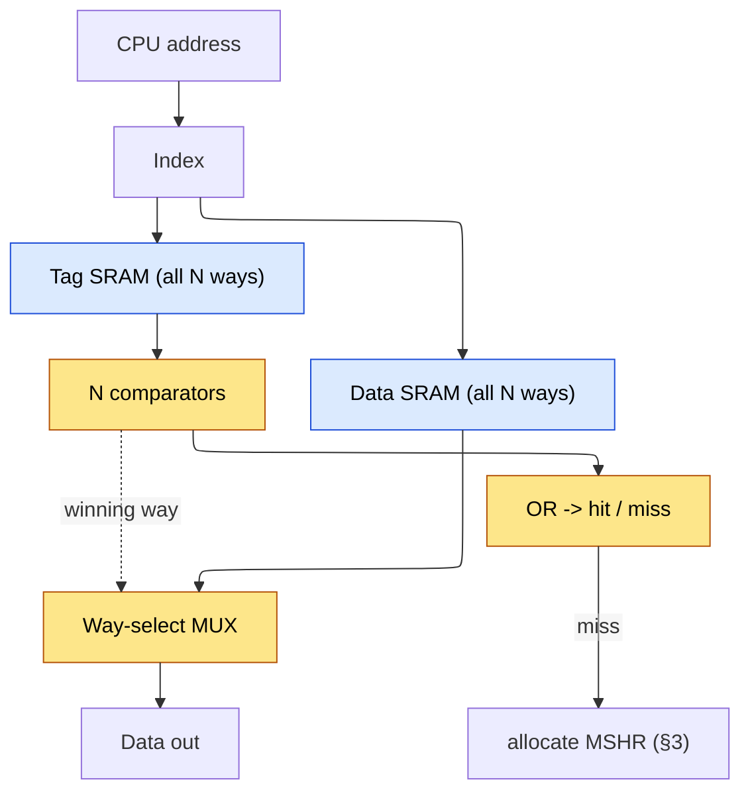

# Cache Microarchitecture — Locality, AMAT, and Controller Design

> **Prerequisites:** [CPU_Architecture](../../02_CPU/01_Core_Foundations/01_CPU_Architecture.md) (pipeline, memory hierarchy, the AMAT baseline of its §7), [Memory](../04_Memory_Technologies/01_Memory_Arrays_and_Technologies.md) (SRAM cell, DRAM organization), [OoO_Execution](../../02_CPU/03_Out_of_Order_Backend/01_OoO_Execution.md) (the instruction window that generates the memory-level parallelism §3 exploits).
> **Hands off to:** [Cache_Coherence](../03_Coherence_and_Consistency/01_Cache_Coherence.md) (stable/transient protocol states, races, directory sizing, atomics/DMA, and verification), [ACE_and_CHI](../../04_Interconnect/01_Protocols/02_ACE_and_CHI.md) (coherence messages at scale), [DDR_Controller](../05_Main_Memory/01_DDR_Controller.md) (the DRAM a last-level miss talks to), [TLB_and_Virtual_Memory](../02_Virtual_Memory/01_TLB_and_Virtual_Memory.md) (the translation in front of every access).

---

## 0. Why this page exists

A cache exists to fight one number: the gap between a core cycle (~0.2–0.3 ns) and a DRAM access (~60–100 ns). That gap — the **memory wall** — is 100–300 core cycles wide, long enough to drain any realistic instruction window and leave the machine idle. The out-of-order core ([OoO_Execution](../../02_CPU/03_Out_of_Order_Backend/01_OoO_Execution.md)) hides *some* of that latency behind a large window; the cache attacks the latency *itself*, and manages to do so cheaply only because real programs are not random.

Everything on this page is organized by one equation — **average memory access time (AMAT)** — and every structure is derived from *which term of AMAT it attacks*:

$$\text{AMAT} = t_{hit} + m \times t_{penalty}$$

Associativity and the hit-path circuit hold down $t_{hit}$; replacement and prefetch hold down the miss rate $m$; the MSHR (miss-status holding register) and non-blocking machinery hold down the *effective* $t_{penalty}$ by overlapping misses; the hierarchy turns $t_{penalty}$ itself into a smaller, nested AMAT; write policy and coherence keep all of it correct while spending the least bandwidth. Read the page as a campaign against three terms, not a catalogue of structures. Where the OoO page derived structures from a *dataflow* contract, this page derives them from an *arithmetic* one: **minimize AMAT subject to area, power, and a one-cycle timing budget.** By the end you should be able to whiteboard a set-associative controller and, more importantly, say *which knob moves which term and where each one stops paying*.

---

## 1. The organizing theory: locality, the memory wall, and AMAT

### 1.1 The locality bet

DRAM latency has barely moved in decades while core clocks raced ahead, so the memory wall widens every generation. A cache is a *bet* that the access stream, though it addresses gigabytes, actually concentrates in a small hot region over any short interval. That bet has two independent forms, and each dictates a piece of structure:

- **Temporal locality** — a byte touched now is likely touched again soon. *Consequence:* keep recently used data resident and evict by predicted reuse (§5).
- **Spatial locality** — the neighbours of a touched byte are likely touched soon. *Consequence:* move data in fixed **lines** (typically 64 B) so one miss pre-loads a whole neighbourhood, and prefetch the *next* neighbourhood before it is asked for (§7).

When the bet holds, a 32 KB array a thousand times smaller than DRAM captures 90–97 % of accesses at a few cycles each. The rest of the page is the machinery that makes placing and checking a line cheap enough that the bet pays.

### 1.2 AMAT: the equation the whole page optimizes

For a single level, AMAT is a hit that always happens plus a penalty that sometimes does. It is an **expected value**, and deriving it that way makes every later term precise. An access hits with probability $1-m$ and misses with probability $m$; on a hit it costs $t_{hit}$, and on a miss it costs the hit-detection time *plus* the trip to the next level, $t_{hit}+t_{penalty}$ — you must probe this cache and learn it missed before you can leave it. Taking the expectation,

$$\text{AMAT} = (1-m)\,t_{hit} + m\,(t_{hit}+t_{penalty}) = t_{hit} + m \times t_{penalty}$$

where $t_{hit}$ = hit access time (cycles), $m$ = miss rate (misses per access *to this level*), $t_{penalty}$ = extra cost of a miss (cycles to satisfy it from the next level). The cross-term cancels cleanly — which is precisely *why* $t_{penalty}$ is defined as the **extra** cost beyond the hit probe rather than the full next-level latency: the definition is chosen to collapse the expectation to two terms.

**The recursion.** The penalty is not a constant. A miss is served by the next level, which is itself a cache with its own AMAT, so $t_{penalty}^{(k)} = \text{AMAT}_{k+1}$. Substituting level by level unrolls the hierarchy:

$$\text{AMAT} = t_{L1} + m_{L1}\big(t_{L2} + m_{L2}\big(t_{L3} + m_{L3}\,t_{DRAM}\big)\big)$$

(worked numeric example: [CPU_Architecture §7](../../02_CPU/01_Core_Foundations/01_CPU_Architecture.md); full multi-level solve in §12.1). Multiplying out separates the **local** miss rate $m_{Lk}$ (misses per access *reaching* level $k$) from the **global** miss rate (misses per *CPU* access), which is the product of every local rate above:

$$\text{AMAT} = \underbrace{t_{L1}}_{\text{always}} + \underbrace{m_{L1}\,t_{L2}}_{\text{reach L2}} + \underbrace{m_{L1}m_{L2}\,t_{L3}}_{\text{reach L3}} + \underbrace{m_{L1}m_{L2}m_{L3}\,t_{DRAM}}_{\text{reach DRAM}}, \qquad \big(\text{level-}k\text{ contribution}\big) = \Big(\textstyle\prod_{j<k} m_{Lj}\Big)\,t_{Lk}$$

Three facts fall straight out of this form. First, AMAT is **additive across levels, but each level's contribution is itself a product** — a brilliant $t_{hit}$ is wasted if the miss term $m\,t_{penalty}$ dominates, and a huge last level is wasted if $m_{L1}$ is already tiny; you attack the term the decomposition says is largest, never uniformly. Second, the *local* rate $m_{Lk}$ is weighted by the product of every rate above it, so the *global* rate reaching DRAM can be minuscule even when the *local* last-level miss rate is large — a 20 % local L3 rate can become a 0.04 % global rate (§12.1), so its 200-cycle penalty contributes under 0.1 cycle. Third — the flip side — a *rare* last-level miss still hurts because that tiny global rate is multiplied by the enormous $t_{DRAM}$, so the last level is made huge to drive its *local* rate down. That tension is the whole reason the hierarchy exists.

Every mechanism on this page is a lever on one term. This table is the page's roadmap:

| AMAT term | What lowers it | Mechanism (section) |
|---|---|---|
| $t_{hit}$ | keep the hit path to one fast cycle; read fewer ways | associativity choice, one-/two-cycle path (§2), way prediction (§9) |
| $m$ (miss rate) | evict smarter; fetch before the miss; add homes | replacement (§5), prefetch (§7), associativity (§2) |
| $t_{penalty}$ (raw) | nest a smaller cache between core and DRAM | hierarchy design (§6) |
| $t_{penalty}$ (effective) | overlap independent misses so latencies hide | non-blocking + MSHR (§3) |
| (correctness / bandwidth budget) | spend the least traffic keeping copies consistent | write policy (§4), coherence (§8) |

The one term AMAT hides is **effective** penalty. A blocking cache pays $t_{penalty}$ in full on every miss; a non-blocking cache overlaps $k$ independent misses and pays roughly $t_{penalty}/k$. That factor $k$ — memory-level parallelism — is the single largest lever on the whole equation and the subject of §3.

### 1.3 The three C's: a vocabulary for the miss-rate term

$m$ is not one thing. Decomposing it names *which* mechanism can move it:

- **Compulsory** — the first-ever touch of a line; unavoidable except by prefetch (§7) or a larger line that pulls in more neighbours per miss (§1.1) — which is exactly why those two are its only attacks.
- **Capacity** — the working set exceeds the cache; only a bigger cache (or a smaller working set) helps. Associativity and replacement cannot.
- **Conflict** — the working set *fits* but too many hot lines map to one set and evict each other. This is the miss that **associativity** (§2) and **victim caches** (§6.3) exist to kill, and the only C that a placement change can remove.

**Making the split precise — reuse distance.** The three C's are not fuzzy categories; they are defined by one measurable quantity. For a reference to line $X$, its **reuse (stack) distance** $d$ is *one plus the number of distinct lines touched since $X$ was last referenced* — equivalently, $X$'s depth in a fully-associative LRU (least-recently-used) stack (MRU (most-recently-used) $=1$). By LRU's stack property (§5.2) a fully-associative cache of $C$ lines holds exactly the $C$ most-recently-used distinct lines, so

$$\text{a reference hits in a fully-associative LRU cache of size } C \iff d \le C.$$

That test classifies every miss unambiguously:

- $d = \infty$ (no previous reference) → **compulsory**;
- $d$ finite but $d > C$ (misses even fully-associative) → **capacity**;
- $d \le C$ (would hit fully-associative) yet misses in the *actual* set-associative cache → **conflict** — the reference's set held more than $N$ nearer-reused lines even though the cache as a whole had room.

So compulsory + capacity misses are *exactly* the misses of an idealized fully-associative LRU cache of the same size, and conflict misses are the **excess** the real organization adds (Hill & Smith's operational definition). One pass over a trace, histogramming $d$, therefore yields the miss rate at *every* capacity at once (§5.2) — which is why the reuse-distance curve is the workhorse of cache sizing.

Keep the three C's in hand through §2 and §5: associativity attacks conflict, replacement attacks conflict-plus-capacity-at-the-margin, prefetch attacks compulsory, and nothing but capacity attacks capacity.

### 1.4 The cache as a hardware hash table

To exploit spatial locality the cache stores fixed lines, so the low address bits are a **block offset** (which byte inside the line). To find a line in $O(1)$ without searching, the cache is a hardware hash table keyed by address: the **index** selects a set directly and the **tag** (the remaining high bits) is stored so a candidate can be *confirmed*. That decomposition is forced by "cheap to place, cheap to check" — nothing else about the field widths is a free choice:

$$\text{Address} = [\;\underbrace{\text{Tag}}_{\text{confirm}}\;|\;\underbrace{\text{Index}}_{\text{select set}}\;|\;\underbrace{\text{Offset}}_{\text{byte in line}}\;]$$

For a cache of capacity $C$, associativity $N$, line size $L$:

$$\text{sets} = \frac{C}{N\,L}, \quad \text{offset} = \log_2 L, \quad \text{index} = \log_2(\text{sets}), \quad \text{tag} = A - \text{index} - \text{offset}$$

*Worked geometry (32 KB, 4-way, 64 B lines, 32-bit address):* sets $= 32768/(4\cdot64) = 128$; offset $= 6$; index $= 7$; tag $= 32-7-6 = 19$. Each line carries $19$ tag $+\,1$ valid $+\,1$ dirty $= 21$ overhead bits against $512$ data bits — about **4 % storage overhead**, the price of being content-addressable rather than a flat array. The tag SRAM is roughly $25\times$ smaller than the data SRAM, and §2 turns that size asymmetry into a timing and a power lever.

### 1.5 The VIPT ceiling: how translation caps L1 geometry

Every access on a modern core carries a *virtual* address, but correctness demands a *physical* tag (two virtual pages may alias one physical frame). The translation that produces the physical bits ([TLB_and_Virtual_Memory](../02_Virtual_Memory/01_TLB_and_Virtual_Memory.md)) sits in series ahead of a physically-tagged cache — *unless* the cache is indexed with bits translation never changes, so index-and-read can run in parallel with the TLB. That is **virtually-indexed, physically-tagged (VIPT)**: index the set with low bits *now*, compare the physical tag when it arrives. The overlap mechanism and its synonym hazards are owned by [TLB_and_Virtual_Memory §6](../02_Virtual_Memory/01_TLB_and_Virtual_Memory.md); what belongs *here* is the geometric constraint it forces on cache size, because it is a fact about the index/offset split of §1.4.

Translation rewrites the page-number bits and leaves the **page offset** — the low $\log_2 P$ bits, $P$ = page size — untouched. For the index to be translation-invariant, every index *and* offset bit must lie within that untouched offset field:

$$\underbrace{\log_2 L}_{\text{offset}} + \underbrace{\log_2(\text{sets})}_{\text{index}} \;\le\; \log_2 P.$$

Substitute $\text{sets} = C/(N L)$ from §1.4; the line size $L$ cancels and the constraint collapses to a statement about capacity *per way*:

$$\log_2\!\frac{C}{N} \le \log_2 P \quad\Longrightarrow\quad \boxed{\;\dfrac{C}{N} \le P\;} \quad\Longleftrightarrow\quad C \le N\,P$$

where $C$ = capacity, $N$ = associativity, $L$ = line size, $P$ = page size. The reading is physical: one *way* (a column of $C/N$ bytes) must fit inside a single page, so that changing the page frame can never change which set is selected. *Worked number:* at the near-universal $P = 4\text{ KB}$ page with $N = 8$ ways, $C \le 8 \times 4\text{ KB} = \mathbf{32\ KB}$ — exactly why mainstream L1 caps at **32–64 KB** and why L1 capacity and associativity are chosen *together*, not independently. The two escapes drop straight out of $C \le NP$: **raise $N$** (16-way lifts the ceiling to 64 KB at a 4 KB page, paying the §2.1 hit-path cost) or **raise $P$** (Apple's 16 KB base page lifts it to $8\times16\text{ KB} = 128\text{ KB}$, which is how its 8-way L1D is that large). Overshoot the ceiling and index bits spill into the translated page number, so one physical line can land in two sets under two virtual addresses — the **synonym** problem the TLB page resolves with page colouring or the same enlarge-$N$/enlarge-$P$ levers.

---

## 2. Associativity: trading conflict misses against hit cost

A **direct-mapped** cache ($N=1$) gives every line exactly one home set. Two hot lines whose addresses collide on the same index then evict each other indefinitely — a **conflict miss** — while the rest of the cache sits idle. **Associativity** gives each set $N$ homes and is the single knob that trades conflict misses against the cost of a hit. It is the canonical "add homes to cut conflicts, pay comparators and mux delay" trade, and it recurs wherever an associative lookup sits on a critical path (the L2 TLB does it too, [TLB_and_Virtual_Memory](../02_Virtual_Memory/01_TLB_and_Virtual_Memory.md)).

### 2.1 The cost model and where the knee is

More ways cost on three axes at once, all in the hit path:

- **Comparators.** $N$ parallel tag comparators, one per way — area and energy linear in $N$.
- **Data energy.** Reading all $N$ data ways to have the winner ready wastes $(N-1)/N$ of the data-array read energy every hit (the waste §9 reclaims).
- **Access time.** The $N$-way select mux after the comparators lengthens $t_{hit}$, and at high $N$ it can push the hit out of a single cycle.

The benefit side has sharply diminishing returns. Write the miss rate as its three C's:

$$m(N) = m_{compulsory} + m_{capacity} + m_{conflict}(N), \qquad m_{conflict}(N)\to 0 \text{ as } N \text{ grows}$$

**Why $m_{conflict}\to 0$ — a pigeonhole / balls-in-bins argument.** The index hashes addresses onto $S = C/(NL)$ sets of $N$ frames each. A conflict miss is a *collision*: with $W$ simultaneously-hot lines spread across $S$ sets, any set that receives more than $N$ of them must evict a still-live line even while frames sit free in other sets — pure pigeonhole. Model the hash as uniform, so each set's load is $\approx\text{Poisson}(\lambda)$ with mean $\lambda = W/S$ hot lines per set. The fraction of hot references that are conflict-evicted is the expected per-set *overflow* past $N$, normalized by the load:

$$f_{conflict}(N) \approx \frac{\mathbb{E}\big[(X-N)^+\big]}{\lambda}, \qquad X\sim\text{Poisson}(\lambda),\ \ (x)^+ \equiv \max(x,0).$$

*Worked number* — a working set that exactly fills the cache, $W = S$ so $\lambda = 1$ hot line per set, sweeping associativity:

| $N$ | $\mathbb{E}[(X-N)^+]$ at $\lambda{=}1$ | conflict fraction |
|---|---|---|
| 1 (direct) | $e^{-1}=0.368$ | **37 %** |
| 2 | $3e^{-1}-1=0.104$ | **10 %** |
| 4 | $\approx 0.0045$ | **0.45 %** |
| 8 | $\approx 10^{-6}$ | **~0 %** |

The tail collapses faster than geometrically — each added way roughly squares the shrinking overflow — which *is* the "doubling $N$ ≈ doubling $C$" rule while conflicts remain, and the hard knee once they are gone. A fully-associative cache is the limit $S = 1$: there is no "wrong set" to collide in, so pigeonhole never bites, $f_{conflict}=0$ by construction, and only the compulsory + capacity misses of §1.3 survive. (Real streams are not uniformly hashed — a pathological power-of-two stride can pile every hot line into one set and keep conflicts alive past this estimate, which is exactly what the victim cache of §6.3 and skewed/hashed indexing target.)

Only the conflict term responds to $N$, and it falls roughly geometrically: the classic rule of thumb is that **doubling associativity cuts the miss rate about as much as doubling capacity** — but *only until conflict misses are gone*. Past that, $m$ is all compulsory-plus-capacity, which associativity cannot touch, so the curve flattens hard. That crossover is the knee, and for L1 data caches it sits at **4–8 ways**: enough to erase most conflict misses while keeping the compare-and-select network inside one fast cycle. Fully associative ($N = $ lines) removes conflict misses entirely but needs $O(N)$ comparators — affordable only for tiny structures (TLBs, victim caches). Real designs land at:

| Level | Typical $N$ | Why here |
|---|---|---|
| L1 D/I | 4–8 | conflict mostly gone; must fit a 1-cycle-ish hit path |
| L2 | 8–16 | latency-tolerant, so more ways to protect a larger footprint |
| L3 | 12–16 | huge, shared, latency already tens of cycles; ways are cheap relative to a miss |

### 2.2 The one-cycle hit path

Returning data in a single cycle forces tag lookup and data lookup to run **in parallel** on speculation: the index drives all $N$ tag SRAMs *and* all $N$ data SRAMs at once, the comparators pick the winner, and a mux steers the winning way out — the comparison result arrives just in time to select data that was already read.

The hit condition is just $\text{hit} = \bigvee_i (\text{tag}_{CPU} = \text{tag}_i)\wedge \text{valid}_i$. At 4 GHz a cycle is 250 ps and this whole chain — tag read, compare, mux — must fit inside it, which is exactly why $N$ cannot grow without bound and why the tag SRAM's smallness is precious: it resolves early enough to steer the data mux.

**The two-cycle (power) path.** Because reading all $N$ data ways wastes $(N-1)/N$ of the energy, latency-tolerant caches split the access: cycle 1 reads *only* the tags and finds the winning way; cycle 2 reads *only* that way's data. This spends the $(N-1)/N$ energy saving to buy one extra cycle of $t_{hit}$ — a trade worth taking at L2/L3 where the penalty already dwarfs one cycle, and even at L1 when frequency is very high (Apple's P-core L1D runs a two-cycle path). It is the same tag-first idea way prediction (§9) pushes one step further.

---

## 3. Non-blocking caches and the MSHR: buying memory-level parallelism

### 3.1 Why one miss must not stop the others

A **blocking** cache stalls the pipeline for the entire miss. At a 5 % L1 miss rate and 100-cycle penalty that is $0.05\times100 = 5$ wasted cycles per access — the machine spends half its life waiting. Hit-under-miss (keep serving hits while a miss is outstanding) is the obvious first fix, but the deep lever is **memory-level parallelism (MLP)**. DRAM *latency* is stubbornly fixed, but DRAM *bandwidth* lets many requests be in flight at once. If the cache can hold $k$ independent misses open simultaneously, their latencies overlap and the effective penalty collapses:

$$t_{penalty}^{\text{eff}} \approx \frac{t_{penalty}}{\min(k,\;N_{MSHR})}$$

Converting one serial miss into $k$ overlapped ones is the entire job — and it is exactly what forces the bookkeeping below: to keep $k$ misses alive while the core races ahead, the cache must *remember* $k$ misses' worth of state.

### 3.2 How many outstanding misses? Little's law again

The count is a bandwidth–delay product, the memory-system twin of the ROB sizing on the OoO page. If the core generates $\lambda_{miss}$ demand misses per cycle and each takes $L_{miss}$ cycles to return, then to never stall for want of a tracking slot:

$$N_{MSHR} \;\ge\; \lambda_{miss}\times L_{miss}$$

where $\lambda_{miss}$ = misses issued per cycle, $L_{miss}$ = miss latency.

**Deriving the bound (Little's law).** In steady state, misses are *born* at the same rate they *complete* — call it $\lambda_{miss}$ — and each outstanding miss occupies exactly one MSHR for its whole lifetime $L_{miss}$ (allocate on detect, free on fill). Little's law $L=\lambda W$ applied to the MSHR file as a queueing system gives the average number of simultaneously-occupied slots directly:

$$\bar{N}_{\text{occupied}} = \lambda_{miss}\times L_{miss}.$$

Provision *below* this and the file saturates: a new miss finds no free slot and the cache blocks *as if it were a blocking cache*, which throttles the actual issue rate back down to $N_{MSHR}/L_{miss}$. So $N_{MSHR}\ge \lambda_{miss}L_{miss}$ is the **no-self-throttle** condition — the memory-system twin of ROB/LSQ sizing on the OoO page, where the same law sets how far the window must reach to keep the machine fed.

**The bandwidth-saturation reading.** The identical law says what it takes to *fill the memory pipe*. To sustain bandwidth $B$ with $G$-byte lines, misses must complete at rate $\lambda = B/G$, so the outstanding count must reach

$$N_{MSHR} \ge \frac{B}{G}\times L_{miss} \quad(\text{a bandwidth–delay product, in units of lines}).$$

*Worked number* — hide a $L_{miss}=100\text{ ns}$ DRAM miss while saturating one DDR-class channel of $B=25.6\text{ GB/s}$ with $G=64\text{ B}$ lines: the completion rate is $\lambda = 25.6\times10^{9}/64 = 4.0\times10^{8}$ misses/s, so $N \ge 4.0\times10^{8}\times100\times10^{-9} = \mathbf{40}$ outstanding misses. That is why an aggressive L1D/L2 path exposes tens of MSHRs: at 100 ns and 64 B lines you need ~40 in flight *just to keep one channel busy*, and proportionally more for multi-channel HBM-class bandwidth. Equivalently, at 3 GHz that 100 ns is ~300 cycles, so the demanded MLP to cut the effective penalty to ~10 cycles (§3.1) is $\approx 30$ — the same order. But $k$ is not free to grow: the *independent* misses available to overlap are limited by how far the instruction window can run ahead, which the ROB caps ([OoO_Execution §3.2](../../02_CPU/03_Out_of_Order_Backend/01_OoO_Execution.md)). So MSHR count and window size are co-designed — an L1D that could track 40 misses is pointless behind a window that only ever exposes 8. This is why real MSHR counts track the level's realistic MLP, not the theoretical maximum:

| Level | MSHRs | What sets it |
|---|---|---|
| L1 I | 4–8 | few concurrent fetch streams |
| L1 D | 8–16 | independent loads the OoO window exposes |
| L2 | 16–64 | aggregates all L1 misses beneath it |
| L3 | 64–128+ | aggregates many cores |

Intel Skylake tracks ~10 load-buffer + 6 fill-buffer entries at L1D; Apple M1 L1D has ~14. The MSHR count *is* the level's MLP ceiling.

### 3.3 What one MSHR must remember — derived, not tabulated

An MSHR (miss status holding register) is the record that keeps one missed line "alive" from the cycle the miss is detected until its data returns and every waiting instruction is satisfied. Its contents are not an arbitrary field list — they are forced by the three jobs it must do:

1. **Route the fill back to its consumers.** The miss was triggered by one or more instructions now parked in the core. When the line returns dozens of cycles later it must know *who* to wake and *where* the bytes go — so the entry remembers the destination(s) and which words of the line each waiter needs. Without this the returning line is anonymous.
2. **Merge secondary misses so one line means one fill.** While a line is outstanding, other instructions may miss on the *same* line. Issuing a second fetch would waste bandwidth and risk two copies racing into the array, so a new miss is CAM-matched against outstanding line addresses: a hit **merges** (record another waiter) instead of allocating. This is *why* the entry is keyed by line address and holds a set of waiters rather than a single destination.
3. **Sequence the eviction the fill requires.** Installing the new line usually evicts a victim, and a dirty victim must be written back first. So the entry tracks the target way and whether the victim is dirty, letting the controller order writeback-before-fill without dropping the request.

So an MSHR is best read not as a row of fields but as **the per-miss continuation that lets the core forget a miss and be reminded, correctly, when it completes.** Its essential state is three things — *(line address, {waiters + their target words}, victim/way disposition)* — and each is a consequence of one job above. Storage is trivial (a 16-entry L1D MSHR file is a few hundred bytes against a 32 KB data array, ~1 % overhead); the interesting cost is the CAM match on every new miss, which is what keeps MSHR counts modest.

**Miss merging, concretely.** A primary miss (no match) allocates an entry, picks a victim, starts any writeback, and issues one fill. A secondary miss (match) just adds itself as a waiter — **no second fill** — and when the data lands, every merged waiter wakes in the same cycle. A **writeback buffer** (4–8 entries) then decouples the dirty eviction from the fill: the victim is copied out in one cycle and the fill issues immediately, so writeback drains in the background instead of serializing in front of every miss (turning a ~40-cycle write-then-fill into a ~21-cycle overlapped one). A **split-transaction** interconnect is the same idea on the bus — request and response carry a transaction ID so the line is not locked for its whole latency, without which none of this MLP is reachable.

One more effective-penalty cut hides here: the core stalls on *one word*, not the whole line. **Critical-word-first** returns the requested word ahead of the rest of the line and un-stalls the dependent instruction the moment it lands (early restart does the same without reordering the bus), so the experienced penalty is the latency to the critical word rather than to the full 64 B transfer — shaving the last few beats off every miss.

---

## 4. Write policy: when the cached and backing copies may diverge

Writes are where a cache stops being a transparent speed-up and starts making policy. A read only ever *copies* data that already exists below, so it can never make two levels disagree. A write *creates* a new value, so the cache must decide **when the cached copy and the backing copy are allowed to diverge** — and that decision splits into two orthogonal knobs, each trading **bandwidth and coherence simplicity against traffic, latency, and dirty-state bookkeeping**.

**Knob 1 — write miss: allocate or not.** *Write-allocate* fetches the line, then writes it (so subsequent writes to the same line hit); *no-write-allocate* pushes the store straight to the next level and skips the fetch. Write-allocate dominates in data caches because writes have spatial locality (zeroing a buffer, copying a struct) — fetching once amortizes the miss over many adjacent writes. No-write-allocate survives in write-through L1s and some I-caches where the fetched line would rarely be re-written.

**Knob 2 — write hit: through or back.** This is the divergence knob:

- **Write-through** propagates every store to the next level immediately. The backing copy is *never* stale, so coherence is trivial — but it spends one downstream write per store.
- **Write-back** modifies only the cached line and sets a **dirty** bit, deferring the downstream write until the line is evicted. Multiple writes to a line coalesce into one write-down, so it cuts write traffic by roughly the mean number of writes a line absorbs while resident:

$$\frac{\text{traffic}_{\text{through}}}{\text{traffic}_{\text{back}}} \;\approx\; \bar{w}_{\text{line}} \quad(\text{writes per line before eviction})$$

*Deriving the ratio.* Over a line's residency it absorbs $\bar{w}_{\text{line}}$ stores (and any number of loads, which neither policy sends downward). Write-through emits one downstream line-write *per store* → $\bar{w}_{\text{line}}$ writes; write-back emits the line downward **at most once**, on eviction, and only if it is dirty → $\le 1$ write. The ratio is therefore $\bar{w}_{\text{line}}:1$ exactly. *Worked number:* a core running 2 GIPS (billion instructions/s) with 20 % stores retires $0.4\times10^{9}$ stores/s; at 64 B/line with $\bar{w}_{\text{line}}=8$, write-through pushes $0.4\times10^{9}\times64 = 25.6\text{ GB/s}$ of write traffic — a whole DDR4-3200 channel spent on stores alone — while write-back pushes $25.6/8 = 3.2\text{ GB/s}$. The 22 GB/s reclaimed is why no high-performance level is write-through. For a hot, repeatedly-written line $\bar{w}_{\text{line}}$ is large, so write-back can cut write bandwidth by an order of magnitude. Its cost is bookkeeping and coherence: other caches may now hold stale copies, and the dirty bit, write buffer, and writeback path all exist to make deferral safe. Bandwidth wins decisively on modern chips, so **every high-performance level is write-back** — ARM Neoverse N2, Apple M-series, AMD Zen 4, Intel Golden Cove all use write-back L1D. Write-through appears only in simple embedded cores and a few L1s that prize coherence simplicity over bandwidth.

A small **write buffer** (4–16 entries at L1) hides the downstream write latency from the core and **merges** repeat writes to the same line — 2–8× traffic reduction on sequential stores — so the CPU continues the moment the buffer accepts the entry rather than when the next level acknowledges.

---

## 5. Replacement: predicting re-reference distance

Associativity creates a choice it cannot dodge: when a miss lands in a set whose $N$ ways are all valid, exactly one resident line must be evicted. The *optimal* choice (Belady's MIN) evicts the line whose next reference is **furthest in the future** — but the future is unknown, so **every real policy is a predictor of re-reference distance built from past behaviour.** Each policy is defined precisely by the state it keeps to make that prediction and the cost of updating that state on *every hit*. Read them as points on one curve — **prediction accuracy vs state-and-update cost**:

- **Recency (LRU / PLRU (pseudo-LRU))** bets the least-recently-used line has the most distant reuse. Exact LRU must store a total order of the ways — $\lceil\log_2 N!\rceil$ bits per set, rewritten on every access ($5$ bits at 4-way, **45 bits at 16-way** — why exact LRU dies past 8-way). PLRU approximates the order with a binary tree in $N-1$ bits, trading a little accuracy for a lot less state. The kept state *is* the recency order.
- **Insertion age (FIFO)** keeps just a set pointer ($\lceil\log_2 N\rceil$ bits) and ignores hits entirely — cheapest, but it cannot tell a hot line from a cold one and is exposed to **Belady's anomaly** (more ways can *raise* its miss rate).
- **Re-reference prediction (RRIP / SHiP (Signature-based Hit Predictor))** keeps a small $M$-bit counter per line estimating *how soon* it will be reused, not merely the order. New lines are inserted as "distant" so a one-touch streaming line can be evicted first and kept from flushing the working set — the **scan resistance** that pure recency lacks. SHiP sharpens the insertion guess with a PC-indexed history of which fetches turned out reusable.
- **None (Random)** keeps zero state. It wins only because it never *systematically* evicts the next-needed line, so it sidesteps the exact pathology that wrecks LRU below.

### 5.1 Why recency thrashes, and why distance prediction survives

The failure mode that motivates everything past LRU is cyclic access to a working set just larger than the cache. Take a 4-way set cycled as **A B C D E A B C D E …** (five hot lines, four ways). LRU always evicts the line needed *soonest*:

| step | resident (MRU→LRU) | result |
|---|---|---|
| A B C D | D C B A | fill (compulsory) |
| E | E D C B | **evict A** |
| A | A E D C | miss, **evict B** |
| B | B A E D | miss, **evict C** |

Every subsequent access misses — **0 % hit rate after warm-up**, the worst possible outcome for data that *fits* to within one line. FIFO thrashes identically. **Random** breaks the cycle statistically (it sometimes spares the soon-needed line, ~40–50 % hits here), and **RRIP** does it deterministically: a scanned-once line ages to "evict me" while a re-referenced line resets to "keep," so the working set survives. This is the whole reason scan-resistant policies exist, and why they buy **5–15 % lower miss rate than LRU on mixed streaming-plus-reuse workloads** (BRRIP reaches 10–20 % on large LLCs (last-level cache)). On clean LRU-friendly locality the policies converge — the extra state earns nothing — which is exactly the accuracy-vs-cost trade the list above predicts.

| Policy | State per 4-way set | Anti-thrash / scan-resistant | HW cost |
|---|---|---|---|
| LRU (exact) | 5 bits ($\log_2 N!$) | no | high (matrix / shift) |
| PLRU (tree) | 3 bits ($N-1$) | no | low (mux tree) |
| FIFO | 2 bits ($\log_2 N$) | no | lowest (pointer) |
| Random | 0 bits | probabilistic | minimal (PRNG) |
| SRRIP (2-bit) | 8 bits ($M\!\cdot\!N$) | yes | low (counters) |
| BRRIP / SHiP | 8 bits + policy/history | strong | low–moderate |

Design landing: L1/L2 use **PLRU** (cheap, and their footprints are LRU-friendly); large shared **L3 uses RRIP-family** policies because they see the scans and streaming that thrash LRU.

### 5.2 The two theorems under the column: Belady's bound and LRU's stack property

Two results sit beneath the whole replacement story — an *upper* bound on what any policy can achieve, and the property that makes LRU well-behaved.

**Belady's MIN is optimal — the exchange argument.** MIN evicts the line whose next use is furthest away. *Proof no policy beats it:* take any policy $P$ and the first eviction at which it diverges from MIN — there $P$ evicts a line $a$ whose next use is *sooner* than the line $b$ MIN would evict. Build $P'$ identical to $P$ but evicting $b$ instead of $a$ at that step. Because $b$ is not referenced until after $a$, across the interval up to $a$'s next use $P'$ never needs $b$, so it takes **no extra miss** there — and it *saves* the miss $P$ suffers when $a$ is re-referenced. Each such exchange transforms $P$ one step toward MIN without ever raising the miss count, so MIN is optimal. MIN is unimplementable (it needs the future), but it is the **bound** every real policy is scored against, and the gap to it is precisely the value lost by predicting reuse from the past instead of knowing it.

**LRU's stack property (inclusion).** Order all lines by time of last reference. After *any* access sequence an LRU cache of $C$ lines holds exactly the $C$ most-recently-used distinct lines, so its contents are always a **subset** of a larger cache's on the same stream:

$$\text{contents}(C) \subseteq \text{contents}(C') \quad \forall\, C < C'.$$

Two consequences make LRU special. First, **monotonicity**: every hit in the small cache is a hit in the large one, so miss rate is non-increasing in size — LRU can never suffer **Belady's anomaly** (FIFO can, because insertion order is not a nested ordering). "Bigger is monotonically better" is not an empirical hope for LRU; it is a theorem. Second, this is the very property that makes the reuse-distance test of §1.3 exact — a reference hits iff its stack distance $d\le C$ — so a single histogram of $d$ yields the miss curve for *all* sizes in one trace pass (Mattson's stack simulation).

**Why pseudo-LRU is good enough.** Exact LRU keeps $\lceil\log_2 N!\rceil$ bits of true order per set, rewritten on every hit; tree-PLRU keeps one bit per internal node of a binary tree over the $N$ ways ($N-1$ bits) and, on a hit, flips only the $\log_2 N$ nodes on the path to point *away* from the just-used way. It never reconstructs the exact order — it records, at each node, only which *half* was used less recently — so its victim is provably "an old line," not necessarily "the oldest." The approximation costs little because eviction only needs to *avoid the most-recently-used* lines, not to rank the cold ones: PLRU protects the hot half at every tree level, which is where nearly all of LRU's benefit lives. The result is $O(\log N)$ update in $N-1$ bits against LRU's $O(N)$ update in $\log_2 N!$ bits, for a miss-rate penalty usually under a few percent — the trade the §5 table prices, and the reason L1/L2 ship PLRU.

---

## 6. The cache hierarchy: recursive AMAT and inclusion policy

### 6.1 Why more than one level

A single cache cannot be both fast and large — $t_{hit}$ grows with capacity (taller arrays, longer wires). The hierarchy resolves the tension by nesting: each level is a point on the capacity-latency curve, and the recursive AMAT of §1.2 is what a three-level split is *for* — a small fast L1 catches most accesses, a mid L2 catches its misses at moderate cost, a huge slow L3 catches the rest before the cliff to DRAM. The rare L3 miss still hurts because it is multiplied by $t_{DRAM}$, which is why last levels reach tens of MB.

| Parameter | L1 I/D | L2 | L3 |
|---|---|---|---|
| Size | 32–64 KB | 256 KB–1 MB | 2–64 MB |
| Associativity | 4–8 | 8–16 | 12–16 |
| Hit latency | 3–4 cyc | 8–14 cyc | 30–50 cyc |
| Private / shared | private | private or shared | shared |

*Cache-adjacent compute lives on the same bandwidth.* Units like Apple AMX and Intel AMX sit next to the load/store path and stream tiles from L2; because a 16×16 FP16 tile is 512 B (8 lines), their sustained throughput is bounded by **L2 bandwidth and prefetch, not the multiplier** — the general rule that near-cache compute is a bandwidth problem, not a FLOP problem.

### 6.2 Inclusion: the duplication-versus-probe-cost curve

Inclusion answers one question: **when a line lives in a private cache, must the shared cache keep a copy too?** The answer is forced by how a multicore *finds* lines for coherence, and it is a direct trade between wasted capacity and probe cost.

- **Inclusive** — the outer level is a superset of the inner ones. A miss in the outer level then *proves* no inner cache holds the line, so a coherence probe stops at one place. The shortcut is paid for by storing every private line twice: effective outer capacity shrinks by roughly the aggregate inner-cache size. *Used by Intel Nehalem (2008) through Skylake (2017), IBM Power.*
- **Exclusive** — no duplication, so effective capacity is the *sum* of the levels ($C_{L2}+C_{L3}$). But the outer level is no longer authoritative, so a probe must reach every private cache. Evicted inner lines are *pushed* outward (the outer level is a victim cache). *Used by AMD Zen.*
- **Non-inclusive (NINE)** — the outer level *may* hold a line that a private cache also holds, but need not. Best capacity efficiency, but it can neither prove absence (like inclusive) nor guarantee it (like exclusive), so it needs a **snoop filter**: a tag-only directory in the outer controller that records which cores may hold each line. That buys the inclusive one-lookup probe **without** paying the inclusive capacity tax — tag storage, not data storage — at the cost of **back-invalidations** when the outer level evicts a line a private cache still holds. *Intel switched to non-inclusive at Ice Lake Server (2020) as core counts passed ~28; Apple/ARM Neoverse also non-inclusive.*

The three are three points on one curve: pay in duplicated capacity (inclusive) or in probe breadth (exclusive), or add a small snoop filter to buy the cheap probe without the duplication (NINE). High-core-count server chips overwhelmingly chose the last, because at 32+ cores the inclusion capacity tax became prohibitive while a snoop filter stays small.

### 6.3 Victim cache

A tiny (4–16 entry) fully-associative buffer that catches lines just evicted from a low-associativity L1 and is probed in parallel with L2. Because it re-homes exactly the lines that lost a conflict, it recovers the conflict misses §2 could not afford more ways to prevent — a cheap targeted patch on the one C associativity attacks (Jouppi, 1990).

---

## 7. Prefetching: converting misses to hits before they stall

Everything so far reacts to a miss. Prefetch attacks the miss rate $m$ *ahead of time* — it predicts a future access and fetches the line before the demand arrives, converting a compulsory or capacity miss into a hit. It is a bet on address predictability, and like every bet it is governed by three quantities in tension:

$$\text{Accuracy} = \frac{\text{useful prefetches}}{\text{total prefetches}}, \qquad \text{Coverage} = \frac{\text{useful prefetches}}{\text{total misses}}$$

Accuracy guards against **pollution** (a wrong prefetch evicts a useful line and wastes bandwidth); coverage measures how many real misses were caught. Pushing coverage up (fetch more, further ahead) tends to drag accuracy down — the central prefetch trade — and both are bounded by **timeliness**: the line must arrive *before* it is demanded but not so early it is evicted first. The distance to run ahead is set by how long a miss takes relative to how fast the program consumes lines:

$$\text{prefetch distance} \;=\; \frac{L_{miss}}{\text{cycles between accesses}}$$

*Worked number (distance).* If a miss takes $L_{miss}=100$ cycles and the loop touches a new line every 5 cycles, the prefetcher must run $100/5 = 20$ lines ahead to be *timely*; fetch only 4 ahead and the line is still ~80 cycles out when demanded (late — partial benefit), fetch 200 ahead and it may be evicted before use (early — wasted, and polluting). Timeliness is a *window*, not a target.

*The pollution trade, quantified.* A prefetch is worth issuing only if its expected benefit beats its expected harm. With accuracy $a$ (fraction useful), a useful prefetch saves $\approx t_{penalty}$; a useless one wastes bandwidth and, with probability $\rho$, evicts a live line that is then re-missed at cost $t_{penalty}$. Net benefit per prefetch $\approx a\,t_{penalty} - (1-a)\,\rho\,t_{penalty} = t_{penalty}\big(a - (1-a)\rho\big)$, so prefetching pays only while

$$a > \frac{\rho}{1+\rho}.$$

For a small, hot L1 a wrong prefetch is very likely to evict something live ($\rho \to 1$), pushing break-even toward $a > 0.5$ and — once the wasted bandwidth is added — to the **>90 %** target of the table; a large L2 with spare capacity has $\rho \ll 1$, so **70–85 %** already pays. This is the accuracy-vs-pollution trade as an inequality, and the pollution term $(1-a)\rho$ is exactly what makes coverage-chasing (fetch more, further ahead) self-defeating once it drags $a$ below break-even.

The predictor menu is a **predictability-vs-cost** curve, mirroring the replacement curve:

- **Next-line / stream** — assume sequential line access; cheapest, catches `memcpy`, scans, scanlines. Cannot handle non-unit strides. Usually at **L2**, where it works on line addresses without needing a PC.
- **Stride** — track a per-instruction constant stride ($\Delta = A_n - A_{n-1}$, confirmed over two observations), catching array and struct-field walks of any stride. Indexed by **PC** so two instructions walking the same array in opposite directions do not alias — which is why it lives at **L1**, the only place the PC is available.
- **Correlation (delta / Markov)** — record sequences of deltas or miss-address successors, catching irregular-but-repeating patterns (array-of-structs, and pointer-chasing where the "stride" is the pointer value itself). Highest coverage on hard patterns, paid for in large history tables and cold-start latency.

Nothing catches truly random access (hash probes, unstructured graph walks) — those need software prefetch or algorithmic change. Real designs stack a **PC-indexed stride prefetcher at L1** with a **stream/correlation prefetcher at L2**, and because a wrong prefetch pollutes a *small* L1 harder than a large L2, accuracy targets are **>90 % at L1** but a relaxed **70–85 % at L2**. Aggression is then throttled dynamically: if measured accuracy or demand latency degrades, the prefetcher cuts its degree and yields MSHRs to demand traffic (a demand miss must always outrank a prefetch, and prefetch may never take the last MSHR).

---

## 8. Coherence: the conceptual story

*Scope: the idea and where it lands in a cache. The architectural stable-state contract lives in [CPU_Architecture §8](../../02_CPU/01_Core_Foundations/01_CPU_Architecture.md); the full controller—transient states, message traces, races, directory formats, false sharing, atomics/DMA, safety/liveness, and verification—lives in [Cache_Coherence](../03_Coherence_and_Consistency/01_Cache_Coherence.md); the fabric realization lives in [ACE_and_CHI](../../04_Interconnect/01_Protocols/02_ACE_and_CHI.md).*

With private per-core caches, one core's write can leave another's cached copy stale. A coherence protocol enforces one invariant — **single-writer / multiple-reader (SWMR)**: for any line, at any instant, *either* exactly one cache may write it *or* any number may read it, never both. Everything else is mechanism to maintain that invariant while spending the least bus traffic.

**Why MESI's four states are the minimum.** The states are not a menu; they are the answers to the questions a cache must resolve *without* a bus transaction on the common case:

- *Is my copy usable at all?* → **Invalid** vs the rest.
- *Have I modified it, so I owe a writeback?* → **Modified** (dirty) carries that obligation.
- *Am I the only holder, so I may write without telling anyone?* → **Exclusive** (clean, sole copy) vs **Shared** (clean, possibly-copied).

A plain MSI protocol lacks E, so a core loading then writing *private* data must still broadcast an upgrade — pure overhead. The **E state's silent M-upgrade** removes it: a load that finds no other copy enters E and a following write flips to M with **zero bus traffic**, eliminating 20–50 % of coherence transactions on the private-data-heavy common case. That is the entire reason E exists.

**MOESI's O state** is a bandwidth optimization for sharing dirty data. In MESI, when a modified line is read by another core, both drop to Shared and the value is written back to memory — a memory write on every producer-consumer handoff. The **Owned** state lets the original holder stay dirty-but-shared and *supply the line directly* to future readers, deferring the memory write until it finally evicts. AMD uses MOESI for exactly this producer-consumer traffic; the cost is one extra state bit (2→3).

**Snoop vs directory** is the scaling trade. Snooping broadcasts every coherence action to every cache — simple, but traffic grows with core count and saturates a shared bus past ~16 cores. A **directory** instead records per-line which cores hold a copy and sends *targeted* messages: a write to a line shared by $K$ cores costs $2(K-1)$ messages (invalidate + ack), so a hot variable shared across 64 cores can cost ~126 messages on a single write — expensive, but far below broadcasting to all. Directories are therefore standard past ~16 cores and underpin the mesh interconnects of modern servers.

---

## 9. Cache power: reducing the energy of the hit path

Hit energy is dominated by reading the tag and data arrays, and a set-associative hit reads $N$ data ways to use one — the $(N-1)/N$ waste of §2. The power techniques all reclaim that waste by trading a little latency or accuracy for energy, and they are the same tag-first idea at different aggressions:

- **Way prediction** — a small predictor (PC- or address-hashed) guesses the hitting way, and only that one data SRAM is read: $1/N$ of the data energy at a single cycle. A wrong guess (typically 5–15 %) falls back to reading the rest in a second cycle. Used in ARM Cortex-A L1D and Intel L1I.
- **Sequential (tag-first) access** — the two-cycle path of §2.2: read tags, then only the winning data way, saving $(N-1)/N$ unconditionally for one extra cycle. The default for L2/L3.
- **Drowsy lines** — lower the supply voltage of not-recently-accessed lines to a retention level; data survives but a wake (1–2 cycles) is needed to read at speed. Cuts L2 leakage 40–60 % at <1 % performance loss.
- **Way gating** — disable whole ways when the working set is small, trading capacity for leakage; used dynamically on large L3s under light load.

The first two attack dynamic energy (fewer arrays read per hit), the last two attack leakage (fewer arrays powered) — a clean split that maps onto the two halves of the CMOS power budget ([CMOS_Fundamentals](../../../00_Fundamentals/01_CMOS_Fundamentals.md)).

---

## 10. Quality of service: partitioning a shared last level

A shared L3 creates a **noisy-neighbour** problem: a streaming workload (an LLM inference server, a `memcpy`-heavy job) can evict a co-runner's working set through ordinary conflict misses and degrade it 20–50 %. Partitioning restores isolation, and the two shipping mechanisms sit at different points on a **granularity-vs-utilization** trade:

- **Intel CAT** (Cache Allocation Technology) assigns each class-of-service a bitmask of L3 **ways** it may allocate into. Simple and cheap, but way-granular: a class gets $k/N$ of the cache in whole-way steps whether or not its working set fits, so capacity can be stranded.
- **ARM MPAM** (Memory-system resource Partitioning And Monitoring) partitions by **fraction/bytes** per partition ID (up to 256), tracks occupancy in hardware, and extends the same mechanism to **DRAM bandwidth**. Finer control and unified with bandwidth, at more implementation cost.

The trade is isolation granularity against overall utilization — coarse way-partitioning wastes capacity when allocations misfit; fine partitioning tracks occupancy at the cost of more control hardware. Both matter increasingly for cloud and edge AI, where a large-working-set model shares an LLC with latency-sensitive services.

---

## 11. Numbers to memorize

| Parameter | L1 I | L1 D | L2 | L3 | DRAM |
|---|---|---|---|---|---|
| Size | 32–64 KB | 32–64 KB | 256 KB–1 MB | 2–64 MB | 8–128 GB |
| Associativity | 4–8 | 4–8 | 8–16 | 12–16 | — |
| Line size | 64 B | 64 B | 64–128 B | 64–128 B | — |
| Hit latency | 3–4 cyc | 3–4 cyc | 8–14 cyc | 30–50 cyc | 100–300 cyc |
| Miss rate (SPEC) | 1–3 % | 5–10 % | 0.5–2 % | <0.5 % | — |
| MSHRs | 4–8 | 8–16 | 16–64 | 64–128+ | — |
| Write policy | — | write-back | write-back | write-back | — |

| Quantity | Value | Why (section) |
|---|---|---|
| L1D AMAT | 1.5–3.0 cyc | $t_{hit}+m\,t_{penalty}$ (§1.2) |
| Full-hierarchy AMAT | 5–15 cyc | recursive AMAT (§1.2, §6.1) |
| Storage overhead (tag+valid+dirty) | ~4 % | content-addressability (§1.4) |
| Data-energy waste per set-assoc hit | $(N-1)/N$ | read all ways (§2.1, §9) |
| LRU state / set | $\lceil\log_2 N!\rceil$ (5 b @4-way, 45 b @16-way) | recency order (§5) |
| PLRU state / set | $N-1$ bits | tree approximation (§5) |
| RRIP miss-rate win vs LRU | 5–15 % (BRRIP 10–20 % on LLC) | scan resistance (§5.1) |
| E-state coherence-traffic saving | 20–50 % | silent private-write (§8) |
| MESI / MOESI state bits | 2 / 3 | minimal state (§8) |
| Directory msgs per write to $K$-shared line | $2(K-1)$ | targeted invalidation (§8) |
| Prefetch accuracy target | >90 % L1, 70–85 % L2 | pollution cost (§7) |
| Way-prediction miss rate | 5–15 % | 1-cycle energy bet (§9) |
| Drowsy leakage saving | 40–60 % | retention voltage (§9) |
| Write buffer depth (L1) | 4–16 | hide write latency (§4) |
| DDR4-3200 / DDR5-5600 BW | 25.6 / 44.8 GB/s per channel | the $t_{DRAM}$ backing store |
| VIPT L1 ceiling | $C \le N\times P$ (32 KB @ 8-way/4 KB) | index must be translation-invariant (§1.5) |
| Reuse-distance hit test | hit iff $d \le C$ (fully-assoc LRU) | defines capacity vs conflict (§1.3, §5.2) |
| Conflict fraction vs assoc | 37 / 10 / 0.5 % @ $N=$1/2/4 | balls-in-bins collapse (§2.1) |
| MSHRs to saturate one channel | ~40 (100 ns · 64 B · 25.6 GB/s) | bandwidth–delay product (§3.2) |
| Optimal replacement bound | Belady MIN (evict furthest reuse) | ceiling real policies chase (§5.2) |
| Prefetch break-even accuracy | $a > \rho/(1+\rho)$ | benefit vs pollution (§7) |

**Memory hierarchy latencies** (why the last level must be huge): L1 3–4 · L2 8–14 · L3 30–50 · **DRAM 100–300 cycles** — the $t_{DRAM}$ that every miss rate is multiplied by in §1.2.

---

## 12. Worked problems

**1 — Multi-level AMAT (which term dominates).** $t_{L1}=4$, $m_{L1}=0.10$; $t_{L2}=15$, $m_{L2}=0.02$; $t_{L3}=40$, $m_{L3}=0.20$; $t_{DRAM}=200$ (cycles; local miss rates). Then

$$\text{AMAT}=4+0.10\big(15+0.02(40+0.20\cdot200)\big) = 4+0.10(15+0.02\cdot80)=4+0.10\cdot16.6 = 5.66\text{ cyc.}$$

Multiply out into per-level contributions $(\prod_{j<k}m_{Lj})\,t_{Lk}$ (§1.2) to see *where the 5.66 lives*: L1 $=4$ (70.7 %), L2 $=0.10\cdot15=1.5$ (26.5 %), L3 $=0.10\cdot0.02\cdot40=0.08$ (1.4 %), DRAM $=0.10\cdot0.02\cdot0.20\cdot200=0.08$ (1.4 %). The DRAM term is tiny *not* because $t_{DRAM}$ is small — it is 200 cycles — but because the **global** rate reaching DRAM is $0.10\cdot0.02\cdot0.20 = 0.0004$ (0.04 %), the product of three local rates; the hierarchy has defanged a 20 % *local* L3 miss rate into a 0.04 % *global* one. Drop L2/L3 entirely so L1 misses go straight to DRAM and $\text{AMAT}=4+0.10\cdot200 = 24$ cyc — **4.2× worse**, the whole justification for the hierarchy in one number.

**2 — Sizing MSHRs for a target MLP (Little's law).** A core issues $\lambda_{miss}=0.2$ demand misses/cycle to DRAM at $L_{miss}=180$ cyc. To never stall for a tracking slot, $N_{MSHR}\ge 0.2\times180 = 36$. But if the OoO window only exposes ~10 independent misses at once, effective MLP caps at 10 and the extra MSHRs sit idle — so an L1D of ~12–16 MSHRs is matched to its window, and $t_{penalty}^{\text{eff}}\approx 180/10 = 18$ cyc instead of 180. Overlap, not depth, bought the 10×.

**3 — Write-through vs write-back traffic.** A loop writes a 64 B line 8 times before it is evicted. Write-through issues 8 downstream writes; write-back issues 1 (the dirty eviction). Traffic ratio $\bar{w}_{\text{line}} = 8\times$ — and across a working set of such lines this is the order-of-magnitude bandwidth gap that makes every modern level write-back (§4).

**4 — Associativity knee.** Going 2-way→4-way removes most remaining conflict misses (say $m$: 6 %→4.5 %); 4→8 removes a little more (4.5 %→4.0 %); 8→16 barely moves it (4.0 %→3.9 %) because what is left is compulsory+capacity, which associativity cannot touch (§1.3). The marginal miss reduction per doubling collapses while comparator/mux cost keeps rising linearly — which is exactly why L1 stops at 4–8 ways (§2.1). The Poisson balls-in-bins model of §2.1 predicts the shape: conflict fraction $37\%\to10\%\to0.45\%$ across $N=1,2,4$ at a full working set.

**5 — VIPT ceiling (why L1 stops at 32 KB).** A VIPT L1D must keep index+offset inside the 4 KB page offset (12 bits). At 64 B lines (6 offset bits) and 8-way, $C\le N\cdot P = 8\times4\text{ KB}=32\text{ KB}$: sets $=32768/(8\cdot64)=64$, so index $=6$ bits and offset+index $=6+6=12$ — exactly the page offset, sitting on the ceiling. Want 64 KB at 8-way with the same 4 KB page? Index needs 7 bits, offset+index $=13>12$: one bit spills into the translated VPN and breaks VIPT. The two legal fixes: go **16-way** ($C\le16\times4\text{ KB}=64\text{ KB}$) or enlarge the page to **8 KB** ($8\times8\text{ KB}=64\text{ KB}$). This is the constraint that couples L1 size, associativity, and page size (§1.5; full treatment in [TLB_and_Virtual_Memory §6](../02_Virtual_Memory/01_TLB_and_Virtual_Memory.md)).

**6 — Reuse distance classifies a miss.** A stream re-references line $X$ after touching 40 distinct other lines, so its stack distance is $d=41$ (§1.3). In a 32-line fully-associative LRU cache ($C=32$): $d=41>32$ → **capacity** miss, unavoidable even by the ideal cache. In a 64-line cache: $d=41\le64$ → hit. If a *real* 64-line, 2-way cache still misses on $X$, that extra miss is **conflict** — $X$'s set held two nearer-reused lines — recoverable by more ways or a victim cache (§6.3), not by more total capacity. One number, $d$, named both the miss type and the only lever that removes it.

---

## Cross-references

- **Down the stack (what this is built from):** [Memory](../04_Memory_Technologies/01_Memory_Arrays_and_Technologies.md) (the SRAM cell and DRAM array behind every latency here), [CMOS_Fundamentals](../../../00_Fundamentals/01_CMOS_Fundamentals.md) (the FO4 budget and leakage that bound §2's hit path and §9's power techniques), [DDR_Controller](../05_Main_Memory/01_DDR_Controller.md) (the $t_{DRAM}$ and bandwidth a last-level miss actually pays).
- **Up the stack (what builds on this):** [OoO_Execution](../../02_CPU/03_Out_of_Order_Backend/01_OoO_Execution.md) (the LSQ and window that generate the MLP §3 exploits and set the MSHR ceiling via the same Little's law), [TLB_and_Virtual_Memory](../02_Virtual_Memory/01_TLB_and_Virtual_Memory.md) (translation in front of the index/tag split; §1.5 derives the VIPT ceiling $C\le N\!\times\!P$, its §6 owns the overlap mechanism and synonyms), [Cache_Coherence](../03_Coherence_and_Consistency/01_Cache_Coherence.md) (the full controller this page motivates), [ACE_and_CHI](../../04_Interconnect/01_Protocols/02_ACE_and_CHI.md) (the transport and scaling of that controller's messages), [CPU_Architecture §8](../../02_CPU/01_Core_Foundations/01_CPU_Architecture.md) (the architectural contract), [Performance_Modeling_and_DSE](../../01_Modeling/01_Performance_Analysis/01_Performance_Modeling_and_DSE.md) (where AMAT, the reuse-distance miss curve, and MLP feed design-space exploration), [Xiangshan_CPU_Design](../../02_CPU/04_Core_Case_Studies/01_Xiangshan_CPU_Design.md) (a complete open core composing this hierarchy).
- **Adjacent:** [CPU_Architecture](../../02_CPU/01_Core_Foundations/01_CPU_Architecture.md) (the AMAT baseline and pipeline this deepens).

---

## References

1. Hennessy, J. L. and Patterson, D. A., *Computer Architecture: A Quantitative Approach*, 6th ed., Morgan Kaufmann, 2019. Ch. 2 (memory hierarchy, AMAT, the three C's) and Ch. 5 (coherence).
2. Kroft, D., "Lockup-Free Instruction Fetch/Prefetch Cache Organization," *ISCA*, 1981. The original MSHR / non-blocking cache.
3. Jouppi, N. P., "Improving Direct-Mapped Cache Performance by the Addition of a Small Fully-Associative Cache and Prefetch Buffers," *ISCA*, 1990. Victim cache (§6.3).
4. Jaleel, A., Theobald, K. B., Steely, S. C., and Emer, J., "High Performance Cache Replacement Using Re-Reference Interval Prediction (RRIP)," *ISCA*, 2010. The distance-predictor view of §5.
5. Sorin, D. J., Hill, M. D., and Wood, D. A., *A Primer on Memory Consistency and Cache Coherence*, 2nd ed., Morgan & Claypool, 2020. SWMR invariant and MESI/MOESI derivation (§8).
6. Intel Corp., "Intel 64 and IA-32 Architectures Optimization Reference Manual," Order 248966. Prefetchers, inclusion, CAT.
7. ARM Ltd., "Arm Memory System Resource Partitioning and Monitoring (MPAM)," ARM DDI 0598. §10.
