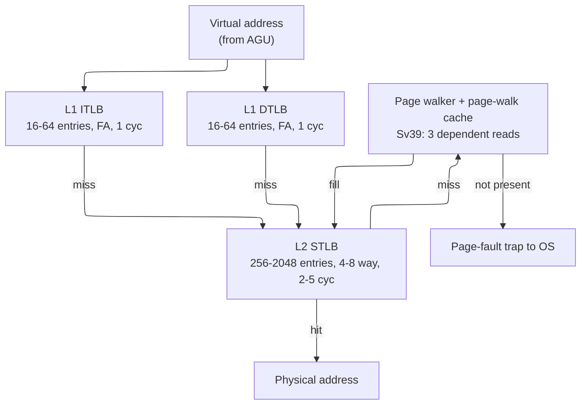
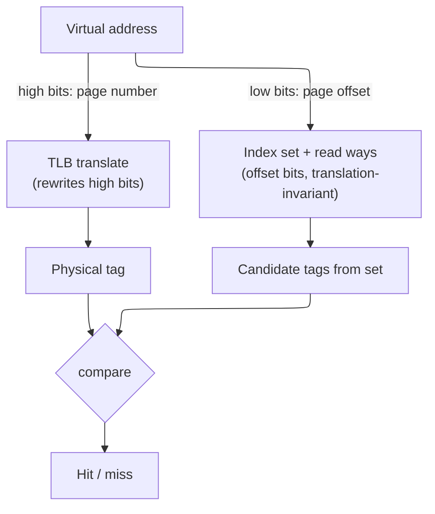

# TLB and Virtual Memory — Address Translation on the Critical Path

> **Prerequisites:** [CPU_Architecture](../02_CPU/01_CPU_Architecture.md) (pipeline, memory hierarchy), [Cache_Microarchitecture](01_Cache_Microarchitecture.md) (set-associative indexing, tag compare), [RISC_V_ISA](../02_CPU/02_RISC_V_ISA.md) (Sv39, `satp`, `SFENCE.VMA`).
> **Hands off to:** [Memory](03_Memory.md) (the DRAM the walk reads), [AHB_AXI_APB](../04_Interconnect/01_AHB_AXI_APB.md) (buses carrying physical addresses), [Xiangshan_CPU_Design](../02_CPU/05_Xiangshan_CPU_Design.md) (a complete MMU in an open core).

---

## 0. Why this page exists

Virtual memory rests on one uncomfortable fact: **every address a program computes must be translated before the hardware can touch memory — and the dictionary for that translation is itself in memory.** A load does not reference a DRAM location; it references a *virtual* location that the operating system has mapped, through a tree of page tables living in DRAM, onto some physical frame. So "translate this address" expands to "walk a data structure in memory," and that walk must happen *before every single memory reference the program makes*. Address translation is therefore recursive — a memory access interposed ahead of every memory access — and if paid in full it would multiply the machine's memory traffic several-fold and drop a chain of dependent DRAM reads onto the critical path of every load.

The **Translation Lookaside Buffer (TLB)** is the structure that makes translation affordable. It is a small, fast cache of recently used translations that answers the common case — "I have seen this page before" — in about a cycle, so the full walk is paid only on a miss. Everything else on this page is a consequence of two properties of that cache. It sits **on the load-use critical path** — nothing can address the data cache until translation resolves — which forces it to be tiny, associative, and *overlapped* with the cache rather than merely being another level of memory. And the thing it caches is **produced by a serial pointer-chase through a highly redundant tree**, which shapes the page-table walker, the page-walk cache, and the entire cost model of a miss.

We derive each structure from the problem it solves rather than tabulating its fields: what a TLB entry must hold (from its three jobs), why the hierarchy splits into a small fast level and a large slow one, why ASIDs and the global bit exist (a tag that buys out a flush), why the walk needs its own cache, why VIPT is the only way to hide translation latency behind the cache, and why superpages trade reach against fragmentation. By the end you should be able to size a TLB from its reach, prove the VIPT capacity ceiling, and explain why a virtualized page walk can cost 24 memory accesses — not recite bit-field widths.

---

## 1. Translation is a memory access before every memory access

### 1.1 The cost of paying translation in full

Model the page table as a radix tree of depth $K$ (the number of levels). Resolving one virtual address means reading one page-table entry (PTE) per level, and — this is the sting — **each read's address comes from the previous read's result.** The levels cannot be fetched in parallel; they form a strictly dependent chain:

$$
t_{walk} \;=\; \sum_{i=1}^{K} t_{mem}^{(i)}
$$

where $t_{walk}$ = latency of a full walk, $K$ = tree depth (3 for RISC-V Sv39, 4 for Sv48 / x86-64, 5 for Sv57), and $t_{mem}^{(i)}$ = latency of the $i$-th dependent PTE read. If those PTEs are cold in DRAM at ~100 ns each, a single translation costs $3\text{–}5\times100$ ns — *before the actual load even issues.* Paying that on every memory reference is a non-starter; it would make virtual memory cost more than the computation it serves. The dependent chain also means the cost cannot be hidden by memory *bandwidth* — only by removing links from the chain, which is the recurring theme of §5.

**The amortized cost — the AMAT adder.** You do not pay $t_{walk}$ on *every* access, only on a translation miss, so the true tax on the machine is the walk cost *weighted by how often it is incurred*. If a fraction $m_{walk}$ of memory references miss every TLB level and fall to the walker, and the radix has $K$ levels each costing one dependent access $t_{mem}$, translation adds to the average memory-access time exactly

$$
\Delta\text{AMAT}_{xlate} \;=\; m_{walk}\times t_{walk} \;=\; m_{walk}\times K \times t_{mem}
$$

where $m_{walk}=m_{L1}\,m_{L2}$ is the product of the per-level TLB miss rates (defined in §1.2/§3) and $t_{mem}$ is the latency of *one* dependent PTE read — itself an average, since each read may hit the L2/L3 cache or miss to DRAM (§5.1). This one number is what every later mechanism drives down, each attacking a different factor: the STLB shrinks $m_{walk}$ (§3.2), the page-walk cache shrinks the *effective* $K$ (§5.2), superpages shrink $m_{walk}$ by multiplying reach (§7). *Worked number:* a memory-bound workload with $m_{walk}=2\%$ on a 4-level tree ($K=4$) whose PTEs are cold ($t_{mem}\approx100$ cyc) pays $0.02\times4\times100=8$ cycles of translation on *every* memory reference on average — routinely larger than the data access it precedes. Warm those PTEs into L2 ($t_{mem}\approx10$ cyc) and it falls to $0.02\times4\times10=0.8$ cyc; halve $m_{walk}$ with a bigger STLB and it halves again. Because the tax is a *product*, any single lever that attacks any one factor pays.

### 1.2 Why a cache works — and why it must be *this* kind of cache

Two facts rescue it. First, **locality**: programs touch few pages relative to their instruction count — a tight loop over a few arrays lives in a handful of 4 KB pages, so the *same* translations are demanded over and over. A cache of translations therefore hits nearly always. Second, a translation result is tiny (a VPN→PPN pair plus a few permission bits), so a few dozen of them cover the entire hot page working set.

That is exactly a cache, and the TLB is it — but it cannot be organized like an ordinary data cache, because of *where it sits*. A physically-tagged cache cannot compare tags until it has the physical address, and the physical address is precisely what translation produces, so translation is **in series ahead of the cache tag compare, on the load-use path that dominates integer performance** (§6 shows how VIPT partially hides it). Two consequences follow immediately and drive the rest of the page:

- **It must be fast and small.** A structure on the load-use path cannot afford the multi-cycle latency of a large SRAM; the L1 TLB is a few dozen entries answering in a single cycle (§3).
- **A miss must be cheap in the common case.** Since even a hit is on the critical path, a miss — a full walk — is catastrophic if paid in full, which is why the walk gets its *own* cache (§5) and why the hierarchy grows a second TLB level (§3) before ever falling back to memory.

The effective translation latency across the hierarchy is the standard cache-hierarchy expression:

$$
t_{xlate} \;=\; t_{L1} \;+\; m_{L1}\big(t_{L2} \;+\; m_{L2}\,t_{walk}\big)
$$

where $t_{L1}, t_{L2}$ = L1/L2 TLB hit latencies, $m_{L1}, m_{L2}$ = their miss rates, and $t_{walk}$ = the walk latency of §1.1. The entire microarchitecture below is a campaign to keep every term small: $t_{L1}$ by making L1 tiny and associative, $m_{L1}$ by adding an L2, $m_{L2}$ by growing reach with superpages, and $t_{walk}$ by caching the walk.

---

## 2. What a TLB entry must hold — derived from three jobs

A TLB entry is a *cached translation*, and its contents are fixed by what the consumer needs the instant it hits: a memory access that must **translate, check permission, and continue in a single cycle.** Do not memorize a field list — derive it from the three jobs one entry performs, and every bit follows as a consequence.

1. **Translate in one lookup.** The whole point is to replace a $K$-level walk with a single associative match, so an entry must store both halves of the map: the **virtual page number (VPN)** as the match key and the **physical page number (PPN)** as the payload it emits. The data-cache tag compare stalls until this resolves (§1), which is why the lookup must be a fast associative match, not another indexed SRAM read.
2. **Authorize in the same step.** A translation that is *correct but unpermitted* — a store to a read-only page, a user-mode access to a supervisor page — must fault *before* the access completes, not after the data returns. So the entry caches the **permission bits** (read / write / execute, user) beside the PPN: one lookup both translates and authorizes. Splitting them would drop a *second* dependent structure onto the same critical path.
3. **Stay coherent with an OS that edits the map underneath it.** A bare VPN→PPN pair is meaningful only within one address space and goes stale when the OS rewrites the page table. So the entry also carries the state that keeps a *cached* translation trustworthy: an **address-space identifier (ASID)** so it survives a context switch without a flush (§4), a **global** bit for kernel mappings shared by every space, a **valid** bit for invalidation, and hardware-managed **accessed / dirty** bits that report use back to the OS without forcing a walk.

So a TLB entry is best read not as "nine fields" but as **the minimum state that lets one associative hit translate, authorize, and stay coherent with the OS.** Concretely that is on the order of 100 bits — a ~30-bit key (VPN + ASID), a ~44-bit PPN payload, and a handful of permission and status bits — but the *widths* are incidental; the three jobs are the content. Two corollaries drop out:

- **Permissions live with the translation, not after it.** Any scheme that checked rights in a separate later stage would serialize two lookups on the critical path; caching R/W/X/U in the TLB is what collapses translate-and-authorize into one step.
- **A/D bits are an optimization for the OS, done in hardware.** Having hardware set "accessed" and "dirty" saves the OS from taking a fault purely to learn a page was touched or written — the page-replacement and copy-on-write machinery upstack reads them directly.

---

## 3. Sizing and organization — the hot structure on the critical path

The TLB faces the same tension as the OoO scheduler ([OoO_Execution](../02_CPU/03_OoO_Execution.md), §4): the structure that must be *fast* wants to be *small*, but the structure that must *hit often* wants to be *large*. Virtual memory resolves it the way caches do — with a hierarchy — but the split is driven by the critical path, so it is worth deriving rather than asserting.

### 3.1 Why the L1 TLB is small, fully-associative, and fast

The L1 TLB answers on the load-use path, so its latency is charged to *every* load. A fully-associative organization broadcasts the incoming VPN to every entry and compares in parallel — zero conflict misses, best possible hit rate per entry — but its delay grows with occupancy:

$$
t_{FA} \;\approx\; t_0 + \kappa\,N_{entries}
$$

where $t_0$ = fixed lookup overhead and $\kappa$ = the per-entry cost of the match-line discharge and the priority-encode / OR-reduce across $N_{entries}$ hit lines, both of which lengthen with the array. On the critical path that linear term is intolerable past a few dozen entries — which is exactly why real L1 TLBs sit at **16–64 fully-associative entries with a 1-cycle hit** and go no further. It is the TLB analog of why issue queues stay at 32–64 entries: a single-cycle associative structure cannot be both large and fast.

### 3.2 Why the L2 STLB is large, set-associative, and slower

A 64-entry L1 TLB covers only $64\times4\text{ KB}=256\text{ KB}$ of memory — its **reach**:

$$
R_{TLB} \;=\; N_{entries}\times S_{page}
$$

Any working set larger than the reach thrashes it — and *how badly* follows from a **coverage argument**. A footprint of $W_p$ hot pages (bytes $S_{WS}=W_p\,S_{page}$) cannot fit in $N_{entries}$ slots once $W_p>N_{entries}$, i.e. once $S_{WS}>R_{TLB}$. Under a uniform-reuse model the probability that a referenced page is currently resident equals the fraction of the footprint the reach covers, $R_{TLB}/S_{WS}$, so the miss rate is

$$
m_{TLB} \;\approx\; \max\!\Big(0,\; 1-\frac{R_{TLB}}{S_{WS}}\Big),
$$

zero while the footprint fits ($S_{WS}\le R_{TLB}$) and climbing toward 1 as it outgrows the reach. (Strict cyclic LRU is the pathological worst case — *every* access misses once $W_p>N_{entries}$; pure streaming with no reuse takes one compulsory miss per page. The uniform estimate sits between them and is the right first-order number.) *Worked number:* a 64-entry, 4 KB DTLB reaches $R_{TLB}=256\text{ KB}$; against a $S_{WS}=1\text{ GB}$ working set the coverage is $R_{TLB}/S_{WS}=2^{18}/2^{30}=1/4096$, so $m_{TLB}\approx1-1/4096\approx99.98\%$ — translation walks on essentially every access, and no entry-count increase the critical path allows can close a 4096× gap. Only *page size* can: at 2 MB the same 64 entries reach 128 MB ($R/S_{WS}=1/8$, $m\approx88\%$ — better, still thrashing), while a 1024-entry STLB at 2 MB reaches 2 GB $>$ 1 GB and the capacity-miss term drops to ~0. This is the §7 reach lever quantified: for large footprints the deciding knob is $S_{page}$, not $N_{entries}$. The fix for the second factor is a second level, and because it is consulted *only on an L1 miss* it is off the load-use path and may trade latency for capacity: the **L2 shared TLB (STLB)** is 256–2048 entries, 4–8-way set-associative, 2–5-cycle hit. Set-associativity is the enabling trade — it caps the comparator count at the way-count instead of $N$, letting the array scale to thousands of entries at the price of occasional conflict misses and a replacement policy (PLRU). This is the same fully-associative-versus-set-associative split as the cache hierarchy, made for the same reason.

The effective latency across the two levels is the $t_{xlate}$ model of §1.2. The STLB exists to shrink $m_{L1}$; superpages (§7) exist to shrink $m_{L2}$ by multiplying reach. Both are levers on the same expression.

---

## 4. ASIDs and the global bit — a tag that buys out a flush

A translation is valid only inside the address space that created it: the same VPN maps to different frames in different processes. The naive consequence is brutal — **every context switch must flush the entire TLB**, because otherwise the incoming process could hit the outgoing one's stale entry. That flush discards a warm TLB hierarchy (hundreds to a couple thousand entries across L1 and L2) and then forces the incoming process to re-walk all of them back in: hundreds to thousands of cycles of pure overhead, repeated at every switch.

The **address-space identifier (ASID)** buys that flush out. Each process gets an identifier (16 bits on RISC-V, held in the `satp` CSR), stamped into every entry it fills; a lookup hits only when both the VPN *and* the ASID match:

$$
\text{hit} \;\Longleftrightarrow\; \big(\text{VPN}_{entry}=\text{VPN}_{VA}\big)\;\wedge\;\big(\text{ASID}_{entry}=\text{ASID}_{cur}\;\vee\;G_{entry}\big)\;\wedge\;V_{entry}
$$

Now two processes' translations coexist in the TLB, and a context switch is a single `satp` write with nothing flushed. **What it costs** is explicit and small: every entry widens by the ASID field, every lookup performs one extra comparison, and the OS inherits a *finite namespace* to manage — $2^{16}$ ASIDs is generous but not infinite, so when they run out the OS must recycle one and flush *its* stale entries. That recycling flush is the residual cost; the win is eliminating the *unconditional* flush on every one of the far more frequent context switches. This is the canonical "add a tag to avoid an invalidate" trade, and it returns in §8 as the reason ASIDs also cut TLB shootdowns.

The **global (G) bit** is the complementary move for the one address space *every* process shares — the kernel. A kernel mapping marked global matches regardless of ASID, so it survives every context switch and need not be duplicated once per ASID. Without it, the kernel — mapped into every process — would burn one TLB entry per process per shared page; the G bit collapses those to one.

---

## 5. The page walk and the page-walk cache

### 5.1 The walk is serial pointer-chasing

When both TLB levels miss, a hardware **page-table walker** — an FSM in the MMU — traverses the radix tree in memory. Its defining property, from §1.1, is that the traversal is *serial*: level $i$'s PTE holds the physical address of level $i{+}1$'s table, so the reads are strictly dependent and cannot overlap. An Sv39 miss is three dependent memory reads; Sv48 and Sv57 are four and five. This is why a miss costs 20–40 cycles even when the PTEs are warm in the L2/L3 cache, and 100–300 cycles when they are cold in DRAM — the chain cannot be shortened by more bandwidth, only by *removing levels from it*.

Those two bands are just $t_{walk}=K\times t_{mem}$ read off at the two places a PTE can live, because **each of the $K$ dependent reads is itself a full memory access** that may hit the L2/L3 cache or miss to DRAM. Warm — all $K$ reads hitting L2/L3 at ~7–13 cyc — gives $K\times{\sim}10\approx20\text{–}40$ cyc; a cold walk pays a DRAM access (~100 cyc) for *each* level that misses the cache, so it ranges from ~100 cyc (only the leaf cold, the upper levels cached or served by the PWC of §5.2) up to ~300 cyc (several levels missing to DRAM) — which is the 100–300 band. And because the reads are strictly dependent, this latency is un-overlappable *within a single walk*: no memory-level parallelism helps, since read $i{+}1$'s address is not known until read $i$ returns. Every lever in §5.2–§5.5 therefore attacks the *length* of the chain, never its width.

**Worked trace — one Sv39 walk, in hex.** The flowchart in [RISC_V_ISA §5.3](../02_CPU/02_RISC_V_ISA.md) *is* the algorithm; running it on real numbers makes the address arithmetic explicit. Translate `VA = 0x80A102A0` (a valid Sv39 virtual address — bit 38 is 0, so the required sign-extension of bits 63:39 is all-zero) with `satp.PPN = 0x01000`, i.e. the root table sits at physical `0x01000 × 0x1000 = 0x0100_0000`. Sv39 slices the 39-bit VA into three 9-bit VPN indices and a 12-bit offset:

- `offset = VA[11:0] = 0x2A0`
- `VPN[0] = VA[20:12] = 0x010` (16)
- `VPN[1] = VA[29:21] = 0x005` (5)
- `VPN[2] = VA[38:30] = 0x002` (2)

The walker (PTE size = 8 B) then chases three dependent reads, each at `table_base + VPN[level] × 8`:

1. **Level 2.** Read the PTE at `0x0100_0000 + 2×8 = 0x0100_0010`. Value `0x0048_0001` → low bits `V=1, R=W=X=0`, so it is **not a leaf** but a pointer; its PPN field (`0x0048_0001 >> 10 = 0x1200`) gives the next table base `0x1200 × 0x1000 = 0x0120_0000`.
2. **Level 1.** Read the PTE at `0x0120_0000 + 5×8 = 0x0120_0028`. Value `0x0054_0001` → again `V=1, R/W/X=0`, a pointer; PPN `0x1500` → next base `0x0150_0000`.
3. **Level 0.** Read the PTE at `0x0150_0000 + 16×8 = 0x0150_0080`. Value `0x02AF_34D7` → low byte `0xD7` decodes `V=1, R=1, W=1, X=0, U=1, A=1, D=1`; `R=1` marks a **leaf**, with PPN `0x02AF_34D7 >> 10 = 0xABCD`.

The leaf ends the chase: **`PA = (leaf PPN : offset) = (0xABCD × 0x1000) | 0x2A0 = 0x0ABC_D2A0`.** Three dependent memory reads — at `0x0100_0010`, `0x0120_0028`, `0x0150_0080`, each of which may hit L2/L3 or miss to DRAM (the two bands above) — turned one virtual address into one physical address. Three checks along the way are the fault and fast-path conditions the same walker enforces: a PTE with `V=0` (or the reserved `R=0, W=1`) raises a **page fault**; a leaf found early at level 1 or 2 with non-zero low PPN bits is a **misaligned-superpage** fault; and if `A` is clear (or `D` is clear on a store) the walker must first set it with a write-back before the translation is usable. Swap the level-0 pointer for a leaf *at level 1* and the identical VA resolves in **two** reads to a 2 MB superpage — the early-termination win quantified in §7.

### 5.2 The page-walk cache — exploiting upper-level redundancy

The walk's saving grace is that the top of the tree is enormously **redundant across misses**. The radix structure fans out so widely that one upper-level entry governs a vast region of virtual space: in Sv39 a single level-2 PTE covers 2 MB, a single level-1 PTE covers 1 GB. Every translation whose address falls in that region shares the *same* upper-level PTEs — so across many distinct TLB misses the walker re-reads the identical top-of-tree entries again and again, and only the leaf differs.

A **page-walk cache (PWC)** captures exactly those upper-level, non-leaf PTEs — keyed by the partial VPN that selects them — and pointedly *not* the leaf translations, which are the TLB's job. Its effect is to collapse the dependent chain from the top: a walk that hits the PWC at every upper level skips straight to the final leaf read. The expected number of memory accesses per walk becomes

$$
N_{acc} \;=\; 1 \;+\; (K-1)(1-h)
$$

where $K$ = walk depth, $h$ = PWC hit rate on upper-level entries, and the leaf read (the "1") is always taken. The derivation is a plain expectation: the leaf is never cached here (1 access, certain), and each of the remaining $K-1$ upper levels is read only when the PWC misses it (probability $1-h$ each), giving $1+(K-1)(1-h)$. The two limits check out — $h=0$ recovers the full $K$-access walk, $h=1$ collapses it to the single leaf read. Because upper-level reuse is extreme, $h$ is high and hot regions resolve in ~1 access instead of $K$ — which is *why* a small 16–64-entry PWC earns a dedicated structure, and why it is kept separate from the TLB rather than folded into it: the two cache different things (interior pointers versus leaf translations) with different reuse. *Worked number:* a 4-level tree with $h=0.9$ gives $N_{acc}=1+(4-1)(0.1)=1.3$ accesses per walk instead of 4, a $3\times$ shorter dependent chain; since walk latency is $N_{acc}\times t_{mem}$, the warm-walk cost falls from ${\sim}4\times10=40$ cyc toward ${\sim}1.3\times10=13$ cyc. The PWC is thus the **walk-latency reducer** that makes both deep trees (§5.3) and nested walks (§5.5) affordable — it converts the $K$ (or 24) dependent reads into ~1–2 whenever the upper tree is hot, which by locality it almost always is.

### 5.3 Walk depth versus address-space width

Each level added to the tree buys a $512\times$ larger virtual address space (9 more VPN bits) at the cost of exactly **one more access on the dependent chain**. That is the whole scaling law of paging, and it is why the industry ladders VA width in discrete steps rather than adopting one giant flat table — a flat Sv39 table would need $2^{27}$ PTEs = 1 GB *per process*, whereas the radix tree allocates interior nodes only for regions that are actually mapped, so a sparse address space costs almost nothing.

The space argument deserves the full derivation, because it is *the* reason paging is a tree and not an array. A **flat** (single-level) table must store one PTE for every page the VA can name — $2^{\,(\text{VA bits}-\log_2 S_{page})}$ of them — mapped or not. For Sv39 that is $2^{39-12}=2^{27}$ PTEs $\times\,8$ B $= 1$ GB, resident per process, almost all zeros. A **radix** table instead allocates a sub-table only when some entry beneath it is present, so its size tracks the *mapped* set, not the address space: a process mapping $M$ pages needs $M$ leaf PTEs ($8M$ bytes, packed 512 to a 4 KB leaf table $\Rightarrow\lceil M/512\rceil$ leaf pages if contiguous), plus $O(\#\text{separated regions})$ interior pages to reach them. *Worked number:* a typical sparse process — 8 MB resident ($M=2048$ pages) scattered across text, data, heap, and stack in four separated regions — needs $\lceil 2048/512\rceil=4$ leaf tables (16 KB of leaf PTEs), up to ~4 level-1 tables, and 1 root, so on the order of **9 page-table pages ≈ 36 KB** — against the flat **1 GB**, a $\sim\!2.9\times10^{4}\times$ reduction. The mechanism is exact: radix size $\propto$ mapped memory, flat size $\propto$ address space. Widen the VA to 57 bits (Sv39→Sv57, two more levels) and the flat table explodes by $512^2$ to **256 TB per process** — absurd — while the radix table grows by only two interior pages per mapped region. Sparsity, not compression, is what makes a 128 PB address space representable at all.

| Scheme | Levels | VA width | VA space | Walk depth |
|---|---|---|---|---|
| RISC-V Sv39 | 3 | 39 bits | 512 GB | 3 |
| RISC-V Sv48 | 4 | 48 bits | 256 TB | 4 |
| RISC-V Sv57 | 5 | 57 bits | 128 PB | 5 |
| x86-64 (4-/5-level) | 4–5 | 48 / 57 bits | 256 TB / 128 PB | 4–5 |
| ARMv8/v9-A | 3–4(+) | 48–52 bits | 256 TB – 4 PB | 3–4 |

The trade is captured entirely by "one access per level, 512× reach per level," and the page-walk cache is what keeps the *added* levels nearly free for hot regions — which is why 5-level paging (Intel since Ice Lake, 2019; AMD since Genoa, 2023) ships with negligible steady-state overhead despite the deeper tree.

### 5.4 Who walks — hardware versus software

A second axis is *who* performs the walk. A **software-managed** TLB (classic MIPS) takes a precise exception on every miss and runs an OS handler that walks whatever page-table format it likes and installs the entry by hand. A **hardware-managed** TLB (RISC-V, ARM, x86) does it in a dedicated FSM with no exception. The trade is flexibility versus speed:

- **Software** wins *flexibility* — the OS may use any page-table structure (hashed, inverted, clustered) and any replacement policy — at the price of a trap, register save/restore, and I-cache pollution *on every miss*, plus the awkwardness of nested misses.
- **Hardware** wins *speed and overlap* — no trap, and on an OoO core the walker runs in the background while independent instructions keep executing — at the price of a page-table format frozen into the ISA and a walker + PWC to design and verify.

High-performance cores universally chose hardware: on a wide OoO machine, the ability to *overlap* the walk with execution and to avoid a pipeline flush per miss dominates the lost flexibility. Software-managed TLBs survive only where core simplicity matters more than miss latency.

### 5.5 Nested translation — when the walk becomes two-dimensional

Virtualization turns the one-dimensional walk into a two-dimensional one, and it is the sharpest illustration of why the PWC exists. Under a hypervisor a guest's "physical" addresses are themselves virtual (guest-physical), translated by a *second* set of page tables (the host / stage-2 tables). Every guest-physical address the guest walk produces — the table base and each level's pointer — must itself be translated by the host walk before it can be dereferenced:

$$
N_{nested} \;=\; (D_g+1)(D_h+1) - 1
$$

where $D_g, D_h$ = guest and host walk depths. The count is a 2-D grid, and deriving it shows *why* the blow-up is multiplicative. The guest walk must resolve $D_g+1$ guest-physical addresses — the guest table base, plus the pointer read out of each of its $D_g$ levels (the last being the guest-physical address of the data). **Each** of those gPAs is only a *guest*-physical address the hardware cannot dereference, so each costs a full $D_h$-access host walk to become a real host-physical address: $(D_g+1)D_h$ host accesses in all. Add the $D_g$ guest-PTE reads themselves and

$$
N_{nested}=(D_g+1)D_h+D_g=(D_g+1)(D_h+1)-1,
$$

the two forms identical since $(D_g+1)(D_h+1)-1=(D_g+1)D_h+(D_g+1)-1=(D_g+1)D_h+D_g$. Each dimension *multiplies* the other — there is no adding your way out. For two 4-level trees this is $(4{+}1)(4{+}1)-1 = 5\times5-1 = \mathbf{24}$ dependent memory accesses for a single translation — an order of magnitude worse than a native miss. This is why virtualization historically carried a heavy TLB-miss tax, why server cores invest in **nested TLBs and large page-walk caches** to short-circuit the 2-D walk, and why hypervisors lean on superpages (§7) to enlarge reach. The same reasoning covers *remote* page tables: on a NUMA or CXL-attached system the PTEs may live across an interconnect, adding link latency to each dependent read, so the OS co-locates page-table pages with the data they map — again, keep the dependent chain short.

---

## 6. VIPT — overlapping translation with the cache

### 6.1 The conflict

§1 established that translation sits in series ahead of a physically-tagged cache: you need the physical address to compare tags, and translation is what produces it, so naively the load costs TLB *then* cache — two serial latencies on the hottest path in the machine. The only escape is to run the two in *parallel*. But a cache lookup needs address bits to select its set, and translation is precisely the operation that **rewrites the high-order bits** (the page number) while leaving the low-order bits (the page offset) untouched. So the cache wants address bits early, and translation will not release the high ones until it is done. That is the conflict VIPT resolves.

### 6.2 The resolution and its ceiling

The resolution is a single observation: **the page offset is identical in the virtual and physical address** — translation never touches it. So index the cache with *only* offset bits and tag it with the physical bits translation produces. Now the TLB translation and the cache set-index-and-read proceed in parallel, and the physical tag lands just in time to compare against the tags read from the ways. This is **virtually-indexed, physically-tagged (VIPT)**: virtually indexed because the offset bits are available pre-translation, physically tagged because correctness still rests on the physical tag.

The catch is a hard ceiling on how many index bits exist *below* the page offset. The highest index bit must not reach above the top of the offset:

$$
\underbrace{\lceil\log_2 L\rceil}_{\text{block offset}} + \underbrace{\log_2\!\frac{C}{W L}}_{\text{index bits}} - 1 \;\le\; \log_2 P - 1
\;\;\Longrightarrow\;\;
\boxed{\,C \le W\times P\,}
$$

where $C$ = cache capacity, $W$ = associativity, $L$ = line size, $P$ = page size. The interpretation is the entire design lever: **a VIPT L1 cache can grow only by adding associativity or enlarging the page** — capacity beyond $W\times P$ pushes index bits up into the VPN, which translation changes, breaking the scheme. (The precise test is on bit *positions*, so the bound is met exactly at $C=W\times P$; a 32 KB / 8-way / 64 B cache with 4 KB pages sits right on the line, index bits [11:6] atop the [5:0] block offset.) The *geometric* derivation of $C\le W\times P$ from the index/offset split is owned by [Cache_Microarchitecture §1.5](01_Cache_Microarchitecture.md) — this page does not re-derive it; §6 here owns the complementary half, the **overlap-and-aliasing mechanism** that ceiling exists to police (§6.3).

### 6.3 The synonym problem, and how real cores dodge the ceiling

Two dual aliasing hazards haunt any virtually-indexed cache, and naming them precisely is the point of owning the mechanism here:

- A **homonym** is *one virtual address, many physical addresses* — the same VA names different frames in different address spaces (every process reuses low virtual addresses). A virtually-*tagged* cache would return the previous space's data on a hit; a VIPT cache does **not**, because the tag it compares is *physical*: the homonym indexes the same set but its physical tag differs, so the compare cleanly misses. Physical tagging *inherently* defeats homonyms — the first reason VIPT tags physically, not virtually. (The residual case, a stale entry surviving a context switch, is retired by the ASID/flush machinery of §4, not by the index.)
- A **synonym** (alias) is the dual — *many virtual addresses, one physical address* — and it is the hazard physical tagging does **not** catch, because the aliases share the *same* physical tag and only their *set* can differ. Two virtual pages mapping one frame necessarily share the page offset (translation preserves it), so if every index bit lies inside that offset ($C\le W\times P$) they select the *same* set and coincide as a single line — no synonym is even possible. The hazard appears only when the index spills $a=\log_2\frac{C}{WP}$ bits above the offset into the VPN.

When it does spill ($a>0\Leftrightarrow C>W\times P$), two virtual addresses mapping the same physical frame can differ in those $a$ bits and therefore land in one of $2^{a}$ different sets — the same physical line cached in up to $2^a$ places. A write to one copy is invisible to the others: silent incoherence. Three fixes exist, and the vendor table shows every core choosing among them explicitly:

- **Raise associativity** to keep $C\le W\times P$ — Intel Golden Cove runs a 48 KB L1D at 12-way so its index still fits a 4 KB page.
- **Enlarge the page** to widen the offset — Apple's 16 KB base page is directly motivated by VIPT: a 128 KB, 8-way L1D needs 8 index bits, which fit a 14-bit (16 KB) offset but not a 12-bit (4 KB) one.
- **Page coloring** (OS) — where the ceiling is violated (ARM Cortex-A78, 64 KB / 4-way on 4 KB pages), the OS constrains physical-frame allocation so the spilled physical bits always equal the virtual ones, forcing all aliases into the same set at the cost of some allocation freedom.

| Core | L1D | Assoc. | Page | Index fits offset? | How |
|---|---|:---:|---|:---:|---|
| Intel Golden Cove | 48 KB | 12-way | 4 KB | Yes (exact) | high associativity |
| Apple M1 Firestorm | 128 KB | 8-way | 16 KB | Yes (exact) | large page |
| RISC-V BOOM v3 | 32 KB | 8-way | 4 KB | Yes (exact) | index [11:6] fits |
| ARM Cortex-A78 | 64 KB | 4-way | 4 KB | No | OS page coloring |

Every one of these is $C\le W\times P$ made concrete — the constraint is not academic, it sets the associativity of essentially every high-performance L1 data cache in the industry.

---

## 7. Superpages — buying reach against fragmentation

TLB reach, $R_{TLB}=N_{entries}\times S_{page}$, has two factors, and §3 showed that entry count is capped by the critical path. The only other lever is **page size** — and it is a linear one. A leaf PTE placed at an *interior* level of the radix tree maps a larger, aligned region: in Sv39 a level-2 leaf is a 2 MB page and a level-1 leaf a 1 GB page. One superpage entry then covers $512\times$ or $512^2\times$ the memory of a base-page entry, multiplying reach without touching the entry count the critical path constrains:

| DTLB configuration | Reach |
|---|---|
| 64 × 4 KB | 256 KB |
| 64 × 2 MB | 128 MB |
| 64 × 1 GB | 64 GB |

The multiplier is exact, straight from the radix geometry: each level indexes $\log_2 512 = 9$ VPN bits, so promoting a leaf up one level folds those 9 bits into the page offset — the page grows $\times2^9=512$ and, at fixed $N_{entries}$, so does reach (a level-2 leaf → 2 MB, $\times512$; a level-1 leaf → 1 GB, $\times512^2$). The **same** promotion shortens the walk: a leaf found at radix level $j$ ends the pointer-chase there, costing $j$ dependent accesses instead of the full $K$ — an Sv39 base walk is $K=3$, a 2 MB leaf resolves in 2, a 1 GB leaf in 1 — and it shrinks page-table memory, one superpage PTE replacing $512$ or $512^2$ base PTEs. So a superpage is a *triple* win — reach, walk length, table size. *Worked number:* a workload striding through 500 MB thrashes a 4 KB-only DTLB (256 KB reach → a miss on nearly every new page, $m_{TLB}\approx1-256\text{ KB}/500\text{ MB}\approx99.95\%$ by the §3.2 coverage rule) but at 2 MB its 250-page footprint fits inside a 512-entry STLB (1 GB reach) and the miss rate collapses to the cold-start floor. Why not, then, map everything huge? Because reach is bought with **fragmentation and rigidity**:

- **Internal fragmentation** — the allocation granularity is now the page: a 2 MB page backing a 100 KB object wastes ~1.9 MB. Waste is bounded by $S_{page}-\text{used}$, negligible for 4 KB and severe for 1 GB.
- **Physical contiguity and alignment** — a superpage demands a naturally-aligned, physically-contiguous run of frames; under memory fragmentation the OS may be unable to find one, forcing a fallback to base pages.
- **Coarser everything else** — protection, dirty-tracking, and copy-on-write now act at superpage granularity, so a single byte written to a 2 MB copy-on-write page copies the whole 2 MB, and page-fault handling (zeroing a 2 MB page ~1 ms vs. ~2 µs for 4 KB) lengthens in proportion.
- **TLB partitioning** — a set-associative TLB cannot pick a set without knowing the page size, because the offset/index boundary *is* $\log_2 S_{page}$, and that boundary moves with the page size. Multi-size support therefore forces either a small **fully-associative** array (few superpage slots, since §3.1's linear delay caps its size) or **separate per-size sub-TLBs that are statically partitioned** — capacity handed to 2 MB entries is stolen from 4 KB entries and cannot be repurposed at runtime, so a workload whose page-size mix differs from the hardware's split leaves part of the TLB idle. Superpage reach thus competes with base-page reach for the same silicon; it is not free even measured in entries.

**Transparent huge pages (THP)** are the OS's attempt to get the reach without the manual trade: a kernel daemon watches for contiguous, fully-populated runs of base pages and *promotes* them to a superpage in the background, demoting on fragmentation or sparse use. It captures most of the reach benefit while keeping 4 KB granularity where sparsity or fine-grained protection demands it — the pragmatic middle of the reach-versus-fragmentation curve.

---

## 8. TLB shootdown — paying for absent coherence

Caches are kept coherent by hardware; **TLBs are not.** Each core's TLB is a private, hardware-incoherent cache of translations, so when the OS edits a page table — `munmap`, `mprotect`, page migration, copy-on-write demotion — the stale copies sitting in *other* cores' TLBs will not notice. Correctness then falls to software: the editing core must explicitly invalidate the stale entries everywhere they might live, a procedure called **TLB shootdown**. (RISC-V's `SFENCE.VMA` performs the local invalidation, with operands to scope it by VPN and/or ASID; crucially it is *local only*, which is precisely why a multi-core shootdown needs software coordination.)

Because there is no hardware fan-out, the initiator interrupts every other core (an inter-processor interrupt, IPI), each target invalidates locally and acknowledges, and the initiator waits for all acknowledgments before proceeding. The cost is fundamentally serial in the core count:

$$
T_{shoot}(N) \;\approx\; t_{IPI} + (N-1)\,t_{flush} + t_{sync} \;=\; O(N)
$$

where $t_{IPI}$ = IPI send/fan-out latency, $t_{flush}$ = per-core local flush, $t_{sync}$ = barrier cost, $N$ = core count. Since *every* core stalls in its handler for the duration, the wasted work scales as $N\cdot T_{shoot}=O(N^2)$. On a 64-core machine a single shootdown runs into thousands of cycles, and a database doing tens of thousands of `munmap`s per second can lose a few percent of *all* core cycles to shootdowns — which is why shootdown scalability, not raw TLB speed, is the virtual-memory bottleneck on large systems. The mitigations all attack the $O(N)$ fan-out or remove flushes entirely:

- **ASID / global tagging (§4)** removes the largest source of flushes — context switches — outright, so shootdown is needed only for genuine PTE edits, never merely for switching processes.
- **Directed shootdown** sends the IPI only to cores that might hold the mapping (tracked per page), turning $O(N)$ into $O(K)$ for the $K$ cores actually involved.
- **Batched / deferred shootdown** collects many invalidations into one IPI round, amortizing the fixed IPI and barrier cost.
- **Lazy invalidation** leaves stale entries in place and relies on the ASID check or a generation counter to skip them, flushing only a core that would actually *use* a stale translation — which, for the very common switch to a kernel thread with no user mappings, means no flush at all.

The through-line is the same as ASIDs: the cheapest invalidate is the one you can prove you never have to send.

---

## 9. Worked problems

**1 — Size a TLB from its reach.** A workload streams through a 1 GB array at unit stride with negligible reuse. With 4 KB pages, covering it needs $2^{30}/2^{12}=262{,}144$ page translations — no practical TLB reaches that, so translation misses on nearly every new page. Switch to 2 MB pages: now $2^{30}/2^{21}=512$ translations cover the whole array, and a 1024-entry L2 STLB holds them all — the $m_{L2}\,t_{walk}$ term of $t_{xlate}$ effectively vanishes. This is the reach argument (§7) in one line: for streaming footprints, page *size*, not entry count, decides whether translation is free.

**2 — Prove a cache is VIPT-safe.** A 32 KB, 8-way, 64 B-line L1D with 4 KB pages: sets $=32768/(8\times64)=64$, so 6 index bits atop a 6-bit block offset put the highest index bit at $6+6-1=11$. The page offset top bit is also 11, so the index occupies [11:6] ⊂ [11:0] — VIPT-safe, exactly on the $C\le W\times P$ line ($32\text{ KB}=8\times4\text{ KB}$). Halve associativity to 4-way and sets double to 128: 7 index bits, highest at $6+7-1=12>11$ — the index spills one bit into the VPN and the cache is no longer VIPT-safe without page coloring. This is why L1D associativity and capacity are chosen *together* under the page size (§6).

**3 — Cost a virtualized page walk.** A guest running Sv39 (3-level) under an Sv39 hypervisor: nested cost $=(3+1)(3+1)-1=15$ dependent accesses per translation, versus 3 native. At ~5 cycles per warm PTE read that is ~75 cycles per miss instead of ~15. A page-walk cache that resolves both trees' upper levels for hot regions drives $N_{acc}$ toward the single leaf pair — which is why nested TLBs and PWCs, not faster memory, are what make virtualization affordable (§5.5).

---

## Numbers to memorize

| Parameter | Typical | Why this value (section) |
|---|---|---|
| L1 I/D-TLB entries | 16–64, fully-assoc. | on load-use path → small and fast (§3.1) |
| L2 STLB entries | 256–2048, 4–8-way | off critical path → large, set-assoc. (§3.2) |
| L1 TLB hit latency | 1 cycle | parallel with L1 index via VIPT (§6) |
| L2 STLB hit latency | 2–5 cycles | sequential after L1 miss (§3.2) |
| Page walk, PTEs cached | 20–40 cycles | $K$ dependent L2/L3 reads (§5.1) |
| Page walk, PTEs in DRAM | 100–300 cycles | ~100 ns per dependent read (§5.1) |
| Translation AMAT adder | $m_{walk}\,K\,t_{mem}$ | walk cost × miss rate (§1.1) |
| Page fault | $10^6$–$10^7$ cycles | disk/SSD I/O + OS (§1) |
| Page-walk cache | 16–64 entries | caches non-leaf PTEs only (§5.2) |
| Page-walk cache effect | $N_{acc}=1{+}(K{-}1)(1{-}h)$ | ~1–2 accesses when upper tree hot (§5.2) |
| Flat vs radix table (Sv39) | 1 GB vs ~tens of KB | size ∝ address space vs mapped pages (§5.3) |
| Base / superpage sizes (Sv39) | 4 KB / 2 MB / 1 GB | leaf at level 3 / 2 / 1 (§5.3, §7) |
| TLB reach (64 × 4 KB) | 256 KB | $N_{entries}\times S_{page}$ (§3.2, §7) |
| TLB miss rate (footprint > reach) | $\approx 1-R_{TLB}/S_{WS}$ | coverage argument (§3.2) |
| Superpage reach multiplier | ×512 per level | 9 VPN bits folded into offset (§7) |
| ASID width | 16 bits | 65,536 spaces before recycle (§4) |
| Nested 2-D walk (4+4 level) | 24 accesses | $(D_g{+}1)(D_h{+}1){-}1$ (§5.5) |
| VIPT ceiling | $C \le W\times P$ | index must fit the page offset (§6.2) |
| `SFENCE.VMA` (local flush) | 10–50 cycles | one core; multi-core needs IPIs (§8) |

**Memory hierarchy latencies** (why a miss hurts and reach matters): L1 TLB ~1 cycle · L2 STLB 2–5 · cached page walk 20–40 · **uncached walk 100–300 cycles** — the $t_{walk}$ that dominates $t_{xlate}$ once reach is exceeded.

---

## Cross-references

- **Down the stack (what this is built from):** [Memory](03_Memory.md) (the SRAM/CAM cells behind the TLB and the DRAM the walk reads), [Cache_Microarchitecture](01_Cache_Microarchitecture.md) (set-associative indexing and the physical tag compare VIPT overlaps; its §1.5 owns the *geometric* derivation of the VIPT ceiling $C\le W\times P$, while §6 here owns the overlap-and-aliasing *mechanism* — synonyms and homonyms — that ceiling exists to police), [CMOS_Fundamentals](../../00_Fundamentals/01_CMOS_Fundamentals.md) (the associative match delay of §3.1).
- **Up the stack (what builds on it):** [OoO_Execution](../02_CPU/03_OoO_Execution.md) (the AGU/LSQ that issue the virtual addresses translated here, and the load-use path VIPT protects), [DDR_Controller](04_DDR_Controller.md) & [AHB_AXI_APB](../04_Interconnect/01_AHB_AXI_APB.md) (carry the physical addresses translation produces), [Xiangshan_CPU_Design](../02_CPU/05_Xiangshan_CPU_Design.md) (a complete MMU + page-walk cache in an open OoO core).
- **Adjacent / prerequisite:** [CPU_Architecture](../02_CPU/01_CPU_Architecture.md) (the pipeline and memory hierarchy this sits in), [RISC_V_ISA](../02_CPU/02_RISC_V_ISA.md) (Sv39/48/57, `satp`, `SFENCE.VMA`, and the page-fault trap of §8).

---

## References

1. RISC-V International, *The RISC-V Instruction Set Manual, Vol. II: Privileged Architecture*, 2024. Sv39/48/57 formats, `satp`, `SFENCE.VMA` semantics.
2. Hennessy, J.L. and Patterson, D.A., *Computer Architecture: A Quantitative Approach*, 6th ed., Morgan Kaufmann, 2017. Appendix B.4–B.5: virtual memory, TLB hierarchy, VIPT and aliasing.
3. Barr, T.W., Cox, A.L., and Rixner, S., "Translation Caching: Skip, Don't Walk (the Page Table)," *ISCA*, 2010. The page-walk / translation cache of §5.2.
4. Bhattacharjee, A., "Large-Reach Memory Management Unit Caches," *MICRO*, 2013. MMU-cache reach and organization.
5. Bhargava, R. et al., "Accelerating Two-Dimensional Page Walks for Virtualized Systems," *ASPLOS*, 2008. The nested-walk cost and nested TLBs of §5.5.
6. Talluri, M. et al., "Tradeoffs in Supporting Two Page Sizes," *ISCA*, 1992. Foundational superpage reach-versus-fragmentation analysis (§7).
7. Bhattacharjee, A. and Lustig, D., *Architectural and Operating System Support for Virtual Memory*, Synthesis Lectures on Computer Architecture, Morgan & Claypool, 2017. TLBs, walks, ASIDs, shootdown.
8. ARM Ltd., *ARM Architecture Reference Manual, ARMv8-A*, Section D5 (VMSA), TLB maintenance (TLBI), VIPT constraints.
9. Intel Corp., *Intel 64 and IA-32 Architectures Software Developer's Manual, Vol. 3A*, Ch. 4 (Paging), 4-/5-level paging, INVLPG, PCID.
