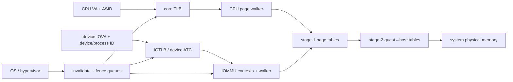
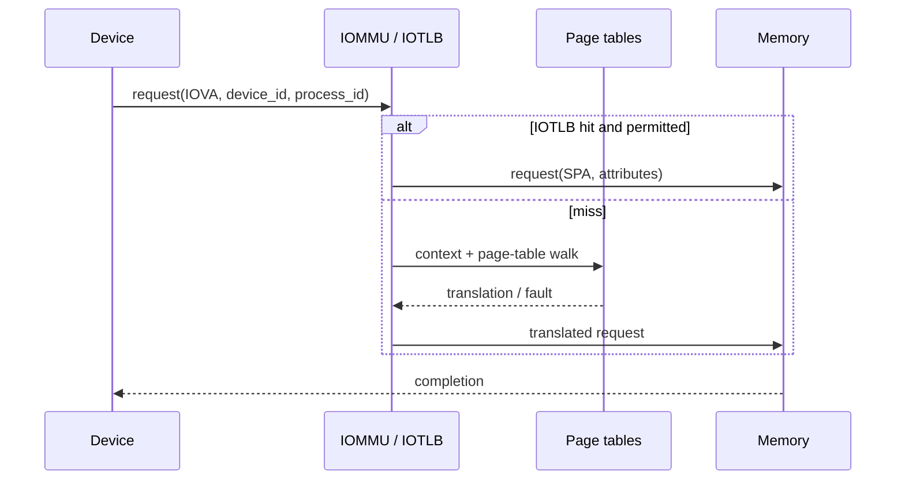

# Page Walkers, IOMMUs, and Virtualization — Translation Beyond the Core TLB

> **Prerequisites:** [TLB and Virtual Memory](01_TLB_and_Virtual_Memory.md) (page tables, reach, VIPT, shootdown), [Cache Coherence](../03_Coherence_and_Consistency/01_Cache_Coherence.md), and basic privilege/virtualization concepts.
> **Hands off to:** [Load-Store Unit](../../02_CPU/03_Out_of_Order_Backend/02_Load_Store_Unit_and_Memory_Ordering.md) for CPU request execution, [Host Interface, Coherence, and Scheduling](../../06_NPU/03_System_Integration/01_Host_Interface_Coherence_and_Scheduling.md) for accelerator use, and system fabrics for device transport.

---

## 0. Why this page exists

A modern system translates addresses for CPU cores, virtual machines, GPUs, NPUs, and DMA devices. A miss can trigger multi-level, two-stage page walks; devices may cache translations remotely; software can change tables while traffic is in flight. Translation is therefore a distributed coherence and isolation subsystem.

The core invariants are translation correctness, permission enforcement, invalidation completion, and separation between device/guest contexts.

## 1. Hardware page-walker microarchitecture

A serial $L$-level walk can require $L$ dependent memory reads. A practical walker contains:

- miss queue for concurrent walks and merged identical translations;
- page-walk cache (PWC) for upper-level PTEs;
- address-generation state per walk level;
- cache/coherence interface and MSHRs;
- permission/accessed/dirty-bit update path;
- fault and restart metadata;
- fill paths to multiple TLB levels.

Average walk latency is roughly

$$
L_{walk}=\sum_{k=1}^{L}p_{miss,k}L_{mem,k}+L_{control},
$$

where PWC/cache hits make each level's service different. Because levels depend on previous PTE contents, one walk has limited internal MLP; concurrency comes from multiple independent walks.

Walker throughput needs

$$
N_{walk}\gtrsim\lambda_{TLBmiss}L_{walk}
$$

outstanding slots. A single walker can become the bottleneck for many cores even when page-table data is cached.

## 2. Page-walk caches and translation coherence

PWCs cache non-leaf PTEs or partial walk results. Their tags include address-space identity, translation stage, level, and relevant mode bits. Negative entries are dangerous: many specifications forbid caching invalid entries or require strict invalidation semantics.

Page tables are ordinary memory but not ordinary data. Software updates a PTE, then executes architecture-defined invalidation and ordering operations. Hardware must not use a stale mix of old/new multiword or multi-field state beyond allowed behavior.

Two implementation strategies:

- make walkers coherent participants so PTE cache lines observe normal coherence;
- use explicit translation-cache invalidation plus ordering rules, possibly still reading data through coherent caches.

Coherence of page-table *data* does not automatically invalidate decoded TLB/PWC entries. Translation caches need their own invalidation namespace.

## 3. Nested translation

Virtualization often translates guest virtual address (GVA) → guest physical address (GPA) → system physical address (SPA). A naive nested walk can require many accesses: each stage-1 page-table access itself needs stage-2 translation.

For $L_1$ stage-1 levels and $L_2$ stage-2 levels, worst-case dependent references approach

$$
L_1L_2+L_2
$$

under a straightforward construction, before final data access. Caches reduce average cost but not the structural dependency.

Mitigations:

- combined TLB entries caching GVA→SPA;
- separate guest-physical TLB/PWC for stage 2;
- huge pages at either stage;
- walk caches for intermediate translations;
- concurrent walkers and miss merging;
- software placement of page tables for locality.

Tags require guest/VM identifiers in addition to process ASIDs. Reuse of identifiers demands invalidation before reassignment.

## 4. The IOMMU contract

An input-output memory management unit (IOMMU) sits between DMA-capable devices and memory. It provides:

- I/O virtual address (IOVA) translation;
- per-device and optionally per-process contexts;
- permission and memory-attribute enforcement;
- guest/device assignment through two-stage translation;
- fault reporting and page-request handling;
- translation invalidation and fencing;
- performance monitoring.

Device identity may come from a bus routing ID or on-chip stream ID. Shared virtual addressing adds process identity so device requests use the same virtual space as a CPU process.

Unlike a core load, DMA may be long-lived and deeply queued. Fault handling can be terminating (report and fail) or recoverable via a page-request interface that asks software to make a page resident, then retries.

## 5. Translation caches in devices: ATS and PRI

PCIe Address Translation Services (ATS) lets a device request a translation and cache it in an Address Translation Cache (ATC). This removes IOMMU lookup latency on later accesses but distributes stale-translation risk.

The system must:

- target invalidations to relevant device ATCs;
- wait for completion before reusing/unmapping memory as required;
- order DMA relative to invalidation/fence commands;
- handle device reset, surprise removal, and lost completions;
- bound the number and lifetime of outstanding translations.

Page Request Interface (PRI) lets a device report a missing/not-present translation and wait for software service rather than treating it as fatal. Queues need backpressure and denial paths so a malicious device cannot exhaust OS fault handling.

## 6. IOTLB and context-cache sizing

IOMMU reach is

$$
Reach=N_{entries}\times page\ size
$$

per effective context, but entries are shared among devices/processes. Include associativity, context partitioning, and mixed page sizes. A 1024-entry IOTLB at 4 KiB reaches 4 MiB—tiny for accelerators streaming gigabytes. Huge pages, device ATCs, and batched locality matter.

Context caches store device/process directory entries that point to page tables and policies. A miss can precede the page walk, adding another serialized memory lookup. Cache both contexts and translations, but expose separate miss counters.

The walker itself consumes memory bandwidth. For miss rate $r$ requests/s and average $a$ PTE reads/miss of size $b$,

$$
BW_{walk}=rab.
$$

The more serious cost is latency and cache pollution when page-table lines compete with data.

## 7. Invalidation is a distributed transaction

An unmap or permission downgrade is safe only after stale translations can no longer authorize access. A generic sequence is:

1. stop or coordinate new use of the mapping;
2. update page-table/context memory with required visibility;
3. enqueue targeted translation invalidations;
4. invalidate IOMMU, CPU TLB/PWC, and device ATCs as applicable;
5. wait for completion/fence;
6. reclaim/reassign physical memory.

Generation tags can make most entries logically stale, but identifier wrap and in-flight requests still require a completion proof. Range invalidation reduces command traffic but may be expensive to match in hardware.

Invalidation queues themselves need ordering, completion records, and fault handling. “Write invalidation register” is not enough if earlier DMA remains in the fabric.

## 8. Security and fault containment

IOMMU checks occur on every device-originated access, including page-table walks generated by the IOMMU itself under system protection rules. Threats include:

- device spoofing another stream/device ID;
- stale translation after VM reassignment;
- permission downgrade racing in-flight DMA;
- malformed page tables or cyclic contexts;
- fault-queue overflow denial of service;
- ATS-capable device retaining a translation after reset;
- side channels through shared TLB/PWC state.

Default-deny reset behavior is safer: establish device contexts before enabling DMA. Partition or tag caches by security/VM identity; scrub/reinitialize state on ownership change.

## 9. Performance model

Expected translation penalty per request is

$$
P_{xlate}=m_{L1}L_{L2}+m_{L1}m_{L2}L_{walk},
$$

extended for IOTLB/ATC/context caches and nested stages. But averages hide bursts: a new kernel launch can touch thousands of pages at once and saturate walker slots.

Measure:

- TLB/IOTLB/ATC/context/PWC hit rates by page size and context;
- concurrent walk occupancy and queue-full cycles;
- walk memory accesses and cache-level hits;
- nested-stage breakdown;
- invalidation commands, range, latency, and acknowledgements;
- page requests/faults and service time;
- DMA blocked cycles and translation bandwidth.

## 10. Verification invariants

- Every accepted access uses the translation and permissions of its identified device/process/VM context.
- A completed invalidation/fence guarantees the specified stale translations and earlier transactions cannot violate reuse.
- Context/ASID/VMID reuse cannot alias a still-valid cached entry.
- A translation fault never produces a memory request outside permitted fault-reporting accesses.
- Reset/disable prevents unauthorized DMA and drains or invalidates outstanding state.
- ATS/ATC invalidation completion is tracked exactly once despite retries.
- Walks terminate on invalid/malformed structures with the architecturally defined fault.

## 11. Numbers to remember

- A page walk is a dependent memory-access chain; concurrency comes mostly from multiple walks.
- Nested translation can multiply stage-1 and stage-2 walk work without combined caches.
- IOMMU identity includes device and often process/guest context, not just an address.
- ATS moves translation caching into the device and therefore extends invalidation there.
- Translation-data coherence does not replace explicit TLB/PWC/IOTLB invalidation.
- Physical memory must not be reused until invalidation and earlier DMA completion rules are satisfied.

## 12. Worked problems

### Problem 1 — IOTLB reach

A 2048-entry IOTLB is shared evenly in steady state by eight devices using 4 KiB pages. Average effective reach per device is

$$
\frac{2048}{8}\times4\ \text{KiB}=1\ \text{MiB}.
$$

A 64 MiB sequential DMA working set will churn unless huge pages, ATCs, or streaming-aware allocation changes the behavior.

### Problem 2 — nested worst-case references

Four-level stage 1 and four-level stage 2 give up to $4\times4+4=20$ dependent PTE references in the simple bound, before the data. Combined TLBs/PWCs are architectural necessities, not optional micro-optimizations.

### Problem 3 — walker bandwidth

At 2 million IOTLB misses/s, average 3.5 PTE reads/miss, and 64 B cache-line fetches, raw walker traffic is

$$
2\times10^6\times3.5\times64=448\ \text{MB/s}.
$$

Bandwidth may be tolerable, but dependent latency and shared-cache pollution can still dominate device stalls.

## Cross-references

- **CPU translation:** [TLB and Virtual Memory](01_TLB_and_Virtual_Memory.md), [Load-Store Unit](../../02_CPU/03_Out_of_Order_Backend/02_Load_Store_Unit_and_Memory_Ordering.md).
- **Device use:** [Host Interface, Coherence, and Scheduling](../../06_NPU/03_System_Integration/01_Host_Interface_Coherence_and_Scheduling.md), [QoS, Ordering, and I/O Coherence](../../04_Interconnect/03_System_Fabrics/01_QoS_Ordering_and_IO_Coherence.md).
- **Consistency:** [Memory Consistency and Atomics](../03_Coherence_and_Consistency/02_Memory_Consistency_and_Atomics.md), [Cache Coherence](../03_Coherence_and_Consistency/01_Cache_Coherence.md).

## References

1. RISC-V International, [RISC-V IOMMU Architecture Specification](https://docs.riscv.org/reference/iommu/index.html).
2. RISC-V International, [IOMMU Introduction and Usage Models](https://docs.riscv.org/reference/iommu/v20260222/iommu_intro.html).
3. Arm, *System Memory Management Unit Architecture Specification*.
4. PCI-SIG, PCI Express Base Specification sections on ATS, PRI, and PASID.
5. B. Bhattacharjee, “Large-Reach Memory Management Unit Caches,” MICRO 2013.

---

**Navigation:** [Virtual Memory index](00_Index.md) · [Memory index](../00_Index.md)
