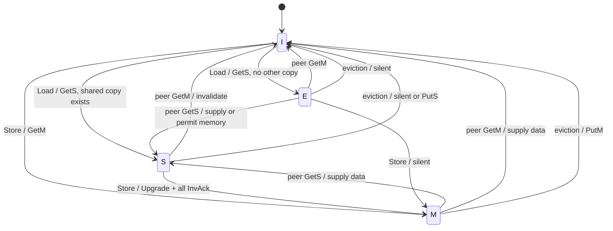

# Cache Coherence — From MESI States to a Correct Controller

> **Prerequisites:** [CPU_Architecture](../../02_CPU/01_Core_Foundations/01_CPU_Architecture.md) §8–§9 (the single-writer/multiple-reader (SWMR) and data-value contracts, plus the distinction between coherence and consistency), [Cache_Microarchitecture](../01_Cache_Hierarchy/01_Cache_Microarchitecture.md) (tags, miss-status holding registers (MSHRs), write-back, inclusion), and [AHB_AXI_APB](../../04_Interconnect/01_Protocols/01_AHB_AXI_APB.md) (requests, responses, and backpressure).
> **Hands off to:** [ACE_and_CHI](../../04_Interconnect/01_Protocols/02_ACE_and_CHI.md) (AXI Coherency Extensions (ACE) and Coherent Hub Interface (CHI): how snoop/directory transactions ride a real fabric), [Network_on_Chip](../../04_Interconnect/02_Network_on_Chip/01_Network_on_Chip.md) (routing, virtual channels, and protocol deadlock), and [gem5](../../07_Simulators/02_CPU_and_System/01_gem5.md) §4 (executable protocol models in Ruby and the Specification Language for Implementing Cache Coherence (SLICC)).

---

## 0. Why this page exists

The four MESI letters are the easy part of coherence. A stable-state diagram can say “on a store, move S→M after invalidating the sharers,” but real hardware cannot perform that arrow atomically. The request takes cycles to cross the network; invalidations and acknowledgements return separately; data may arrive before permission; another core may request the same line halfway through; a replacement may collide with the outstanding miss; and every queue can backpressure. During those intervals the line is neither safely S nor safely M. A controller therefore needs **transient states, transaction storage, serialization, and a progress argument** in addition to the familiar stable states.

This chapter bridges the gap between the protocol-level view in [CPU_Architecture §8](../../02_CPU/01_Core_Foundations/01_CPU_Architecture.md) and the fabric-level realization in [ACE_and_CHI](../../04_Interconnect/01_Protocols/02_ACE_and_CHI.md). It answers the questions a microarchitect or verification engineer faces:

- Which contract belongs to coherence, which belongs to consistency, and which belongs to synchronization?
- What messages and transient states are forced by a split-transaction network?
- How do simultaneous requests for one line become a single legal order?
- Why can a protocol be safe yet hang, and how do virtual channels prevent that?
- How large are the directory, transaction table, and acknowledgement counters?
- How do false sharing, atomics, direct memory access (DMA), and cache maintenance expose the protocol to software and devices?
- Which invariants and cover traces turn the protocol into something sign-off can trust?

The organizing claim is simple: **stable states express permission; transient states express unfinished obligations.** A correct controller must track both.

---

## 1. Three contracts that are often confused

Coherence, consistency, and synchronization solve different problems. Treating them as synonyms produces both hardware bugs and bad performance reasoning.

| Contract | Scope | Question it answers | Typical mechanism |
|---|---|---|---|
| **Cache coherence** | one physical cache line at a time | Which agent may read or write this line, and which value is newest? | MESI/MOESI, snoops or directory |
| **Memory consistency** | order among accesses to many addresses | In what orders may other harts observe my loads and stores? | Total Store Order (TSO), RISC-V Weak Memory Ordering (RVWMO), acquire/release, fences |
| **Synchronization** | program-level coordination | When may one thread enter a critical section or consume published data? | locks, atomics, barriers, condition variables |

Coherence supplies two per-line invariants:

1. **Single-Writer/Multiple-Reader (SWMR):** either one cache has write permission and no other valid copy exists, or one or more caches have read permission and none may write.
2. **Data-value:** a load of line \(X\) returns the value of the latest store before it in \(X\)'s coherence order.

These invariants do **not** impose a total order across different lines. Consider a producer that stores data to \(D\) and then sets flag \(F\), while a consumer waits for \(F\) and then reads \(D\). A coherent machine can keep each line individually correct while allowing the consumer to observe new \(F\) and old \(D\) under a weak consistency model. A release store to \(F\) and an acquire load of \(F\), or an appropriate fence, supplies the missing cross-address order. Conversely, a fence cannot make two dirty copies of the *same* line legal; only coherence prevents that.

**A useful review rule:** when a bug report says “stale data,” first ask whether the stale value is from the same address (usually coherence/cache-maintenance) or from a different address whose publication was reordered (usually consistency/synchronization). The symptom is similar; the violated contract is not.

---

## 2. Stable permission states — the part software can pretend is atomic

MESI is a distributed permission system. The stable state stored beside each cache tag answers three implementation questions:

- Is the line present and readable?
- Does this cache have exclusive write permission?
- Is memory stale, making this cache responsible for the newest data?

| State | Read locally | Write locally | Other valid copies allowed | Memory current | Eviction action |
|---|---:|---:|---:|---:|---|
| **M — Modified** | yes | yes | no | no | send dirty data |
| **E — Exclusive** | yes | yes after silent E→M | no | yes | drop silently |
| **S — Shared** | yes | no | yes | yes | drop silently |
| **I — Invalid** | no | no | — | — | none |

MOESI adds **O — Owned**: a dirty but shared state. One owner remains responsible for supplying the newest data and eventually writing it back, while other caches hold clean shared copies. Owned avoids forcing a memory write on every dirty producer→consumer handoff, at the cost of another stable state and a rule that exactly one dirty owner exists.



The diagram is a **permission abstraction**, not a complete controller. Each edge labelled with a request actually expands into allocation, arbitration, network traversal, directory lookup, snoops, acknowledgements, optional data forwarding, installation, and only then completion. The stable diagram hides that latency in the same way an ISA instruction hides its pipeline.

### 2.1 The minimal message vocabulary

Names vary across protocols, but the obligations force a small common vocabulary:

| Abstract message | Purpose | Typical names |
|---|---|---|
| request read permission | obtain data, allow sharing | GetS, ReadShared |
| request write permission | obtain data and sole ownership | GetM/GetX, ReadUnique |
| upgrade permission | S→M when requester already has data | Upgrade, MakeUnique |
| invalidate | revoke another cache's copy | Inv, SnpUnique |
| acknowledgement | prove a revocation or completion happened | InvAck, CompAck |
| clean replacement | inform directory or maintain inclusion | PutS/PutE, Evict |
| dirty replacement | return newest data and relinquish ownership | PutM/PutO, WriteBack |
| data response | transfer a full line or critical beat | Data, CompData |
| retry or negative acknowledgement | release blocked resources and try later | RetryAck, NACK |

An optimization may combine messages, omit a clean replacement, or forward data cache-to-cache. It cannot omit the underlying obligation. Before granting a writer, the system must know every old reader is invalid; before forgetting a dirty owner, it must preserve that owner's data somewhere.

---

## 3. Why transient states are unavoidable

Suppose a core has line \(X\) in S and executes a store. It sends Upgrade and waits for invalidation acknowledgements. During that wait it may not write—the old sharers still exist—but it is no longer an ordinary S line either: a second local store should merge behind the first transaction rather than launch another Upgrade, an eviction must not discard transaction state, and a forwarded snoop must be answered according to the in-flight request. Call the state **SM**: started in S, waiting to become M.

The same construction produces a family of transient states:

| Transient state | Stable source → target | Outstanding obligation |
|---|---|---|
| **IS** | I→S | wait for data/read permission |
| **IM** | I→M | wait for data and exclusive permission |
| **SM** | S→M | wait for all invalidation acknowledgements |
| **MI** | M→I | wait for dirty writeback acceptance/completion |
| **EI/SI** | E/S→I | wait for a replacement or inclusion acknowledgement if required |

Real protocols subdivide these states because **data and permission can arrive independently**. An IM transaction might have the data but still wait for two invalidation acknowledgements, or have all acknowledgements but still wait for the owner to forward data. Those are observably different obligations and often become states such as IM\(_D\) (need data), IM\(_A\) (need acknowledgements), and IM\(_{AD}\) (need both). The exact names are not important; the product of outstanding conditions is.

### 3.1 Transaction storage: MSHR, TBE, or transient buffer

The cache tag RAM is optimized for one stable state per resident line. In-flight transactions need more metadata, so controllers normally allocate a transaction entry—called an MSHR (miss-status holding register), TBE (transaction buffer entry), or protocol transaction table entry—with fields such as:

| Field | Why it exists |
|---|---|
| block address | identify messages for this transaction |
| transient state / pending operation | interpret the next event |
| requested final permission | distinguish read miss from write miss |
| expected and received acknowledgement count | prove all old sharers were revoked |
| data-present and permission-present bits | allow split arrival order |
| dirty byte/sector mask | preserve partial writes |
| merged local request list | wake every load/store waiting on this line |
| retry/backoff state | avoid duplicate requests and livelock |
| victim/writeback information | serialize a colliding replacement |

The transaction table is associative by block address because a response carries an address or transaction ID, not a cache-private entry number. A second miss to the same line **merges** into the existing entry when compatible. A load may merge behind IS; a store behind IS may require changing the target to M or waiting until the read transaction completes, depending on protocol support. A conflicting replacement or maintenance operation generally stalls or occupies a separate writeback buffer.

### 3.2 The acknowledgement counter is a proof, not bookkeeping

If a directory reports \(K\) old sharers and grants write permission immediately after sending \(K\) invalidations, the new writer can race ahead while a stale reader still holds S. The writer may enter M only after the protocol has evidence that every revocation completed. That evidence is the count

\[
A_{\text{remaining}} = K - A_{\text{received}}.
\]

The SM/IM transaction completes only when \(A_{\text{remaining}}=0\) **and** required data has arrived. Acknowledgement counting is therefore a hardware proof of SWMR. Directory protocols may initialize the count from the sharer vector; broadcast protocols may use a combined response or a fixed participant count, but the proof obligation is identical.

---

## 4. Four traces every controller must get right

### 4.1 Read miss to an unshared clean line: I→E

1. L1 allocates an IS entry and sends GetS.
2. The home/directory finds no sharers and memory is authoritative.
3. Data returns with an “exclusive-clean” indication.
4. The requester installs E, frees the transaction entry, and wakes merged loads.

E is valuable only if the home can prove there is no other copy. A non-inclusive hierarchy therefore needs a snoop filter/directory even when the last-level cache does not hold the data.

### 4.2 Read miss to a dirty owner: I→S while M→O/S

```mermaid
sequenceDiagram
    participant R as Requester L1
    participant H as Home / directory
    participant O as Dirty owner L1
    participant M as Memory

    R->>H: GetS(X)
    Note over H: directory says owner=O, memory stale
    H->>O: Forward/GetS snoop
    O-->>R: Data(X)
    O-->>H: owner response
    H-->>R: completion / shared permission
    Note over O,R: O becomes O (or S after writeback); R becomes S
    Note over M: memory is updated now in MESI, or later in MOESI
```

The critical rule is that memory must not supply stale data while a dirty owner exists. MESI commonly forces the owner to write back/downgrade to S; MOESI lets it retain O and defer memory traffic. Direct cache-to-cache transfer shortens latency, but completion must still pass through the serialization logic that records the new sharer.

### 4.3 Store miss or read-for-ownership: I→M

A store to an absent line needs both the current bytes (for a sub-line write) and exclusive permission. The requester sends GetM. The home serializes the request, invalidates all sharers or recalls the owner, gathers acknowledgements, and returns data/permission. Only after both conditions are true may the store update the line and retire according to the core's consistency rules.

For a whole-line overwrite, the implementation may avoid fetching old data if byte enables prove every byte will be replaced. This **write-no-allocate/zero-fill ownership** optimization saves bandwidth but must still obtain write permission; overwriting does not waive invalidation.

### 4.4 Upgrade: S→M without refetching data

Upgrade is GetM with the data response suppressed because the requester already has a clean copy. It is safe only while that copy remains valid and no intervening writer can change the value. The home serializes Upgrade with every other request for the line; losing a race may force retry or a full GetM.

*Worked traffic number.* Four sharers hold \(X\), including requester C0. C0 upgrades. The home sends three invalidations and receives three acknowledgements: six control messages, plus request and grant = **eight control messages, zero data lines**. A naive GetM that refetched the 64-byte line would add at least one data transfer. Upgrade attacks data bandwidth, not the fundamental \(O(K)\) revocation cost.

---

## 5. Races: the protocol is a distributed serializer

The home (or an atomic snoop bus) establishes a total **coherence order per line**. Different lines can proceed independently; requests for the same line must appear as one legal sequence.

### 5.1 Two simultaneous writers

C0 and C1 both issue GetM(\(X\)). The home accepts one first, say C0:

1. C0's transaction invalidates old sharers and completes to M.
2. C1 remains queued, receives Retry/NACK, or is held in a pending slot.
3. When C1's turn arrives, the home recalls dirty data from C0 and grants M to C1.

At no instant may both observe completion with write permission. Fair arbitration is a **liveness** requirement—C1 must eventually win—not a safety requirement. A fixed-priority arbiter can preserve SWMR forever while starving one core forever.

### 5.2 Snoop collides with a local transient

Assume C0 is in SM waiting for invalidation acknowledgements when C1's GetM reaches it. C0 cannot answer as ordinary S (it has an outstanding claim to M) or as M (permission is incomplete). Designs choose one of three policies:

- **NACK/retry the snoop:** simple controller, more traffic and a possible livelock problem.
- **Forward the snoop into the outstanding transaction:** lower latency, larger transient state space.
- **Order all conflicts at the home and suppress impossible snoops:** pushes complexity into centralized serialization and pending queues.

Every choice moves complexity; none removes it. The verification state space is dominated by exactly these collisions, not by the four stable states.

### 5.3 Replacement races

A set may choose \(X\) as a victim just as a snoop for \(X\) arrives. The controller must serialize tag lookup, victim capture, and snoop response so the line is never “between structures.” A dirty victim copied into a writeback buffer is still a coherent owner until the home accepts the PutM; the buffer must therefore snoop-hit and supply data. This is why writeback buffers carry tags and protocol state, not just data.

### 5.4 Early data and early permission

Optimized fabrics let data travel directly from owner to requester while the home sends permission separately. The requester may forward the critical word to a waiting load early, but it may not expose a store until exclusive permission and acknowledgements complete. Separating **data-valid** from **permission-valid** is both a performance feature and a common bug source.

### 5.5 Stale responses, retries, and transaction identity

Messages for one address can take different paths and arrive out of order. A requester may abandon an attempt after Retry/NACK, issue a new transaction, and then receive a delayed response from the old attempt. Matching only the block address is insufficient: the late response could corrupt the new transaction's acknowledgement count or install data under the wrong permission.

Protocols therefore carry a transaction identifier, source identifier, or retry epoch, and the TBE records the expected identity. A response is consumed only if all identifying fields match the live transaction. When identifiers wrap, hardware must prove no older message with the reused value remains in flight—usually by bounding outstanding transactions and not reusing an ID until completion. This is the same anti-aliasing rule used by Arm Advanced Microcontroller Bus Architecture (AMBA) Advanced eXtensible Interface (AXI) transaction IDs and reorder-buffer tags: a name may be recycled only after every observer has released the old meaning.

Retries need a second invariant. A NACK must unwind any partial reservation—home busy bit, credit, pending counter, or data-buffer slot—before the requester tries again. Otherwise each retry leaks one resource and eventually deadlocks. If two symmetric requesters always retry in lockstep, the protocol can livelock while remaining deadlock-free; randomized/exponential backoff, queueing at the home, or a fair priority token breaks the symmetry. Verification should cover “NACK followed by delayed old response followed by new request,” not only clean retry.

---

## 6. Snooping, directories, and the storage–traffic trade

Snooping discovers holders by asking everyone. A directory remembers holders and asks only them. The choice changes where the system pays:

| Mechanism | Metadata cost | Request traffic | Natural serialization | Best fit |
|---|---:|---:|---|---|
| shared snoop bus | little/no directory | \(O(N)\) probes per transaction | bus order | small clusters |
| snoop filter + broadcast domain | tag-only holder hints | filtered broadcast | central filter/order point | medium coherent islands |
| full-map directory | \(N\) sharer bits per tracked line | \(O(K)\) targeted messages | home per line | modest core counts |
| sparse directory | pointers for common few-sharer case | \(O(K)\), overflow action | home per line | many cores, mostly private data |
| coarse vector | one bit per group/cluster | targeted within groups, broadcast inside group | hierarchical homes | chiplets/large meshes |

### 6.1 Full-map directory sizing

For \(L\) tracked lines and \(N\) coherent agents, a full sharer vector needs \(L\times N\) bits, plus owner/state/tag overhead. A 64 MiB last-level cache (LLC) with 64-byte lines has

\[
L=\frac{64\cdot2^{20}}{64}=2^{20}=1{,}048{,}576\text{ lines}.
\]

At 64 agents, sharer bits alone are

\[
2^{20}\times64\text{ bits}=64\text{ Mib}=8\text{ MiB}.
\]

That is 12.5% of the LLC data capacity before tags, error-correcting code (ECC), owner, and replacement bits. At 256 agents it becomes 32 MiB—half the data array. Directory representation is therefore an architectural choice, not incidental metadata.

### 6.2 Sparse directories and overflow

Most lines are private or shared by only a few agents, so a sparse directory stores \(P\) owner/sharer pointers rather than \(N\) bits. With \(P=4\) and \(N=256\), four 8-bit pointers cost 32 bits instead of 256. When a fifth sharer arrives, hardware must choose:

- broadcast on overflow;
- evict one sharer by invalidating it;
- switch to a coarse bit-vector/group encoding;
- allocate a larger overflow entry.

Sparse directories compress the common case by making the rare many-sharer case slower. Locks, barriers, and read-mostly code are exactly the patterns that exercise overflow, so the choice must be workload-driven.

### 6.3 Inclusive LLC versus snoop filter

An inclusive last-level cache (LLC) proves that an LLC miss means no private cache holds the line, but duplicates all private-cache data. A non-inclusive LLC preserves data capacity but needs a separate tag-only snoop filter/directory to prove absence. Evicting the directory entry while private copies remain requires **back-invalidating** those copies or moving their metadata elsewhere; otherwise the system forgets a holder and can later grant unsafe exclusivity.

---

## 7. Performance pathologies software can create

### 7.1 True sharing versus false sharing

Coherence operates at line granularity, typically 64 bytes, while software objects may be 4 or 8 bytes.

- **True sharing:** two cores access the same bytes and at least one writes. Communication is semantically necessary.
- **False sharing:** cores write different bytes that occupy the same line. The protocol still transfers exclusive ownership of the entire line, so the line ping-pongs although the variables are logically independent.

If C0 increments an 8-byte counter in the first half of a line and C1 increments another counter in the second half, every alternating store can require a GetM, a dirty intervention, a 64-byte transfer, and acknowledgements. With one store every 20 cycles per core at 3 GHz, the pair attempts \(2\times3\,\text{GHz}/20=300\) million stores/s. If ownership alternates and each transfer moves 64 bytes, data traffic alone approaches

\[
300\times10^6\times64 \approx 19.2\text{ GB/s},
\]

for two 8-byte counters—before control traffic. Padding or per-core counters removes the sharing and can collapse that traffic nearly to zero.

### 7.2 Coherence misses: the fourth C

The classic compulsory/capacity/conflict taxonomy assumes one cache. Multicore adds **coherence misses**: a line that would still be present was invalidated by another agent's write. They divide into true-sharing and false-sharing misses, which require different fixes. More capacity or associativity cannot repair them; reduce communication, change data layout, batch updates, or place threads/data to shorten the coherence path.

### 7.3 Lock contention and the spinning pattern

A naive test-and-set lock repeatedly writes the lock line, forcing ownership to bounce among waiters. Test-and-test-and-set spins on loads in S and attempts a write only when the lock appears free, reducing invalidations. Queue locks go further: each waiter spins on a private or predecessor-owned line, turning one hot all-sharer line into point-to-point handoffs. The algorithm changes the coherence traffic shape even though the ISA atomics are identical.

### 7.4 Prefetch and speculative ownership

A read prefetch may add a harmless sharer; a prefetch-for-write or speculative GetM can invalidate useful copies before the core actually stores. Aggressive ownership prefetch reduces store latency when accurate but magnifies false sharing and wasted invalidations when wrong. It should be throttled using accuracy and observed coherence interference, just as data prefetch is throttled for pollution.

---

## 8. Atomics, fences, DMA, and maintenance

### 8.1 Atomics need both coherence and an ordering contract

An atomic read-modify-write (RMW) first obtains exclusive ownership, then performs the read and write indivisibly at the architectural serialization point—often the L1 while it holds M, or the home/system cache for fabric atomics. Coherence prevents another writer from intervening on that line. Acquire/release or fence semantics determine how accesses to *other* lines may move around the RMW.

This split explains why “the cache line was locked” is incomplete. A lock acquire needs atomicity on the lock word **and** acquire ordering for later protected loads; unlock needs a release store so earlier protected writes become visible before the lock is published free.

### 8.2 Non-coherent DMA

A device that reads memory without participating in coherence can observe stale memory while a CPU holds M. A device write can leave stale CPU copies. Software must therefore:

1. clean/write back dirty CPU lines before device reads;
2. invalidate CPU lines before consuming device-written data;
3. order cache maintenance with device doorbells using the platform's required barriers.

An I/O-coherent agent instead issues coherent reads/writes through the home, letting the protocol snoop CPU caches. This removes much software maintenance but adds directory clients, traffic, and verification cases. **Coherent does not automatically mean ordered:** memory-mapped I/O (MMIO) doorbells and DMA buffers can still require barriers because device ordering is a separate contract.

### 8.3 Instruction/data coherence

Self-modifying code and just-in-time compilation write bytes through the data-cache path and later fetch them through the instruction-cache path. Many architectures do not make the I-cache automatically coherent with D-cache writes. Software must clean the modified data line to the point of unification, invalidate the corresponding instruction line, and execute the required barriers. The protocol may be perfectly coherent among D-caches while the instruction fetch still sees an old copy.

### 8.4 Aliases and physical identity

Coherence is defined on a physical line. Virtually indexed caches must ensure synonyms—two virtual addresses mapping the same physical page—cannot create independently writable copies in different sets. The virtually indexed, physically tagged (VIPT) geometry constraint, page coloring, synonym detection, or physical indexing supplies that identity before coherence can enforce SWMR.

---

## 9. Correctness is safety plus liveness

### 9.1 Safety invariants

At minimum, assert these properties per line:

1. **At most one writer:** \(\sum_i [state_i\in\{M,E\}] \le 1\), extended appropriately when O is present.
2. **Writer excludes readers:** if any cache has M/E write permission, every other cache is I.
3. **Dirty uniqueness:** at most one cache/writeback buffer owns data newer than memory.
4. **Directory soundness:** every valid private copy is represented by the directory/snoop filter, unless a precisely defined broadcast fallback covers it.
5. **Data-value:** a completed load returns the latest value in the serialized per-line write order.
6. **Acknowledgement soundness:** a grant to M implies every required invalidation acknowledgement was received for the same transaction epoch.
7. **Transaction uniqueness:** at most one active home transaction owns serialization for an address, or multiple entries have a proved order.

Transient structures count. A dirty line in a writeback buffer is still the unique dirty owner; ignoring buffers is a classic way for an assertion to “prove” a broken design correct.

### 9.2 Liveness properties

Safety says nothing bad happens; liveness says something good eventually happens:

- every accepted request eventually completes or receives retry;
- a retried requester that continues requesting is eventually serviced (fairness);
- credits and queue entries eventually return;
- no cycle of message dependencies can leave all controllers waiting forever;
- a replacement/maintenance operation cannot permanently block demand access to its line.

Liveness proofs require assumptions: the network eventually delivers accepted messages, arbiters are fair, memory eventually responds, and reset/error recovery is excluded or modeled explicitly.

### 9.3 Protocol deadlock and virtual networks

Request, snoop, response, and data messages create dependencies. If a cache blocks a response queue while waiting to send a request whose route waits on that same response queue, the system deadlocks even if the routing algorithm itself is deadlock-free. Coherent fabrics separate message classes into **virtual networks/channels** with an acyclic dependency order—for example, requests may cause snoops, snoops may cause responses, but responses must always drain without needing a new lower-priority request resource.

This is **protocol deadlock**, distinct from the channel-dependency deadlock of wormhole routing. [Network_on_Chip §4](../../04_Interconnect/02_Network_on_Chip/01_Network_on_Chip.md) supplies the routing theorem; the coherence controller must supply the message-class theorem.

---

## 10. Verification strategy: make races first-class

A useful verification plan has four layers:

### 10.1 Local controller checks

Unit-test every stable state against processor events, snoops, replacements, maintenance, errors, and every message arrival. Then repeat for every transient state. The event×state table—not the stable MESI diagram—is the real protocol specification. Unhandled combinations must be explicitly impossible by upstream arbitration or must produce retry; silently dropping one is never acceptable.

### 10.2 Directed end-to-end traces

Cover at least:

- I→E→M private read-then-write with no Upgrade;
- M owner supplies a peer GetS and downgrades correctly;
- \(K\)-sharer Upgrade waits for exactly \(K-1\) acknowledgements;
- simultaneous GetM requests produce one winner and later handoff;
- snoop collides with IS, IM, SM, and dirty writeback;
- data arrives before permission and permission before data;
- directory/snoop-filter eviction back-invalidates private copies;
- retry under full transaction tables eventually completes;
- DMA read/write with both coherent and maintenance-managed paths;
- reset, poison/error, and timeout behavior if the product supports them.

### 10.3 Random traffic plus a reference model

Generate loads, stores, atomics, evictions, maintenance, and backpressure across many agents. A simple golden memory model keeps a per-address serialized value and permission owner; a scoreboard compares every completed load and checks the permission set. Random delay on every channel is essential—zero-delay acknowledgements hide transient-state bugs.

### 10.4 Formal properties and bounded progress

Formal verification is unusually effective because coherence properties are local per address. Abstract data to one or two symbolic values, reduce the address space, and retain many agents symmetrically. Prove the safety invariants continuously; prove bounded response under fair-resource assumptions; and use cover properties to ensure contested traces such as M→O/S and simultaneous writers are reachable. Parameterized proof for arbitrary \(N\) is difficult, but symmetry and data independence let small-agent proofs expose most controller bugs.

**A sign-off trap:** a test that checks final memory after all caches flush can miss a transient stale read that occurred earlier. Scoreboard each *completed operation at its completion time*, not merely the final state.

### 10.5 Observability: counters that distinguish capacity from coherence

A correct protocol can still lose most of a workload's performance, so the controller needs counters that turn “memory is slow” into a specific cause. At minimum, count per requestor and home slice:

- GetS, GetM, and Upgrade requests;
- invalidations sent/received and acknowledgements waited for;
- dirty interventions and cache-to-cache data transfers;
- retries/NACKs, retry latency, and transaction-table-full cycles;
- directory hits, misses, sparse-directory overflows, and snoop-filter back-invalidations;
- line ownership changes and lines bouncing between two requestors;
- transient-state occupancy and high-water mark;
- cycles blocked by no TBE, no credit, no data buffer, or a busy same-address transaction.

Derived metrics are more diagnostic than raw counts. The **upgrade success ratio** separates useful S→M upgrades from races that fall back to GetM. **Invalidations per store** exposes true/false sharing. **Data bytes per useful written byte** exposes line-granularity amplification. **Mean TBE residence time** and Little's law connect offered load to capacity; if occupancy is high because residence time grew rather than arrival rate, the bottleneck is downstream latency/queueing rather than too few entries locally. A two-requestor ownership-transition matrix quickly identifies ping-pong pairs, while a per-program-counter (PC) or per-page sample can point software to the offending data structure.

Counters must avoid creating a new critical path. Increment local narrow event counters, sample expensive address/PC attribution, and aggregate off the request path. Verification should cross-check counters against scoreboard events; an observability block that undercounts retries or double-counts merged misses sends architects toward the wrong fix.

---

## 11. Performance model and design decisions

For a coherence transaction, a useful first-order latency decomposition is

\[
T_{\text{coh}} =
T_{\text{req→home}}
+T_{\text{dir}}
+\max(T_{\text{snoop round trip}},\,T_{\text{data source}})
+T_{\text{grant→req}}
+T_{\text{queue}}.
\]

The max appears because snoop/acknowledgement work and data retrieval can overlap; queueing dominates near saturation. For an uncontended private E hit, \(T_{\text{coh}}=0\) on the local critical path. For a dirty remote owner across a mesh, two or three network legs plus queueing can make a “cache hit somewhere” slower than an LLC hit.

Traffic per transaction is approximately

\[
B_{\text{coh}} \approx B_{\text{control}}(2+2K) + B_{\text{data}}D,
\]

where \(K\) is the number of targeted sharers, the two fixed control messages are the request and completion/grant, and \(D\in\{0,1,\ldots\}\) is the number of line transfers/writebacks. Protocols can combine an acknowledgement with data or a completion, so this is an accounting model rather than an exact packet count. It exposes the two independent optimizations:

- directories, sparse encodings, and sharer prediction reduce **control fanout** \(K\);
- E, O, Upgrade, direct cache transfer, and whole-line stores reduce **data movement** \(D\).

| Design choice | Wins | Costs / risk | Prefer when |
|---|---|---|---|
| MESI vs MSI | silent private E→M | another semantic state | private data common |
| MOESI O state | defers dirty writeback | dirty shared ownership complexity | producer–consumer traffic common |
| direct cache transfer | lower dirty-owner latency | split data/permission races | mesh/fabric supports forwarding |
| inclusive LLC | cheap holder discovery | duplicate capacity, back-invalidations | small private-cache aggregate |
| non-inclusive + snoop filter | data capacity efficiency | separate metadata and eviction rules | large private caches/core counts |
| full-map directory | simple exact sharers | \(O(N)\) bits per line | modest \(N\) |
| sparse/coarse directory | scalable storage | overflow latency/traffic | large \(N\), few sharers normally |
| NACK/retry | simpler conflict handling | livelock and extra traffic | rare collisions, strong fairness |
| queued home transactions | fewer retries | home storage and head-of-line blocking | high contention |

---

## 12. Numbers to memorize

| Quantity | Useful order of magnitude | Why it matters |
|---|---:|---|
| cache line | 64 B common | coherence granularity; false sharing |
| private L1 MSHRs/TBEs | ~8–32 | outstanding local misses/upgrades |
| shared/home transactions | tens to hundreds per slice | mesh bandwidth–delay product |
| snoop cluster scale | ~4–16 agents | broadcast remains practical |
| directory scale | tens to hundreds+ | targeted messages replace broadcast |
| full-map directory bits | \(N\) per tracked line | grows linearly with agent count |
| Upgrade with \(K\) total sharers | \(K-1\) Inv + \(K-1\) Ack | revocation proof cost |
| uncontended E→M | 0 coherence messages | why E exists |
| false-sharing transfer | usually one full line per handoff | tiny variables can burn GB/s |
| coherence verification focus | transient states and races | stable MESI is a small fraction of state space |

---

## 13. Worked problems

**1 — Size a full-map directory.** A 32 MiB LLC uses 64-byte lines and serves 48 agents. Sharer bits:

\[
L=\frac{32\cdot2^{20}}{64}=524{,}288,\qquad
S=L\cdot48=25{,}165{,}824\text{ bits}=3\text{ MiB}.
\]

Add a 6-bit owner field, 3 protocol bits, and 2 status bits per line:

\[
524{,}288\cdot11/8 \approx 0.69\text{ MiB}.
\]

Total before ECC/tags is **3.69 MiB**, 11.5% of the LLC data. A four-pointer sparse directory needs \(4\lceil\log_2 48\rceil=24\) sharer bits/line instead of 48, halving the sharer store, but it must define overflow behavior.

**2 — Prove an Upgrade cannot complete early.** C0, C1, C2, and C3 hold S. C0 requests M. The home sends invalidations to C1–C3, so \(A_{\text{remaining}}=3\). C1 and C3 acknowledge; the count becomes 1. If C0 writes now, C2 can still read its S copy: writer and reader coexist, violating SWMR. Only C2's acknowledgement makes the count 0 and completes the proof that C0 is sole owner. The counter is not a latency hint; it is the guard on the S→M transition.

**3 — Separate coherence from consistency.** Producer executes \(D=42; F=1\). Consumer observes \(F=1\) then reads \(D=0\). Could coherence still be correct? **Yes.** Each line can return its latest value in its own coherence order while the weak memory model exposes the \(F\) store before the \(D\) store to the consumer. Use release on the store to \(F\) and acquire on the load of \(F\) (or stronger fences) to order the two addresses. If the consumer instead reads an old value of \(F\) after a newer store to the same line is complete in its coherence order, that is a coherence/data-value failure.

**4 — Quantify false sharing.** Two cores alternately update independent 8-byte counters on one 64-byte line at 50 million updates/s each. Every update transfers ownership and one 64-byte line. Approximate data traffic:

\[
2\cdot50\times10^6\cdot64=6.4\text{ GB/s}.
\]

Padding each counter onto a separate line lets each core retain M; after the first ownership acquisition, steady-state coherence data traffic is approximately zero. The cost is 128 bytes instead of 16—an 8× footprint increase traded for 6.4 GB/s less interconnect traffic.

**5 — Size a transient table by Little's law.** A home slice accepts 0.4 new coherence transactions/cycle and average completion latency is 45 cycles. Required mean occupancy:

\[
N=\lambda W=0.4\cdot45=18\text{ entries}.
\]

Eighteen entries only hold the average; burst tolerance and queueing require margin. At 2× headroom choose at least 36, typically round to **48 or 64 entries**. If the slice has only 16 entries, backpressure begins before the target rate even in the average case.

**6 — Find the deadlock cycle.** A request queue cannot drain until it emits an invalidation; the invalidation queue cannot drain until it emits an acknowledgement; the response queue holding that acknowledgement cannot drain because its consumer waits for a free request entry. Dependency cycle:

\[
Q_{\text{req}}\rightarrow Q_{\text{snoop}}\rightarrow Q_{\text{resp}}\rightarrow Q_{\text{req}}.
\]

Break it by reserving response capacity and making responses an escape class that never requires request resources to drain, or by separating classes into virtual networks with an acyclic dependency order. Adding total buffer capacity without breaking the cycle only makes deadlock rarer, not impossible.

---

## Cross-references

- **Contract above this chapter:** [CPU_Architecture](../../02_CPU/01_Core_Foundations/01_CPU_Architecture.md) §8–§9 (SWMR, data-value, and memory consistency), [RISC_V_ISA](../../02_CPU/01_Core_Foundations/02_RISC_V_ISA.md) (RVWMO, fences, and atomics).
- **Structures inside the controller:** [Cache_Microarchitecture](../01_Cache_Hierarchy/01_Cache_Microarchitecture.md) (MSHRs, writeback buffers, inclusion, replacement), [Memory](../04_Memory_Technologies/01_Memory_Arrays_and_Technologies.md) (the static random-access memory (SRAM) and content-addressable memory (CAM) arrays that hold tags, directories, and transaction tables).
- **Transport below the protocol:** [ACE_and_CHI](../../04_Interconnect/01_Protocols/02_ACE_and_CHI.md) (ACE/CHI messages and home nodes), [Network_on_Chip](../../04_Interconnect/02_Network_on_Chip/01_Network_on_Chip.md) (mesh latency, virtual channels, and deadlock).
- **Executable and verifiable forms:** [gem5](../../07_Simulators/02_CPU_and_System/01_gem5.md) §4 (Ruby/SLICC stable and transient states), [Simulation_Methodology](../../07_Simulators/01_Methodology/01_Simulation_Methodology.md) (validation and error budgets), [Formal_Verification](../../../03_Frontend_RTL_and_Verification/12_Formal_Verification.md) (safety/liveness properties).
- **System clients:** [GPU_Architecture](../../05_GPU/01_Core_Architecture/01_GPU_Architecture.md), [NPU_Accelerators](../../06_NPU/01_Compute_Dataflows/01_NPU_Accelerators.md), and [DDR_Controller](../05_Main_Memory/01_DDR_Controller.md) (coherent accelerators and the final memory authority).

---

## References

1. Nagarajan, V., Sorin, D. J., Hill, M. D., and Wood, D. A., *A Primer on Memory Consistency and Cache Coherence*, 2nd ed., 2020. The invariant-first treatment, stable protocols, directories, consistency, and verification.
2. gem5 Project, [Ruby cache-coherence protocols](https://www.gem5.org/documentation/general_docs/ruby/cache-coherence-protocols/) and [SLICC](https://www.gem5.org/documentation/general_docs/ruby/slicc/). Executable stable/transient controller states, messages, transaction buffers, and network integration.
3. Arm, *AMBA CHI Architecture Specification* and [AMBA 5 CHI protocol overview](https://developer.arm.com/community/arm-community-blogs/b/soc-design-and-simulation-blog/posts/introducing-new-amba-5-chi-protocol-enhancements). Request, home, and subordinate nodes; point of coherence; snoop filtering, direct transfer, and atomics.
4. RISC-V International, [RVWMO explanatory material](https://docs.riscv.org/reference/isa/unpriv/mm-eplan.html). The normative boundary between memory consistency, coherence/cacheability, fences, and I/O ordering.
5. Hennessy, J. L. and Patterson, D. A., *Computer Architecture: A Quantitative Approach*, 6th ed., 2019. Shared-memory multiprocessors, directory sizing, and coherence performance.
6. Martin, M. M. K. et al., “Multifacet's General Execution-driven Multiprocessor Simulator (GEMS) Toolset,” *Computer Architecture News*, 2005. Protocol modeling and the Ruby memory-system lineage.

---

⬅ prev [DDR Memory Controller](../05_Main_Memory/01_DDR_Controller.md) · [Memory Index](../00_Index.md) · [Architecture Book Contents](../../00_Index.md) · next ➡ [Interconnect](../../04_Interconnect/00_Index.md)
