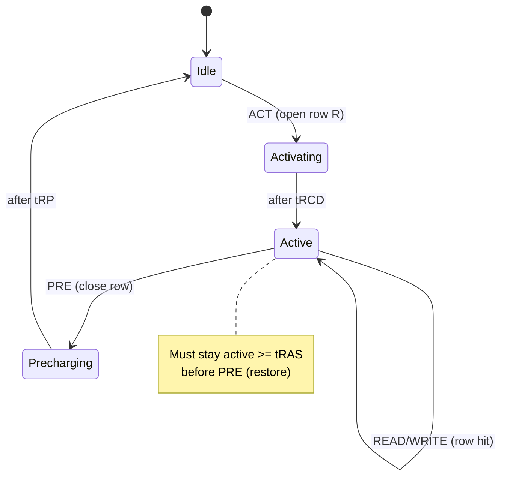

# DDR Memory Controller — Why DRAM Needs a Scheduler

> **Prerequisites:** [Memory](03_Memory.md) (the 1T1C cell, charge sharing, sense amplifier, refresh *physics* this page treats as given), [CMOS_Fundamentals](../../00_Fundamentals/01_CMOS_Fundamentals.md) (signal integrity, the power-grid droop that timing constraints protect), [Cache_Microarchitecture](01_Cache_Microarchitecture.md) (the row buffer read as a one-entry cache).
> **Hands off to:** [DRAM_Simulators](../07_Simulators/03_DRAM_Simulators.md) (the same timing, policies, and queueing turned into an executable model), [AHB_AXI_APB](../04_Interconnect/01_AHB_AXI_APB.md) (the AXI/CHI bus the requestors arrive on), [CPU_Architecture](../02_CPU/01_CPU_Architecture.md) (the memory stalls this latency becomes).

---

## 0. Why this page exists

**"Random Access Memory" is a lie for DRAM.** The load/store abstraction the core issues — a flat array with uniform latency and no history — describes an SRAM. A DRAM *device* is a stateful, timing-constrained, self-erasing, shared analog machine, and it violates every clause of the flat-RAM contract: its access latency depends on what it did last, its commands are illegal unless spaced by device physics, reading it destroys the data, its cells forget on a millisecond clock, and one channel is fought over by every core, the GPU, and the DMA engines at once.

The memory controller is the entire apparatus that manufactures the flat-RAM illusion on top of that device — and the *imperfection* of the illusion **is** the memory-system performance model. This page derives the controller from the four ways DRAM breaks the abstraction (§1), then builds up the structures each break forces: the bank as a state machine whose row-hit/miss/conflict split sets the whole cost model (§2), the JEDEC timing constraints as the *physics each one protects* rather than a parameter table (§3), open-vs-closed page as a locality *prediction* (§4), FR-FCFS as the resolution of a locality-vs-fairness trade (§5), refresh as a mandatory background tax (§6), and the achieved-bandwidth-and-loaded-latency model that ties it together with the same queueing intuition the ROB uses (§7). ECC/RAS (§8) and DDR5/LPDDR5X (§9) close it out as concepts. What is deliberately *cut*: the command-encoding truth tables, the per-signal pin lists, the controller-FSM RTL, and the address-bit dumps — none of them teach *why* the controller is shaped the way it is. The executable form of everything here lives on the [DRAM_Simulators](../07_Simulators/03_DRAM_Simulators.md) page; this page is the hardware and the physics.

---

## 1. Why DRAM is not RAM: four broken clauses, one controller

Four properties of the device each break a clause of the flat-RAM contract, and each forces a specific obligation onto the controller. Read the controller as the sum of these four obligations, not as a block diagram.

| DRAM property | Clause of "flat RAM" it breaks | Obligation it forces on the controller |
|---|---|---|
| **Stateful** — each bank holds one *open row* in its sense-amp array; access cost depends on whether the wanted row is the open one | "latency is uniform" | Track per-bank open-row state; a *policy* for when to keep or close it (§2, §4) |
| **Timing-constrained** — every command pair has a minimum spacing set by charge-sharing, restore, precharge, and supply-current physics | "any access is legal any time" | Enforce a large set of per-bank and per-channel timers; never issue an illegal command (§3) |
| **Destructive + leaky** — reading a row depletes the cells, and cells leak charge in milliseconds | "reads are non-destructive and data persists" | Restore-on-read (built into the timing) and *refresh* every row on a deadline (§6) |
| **Shared** — one command bus and one data bus serve many banks and many requestors | "accesses are independent" | *Schedule*: choose which pending request to serve to maximize locality and bank parallelism, fairly (§5, §7) |

Collapse the four obligations and the controller is one thing: **a constraint-satisfaction scheduler over a stateful, timed automaton.** Each bank is a small state machine with an open-row register; each cycle the controller must, among all pending requests, find the commands that are *legal now* (all timers satisfied, bank in the right state) and pick the one that best serves throughput without starving anyone or missing a refresh deadline. Every named block in a real controller — bank-state table, timing checker, refresh engine, FR-FCFS arbiter, write batcher, ECC path — is a piece of that one sentence. The rest of this page derives them.

---

## 2. The bank as a state machine, and the row buffer's three cases

### 2.1 Why the row buffer exists at all

The row buffer is not a cache someone *added* for speed — it is the **sense-amplifier array, which is mandatory**, repurposed. A DRAM read is destructive charge sharing: a cell's tiny storage capacitor ($C_s \approx 20\text{–}30$ fF) dumps onto a much larger bitline capacitance ($C_{bl} \gg C_s$), developing only tens of millivolts, which a cross-coupled sense amp must regeneratively latch to full rail before anything is readable ([Memory §DRAM](03_Memory.md)). Having paid to sense an *entire row* (~8 KB) at once, leaving it latched to serve further column accesses is free spatial locality. So the row buffer is the physical consequence of the sense operation, and it behaves as **a fully-associative cache of exactly one entry per bank** — the analogy the [Cache_Microarchitecture](01_Cache_Microarchitecture.md) page makes rigorous.

### 2.2 The bank FSM and the three cases that are the whole cost model

A bank is *idle* (bitlines precharged to $V_{dd}/2$, no row open) or *active* (one row latched in the sense amps). Four commands are its verbs: **ACTIVATE** opens a row (idle → active), **READ/WRITE** access columns of the open row (active → active), **PRECHARGE** closes it (active → idle), and **REFRESH** services decay (§6). The controller's per-bank state is not a signal dump but three facts: *is a row open and which one* (the row tag), *when did it open / last get accessed* (for timing and policy), and *when is each next command legal* (the timer deadlines).

Which transition a new request triggers — and therefore its cost — depends entirely on the open-row state, giving **three cases that are the entire DRAM performance model**:

| Case | Bank state vs. request | Command sequence | Latency to first data |
|---|---|---|---|
| **Row hit** | wanted row is already open | READ/WRITE | $t_{CL}$ (~14 ns) |
| **Row empty** (closed) | no row open | ACT → READ | $t_{RCD}+t_{CL}$ (~28 ns) |
| **Row conflict** | a *different* row is open | PRE → ACT → READ | $t_{RP}+t_{RCD}+t_{CL}$ (~42 ns) |

**Deriving the three latencies from the FSM.** Each case is just the sum of the timing gaps the bank must traverse on its walk from its *current* state to *data-on-the-bus* — there is nothing to memorize once you read the path off the state diagram. Write $t_{CAS}\equiv t_{CL}$ (CAS latency — the column-command-to-data delay) and trace each walk:

- **Row hit** — the bank is already in `Active` with the wanted row latched, so the controller issues `READ` at once and pays only the column pipeline: $L_{\text{hit}}=t_{CAS}$.
- **Row empty** — the bank is `Idle`; the walk is `Idle` →(`ACT`)→ `Activating` →(wait $t_{RCD}$)→ `Active` →(`READ`)→ data, i.e. the sense delay *then* the column delay: $L_{\text{empty}}=t_{RCD}+t_{CAS}$.
- **Row conflict** — the bank is `Active` on the *wrong* row, so you must first `PRE` it back to `Idle` (cost $t_{RP}$) before the row-empty walk can even begin: $L_{\text{conflict}}=t_{RP}+t_{RCD}+t_{CAS}$.

The three costs **nest**: each harder case prepends exactly one more mandatory transition ($+t_{RCD}$ to open a closed bank, then a further $+t_{RP}$ to first close a wrong one), so they emerge in the ratio $1:2:3$ whenever the three guards are comparable — and in JEDEC parts they are, because $t_{RP}\approx t_{RCD}\approx t_{CAS}$. *Worked number* (representative DDR5 timings $t_{RCD}=t_{RP}=t_{CAS}\approx 14$ ns; the ns values barely move across DDR5 speed bins — only the *cycle counts* grow to hold them roughly fixed):

$$
L_{\text{hit}}=14\ \text{ns}, \qquad L_{\text{empty}}=14+14=28\ \text{ns}, \qquad L_{\text{conflict}}=14+14+14=42\ \text{ns} \;\;\Longrightarrow\;\; 1:2:3 .
$$

**The activate-to-activate floor is a *rate* limit, not part of these latencies.** The conflict cost above charges only $t_{RP}$ for the close, which silently assumes the wrong row had already been open long enough to finish its destructive-read *restore* — that $t_{RAS}$ (§3) has elapsed since its `ACT`. That same assumption couples the cases to a throughput ceiling: one bank cannot begin two activations closer together than

$$
t_{RC}=t_{RAS}+t_{RP}\quad(\text{restore-then-precharge, same bank}),
$$

because the row must stay open $\ge t_{RAS}$ before `PRE` and the `PRE` itself costs $t_{RP}$. So while a conflict's *latency to first data* is $t_{RP}+t_{RCD}+t_{CAS}\approx 42$ ns, the *sustained rate* of new rows on one bank is one per $t_{RC}=t_{RAS}+t_{RP}\approx 32+14=46$ ns — the number §7.2 turns into the "one bank delivers ~5% of the data bus" result, and the reason bank-level parallelism (§7.2) is mandatory rather than optional. (Only if a row were closed *immediately* after opening — before $t_{RAS}$ — would the conflict latency swell to $t_{RAS}+t_{RP}+t_{RCD}+t_{CAS}$; a competent scheduler never precharges a just-activated row, so the $\le 3\times$ bound holds in practice.)

Everything else on this page is a lever on the ratio of these three cases. A hit is ~3× faster than a conflict, so the row-*hit rate* is the single number the scheduler (§5), the page policy (§4), and the address mapping (§4.3) all exist to maximize — and the *conflict* rate is what the achieved-bandwidth model (§7) pays for. There is no bit-field table to memorize here; those three cases *are* the controller's reason for being.

---

## 3. JEDEC timing constraints as physics, not parameters

A datasheet lists dozens of `t`-parameters; memorizing them teaches nothing. Every one is a guard that says *"a physical event must finish before the next command is safe,"* and there are only a few distinct physical events. Learn the events and the parameters follow — and, crucially, so does *which knob moves which number*.

- **$t_{RCD}$ (ACT → column) protects the sense.** The wordline must rise, the whole row must charge-share onto the bitlines, and the sense amps must regeneratively resolve that ~tens-of-mV signal to a readable rail. You cannot read a column before the amps have latched. This is the irreducible "open a row" latency; it is set by cell/bitline capacitance and amp gain, and it barely improves generation to generation (~14 ns for a decade).
- **$t_{RAS}$ (ACT → PRE minimum) protects the *restore*.** Because the read was destructive, the sense amps must *write full charge back* into the cells before the row closes. Precharge before restore completes and the cells are left half-charged → silent retention failure. $t_{RAS}$ is the restore deadline (~32–35 ns).
- **$t_{RP}$ (PRE → next ACT) protects the *reference*.** PRECHARGE equalizes both bitlines back to exactly $V_{dd}/2$ and disconnects the amps, so the *next* row's tiny charge-share signal is measured against a clean reference. Precharge too fast and a bitline offset corrupts the next sense.
- **$t_{RC}=t_{RAS}+t_{RP}$ (same-bank ACT → ACT) is the bank's fundamental cycle time** — the whole open-restore-precharge loop, ~45–50 ns. **This single number is why bank-level parallelism is not optional:** one bank delivers at most one *new row* every $t_{RC}$, which as §7 shows is ~5% of the data bus. Bandwidth on anything but streaming traffic comes from overlapping many banks' $t_{RC}$, not from making $t_{RC}$ small.
- **$t_{CL}$ / CWL (column command → data) is pure pipeline latency** — column decode and the drive path to the pins. It sets *when data appears*, not when the core is ready for the next command, which is why lowering CL helps latency but not throughput.
- **$t_{RRD}$ and $t_{FAW}$ protect the *power grid*, not the array.** Each ACTIVATE slams a large transient current as it charges thousands of bitlines and drives a wordline off the on-die $V_{PP}$ pump. $t_{RRD}$ staggers consecutive ACTs to different banks; $t_{FAW}$ caps activations to **four in any sliding window**. These are the only constraints about $di/dt$ and supply droop — they exist because four simultaneous row openings would collapse the rail. This is why a burst of misses to many banks is throttled even when the array itself is idle.
- **$t_{CCD\_L}$ vs. $t_{CCD\_S}$ is the reason bank groups exist.** The internal prefetch datapath is shared *within* a bank group and cannot cycle at the full external rate, so same-group column commands must be spaced $t_{CCD\_L}$ (8 tCK) while different-group commands need only $t_{CCD\_S}$ (4 tCK). Bank groups were introduced in DDR4 precisely because the DRAM core stopped keeping up with the doubling I/O rate; parallelizing column commands *across* groups is how the slow core keeps the fast bus fed.
- **Bus turnaround ($t_{WTR}$, $t_{RTW}$) protects the shared bidirectional DQ bus.** DQ is source-synchronous and driven from both ends; reversing direction means stopping one driver, re-settling termination/ODT, re-aligning the DLL capture phase, and guarding against two drivers overlapping (a dead short). The several-ns cost of a read↔write switch is the entire reason writes are *batched* (§5.2).

**The handful worth carrying** — with the event each protects, so you can reconstruct the rest:

| Parameter | DDR4-3200 | Physical event it guards | Consequence |
|---|---|---|---|
| $t_{RCD}$ | ~14 ns | charge-share + sense-amp latch | cost to open a row |
| $t_{RP}$ | ~14 ns | bitline equalize to $V_{dd}/2$ | cost to close a row |
| $t_{RAS}$ | ~35 ns | destructive-read charge restore | floor on how briefly a row can stay open |
| $t_{RC}$ | ~49 ns | full open→restore→precharge loop | **one new row per bank per $t_{RC}$ → forces bank parallelism** |
| $t_{FAW}$ | ~21–30 ns | supply-current droop from 4 ACTs | throttles activation-heavy (miss-heavy) traffic |

Everything else in a datasheet is a variation on these events, and the full analog collapse of them into constants is exactly what a [DRAM simulator abstracts](../07_Simulators/03_DRAM_Simulators.md).

---

## 4. Row-buffer policy: a spatial-locality predictor

### 4.1 The policy is a bet on the next access

After serving a request, the controller faces one decision: **keep the row open** (bet the next access to this bank hits it) or **precharge immediately** (bet it will not, and hide $t_{RP}$ now while the bank is idle). This is a branch predictor for spatial locality, and the two pure policies are the two static predictions:

- **Open-page** keeps the row latched. A subsequent same-row access is a *hit* ($t_{CL}$ only), but a subsequent *different*-row access is a *conflict* — it pays $t_{RP}$ on the critical path that a closed bank would not.
- **Closed-page** auto-precharges after every access. It forecloses hits (every access is at best row-empty) but moves $t_{RP}$ *off* the critical path — the precharge happens eagerly during idle, betting there is idle time to hide it, which there is exactly when the bank is not immediately re-accessed.

### 4.2 The break-even, and why it lands near 50%

Let $h$ = row-hit probability. Open-page pays the hit cost on a fraction $h$ and the full conflict cost on the rest; closed-page always pays the row-empty cost:

$$
L_{open}=h\,t_{CL}+(1-h)\,(t_{RP}+t_{RCD}+t_{CL}), \qquad L_{closed}=t_{RCD}+t_{CL}
$$

Setting them equal and solving gives a clean result — the break-even hit rate is set purely by the *ratio* of precharge to activate cost:

$$
\boxed{\,h^{\star}=\frac{t_{RP}}{t_{RP}+t_{RCD}}\,}
$$

where $t_{RP}\approx t_{RCD}$ in every JEDEC part, so $h^{\star}\approx 0.5$. **Above ~50% hit rate, keep rows open; below it, close them.** The number is not magic — it is 0.5 only because precharge and activate cost about the same. This is why streaming code (hit rates >95%, §7) always wants open-page and pointer-chasing (<10%) always wants closed-page, and why neither static policy is right for the mixed 30–60% hit rates of real server traffic.

### 4.3 Adaptive policy is a real predictor; address mapping is the other half

Because $h$ varies per bank and over time, modern controllers **predict** it: an *access-count* scheme keeps the row open only while consecutive hits keep arriving and closes after the first miss; a *timeout* scheme closes a row that has gone unaccessed for $N$ cycles, reclaiming $t_{RP}$ during the lull. This is the same confidence-counter idea as branch prediction, applied to spatial locality.

The predictor only sees the traffic it is *given*, and **address mapping decides that traffic** — it is the locality-vs-parallelism knob, and the one place the old bit-field dumps hid a genuine trade-off. Which physical-address bits select the column, row, bank, and channel determines whether consecutive cache lines land in the *same row* (maximizing row-buffer hits, good for streaming and open-page) or *spread across banks and channels* (maximizing bank parallelism, good for random traffic and for hiding $t_{RC}$, §7). You cannot have both from one mapping: low-order bits to the bank give parallelism at the cost of locality; low-order bits to the column give locality at the cost of parallelism. XOR-based hashing of bank bits with row bits is the common compromise — it scatters pathological strides that would otherwise pound one bank while preserving in-row sequentiality.

Quantitatively, the mapping chooses *where on the §2.2 cost curve the traffic lands*. Put the bank/channel-selecting bits **low** (just above the cache-line offset) and consecutive lines stripe across banks: a sequential burst then activates many banks at once, driving the in-flight bank count toward the $\lceil t_{RC}/t_{\text{burst}}\rceil\approx 19$ needed to hide $t_{RC}$ (§7.2) — but consecutive lines no longer share a row, so the row-hit rate $h$ collapses and open-page (§4.2) loses its bet. Put those bits **high** and a whole 8 KB row (128 lines) maps to one bank before the address advances to the next: $h\to 1$ on a stream (open-page wins — §7.2's "128 hits per `ACT`") but any burst pounds a *single* bank at the $\eta_{1\text{bank}}\approx 5\%$ ceiling. The two knobs are in direct opposition — one mapping cannot maximize both $h$ *and* the bank count — so every scheme is a chosen point between the **streaming corner** ($h\!\uparrow$, parallelism$\downarrow$) and the **random corner** (parallelism$\uparrow$, $h\!\downarrow$), which is exactly why the XOR hash targets the *middle* (some of each) rather than either extreme. The concrete bit assignment is a per-platform tuning parameter; the *trade* is the concept.

---

## 5. FR-FCFS: scheduling from the locality-vs-fairness trade

### 5.1 Why in-order service throws away the row buffer

The scheduler's job is the §1 sentence made concrete: each cycle, over all pending requests, issue a command that is **legal now** (its bank is in the right state and every timer is satisfied) and that best serves throughput. Serving requests in arrival order — plain FCFS — is *correct* and *fair* but leaves the row buffer's value on the floor: an old request targeting a *closed* row will force a conflict (PRE+ACT) even when a younger request to the *currently open* row could be served for free. FCFS ignores the state that dominates the cost model.

### 5.2 The derivation

Reorder to exploit the open row. **First-Ready, First-Come-First-Served (FR-FCFS)** is the greedy policy that does exactly this, with a two-level priority:

1. **Row hits first** — among ready commands, prefer a column command to an already-open row.
2. **Oldest first** — break ties (and choose among row-miss requests) by age.

The benefit of promoting a row hit over an older conflict is the case-cost gap from §2.2 — about $t_{RP}+t_{RCD}\approx 28$ ns of service time saved per promotion — and the only cost is *aging* the deferred request. Age as the tiebreaker bounds that unfairness, and a **starvation cap** (force-promote any request older than a threshold) bounds the worst case, converting a potentially unbounded wait into a guaranteed one. FR-FCFS is therefore a hill-climb on row-buffer locality with fairness bolted on as a guardrail — the resolution of the locality-vs-fairness trade, not an arbitrary priority list. It has been the default since Rixner et al. (2000); fairness-first variants (stall-time-fair, TCM) reweight the age term for multi-core QoS but keep the row-hit-first core.

**Why reordering pays, quantified.** Collapse the two cases into one number. If a stream presents a row-hit fraction $h$ to a bank, its mean access latency is the hit/miss weighted average

$$
\bar L(h)=h\,t_{CAS}+(1-h)\,\big(t_{RP}+t_{RCD}+t_{CAS}\big),
$$

where the miss branch is billed at the *conflict* cost because under open-page (§4) a miss means a different row is latched. This is linear in $h$ with slope $-(t_{RP}+t_{RCD})$, so **every point of row-hit rate is worth $t_{RP}+t_{RCD}\approx 28$ ns of average service time** — exactly the per-promotion saving above, now integrated over the stream. Since a bank's throughput is $1/\bar L$, lifting $h$ lifts delivered bandwidth by the same factor.

The scheduler's leverage is that $h$ is not a fixed property of the workload — it is the *realized* hit rate, and ordering sets it. At any instant a bank holds one open row; among its queued requests, some target that row (would-be hits) and some do not. Serve a non-hit first and you `PRE` the row out from under every queued hit, **demoting them all to conflicts** — which is precisely what in-arrival-order FCFS does. FR-FCFS instead drains all ready hits to the open row *before* closing it, converting the queue's *available* spatial locality into *realized* hits. So FR-FCFS does not merely save 28 ns on one request; it raises the whole stream's effective $h$ toward the locality actually present in the scheduling window. *Worked number* (DDR5 $t_{CAS}=14$, $t_{RP}=t_{RCD}=14$ ns, so conflict $=42$ ns): a workload whose realized hit rate reordering lifts from $20\%$ to $60\%$ sees

$$
\bar L(0.20)=0.2(14)+0.8(42)=36.4\ \text{ns}, \qquad \bar L(0.60)=0.6(14)+0.4(42)=25.2\ \text{ns},
$$

a $36.4/25.2=\mathbf{1.44\times}$ gain in per-bank throughput (a 31% latency cut) from the *ordering alone*, with no change to the DRAM. That is why every real controller starts from FR-FCFS rather than FCFS, and why the fairness guardrail (age tiebreak + starvation cap) is bolted *around* a row-hit-first core rather than replacing it.

Two mechanisms ride on top, each amortizing a fixed cost:

- **Write batching** amortizes bus turnaround (§3). Because every read↔write switch costs several ns of dead bus, the controller *accumulates* writes in a buffer and drains them in bursts — reads run until the write buffer crosses a high-water mark (~75%), then writes drain to a low-water mark, cutting turnarounds to ~one per batch. Reads are latency-critical and writes are not (the store already retired), so this asymmetry is nearly free.
- **QoS** reweights age for real-time requestors (display, camera) that have hard deadlines a throughput-optimal schedule would miss; the [AXI](../04_Interconnect/01_AHB_AXI_APB.md) `AxQOS` tag carries the priority in.

The essential point: FR-FCFS, write batching, and QoS are three terms of one objective — maximize row-hit throughput, minus turnaround waste, subject to fairness and deadline constraints.

---

## 6. Refresh: the mandatory background tax

DRAM cells leak through subthreshold and junction paths, so every row must be rewritten before its weakest cell forgets — a retention deadline of **64 ms** at ≤85 °C (and, because leakage roughly doubles every ~10 °C, *halving* at higher temperature). JEDEC discretizes this into 8192 REFRESH commands per 64 ms window:

$$
t_{REFI}=\frac{t_{REFW}}{8192}=\frac{64\text{ ms}}{8192}\approx 7.8\ \mu s, \qquad \rho_{ref}=\frac{t_{RFC}}{t_{REFI}}
$$

where $t_{REFI}$ = average interval between refreshes, $t_{RFC}$ = time a refresh occupies the device, and $\rho_{ref}$ = the bandwidth it steals.

**Why the tax is set by density, not by how you chunk it.** Read $\rho_{ref}$ off a conservation identity rather than off the two datasheet symbols. In one retention window $t_{REFW}$, every row of the rank must be rewritten exactly once; if the rank has $R$ rows and refreshing one row's worth of cells occupies the device core for a fixed $\tau_{\text{row}}$, then the device is busy refreshing for $R\,\tau_{\text{row}}$ out of every $t_{REFW}$:

$$
\rho_{ref}=\frac{R\,\tau_{\text{row}}}{t_{REFW}}=\frac{t_{RFC}}{t_{REFI}},
$$

the last equality because $t_{RFC}=(\text{rows per REF})\cdot\tau_{\text{row}}$ and $t_{REFI}=t_{REFW}\big/(R/\text{rows per REF})$, so "rows per REF" cancels. **The overhead is $R\,\tau_{\text{row}}/t_{REFW}$ no matter how finely you slice the refreshes**: issuing twice as many REF commands (DDR5's move — $t_{REFI}\approx 3.9\ \mu s$, i.e. 16 384 REF per 64 ms vs DDR4's 8 192) halves *both* $t_{RFC}$ and $t_{REFI}$ and leaves $\rho_{ref}$ untouched. What actually moves $\rho_{ref}$ is $R$, the rows per rank — which is why refresh is fundamentally a **density** tax: double the capacity at a fixed retention window and you double the fraction of time the rank is dark. DDR5's finer chunking only *bounds $t_{RFC}$* so a single command does not stall the channel for half a microsecond; it cannot cut the density-driven $\rho_{ref}$, which is exactly why DDR5 *also* added same-bank refresh (below).

*Worked numbers.* DDR4-3200, 16 Gb: $\rho_{ref}=t_{RFC}/t_{REFI}=550/7800=7.0\%$. DDR5, 16 Gb (REFab $t_{RFC}\approx 295$ ns, $t_{REFI}=3.9\ \mu s$): $\rho_{ref}=295/3900=7.6\%$ — *higher* than DDR4 at equal density despite the doubled refresh rate, the density trend in the flesh. Heat the die past 85 °C so $t_{REFI}$ halves to $1.95\ \mu s$ and it jumps to $295/1950=15\%$: at high density and temperature, refresh alone eats a *sixth* of the channel. Same-bank refresh (DDR5 SBR, below) is the response — it shrinks the *system-visible* stall by keeping most bank groups live, even though the aggregate $R\,\tau_{\text{row}}$ is unchanged.

Framed the other way, $t_{RFC}$ **grows with density** — more rows are refreshed per command — so refresh is a tax that worsens every generation: ~350 ns (8 Gb) → ~550 ns (16 Gb) DDR4, i.e. 4.5% → 7% of all bandwidth, and it *doubles again* on a hot die where $t_{REFW}$ halves. Refresh is why raw DRAM density does not translate to usable bandwidth for free.

The controller has two forms of relief, both exploiting slack:

- **Timing slack.** JEDEC lets the controller *postpone* up to 8 refreshes (accumulate a debt, repaid before the window closes) or *pull in* refreshes early during idle ("sneak" them when the request queue is empty). This ±8-$t_{REFI}$ freedom lets refresh dodge critical traffic — at the risk of a "refresh storm" if too many are deferred to the window's end.
- **Spatial slack.** *Per-bank* refresh (DDR4) and *same-bank* refresh (DDR5 SBR) refresh only a subset of banks, leaving the rest available to serve requests — trading a longer *aggregate* refresh time for a much lower *system-visible* stall, because 75% of the device keeps working. This becomes essential at high density where all-bank refresh would idle the whole channel for half a microsecond at a time.

In the scheduler (§5), refresh is simply the highest-priority "request" once its deadline approaches, with the postpone/pull-in slack giving the arbiter room to place it where it hurts least.

---

## 7. The achieved-bandwidth model and latency under load

### 7.1 Peak is a fiction; achieved bandwidth is a product of losses

Peak bandwidth is trivial and almost never seen:

$$
BW_{peak}=N_{ch}\times W\times r
$$

where $N_{ch}$ = independent channels, $W$ = data-bus width in bytes, and $r$ = data rate in transfers/s — a plain *count of wires × toggle rate*, which is why it is a fiction: it assumes the data bus carries burst payload on every single beat, which it never does. Per 64-bit channel ($W=8$ B): DDR4-3200 gives $1\times 8\times 3200\ \text{MT/s}=25.6$ GB/s; a **DDR5-6400 channel** gives $1\times 8\times 6400\ \text{MT/s}=51.2$ GB/s, delivered as two independent 32-bit subchannels of $8/2\times 6400=25.6$ GB/s each (§9.1).

Achieved bandwidth is peak multiplied by every efficiency the device physics costs you:

$$
BW_{ach}=BW_{peak}\times \eta_{row}\times(1-\rho_{ref})\times(1-\rho_{turn})\times \eta_{bank}
$$

where $\eta_{row}$ = row-buffer efficiency (fraction of time the bus carries burst data vs. waits for ACT/PRE), $\rho_{ref}$ = refresh overhead (§6), $\rho_{turn}$ = read/write turnaround loss (§5.2), and $\eta_{bank}$ = how well bank parallelism hides the losses. Real systems land at **40–60% of peak**; the derivation below shows why, and which term dominates.

### 7.2 Why bank parallelism is mandatory, quantitatively

The data bus is busy only during a burst: BL8 at DDR4-3200 occupies $4\ \text{tCK}=2.5$ ns. But a single bank cannot open a new row faster than $t_{RC}\approx 49$ ns. So a stream of *conflicts to one bank* utilizes the bus at

$$
\eta_{1\text{bank}}=\frac{t_{burst}}{t_{RC}}\approx\frac{2.5}{49}\approx 5\%
$$

— the device delivers 5% of its own peak. The only escape is to overlap the $t_{RC}$ of one bank with the *bursts* of others, which requires enough independent in-flight banks to cover the cycle time:

$$
N_{banks}\gtrsim \frac{t_{RC}}{t_{burst}}\approx\frac{49}{2.5}\approx 20
$$

This is **Little's law for the memory system** — the same bandwidth-delay-product argument that sizes an OoO ROB ([OoO_Execution §3.2](../02_CPU/03_OoO_Execution.md)), with $t_{RC}$ playing the role of miss latency and banks playing the role of MLP. It explains the bank counts directly: DDR4 provides 16 banks per rank and DDR5 provides 32 (two subchannels × 16) precisely so that random, miss-heavy traffic has enough independent banks to approach peak.

Formally this **is** Little's law $L=\lambda W$. Treat each bank as a server that a new-row access occupies for $W=t_{RC}$, and demand a completion rate $\lambda=1/t_{\text{burst}}$ (one burst must leave the data bus every $t_{\text{burst}}$ to keep it saturated). Then the number of activations that must be *simultaneously in flight* is $L=\lambda W=t_{RC}/t_{\text{burst}}$, and since each in-flight activation sits in a distinct bank, that $L$ *is* the bank count; rounding up for the partial bank, $N_{\text{banks}}=\lceil t_{RC}/t_{\text{burst}}\rceil$. *Worked number (DDR5-6400).* BL16 on a 32-bit subchannel delivers a 64 B line in $8\,t_{CK}=8\times 0.3125=2.5$ ns — DDR5 doubled *both* the data rate and the burst length, so $t_{\text{burst}}$ lands at the same 2.5 ns as DDR4-3200's BL8 — while $t_{RC}\approx 46$ ns, giving $N_{\text{banks}}=\lceil 46/2.5\rceil=\mathbf{19}$ banks to saturate one subchannel's bus. DDR5 supplies 16 banks per subchannel: just short on *pure* random traffic, closed by the row-locality that lets one activation feed several bursts (lowering the effective $\lambda$), and doubled in aggregate by the two independent subchannel schedulers (§9.1). DDR4's single 16-bank domain against the same ~20 requirement is why it tops out near 40–50% on random streams (Problem 1). Streaming traffic needs *no* such parallelism — one open row serves 128 consecutive cache-line hits (8 KB / 64 B), so one ACT amortizes over 128 bursts and $\eta_{row}\to 1$. **Two regimes, two mechanisms:** locality (row hits) carries streaming, parallelism (banks) carries random — and the achieved-bandwidth loss is whatever the address mapping (§4.3) and scheduler (§5) fail to extract of either.

### 7.3 Latency under load: why the datasheet number is not the latency

The unloaded latency of a DRAM access is small — $t_{RCD}+t_{CL}\approx 28$ ns at the device, plus controller queue. Yet the number the core is sized against ([OoO_Execution §3.2](../02_CPU/03_OoO_Execution.md) uses **100–300 cycles**) is far larger, because *under load the request waits in queues for the bank and the bus.* Model the channel as a server at utilization $\rho$; the mean sojourn time of an $M/M/1$ queue is

$$
\bar{T}_{load}=\frac{\bar{T}_{service}}{1-\rho}
$$

where $\bar{T}_{service}$ = mean time to actually serve a request once at the head and $\rho$ = offered load ÷ service rate. As traffic approaches saturation the $1/(1-\rho)$ term explodes: at $\rho=0.8$ the loaded latency is $5\times$ the service time, pushing an effective ~28 ns service toward ~100+ ns of observed latency. **This queueing singularity is the memory wall** — bandwidth and latency are not independent, and a memory system run near its bandwidth limit delivers punishing latency. It is exactly why big OoO windows exist (to tolerate the *loaded* latency, not the datasheet latency) and why a fixed-latency memory model is optimistic by construction — the point the [DRAM_Simulators](../07_Simulators/03_DRAM_Simulators.md) page formalizes as the reason cycle-level DRAM models exist at all.

---

## 8. ECC and RAS as concepts

DRAM is protected in layers because it fails in distinct ways, and each code targets a different **failure domain**. The mechanisms matter less than the domain each one covers.

- **SECDED — the soft-error / weak-cell layer.** A Hamming code with an overall parity bit adds 8 check bits to a 64-bit word (72-bit codeword, a 9th ×8 device on the DIMM) to **correct any single-bit error and detect any double**. This covers the dominant reliability threat — a cosmic-neutron or alpha-particle strike flipping one bit, or one marginal cell — at 12.5% storage overhead. It is the baseline for any server memory.
- **Chipkill — the device-failure layer.** If an entire ×4 or ×8 DRAM *chip* dies, it injects 4–8 bad bits into every accessed word — far beyond SECDED. The fix is to **spread the codeword across devices** (or use symbol-based Reed–Solomon over nibbles) so that one dead device contributes at most one bit (or one symbol) per codeword, keeping it correctable. This is RAS for the failure mode that actually takes servers down.
- **On-die ECC — the yield layer (DDR5).** At DDR5 process nodes, raw single-cell error rates rose so high that unaided yield became unshippable, so each DRAM chip now hides its *own* weak cells with an internal SECDED (typically 128 data + 8 check bits per internal word), correcting before data leaves the die. It is a **manufacturability** mechanism, invisible to and independent of system ECC — it protects the in-array domain, not the bus or a dead device, which is why it does not make system-level ECC redundant.
- **RowHammer — the disturbance layer.** Hammering one row with repeated activations leaks charge from physically adjacent rows and flips their bits — a reliability *and security* hazard. Mitigation is a scheduling obligation: **Target Row Refresh (TRR)** and DDR5 **Refresh Management (RFM)** track activation counts and inject targeted refreshes into victim rows, so the controller's refresh engine (§6) gains a data-dependent component.

The organizing idea: on-die ECC guards the cell, SECDED guards the word/link, chipkill guards the device, RFM guards against a malicious access pattern — four layers because there are four independent things that go wrong.

---

## 9. DDR5 and LPDDR5X as concepts

### 9.1 DDR5: finer channel granularity to feed a lagging core

The headline DDR5 change — splitting the 64-bit DIMM into **two independent 32-bit subchannels** (each 40-bit with ECC) — is the §7.2 parallelism argument applied at the channel level. As the DRAM core continues to lag the I/O rate, what the controller needs is not a wider bus but *more independent banks and row buffers* to hide $t_{RC}$: two subchannels give 2× the banks (32) and two independent command/scheduling streams. It also **matches burst granularity to the cache line**: a 64 B line is one BL16 burst on a 32-bit subchannel (16 × 32 b = 512 b = 64 B), leaving the *other* subchannel free for a concurrent, independent access — where DDR4's BL8 consumed the full 64-bit width for one line. Same access size, twice the concurrency. Same-bank refresh (§6) and on-die ECC (§8) complete the generation; both are responses to the density and error-rate pressure that finer granularity alone does not solve.

### 9.2 LPDDR5X: energy-per-bit as the objective function

LPDDR flips the objective from bandwidth/latency to **energy per bit**, because mobile traffic is bursty — long idle stretches punctuated by short bursts — so *idle and I/O power dominate*, and the design exploits idle to gate. Its features are all corollaries of that objective: a separate **WCK** data clock that can be gated off during idle (killing DQ-path clock power that DDR5's always-toggling DQS spends); **DVFS** across several V/f points with microsecond transitions to ride demand down to low power; **DBI** (data-bus inversion) to cap bit-transitions per byte; **partial-array self-refresh** to refresh only in-use rows; lower $V_{DD}/V_{DDQ}$; and **masked write (Write-X)** to update sub-bursts without a read-modify-write. The net is ~30–50% less power than DDR5 at equal data rate, bought with narrower channels and thinner timing margins — the right trade for a battery, the wrong one for a server. This is why LPDDR5X, not DDR5, feeds mobile SoCs and edge-AI NPUs where bandwidth-per-watt is the metric.

### 9.3 Scaling the form factor beyond one channel

When one channel is not enough, three approaches extend the controller's reach without faster DRAM cores, and each is a concept rather than a signal set. **MRDIMM** (JEDEC) and **MCR** (Micron) place a data buffer on the DIMM that *time-multiplexes two ranks* onto the external bus at 1.5–2× the per-rank rate — the controller sees a faster logical DIMM while the DRAM cores run at their native speed, at the cost of buffer latency and per-buffer training. **CXL Type-3** attaches DRAM over the PCIe/CXL PHY as *coherent, poolable* memory — a NUMA tier at ~2–3× local latency (protocol + link traversal on top of the DDR access), managed by page-placement policy rather than by the DDR controller directly. All three answer "more capacity/bandwidth per channel" without touching the physics of §3 — they wrap the same DDR controller in a wider or more distant interface.

---

## Numbers to memorize

Load-bearing values for DDR4-3200 and DDR5-5600, with the reason each matters. Timings in ns unless noted.

| Parameter | DDR4-3200 | DDR5-5600 | Why it matters (section) |
|---|---|---|---|
| Data rate (MT/s) | 3200 | 5600 | sets peak BW |
| Peak BW per channel | 25.6 GB/s | 44.8 GB/s | data rate × width; ceiling only (§7) |
| Bus width | 64 (+8 ECC) | 2×32 (+8 ECC each) | DDR5 splits into 2 subchannels (§9.1) |
| Banks per channel | 16 | 32 | bank parallelism to hide $t_{RC}$ (§7.2) |
| $t_{\text{burst}}$ (one 64 B line) | 2.5 ns (BL8) | ~2.5–2.9 ns (BL16) | bus-busy time per access; $N_{\text{bank}}$ denominator (§7.2) |
| Banks to saturate bus (random) | ~20 = ⌈49/2.5⌉ | ~17–19 = ⌈46/$t_{\text{burst}}$⌉ | Little's law $\lceil t_{RC}/t_{\text{burst}}\rceil$; bin-dependent (§7.2) |
| $t_{RCD}$ | ~14 | ~14 | open-row cost; barely scales (§3) |
| $t_{RP}$ | ~14 | ~14 | close-row cost; sets $h^{\star}\approx0.5$ (§4.2) |
| $t_{RAS}$ | ~35 | ~32 | restore deadline (§3) |
| $t_{RC}=t_{RAS}+t_{RP}$ | ~49 | ~46 | **bank cycle → forces ~20 banks (§7.2)** |
| $t_{CL}$ | ~14 | ~11–16 | data-return latency, not throughput (§3) |
| $t_{RFC}$ (8/16 Gb) | 350 / 550 | 195 / 295 | refresh occupancy; grows with density (§6) |
| $t_{REFI}$ | 7.8 µs | 3.9 µs | DDR4 = 64 ms/8192; DDR5 doubles REF freq (÷16384); halves when hot (§6) |
| $t_{FAW}$ | ~30 | ~21 | 4-ACT power-droop window (§3) |
| Burst → bytes | BL8 → 64 B | BL8/16 → 64/128 B | one cache line per burst (§9.1) |
| Row size | 8 KB (128 lines) | 8 KB | 128 consecutive hits when streaming (§7.2) |
| Refresh overhead (8/16 Gb) | 4.5% / 7% | ~5.0% / ~7.6% | $t_{RFC}/t_{REFI}$; DDR5 *higher* → drives SBR; doubles when hot (§6) |
| Row-buffer hit rate | 30–60% | 30–60% | workload-dependent; $h^{\star}\approx50\%$ (§4) |
| Achieved efficiency | 40–60% of peak | 40–60% | product of §7 losses |
| Loaded latency | ~80–150 ns | ~80–150 ns | queueing, not datasheet (§7.3) |

**Speed-bin note:** the ns timings above are ~invariant across DDR5 bins (only cycle counts grow to hold them fixed), so a faster **DDR5-6400** channel keeps these latencies while peaking at $8\ \text{B}\times 6400\ \text{MT/s}=51.2$ GB/s. Throughout, $t_{CAS}\equiv t_{CL}$ (CAS latency).

**The one to internalize:** row hit ≈ $t_{CL}$, row empty ≈ $t_{RCD}+t_{CL}$, row conflict ≈ $t_{RP}+t_{RCD}+t_{CL}$ — roughly **1 : 2 : 3** in cost. Every other number on this page is in service of shifting traffic toward the "1".

---

## Worked problems

**1 — Effective bandwidth from the loss product (§7.1).** DDR4-3200, peak 25.6 GB/s. At a 50% row-hit rate the average access takes $0.5\,t_{CL}+0.5(t_{RP}+t_{RCD}+t_{CL})=0.5(13.75)+0.5(41.25)=27.5$ ns against an ideal hit-only 13.75 ns, so $\eta_{row}=13.75/27.5=0.50$. With refresh $\rho_{ref}=4.5\%$, turnaround $\rho_{turn}=2\%$, and $t_{FAW}$ loss ~3%: $BW_{ach}=25.6\times0.50\times0.955\times0.98\times0.97\approx 11.6$ GB/s — **~45% of peak**, and $\eta_{row}$ is by far the largest loss. The lever with the most leverage is the hit rate, which is why §4–§5 are all about it.

**2 — Banks needed to saturate the bus (§7.2).** A BL8 burst occupies the DQ bus for $4\ \text{tCK}=2.5$ ns; a bank needs $t_{RC}\approx49$ ns between new rows. To keep the bus fully busy on miss-heavy traffic requires $N\gtrsim t_{RC}/t_{burst}\approx49/2.5\approx20$ independent banks streaming. DDR4's 16 banks per rank fall just short (hence the ~40–50% efficiency of problem 1 on random traffic); a second rank or DDR5's 32 banks closes the gap. Sequential-stream bandwidth, by contrast, needs *one* bank — 128 hits per open row — showing that bank count is a *random-access* bandwidth knob, not a streaming one.

**3 — Loaded vs. unloaded latency (§7.3).** Unloaded service is ~$t_{RCD}+t_{CL}\approx28$ ns. Drive the channel to $\rho=0.85$ utilization and the $M/M/1$ sojourn time is $28/(1-0.85)\approx187$ ns — matching the "100–300 cycle" DRAM latency the OoO ROB is sized for. Halving the offered load to $\rho=0.6$ drops it to $28/0.4=70$ ns. This is the quantitative memory wall: the *same* DRAM delivers 70 ns or 187 ns depending only on how hard it is pushed, which is why bandwidth headroom and latency are the same design variable.

**4 — Achieved bandwidth of a DDR5-6400 channel (§7.1).** Peak $=N_{ch}\times W\times r=1\times 8\ \text{B}\times 6400\ \text{MT/s}=51.2$ GB/s. At a 50% row-hit rate, $\eta_{row}=0.5$ (Problem 1's logic: mean access $0.5(14)+0.5(42)=28$ ns vs. hit-only 14 ns → $14/28=0.5$). With DDR5 16 Gb refresh $\rho_{ref}=7.6\%$ (Problem 5), turnaround $\rho_{turn}\approx3\%$, and $t_{FAW}/t_{RRD}$ residual $\eta_{bank}\approx0.97$: $BW_{ach}=51.2\times0.50\times0.924\times0.97\times0.97\approx \mathbf{22.3}$ GB/s — **~44% of peak**, delivered as two 25.6 GB/s subchannels each running ~44%. $\eta_{row}$ is again the dominant loss; refresh is now *second* (7.6%, up from DDR4's 4.5%), the direct motive for DDR5 same-bank refresh.

**5 — Refresh as a density-and-temperature tax (§6).** $\rho_{ref}=t_{RFC}/t_{REFI}$. DDR5 16 Gb at normal temp: $295/3900=7.6\%$. Move to 32 Gb ($t_{RFC}\approx455$ ns): $455/3900=11.7\%$ — density *alone* pushes past a tenth of the channel, because $\rho_{ref}\propto R$ (rows/rank) at fixed retention window. Now heat the die past 85 °C so $t_{REFI}$ halves to 1.95 µs: the 16 Gb part jumps to $295/1950=15\%$ and the 32 Gb part to $\approx23\%$. This is why high-density server DIMMs *must* use same-bank / fine-granularity refresh — all-bank refresh would idle up to a quarter of a hot, dense channel.

---

## Cross-references

- **Down the stack (what this controller is built on):** [Memory](03_Memory.md) — the 1T1C cell, charge sharing, sense amplifier, and refresh physics that §2–§3 treat as timing constants; [CMOS_Fundamentals](../../00_Fundamentals/01_CMOS_Fundamentals.md) — the signal integrity and power-grid droop that $t_{RCD}$, $t_{RP}$, and $t_{FAW}$ protect (§3).
- **Up the stack (what builds on it):** [DRAM_Simulators](../07_Simulators/03_DRAM_Simulators.md) — the same bank FSM, JEDEC guards, FR-FCFS, and queueing model as an *executable* cycle-level tool (its §8 formalizes §7.3 here); [Cache_Microarchitecture](01_Cache_Microarchitecture.md) — the row buffer as a one-entry cache and the 64 B line that sets burst granularity (§9.1); [OoO_Execution](../02_CPU/03_OoO_Execution.md) — the ROB/MLP window sized against the *loaded* DRAM latency of §7.3; [AHB_AXI_APB](../04_Interconnect/01_AHB_AXI_APB.md) — the AXI/CHI interface and `AxQOS` the requestors and §5.2 QoS ride on; [CPU_Architecture](../02_CPU/01_CPU_Architecture.md) — where this latency becomes a pipeline stall.
- **Adjacent:** [Performance_Modeling_and_DSE](../01_Modeling/01_Performance_Modeling_and_DSE.md) — where these bandwidth/latency models feed design-space exploration (its §11.1 uses this page's $t_{RC}$ as the *small-transfer latency floor* that caps the linear-bandwidth roofline, and its Little's-law occupancy argument is the compute-side twin of §7.2's bank-parallelism count); [GPU_Architecture](../05_GPU/01_GPU_Architecture.md) & [NPU_Accelerators](../06_NPU/01_NPU_Accelerators.md) — the GDDR/HBM and LPDDR5X variants of the same controller under different bandwidth/energy objectives (§9.2).

---

## References

1. Rixner, S., Dally, W.J., Kapasi, U.J., Mattson, P., and Owens, J.D., "Memory Access Scheduling," *ISCA*, 2000. The origin of FR-FCFS (§5).
2. Jacob, B., Ng, S.W., and Wang, D.T., *Memory Systems: Cache, DRAM, Disk*, Morgan Kaufmann, 2007. The canonical treatment of DRAM timing, banks, and controllers.
3. JEDEC, *JESD79-4 (DDR4)* and *JESD79-5 (DDR5)* SDRAM standards. Timing constraints, refresh, on-die ECC, SBR (§3, §6, §9).
4. Mutlu, O. and Moscibroda, T., "Stall-Time Fair Memory Access Scheduling for Chip Multiprocessors," *MICRO*, 2007. Fairness-first scheduling beyond FR-FCFS (§5).
5. Liu, J., Jaiyen, B., Veras, R., and Mutlu, O., "RAIDR: Retention-Aware Intelligent DRAM Refresh," *ISCA*, 2012. Refresh optimization from retention distributions (§6).
6. Kim, Y. et al., "Flipping Bits in Memory Without Accessing Them: An Experimental Study of DRAM Disturbance Errors" (RowHammer), *ISCA*, 2014. The disturbance layer of §8.
7. Chang, K. et al., "Understanding Latency Variation in Modern DRAM Chips," *SIGMETRICS*, 2016. Where the §3 timing margins actually come from.
8. Compute Express Link Consortium, *CXL 3.1 Specification*, 2023. Type-3 coherent memory expansion (§9.3).
