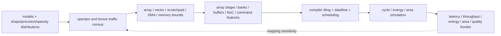

# NPU Workloads, Performance Modeling, and Design-Space Exploration

> **First-time reader orientation:** A neural processing unit (NPU) accelerates tensor operators by mapping loop nests onto repeated compute and a hierarchy of local/on-chip/off-chip memories. Peak operations per second says how many arithmetic units exist; realized performance depends on shapes, edge utilization, tiling, reuse, vector/normalization work, sparsity, communication, and graph dependencies.

> **Abbreviation key — skim now and return as needed:** neural processing unit (NPU); processing element (PE); multiply-accumulate (MAC); general matrix multiplication (GEMM); operations per second (OPS); tera operations per second (TOPS); high-bandwidth memory (HBM); static random-access memory (SRAM); direct memory access (DMA); network on chip (NoC); key-value (KV) cache; mixture of experts (MoE); design-space exploration (DSE); power, performance, and area (PPA); quality of service (QoS); service-level objective (SLO).

---

## 0. Freeze the NPU model contract

Record:

- framework/exported-graph revision, trained-weight hash, and preprocessing/tokenization;
- input tensor shapes, batch, image resolution, sequence lengths, vocabulary, and dynamic-shape policy;
- inference versus training, forward/backward/optimizer coverage;
- weight/activation/accumulator precision and quantization scales;
- structured/unstructured sparsity and actual nonzero/routing distributions;
- graph transformations, fusions, layouts, partitioning, and CPU/GPU fallbacks;
- accuracy/quality target and numerical tolerance;
- latency, throughput, energy, memory capacity, and tail-SLO boundary.

“Transformer inference” is incomplete without batch, prompt/decode length, KV-cache state, datatype, tensor/pipeline parallelism, and sampling/routing behavior. These parameters change both arithmetic and bytes.

## 1. Operators become loop nests and useful work

For GEMM $C_{M\times N}=A_{M\times K}B_{K\times N}$,

$$
N_{MAC}=MNK.
$$

State whether one MAC counts as one operation or two arithmetic operations. For a convolution, loops span batch, input/output channels, output spatial dimensions, and filter dimensions. Attention decomposes into query/key/value projections, score GEMM, mask/softmax/reductions, value GEMM, output projection, and KV-cache traffic.

High-level operator names are insufficient. The model needs dimensions, layout, precision, stride/padding/dilation, sparsity, and dependencies.

## 2. Systolic/spatial array cycle model

For a $P\times Q$ PE array mapping a GEMM tile $M_t\times N_t\times K_t$, a first compute bound is

$$
C_{ideal}=\left\lceil\frac{M_t}{P}\right\rceil
\left\lceil\frac{N_t}{Q}\right\rceil K_t.
$$

A systolic mapping adds fill/drain and edge underfill. Spatial utilization can be approximated by

$$
U_{spatial}=\frac{M_tN_t}{\lceil M_t/P\rceil P\;\lceil N_t/Q\rceil Q}.
$$

For small or skinny matrices, a large square array can have poor utilization. Batch/sequence/hidden dimensions determine whether extra PEs are useful.

The actual operator cycles are

$$
C_{op}=C_{compute}+C_{unhidden\ memory}+C_{vector}+C_{sync}+C_{reconfig},
$$

with legal overlap handled by an event/critical-path model rather than adding every isolated term.

## 3. Dataflow determines reuse and movement

Output-stationary, weight-stationary, input-stationary, row-stationary, and more general mappings choose which tensor values remain local while loops advance. A mapping specifies:

- temporal/spatial loop order;
- tile size at register, PE, cluster, SRAM, and off-chip levels;
- PE dimensions assigned to loop dimensions;
- multicast/reduction paths;
- double-buffering and DMA schedule;
- layout and bank/address mapping.

Compute count is usually fixed by the dense operator; dataflow primarily changes access count, bandwidth, utilization, and energy. It can also change cycles through bank conflicts, insufficient buffers, reduction serialization, and array underfill.

## 4. Hierarchical roofline and operational intensity

At memory level $l$,

$$
I_l=\frac{N_{ops}}{B_l},\qquad
P\le\min(P_{compute},I_lBW_l).
$$

Construct bounds for register/PE-local storage, shared SRAM, NoC, and HBM/DDR. A mapping can be HBM-efficient but limited by SRAM banks or reduction network.

For a double-buffered tile,

$$
T_{tile}\ge\max(T_{compute},T_{DMA}),
$$

after initial fill and final drain. If DMA takes longer, the array stalls by approximately $T_{DMA}-T_{compute}$ per steady tile. This is the bandwidth-balance condition:

$$
\frac{B_{tile}}{T_{compute}}\le BW_{delivered}.
$$

## 5. Scratchpad capacity constrains legal mappings

For double-buffered tiles,

$$
2(B_A+B_B+B_C+metadata)\le S_{usable},
$$

where usable SRAM is below nominal capacity because of banking, reserved regions, fragmentation, and alignment. A larger tile can improve reuse but reduce core concurrency or violate bank/port bandwidth.

Capacity alone is insufficient. For each cycle/phase check input, weight, output, and metadata read/write ports and banks. A mapping that fits but demands four reads from a two-bank structure is not executable at its predicted rate.

## 6. Vector, reduction, and special-function balance

Matrix units do not execute every graph node. Normalization, activation, softmax, sampling, embedding/gather, quantize/dequantize, transpose, and sparse metadata work use vector/scalar/reduction engines.

Define an engine balance:

$$
T_{op}\ge\max(T_{matrix},T_{vector},T_{reduction},T_{memory},T_{communication})
$$

when legal overlap exists. A high-TOPS matrix array can sit idle behind softmax/reduction or data-layout conversion. DSE must include vector lanes, special functions, reduction bandwidth, and queues between engines.

For an operator whose matrix and vector phases can overlap, let one matrix engine deliver $r_m$ operations/s and one vector lane deliver $r_v$. With $n_m$ matrix engines and $n_v$ vector lanes,

$$
T_{op}\ge\max\left(\frac{C_m}{n_mr_m},\frac{C_v}{n_vr_v},T_{memory},T_{communication}\right).
$$

Before memory limits, balanced allocation makes the first two terms approximately equal:

$$
\frac{n_m}{n_v}\approx\frac{C_mr_v}{C_vr_m}.
$$

This is workload-specific: Transformer prefill may justify more matrix throughput, while decode, softmax, normalization, and elementwise-heavy graphs raise vector/reduction demand. Area and power constraints turn the equality into a constrained search, and queues must be large enough for the assumed overlap. A single “tensor-to-vector unit ratio” is not universal.

## 7. Transformer and KV-cache regimes

Prefill processes many tokens and offers large GEMMs; autoregressive decode often processes one/few new tokens with large weight and KV-cache traffic. The same accelerator can be compute-bound in prefill and memory/latency-bound in decode.

For attention head dimension $d$, sequence length $L$, and heads $H$, KV-cache bytes grow roughly with

$$
B_{KV}\propto 2L H d\,b_{element}
$$

per layer and batch item, before compression/layout. Capacity, read bandwidth, and paging become architecture constraints. Record context-length distribution, not only maximum length.

## 8. Sparsity and MoE require value-dependent characterization

Theoretical sparsity does not equal skipped work. Effective speedup depends on:

- supported pattern/granularity;
- metadata encoding and decode bandwidth;
- load balance across PEs/cores;
- zero-detection/compaction cost;
- ability to skip memory as well as MACs;
- irregular gather/scatter and network traffic.

For MoE, routing creates per-expert token counts. Completion often follows the most loaded expert/partition, not the average. Record load distribution and tail imbalance. Dense shape-only simulation cannot claim dynamic sparsity or routing performance without value-derived metadata.

## 9. Graph completion is a dependency/resource schedule

For strictly sequential operators,

$$
T_{graph}=\sum_o T_o.
$$

With fusion, asynchronous DMA, multiple engines/cores, pipeline parallelism, or communication overlap, graph time is the longest dependency/resource-constrained path. Build a directed graph with edges for tensor dependencies and serialization on shared matrix engines, vector units, SRAM banks, DMA channels, NoC links, and DRAM.

Summing isolated layer latencies is pessimistic if overlap is legal and optimistic if shared-resource contention is omitted.

### 9.1 Scale-out communication belongs in the NPU workload model

A multi-die or multi-accelerator NPU may exchange tensor, pipeline-stage, expert-routing, or gradient traffic. For a ring all-reduce of $M$ bytes over $N$ devices, reduce-scatter and all-gather each take $N-1$ steps of $M/N$ bytes. Each device therefore transfers

$$
B_{ring}=2\frac{N-1}{N}M,
$$

and a first-order time model is

$$
T_{ring}\approx2(N-1)L_{step}+\frac{2(N-1)M}{N B_{effective}},
$$

where $L_{step}$ includes software/protocol/link latency and $B_{effective}$ is delivered bandwidth after topology sharing and protocol overhead. Small collectives are latency dominated; large ones approach the bandwidth term. An all-to-all exchange for mixture-of-experts routing has a different burst and imbalance profile and cannot be represented by the ring formula.

Overlap is a dependency claim, not an automatic subtraction. If communication time $T_c$ and compute time $T_m$ use independent resources and the next compute tile is ready, stage time can approach $\max(T_c,T_m)$. If DMA engines, NoC links, HBM ports, or buffers are shared, overlap creates contention and can instead lengthen both. Record collective type, message-size distribution, topology placement, link directionality, chunking, synchronization, and how much communication is on the graph's critical path.

## 10. NPU design-space vector

$$
\theta=(N_{core},P,Q,N_{matrix},N_{vector},S_{local},S_{shared},N_{bank},BW_{NoC},BW_{HBM},precision,sparsity,dataflow,tiling,f,V).
$$

Explore coherent configurations:

- array dimensions with representative shape utilization;
- matrix/vector/reduction balance;
- SRAM capacity and bank/port bandwidth;
- DMA concurrency and double buffers;
- NoC multicast/reduction and multi-core partitioning;
- off-chip capacity/bandwidth;
- precision/accuracy and sparsity support;
- compiler mapping search space.

The mapping is part of the design point. Comparing two architectures using a mapping tuned for only one can reverse conclusions.

## 11. Worked mapping comparison

Consider GEMM $M=96,N=4096,K=4096$ on either a $128\times128$ or $64\times128$ array. Along $M$, the 128-row array uses $96/128=75\%$ of rows, while the 64-row array needs two waves and uses $96/(2\times64)=75\%$ overall; their PE-cycle products can be similar. The larger array doubles instantaneous row-side operand/reduction demand and area, but does not reduce waves enough for this shape.

For $M=128$, the larger array uses one wave while the smaller needs two, so it can win if memory/vector stages keep pace. The correct DSE weights actual shape distributions (prefill versus decode, batch, experts), then prices SRAM/NoC bandwidth and physical cost—not just peak TOPS.

## 12. NPU decision checklist

- Is graph/weight/input/precision/accuracy coverage exact?
- Are unsupported/fallback/vector/control operators included?
- Is one-MAC versus two-operation convention explicit?
- Are array edge utilization and fill/drain modeled for real shapes?
- Is the mapping legal for every capacity, bank, port, and dependency?
- Are data-movement bytes counted at each hierarchy level?
- Are sparsity/MoE results driven by representative values/distributions?
- Is graph time a valid critical path with shared-resource contention?
- Are mapping/compiler and architecture explored together?

## Cross-references

- [NPU Accelerators](../01_Compute_Dataflows/01_NPU_Accelerators.md) and [Systolic, Spatial, and Vector Dataflows](../01_Compute_Dataflows/02_Systolic_Spatial_and_Vector_Dataflows.md).
- [Tensor Tiling and Data Movement](../02_Mapping_and_Memory/01_Tensor_Tiling_and_Data_Movement.md).
- [Dynamic Sparsity and MoE](../01_Compute_Dataflows/04_Dynamic_Sparsity_MoE_and_Irregular_Execution.md).
- [AI Workload and Graph Mapping](../05_AI_Workloads_and_Serving/01_AI_Workload_and_Graph_Mapping_to_NPUs.md) follows real model artifacts through compiler lowering, fusion, tiling, sharding, and fallbacks.
- [Performance, Compiler, Profiling, and Research Methodology](../05_AI_Workloads_and_Serving/03_Performance_Compiler_Profiling_and_Research_Methodology.md) turns these bounds into a traceable counter/simulator/experiment workflow.

## References

1. N. P. Jouppi et al., “In-Datacenter Performance Analysis of a Tensor Processing Unit,” ISCA 2017.
2. Y.-H. Chen et al., “Eyeriss,” ISSCC/ISCA.
3. A. Parashar et al., “Timeloop,” ISPASS 2019.
4. A. Samajdar et al., “SCALE-Sim,” arXiv/ISPASS.

---

← [Methodology index](00_Index.md) · next → [NPU PPA and Physical Implementation](02_NPU_PPA_and_Physical_Implementation.md)
