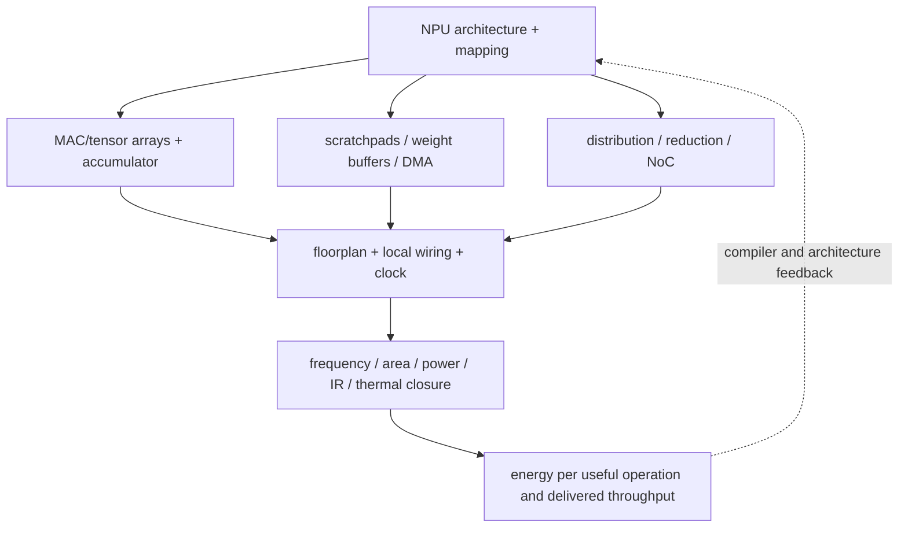
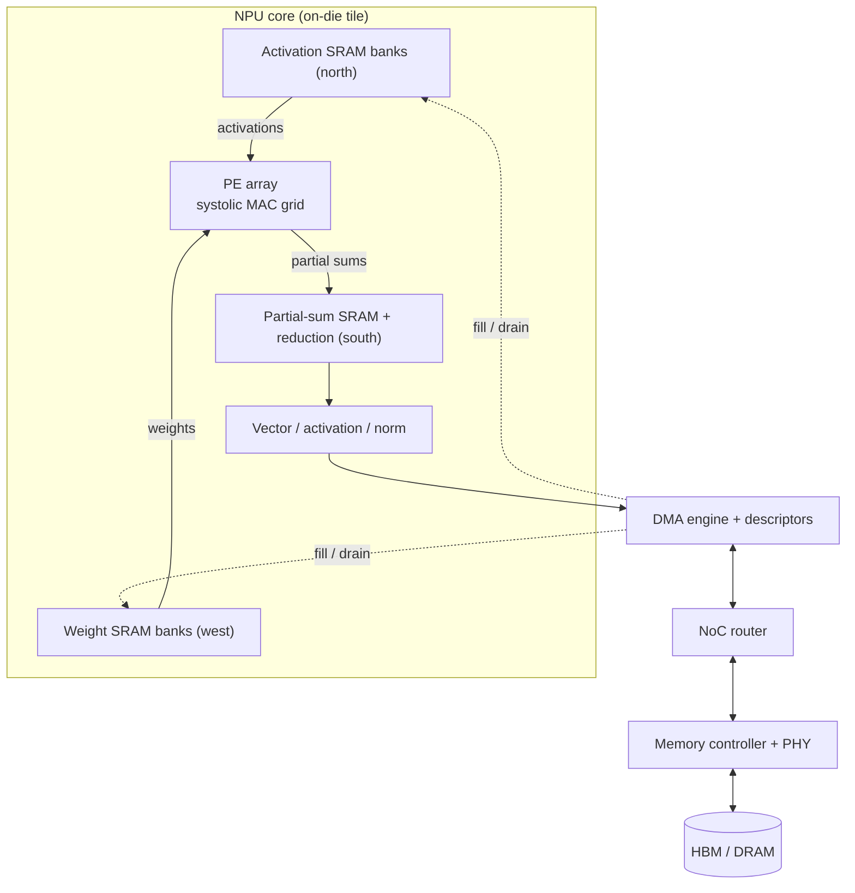

# NPU Power, Performance, Area, and Physical Implementation

> **First-time reader orientation:** NPU arithmetic arrays are regular, but their physical efficiency is controlled by operand movement, SRAM banking, interconnect, accumulator/reduction width, precision support, clocking, and utilization. Data movement often costs more energy than the MAC itself; unused peak TOPS still consumes area and leakage.

> **Abbreviation key — skim now and return as needed:** neural processing unit (NPU); processing element (PE); multiply-accumulate (MAC); static random-access memory (SRAM); high-bandwidth memory (HBM); dynamic random-access memory (DRAM); direct memory access (DMA); network on chip (NoC); register file (RF); compute-in-memory (CIM); non-volatile memory (NVM); error-correcting code (ECC); power, performance, and area (PPA); process, voltage, and temperature (PVT); dynamic voltage and frequency scaling (DVFS).

---

## 0. NPU resource ledger

Inventory per core:

- MAC/tensor PEs, local registers, pipeline/control, accumulators;
- vector, reduction, activation, normalization, and conversion units;
- input/weight/output/metadata SRAM banks and address generators;
- DMA engines, descriptors, queues, double-buffer state;
- multicast, reduction, and core/NoC interfaces;
- sparse decode/compaction/load-balance structures;
- clocks, power gates, test/repair, and reliability state.

At chip level add shared SRAM/cache, global NoC, memory controllers/PHYs, host interface, security/virtualization, synchronization, and package/thermal resources.

## 1. Energy follows the memory hierarchy

**Intuition — the energy ladder.** Hold one picture before the math: moving an operand usually costs more than computing with it, and the cost climbs steeply with distance from the PE. Normalizing every access to one register-file read (which is close to the energy of the MAC itself), published accelerator studies give order-of-magnitude costs like:

| Access (illustrative, node-dependent) | Relative energy |
| --- | --- |
| MAC / register file | ~1x |
| PE-to-PE neighbor | ~2x |
| On-chip global SRAM buffer | ~6x |
| Off-chip DRAM / HBM | ~200x |

So one DRAM/HBM access can cost as much as ~200 MACs. A good dataflow fetches each operand from far memory rarely and reuses it many times from RF/local SRAM, driving the *effective* energy per MAC back toward the ~1x floor. This is why the sum below is over accesses *per level*, not over MACs, and why peak TOPS says little until the traffic is known.

For one mapped operator,

$$
E=N_{MAC}e_{MAC}+\sum_l N_{read,l}e_{read,l}+\sum_lN_{write,l}e_{write,l}+N_{hop}e_{hop}+E_{control}.
$$

The access energy $e_l$ depends on array size, ports, banking, voltage, and physical distance. Off-chip and global movement is generally far more expensive than local RF access. A dataflow's main PPA effect is often reducing high-level accesses, even when MAC count is unchanged.

Dynamic power is

$$
P_{dyn}=\sum_j\alpha_jC_jV^2f,
$$

and leakage remains for idle PEs/SRAM unless power-gated. Use mapped activity, including underfilled arrays and stalled cycles; peak utilization is not a power activity factor.

### 1.1 From energy-per-MAC to TOPS/W

**What it is.** TOPS/W (tera-operations per second per watt) is just the inverse of energy per operation — efficiency and energy-per-op are the same fact in two units. Using the common convention that one MAC counts as two operations (a multiply and an add),

$$
\text{TOPS/W}=\frac{2}{e_{MAC}\,[\text{pJ}]},
$$

because 1 pJ/op equals exactly 1 TOPS/W (a pJ is $10^{-12}$ J, and $10^{12}$ op/s at 1 W is $10^{12}$ op/J).

**Why it bites.** Datasheets quote the *arithmetic-only* figure. If the bare INT8 multiply-add costs $e_{MAC}=0.05$ pJ, the headline is $2/0.05=40$ TOPS/W. Fold in the average operand movement per MAC from the energy ladder — SRAM reads, partial-sum traffic, the amortized DRAM share, clocking — say $+0.35$ pJ/MAC, and the *effective* $e_{MAC}=0.40$ pJ gives $2/0.40=5$ TOPS/W: an $8\times$ gap no datasheet shows. Underfilled arrays and stalled cycles push $e_{MAC}$ higher still, because leakage and clock energy are spent on cycles that retire no useful MAC. Quote TOPS/W only with its datatype, counting convention (Section 2), and *sustained* activity.

## 2. PE and accumulator design

A PE may contain multiplier, adder, local registers, forwarding/muxing, and control. Physical cost depends on operand/accumulator precision, signedness, saturation/rounding, sparsity gating, and supported modes.

Accumulator width must prevent overflow for the reduction length or implement controlled quantization. Concretely, a signed INT8$\times$INT8 product needs 16 bits, and summing $K$ of them adds up to $\lceil\log_2 K\rceil$ bits, so a length-$K$ reduction wants $16+\lceil\log_2 K\rceil$ bits — 26 at $K=1024$. A 32-bit accumulator therefore carries comfortable guard bits and stays overflow-safe to $K=2^{32-16}=65536$; deeper reductions, or FP accumulation of many small terms, force a wider accumulator or periodic rescaling. Supporting INT4/INT8/FP8/BF16/FP16/FP32 modes can require lane packing, multiple multiplier paths, converters, rounding, exception handling, and mode muxes. Peak “TOPS” must name datatype and counting convention.

Systolic forwarding makes local wires regular, but array dimensions create long edge distribution/collection paths and clock load. Very large arrays may need hierarchical clusters or pipeline boundaries.

## 3. Scratchpad SRAM is capacity plus bandwidth

Nominal bits are

$$
B_{SRAM}=\sum_t N_{entry,t}\,b_{entry,t},
$$

for input, weight, output, accumulator, and metadata storage. Physical macros add decoders, bitlines, sense/write circuits, ECC/parity, repair, control, and unused shape/port granularity.

**Capacity, concretely — one tile's footprint.** The bits above are dictated by the live tile. An INT8 matmul tile that produces a $128\times128$ output block from a $128\times256$ activation tile and a $256\times128$ weight tile, with INT32 partial sums, needs:

- activations: $128\times256 = 32$ KiB;
- weights: $256\times128 = 32$ KiB;
- partial sums: $128\times128\times4 = 64$ KiB;

about 128 KiB for one live tile, before ECC, macro rounding, and metadata; double-buffering the streamed operands (below) to overlap DMA pushes it toward ~192 KiB. Shape matters: deepening the reduction $K$ grows only the operand storage while the $M\times N$ partial-sum block stays fixed, so a deeper tile accumulates more of the reduction in place before partial sums must spill to a higher level — capacity here buys reduced partial-sum traffic, the capacity-vs-movement knob a mapper turns.

Banking supplies concurrent accesses. For each schedule, construct a bank/port demand table by cycle or phase. Conflicts can stall an array even when total average bandwidth appears sufficient. More banks increase peripheral area, arbitration, address routing, and fragmentation.

Double buffering approximately doubles live tile capacity, but overlaps DMA and compute. Include ping-pong selection, lifetime safety, and late-response generation tags.

### 3.1 A scratchpad bandwidth calculation

Consider a $128\times128$ INT8 matrix array that consumes one new activation vector and one new weight vector each cycle. Ignoring reuse inside the array, its edge demand is $128+128=256$ bytes/cycle. At 1 GHz that is 256 GB/s. If a scratchpad bank returns 32 bytes/cycle, at least eight conflict-free read-bank services are required before accounting for output/partial-sum traffic, double-buffer DMA, metadata, or simultaneous vector-unit reads.

Eight physical banks are not automatically sufficient. The address-to-bank function must distribute the particular tensor strides used by the mapper; otherwise a power-of-two leading dimension can send several lanes to one bank. Legal mappings should be checked with a per-cycle bank-demand trace. Remedies—padding, swizzling, more banks, wider rows, replicated operands, or a two-cycle feed—change capacity efficiency, periphery, routing, compiler constraints, or array utilization.

SRAM macro granularity matters too. A requested 96 KB buffer may be built from several available compiler macros whose rounded capacity is larger. Physical capacity also includes error-correcting-code bits, spare rows/columns, repair fuses, and metadata. A PPA report should distinguish **usable tensor bytes** from **instantiated macro bits** and should name the port combination. A true two-read/two-write array is not cost-equivalent to four single-port banks even when both advertise the same aggregate bytes/cycle.

## 4. Multiporting, multicast, and reduction

Replicating operand SRAM reads or building true multiport arrays is expensive. NPUs instead combine:

- banking and deterministic mapping;
- multicast trees for shared weights/activations;
- local RF reuse;
- systolic neighbor forwarding;
- reduction trees/networks for partial sums;
- time-multiplexed ports with scheduled phases.

The architecture must price wire capacitance and buffers. A “free broadcast” in an analytical model can dominate clock/energy on silicon. Multicast fanout and reduction convergence also create hotspots and backpressure.

## 5. Sparse and compressed support has physical overhead

To skip zeros, hardware may need metadata SRAM, prefix/position decode, index comparators, gather/scatter queues, compaction/crossbars, lane steering, and load balancing. Effective area/energy benefit is

$$
\Delta E=E_{dense\ work\ removed}-E_{metadata/decode/irregular\ movement}.
$$

If imbalance leaves PEs idle or metadata bandwidth is limiting, theoretical sparsity speedup is not realized. Price supported patterns and worst-case fallback behavior.

## 6. DMA and decoupled engines require correctness state

Descriptor-driven NPUs overlap address generation, transfers, matrix/vector compute, and writeback. Physical state includes descriptor queues, address generators, translation/protection context, event scoreboard, buffer generations, completion queues, and backpressure.

Buffer lifetime is architectural correctness: a late DMA response from an old tile must not mark a reused buffer ready. Generation tags or explicit ownership transitions are required. More outstanding descriptors improve overlap but expand queues, translation state, and NoC/memory pressure.

## 7. NoC and HBM/DRAM scale the array

NoC must carry unicast, multicast, reduction, DMA, and control traffic. Size links/routers/buffers from mapped traffic and burstiness, not average bytes only. Near saturation, queueing raises latency and can break double-buffer schedules.

HBM/DRAM cost includes controller/PHY/package and delivered efficiency. Peak pins do not account for bank conflicts, refresh, turnaround, request size, or QoS. For capacity-heavy models, memory stacks and package/thermal cost can dominate compute die area.

## 8. Timing paths and achievable frequency

Critical families include:

- SRAM address → bank arbitration → read data → array input;
- PE multiply/accumulate or packed multi-precision path;
- systolic edge distribution and accumulator collection;
- sparse metadata decode → lane steering;
- event-scoreboard ready check → engine issue;
- reduction tree/network;
- NoC router allocation and long links.

An architecture model must use macro/logic latencies consistent with target PVT and floorplan. Increasing SRAM or array dimensions can add pipeline stages that change fill/drain, synchronization, and double-buffer timing.

## 9. Area and thermal composition

$$
A=N_{core}(A_{PE}+A_{local\ SRAM}+A_{vector}+A_{DMA/control})+A_{shared\ SRAM/NoC}+A_{PHY/host}+A_{margin}.
$$

Regular arrays are dense, but SRAM periphery, NoC, clock/power grid, and utilization/floorplan gaps matter. Thermal hotspots can form in active tensor clusters or memory PHYs; underutilized arrays still leak. Model sustained phase mixes and power-gating transition costs.

**From MAC count to array area.** The first term scales with PE count. A $128\times128$ systolic array is $16{,}384$ INT8 MAC PEs; if each compiled PE — multiplier, accumulator register, forwarding muxes — occupies about $A_{PE}\approx 400\ \mu\text{m}^2$ in the target node (illustrative and strongly node- and precision-dependent), the raw cells are $16{,}384\times 400\ \mu\text{m}^2\approx 6.6\ \text{mm}^2$. Local RF, clock mesh, and intra-array routing lift the placed array block to perhaps $1.3$–$1.5\times$ that. The point: this is usually a *minority* of the die — the SRAM banks feeding it (Section 3), the NoC, DMA, and especially the memory PHYs (Section 7) often outweigh the arithmetic, which is why "dense MAC array" and "dense chip" are different claims and why halving MAC area rarely halves die area.

The floorplan is the physical arrangement that ties these blocks together: operands enter the array from adjacent SRAM edges, results drain to reduction/partial-sum storage, and DMA plus NoC bridge to off-die memory.

## 10. CIM and emerging-memory claims

Compute-in-memory performs some operations on bitlines or within/near arrays to reduce data movement. Evaluation must include:

- cell/device variation and read/write endurance;
- analog-to-digital/digital-to-analog conversion where applicable;
- peripheral area/energy and calibration;
- precision/noise/accuracy impact;
- data layout and write cost;
- unsupported operators and digital fallback;
- yield, repair, retention, and temperature.

Array-core TOPS/W alone is not system energy. Include conversion, buffering, control, communication, and graph coverage.

### 10.1 Analog CIM accounting from operation to usable result

In an analog resistive or SRAM compute-in-memory (CIM) array, input values are driven onto rows and column currents or voltages represent an accumulated dot product. The attractive part is parallel multiply-accumulate activity inside the array. The complete path is

~~~text
digital input -> encoding/DAC or pulse driver -> memory-cell array
              -> analog column accumulation -> sense/ADC
              -> digital scaling/correction -> accumulator/buffer -> NoC
~~~

DAC means digital-to-analog converter; ADC means analog-to-digital converter. If an array produces $C$ column results every $t$ seconds but only $n_{ADC}$ converters are available, conversion may require $\lceil C/n_{ADC}\rceil$ phases. ADC resolution also grows expensive with output bits; accumulation of many low-precision products often needs more output range than either operand. Bit slicing, multiple reads, and digital accumulation can turn one advertised analog operation into several physical cycles.

Device variation, conductance drift, temperature, read noise, and nonlinear programming create value error. Calibration and retraining may recover model accuracy but consume reference storage, test time, update traffic, and operating margin. Endurance matters when weights change: inference weights may be mostly static, whereas training or frequent personalization can make programming energy and wear first-order constraints. Some technologies require high write voltage or long write pulses, adding charge pumps and preventing writes from overlapping reads.

For a graph-level claim, report

$$
E_{graph}=E_{array}+E_{DAC/driver}+E_{ADC/sense}+E_{digital}+E_{buffer/NoC}+E_{fallback},
$$

and multiply peak rate by the fraction of graph operations that can actually use the CIM path. Normalization, activation, routing, sparse gather, unsupported precision, and host/device transfers still execute digitally. Accuracy after mapping—not just array signal-to-noise ratio—is a required output.

### 10.2 Emerging-memory technologies change the CIM operating model

Different “non-volatile CIM” labels hide different device physics:

- **resistive RAM (ReRAM or RRAM)** stores resistance and can form dense analog conductance crossbars. It offers parallel dot products but faces device variation, nonlinear writes, conductance drift, endurance limits, sneak paths (leakage currents through unselected crossbar cells), and ADC/DAC overhead.
- **phase-change memory (PCM)** stores material phase/resistance with multiple conductance levels. It can support analog weights but programming is relatively high-energy, asymmetric, and subject to drift and finite endurance.
- **magnetoresistive RAM (MRAM)** stores magnetic state. It offers non-volatility and strong read endurance with digital compatibility, but cell/write-current and analog-multilevel behavior differ from ReRAM/PCM; it is often more natural as robust storage or digital near-memory compute.
- **ferroelectric RAM or transistor memory (FeRAM/FeFET)** uses polarization state, with attractive voltage/energy possibilities but process integration, endurance, variability, and array maturity dependent on the device generation.

Technology choice changes whether weights are binary, multilevel, or bit-sliced; how often they can be updated; whether computation is current-summed analog or digital near-memory logic; and what calibration/refresh/rewrite is required. A fair comparison fixes effective numerical accuracy and graph coverage, then includes converters, verify/program pulses, spare/repair capacity, drift compensation, reference cells, digital accumulation, and fallback. Quoting an array's raw TOPS/W across technologies without those equalized boundaries is not meaningful.

## 11. Worked trade: double SRAM or double MACs?

An NPU layer spends 60% of time waiting for HBM, 35% computing, and 5% in vector/control. Doubling MAC count can at best halve the compute term:

$$
S_{MAC}=\frac{1}{0.60+0.35/2+0.05}=1.21.
$$

Suppose doubling SRAM enables a tile with half the HBM bytes, reducing the memory term from 0.60 to 0.32 after bank/NoC overhead while compute remains 0.35:

$$
S_{SRAM}=\frac{1}{0.32+0.35+0.05}=1.39.
$$

The SRAM option may still lose if macro area/leakage or access latency forces a clock reduction. The physical ledger and mapped traffic decide; peak TOPS does not.

## 12. NPU PPA checklist

- Name precision/mode and MAC/operation convention.
- Price local/global accesses, NoC hops, and off-chip transfers.
- Check SRAM bank/port demand for the actual mapping.
- Include vector/reduction, DMA, metadata, translation, and synchronization.
- Couple array/core count to NoC/memory/clock/power delivery.
- Price sparsity/CIM peripherals and graph coverage.
- Use macro/synthesis/PVT ranges and sustained thermal operating points.
- Report uncertainty and configuration points that can reverse ranking.

## Cross-references

- [Tensor Tiling and Data Movement](../02_Mapping_and_Memory/01_Tensor_Tiling_and_Data_Movement.md).
- [Decoupled Access/Execute and Scratchpad Scheduling](../02_Mapping_and_Memory/03_Decoupled_Access_Execute_and_Scratchpad_Scheduling.md).
- [Host Interface, Memory Visibility, and Scheduling](../03_System_Integration/01_Host_Interface_Memory_Visibility_and_Scheduling.md).

## References

1. Y.-H. Chen et al., “Eyeriss,” and accelerator dataflow literature.
2. A. Parashar et al., “Timeloop,” ISPASS 2019; Accelergy documentation.
3. CACTI and foundry/memory-compiler data for SRAM estimates.
4. Compute-in-memory device/circuit/system evaluation literature with end-to-end accounting.

---

← [NPU Workloads and DSE](01_NPU_Workloads_Performance_and_DSE.md) · next → [NPU Simulation Methodology and Evidence](03_NPU_Simulation_Methodology_and_Evidence.md)
