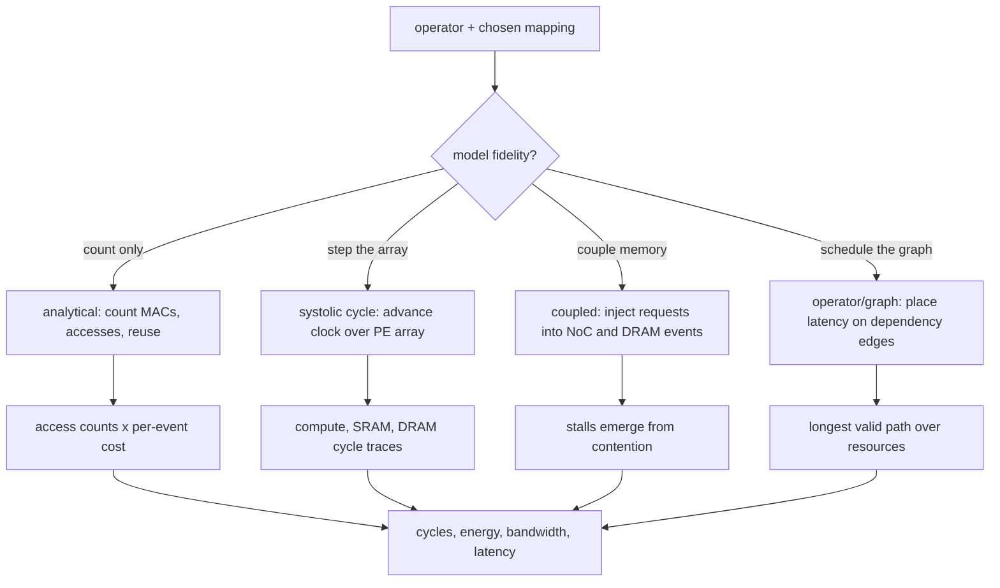

# NPU Simulation Methodology and Evidence — From Framework Graph to Final Results

```mermaid
flowchart LR
    FW["framework model + inputs"] --> EXP["export / graph capture"]
    EXP --> OPT["shape / fusion / layout / quantization / partition"]
    OPT --> MAP["tile / dataflow / buffer / DMA-event schedule"]
    MAP --> CMD["target executable + commands"]
    CMD --> SIM["array / vector / scratchpad / NoC / memory events"]
    SIM --> RAW["cycles / operations / bytes / stalls / energy events"]
    RAW --> MET["operator / graph / serving results"]
    MET --> VAL["functional + counter + hardware calibration"]
```

> **First-time reader orientation:** Most NPU architecture simulators do not execute assembly. They consume a graph, layer/operator descriptions, tensor loop bounds, mappings, or command traces. Before any cycle is simulated, graph export, optimization, fusion, layout, precision, sparsity, partitioning, and lowering have already decided much of the workload.

> **Abbreviation key — skim now and return as needed:** Open Neural Network Exchange (ONNX); intermediate representation (IR); operator set (opset); general matrix multiplication (GEMM); processing element (PE); multiply-accumulate (MAC); static random-access memory (SRAM); dynamic random-access memory (DRAM); high-bandwidth memory (HBM); direct memory access (DMA); network on chip (NoC); comma-separated values (CSV); power, performance, and area (PPA).

> **Hands off to:** [Accelerator and NPU Simulators](../04_Simulation/01_Accelerator_and_NPU_Simulators.md).

---

## 0. Freeze model semantics and inputs

A PyTorch, TensorFlow, or JAX program can contain Python control, dynamic shapes, preprocessing, custom operators, and training behavior. Record source/weight/input hashes, framework/exporter/opset versions, shapes, batch/sequence, precision, sparsity/routing data, preprocessing, accuracy output, and measured boundary.

Exporting to ONNX serializes a constrained graph of operator nodes, tensor inputs/outputs, constant initializers, types/shapes, attributes, and opset versions. It may specialize control for example inputs or leave symbolic dimensions. Validate exported output against the framework.

## 1. Graph optimization changes simulated work

A compiler/frontend may perform:

1. shape inference;
2. constant folding;
3. dead-node elimination;
4. canonicalization/decomposition;
5. operator fusion;
6. layout selection and transpose insertion/removal;
7. quantization and conversion insertion;
8. sparsity transformation;
9. partitioning across matrix/vector/NPU cores or CPU/GPU fallback.

Preserve before/after graphs or node summaries. Fusion can eliminate intermediate memory; decomposition can add launches; layout conversion adds bytes; fallback work may dominate latency.

Report coverage:

$$
coverage_{ops}=\frac{operations\ modeled\ on\ NPU}{operations\ in\ optimized\ graph},
\qquad
coverage_{time}=\frac{reference\ time\ of\ modeled\ nodes}{whole\ reference\ time}.
$$

Time coverage is often more informative because one unsupported normalization/transfer can control the critical path.

## 2. Operators become tensor-loop descriptors

Examples:

- `MatMul(A[M,K],B[K,N])` → $(M,N,K)$, datatypes, transpose/layout;
- convolution → batch/channel/spatial/filter/stride/dilation/padding dimensions;
- attention → projection GEMMs, score GEMM, mask/softmax/reduction, value GEMM, output projection, KV-cache bytes;
- elementwise/reduction → vector length, axes, bytes, and special functions;
- sparse/MoE → nonzero metadata or routed-token distribution.

A simulator receiving only $(M,N,K)$ cannot infer surrounding transfers, transpose, quantization, softmax, fallback, or host work.

## 3. Tool-specific artifacts

| Tool/path | Primary input | What has already been decided |
|---|---|---|
| SCALE-Sim | architecture config + convolution/GEMM topology CSV | graph lowering and layer list |
| Timeloop | tensor problem, architecture, constraints, mapping/search | operator and hardware hierarchy |
| MAESTRO | layer dimensions + data-centric directives | operator and candidate dataflow |
| ONNXim-style | ONNX graph + system configuration | exported/optimized graph semantics |
| operator-level model | operator shapes/parallelism/system parameters | most lowering and cost equations |
| command/trace model | NPU descriptors/micro-commands | compiler schedule and dynamic command path |

The run manifest must name the exact intermediate artifact and conversion script. A hand-written convolution CSV is not a full-model simulation.

## 4. Mapping becomes counts or events

For each operator, a mapping chooses tiles, loop order, spatial unrolling, buffers, dataflow, and memory levels.

**What this step means, intuitively.** The mapping is a *recipe* for running one operator on the hardware — how the tensor is sliced into tiles, which loops live at which memory level, which dimensions run in parallel across PEs. A cost model turns that recipe into numbers, and the families below sit on a spectrum. An **analytical** model *counts* what the recipe implies — MACs, per-level accesses, reuse — and multiplies by fixed per-event costs: closed-form and fast, but blind to timing, because it never advances a clock, so queueing, contention, and pipeline fill stay invisible. A **cycle/event** model *plays the recipe forward*, advancing time step by step and letting stalls and fill/drain latency emerge: slower, but it captures the overlap and backpressure the counts miss. Fidelity is bought with simulation time, so the family you pick should match the question you are asking.

- Analytical mapping tools count accesses/reuse and apply performance/energy rules.
- Systolic cycle models step array demand and produce compute/SRAM/DRAM traces.
- Coupled models feed requests through NoC/DRAM events and let stalls emerge.
- Operator/graph models place latency/traffic on dependency/resource schedules.

The same operator-plus-mapping enters whichever engine the chosen family uses, and all four converge on the same metric outputs:

Check mapping legality before performance: capacity, banks, ports, PE dimensions, reduction, DMA lifetimes, and synchronization.

### 4.1 Worked example — analytical count versus cycle estimate for one GEMM tile

*Question:* how many cycles does a `MatMul` with $M=N=K=512$ take on a $128\times128$ weight-stationary array ($S_R=S_C=128$), and why do the two model families disagree?

**Analytical (count-only) estimate.** Useful MACs $=M\,N\,K=512^3=134{,}217{,}728$. The array holds $S_R\,S_C=16{,}384$ MAC units, so the compute-bound floor is

$$
C_{ideal}=\frac{M\,N\,K}{S_R\,S_C}=\frac{134{,}217{,}728}{16{,}384}=8{,}192\ \text{cycles}.
$$

Each weight tile is loaded once and reused across all $M=512$ streamed activation rows (reuse factor $512$), so arithmetic intensity is high and the layer is compute-bound; memory will not gate it, and this count is the analytical answer.

**Cycle (step-the-array) estimate.** The array is $128$ wide, but the operator needs $K=512$ contraction rows and $N=512$ output columns, so the mapping *folds*: $\lceil K/128\rceil=4$ row folds $\times\ \lceil N/128\rceil=4$ column folds $=16$ weight tiles. For each tile the array is preloaded (overlapped with the previous tile's stream by double buffering, §6), then $M=512$ activation rows stream through; the first output is ready only after the wavefront fills the array and the last drains, adding $\approx S_R+S_C=256$ cycles per tile. As a first-order model,

$$
C_{cycle}\approx F_R\,F_C\,(M+S_R+S_C)=16\times(512+256)=12{,}288\ \text{cycles},
$$

so array utilization is $U_{array}=C_{ideal}/C_{cycle}=8{,}192/12{,}288\approx0.67$ — matching the §8 definition.

**Why they disagree — and the lesson.** Here $512$ is a multiple of $128$, so there is *no* edge underfill; the whole 33% gap is fill/drain latency the count cannot see, because the fixed $256$ overhead cycles are amortized over only $M=512$ useful ones. Stream a taller activation ($M=4{,}096$) through the same weights and the per-tile overhead is unchanged: $C_{ideal}=65{,}536$, $C_{cycle}\approx16\times4{,}352=69{,}632$, and utilization rises to $\approx0.94$. The pure MAC count reports the same peak for both; only stepping the array exposes the fixed latency tax that short-$M$ layers pay. That is when a cycle model earns its cost — and, conversely, why for a large-$M$ compute-bound layer the cheap analytical count is already close.

## 5. Exact SCALE-Sim output interpretation

A current SCALE-Sim run can emit:

- `COMPUTE_REPORT.csv`: layer cycles, stalls, and utilization;
- `BANDWIDTH_REPORT.csv`: average/maximum SRAM and DRAM bandwidth;
- `DETAILED_ACCESS_REPORT.csv`: per-layer access and access-cycle totals;
- `TIME_REPORT.csv`: modeled layer time in microseconds using the configured hardware-specific linear model;
- optional cycle-accurate SRAM/DRAM access traces.

Compute cycles are the architectural result; `TIME_REPORT.csv` is a calibrated conversion depending on `TimeLinearModel`. Neither is host wall-clock simulation runtime. Do not add a bandwidth penalty to cycles that already include a coupled Ramulator stall model.

## 6. Event model for a decoupled NPU

~~~text
graph/command ready
 -> descriptor issue and dependency check
 -> DMA/address generation and translation
 -> NoC/DRAM request and buffer fill
 -> buffer-generation ready event
 -> matrix/vector/reduction engine issue
 -> SRAM bank reads and operand delivery
 -> PE pipeline / accumulator / writeback
 -> output buffer completion
 -> dependent command wakeup and possible DMA store
~~~

Each queue/engine/bank/link can backpressure. Double buffering overlaps data movement and compute only if lifetimes and bandwidth permit. A late response must match the correct buffer generation.

## 7. Graph time and overlap

For a strictly sequential graph,

$$
T_{graph}=\sum_o(T_{compute,o}+T_{transfer,o}+T_{launch,o}).
$$

For multiple engines, asynchronous DMA, fusion, and pipeline/tensor parallelism, build a dependency graph plus resource-serialization edges. Completion is the longest valid path. Do not sum isolated operators when they overlap, and do not take a simple max when they contend for the same SRAM/NoC/HBM.

## 8. Raw counters to metrics

$$
U_{array}=\frac{N_{useful\ MAC}}{N_{MAC\ lanes}\,C},\qquad
throughput=\frac{N_{operations}}{C/f},
$$

$$
E=\sum_iN_ie_i,\qquad P_{avg}=\frac{E}{C/f}.
$$

Define one MAC as one or two operations, useful versus padded/issued MACs, per-core versus chip cycles, and useful versus transferred bytes. Separate graph/operator latency, simulator host runtime, and calibrated time estimates.

## 9. Value dependence and representative inputs

Dense shape-driven models may not need every tensor value. Dynamic sparsity, conditional execution, variable sequence lengths, MoE routing, compression, early exit, and cache behavior do. Supply representative value-derived metadata or use an execution frontend that generates actual active work. Report input distributions and random seeds.

## 10. Correctness and conservation

- Exported/optimized graph output matches framework reference within stated tolerance.
- Every graph node is modeled, fused, or explicitly assigned to fallback.
- Useful MAC count matches operator dimensions and sparsity convention.
- Tile accesses match mapping/reuse equations.
- SRAM/DRAM bytes reconcile across trace and report boundaries.
- No bank/port/capacity or dependency constraint is violated.
- Completed graph outputs and command counts match expectation.
- Energy totals reproduce event-count dot products.

## 11. Validation ladder

1. operator shapes/counts and numerical output;
2. compiler/fusion/layout/partitioning agreement;
3. access counts against hand equations or compiler traces;
4. per-layer cycles/utilization against RTL/hardware microbenchmarks;
5. SRAM/NoC/DRAM traffic and stalls;
6. graph latency/throughput across representative shapes;
7. energy/power against measured or implementation-calibrated data.

Calibrate on multiple operator classes: dense GEMM/conv, underfilled shapes, vector/reduction, memory-bound, sparse/irregular, communication, and multi-core scheduling.

### 11.1 NPU-specific error budget

An NPU result can be wrong before the cycle model begins. Export/fusion/partition error changes graph work; shape or value-distribution error changes array fill, sparsity, routing, and KV-cache traffic; mapping error selects an illegal or poor tile; memory-model error hides banks/ports/refresh; event-model error misrepresents overlap; energy-table error misprices otherwise correct counts. Track each boundary independently.

Shape-only tools have model-form limits: they can estimate dense loop/access schedules but cannot claim value-dependent zero skipping, dynamic mixture-of-experts balance, numerical accuracy, or data-dependent compression without representative values or derived metadata. Operator-only totals also omit dependencies, shared resources, fallback, and host/device transfers unless a graph scheduler explicitly composes them.

For design comparisons, rerun the compiler/mapping search for every architecture; otherwise mapping quality is confounded with hardware. Report per-operator residuals and graph-level residuals. A small average error can hide a large error on the critical-path operator, while errors on overlapped noncritical operators may not affect end-to-end latency. *Concrete case:* ten operators predicted at $100$ cycles each, where the lone critical-path operator actually costs $200$ (a $100\%$ error there) and the other nine are exact, gives a mean per-operator error of only $100/(10\times100)=10\%$ — yet end-to-end latency is off by the full $100$ cycles if that operator gates the path, and by *zero* if it hides behind a longer parallel branch. The average conceals both outcomes; only per-operator residuals tagged by critical-path membership tell them apart. The validation target must match the final claim's boundary.

## 12. Result package

Preserve framework/exported/optimized graph hashes, weights/input, node and coverage reports, lowering/conversion revision, tool-specific topology/problem/mapping/configuration, simulator revision, raw reports/traces, formulas, validation, and known omissions. Another reader must be able to walk from graph result back to every transformation.

## Cross-references

- [Accelerator and NPU Simulators](../04_Simulation/01_Accelerator_and_NPU_Simulators.md) compares SCALE-Sim, Timeloop, Accelergy, MAESTRO, ONNXim, and operator-level models.
- [Tensor Tiling and Data Movement](../02_Mapping_and_Memory/01_Tensor_Tiling_and_Data_Movement.md) explains mapping legality.
- [NPU PPA and Physical Implementation](02_NPU_PPA_and_Physical_Implementation.md) prices the generated accesses and structures.
- [End-to-End AI Inference and Serving](../05_AI_Workloads_and_Serving/02_End_to_End_AI_Inference_and_Serving_on_NPUs.md) defines the host, queue, KV, collective, network, and tail-SLO work that must surround a device/graph model before it can make serving claims.
- [Performance, Compiler, Profiling, and Research Methodology](../05_AI_Workloads_and_Serving/03_Performance_Compiler_Profiling_and_Research_Methodology.md) supplies the counter/trace lineage, model composition, residual analysis, and experimental controls used to validate simulator claims.

## References

1. ONNX, *Intermediate Representation Specification*.
2. SCALE-Sim official documentation and papers.
3. Timeloop/Accelergy and MAESTRO official papers/documentation.
4. ONNXim and representative end-to-end NPU simulation literature.

---

← [NPU PPA and Physical Implementation](02_NPU_PPA_and_Physical_Implementation.md) · [NPU book index](../00_Index.md) · next → [Compute Dataflows](../01_Compute_Dataflows/00_Index.md)
