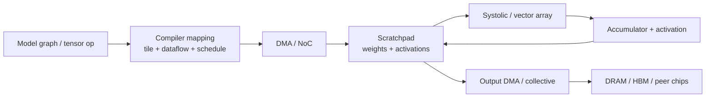
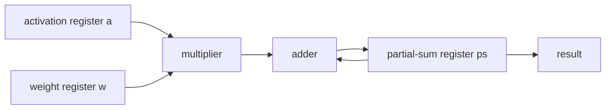
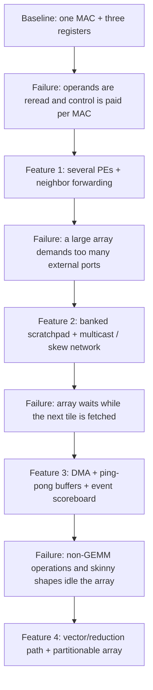

# Neural Processing Unit (NPU) Accelerators — Spatial Dataflow Hardware

> **First-time reader orientation:** A neural processing unit accelerates repeated tensor operations, especially matrix multiplication and convolution. A multiply-accumulate (MAC) unit multiplies two values and adds the product to a running sum; many MACs are arranged as processing elements (PEs). The architecture decides where operands and partial sums stay or move.

> **Abbreviation key — skim now and return as needed:** central processing unit (CPU); graphics processing unit (GPU); register-transfer level (RTL); power, performance, and area (PPA); cycles per instruction (CPI);
> design-space exploration (DSE); out-of-order (OoO); reorder buffer (ROB); arithmetic logic unit (ALU); register file (RF);
> single instruction, multiple data (SIMD); single instruction, multiple threads (SIMT); static random-access memory (SRAM); dynamic random-access memory (DRAM); high-bandwidth memory (HBM);
> network on chip (NoC); direct memory access (DMA); AXI Coherency Extensions (ACE); Coherent Hub Interface (CHI); least recently used (LRU);
> processing element (PE); multiply-accumulate (MAC); general matrix multiplication (GEMM); Universal Chiplet Interconnect Express (UCIe); output stationary (OS);
> streaming multiprocessor (SM); artificial intelligence (AI); tensor processing unit (TPU); tera operations per second (TOPS); 8-bit integer (INT8);
> read-modify-write (RMW); kilobyte (KB); megabyte (MB); gigabyte (GB); terabyte (TB);
> mebibyte (MiB); megahertz (MHz); gigahertz (GHz).

> **Prerequisites:** [Adders_and_Multipliers](../../../00_Fundamentals/03_Adders_and_Multipliers.md) (the MAC leaf this array is built from), [CPU_Architecture](../../01_CPU_Architecture/01_Core_Foundations/01_CPU_Architecture.md) (the von-Neumann core this page deliberately departs from), [NPU workload and performance methods](../00_Design_Methodology/01_NPU_Workloads_Performance_and_DSE.md) (the systolic cycle/utilization model this page motivates in hardware terms).
> **Hands off to:** [Full_Chip_Modeling §4](../../04_SoC_and_Chiplet_Architecture/01_System_Modeling/01_Full_Chip_Modeling.md) (PE→array→chip→pod power/thermal roll-up), [Accelerator_and_NPU_Simulators](../04_Simulation/01_Accelerator_and_NPU_Simulators.md) (how a layer + mapping becomes a PPA (power, performance, area) number), and [Network_on_Chip](../../04_SoC_and_Chiplet_Architecture/04_On_Chip_Networks/01_Network_on_Chip.md) (the operand/collective fabrics whose bandwidth becomes the scale-out roof).

---

## 0. Why this page exists

A neural-processing unit (NPU) — the TPU-class (tensor processing unit) dataflow accelerator — is not a faster CPU; it is a *different shape of silicon*, built on one observation: a single kernel, dense matrix multiply (GEMM — general matrix multiply) and convolution, dominates deep-learning compute, and its structure is one a general-purpose core structurally cannot exploit. This page takes the **hardware-design lens** the rest of this notebook applies to the reorder buffer ([OoO_Execution §3](../../01_CPU_Architecture/03_Out_of_Order_Backend/01_OoO_Execution.md)): *what must this silicon do and hold, and why does that force a spatial array of multiply-accumulate (MAC) cells fed by an explicitly-managed scratchpad, instead of a pipeline fed by caches?* The MXU-internal mechanics, the reuse arithmetic, and the vendor parts (TPU, Tenstorrent, Cerebras, Ascend) are the companion AI-infra notebook's territory; this page is the *why the hardware is shaped this way* those pages assume.

The single habit this page installs: **for a dense-linear-algebra accelerator, every architectural decision is a data-movement-energy decision first and a compute decision second** — because moving an operand costs orders of magnitude more than computing on it, and the whole machine is organized to move each operand as little as possible.

By the end you should be able to reason about an NPU quantitatively — size an array from a workload's shapes, read its roofline ridge *before* the silicon exists, choose a dataflow from an energy model rather than a cycle count, and predict where specialization stops paying — not recite a parts list.

### System view — a tensor becomes traffic, then a wavefront

The array is only the compute kernel. A complete accelerator also needs a compiler/mapping decision, DMA engines, explicit on-chip storage, accumulation/nonlinear units, and a scale-out path; whichever edge cannot sustain the mapped reuse becomes the bottleneck.



### 0.1 Derive the machine: one MAC becomes an accelerator only after four failures

It is easier to understand an NPU by *building the smallest possible one* and watching it fail than by memorizing a finished block diagram. Start with one multiply-accumulate datapath, three registers, and a controller:



On every enabled cycle it performs `ps_next = ps + a*w`. This is already sufficient to compute any matrix multiplication: software can present the operands in the correct order and clear or read `ps` at the right time. It is also a poor accelerator. For a $2\times2$ example,

$$
C_{00}=a_{00}b_{00}+a_{01}b_{10},
$$

the controller performs `clear ps`, two operand reads, two MAC cycles, and one result write. It repeats that sequence for $C_{01}$, $C_{10}$, and $C_{11}$. The eight useful MACs require sixteen operand deliveries and four accumulator drains. The multiplier may be busy, but the same $A$ and $B$ values are repeatedly fetched because there is no place or path through which one fetched value can serve another result.

The complete evolution is therefore causal:



**Feature 1 — spatial reuse.** Replicate the MAC into processing elements (PEs) and connect adjacent operand registers. A value read at an array edge advances one PE per cycle, so a single read contributes to several results. This feature is not enabled by multipliers alone. Each PE needs an activation register, a weight or second-input register, an accumulator, valid bits, boundary masking, and forwarding control. The array edge needs *skew registers*: row 1 is delayed one cycle relative to row 0, row 2 by two cycles, and so on, so that the correct $A_{mk}$ and $B_{kn}$ meet. Removing those validity and alignment states produces a fast array that silently multiplies operands from different $k$ iterations.

**Feature 2 — an explicitly scheduled memory.** A $D\times D$ array can consume roughly $2D$ operand words per cycle at its boundary. HBM cannot expose hundreds of independent low-latency ports, so the design inserts a banked SRAM scratchpad. A compiler chooses tiles whose activation, weight, and output footprints fit; direct memory access (DMA) engines move each tile in large bursts; address generators turn loop counters into bank/row addresses; multicast or systolic links fan the words into the array. Unlike a cache, this scratchpad does not discover reuse dynamically. The command says which bytes occupy each bank and when they may be overwritten. That is why the compiler schedule and the hardware buffer-state machine form one architectural mechanism.

**Feature 3 — overlap.** With one activation buffer and one weight buffer, the array must stop before those locations can receive the next tile. Ping-pong buffering duplicates the live storage: while bank set `A` feeds tile 0, DMA fills bank set `B` for tile 1. A dependency scoreboard records events such as `A_FILLED`, `W_FILLED`, `COMPUTE_DONE`, and `OUTPUT_DRAINED`. The compute sequencer may consume a bank only after both fill events; DMA may overwrite it only after compute releases it. More SRAM alone does not create overlap—the event state and bank ownership rules do.

**Feature 4 — heterogeneous completion.** Real layers also contain bias, activation, normalization, transpose, reduction, and quantization. Sending every intermediate to HBM restores the movement cost the array removed. A vector/reduction engine therefore shares the scratchpad, and the command graph passes an on-chip tile from matrix compute to post-processing before output DMA. Partitioning a large array into smaller independently controlled regions similarly recovers utilization for small or skinny matrices. These features add crossbars, bank conflicts, command states, and verification cases; they should be justified by end-to-end traffic and utilization, not by peak TOPS.

#### Replay one command through the evolved machine

Consider a command `GEMM M=4, N=4, K=4` on a $2\times2$ output-stationary array. “Output stationary” means that each PE keeps one $C$ partial sum while $A$ and $B$ move. The compiler emits four output tiles: `(m0,n0)`, `(m0,n1)`, `(m1,n0)`, and `(m1,n1)`, where each tile contains $2\times2$ outputs.

1. **Decode and reserve.** The command processor validates dimensions and precision, chooses free activation/weight/output banks, allocates a tile tag, and sets all four PE accumulators to zero. Reservation prevents another command from reusing the same banks while the tile is live.
2. **Fill.** Two DMA descriptors fetch the first $2\times4$ activation slice and $4\times2$ weight slice. Their completion responses set `A0_READY` and `B0_READY`. In parallel, DMA fills alternate banks `A1/B1` with the next tile's operands.
3. **Launch.** When both ready bits are set, loop counters initialize `k=0`; edge generators emit skewed rows and columns; PE valid bits advance with the operands. For four reduction steps the PE accumulators retain $C$ while the operands propagate.
4. **Drain and post-process.** Array completion transfers four accumulators to the output bank. A vector command applies bias or quantization in place. Output DMA may start only after that event, not merely after the last multiply.
5. **Recycle and overlap.** The scoreboard releases `A0/B0`; the next compute immediately selects already-filled `A1/B1`; DMA reuses the released banks for tile 2. Completion is published only after the final output write reaches the command's required visibility point.

The *replay* is the important comparison. The baseline fetches operands around every MAC and serializes load–compute–store. The evolved path fetches a tile once, reuses its words across PEs and cycles, overlaps the next fill, and keeps post-processing on chip. The mathematical operation is unchanged; only the lifetime and movement of its state changed.

#### What each improvement costs, and when it loses

| Improvement | Enabling state and datapath | Main PPA/complexity cost | Losing case |
|---|---|---|---|
| PE replication and forwarding | operand/valid pipelines, accumulators, boundary masks | multiplier area, clock power, routing congestion, fill/drain latency | small $M,N,K$ or data-dependent control leaves many PEs idle |
| banked scratchpad | SRAM banks, address generators, arbitration, ECC | SRAM area/leakage, bank muxes, compiler-visible conflicts | footprint exceeds capacity or access pattern is random |
| multicast/systolic network | fanout tree or neighbor links, credits/skew stages | wire energy, physical timing, backpressure state | little operand reuse or unbalanced fanout |
| ping-pong overlap | two live versions, ownership bits, event scoreboard | nearly doubled tile-buffer capacity and more deadlock states | transfer is already hidden or tiles consume all SRAM |
| vector/reduction engine | lane registers, reductions, special functions, shared-bank arbitration | area that does not raise dense-MAC peak; numerical corner cases | model consists almost entirely of large GEMMs |
| array partitioning | boundary muxes, independent sequencers and reductions | lower density/frequency and harder broadcast | workload is consistently large and square |

#### Evidence that the mechanism is working

Useful counters must distinguish *why* peak was lost: PE useful slots; masked edge slots; fill/drain slots; operand-starvation cycles; output-backpressure cycles; scratchpad bank conflicts; DMA bytes and occupancy; buffer phase waits; vector handoff bytes; and accumulator spills. A single “array utilization” number cannot tell the designer which feature is missing.

Corresponding assertions include: a PE may update its partial sum only when both operand valids and the tile tag agree; a scratchpad bank is never written while a consumer owns it; a tile cannot launch before all required fill events; each output contains exactly $K$ products despite stalls; masked PEs cannot modify architectural memory; and command completion cannot precede the final visible DMA write. These properties connect the abstract GEMM to the actual distributed state that implements it.

---

## 1. Why a von-Neumann core is the wrong shape for dense GEMM

Start from the workload. A GEMM $C_{M\times N} = A_{M\times K}\,B_{K\times N}$ does $MNK$ MACs but touches only $MK+KN+MN$ operands, so its **operational (arithmetic) intensity** is

$$I = \frac{MNK}{MK+KN+MN}, \qquad \text{where } M,N,K \text{ are the GEMM dimensions;}$$

for a square $N\times N\times N$ GEMM, $I\approx N/3$ — reuse **grows without bound with problem size**, and it is *statically known* (no data-dependent control flow). Each element of $A$ feeds $N$ MACs, each of $B$ feeds $M$, each output accumulates $K$. That reuse is the resource an accelerator is built to capture; a machine that re-fetches operands per MAC throws it away.

A von-Neumann (temporal) core throws it away three times over:

- **Control/instruction overhead per MAC.** In a *temporal architecture* (CPUs, GPUs), one MAC is driven by an instruction: fetch, decode, rename, read 2–3 operands from the register file, execute, write one back. The *envelope* around the multiply-add — the control and operand delivery — dominates the energy: Horowitz's silicon measurements put the arithmetic itself below ~10% of what it costs to fetch/decode/schedule the instruction and read its operands from the register file, so the multiply-add pays a **10×+ overhead tax** every time (ISSCC 2014). A spatial array issues **one control decision for the whole array per step** and hardwires operands between cells, so that single control action is amortized over $D^2$ MACs — $65{,}536$ of them in a $256\times256$ array — and the per-MAC control energy falls by ~$D^2$. The tax does not shrink; it is *divided away*.
- **No direct operand reuse.** As the canonical survey puts it, a temporal architecture "use[s] a centralized control for a large number of ALUs [that] can only fetch data from the memory hierarchy and cannot communicate directly with each other." A *spatial architecture* has PEs (processing elements) that "form a processing chain so that they can pass data from one to another directly," each with "its own control logic and local memory, called a scratchpad or register file." That direct PE→PE path unlocks two reuse tiers — within a PE and between neighbors — that a temporal machine cannot express (Sze et al.).
- **MAC density.** A CPU/GPU spends most of its area on control (out-of-order logic, caches, schedulers); an NPU spends it on arithmetic. TPUv1 packs $256\times256 = 65{,}536$ INT8 MACs into one array at 700 MHz for **92 TOPS** (tera-operations per second) ($65{,}536 \times 0.7\,\text{GHz}\times 2\,\text{op/MAC}\approx 91.8$ TOPS), with a tiny control footprint (Jouppi et al., ISCA 2017).

**Deriving the energy gap — an accounting identity.** Charge every MAC its true cost by summing what the machine must expend to execute it. On a von-Neumann core a MAC *is* an instruction, so

$$E_{\text{MAC}}^{\text{vN}} \;=\; \underbrace{e_{\text{IF}} + e_{\text{dec}} + e_{\text{issue}}}_{\text{control envelope}} \;+\; \underbrace{n_{\text{rd}}\,e_{\text{RF,rd}} + e_{\text{RF,wr}}}_{\text{operand delivery}} \;+\; e_{\text{mac}},$$

where $e_{\text{IF}},e_{\text{dec}},e_{\text{issue}}$ are instruction fetch/decode/issue energies, $n_{\text{rd}}\!\approx\!2\text{–}3$ register reads at $e_{\text{RF,rd}}$ each, one writeback at $e_{\text{RF,wr}}$, and $e_{\text{mac}}$ the arithmetic itself. Horowitz's 45 nm silicon numbers make the point brutal: an 8-bit MAC is $e_{\text{mac}}\!\sim\!0.2$ pJ while the envelope that delivers it — I-cache access, decode, and a large multi-ported register-file read — is *tens* of pJ, so $e_{\text{mac}}/E_{\text{MAC}}^{\text{vN}} < 10\%$ and often nearer $1\%$. The multiply-add is a rounding error on the cost of *telling the machine to do it.* A spatial PE attacks the two dominant terms head-on:

$$E_{\text{MAC}}^{\text{SA}} \;=\; \underbrace{\frac{E_{\text{ctrl,step}}}{D^2}}_{\text{amortized control}} \;+\; \underbrace{c\,e_{\text{PE}}}_{\text{one neighbour hop}} \;+\; e_{\text{mac}},$$

with $E_{\text{ctrl,step}}$ = the energy to advance the whole wavefront one step (issued *once* for all $D^2$ PEs), $e_{\text{PE}}$ = one PE→PE hop, and $c\!\approx\!1\text{–}2$ the hops an operand makes per MAC. Two mechanisms, each a division:

- **Control is amortized by $D^2$.** One control action drives $D^2$ MACs, so its per-MAC share is $E_{\text{ctrl,step}}/D^2$. For $D=256$ ($D^2=65{,}536$), even a lavish $E_{\text{ctrl,step}}=10^4\,e_{\text{mac}}$ leaves $10^4/65{,}536 \approx 0.15\,e_{\text{mac}}$ per MAC — the tax is not shrunk, it is *divided away*. The fetch/decode/issue envelope that dominates $E_{\text{MAC}}^{\text{vN}}$ essentially vanishes from $E_{\text{MAC}}^{\text{SA}}$.
- **Operand delivery drops a rung.** The von-Neumann core re-reads each operand from a large register file every MAC ($e_{\text{RF,rd}}$); the array reads it from SRAM *once* at the edge and then moves it neighbour-to-neighbour ($e_{\text{PE}}$), paying the $1\text{–}2\times$ rung of §3's ladder instead of a full RF (or cache) read per MAC.

**Worked number.** Charge a von-Neumann MAC a control envelope of $\sim\!30\times$ its arithmetic — conservative, since Horowitz's tens-of-pJ instruction against a $\sim\!0.2$ pJ 8-bit MAC is often $100\times$+ — plus two register reads, in §3's ladder units (MAC $=1$, $e_{\text{RF}}=1$, $e_{\text{PE}}=2$): $E^{\text{vN}}\approx 30+2+1=33$. The systolic MAC amortizes control to $30/D^2 = 30/16{,}384\approx0.002$ at $D=128$ and delivers operands in one hop: $E^{\text{SA}}\approx 0.002+2+1\approx3.0$ — an **≈11× energy-per-MAC gap**, widening to $\gtrsim\!30\times$ at a realistic $100\times$ envelope. *That* gap, not a faster multiplier, is the NPU's 10–100× perf/W.

**The reuse that makes one edge feed a whole array.** Where does the operand-delivery saving come from structurally? Count movement at the array boundary per cycle. A $D\times D$ array in steady state ingests $O(D)$ fresh operands across its edges each cycle (one activation per row, one weight/psum per column) yet performs $D^2$ MACs, so

$$\text{reuse} \;=\; \frac{\text{MACs per cycle}}{\text{boundary operands per cycle}} \;=\; \frac{D^2}{O(D)} \;=\; O(D),$$

i.e. **$O(N^2)$ compute is driven by $O(N)$ data movement** — each operand crossing the edge is consumed by an entire row or column of $D$ PEs before it leaves. This is the hardware embodiment of the static intensity $I\approx N/3$ above: the array physically *realizes* the reuse the workload offers, spending one expensive off-chip/SRAM fetch and then $D$ cheap PE-hops. A temporal core, lacking the PE→PE path, must re-deliver every operand from the register file per MAC and captures none of it.

**Why this reuse is asymptotically optimal — a movement lower bound.** Sharpen the boundary count to an exact figure and it becomes a *proof* that the array is near-optimal, not merely good. Any machine computing the GEMM must move each of its $MK+KN+MN$ distinct operands across the chip boundary at least once, so **any schedule pays $\Omega(N^2)$ boundary crossings to do $\Theta(N^3)$ MACs** — an unavoidable floor of $O(1/N)$ movement per MAC. The systolic array attains that floor to within a constant: in steady state it moves exactly $2D$ operands per cycle ($D$ activations in, $D$ partial sums out) for $D^2$ MACs, so movement-per-MAC $=2D/D^2=2/D$ and reuse $=D/2=\Theta(D)$. A temporal core sits at the opposite pole — it re-fetches all three operands *per MAC*, moving $\Theta(N^3)$ operands for $\Theta(N^3)$ MACs, reuse $\Theta(1)$ — a factor $\Theta(N)$ above the floor and above the array. That *linear* gap, not any circuit trick, is the structural win, and it grows with problem size. **Worked number.** For $N=256$: a perfect tiling crosses each of $3N^2\approx2.0\times10^5$ operands once, buying $N/3\approx85$ MACs per crossing, while the per-MAC temporal core manages $\approx\tfrac13$ (it re-crosses all three operands every MAC) — an $\approx\!256\times$ ($=N$) reuse gap that *widens linearly* with $N$, and that the $200{:}1$ energy ladder of §3 converts directly into the NPU's perf/W.

The load-bearing point: **the accelerator's win is not a faster multiplier — it is deleting the per-MAC control and operand-delivery overhead by making the datapath *be* the schedule.** Because the loop nest is static, the "program" can be baked into wiring instead of re-decoded every cycle.

---

## 2. The systolic array as hardware

The canonical NPU datapath is the **systolic array** (Kung & Leiserson, 1978): a 2-D grid of identical PEs through which operands rhythmically pulse (*systole*), each PE doing one MAC per cycle on data arriving from its neighbors.

Apply the ROB-lens — derive what a PE must hold from the one job it does. A PE's job is: *multiply two operands arriving from adjacent PEs, accumulate, and forward operands onward in lock-step with the wavefront.* That forces it to contain exactly (and only):

1. a **multiplier + adder** — the MAC itself;
2. **one resident-operand register** — a held weight (weight-stationary) or an in-place accumulator for the partial sum (output-stationary): the tensor this PE keeps across cycles;
3. **edge/skew pipeline registers** so an operand handed to a neighbor stays time-aligned with the diagonal wavefront.

No instruction fetch, no register-file port arbitration, no bypass network, no branch predictor — **the PE's entire "program" is the fixed wiring to its four neighbors.** That is the structural reason an NPU PE is a fraction of the area and energy of a CPU issue slot.

```
weights wᵢⱼ preloaded and HELD in each PE (weight-stationary)
activations stream L→R; column partial sums accumulate downward

   x₀ → [w00]→[w01]→[w02] →        each PE, each cycle:
   x₁ → [w10]→[w11]→[w12] →          psum_down += w · x_in
   x₂ → [w20]→[w21]→[w22] →          x_out = x_in   (1-cycle skew)
           │      │      │
           ▼      ▼      ▼
          y₀     y₁     y₂          column sums drain out the bottom
```

Because a value streamed left→right is consumed by *every PE in the row*, and a partial sum passed top→bottom by *every PE in the column*, **each operand fetched once from SRAM feeds a whole row or column of MACs** — this is the systolic energy trick: TPUv1 "uses systolic execution to save energy by reducing reads and writes of the Unified Buffer" (Jouppi et al.). One SRAM read, $D$ MACs.

The cost of a rhythmic array is **fill and drain**, and it falls straight out of the wavefront geometry. Index the PEs $(i,j)$, $0\le i,j<D$, weights resident, activations skewed in from the left, partial sums accumulating downward. An operand entering column $0$ at cycle $t$ reaches column $j$ at cycle $t+j$ (one hop per cycle); the partial sum it feeds then descends $i$ rows, exiting the bottom edge $i$ cycles later. Trace the two extreme events:

- **Fill.** PE$(0,0)$ starts at cycle $0$, but the far column $j=D-1$ is not reached until cycle $D-1$: the leading edge needs $D-1$ cycles to light up every column, and until then the later columns idle for want of data.
- **Drain.** After the last of the $K$ streamed elements enters (cycle $\approx K-1$), the trailing wavefront must still cross to the far corner and flush the last partial sum down the bottom row — another $D-1$ cycles.

Summing the stream and the two ramps, the far-corner result of one $D\times D$ output tile completes at

$$\text{cycles}_{\text{tile}} \;=\; \underbrace{(D-1)}_{\text{fill}} + \underbrace{K}_{\text{stream}} + \underbrace{(D-1)}_{\text{drain}} \;=\; K + 2D - 2 \;\approx\; K + 2D,$$

so the $2D$ is exactly the two $\approx\!D$-cycle wavefront ramps bracketing the $K$ useful streaming cycles — pure latency overhead the useful work must amortize (first-order: back-to-back tiles overlap one tile's drain with the next's fill, billing closer to $\approx\!D$; cross-check [NPU workload and performance methods](../00_Design_Methodology/01_NPU_Workloads_Performance_and_DSE.md)). **Steady state**, between the ramps, all $D^2$ PEs retire a useful MAC every cycle — $D^2$ MACs/cycle, equivalently one $D$-wide result column completing and draining per cycle — which is the array's peak and why its throughput is quoted as $D^2 f$ MAC/s. *(Why steady state is provably peak.)* Call a PE *live* once both its operands have arrived; the leading wavefront makes PE$(i,j)$ live at cycle $i{+}j$, and it stays live until its input stream ends. So from cycle $D{-}1$ — when the far corner finally lights — until the first stream exhausts, the live set is the **entire** $D^2$ grid and every PE commits a MAC each cycle. No schedule can exceed $D^2$ MAC/cycle, because there are only $D^2$ multipliers; steady state is therefore not merely typical but *optimal*, and the array is a rate-$D^2 f$ engine bracketed by two $O(D)$ ramps. Utilization then factors cleanly into two losses:

$$U \;=\; \underbrace{\frac{M}{\lceil M/D\rceil D}\cdot\frac{N}{\lceil N/D\rceil D}}_{\text{edge-tile quantization}}\;\times\;\underbrace{\frac{K}{K+2D}}_{\text{fill/drain amortization}},$$

where $D$ = array side, $M,N,K$ = GEMM dimensions. **Deriving the fill/drain factor from cycle-counting.** The array is a $D^2$-MAC resource held for $\text{cycles}_{\text{tile}}$ but useful only in steady state. A full tile does $D^2 K$ useful MAC-ops (each of $D^2$ PEs completes $K$ MACs across the stream) inside $D^2(K+2D)$ capacity-MAC-cycles, so its intrinsic efficiency is

$$U_{\text{tile}} \;=\; \frac{D^2 K}{D^2 (K+2D)} \;=\; \frac{K}{K+2D},$$

*independent of $D^2$* — the ramps cost a fixed $2D$ cycles whether the array is $16\times16$ or $256\times256$, so only the ratio to $K$ bites. Edge quantization multiplies this whenever $M,N$ miss a multiple of $D$: the $\lceil M/D\rceil\lceil N/D\rceil$ tiles occupy $D^2$ MACs each but only $MN$ columns carry work, yielding the $\tfrac{M}{\lceil M/D\rceil D}\tfrac{N}{\lceil N/D\rceil D}$ prefactor and the full $U$ above. **Worked number (steady-state throughput).** A $D=128$ array at $f=1$ GHz peaks at $D^2 f = 16{,}384\times10^9 = 1.64\times10^{13}$ MAC/s ($32.8$ TOPS). A well-shaped tile with $K=512$: ramps $=2D-2=254$ cycles, $U_{\text{tile}}=512/768 = 66.7\%$, so *effective* throughput is $0.667\times32.8 = 21.9$ TOPS; push $K$ to $4096$ and $U_{\text{tile}}=4096/4352=94\%\to30.8$ TOPS from the identical silicon — the only change is a longer reduction amortizing the fixed $254$-cycle ramp over $16\times$ more useful cycles.

**Why back-to-back tiles bill $\approx\!D$, not $2D$.** The $2D{-}2$ ramp is a *per-isolated-tile* cost, but a real kernel never drains the array between tiles: streaming a long activation matrix through one resident weight block emits output tile after output tile with no reload, so a run of $T$ tiles pays **one** fill and **one** drain around $T$ back-to-back streams:

$$\text{cycles}(T)=(D{-}1)+T K+(D{-}1)=T K + 2D - 2,$$

and the *amortized* per-tile cost is $K+\tfrac{2D-2}{T}\to K$ as $T$ grows—the ramp is paid *once for the whole run*, which is exactly why the [architecture-level systolic cycle model](../00_Design_Methodology/01_NPU_Workloads_Performance_and_DSE.md#2-systolicspatial-array-cycle-model) bills the wavefront explicitly. **Worked number.** $D{=}128,\ K{=}512$, a layer of $T{=}16$ tiles: isolated billing $16(512{+}254)=12{,}256$ cycles vs pipelined $16(512){+}254=8{,}446$—a $1.45\times$ speedup lifting the *effective* $U_{\text{tile}}$ from $66.7\%$ to $8192/8446=97\%$, purely from not re-ramping.

**Worked number (edge quantization).** The other loss is a *step*, not a taper. A matrix barely over one tile — $M{=}N{=}129$ on $D{=}128$ — needs $\lceil129/128\rceil{=}2$ tiles per side, so the array sweeps a $256\times256$ footprint ($4$ tiles) while only $129\times129$ carries work: the edge prefactor is $\big(\tfrac{129}{2\cdot128}\big)^2=0.254$, so **75% of the MAC-cycles are padding** on a matrix only $0.8\%$ larger than a single tile. One row past a boundary conscripts a whole new tile — the discontinuity that makes mappers pad up to, and pick array sizes dividing, the common layer dimensions.

The hardware consequence, stated plainly: **a systolic array is only efficient on matrices large relative to the array.** A skinny GEMM, a batch-1 decode step, or short-context attention leaves most PEs idle (edge quantization) or unamortized (fill/drain) — so array sizing is a *bet on the workload's shapes*, not a free "bigger is better." Put numbers on a $128\times128$ array ($D=128$): a fat training tile ($K=4096$) loses only $2D/(K{+}2D)\approx 6\%$ to fill/drain, so $U\approx 94\%$; a **batch-1 decode step** ($M=1$) collapses the edge factor to $M/D = 1/128$, so $U < 1\%$ — ~99% of the PEs are dark. The *same silicon* runs two orders of magnitude apart on training versus decode, from matrix shape alone; this is why inference serving fights so hard to *batch* requests, and why decode is memory-bound (§5). Array-shape sensitivity and the cycle/access-count models that expose it are continued in [Accelerator_and_NPU_Simulators §2–§6](../04_Simulation/01_Accelerator_and_NPU_Simulators.md).

---

## 3. Dataflow — which operand stays resident, and why that is the energy lever

A **dataflow** is the choice of which tensor stays resident in the PEs while the others stream past. It is the accelerator's single most consequential decision, and the reason is *energy*, not cycles — the memory hierarchy has a steep energy gradient and the dataflow decides which tensor rides the cheap tier.

The gradient is the whole point. Normalized to the energy of one MAC, the cost of *reaching* an operand at each level is (Eyeriss, Chen et al., ISCA 2016, Table IV):

$$e_{\text{RF}} : e_{\text{PE-to-PE}} : e_{\text{global buffer}} : e_{\text{DRAM}} \;\approx\; 1 : 2 : 6 : 200,$$

where RF = the PE's local register file, PE-to-PE = an adjacent-PE hop, global buffer = the on-chip SRAM, DRAM/HBM = off-chip. Horowitz's independent silicon numbers agree: a DRAM access (1–2 nJ) is "a couple of orders-of-magnitude higher than the cost of an internal cache access or functional operation ($\sim$10 pJ)" (ISSCC 2014). As a ladder the whole thesis fits on one picture:

```
   cheap ┌──────────────────────────┐  energy per access (× one MAC)
         │  PE-local RF .......   1× │  ← the resident tensor lives here
         │  PE → PE hop .......   2× │  ← one SRAM read feeds a whole row/col
         │  on-chip buffer ....   6× │  ← the scratchpad; tiles refill here
    dear │  off-chip DRAM/HBM  200× │  ← every avoided fetch is paid here
         └──────────────────────────┘
   a dataflow's entire job: keep the *reused* tensor on the 1–2× rungs,
   and spend the 200× rung only on operands genuinely used once.
```

So an operand used $r$ times costs

$$E \approx \begin{cases} r\cdot e_{\text{DRAM}} & \text{re-fetched from DRAM each use} \\ e_{\text{DRAM}} + (r-1)\,e_{\text{RF}} & \text{fetched once, made resident} \end{cases}$$

— a $\sim$200:1 swing on a reused operand. **Choosing what stays resident is choosing which tensor pays the 1× rate and which pays the 200× rate.** That is the lever; the three canonical dataflows are three ways to pull it:

- **Weight-stationary (WS).** Each weight is loaded into a PE and held while a long stream of activations flows past — the weight is read from SRAM *once* and reused across the entire stream. Minimizes weight movement; wins when there are many activations per weight (large batch / large feature map). The TPU MXU dataflow.
- **Output-stationary (OS).** Each output's partial sum accumulates *in place* in a PE accumulator across the whole $K$-reduction, so partial sums — read-modify-write traffic, the most expensive kind — never spill to SRAM. Wins on long reductions (large $K$).
- **Row-stationary (RS).** Eyeriss keeps a 1-D convolution primitive (one filter row × one ifmap row → one psum row) resident and tiles the 2-D convolution across the array so weights, activations, *and* partial sums are all reused locally. It balances all three reuse types rather than maximizing one, which is why Eyeriss reported RS **1.4×–2.5× more energy-efficient than WS/OS/no-local-reuse on AlexNet** convolutional layers (a scoped, workload-specific result, not a global optimum).

**Access-counting — why the stationary tensor's traffic is minimal.** Make the lever quantitative by counting, for the full GEMM $C_{M\times N}=A_{M\times K}B_{K\times N}$, how often each tensor crosses each memory level. Reuse is fixed by the loop nest: each $A[m,k]$ feeds $N$ MACs (reuse $N$), each $B[k,n]$ feeds $M$ (reuse $M$), each $C[m,n]$ is a $K$-deep accumulation (read-modify-written $K$ times). A MAC thus demands four operand touches — read $A$, read $B$, read psum, write psum — and the dataflow decides *which level services each*. Whatever tensor is stationary has its reuse absorbed at the $1\text{–}2\times$ RF/PE rungs; the streamed tensors pay at the buffer or DRAM rung, re-fetched a number of times set by the tiling. Writing $R_A,R_B,R_C$ for the DRAM re-fetch multipliers (times each element is pulled from DRAM), off-chip traffic is

$$Q_{\text{DRAM}} \;=\; b\big(R_A\,MK + R_B\,KN + R_C\,MN\big),\qquad b=\text{bytes/element},$$

and total access energy $E \approx Q_{\text{DRAM}}\,e_{\text{DRAM}} + Q_{\text{buf}}\,e_{\text{SRAM}} + Q_{\text{RF}}\,e_{\text{RF}}$ is dominated by the first term because $e_{\text{DRAM}}=200\gg e_{\text{SRAM}}=6\gg e_{\text{RF}}=1$. Minimizing energy is therefore, to first order, minimizing the DRAM term — and each dataflow drives *its* stationary tensor's multiplier to the floor $R=1$: **WS** makes $R_B=1$ (each weight read once) at the cost of $R_A,R_C>1$; **OS** makes $R_C\to$ one final write (the $K$-deep psum RMW never leaves the PE) at the cost of streaming both inputs; **RS** balances all three instead of zeroing one.

**Deriving the re-fetch multipliers — and their floor.** Each multiplier is *how many times the tiling drags an element back across the DRAM boundary*, and it follows from which reuse dimension does not fit on-chip. Hold a $D\times D$ output block and sweep the reduction: the $A$ row-panel it consumes is re-read once for every output *column*-block that reuses it, and there are $\lceil N/D\rceil$ of them, so $R_A=\lceil N/D\rceil$; symmetrically $R_B=\lceil M/D\rceil$; a partial sum re-spilled between the $\lceil K/D\rceil$ weight blocks contributes $R_C\sim\lceil K/D\rceil$ read-modify-writes (these are the $R_A{=}R_B{=}4$ and psum-spill multipliers used just below). The governing bound is $R\ge1$ for **every** tensor — each element must cross the boundary at least once — with **equality iff that tensor's whole reuse dimension is resident on-chip while it is consumed**, so it is fetched once and fully reused before eviction. A dataflow is therefore precisely the choice of *which* tensor gets the residency that pins its $R$ to the floor $1$; the streamed tensors pay $R>1$ set by how few blocks of the missing dimension the scratchpad holds. This is the exact sense in which §4's capacity buys energy: each doubling of the scratchpad halves some $R$ toward its floor $1$.

**Worked number — the psum, OS vs spill.** One output element, $K$-deep. Output-stationary keeps its partial sum in the RF for all $K$ steps: $K$ RF reads + $K$ RF writes + one SRAM write $= 2K\,e_{\text{RF}} + e_{\text{SRAM}} = 2K+6$ units. Spilling every partial sum to the buffer instead costs $2K\,e_{\text{SRAM}} = 12K$. For $K=256$: OS $= 2(256)+6 = 518$ vs $3072$ — a **5.9× saving on the psum alone**, purely from holding the accumulation resident. This is the OS complement to Worked Problem 2's $112\times$ weight saving under WS.

**Worked number — two dataflows, one layer, end to end.** Cubic layer $M=N=K=512$ (INT8, $b=1$), array $D=128$, scratchpad too small to hold a full reuse panel (so the re-fetches below are real). Tile the output into $128\times128$ blocks, reduce the full $K$:

- **Output-stationary.** Hold each $128\times128$ output block; stream its $A$ row-panel and $B$ column-panel. The $A$ panel is re-read once per output-column-block ($R_A=N/D=4$), the $B$ panel once per output-row-block ($R_B=M/D=4$); psums stay in the PEs ($R_C=1$). $Q_{\text{DRAM}} = 4MK + 4KN + MN = 1.05 + 1.05 + 0.26 = 2.36$ MB.
- **Weight-stationary.** Hold each $128\times128$ weight block; weights read once ($R_B=1$), activations re-read $R_A=N/D=4$, but each output column-block's psum is accumulated across $K/D=4$ weight blocks and spilled between them — $\approx 2MN(K/D)=8MN$ of RMW. $Q_{\text{DRAM}} = KN + 4MK + 8MN = 0.26 + 1.05 + 2.10 = 3.41$ MB.

Same MACs, same silicon; OS moves **2.36 MB vs WS's 3.41 MB** off-chip (energy ratio $\approx$ the byte ratio, since $e_{\text{DRAM}}$ dominates) — a **1.44× edge to OS on this shape**, because a deep-$K$ cube makes the psum RMW the dominant reuse and OS is the dataflow that captures it. Flip the shape to huge $M$ (large batch) and shallow $K$ and weight reuse dominates — $R_B=1$ becomes the big win and WS leads. That shape-dependence is the whole reason dataflow is a *per-workload* choice decided against this energy count, not a cycle count. (A larger scratchpad shrinks every $R>1$ toward 1, narrowing the gap — the sizing question of §4.)

The point to carry away: **dataflow changes cycles only modestly (through utilization) but changes energy substantially (through which hierarchy level absorbs the accesses)** — two mappings with identical MAC counts and near-identical cycle counts can differ 2–3× in energy. That is precisely why dataflow is chosen with an analytical *energy* model, not a cycle model; the mapping machinery (Timeloop/Accelergy, MAESTRO, SCALE-Sim), input-stationary variants, and access-count validation live in [Accelerator_and_NPU_Simulators §3–6](../04_Simulation/01_Accelerator_and_NPU_Simulators.md). Here it is enough that **dataflow = resident-tensor choice = which operand pays the cheap energy rate.**

---

## 4. Explicit on-chip memory and the mapping problem — a scratchpad, not a cache

An NPU's on-chip memory is a large **software-managed scratchpad** (TPUv1's 24 MiB Unified Buffer; tens of MB on modern parts) — a flat, addressed SRAM the compiler owns — **not** a hardware cache. That is a deliberate hardware decision, and the ROB-lens explains it: what must this memory do, and what does that *not* require?

A cache is *reactive*: it decides what to keep with run-time replacement heuristics (LRU, least-recently-used), spends area on tag arrays and comparators, and has data-dependent hit/miss timing — all machinery for an access pattern that is *unknown until run time* ([Cache_Microarchitecture](../../01_CPU_Architecture/04_Cache_Hierarchy/01_Cache_Microarchitecture.md)). But an NPU's access pattern is **entirely known ahead of time** — the loop nest is static (§1). Given a schedule fixed in advance, every transistor spent on tags and LRU is wasted, and every run-time eviction decision is a chance to throw out a tile you provably need next. So the NPU deletes the cache and keeps two things instead: (1) the raw SRAM, addressed directly by the compiler, and (2) **DMA (direct-memory-access) engines** the compiler programs to stage the next tile while the array computes the current one. **The determinism that lets an NPU omit a branch predictor also lets it omit a cache — reactive hardware is replaced by a static schedule** (SRAM cell/array substrate: [Memory](../00_Design_Methodology/02_NPU_PPA_and_Physical_Implementation.md)).

The flip side is that the compiler now owns a hard **mapping/tiling problem**: choose tile sizes $(T_m, T_n, T_k)$ so a tile's operands fit the scratchpad, a loop order, and which loops unroll *spatially* onto the array versus *stream temporally*. This mapping **is** the accelerator's program (searched by the tools in [Simulators §2–5](../04_Simulation/01_Accelerator_and_NPU_Simulators.md)). Two constraints bind it:

$$\text{(capacity)}\quad \text{footprint}(T_m,T_n,T_k)\le S_{\text{buf}}, \qquad \text{(overlap)}\quad t_{\text{tile}} = \max(t_{\text{compute}},\, t_{\text{DMA}}),$$

where $S_{\text{buf}}$ = scratchpad capacity, and the $\max()$ (not a sum) holds *only if the buffer is double-buffered* — big enough for two tiles, so DMA fill of tile B overlaps compute on tile A. If only one tile fits, movement and compute serialize back to $t_{\text{compute}}+t_{\text{DMA}}$ and throughput halves ([Full_Chip_Modeling §4.4](../../04_SoC_and_Chiplet_Architecture/01_System_Modeling/01_Full_Chip_Modeling.md)). Get the tiling wrong and a compute-bound layer becomes memory-bound — and, unlike an out-of-order core hiding a cache miss, **the fixed hardware cannot rescue a bad map at run time.**

**Sizing the scratchpad — the double-buffer / roofline-balance bound.** Turn the two constraints into a capacity number. The overlap identity $t_{\text{tile}}=\max(t_{\text{compute}},t_{\text{DMA}})$ needs *two* live tiles — the array crunching tile $A$ while DMA fills tile $B$ — so the capacity floor is twice a tile's footprint:

$$S_{\text{buf}} \;\ge\; 2\,b\big(T_mT_k + T_kT_n + T_mT_n\big)\qquad(\text{ping-pong: two of every streamed operand}).$$

But *how large* must the tile be? Not merely to fit, but so the array is not DRAM-starved: its compute must outlast its refill, $t_{\text{compute}}\ge t_{\text{DMA}}$. With peak $\pi_{\text{MAC}}=D^2 f$ and off-chip bandwidth $\beta$,

$$t_{\text{compute}}=\frac{T_mT_nT_k}{D^2 f}\;\ge\;\frac{b\,(T_mT_k+T_kT_n)}{\beta}=t_{\text{DMA}} \;\;\Longleftrightarrow\;\; \frac{T_mT_nT_k}{T_mT_k+T_kT_n} \;\ge\; \frac{D^2 f\,b}{\beta},$$

which is the roofline ridge condition (§5) at *tile granularity*: **the tile must be compute-bound — its arithmetic intensity must exceed the machine ridge $I^\star=\pi/\beta$.** Because compute grows as $T^3$ and traffic as $T^2$, bigger tiles raise intensity, so the balance sets a *lower* bound on tile size while capacity sets an *upper* bound; a scratchpad is adequate iff the two are compatible. **Worked number.** Square tiles $T_m=T_n=T_k=T$, bf16 (bfloat16, brain floating-point 16-bit) ($b=2$), $D=128$, $f=1$ GHz, HBM $\beta=1$ TB/s. Ridge $I^\star=(D^2 f)/\beta = 1.64\times10^{13}/10^{12}=16.4$ MAC/byte. Tile intensity is $\tfrac{T^3}{b\cdot 3T^2}=\tfrac{T}{6}$ MAC/byte, so compute-bound needs $T/6\ge16.4\Rightarrow T\gtrsim98$ — round up to the array size $T=128$. Footprint at $T=128$: $b\cdot3T^2 = 2\times3\times16{,}384 = 98{,}304$ B $=96$ KB; double-buffered, $S_{\text{buf}}\ge192$ KB. A $128\times128$ bf16 array on 1 TB/s HBM therefore needs *at least $\sim$192 KB* of scratchpad merely to avoid starvation on square tiles — and real parts carry MBs (TPUv1's 24 MiB) so they can hold *large* tiles (intensity $\gg$ ridge, deep reuse) and whole weight/activation panels, not the bare minimum. Halve the bandwidth to 0.5 TB/s and the ridge halves to $8.2$ MAC/byte, so a smaller $T\gtrsim49$ tile already balances: a *slower* memory is *easier* to keep fed — the roofline's counter-intuitive corollary.

**Why square/cube tiles — an AM-GM (arithmetic-mean/geometric-mean) optimum.** The sizing above quietly assumed $T_m{=}T_n{=}T_k$; here is the proof that shape is optimal. For a fixed scratchpad footprint — fixed *surface* $S=T_mT_k+T_kT_n+T_mT_n$ — the useful work per refill is the tile *volume* $T_mT_nT_k$, so maximizing intensity means maximizing volume at fixed surface. The three faces have product $(T_mT_k)(T_kT_n)(T_mT_n)=(T_mT_nT_k)^2$, and by AM-GM a fixed *sum* of the faces maximizes their *product* — hence the volume — exactly when the faces are equal, i.e. $T_m=T_n=T_k$. So the **cube maximizes arithmetic intensity for any SRAM budget**, the same isoperimetric logic by which a sphere minimizes surface per volume; this is why mappers bias toward square, array-aligned ($T{=}D$) tiles. **Worked number — the single-buffer cliff.** Undersize the scratchpad so only *one* tile fits and the ping-pong collapses: fill and compute serialize to $t_{\text{tile}}=t_{\text{compute}}+t_{\text{DMA}}$ instead of $\max(\cdot)$. At the balanced point $t_{\text{compute}}=t_{\text{DMA}}$ that *doubles* tile time — throughput halves — so the second buffer is not a luxury but the line between a fed and a half-starved array: the $96$ KB tile that ran at $32.8$ TOPS double-buffered delivers only $16.4$ TOPS single-buffered on the identical MACs. That factor of two is exactly why the capacity floor above carries its leading $2\times$.

---

## 5. The roofline view of an accelerator

The most useful first-order model of an accelerator is the **roofline** (Williams, Waterman & Patterson, CACM 2009). Attainable throughput is

$$P_{\text{attain}} = \min\bigl(\pi,\; \beta\cdot I\bigr), \qquad I^{*} = \frac{\pi}{\beta},$$

where $\pi$ = peak compute (TOPS/FLOPS the MAC array can sustain), $\beta$ = memory bandwidth (HBM — high-bandwidth memory), $I$ = operational intensity (useful ops per byte of off-chip traffic), and the **ridge point** $I^{*}$ is the intensity separating memory-bound (left, $\beta I$ binds) from compute-bound (right, $\pi$ binds).

Why this is *the* accelerator lens: an NPU is engineered for enormous $\pi$ (huge MAC density, §1) against a fixed $\beta$, so its ridge point is *high*. TPUv1 makes it concrete: 92 TOPS ($\approx 46$ TMAC/s) against 34 GB/s of DDR3 puts the ridge at $I^{*}\approx 1350$ MACs/byte (Jouppi et al.) — an operator must deliver *~1350 multiply-accumulates for every byte it touches off-chip* just to reach the compute roof, and most operators come nowhere close. Modern parts widen $\beta$ with HBM but widen $\pi$ faster, so the ridge stays in the hundreds-to-thousands. The consequence is stark: **an NPU is memory-bound on any operator whose reuse is low**, and the entire art of mapping (§4) is dragging operators rightward past the ridge by raising reuse (bigger tiles, resident tensors). A large-$M,N,K$ dense GEMM has $I\sim O(\text{dim})$ and sits compute-bound; a skinny GEMM, an elementwise op, or attention KV-cache reads at batch 1 have $I\sim O(1)$ and sit memory-bound — the array starves no matter how many MACs you built.

**The compute-bound boundary in one inequality.** A GEMM's off-chip intensity has a hard *ceiling*: each of its $MK+KN+MN$ distinct operands must cross the boundary at least once, so

$$I \;\le\; I_{\max}=\frac{MNK}{MK+KN+MN}\;\xrightarrow{\ \text{square }N\ }\;\frac{N}{3}\ \text{MAC/byte}\quad(b{=}1),$$

attained only by a *perfect* tiling that fetches each operand exactly once. An untiled schedule that re-reads operands per MAC sits far *below* this at $I\sim O(1)$ (a few MAC/byte); **tiling's entire job is to lift the *actual* intensity up from $O(1)$ toward the ceiling $I_{\max}$ — never above it.** The best case clears the compute roof iff $I_{\max}>I^\star$, i.e.

$$\frac{N}{3} \;>\; I^\star=\frac{\pi}{\beta} \;\;\Longleftrightarrow\;\; N \;>\; 3\,I^\star,$$

so the ridge sets a **minimum problem size** below which the operator is memory-bound *no matter how it is tiled*. On TPUv1 ($I^\star\approx1350$ MAC/byte) that threshold is $N>3(1350)=4050$, and two cases fix the direction. A $2048^3$ GEMM has ceiling $I_{\max}=683<1350$, so it stays **memory-bound however you tile it** — tiling cannot manufacture reuse the shape does not contain. An $8192^3$ GEMM has ceiling $I_{\max}=2731>1350$, so it is memory-bound *untiled* ($I\sim O(1)$) yet **compute-bound once tiled** to cross each operand about once — *this* is the operator the mapping rescues. **Worked number — effective intensity vs the ceiling.** §3's $M{=}N{=}K{=}512$ layer moved $2.36$ MB (OS) off-chip for $MNK=1.34\times10^8$ MACs, an *effective* $I=1.34\times10^8/2.36\times10^6=57$ MAC/byte — below the shape's ceiling $N/3=171$, the shortfall being exactly §3's re-fetch multipliers ($R_A{=}R_B{=}4$); a scratchpad large enough to drive them to $1$ would lift the operator to $171$ and, on any machine with ridge between $57$ and $171$, flip it from memory- to compute-bound. The roofline *names* the regime; the mapping (§4) *moves* the operator up toward its ceiling — but the ceiling is fixed by the shape, and when it lies left of the ridge no schedule can win.

Because the silicon is heterogeneous (systolic array for GEMM + a SIMD **vector unit (VU)** for softmax/normalization/activation + HBM), the single roofline specializes into three per-operator bottleneck classes ([NPU workload and performance methods](../00_Design_Methodology/01_NPU_Workloads_Performance_and_DSE.md)): **SA (systolic array)-bound** (at the compute roof), **VU-bound** (the vector unit is the critical path—common in attention's softmax), and **HBM-bound** (under the bandwidth roof). An operator-level simulator such as [NeuSim](../04_Simulation/01_Accelerator_and_NPU_Simulators.md#7-operator-level-graph-scale-neusim-and-onnxim) emits this classification directly; it is the accelerator's analogue of the CPI (cycles per instruction) stack telling a CPU architect where the cycles go.

---

## 6. Scaling out — multi-die and pods, where the interconnect is the roofline

A single die cannot grow arbitrarily: the lithography **reticle limit** (~800 mm²) caps die area, yield falls with area, and a frontier model no longer fits in one chip's HBM. NPU scaling therefore goes *outward* — many dies wired into a fabric — and at that point **the interconnect, not the MAC array, sets performance.** Two levels:

- **Multi-die / chiplet (on-package).** Split what would be one over-reticle die into chiplets joined by a die-to-die link (UCIe (Universal Chiplet Interconnect Express), NVLink-C2C) over a silicon interposer — buys area past the reticle and better yield, at the cost of cross-die latency/energy and a bandwidth wall at the die boundary (packaging substrate: [IC_Packaging](../../../07_Manufacturing_and_Bringup/02_IC_Packaging.md); cross-die coherence: [ACE_and_CHI](../../01_CPU_Architecture/06_Coherence_and_Consistency/03_ACE_and_CHI.md)).
- **Pod / cluster (across nodes).** Tens to thousands of chips over a dedicated **inter-chip interconnect (ICI)**. TPUs wire a 2-D or 3-D **torus** — chosen for bounded node degree, short diameter, and a natural map onto collectives — scaling to a 9,216-chip pod on TPU v7 (Ironwood). NVIDIA wires an **NVLink** fabric: 5th-gen NVLink gives 1.8 TB/s per GPU, an NVL72 domain ~130 TB/s aggregate ($72\times1.8$ TB/s).

Why the network dominates once you are here: a matmul sharded across chips needs **collectives** — chiefly **AllReduce** to sum partial products / gradients. Ring-AllReduce moves exactly $2\tfrac{N-1}{N}S \to 2S$ bytes per chip (reduce-scatter $\tfrac{N-1}{N}S$ + all-gather $\tfrac{N-1}{N}S$), *independent* of ring size $N$ in the bandwidth term, but pays $2(N{-}1)$ hop latencies (derived operator-side in [NPU workload and performance methods](../00_Design_Methodology/01_NPU_Workloads_Performance_and_DSE.md); pod-side in [Full_Chip_Modeling §4.4](../../04_SoC_and_Chiplet_Architecture/01_System_Modeling/01_Full_Chip_Modeling.md)), so at large $N$ or small payload $S$ the communication time approaches or exceeds per-step compute and scaling efficiency collapses — *unless* comm overlaps compute (AllReduce layer $L$ while computing layer $L{-}1$: the pod-scale twin of the on-chip double-buffering of §4). The hardware consequence: **a pod is a network with compute attached, and ICI bandwidth / torus bisection is as first-class a design parameter as the MAC count.**

**When does the collective dominate? The overlap condition, quantified.** The ring's per-chip time is $t_{\text{coll}}\approx 2S/B_{\text{link}} + 2(N{-}1)\alpha$; set it against the compute it can hide behind. With perfect overlap the per-step wall time is $\max(t_{\text{cmp}}, t_{\text{coll}})$ and the scaling efficiency is $\eta = t_{\text{cmp}}/\max(t_{\text{cmp}}, t_{\text{coll}})$. *Worked number:* reducing an $S=200$ MB gradient shard over $B_{\text{link}}=50$ GB/s ICI costs $t_{\text{coll}}\approx 2\times200/50{,}000 = 8$ ms of bandwidth time (the $N$-independent term; latency $2(N{-}1)\alpha$ stays sub-100 µs for µs-class hops, so a $16$- and a $32$-chip ring cost the same $\sim\!8$ ms — the $p$-independence that lets data parallelism scale). If the step's compute is $t_{\text{cmp}}=20$ ms the reduce hides completely, $\eta=100\%$; shrink the batch so $t_{\text{cmp}}=4$ ms and the collective is exposed, $\eta=4/8=50\%$ — *the same bytes, now the bottleneck*. **The crossover, in closed form.** Local compute scales with the per-device batch, $t_{\text{cmp}}=\gamma B$ for per-sample cost $\gamma$, while the reduce is batch-*independent* ($t_{\text{coll}}\approx2S/B_{\text{link}}$); overlap hides the collective exactly while $t_{\text{cmp}}\ge t_{\text{coll}}$, i.e. above a **critical per-device batch**

$$B_{\text{crit}}=\frac{2S}{\gamma\,B_{\text{link}}}=\frac{t_{\text{coll}}}{\gamma},\qquad \eta=\min\!\Big(1,\ \frac{B}{B_{\text{crit}}}\Big).$$

For the $8$ ms reduce above and $\gamma=0.1$ ms/sample, $B_{\text{crit}}=8/0.1=80$ samples/device: run $B\ge80$ and the network is free, drop to $B=20$ and $\eta=20/80=25\%$. Because adding chips at fixed *global* batch shrinks each device's $B$, this $B_{\text{crit}}$ is also the practical ceiling on data-parallel width — the pod-scale twin of the VU-peak (§11.2) and roofline-ridge (§5) latency-vs-throughput split: below a critical size the fixed cost is exposed, above it hidden. This is why large-batch training scales while small-batch/latency-bound serving does not, and why the collective cost (bandwidth-bound, floored at $2S/B_{\text{link}}$) is a first-class DSE knob — the pod-level echo of the operator-level roofline max of [NPU workload and performance methods](../00_Design_Methodology/01_NPU_Workloads_Performance_and_DSE.md). The full chip→pod composition lives in [Full_Chip_Modeling §4](../../04_SoC_and_Chiplet_Architecture/01_System_Modeling/01_Full_Chip_Modeling.md); this page's point is that reticle and HBM limits *force* scale-out, making the interconnect the binding roof ([Network_on_Chip](../../04_SoC_and_Chiplet_Architecture/04_On_Chip_Networks/01_Network_on_Chip.md)).

---

## 7. Trade-offs — the efficiency–flexibility ledger, and where dataflow hardware stops winning

The NPU buys its 10–100× perf/W over a CPU by *specializing*, and every element of that specialization is a bet that narrows the machine:

| Lever | Buys | Costs / risk |
|---|---|---|
| Spatial MAC array (vs temporal core) | amortized control, high MAC density (§1) | only dense, regular tensor ops; branches/irregularity fall to a scalar unit |
| Fixed dataflow (§3) | cheap resident-operand reuse | wrong for mismatched shapes (skinny GEMM, batch-1 decode) → low utilization |
| Scratchpad + DMA vs cache (§4) | no tag/LRU area, deterministic timing | compiler must map perfectly; a bad tiling can't be fixed at run time |
| Reduced precision (INT8/FP8/FP4) | 2–4× MAC density & effective BW per bit | accuracy risk; needs quantization ([Floating_Point](../../../00_Fundamentals/04_Floating_Point.md)) |
| Scale-out torus / NVLink (§6) | model parallelism beyond one die | collectives dominate; comm-bound at low intensity |

**The ledger, in real silicon: TPU vs GPU Tensor Core.** The two dominant training engines sit at opposite ends of the flexibility axis, and every row above predicts *where*. A **TPU** commits fully: one large systolic array (a $128\times128$ MXU) fed by a software-managed scratchpad — maximal MAC density and resident-operand reuse, but the compiler must map every layer (§2–§4) and a mismatched shape starves it. A **GPU** keeps the *same MAC leaf* but packages it as many small **Tensor-Core** MMA tiles per SM, fed from the register file and a hardware-cached shared memory beneath the SIMT scalar core — it sacrifices peak GEMM efficiency to keep the front end's flexibility, so it also runs the irregular shapes, control flow, and non-GEMM kernels a TPU cannot ([GPU_Architecture](../../02_GPU_Architecture/01_Core_Architecture/01_GPU_Architecture.md)). Neither is "better": they are two different points on the efficiency–flexibility ledger, chosen for two different deployment bets.

| Axis | TPU (systolic) | GPU (SIMT + Tensor Core) |
|---|---|---|
| MAC organization | one large $D\times D$ array | many small MMA tiles per SM |
| Operand delivery | hardwired PE→PE + scratchpad | register file + cached shared mem |
| Who owns the mapping | compiler, statically (§4) | compiler *and* hardware, dynamically |
| Sweet spot | large regular GEMM, peak eff/W | mixed/irregular shapes, flexibility |

Where it stops winning: an NPU is efficient **only** in the compute-bound, high-reuse, regular-shape regime. Memory-bound operators (low operational intensity, §5), small or irregular shapes (poor utilization, §2), and control-heavy code (no dataflow to exploit) each erode the advantage back toward the HBM or the scalar unit, and the fixed datapath cannot adapt the way an out-of-order core does. This is exactly why real accelerators are *heterogeneous* (array + vector + scalar) and why the mapping/quantization/parallelism software stack is not optional polish but the thing that decides whether the silicon's peak is reachable at all. The corollary for a hardware architect is the co-design rule of [Full_Chip_Modeling §4.4](../../04_SoC_and_Chiplet_Architecture/01_System_Modeling/01_Full_Chip_Modeling.md): **size the array, the scratchpad, the HBM bandwidth, and the ICI together against a target workload's shapes and intensities — an array that outruns its SRAM or its HBM is starved silicon.**

---

## 8. Worked problems

**1 — Utilization is a bet on batch size (§2).** A $128\times128$ MXU ($D=128$). *(a)* A training tile $M=N=512,\ K=4096$: the edge factors are $512/(4{\cdot}128)=1$ each (512 is a multiple of 128), and fill/drain is $K/(K{+}2D)=4096/4352=0.94$, so $U\approx 94\%$. *(b)* A **batch-1 decode** GEMV (general matrix-vector multiply) $M=1,\ N=4096,\ K=4096$: the $M$ edge factor collapses to $1/(\lceil 1/128\rceil{\cdot}128)=1/128$, giving $U\approx (1/128)(1)(0.94)\approx 0.7\%$. The *same array* runs at 94% on training and under 1% on decode — a ~130× utilization swing from matrix shape alone. This is why the array size is a workload bet, and why serving stacks batch decode requests until $M$ approaches $D$.

**2 — Dataflow is an energy lever, quantified (§3).** Take a weight reused $r=256$ times as a long activation stream flows past it, with the hierarchy $e_{\text{DRAM}}{:}e_{\text{RF}}\approx 200{:}1$. Re-fetching it from DRAM every use (temporal, no reuse) costs $r\cdot e_{\text{DRAM}}=256\times200=51{,}200$ (in RF-access units). Making it **weight-stationary** costs $e_{\text{DRAM}}+(r{-}1)e_{\text{RF}}=200+255=455$ — a **$112\times$ energy reduction** on that operand, bought purely by *deciding which tensor stays resident*, with identical MAC count. This is why a dataflow is chosen against an energy model, not a cycle model.

**3 — Roofline predicts the regime before you build (§5).** An accelerator with $\pi=200$ TOPS (INT8) and $\beta=1$ TB/s HBM has ridge $I^{*}=\pi/\beta=200$ ops/byte. *(a)* A square GEMM $N=2048$ with 1-byte operands and good on-chip reuse moves $\approx 3N^2$ bytes off-chip for $2N^3$ ops, so $I=2N/3\approx 1365$ ops/byte $\gg I^{*}$ → **compute-bound**, the array is fed. *(b)* A batch-1 decode through a $d{\times}d$ weight layer reads $\approx d^2$ weight bytes to do $2d^2$ ops → $I\approx 2$ ops/byte $\ll I^{*}$ → **deeply memory-bound**, the MACs starve no matter how many you built. Same silicon, opposite regimes — and note it is the *same root cause* as problem 1: batch-1 has no reuse to capture, so both the array (utilization) and the HBM (roofline) report it. The roofline delivers that verdict from two numbers, before any RTL exists.

---

## Numbers to memorize

| Quantity | Value | Why it matters |
|---|---|---|
| Energy hierarchy (norm. to a MAC) | RF 1× · PE-PE 2× · SRAM buf 6× · DRAM 200× | why dataflow is an *energy* lever (Eyeriss) |
| DRAM vs on-chip access | ~100–200× (1–2 nJ vs ~10 pJ) | the entire data-reuse argument (Horowitz) |
| Instruction envelope vs MAC | arithmetic <~10% of the driving instruction's energy | why deleting per-MAC control wins (Horowitz) |
| GEMM work vs operands | $MNK$ MACs, $MK{+}KN{+}MN$ operands | reuse is huge and *static* → capturable on-chip |
| Systolic tile cost | $\approx K + 2D$ cycles ($D\times D$ array) | fill/drain → large tiles or wasted PEs |
| Utilization | edge-quant × $K/(K{+}2D)$ | array efficient only on large matrices |
| Batch-1 decode utilization | $\approx 1/D$ (~0.8% at $D{=}128$) | why decode underuses the array → must batch |
| TPUv1 MXU | $256{\times}256 = 65{,}536$ INT8 MACs @700 MHz = 92 TOPS | canonical systolic array; MAC density |
| Modern TPU MXU | $128{\times}128$ (v6e $256{\times}256$), 2–4 per TensorCore | smaller array = better real-shape utilization |
| On-chip scratchpad | TPUv1 24 MiB Unified Buffer (SW-managed) | explicit memory, not a cache |
| Roofline | $\min(\pi,\ \beta I)$, ridge $\pi/\beta$ | compute- vs memory-bound *before* you build |
| TPUv1 roofline ridge | ~1350 MAC/byte (92 TOPS ÷ 34 GB/s) | most operators sit left of it → memory-bound (Jouppi) |
| NVLink 5 / TPU pod | 1.8 TB/s per GPU / 9,216-chip torus | scale-out is interconnect-bound |
| Row-stationary edge | 1.4×–2.5× vs WS/OS (AlexNet) | dataflow is an energy, not a cycle, lever |
| Energy/MAC gap (vN→SA) | ≈10–30× | control amortized by $D^2$ + one-hop delivery (§1) |
| Systolic reuse | $O(D)$ MACs per boundary operand | $O(N^2)$ compute for $O(N)$ movement (§1–2) |
| Fill/drain ramp | fixed $2D{-}2$ cycles; peak $D^2 f$ MAC/s | $U_{\text{tile}}=K/(K{+}2D)$ (§2) |
| Scratchpad floor | $\ge 2\times$ tile bytes, tile $I\ge I^\star$ | double-buffer + not DRAM-starved (§4) |
| GEMM compute-bound at | square $N>3I^\star$ | ridge sets a minimum problem size (§5) |
| Ring-AllReduce per chip | $2\frac{N-1}{N}S\to 2S$ bytes | $N$-independent bandwidth term (§6) |
| Movement lower bound | $\Omega(N^2)$ crossings for $\Theta(N^3)$ MACs | array attains the floor; temporal core $\Theta(N)$ worse (§1) |
| GEMM intensity ceiling | $I\le I_{\max}=N/3$ (square, $b{=}1$) | tiling raises *actual* $I$ toward it, never above (§5) |
| Pipelined tiles | $TK+2D$ cycles — ramp paid once | back-to-back tiles bill $\approx\!D$, not $2D$ (§2) |
| Optimal tile shape | cube $T_m{=}T_n{=}T_k$ (AM-GM) | max intensity per SRAM byte (§4) |
| Single-buffer penalty | $\max(\cdot)\to$ sum ⇒ throughput halves | why the scratchpad floor carries $2\times$ (§4) |
| Collective crossover | $B_{\text{crit}}=2S/(\gamma B_{\text{link}})$ | min per-device batch to hide All-Reduce (§6) |

---

## Cross-references

- **Advanced NPU microarchitecture:** [Transformer and Attention Engine Microarchitecture](03_Transformer_and_Attention_Engine_Microarchitecture.md), [Dynamic Sparsity, Mixture of Experts, and Irregular Execution](04_Dynamic_Sparsity_MoE_and_Irregular_Execution.md), and [Decoupled Access/Execute and Scratchpad Scheduling](../02_Mapping_and_Memory/03_Decoupled_Access_Execute_and_Scratchpad_Scheduling.md).

- **Down the stack:** [Adders_and_Multipliers](../../../00_Fundamentals/03_Adders_and_Multipliers.md) (the MAC leaf), [Memory](../00_Design_Methodology/02_NPU_PPA_and_Physical_Implementation.md) (the SRAM the scratchpad is built from), [Cache_Microarchitecture](../../01_CPU_Architecture/04_Cache_Hierarchy/01_Cache_Microarchitecture.md) (the reactive machinery the scratchpad deliberately deletes), [Network_on_Chip](../../04_SoC_and_Chiplet_Architecture/04_On_Chip_Networks/01_Network_on_Chip.md) (operand distribution on-die and torus routing), [Block_Activity_and_Power](../../../02_Power_and_Low_Power/02_Block_Activity_and_Power.md) (the activity × per-event-energy model behind §3), [Floating_Point](../../../00_Fundamentals/04_Floating_Point.md) (INT8/FP8/FP4 formats).
- **Up the stack:** [NPU workload and performance methods](../00_Design_Methodology/01_NPU_Workloads_Performance_and_DSE.md) turns this hardware into architecture-level systolic cycles/utilization, a hierarchy-aware roofline, matrix/vector balance, graph scheduling, and ring-collective cost; [Full-Chip Modeling](../../04_SoC_and_Chiplet_Architecture/01_System_Modeling/01_Full_Chip_Modeling.md) composes PE→array→chip→pod power/thermal, double-buffering, and collectives; [Accelerator and NPU Simulators](../04_Simulation/01_Accelerator_and_NPU_Simulators.md) explains how a layer + mapping becomes latency/energy in Timeloop/Accelergy, SCALE-Sim, ONNXim, and NeuSim; [OoO Execution](../../01_CPU_Architecture/03_Out_of_Order_Backend/01_OoO_Execution.md) supplies the "what must the structure hold, and why" lens this page applies to the PE.
- **Adjacent (the other throughput accelerator):** [GPU_Architecture](../../02_GPU_Architecture/01_Core_Architecture/01_GPU_Architecture.md) — SIMT and the Tensor-Core MMA leaf; the flexibility end of the efficiency–flexibility ledger whose specialized end this page's systolic array anchors (§7).
- **Modeling and simulator companions:** [NPU workload and performance methods](../00_Design_Methodology/01_NPU_Workloads_Performance_and_DSE.md) (operator/roofline equations), [Full_Chip_Modeling](../../04_SoC_and_Chiplet_Architecture/01_System_Modeling/01_Full_Chip_Modeling.md) (PE→array→chip→pod composition), and [Accelerator_and_NPU_Simulators](../04_Simulation/01_Accelerator_and_NPU_Simulators.md) (mapping, reuse, cycle, and energy tools).

## References

- H. T. Kung, C. E. Leiserson, "Systolic Arrays (for VLSI)," 1978; H. T. Kung, "Why Systolic Architectures?," *IEEE Computer* 1982 — [ieeexplore.ieee.org/document/1653825](https://ieeexplore.ieee.org/document/1653825/).
- N. P. Jouppi et al., "In-Datacenter Performance Analysis of a Tensor Processing Unit," ISCA 2017 — [arXiv:1704.04760](https://arxiv.org/abs/1704.04760).
- V. Sze, Y.-H. Chen, T.-J. Yang, J. S. Emer, "Efficient Processing of Deep Neural Networks: A Tutorial and Survey," *Proc. IEEE* 2017 — [arXiv:1703.09039](https://arxiv.org/abs/1703.09039).
- Y.-H. Chen, J. Emer, V. Sze, "Eyeriss: A Spatial Architecture for Energy-Efficient Dataflow for CNNs (row-stationary; Table IV energy hierarchy)," ISCA 2016 — [people.csail.mit.edu/emer/.../eyeriss_architecture.pdf](https://people.csail.mit.edu/emer/media/papers/2016.06.isca.eyeriss_architecture.pdf).
- M. Horowitz, "Computing's Energy Problem (and what we can do about it)," ISSCC 2014 — [gwern.net/doc/cs/hardware/2014-horowitz-2.pdf](https://gwern.net/doc/cs/hardware/2014-horowitz-2.pdf).
- S. Williams, A. Waterman, D. Patterson, "Roofline: An Insightful Visual Performance Model for Multicore Architectures," *CACM* 2009 — [people.eecs.berkeley.edu/~kubitron/cs252/handouts/papers/RooflineVyNoYellow.pdf](https://people.eecs.berkeley.edu/~kubitron/cs252/handouts/papers/RooflineVyNoYellow.pdf).
- "How to Think About TPUs" (JAX scaling book; modern MXU dimensions and systolic dataflow) — [jax-ml.github.io/scaling-book/tpus](https://jax-ml.github.io/scaling-book/tpus/).
- NVIDIA, "Fifth-Generation NVLink" (Blackwell, 1.8 TB/s per GPU; NVL72) — [nvidia.com NVLink](https://www.nvidia.com/en-us/data-center/nvlink/).
