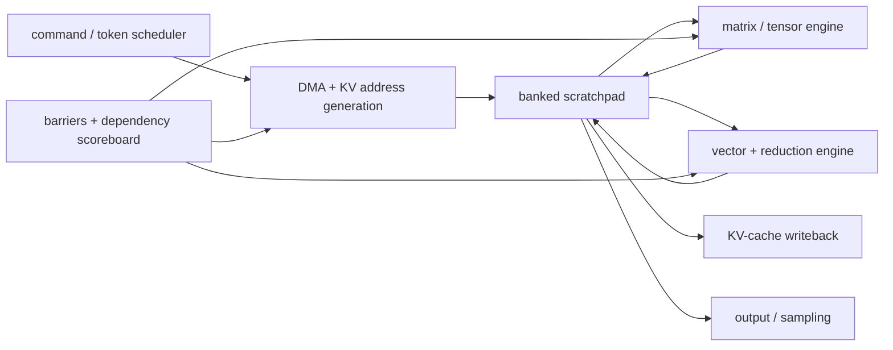

# Transformer and Attention Engine Microarchitecture — From Matrix Tiles to Token Pipelines

> **First-time reader orientation:** A Transformer processes a sequence of tokens. Most work is matrix multiplication, but attention also needs reductions, exponentials, normalization, and a growing key–value history. An effective neural processing unit (NPU) must keep its matrix engine busy while a vector engine, scratchpad, memory system, and control sequencer handle those non-matrix steps.

> **Abbreviation key — skim now and return as needed:** neural processing unit (NPU); deep neural network (DNN); large language model (LLM); multi-head attention (MHA); grouped-query attention (GQA); feed-forward network (FFN); general matrix multiplication (GEMM); general matrix-vector multiplication (GEMV); multiply-accumulate (MAC); tera operations per second (TOPS); processing element (PE); key–value (KV); high-bandwidth memory (HBM); direct memory access (DMA); static random-access memory (SRAM); first in, first out (FIFO); floating point (FP); integer (INT); operations per byte (Op/B); time to first token (TTFT); time per output token (TPOT).

> **Prerequisites:** [NPU Accelerators](01_NPU_Accelerators.md) for the array–scratchpad map, [Systolic and Spatial Dataflows](02_Systolic_Spatial_and_Vector_Dataflows.md) for stationary operands, and [Tensor Tiling](../02_Mapping_and_Memory/01_Tensor_Tiling_and_Data_Movement.md) for blocking.
> **Hands off to:** [Dynamic Sparsity and Mixture-of-Experts](04_Dynamic_Sparsity_MoE_and_Irregular_Execution.md), [Decoupled Access–Execute](../02_Mapping_and_Memory/03_Decoupled_Access_Execute_and_Scratchpad_Scheduling.md), and [HBM Systems](../../02_GPU_Architecture/02_Memory_System/02_HBM_and_Advanced_Memory_Systems.md).

---

## 0. Why a “systolic array” is no longer a complete NPU description

Convolutional-network accelerators could be explained largely as a stream of dense tensor contractions. Transformer inference adds strongly different phases:

- **prefill:** process many input tokens at once; large GEMMs provide high reuse;
- **decode:** produce one or a few new tokens per request; weight reads and KV-cache reads dominate;
- **attention:** combine matrix products with row-wise maximum, exponential, sum, and normalization;
- **feed-forward:** large projection GEMMs, sometimes with dynamic expert selection;
- **sampling and control:** reductions, top-k selection, random sampling, and sequence bookkeeping.

One peak-TOPS number cannot describe all of them. The chip needs a heterogeneous token pipeline.

## 1. The Transformer block as hardware operations

For input activation matrix $X$, projection weights form queries, keys, and values:

$$
Q=XW_Q,\qquad K=XW_K,\qquad V=XW_V.
$$

Attention computes

$$
O=\operatorname{softmax}\left(\frac{QK^T}{\sqrt{d_h}}+M\right)V,
$$

where $d_h$ is head dimension and $M$ is an optional causal or padding mask. The block then applies output projection, normalization, residual addition, and an FFN.

Hardware sees several operator classes:

| Operator | Preferred engine | Main pressure |
|---|---|---|
| Q/K/V and FFN projections | matrix array | weight bandwidth and tile utilization |
| $QK^T$ and probability–$V$ products | matrix array | sequence tile reuse |
| row max, sum, scale | reduction/vector | cross-lane reduction bandwidth |
| exponential, reciprocal, activation | vector/special function | approximation accuracy and throughput |
| normalization/residual | vector | SRAM read-modify-write traffic |
| KV-cache append/read | DMA and memory | capacity, irregular addresses, HBM bandwidth |

The array and vector unit must be sized together. A 4× larger matrix engine does not help if softmax or normalization serializes every tile.

## 2. Prefill and decode are different machines

During prefill, a batch of $S$ tokens turns projections into GEMMs. Weight tiles are reused across many token rows, so operational intensity can be high. During autoregressive decode, each sequence contributes one new query. A projection resembles GEMV unless many independent requests are batched.

For a $d\times d$ weight matrix with $b_w$ bytes per weight, a single-token projection performs about $2d^2$ operations while reading about $b_wd^2$ weight bytes:

$$
I_{decode}\approx\frac{2}{b_w}\ \text{operations/byte}.
$$

At one-byte weights this is only about 2 Op/B, usually far left of a modern accelerator's roofline ridge. Decode is therefore often memory-bound even when the same layer is compute-bound during prefill.

This changes microarchitecture priorities:

- prefill values large array throughput and on-chip reuse;
- decode values weight/KV bandwidth, request batching, small-tile utilization, and low scheduling overhead;
- a unified design may partition a large array or use both vector and matrix paths for small shapes.

## 3. Online softmax and tiled attention

Materializing the full $S\times S$ score matrix in HBM wastes bandwidth. Tiled attention streams key/value blocks and keeps only row statistics and partial outputs on chip.

For one query tile, maintain running maximum $m$, normalization sum $l$, and output accumulator $o$. When a new score block has row maximum $m_b$, update

$$
m' = \max(m,m_b),
$$

$$
l' = e^{m-m'}l+\sum_j e^{s_j-m'},
$$

$$
o' = e^{m-m'}o+\sum_j e^{s_j-m'}v_j.
$$

Final output is $o/l$. The rescaling preserves numerical stability without storing all probabilities.

This algorithm maps to a pipeline:

1. DMA fetches a K/V tile.
2. Matrix engine computes score tile $QK^T$.
3. reduction engine finds row maxima.
4. vector engine subtracts, exponentiates, and sums.
5. matrix/vector engine accumulates weighted V.
6. barrier releases the scratchpad bank for the next tile.

The architectural advance is not a new multiplier. It is **fusion that keeps the score tile on chip** and event-driven overlap among engines.

## 4. Matrix-engine choices

### 4.1 One large array versus partitioned arrays

A $D\times D$ systolic array has excellent density for large square GEMMs but poor utilization when one dimension is small. Attention heads, batch-1 decode, and narrow projections create such shapes.

Partitioning the array into smaller independently schedulable regions improves small-shape utilization and lets different heads run concurrently. It costs boundary muxes, control, and potentially less efficient global data broadcast.

### 4.2 Accumulator organization

Partial sums may remain:

- in PE-local accumulators;
- in a dedicated accumulator SRAM;
- in the shared scratchpad;
- in vector registers for fused post-processing.

Keeping them near the matrix engine minimizes movement, but attention needs to hand results to reduction/vector logic. A dedicated accumulator network or shared SRAM bank may be worth the extra port to avoid round-tripping through HBM.

### 4.3 Precision lanes

Input formats may be FP16, BF16, FP8, INT8, or lower; accumulation normally uses a wider format. Reconfigurable multipliers can pack more low-precision operations into the same datapath. The microarchitecture must also support scaling, zero points, saturation, and format conversion without making the vector unit the bottleneck.

## 5. Vector, reduction, and special-function engine

The vector side is not leftover control logic. It needs predictable throughput for:

- max and sum reduction trees;
- exponential or base-2 exponential approximation;
- reciprocal and reciprocal square root;
- layer normalization and root-mean-square normalization;
- activation functions such as sigmoid or gated linear units;
- quantize/dequantize and scale application;
- top-k and sampling support.

An exponential unit may use range reduction plus a polynomial or table approximation. Accuracy policy is part of architecture: acceptable error, rounding mode, exceptional inputs, and accumulation width must match model-quality validation.

If one attention tile produces $R$ rows every $T_M$ cycles and the vector engine processes $V$ rows/cycle, avoiding backlog requires

$$
V\ge\frac{R}{T_M}.
$$

Burst buffering may cover short imbalance, but average vector service must meet arrival rate.

## 6. KV-cache microarchitecture

During decode, each layer reads keys and values for all prior tokens and appends the new key/value. The KV cache may exceed on-chip SRAM by orders of magnitude.

Hardware support includes:

- descriptor-based gather from paged or segmented cache blocks;
- address generation for batch, head, token, and page dimensions;
- coalescing adjacent sequences or heads;
- separate queues for KV reads and weight reads;
- prefetch distance tied to the attention pipeline;
- compression or reduced-precision storage;
- append buffers that combine small writes into efficient bursts;
- protection and translation through the accelerator's memory context.

Grouped-query attention reduces KV capacity by sharing keys and values among several query heads. Microarchitecturally this changes multicast: one K/V tile feeds multiple query-head consumers, increasing reuse and reducing HBM traffic.

## 7. Scratchpad banking and lifetime

A fused attention tile may simultaneously hold Q, K, V, scores, row statistics, partial output, scales, and double-buffered successors. Capacity is a liveness problem:

$$
C_{SP}\ge\sum_i D_i C_i,
$$

where $C_i$ is bytes for object $i$ and $D_i$ is the number of live buffers or pipeline versions.

Banking must serve DMA writes, matrix reads, vector reads/writes, and output drain. Assigning fixed tensor roles to banks simplifies conflict analysis but can strand capacity. A configurable bank-group allocator improves flexibility but needs descriptors, hazard tracking, and a crossbar.

Lifetime ends only when the last consumer signals release. Reusing a bank when matrix compute is done but vector normalization still reads it is a classic asynchronous corruption bug.

## 8. Command processor and dependency scoreboard

An NPU usually executes descriptors rather than discovering instruction-level parallelism dynamically. A descriptor names tensor addresses, shapes, strides, precision, tiling, and the engine operation. The command processor expands it into DMA, matrix, vector, and barrier commands.

Advanced designs allow several command queues to proceed independently. A dependency scoreboard tracks event tokens such as:

- tile `A0` filled;
- weights `W3` resident;
- matrix group `M7` complete;
- vector normalization `V7` complete;
- output buffer free.

This is out-of-order execution at a coarser granularity. It avoids per-MAC instruction overhead while still overlapping independent engines.

## 9. Scheduling many requests

Serving hardware must mix requests with different sequence lengths and phases. Useful policies include:

- continuous batching: insert new requests as others finish;
- separate prefill and decode queues;
- bucket by sequence length or tensor shape;
- reserve latency slots for short requests;
- merge decode tokens until a GEMM-sized batch forms;
- schedule KV-heavy and weight-heavy operations to avoid one memory queue monopolizing bandwidth.

Batching increases array utilization but delays individual tokens. If a batch waits $T_q$ to save $T_s$ of execution per request, it helps throughput but harms latency whenever $T_q>T_s$ for the target service-level objective.

## 10. Serving algorithms create new architectural state

Serving optimizations are not only runtime policies; several change the state and safe points the NPU must expose.

### 10.1 Chunked prefill

A long prompt can monopolize a matrix engine and delay latency-sensitive decode. Chunked prefill compiles prompt work into bounded token blocks that can be interleaved with decode. A useful microarchitectural interface provides:

- completion/preemption points at chunk boundaries;
- persistent online-attention and KV-write state across chunks;
- bounded scratchpad/accumulator drain time before another context runs;
- scheduler-visible estimates for chunk compute, KV bytes, and collective time;
- separate priorities or credits for prefill and decode command streams.

Smaller chunks reduce blocking time but increase fill/drain, descriptor, barrier, and partial-state traffic. The optimal chunk is determined by the decode tail-latency objective and the array/vector/memory balance, not by software convenience alone.

### 10.2 Speculative decoding

Speculative decoding lets a smaller draft model propose several tokens and asks the target model to verify them together while preserving the target distribution through a correction rule [6]. Verification can turn several narrow decode steps into a wider token-parallel operation, which may suit a systolic NPU. Hardware/runtime state must support:

- separate draft and target weights or device pools;
- provisional KV tails for proposed tokens;
- a commit index for the accepted prefix;
- rollback or page release for rejected suffixes;
- deterministic random-number and sampling state under correction;
- efficient verification shapes for a small, variable proposal count.

If the NPU cannot preserve provisional pages cheaply, KV copies can erase the compute gain. If draft and target share HBM, their weight traffic can contend. The architectural result depends on acceptance distribution and verified useful tokens, not nominal proposals.

### 10.3 Prefill/decode disaggregation

Separate device pools can specialize one NPU configuration for compute-heavy prefill and another for bandwidth/latency-heavy decode; DistServe is a primary systems treatment of this phase separation [7]. The boundary is the KV representation. A deployable design needs a versioned, transferable KV layout; DMA/network paths that can move or stream layer/chunk state; protection and ownership handoff; and a decoder that can begin only after the required pages and metadata are visible.

If $B_{KV}$ bytes cross a delivered network rate $B_n$, handoff adds at least $B_{KV}/B_n$ before setup and queueing. Streaming can overlap transfer with later prefill layers/chunks, but requires per-page readiness events and topology-aware placement. [End-to-End AI Inference and Serving](../05_AI_Workloads_and_Serving/02_End_to_End_AI_Inference_and_Serving_on_NPUs.md) derives the complete service path.

## 11. Verification and counters

Verify:

1. online-softmax rescaling matches a high-precision reference within the documented error bound;
2. causal masking prevents future-token contribution;
3. scratchpad release occurs after the final matrix and vector consumer;
4. KV page translation and bounds belong to the correct request and protection context;
5. mixed precision applies the correct scale to every tile;
6. a canceled request cannot append KV state or write output;
7. event tokens include generations so stale completions cannot release reused buffers;
8. arbitration guarantees forward progress for matrix, vector, and DMA queues.

Counters should report array utilization by shape, vector backlog, reduction occupancy, SRAM bank conflicts, weight bytes, KV bytes, DMA/address-generation engine idle time, prefill/decode queue delay, and buffer-lifetime stalls. A product-specific tensor-memory accelerator should be named separately only when the NPU actually implements that block.

## 12. Worked examples

**1 — Decode intensity.** A 4096×4096 INT8 projection reads about 16 MiB of weights and performs about 33.6 million operations for one token, roughly 2 Op/B. At 2 TB/s sustained memory bandwidth, the bandwidth ceiling is about 4 TOPS regardless of a much higher matrix peak. Batching 64 tokens reuses each weight tile across 64 rows and can raise intensity toward 128 Op/B before other traffic.

**2 — Vector balance.** A matrix engine emits 128 attention rows every 64 cycles, or 2 rows/cycle. A vector engine that normalizes 1 row/cycle accumulates one row of backlog per cycle and will eventually stall the matrix path. Two rows/cycle is the minimum balanced throughput; more provides burst headroom.

**3 — KV capacity.** A model has 32 layers, 8 KV heads, head dimension 128, two tensors K and V, FP16 storage, and 32,768 cached tokens. Capacity is $32\times8\times128\times2\times2\times32768\approx4$ GiB per sequence. GQA head sharing and lower precision directly reduce both capacity and read bandwidth.

## Numbers to remember

| Quantity | Typical scale | Why it matters |
|---|---:|---|
| decode projection intensity | about $2/b_w$ Op/B for one token | often memory-bound |
| attention score storage | $O(S^2)$ if materialized | motivates tiled online softmax |
| KV capacity | $O(LHSd_h)$ | grows linearly with context and layers |
| pipeline tile interval | $\max(T_{DMA},T_{matrix},T_{vector})$ | balance engines, not just matrix peak |
| live tile buffers | commonly 2–4 versions | latency hiding consumes SRAM capacity |
| accumulator precision | wider than input precision | prevents long reductions from losing accuracy |
| chunk boundary | bounded prefill safe point | trades tail blocking against fill/control overhead |
| speculative KV tail | commit/rollback state | provisional tokens must not corrupt committed history |

## Cross-references

- [NPU Accelerators](01_NPU_Accelerators.md) supplies the baseline array and roofline model.
- [Dynamic Sparsity and MoE](04_Dynamic_Sparsity_MoE_and_Irregular_Execution.md) handles data-dependent token and expert work.
- [Decoupled Access–Execute](../02_Mapping_and_Memory/03_Decoupled_Access_Execute_and_Scratchpad_Scheduling.md) expands the DMA, descriptor, and event-token machinery.
- [AI Workloads and Serving](../05_AI_Workloads_and_Serving/00_Index.md) connects these datapaths to compiler lowering, model loading, continuous batching, multi-NPU sharding, TTFT/TPOT, and research evidence.
- [Advanced GPU Execution](../../02_GPU_Architecture/01_Core_Architecture/04_Independent_Thread_Scheduling_and_Asynchronous_Pipelines.md) contrasts GPU warp-specialized attention pipelines with a dedicated NPU sequencer.

## References

1. N. P. Jouppi et al., “In-Datacenter Performance Analysis of a Tensor Processing Unit,” ISCA 2017 — [Google Research](https://research.google/pubs/in-datacenter-performance-analysis-of-a-tensor-processing-unit/).
2. T. Dao et al., “FlashAttention: Fast and Memory-Efficient Exact Attention with IO-Awareness,” NeurIPS 2022 — [paper](https://arxiv.org/abs/2205.14135).
3. S. Lu et al., “Hardware Accelerator for Multi-Head Attention and Position-Wise Feed-Forward in the Transformer,” 2020 — [paper](https://arxiv.org/abs/2009.08605).
4. H. Wang, Z. Zhang, and S. Han, “SpAtten,” HPCA 2021 — [paper](https://arxiv.org/abs/2012.09852).
5. NVIDIA, “Hopper Tuning Guide,” for asynchronous tensor movement and warp-specialized pipelines — [documentation](https://docs.nvidia.com/cuda/hopper-tuning-guide/).
6. Y. Leviathan, M. Kalman, and Y. Matias, “Fast Inference from Transformers via Speculative Decoding,” ICML 2023 — [PMLR](https://proceedings.mlr.press/v202/leviathan23a.html).
7. Y. Zhong et al., “DistServe: Disaggregating Prefill and Decoding for Goodput-optimized Large Language Model Serving,” OSDI 2024 — [USENIX](https://www.usenix.org/conference/osdi24/presentation/zhong-yinmin).

---

← [Systolic, Spatial, and Vector Dataflows](02_Systolic_Spatial_and_Vector_Dataflows.md) · [Compute Dataflows index](00_Index.md) · next → [Dynamic Sparsity, MoE, and Irregular Execution](04_Dynamic_Sparsity_MoE_and_Irregular_Execution.md)
