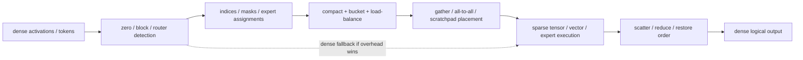

# Dynamic Sparsity, Mixture-of-Experts, and Irregular NPU Execution

> **First-time reader orientation:** Dense tensor hardware assumes every processing element receives useful work at a predictable time. Sparse models and mixture-of-experts (MoE) models break that assumption: useful values appear at irregular positions, and different tokens choose different expert networks. The advanced microarchitecture is the machinery that finds, routes, balances, and retires this data-dependent work.

> **Abbreviation key — skim now and return as needed:** neural processing unit (NPU); deep neural network (DNN); large language model (LLM); mixture of experts (MoE); processing element (PE); general matrix multiplication (GEMM); general matrix-vector multiplication (GEMV); sparse matrix–dense matrix multiplication (SpMM); sampled dense–dense matrix multiplication (SDDMM); compressed sparse row (CSR); compressed sparse column (CSC); multiply-accumulate (MAC); network on chip (NoC); high-bandwidth memory (HBM); static random-access memory (SRAM); first in, first out (FIFO); operations per byte (Op/B).

> **Prerequisites:** [Sparsity, Quantization, and Compression](../02_Mapping_and_Memory/02_Sparsity_Quantization_and_Compression.md) for representation and [Systolic and Spatial Dataflows](02_Systolic_Spatial_and_Vector_Dataflows.md) for the dense baseline.
> **Hands off to:** [Transformer and Attention Engines](03_Transformer_and_Attention_Engine_Microarchitecture.md) for attention, [Decoupled Access–Execute](../02_Mapping_and_Memory/03_Decoupled_Access_Execute_and_Scratchpad_Scheduling.md) for queues and scratchpads, and [NoC Routing](../../04_SoC_and_Chiplet_Architecture/04_On_Chip_Networks/02_Routing_Flow_Control_and_Deadlock.md) for transport correctness.

---

## 0. Skipping zeros is not the hard part

If half the operands are zero, the theoretical arithmetic saving is 2×. Real hardware realizes less because it must:

- read and decode position metadata;
- match nonzero coordinates;
- route operands to available PEs;
- compact useful outputs;
- balance variable work across lanes;
- preserve deterministic accumulation and numerical behavior;
- fall back efficiently when a tile is dense.

The central distinction is:

> **Sparsity removes arithmetic but adds control and communication.**

A sparse accelerator wins only when removed data movement and MAC work exceed the metadata, matching, routing, and imbalance cost.

## 1. Structured versus unstructured sparsity

**Structured sparsity** removes fixed groups—blocks, channels, or a pattern such as two nonzeros in every four weights. Hardware can decode the pattern with small masks and route remaining values through regular datapaths.

**Unstructured sparsity** permits arbitrary zero positions. It offers more pruning freedom but requires coordinates or run lengths and creates irregular matches.

For density $d$, value width $b_v$, and metadata cost $b_m$ per retained value, compressed bytes relative to dense bytes are approximately

$$
R_{bytes}=d\frac{b_v+b_m}{b_v}.
$$

Compression saves bandwidth only when $R_{bytes}<1$, or

$$
d<\frac{b_v}{b_v+b_m}.
$$

With 8-bit values and 4-bit average metadata, density must be below $8/12=66.7\%$ before capacity falls at all. Decode and routing energy demand an even lower break-even density.

## 2. Sparse storage and decode front end

CSR and CSC store nonzero values, their column or row indices, and pointers marking each row or column. Block-sparse formats store coordinates per tile rather than per value. Bitmap formats spend one bit per candidate position and are attractive at moderate density.

A sparse decode front end contains:

- metadata and value fetch queues;
- pointer walkers or bitmap scanners;
- prefix-sum or population-count logic to locate packed values;
- bounds and malformed-stream checks;
- small FIFOs decoupling variable-rate decode from compute;
- tile-density detection for sparse-versus-dense dispatch.

Metadata and values must remain synchronized across retries. A dropped metadata word can misassociate every later value, so designs use packet lengths, tile identifiers, checksums, and end markers rather than an unframed stream.

## 3. Matching sparse operands

Sparse–dense multiplication only needs coordinates from the sparse operand. Sparse–sparse multiplication must find matching reduction coordinates from both operands.

Common matching microarchitectures include:

- merge two sorted index streams;
- intersect bitmaps;
- hash or associative lookup;
- distribute nonzeros by coordinate and merge partial products;
- convert one operand to a dense local tile when density is high.

The matcher produces a variable number of products per cycle. Elastic FIFOs isolate it from the multiplier array. If average matcher output is $\lambda_m$ products/cycle and compute accepts $\mu_c$, stable execution requires $\lambda_m<\mu_c$; burst capacity handles local variation but cannot fix an average mismatch.

## 4. Flexible distribution and reduction

A dense systolic array assumes each operand advances to a predictable neighbor. Irregular sparsity needs a more flexible interconnect:

- multicast one activation to PEs holding matching weights;
- unicast uncommon values;
- route partial sums to the owner of an output coordinate;
- merge multiple products targeting the same output;
- bypass idle PEs or steal work.

Eyeriss v2 uses a hierarchical mesh that can change between unicast, multicast, and broadcast behavior. SIGMA uses flexible distribution and reduction networks to support irregular GEMM. The recurring trade-off is regular-wire efficiency versus mapping flexibility.

A full crossbar can route anything but scales poorly in area and energy. Multi-stage networks or hierarchical clusters reduce cost, at the price of blocking and path-dependent latency. Queue depth and credit flow control become part of the PE utilization equation.

## 5. Load balance: useful work, not stored elements

Equal numbers of nonzeros do not guarantee equal work. In a matrix product, a nonzero that matches many values produces more MACs than one that matches none. An accurate work estimator counts expected matches or output updates.

Scheduling options include:

- static partition by row, column, head, or block;
- split heavy rows into several tasks;
- global or hierarchical work queues;
- work stealing among PE clusters;
- overdecomposition into many small tiles;
- dynamic dense fallback for high-density tiles.

If PE $i$ receives work $w_i$, ideal balanced time is $\sum_i w_i/P$. Actual time is at least $\max_i w_i$, so load-balance efficiency is

$$
\eta_{bal}=\frac{\sum_i w_i}{P\max_i w_i}.
$$

Arithmetic sparsity of 80% can still underperform dense hardware if one PE receives most surviving work.

## 6. Mixture-of-experts as dynamic sparsity

An MoE layer contains many expert subnetworks but routes each token to only a small top-$k$ subset. It is sparse activation at expert granularity.

The pipeline is:

1. a router computes expert scores for each token;
2. top-$k$ selection chooses experts;
3. tokens are counted and grouped by expert;
4. a prefix sum assigns compacted buffer offsets;
5. tokens travel to local or remote expert engines;
6. each expert executes a batched FFN;
7. outputs return and are weighted/reordered into token order.

This adds hardware needs absent from a dense FFN:

- top-k reduction;
- histogram and prefix-sum engines;
- token compaction/scatter and inverse gather;
- per-expert queues and capacity limits;
- all-to-all transport across cores or chips;
- dynamic batching and expert cache policy;
- overflow and dropped-token behavior defined by the model.

## 7. Expert imbalance and capacity

If $T$ tokens each choose $k$ experts among $E$, average assignments per expert are $Tk/E$. Real routers are not uniform. A hot expert can determine layer time while other engines idle.

Systems use a **capacity factor** $c>1$, reserving roughly

$$
C_e=\left\lceil c\frac{Tk}{E}\right\rceil
$$

token slots per expert. Larger $c$ reduces overflow but increases buffer capacity and worst-case communication. Hardware must implement the chosen overflow policy: drop, reroute, spill, or stall. Silently overwriting a full expert queue changes the neural network.

Dynamic schedulers can split hot experts across replicated engines, merge cold experts onto one engine, or delay a batch until enough same-expert tokens form an efficient GEMM. These improve utilization but add token latency and ordering state.

## 8. Expert weights and memory hierarchy

MoE reduces active compute per token but increases total parameter capacity. All expert weights may not fit in local HBM or SRAM. The hierarchy may:

- keep popular experts resident;
- prefetch predicted experts after router scores are partially known;
- replicate hot experts across chips;
- shard large experts;
- stream cold experts from slower memory;
- use near-memory compute for low-intensity GEMV-like experts.

Expert caching resembles a cache but with much larger objects and software-visible scheduling. Replacement cost is not a cache-line miss; it can be megabytes of weights. Admission should consider expected future token count, transfer time, and residency opportunity.

If expert weights take $T_w$ to load and then serve $n$ tokens at per-token saved time $\Delta T$, prefetch/admission breaks even only when

$$
n\Delta T>T_w.
$$

## 9. Sparse attention

Sparse attention removes score connections between token pairs. Hardware typically performs:

- SDDMM to compute selected $QK^T$ entries;
- masking or pruning;
- sparse softmax reductions;
- SpMM to multiply sparse probabilities by V.

The sparse pattern may be static (window/block), learned but fixed per layer, or dynamic per input. Static block sparsity maps most efficiently because tiles align with memory bursts and matrix units. Fine-grained dynamic sparsity saves more arithmetic but requires runtime index generation and irregular reduction.

SpAtten prunes tokens and heads; Sanger co-designs a regular sparse pattern and reconfigurable datapath. The general architecture lesson is to make the sparsity granularity match the transport and compute granularity. A theoretically sparse pattern that produces one useful value per cache line is a bandwidth loss.

## 10. Dense fallback and mode selection

Sparse hardware should not force every tile through metadata decode. A density estimator or compiler hint can choose:

- dense systolic path;
- structured-sparse tensor path;
- unstructured sparse path;
- vector/scalar path for tiny fragments.

Let dense time be $T_d$ and sparse time

$$
T_s=T_{meta}+dT_{compute}+T_{imbalance}+T_{route}.
$$

Choose sparse only when $T_s<T_d$. The threshold varies with tile shape, value width, metadata cache hit rate, and NoC pressure, so a fixed global density threshold is rarely optimal.

## 11. Correctness, determinism, and numerical order

Dynamic work distribution can change accumulation order. Floating-point addition is not associative, so two legal schedules may produce slightly different answers. Architecture must specify whether results are deterministic, reproducible within a tolerance, or unconstrained within the numeric format.

Verify:

1. metadata decodes to exactly the intended coordinates;
2. every surviving product contributes once to the correct output;
3. zero-skipped work truly has a zero contribution under quantization and scaling rules;
4. expert compaction and inverse gather preserve token identity;
5. overflow follows the model's defined policy;
6. credits prevent network and expert-queue overflow;
7. partial sums cannot deadlock while waiting for each other;
8. sparse/dense mode transitions use identical numerical scales and layouts;
9. malformed descriptors cannot read outside the assigned memory context.

Useful counters include decoded density, metadata bytes, matcher utilization, PE imbalance, dense-fallback rate, expert histogram, overflow count, token all-to-all bytes, hot-expert replication hits, and sparse queue backpressure.

## 12. Worked examples

**1 — Metadata break-even.** INT8 values use 8 bits and each retained value averages 6 metadata bits. At density $d=40\%$, compressed size is $0.4(8+6)/8=0.70$ of dense—30% fewer bytes. At $d=70\%$, it is $1.225$ of dense, so compression increases capacity even before decode energy.

**2 — Balance loss.** Eight PE clusters receive work `[100, 100, 100, 100, 100, 100, 100, 900]`. Total is 1600, ideal time 200, actual at least 900. $\eta_{bal}=1600/(8\times900)=22.2\%$. Even though all 1600 operations are useful, imbalance wastes nearly four-fifths of peak capacity.

**3 — MoE capacity.** 4096 tokens choose top-2 among 64 experts. Average is 128 assignments/expert. With capacity factor 1.25, each expert buffer reserves 160 token slots. If one expert receives 230 assignments, 70 must be rerouted, spilled, dropped, or stall the layer—the hardware cannot treat capacity factor as merely a software statistic.

## Numbers to remember

| Quantity | Typical scale | Why it matters |
|---|---:|---|
| sparse metadata | bits to several bytes per nonzero | sets bandwidth break-even density |
| structured pattern | small fixed groups or blocks | maps efficiently to regular tensor hardware |
| MoE top-k | commonly a small subset of experts | sparse compute but dynamic routing |
| capacity factor | above 1 | trades overflow risk for buffer/communication cost |
| balance efficiency | $\sum w_i/(P\max w_i)$ | useful-work utilization after skew |
| sparse win condition | saved compute + bytes > metadata + routing + imbalance | prevents “zero count” from being mistaken for speedup |

## Cross-references

- [Sparsity, Quantization, and Compression](../02_Mapping_and_Memory/02_Sparsity_Quantization_and_Compression.md) explains formats before this execution machinery.
- [Transformer and Attention Engines](03_Transformer_and_Attention_Engine_Microarchitecture.md) supplies the dense/fused attention baseline.
- [Network-on-Chip](../../04_SoC_and_Chiplet_Architecture/04_On_Chip_Networks/01_Network_on_Chip.md) covers the routing fabric used by dynamic tokens and operands.
- [GPU Operand Delivery](../../02_GPU_Architecture/01_Core_Architecture/03_Operand_Collectors_Register_Files_and_Scoreboards.md) provides a throughput-processor comparison for elastic operand collection.

## References

1. Y.-H. Chen et al., “Eyeriss v2: A Flexible Accelerator for Emerging Deep Neural Networks,” JETCAS 2019 — [paper](https://eems.mit.edu/wp-content/uploads/2019/04/2019_jetcas_eyerissv2.pdf).
2. E. Qin et al., “SIGMA: A Sparse and Irregular GEMM Accelerator with Flexible Interconnects for DNN Training,” HPCA 2020 — [DOI](https://doi.org/10.1109/HPCA47549.2020.00015).
3. H. Wang, Z. Zhang, and S. Han, “SpAtten,” HPCA 2021 — [paper](https://arxiv.org/abs/2012.09852).
4. L. Lu et al., “Sanger: A Co-Design Framework for Enabling Sparse Attention using Reconfigurable Architecture,” MICRO 2021 — [paper](https://liqianglu-zju.github.io/files/conference/2021/MICRO_2021_Sanger.pdf).
5. S. Rajbhandari et al., “DeepSpeed-MoE,” 2022 — [paper](https://arxiv.org/abs/2201.05596).

---

← [Transformer and Attention Engines](03_Transformer_and_Attention_Engine_Microarchitecture.md) · [Compute Dataflows index](00_Index.md) · next → [Mapping and Memory](../02_Mapping_and_Memory/00_Index.md)
