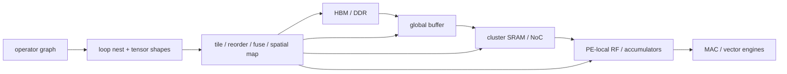
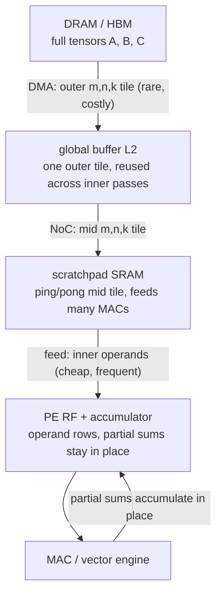
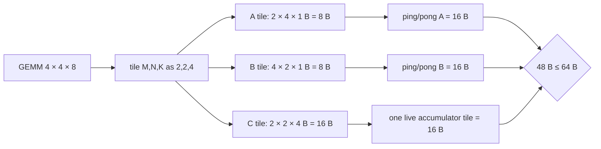

# Tensor Tiling and Data Movement — The Neural Processing Unit (NPU) Compiler–Memory Contract

> **First-time reader orientation:** A tensor is a multidimensional array. Tiling divides a large operation into blocks that fit the NPU’s local scratchpad memories. A legal tile must fit inputs, weights, partial sums, metadata, and buffering while keeping enough processing elements busy. Performance comes from reducing expensive movement and overlapping transfers with computation.

> **Abbreviation key — skim now and return as needed:** register file (RF); static random-access memory (SRAM); high-bandwidth memory (HBM); double data rate (DDR); network on chip (NoC);
> direct memory access (DMA); processing element (PE); multiply-accumulate (MAC); general matrix multiplication (GEMM); 8-bit integer (INT8);
> kibibyte (KiB); mebibyte (MiB).

> **Prerequisites:** [NPU Accelerators](../01_Compute_Dataflows/01_NPU_Accelerators.md), [Systolic, Spatial, and Vector Dataflows](../01_Compute_Dataflows/02_Systolic_Spatial_and_Vector_Dataflows.md), and [HBM](../../02_GPU_Architecture/02_Memory_System/02_HBM_and_Advanced_Memory_Systems.md).
> **Hands off to:** compiler mapping/search, scratchpad controllers, NoC scheduling, and host command execution. This page owns loop blocking and data-movement accounting.

---

## 0. Why this page exists

Moving an operand from HBM can cost orders of magnitude more energy than using it in a MAC. Tiling keeps a working subset in each on-chip level long enough to reuse it, but every larger tile consumes capacity and can reduce parallelism or double buffering.

The mapping is correct only if capacity, bandwidth, ordering, boundary masks, and dependencies all hold simultaneously.

## Before the details: a tile is a capacity-and-reuse contract

A tensor operation is often too large to keep all operands on chip. Tiling chooses smaller ranges of loop indices whose input, weight, output, and metadata footprints fit a memory level. Those ranges determine how often each byte is reused before eviction and how much traffic must cross the next, more expensive boundary.

Picture the levels as a staging pipeline: every boundary crossing costs more energy per byte than the one below it, so a byte is pulled down once and reused many times before eviction. The *same* loop nest is split at each boundary — outer tile indices select what lives in the larger, slower level; inner indices select the operands a PE touches this step. That correspondence (one loop split per memory boundary) is the mechanism the rest of this page accounts for.

For matrix multiplication, a tile with dimensions $M_t$, $N_t$, and $K_t$ needs an input block $M_tK_t$, a weight block $K_tN_t$, and partial sums $M_tN_t$, multiplied by their data widths. Double buffering may require two copies of inputs or weights so transfer overlaps computation. Alignment, bank placement, halos, tails, and compressed metadata consume additional capacity. A mathematically fitting tile may still starve the array if its transfers cannot complete before the current tile finishes.

**Beginner checkpoint:** write a byte-accurate capacity equation and traffic equation before running a mapping search. The compiler search should explore legal, understood choices—not compensate for an undefined memory model.

### Derive a legal schedule from one tile that does not fit

Consider `GEMM C[4,4] = A[4,8] × B[8,4]` with INT8 inputs and 32-bit partial sums. The array is $2\times2$, and the relevant scratchpad partition is 64 bytes. A first attempt keeps the entire operation resident:

$$
S_A=4\cdot8=32\text{ B},\quad S_B=8\cdot4=32\text{ B},\quad S_C=4\cdot4\cdot4=64\text{ B}.
$$

The 128-byte live set is already twice the capacity before alignment, metadata, or overlap. This is the baseline failure that creates tiling: choose $M_t=2$, $N_t=2$, and $K_t=4$. One activation tile is 8 B, one weight tile is 8 B, and one accumulator tile is 16 B. Double-buffering A and B requires

$$
2(8)+2(8)+16=48\text{ B},
$$

leaving 16 B for bank-rounding or command metadata. The tile fits, but capacity legality is only the first proof obligation.

Now map the operation. There are four $(m,n)$ output tiles and two $k$ slabs per output tile. Because a $C$ tile must accumulate both slabs, the two $k$ commands for a given $(m,n)$ cannot be separated by an overwrite or drain of its accumulator. A useful loop order is `m_tile → n_tile → k_tile`, with an optimization: keep both 8-byte A slabs for one `m_tile` resident while the two `n_tile` values stream different B slabs. The same A bytes then serve both left and right output tiles.

| Step | Resident or transferred data | Array action | Ownership transition |
|---:|---|---|---|
| 0 | DMA `A[m0,k0]`, `A[m0,k1]`, and `B[k0,n0]` | idle | selected input banks `FREE→FILLING→READY` |
| 1 | retain `A[m0,k0]`; prefetch `B[k1,n0]` | accumulate first four $k$ terms into `C[m0,n0]` | accumulator `FREE→IN_USE` |
| 2 | select resident `A[m0,k1]`; prefetch `B[k0,n1]` | accumulate final four terms | `C[m0,n0]` becomes `READY` |
| 3 | output DMA drains `C[m0,n0]` | begin `C[m0,n1]` with `A[m0,k0]` and `B[k0,n1]` | old output bank drains while alternate accumulator is used |
| 4 | prefetch `B[k1,n1]` | finish `C[m0,n1]` | both A slabs have now been reused across two N tiles |
| 5 | replace A banks with `A[m1,k0/k1]` | repeat for bottom two output tiles | A lifetime ends only after its last N consumer |

This replay exposes what a mapping descriptor must encode: original extents; tile extents; loop order; array spatial assignment; scratchpad allocation and bank mapping; A/B/C layouts and strides; accumulator initialization versus continuation for each $k$ slab; boundary masks; buffer phase; predecessor/producer events; and the exact event after which each allocation can be reused. A tuple `(2,2,4)` alone is not an executable mapping.

### Follow each failure to the feature that repairs it

1. **Whole live set exceeds capacity → hierarchical tiling.** The compiler splits loops at HBM, scratchpad, and PE levels. Enabling hardware consists of nested address counters, programmable strides, partial-tile masks, and accumulator-continuation state. Smaller tiles fit but reduce reuse and increase command/ramp overhead.
2. **Legal tile serializes load and compute → ping-pong allocation.** Two physical phases plus `FILLING/READY/IN_USE` ownership let DMA and compute overlap. The price is duplicated bytes and more bank conflicts. If doubling A and B forces $M_t$ or $N_t$ to shrink, saved overlap can be smaller than lost reuse.
3. **Repeated B tiles waste A reloads → change loop order and lifetime.** Retaining both A slabs across `n_tile` avoids a second A fetch. It requires capacity and a liveness record proving no later consumer remains before eviction. If B is much larger or reused more, the opposite order may be better.
4. **Logical fit still conflicts physically → bank-aware layout.** Padding or an address swizzle spreads simultaneous array reads across banks. It costs wasted bytes or XOR/mux logic and can harm contiguous DMA. Capacity must be recomputed using physical allocation, not logical tensor bytes.
5. **Last tiles underfill the array → masked tail or alternate kernel.** Boundary predicates suppress invalid rows/columns. For severe tails, a vector kernel or smaller subarray may use fewer capacity slots. Masking preserves one code path but burns PE cycles.
6. **Fusion saves a round trip but enlarges the live set → joint producer/consumer tiling.** Keeping a GEMM output for bias and activation removes an output write plus later read. The fused mapping needs vector-engine ports and a shared layout; it loses if the smaller combined tile causes enough extra weight/activation reloads.

### Replay a boundary and a fault, not just the ideal tile

If the same mapping is used for $M=3,N=3,K=8$, the four output tiles have valid shapes $2\times2$, $2\times1$, $1\times2$, and $1\times1$. The descriptor retains physical $2\times2$ allocation but supplies `m_valid` and `n_valid`. Address generation must not fetch beyond logical rows merely because masked PEs ignore their products; either generate shortened DMA lines or point padded lanes at a permitted zero page. Output DMA writes only valid coordinates. The useful-output fraction is $9/16$, making a smaller subarray attractive despite identical mathematical work.

If `B[k1,n0]` faults after `C[m0,n0]` has accumulated the first slab, the command cannot clear or expose that accumulator. Its checkpoint is `(tile_id, k_tile=1, accumulator_bank, accumulator_generation, completed_reduction_count=4)`. On replay, DMA refills the missing B tile, validates the same mapping/context generation, and continues the remaining four products exactly once. A terminal permission fault instead invalidates the partial output and suppresses success. Restarting at $k=0$ without clearing would double-count; clearing would discard completed work. Precise continuation state is therefore part of the mapping contract.

### Evidence and verification at tile granularity

Counters should report logical versus physically allocated bytes; HBM/NoC/SRAM bytes by tensor and tile; A/B/C reuse distance; accumulator continuation and spills; masked PE slots; bank-conflict cycles; each buffer-state residency; DMA–compute–drain overlap; layout-conversion bytes; and fused intermediates retained versus spilled. Those measurements let a researcher reproduce why this loop order won rather than accepting a mapper's opaque score.

Assertions derived from the trace include: every logical $(m,n,k)$ iteration is issued exactly once; a continued $C$ tile uses the same tile ID, accumulator generation, scale, and reduction interval; no buffer is overwritten before its last declared consumer; physical allocation including padding stays within capacity; a masked address cannot escape tensor/protection bounds; output becomes visible only after all $K$ slabs; and a fault/replay neither loses nor duplicates a reduction interval.

## 1. Describe mapping at every level

For each loop dimension specify:

- tile factor at HBM→global, global→cluster, cluster→PE;
- temporal order within a level;
- spatial factor and array dimension;
- multicast/reduction behavior;
- buffer allocation and phase;
- padding/boundary handling;
- tensor layout and address stride.

The product of temporal and spatial factors across levels must cover the original loop extent (with legal padding). A mapping record should be machine-readable; prose like “use output stationary” cannot reproduce an experiment.

## 2. Capacity constraints for GEMM

For tile sizes $M_t,N_t,K_t$ and element bytes $b_A,b_B,b_C$, basic storage is

$$
S_A=M_tK_tb_A,\quad S_B=K_tN_tb_B,\quad S_C=M_tN_tb_C.
$$

With double-buffered inputs and one accumulator tile,

$$
2S_A+2S_B+S_C+S_{metadata}+S_{align}\le S_{buffer}.
$$

Triple buffering or overlapped output writes add more. Banking/padding can make physical allocation exceed logical bytes; compilers must use hardware allocation granularity.

For convolution, im2col may inflate activation traffic/storage. Direct mappings reuse sliding windows without materializing the expanded matrix but need more complex address generation.

## 3. Traffic accounting

For each tensor $o$ and hierarchy boundary $l$, count unique tile transfers $N_{o,l}$. Total bytes

$$
Q_l=\sum_oN_{o,l}\,size(o,l).
$$

Arithmetic intensity at boundary $l$ is

$$
I_l=\frac{operations}{Q_l}.
$$

Intuitively, $I_l$ is how many MACs you extract per byte you pay to move across boundary $l$; tiling for more reuse at a level raises that level's intensity and pushes it away from being the bottleneck.

There is a roofline at every level:

$$
P\le\min(P_{compute},BW_{HBM}I_{HBM},BW_{NoC}I_{NoC},BW_{SRAM}I_{SRAM}).
$$

A tile can be HBM-efficient and still be NoC/RF-bound because one operand is remulticast or partial sums spill.

## 4. Reuse factors

Intuitively, reuse is the number of useful MACs a byte delivers before it leaves on-chip storage. A byte fetched from HBM that feeds a single MAC and is then evicted has reuse $1$ and pays full off-chip cost per operation; tiling exists to raise that number by keeping the byte resident until every MAC that needs it has run.

For GEMM tile:

- each $A[m,k]$ is reused across $N_t$ output columns;
- each $B[k,n]$ across $M_t$ rows;
- each $C[m,n]$ accumulates $K_t$ products.

Ideal tile-level reuse reduces input bytes per MAC as $M_t,N_t$ grow, but accumulator capacity grows $M_tN_t$. Increasing all dimensions is impossible under fixed SRAM, so mapping chooses which reuse is most valuable given operand precision and bandwidth.

Reuse only counts if lifetime stays within the buffer and scheduling actually avoids reload. Two loop orders with identical tile sizes can produce different traffic.

### Worked example — tile size sets off-chip traffic

Take a square GEMM $C=A\times B$ with $M=N=K=1024$, INT8 inputs, INT32 accumulate, and square tiles $M_t=N_t=K_t=T$ (double-buffered inputs, one resident accumulator per output tile). Two quantities move in opposite directions as $T$ grows:

- **Scratchpad footprint** $=2S_A+2S_B+S_C=2T^2+2T^2+4T^2=8T^2$ bytes — grows as $T^2$.
- **Off-chip input traffic** $=2MNK/T=2\cdot1024^3/T$ bytes — falls as $1/T$, because each loaded input element feeds $T$ MACs before eviction (its reuse factor is $T$).

| Tile $T$ | Scratchpad $8T^2$ | Off-chip inputs $2\cdot1024^3/T$ | Reuse |
|---:|---:|---:|---:|
| $1$ (no reuse) | — | $2$ GiB | $1\times$ |
| $64$ | $32$ KiB | $32$ MiB | $64\times$ |
| $128$ | $128$ KiB | $16$ MiB | $128\times$ |
| $256$ | $512$ KiB | $8$ MiB | $256\times$ |

The $T=1$ row is the pathology tiling removes: fetching both operands for every MAC moves $2MNK=2$ GiB. The scaling is the whole tension — **doubling the tile halves off-chip traffic but quadruples capacity.** Returns diminish: $128\to256$ saves only $8$ MiB more while costing $384$ KiB more SRAM, so the best $T$ is the largest that still fits the buffer (after the metadata, alignment, and double-buffering terms of §2) while keeping the array fed. Loop order can cut one operand further: holding a full $A$ row-band resident across all $n$ tiles reads $A$ just once, at the cost of $M_t\cdot K$ resident bytes. (A one-time $C$ write of $MN=1$ MiB is unchanged by $T$ and omitted above.)

## 5. Double buffering and pipeline balance

Use ping/pong buffers:

1. DMA fills tile $i+1$;
2. compute consumes tile $i$;
3. output engine drains tile $i-1$.

Steady tile time is ideally

$$
T_{tile}=\max(T_{read},T_{compute},T_{write}),
$$

plus startup/drain. Buffer ownership needs explicit states (`FREE`, `FILLING`, `READY`, `COMPUTING`, `DRAINING`) and command/tile IDs. Backpressure must stop overwrite if compute or writeback slips.

DMA burst size, alignment, and outstanding count determine achieved bandwidth. A perfectly sized tile can still expose transfer if the DMA cannot fill enough channels/banks.

## 6. NoC mapping

Spatial placement decides communication:

- map consumers sharing weights along multicast-friendly rows/columns;
- keep reducers near producers;
- avoid routing all tiles through one global-buffer bank;
- align logical partitions with NoC bisection and memory-controller placement;
- reserve virtual networks for read, write, control, and reduction progress.

For operand with fanout $F$ and path tree edges $E_t$, network flit-hops scale with $E_t$, not merely one source read. Compare alternative mappings using total bytes × hops and peak link load, not aggregate bytes only.

Mapping several layers concurrently can improve pipeline utilization but creates interference and buffer fragmentation. Static time slots are predictable; dynamic arbitration is flexible.

## 7. Operator fusion

Fusion retains producer output on chip for a consumer, eliminating HBM/global-buffer round trips. Examples: convolution/GEMM + bias + activation; attention matmul + scaling + masking + softmax stages; residual add + normalization.

Fusion constraints:

- compatible tiling/layout/order;
- combined live-buffer capacity;
- producer/consumer rate balance;
- numerical semantics and reduction order;
- no required global synchronization between tiles;
- vector/special-function support near the array.

Saved traffic is roughly write of intermediate + later read, but fusion may force smaller tiles and reduce primary operand reuse. Evaluate net traffic and utilization.

## 8. Layout and transformations

Tensor layout maps logical indices to physical addresses. Choices include channel-first/last, blocked channels, matrix-major variants, swizzles, and sparse formats. Layout affects:

- contiguous DMA bursts and bank distribution;
- vector/matrix fragment loading;
- padding overhead;
- producer–consumer compatibility;
- host/framework conversions;
- compression regularity.

Layout conversion is an operator with bandwidth, scratch space, and latency. Avoid claiming a fast kernel while excluding its transforms from end-to-end results.

## 9. Mapping different operators

### Dense GEMM/convolution

Maximize weight/activation reuse and accumulator locality; dense arrays fit well.

### Depthwise/group convolution

Lower cross-channel reuse; partition array and avoid padding many idle PEs.

### Attention

Sequence-dependent GEMMs plus softmax/reduction; tiling may stream keys/values and retain score/output blocks to avoid materializing full attention matrices.

### Embedding/gather

Random memory, low arithmetic intensity; prioritize HBM channels, caching, compression, request coalescing, and vector gather rather than the matrix array.

### Elementwise/normalization

Bandwidth and reductions dominate; fuse with adjacent operators and use vector units.

One mapping heuristic cannot cover all. The architecture needs flexible buffer/network access and fallback engines.

## 10. Mapping search

Search space includes tile factors, loop permutations, spatial assignment, buffer bypass, dataflow, layout, fusion, and precision. Prune with:

- factor/divisibility and capacity constraints;
- bandwidth and port bounds;
- array shape utilization;
- dependency legality;
- NoC route/bisection constraints;
- numerical/fusion legality.

Cost function can combine cycles and energy:

$$
J=\alpha T+\sum_lQ_lE_l+\lambda A_{required}+penalties.
$$

Analytical search narrows candidates; cycle simulation validates contention, pipeline overlap, and tails. Calibrate energy/access and timing parameters to synthesized/macro data.

## 11. Runtime dynamism

Dynamic batch/sequence/sparsity and multi-tenant work make compile-time tiles imperfect. Options:

- precompile shape buckets and dispatch by runtime shape;
- tail kernels for boundaries;
- dynamic work queues across subarrays;
- elastic buffer allocation;
- runtime tile-size selection under memory pressure;
- preemption at tile/command boundaries.

Keep command descriptors self-describing: dimensions, strides, layouts, buffer addresses, precision, mapping ID, dependencies, and completion target.

## 12. Verification and counters

Invariants:

- tile coverage is complete with no duplicate/missing logical elements;
- capacity/port/bank constraints are respected after padding/granularity;
- buffer phase prevents overwrite/read-before-fill;
- dependencies and reductions preserve numerical contract;
- DMA bounds/permissions are checked;
- fused execution matches unfused reference within declared tolerance;
- command reset/cancel cannot mix tiles.

Counters:

- bytes/accesses per tensor per hierarchy level;
- reuse and arithmetic intensity per level;
- buffer occupancy/fragmentation and phase stalls;
- DMA burst/alignment/channel balance;
- NoC flit-hops and hot links;
- compute/data/write overlap;
- array shape/fill utilization;
- fusion bytes saved versus tile-size loss;
- layout conversion traffic.

## 13. Numbers to remember

- A mapping specifies loop factors/order/space at every memory and compute level.
- Double-buffer capacity includes two input tiles, accumulators, metadata, padding, and alignment.
- There is a roofline at HBM, NoC, SRAM, and register/local levels.
- Reuse counts only when scheduling keeps data resident through all uses.
- Fusion saves intermediate traffic but can reduce tile size/reuse.
- Layout conversions belong in end-to-end performance and energy.

## 14. Worked problems

### Problem 1 — buffer capacity

INT8 $A,B$ tiles use $M_t=N_t=128,K_t=64$; INT32 accumulators. Double-buffered inputs plus output need

$$
2(128\times64)+2(64\times128)+4(128\times128)=98{,}304\ \text{B}.
$$

Before metadata/alignment, it fits 128 KiB but not 96 KiB.

### Problem 2 — arithmetic intensity

That tile performs $2M_tN_tK_t=2{,}097{,}152$ operations. Reading each INT8 input tile once ($128{\times}64=8{,}192$ B each) and writing the INT32 output once ($128{\times}128{\times}4=65{,}536$ B) moves $8{,}192+8{,}192+65{,}536=81{,}920$ B at that boundary, giving about 25.6 ops/B. (The $16{,}384$-B input figures in Problem 1 are the *double-buffered capacity*, not the once-read traffic counted here.)

### Problem 3 — fusion trade

Fusion saves a 64 MiB intermediate write and read (128 MiB), but combined live state forces tiles that add 20 MiB of input reload. Net traffic saving is 108 MiB; then verify utilization and numerical/order effects.

## Cross-references

- **Compute/dataflow:** [NPU Accelerators](../01_Compute_Dataflows/01_NPU_Accelerators.md), [Systolic, Spatial, and Vector Dataflows](../01_Compute_Dataflows/02_Systolic_Spatial_and_Vector_Dataflows.md), [Transformer and Attention Engine Microarchitecture](../01_Compute_Dataflows/03_Transformer_and_Attention_Engine_Microarchitecture.md).
- **Compression/scheduling/system:** [Sparsity, Quantization, and Compression](02_Sparsity_Quantization_and_Compression.md), [Decoupled Access/Execute and Scratchpad Scheduling](03_Decoupled_Access_Execute_and_Scratchpad_Scheduling.md), [Host Interface, Memory Visibility, and Scheduling](../03_System_Integration/01_Host_Interface_Memory_Visibility_and_Scheduling.md).
- **Memory/modeling:** [HBM](../../02_GPU_Architecture/02_Memory_System/02_HBM_and_Advanced_Memory_Systems.md), [Accelerator and NPU Simulators](../04_Simulation/01_Accelerator_and_NPU_Simulators.md).

## References

1. A. Parashar et al., [“Timeloop: A Systematic Approach to DNN Accelerator Evaluation,”](https://ieeexplore.ieee.org/document/8695666/) ISPASS 2019.
2. Y. N. Wu et al., “Interstellar: Using Halide's Scheduling Language to Analyze DNN Accelerators,” ASPLOS 2018.
3. H. Kwon et al., “MAESTRO: A Data-Centric Approach to Understand Reuse, Performance, and Hardware Cost,” IEEE Micro 2020.
4. N. Jouppi et al., “In-Datacenter Performance Analysis of a Tensor Processing Unit,” ISCA 2017.
5. Y.-H. Chen et al., “Eyeriss v2: A Flexible Accelerator for Emerging DNNs,” JETCAS 2019.

---

**Navigation:** [Mapping and Memory index](00_Index.md) · [NPU index](../00_Index.md)
