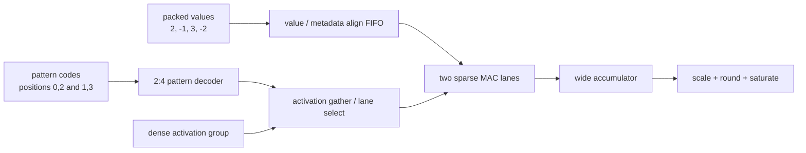
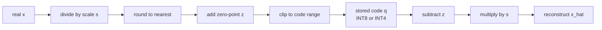
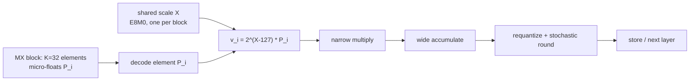

# Sparsity, Quantization, and Compression — When Fewer Bits Become Hardware Work

> **First-time reader orientation:** Sparsity means some represented values are zero; quantization represents values with fewer or different numeric levels; compression stores data in a smaller encoded form. Hardware benefits only if skipped arithmetic and reduced movement exceed metadata, decoding, imbalance, conversion, and accuracy costs. The chapter derives that break-even boundary rather than assuming zeros are free.

> **Abbreviation key — skim now and return as needed:** neural processing unit (NPU); register file (RF); static random-access memory (SRAM); high-bandwidth memory (HBM); error-correcting code (ECC);
> network on chip (NoC); direct memory access (DMA); processing element (PE); multiply-accumulate (MAC); artificial intelligence (AI);
> floating point (FP); tera operations per second (TOPS); 8-bit integer (INT8); control and status register (CSR).

> **Prerequisites:** [Systolic, Spatial, and Vector Dataflows](../01_Compute_Dataflows/02_Systolic_Spatial_and_Vector_Dataflows.md), [Tensor Tiling and Data Movement](01_Tensor_Tiling_and_Data_Movement.md), and [Floating Point](../../../00_Fundamentals/04_Floating_Point.md).
> **Hands off to:** model/compiler calibration and verification, compressed memory/NoC formats, and precision-configurable compute. This page owns their architectural contract and overheads.

---

## 0. Why this page exists

Narrow values and zeros can reduce multiplier area/energy, storage, and bandwidth. They do not produce speedup automatically. Hardware must encode metadata, unpack values, align operands, balance irregular work, size accumulators, and preserve model quality.

```mermaid
flowchart LR
    Tensor["dense FP tensor"] --> Quant["scale / zero-point / rounding"]
    Quant --> Prune["structured or unstructured sparsity"]
    Prune --> Encode["values + metadata"]
    Encode --> Store["HBM / SRAM compressed"]
    Store --> Decode["decode / index / align"]
    Decode --> Skip["zero-skip / sparse scheduler"]
    Skip --> MAC["precision-configurable MACs"]
    MAC --> Acc["wide accumulation + requantize"]
```

The useful question is end-to-end energy/time at an accepted accuracy—not peak sparse TOPS.

## Before the details: representations change both math and scheduling

Quantization maps a range of real values onto a smaller set of stored codes. The hardware contract includes input format, scale, zero point, rounding, saturation, accumulator width, and conversion points. Lower-bit multipliers and memories may be smaller and cheaper, but conversion and wider accumulation remain, and some layers may need a higher-precision fallback to protect accuracy.

Sparsity can be unstructured, where any value may be zero, or structured, where zeros follow a pattern such as fixed-size blocks or “N nonzeros out of M positions.” Structure makes indexing, scheduling, and load balance easier but may preserve fewer natural zeros. Compression stores only values plus enough metadata to reconstruct positions. Metadata has its own bytes, bandwidth, decode latency, buffers, and error cases.

**Beginner checkpoint:** compare the dense cost with the complete sparse or quantized cost. Include metadata, decode, imbalance, padding, conversions, accuracy recovery, and utilization. The fraction of zeros or bit width alone is not a speedup.

### Derive the compressed datapath from one eight-element dot product

Trace a length-eight dot product using INT8 activations

$$x=[3,-2,5,1,0,4,-1,2]$$

and weights

$$w=[2,0,-1,0,0,3,0,-2].$$

A dense two-lane datapath consumes four cycles and performs eight MAC slots even though only four products matter. Its accumulator obtains

$$3\cdot2+5\cdot(-1)+4\cdot3+2\cdot(-2)=9.$$

Clock-gating the multiplier when `w==0` saves switching energy, but the tensor still occupies 8 bytes, all eight weights still cross memory and register-file ports, and the command still takes four issue cycles. **Zero detection alone is an energy feature, not a bandwidth or latency feature.**

Now constrain each group of four weights to contain exactly two nonzeros (2:4 structured sparsity). Store the two values and a small pattern code identifying their positions. Group 0 stores values `[2,-1]` at positions `[0,2]`; group 1 stores `[3,-2]` at `[1,3]` within its group. With a two-lane sparse MAC, the replay is:

| Cycle | Metadata decode | Activation selection | Products | Accumulator |
|---:|---|---|---|---:|
| 0 | group 0 pattern → positions 0,2 | gather `x[0]=3`, `x[2]=5` | $3\cdot2$, $5\cdot(-1)$ | 1 |
| 1 | group 1 pattern → absolute positions 5,7 | gather `x[5]=4`, `x[7]=2` | $4\cdot3$, $2\cdot(-2)$ | 9 |

The speedup comes from **packing and issuing only useful lanes**, not from the mask by itself. That feature requires a decoder, activation-select muxes or a gather network, a value/metadata alignment FIFO, group and reduction counters, and an end-of-group marker. A pattern code and its values must travel under one valid/tag; if backpressure advances one stream without the other, every later product uses the wrong coordinate.

Compression also has a concrete storage ledger. Four INT8 values cost 32 bits. There are six legal ways to choose two positions from four, so a simple code needs 3 bits per group, or 6 bits for this dot product. The 38-bit ideal stream is 40.6% smaller than the 64-bit dense weights, but a byte-aligned implementation might use two 8-bit headers and occupy 48 bits—only 25% smaller. A 64-bit memory beat may erase all capacity savings for a single short group unless several groups are packed together. The architecture result must count transferred beats and padding, not just entropy.

### Quantization is another staged transformation, not a datatype label

Suppose real activations and weights were first mapped to INT8 with scales $s_x$ and $s_w$ and zero-points of zero. The integer accumulator `acc=9` represents a real value near $9s_xs_w$. To produce an output tensor with scale $s_y$, hardware computes

$$q_y=\operatorname{sat}_{8}\!\left(\operatorname{round}\left(acc\frac{s_xs_w}{s_y}\right)+z_y\right).$$

The multiplier/shift approximation for $(s_xs_w)/s_y$, its rounding mode, and saturation are architectural state. Per-channel quantization further requires the channel index to select the scale entry in the same cycle the corresponding accumulator retires. Thus the full pipeline is `unpack → sparse position decode → gather → narrow multiply → wide accumulate → scale lookup → fixed-point multiply/shift → round → saturate → pack`. A claim of “INT8 2:4 execution” is incomplete until every stage and precision is specified.

### Follow failures to increasingly flexible mechanisms

| Baseline failure | Feature | Enabling state/data movement | Cost and losing case |
|---|---|---|---|
| zeros toggle MACs | operand gating | zero detector and clock/data gate | saves compute energy only; detector/gate delay can hurt frequency |
| zeros still consume bytes/cycles | structured packed format | pattern code, packer/decoder, lane select, fixed group counter | metadata/padding dominate short tensors; accuracy may not tolerate the pattern |
| fixed pattern misses natural zeros | unstructured indices/bitmap | pointer/index streams, bounds checks, variable-rate FIFO | index bytes, irregular gathers, load imbalance |
| one sparse operand is easy but both operands are sparse | coordinate intersection | merge/bitmap/hash matcher and restart state | matching throughput/energy can exceed skipped MAC cost |
| lanes finish at different times | fine-grained work queues or work stealing | task tags, queue/crossbar, output-owner and reduction state | routing/queue area and nondeterministic accumulation order |
| one precision loses accuracy for outliers | per-channel/group scale or mixed-precision fallback | scale SRAM, index alignment, conversion path, mode per tile | scale bandwidth and conversions; wide fallback fragments lanes |

The dense path should remain reachable. For the eight-value example, structured sparse wins because density is exactly 50% and decode is fixed rate. A 7/8-dense group would either be illegal under 2:4 pruning or require an unstructured encoding whose metadata and gather cost can exceed one saved MAC. A density/mode selector should compare complete predicted cycles and bytes, then attach the chosen representation to the tile descriptor so producer, memory, decoder, and compute agree.

### Replay malformed metadata and a sparse/dense fallback

Assume group 1's pattern code is reserved or claims two positions but only one value remains before end-of-tile. The decoder must detect the inconsistency before the generated activation address is issued. It records tensor/tile/group identity, drains or quarantines the framed packet, suppresses the output-valid event, and reports a terminal data-format fault. Guessing a position or consuming a value from the next tile would turn data corruption into an unauthorized address and desynchronize all later work.

For a valid tile whose measured density rises above the break-even threshold, dispatch can replay it through the dense path. The descriptor supplies the same logical tensor, scale, zero point, accumulation width, and output layout to both modes. If sparse data is stored compressed, dense fallback first expands into a bounded scratchpad tile; conversion time and bytes belong to the sparse-mode cost. The outputs may differ slightly if sparse dynamic scheduling changes floating-point accumulation order, so the numerical contract must either require a fixed reduction order or specify an accepted tolerance.

### Trace-derived counters and assertions

Measure logical values, retained values, encoded value bytes, metadata bytes, physical transfer beats, decoder groups/cycle, matcher output rate, gather conflicts, useful versus gated versus actually skipped MACs, queue imbalance/tail cycles, scale-cache misses, conversion cycles, saturation/overflow counts, dense-fallback rate, and model-quality change. Separating “gated” from “skipped” prevents an energy optimization from being reported as throughput.

Assert that every legal group decodes to the required number of unique in-range positions; value and metadata tags never diverge under stalls; every retained product reaches its correct output exactly once; skipped positions have exactly zero contribution under the declared zero-point/scaling rules; accumulator and scale identities match output channel/group; malformed data cannot generate an external access; sparse and dense paths obey the same output contract; and reset/replay cannot join a prefix from one compressed tile to a suffix from another.

## 1. Quantization contract

**Essence.** Reading a real value as an integer code is like reading it off a ruler with a fixed number of ticks. The *scale* $s$ is the real spacing of one tick — the size of a single integer step in the tensor's own units — and the *zero-point* $z$ is the tick number that sits on real $0$. Two knobs, two jobs: $s$ sets how fine the grid is; $z$ slides the grid so an off-center range like $[-1,3]$ still spends every code and keeps real $0$ exact (which matters for zero-padding and ReLU). Quantizing snaps $x$ to the nearest tick and stores the tick number; dequantizing reads that number back as a real value.

Affine quantization maps real value $x$ to integer $q$:

$$
q=\operatorname{clip}\left(\operatorname{round}\left(\frac{x}{s}\right)+z,\ q_{min},q_{max}\right),
$$

with scale $s$ and zero-point $z$. Reconstruction is $\hat{x}=s(q-z)$.

**Worked example — from a range to $s$, $z$, and the round-trip error.** A calibration pass reports activation range $[x_{min},x_{max}]=[-1.0,\,3.0]$; the target is unsigned INT8, $[q_{min},q_{max}]=[0,255]$. Spread the range across the codes, then place the tick that lands on real $0$:

$$
s=\frac{x_{max}-x_{min}}{q_{max}-q_{min}}=\frac{3.0-(-1.0)}{255-0}=\frac{4}{255}\approx0.01569,
\qquad
z=\operatorname{round}\!\left(q_{min}-\frac{x_{min}}{s}\right)=\operatorname{round}(63.75)=64.
$$

Quantize $x=2.0$: $x/s=2.0\times\tfrac{255}{4}=127.5$, so $q=\operatorname{round}(127.5)+64=192$ (in range). Dequantize: $\hat{x}=s(q-z)=\tfrac{4}{255}(192-64)=\tfrac{512}{255}\approx2.0078$. The round-trip error is

$$
\hat{x}-x=\frac{512}{255}-2=\frac{2}{255}\approx0.0078=\frac{s}{2},
$$

exactly half a tick — the worst case here, since $2.0$ fell on a tick boundary; every value carries at most this $s/2$ error. Two checks confirm the setup: real $0$ maps to $q=z=64$ and dequantizes to exactly $0$, and the endpoints $-1.0,\,3.0$ map to $0,\,255$, using the full code space.

Because $s=\text{range}/\text{codes}$, both the numerator and the denominator move that $s/2$ error floor. Retargeting the same range to signed INT4 ($[q_{min},q_{max}]=[-8,7]$, 15 steps) spreads it over $255/15\approx17\times$ fewer ticks, enlarging $s$ and the error floor by that factor — which is why INT4 is reserved for error-tolerant tensors. The numerator is the case for *per-channel* scales: a weight channel spanning $[-0.1,0.1]$ must not share one $s$ with a channel spanning $[-8,8]$, or under the wide channel's scale the narrow one collapses onto a handful of codes.

As a datapath, quantize runs this map left-to-right and dequantize runs it right-to-left:

Granularity options:

- per-tensor scale: smallest metadata/control, poorest range fit;
- per-channel scale: common for weights, better accuracy, scale stream/indexing;
- per-group/block scale: compromise and useful for low-bit formats;
- dynamic per-token/activation scale: adapts range but adds runtime reduction/latency.

Hardware contract includes rounding mode, saturation, NaN/Inf handling if relevant, signedness, scale format, accumulation precision, and where requantization occurs. “INT8” alone is incomplete.

## 2. Precision and arithmetic cost

Multiplier area/energy roughly grows superlinearly with operand width for conventional parallel multipliers, while storage/transport scale near linearly with bits. Narrowing 16→8 can therefore save more arithmetic than bandwidth energy proportionally.

But total energy is

$$
E=E_{fetch}+E_{decode}+E_{MAC}+E_{accumulate}+E_{scale}+E_{store}.
$$

If HBM dominates, halving value bits is valuable even without faster MACs. If metadata/scale traffic or packing inefficiency restores the bytes, benefit shrinks.

Mixed precision uses narrow multiplicands and wider accumulators. Worst-case integer accumulator width grows with reduction length:

$$
b_{acc}\gtrsim b_a+b_w+\lceil\log_2K\rceil.
$$

The $b_a+b_w$ bits bound one product; summing $K$ of them adds a further $\lceil\log_2K\rceil$ bits.

Block floating point shares an exponent across a block, reducing exponent storage but losing range for outliers. FP8-like formats trade exponent/mantissa differently for training/inference; conversions and scaling are first-class operations.

## 3. Quantization error and calibration

Error sources:

- clipping outside representable range;
- rounding within range;
- scale granularity mismatch;
- accumulator overflow or rounding;
- nonlinear activation sensitivity;
- outlier channels/tokens;
- repeated requantization between unfused operators.

Calibration chooses ranges using min/max, percentile, KL-divergence, MSE, or learned quantization. Quantization-aware training adapts weights/activations to hardware formats.

Architecture evaluation must pair performance with task-quality metric. Compare designs at the same accuracy/loss constraint and include calibration/retraining assumptions.

## 4. Sparsity taxonomy

| Sparsity | Pattern | Hardware property |
|---|---|---|
| unstructured | arbitrary zeros | highest compression potential, expensive indices/load balance |
| N:M structured | N nonzeros in each M group | bounded metadata and regular decode |
| block sparse | fixed nonzero blocks | efficient tile scheduling, loses fine sparsity |
| channel/filter pruning | entire dimensions removed | dense smaller tensors, easiest hardware |
| activation sparsity | runtime/data-dependent | cannot fully schedule offline |
| dynamic token/expert | conditional execution | coarse irregular work and routing |

Structured sparsity sacrifices pruning freedom to make work predictable. The right pattern matches PE width, memory burst, and compiler tile.

## 5. Compression break-even

For $N$ logical values, nonzero fraction $d$, value bits $b_v$, and metadata bits per nonzero $b_m$ plus fixed overhead $H$:

$$
B_{sparse}=Nd(b_v+b_m)+H.
$$

Compression beats dense $Nb_v$ when $Nd(b_v+b_m)+H<Nb_v$, i.e.

$$
d<\frac{b_v-H/N}{b_v+b_m}.
$$

With INT8 values and 4 metadata bits/nonzero, ignoring fixed overhead, density must be below $8/12=66.7\%$ (>33.3% zeros) merely to reduce bits. Alignment, pointers, padding, and decode buffers raise the threshold.

Track compression at each level; expanding sparse data in the global buffer may save HBM bytes but not NoC/RF energy.

## 6. Sparse formats

- CSR/CSC: values, indices, row/column pointers; flexible for matrices, pointer/imbalance overhead.
- COO: coordinate per nonzero; simple, high metadata.
- bitmap: one bit per logical position plus packed values; efficient at moderate density and bounded decode.
- run-length/delta: good clustered zeros, variable decode.
- block sparse: bitmap/index per dense block; regular inner compute.
- N:M: compact code selects positions inside fixed group; deterministic decode rate.

Format conversion can dominate short operations. Keep one canonical compressed format across HBM, SRAM, and compute when possible, or account for conversion engines/buffers.

## 7. Zero skipping architectures

### Gating only

Detect zero and suppress multiplier switching. Saves dynamic compute energy but not cycles, storage, or movement.

### Compress and skip one operand

Stream nonzero weights with indices; gather matching activations. Saves weight bandwidth/MACs but adds index and irregular activation access.

### Intersection of two sparse operands

Match nonzero coordinates from activation and weight streams. Potentially large skip, but matching networks and variable rates are complex.

### Work-queue scheduling

Decode nonzero tasks into queues distributed across PEs. Dynamic scheduling balances work but adds tags, crossbars, buffers, and out-of-order accumulation.

Useful speedup is limited by

$$
S\le\frac{1}{(1-f)+f/S_{sparse}}
$$

where $f$ is fraction of end-to-end time accelerated. Dense/vector/control/memory phases remain.

## 8. Load balance

Unstructured sparsity creates variable nonzeros per tile/row/PE. If PEs synchronize at tile boundaries, time follows the maximum load:

$$
T_{tile}\propto\max_i NNZ_i.
$$

Average density is insufficient. Measure distribution and coefficient of variation. Mitigations:

- smaller work quanta and dynamic assignment;
- work stealing;
- offline row/block reordering;
- bounded structured sparsity;
- split heavy rows;
- decoupled reduction destinations.

Dynamic balancing can increase operand duplication and NoC traffic. Optimize completion time and movement jointly.

## 9. Metadata pipelines

Metadata needs:

- fetch bandwidth and cache/buffer;
- decode throughput matching value stream;
- index arithmetic/address generation;
- error/ECC protection;
- synchronization with values;
- bounds/malformed-stream checks;
- random access or restart points.

Variable-length streams complicate DMA and parallel chunking. Add block headers/offset tables so engines can begin independently and recover from faults. A corrupt index must not generate out-of-bounds DMA; validate before issuing.

## 10. Requantization and fusion

After accumulation, apply scale, optional bias, rounding, saturation, and output zero-point. For per-channel scales, scale lookup aligns with output channels. Fixed-point multiplier/shift approximations reduce hardware cost but need defined rounding.

Fuse activation, bias, residual add, and requantization to avoid writing wide accumulators/intermediates. Ensure mathematical order and overflow behavior match the model/compiler contract.

Avoid repeated quantize/dequantize boundaries between operators; they add error and traffic. Mixed-precision graphs should keep values in an appropriate internal format across fused regions.

## 11. Training versus inference

Training needs gradients, optimizer state, stochastic/rounding behavior, and a wider dynamic range. It may use narrow matrix inputs with higher-precision accumulation and master weights. Loss scaling handles underflow; overflow detection can trigger retry.

Inference tolerates more aggressive INT/structured sparsity if accuracy is calibrated. Dynamic activation ranges and autoregressive outliers still challenge fixed scales.

Architecture should expose precise mode capabilities and conversion throughput rather than one “AI precision” label.

## 12. Verification and counters

Invariants:

- decoder emits exactly the encoded logical nonzeros in bounds;
- metadata/value streams remain aligned under stalls/retries;
- zero skipping preserves numerical result/order under declared rounding;
- accumulator cannot silently overflow outside specified saturation/wrap behavior;
- scale/zero-point identity matches tensor/channel/group;
- malformed compressed data faults safely before unauthorized access;
- reset/cancel discards partial decode/accumulation by command ID.

Counters:

- logical density, encoded bytes, metadata bytes, alignment/padding;
- zeros gated versus operations skipped;
- decode/match/work-queue utilization and stalls;
- PE nonzero distribution and tail imbalance;
- precision modes, conversion/requantization cycles;
- accumulator overflow/saturation statistics;
- compression ratio at HBM/SRAM/NoC levels;
- task-quality metric tied to configuration.

## 13. Numbers to remember

- Quantization requires scale, zero-point/format, rounding, saturation, and accumulator semantics.
- Narrow operands still need wide accumulation proportional to reduction length.
- Sparse compression helps only after metadata, headers, padding, and decode cost.
- Gating zeros saves energy but not cycles or bandwidth; skipping/compression is required for speed/traffic.
- Sparse tile time follows the most-loaded PE without dynamic balancing.
- Performance claims must hold at an explicit accuracy/quality target.
- MX block formats share one 8-bit (E8M0) scale per 32 elements — MXFP8/6/4 cost 8.25/6.25/4.25 bits/element — and stochastic rounding keeps $\mathbb{E}[\operatorname{round}(x)]=x$, turning an $O(N)$ accumulation bias into an $O(\sqrt N)$ zero-mean spread.

## 14. Worked problems

### Problem 1 — sparse break-even

INT8 values use 4-bit indices/nonzero and 64 header bits per 256-value block. At 50% density:

$$
B=256(0.5)(8+4)+64=1600\ \text{bits}
$$

versus 2048 dense bits: 1.28× compression, not 2×. Decode energy and alignment further reduce value.

### Problem 2 — accumulator

INT4×INT4 with $K=4096$ needs roughly $4+4+12=20$ bits plus sign/guard. A 16-bit accumulator can overflow worst case; use wider or specify saturation/block scaling.

### Problem 3 — load imbalance

Eight PEs receive nonzero counts `[50,52,49,51,50,48,53,95]`. Lockstep tile time follows 95, so useful utilization is $448/(8\times95)=58.9\%$. Splitting/reassigning the heavy work can matter more than average 56 nonzeros/PE suggests.

## 15. Microscaling (MX) block formats and stochastic rounding

Section 2 introduced block floating point (BFP): a block of values shares one exponent, saving exponent storage but losing range for any outlier in the block. The Open Compute Project (OCP) Microscaling (MX) formats are the standardized, fine-grained descendant of that idea and the current sub-8-bit path in training and inference silicon. Two changes make them work where naive BFP does not: the shared scale covers a *small* block ($K=32$ elements) so an outlier pollutes only its 32-neighborhood, and each element keeps a tiny private floating-point field rather than a bare integer mantissa, so elements retain individual range inside the block. Stochastic rounding (SR), derived below, is the companion that lets these narrow formats accumulate millions of updates without the systematic drift round-to-nearest would inflict.

### 15.1 Shared-microexponent blocks

An MX value is two-level. A block of $K=32$ consecutive elements shares one scale $X$, stored in the E8M0 code — 8 exponent bits, no mantissa, no sign — representing the power of two $2^{X-127}$ (one code reserved for NaN). Each element $i$ carries a private low-precision float $P_i$, and the value is

$$
v_i = X\cdot P_i = 2^{\,X-127}\,P_i .
$$

The private format names the point on the size/accuracy curve:

| MX format | element | element bits | private field |
|---|---|---:|---|
| MXFP8 | E4M3 or E5M2 | 8 | 1 sign, 4–5 exp, 2–3 mantissa |
| MXFP6 | E3M2 or E2M3 | 6 | 1 sign, 2–3 exp, 2–3 mantissa |
| MXFP4 | E2M1 | 4 | 1 sign, 2 exp, 1 mantissa |
| MXINT8 | INT8 | 8 | signed integer mantissa |

Only the scale is shared; the per-element exponent still gives each value its own binade inside the block, which is what separates MX from integer-mantissa BFP.

Storage per element is the element width plus the amortized scale,

$$
b_{\text{eff}} = b_{\text{elem}} + \frac{b_{\text{scale}}}{K}.
$$

With $b_{\text{scale}}=8$ and $K=32$ the scale adds exactly $0.25$ bit/element: **MXFP8 costs 8.25, MXFP6 6.25, and MXFP4 4.25 bits/element**. Against FP16's 16 bits that is $1.94\times$ denser for MXFP8 and $3.76\times$ for MXFP4.

The 4-bit MXFP4 element (E2M1: 1 sign, 2 exponent, 1 mantissa, exponent bias 1) enumerates to a short list:

| exp field | significand | magnitudes |
|---|---|---|
| 00 (subnormal) | $0.m\cdot2^{0}$ | $0,\ 0.5$ |
| 01 | $1.m\cdot2^{0}$ | $1.0,\ 1.5$ |
| 10 | $1.m\cdot2^{1}$ | $2.0,\ 3.0$ |
| 11 | $1.m\cdot2^{2}$ | $4.0,\ 6.0$ |

so eight signed magnitudes $\{0,0.5,1,1.5,2,3,4,6\}$ (no infinities or NaN). The block spans $0.5\to6$ ($12\times$, $\approx3.6$ binades, the intervals between consecutive powers of two) and the shared E8M0 scale slides that window across the full $2^{-127}\dots2^{127}$ range.

### 15.2 Range and precision versus plain floating point

The two-level structure decouples *coarse range* (the shared scale, one field per 32 elements) from *fine range and precision* (the private micro-float). A single scale aligns the block so its largest element sits near the top of the private format's span; every element then keeps at least $\lceil\log_2\rho_{\text{blk}}\rceil$ fewer usable mantissa bits than the leading one, where $\rho_{\text{blk}}=\max/\min$ magnitude in the block, but nothing underflows as long as $\rho_{\text{blk}}$ fits the private exponent span ($2^{2^{E_m}}$ binades).

Contrast a single per-tensor scale over a tensor whose global magnitude ratio $\rho_{\text{tsr}}\gg\rho_{\text{blk}}$. Small-magnitude blocks then lose about $\log_2(\rho_{\text{tsr}}/\rho_{\text{blk}})$ mantissa bits to alignment. *Worked:* $\rho_{\text{tsr}}=2^{20}$ with per-block spread $\rho_{\text{blk}}=2^{3}$ makes the small blocks lose $\approx17$ bits of alignment — total underflow for a 3-mantissa-bit element — whereas MX re-centers every 32 elements and keeps the relative step bounded by the private mantissa everywhere. That private mantissa fixes the worst-case relative error of round-to-nearest at $2^{-(M+1)}$ (half a unit in the last place, ulp): MXFP4's single mantissa bit gives $2^{-2}=25\%$, which is why MXFP4 is used for error-tolerant tensors (weights, forward activations) with higher-precision accumulation and stochastic rounding, not everywhere.

### 15.3 Stochastic rounding: unbiased low-precision accumulation

Round a real $x$ lying between adjacent grid points $x_{\text{lo}}$ and $x_{\text{hi}}=x_{\text{lo}}+\Delta$, and write the residual $f=(x-x_{\text{lo}})/\Delta\in[0,1)$. Round-to-nearest (RN) maps $x$ to the closer endpoint — deterministic, and for a fixed $x$ its error has a fixed sign. Stochastic rounding (SR) rounds up with probability equal to the residual:

$$
\operatorname{round}_{\text{SR}}(x)=\begin{cases}x_{\text{hi}} & \text{with prob. } f,\\[2pt] x_{\text{lo}} & \text{with prob. } 1-f.\end{cases}
$$

Its expectation is exactly $x$:

$$
\mathbb{E}\big[\operatorname{round}_{\text{SR}}(x)\big]=(1-f)x_{\text{lo}}+f\,x_{\text{hi}}=x_{\text{lo}}+f\Delta=x,
$$

so SR is unbiased for every $x$. The removed bias reappears as bounded variance,

$$
\operatorname{Var}=(1-f)(f\Delta)^2+f\big((1-f)\Delta\big)^2=f(1-f)\Delta^2\le\frac{\Delta^2}{4}.
$$

*Why RN biases long sums.* Consider a low-precision accumulator with step $\Delta$ receiving $N$ increments each of size $\delta<\Delta/2$ — a tiny gradient step added to a comparatively large weight. Under RN, $x+\delta$ rounds back to $x$ every step: the increment is below half a ulp and is discarded each time. The accumulator never moves; the lost quantity is the whole intended change $N\delta$, with one sign — an $O(N)$ systematic bias (the "swamping" failure). Under SR each step jumps up by $\Delta$ with probability $f=\delta/\Delta$, so the expected increment is $f\Delta=\delta$ and $\mathbb{E}[S_N]=S_0+N\delta$, the correct sum; the tiny updates survive statistically. Modelling the $N$ rounding errors as independent, zero-mean, variance $\le\Delta^2/4$, the accumulated error is a random walk with standard deviation $\le(\Delta/2)\sqrt{N}$. **SR converts an $O(N)$ one-sided bias into an $O(\sqrt N)$ zero-mean spread.**

*Worked number.* Take $N=10^6$ updates with $\delta=\Delta/8$ (so $f=1/8$, below half a ulp). RN freezes the accumulator: bias $=N\delta=1.25\times10^{5}\,\Delta$, one direction. SR gives $\mathbb{E}=0$ and standard deviation $\Delta\sqrt{N f(1-f)}=\Delta\sqrt{10^{6}\cdot\tfrac{7}{64}}\approx331\,\Delta$ (within the $\le(\Delta/2)\sqrt N=500\,\Delta$ bound). A $1.25\times10^5\,\Delta$ one-way loss becomes a $\pm331\,\Delta$ zero-mean fluctuation that averages out across parameters and steps.

### 15.4 Trade-offs

- **SR is not free.** It needs a random number generator (RNG, typically a per-lane linear-feedback shift register) and a comparator against the residual bits, and it makes results nondeterministic unless the RNG is seeded and logged. RN is cheaper and reproducible, so **inference and forward passes keep RN** — SR's variance is pure downside where values are not accumulated across many steps. SR earns its cost in training accumulation: weight update, gradient accumulation, and low-precision accumulators.
- **Block size $K$ is a compromise.** Smaller $K$ tracks range better but raises $b_{\text{scale}}/K$ and adds decode; larger $K$ is cheaper but drifts back toward BFP's outlier problem. $K=32$ with an 8-bit scale — the $0.25$ bit/element point — is the OCP choice.
- **Per-channel can still win.** If a tensor's range is already narrow (well-behaved activations), a single per-channel scale (§1) captures it with even less overhead than a per-32 block; MX's advantage shows up specifically with localized outliers and wide intra-tensor range, as in large-language-model activations. MXFP4's 25% relative step also makes it a weight/tolerant-tensor format, not a universal one.

The block scale is decoded per group in the requantization pipeline of §10; the accumulator-width rule of §2 still applies to the wide sum before requantization; and SR belongs to the training path of §11.

## Cross-references

- **Compute/mapping:** [Systolic, Spatial, and Vector Dataflows](../01_Compute_Dataflows/02_Systolic_Spatial_and_Vector_Dataflows.md), [Dynamic Sparsity, Mixture of Experts, and Irregular Execution](../01_Compute_Dataflows/04_Dynamic_Sparsity_MoE_and_Irregular_Execution.md), [Tensor Tiling and Data Movement](01_Tensor_Tiling_and_Data_Movement.md), [Decoupled Access/Execute and Scratchpad Scheduling](03_Decoupled_Access_Execute_and_Scratchpad_Scheduling.md).
- **Numerics/memory:** [Floating Point](../../../00_Fundamentals/04_Floating_Point.md), [HBM](../../02_GPU_Architecture/02_Memory_System/02_HBM_and_Advanced_Memory_Systems.md).
- **Block formats and rounding:** MX and stochastic rounding (§15) extend block floating point (§2) and the training path (§11); numeric background in [Floating Point](../../../00_Fundamentals/04_Floating_Point.md).
- **Simulation:** [Accelerator and NPU Simulators](../04_Simulation/01_Accelerator_and_NPU_Simulators.md).

## References

1. NVIDIA, [Ampere GPU Architecture Whitepaper](https://www.nvidia.com/content/dam/en-zz/Solutions/geforce/ampere/pdf/NVIDIA-ampere-GA102-GPU-Architecture-Whitepaper-V1.pdf) (structured sparsity and narrow tensor formats).
2. N. Jouppi et al., “In-Datacenter Performance Analysis of a Tensor Processing Unit,” ISCA 2017.
3. S. Han et al., “EIE: Efficient Inference Engine on Compressed Deep Neural Network,” ISCA 2016.
4. J. Albericio et al., “Cnvlutin: Ineffectual-Neuron-Free Deep Neural Network Computing,” ISCA 2016.
5. IEEE 754 and [Floating Point](../../../00_Fundamentals/04_Floating_Point.md) references for numerical behavior.
6. Open Compute Project, “OCP Microscaling Formats (MX) Specification,” v1.0, 2023.
7. S. Gupta, A. Agrawal, K. Gopalakrishnan, and P. Narayanan, “Deep Learning with Limited Numerical Precision,” ICML 2015 (stochastic rounding).

---

**Navigation:** [Mapping and Memory index](00_Index.md) · [NPU index](../00_Index.md)
