# Sparsity, Quantization, and Compression — When Fewer Bits Become Hardware Work

> **First-time reader orientation:** Sparsity means some represented values are zero; quantization represents values with fewer or different numeric levels; compression stores data in a smaller encoded form. Hardware benefits only if skipped arithmetic and reduced movement exceed metadata, decoding, imbalance, conversion, and accuracy costs. The chapter derives that break-even boundary rather than assuming zeros are free.

> **Abbreviation key — skim now and return as needed:** neural processing unit (NPU); register file (RF); static random-access memory (SRAM); high-bandwidth memory (HBM); error-correcting code (ECC);
> network on chip (NoC); direct memory access (DMA); processing element (PE); multiply-accumulate (MAC); artificial intelligence (AI);
> floating point (FP); tera operations per second (TOPS); 8-bit integer (INT8); control and status register (CSR).

> **Prerequisites:** [Systolic, Spatial, and Vector Dataflows](../01_Compute_Dataflows/02_Systolic_Spatial_and_Vector_Dataflows.md), [Tensor Tiling and Data Movement](01_Tensor_Tiling_and_Data_Movement.md), and [Floating Point](../../../00_Fundamentals/04_Floating_Point.md).
> **Hands off to:** model/compiler calibration and verification, compressed memory/NoC formats, and precision-configurable compute. This page owns their architectural contract and overheads.

---

## 0. Why this page exists

Narrow values and zeros can reduce multiplier area/energy, storage, and bandwidth. They do not produce speedup automatically. Hardware must encode metadata, unpack values, align operands, balance irregular work, size accumulators, and preserve model quality.

```mermaid
flowchart LR
    Tensor["dense FP tensor"] --> Quant["scale / zero-point / rounding"]
    Quant --> Prune["structured or unstructured sparsity"]
    Prune --> Encode["values + metadata"]
    Encode --> Store["HBM / SRAM compressed"]
    Store --> Decode["decode / index / align"]
    Decode --> Skip["zero-skip / sparse scheduler"]
    Skip --> MAC["precision-configurable MACs"]
    MAC --> Acc["wide accumulation + requantize"]
```

The useful question is end-to-end energy/time at an accepted accuracy—not peak sparse TOPS.

## Before the details: representations change both math and scheduling

Quantization maps a range of real values onto a smaller set of stored codes. The hardware contract includes input format, scale, zero point, rounding, saturation, accumulator width, and conversion points. Lower-bit multipliers and memories may be smaller and cheaper, but conversion and wider accumulation remain, and some layers may need a higher-precision fallback to protect accuracy.

Sparsity can be unstructured, where any value may be zero, or structured, where zeros follow a pattern such as fixed-size blocks or “N nonzeros out of M positions.” Structure makes indexing, scheduling, and load balance easier but may preserve fewer natural zeros. Compression stores only values plus enough metadata to reconstruct positions. Metadata has its own bytes, bandwidth, decode latency, buffers, and error cases.

**Beginner checkpoint:** compare the dense cost with the complete sparse or quantized cost. Include metadata, decode, imbalance, padding, conversions, accuracy recovery, and utilization. The fraction of zeros or bit width alone is not a speedup.

## 1. Quantization contract

Affine quantization maps real value $x$ to integer $q$:

$$
q=\operatorname{clip}\left(\operatorname{round}\left(\frac{x}{s}\right)+z,\ q_{min},q_{max}\right),
$$

with scale $s$ and zero-point $z$. Reconstruction is $\hat{x}=s(q-z)$.

Granularity options:

- per-tensor scale: smallest metadata/control, poorest range fit;
- per-channel scale: common for weights, better accuracy, scale stream/indexing;
- per-group/block scale: compromise and useful for low-bit formats;
- dynamic per-token/activation scale: adapts range but adds runtime reduction/latency.

Hardware contract includes rounding mode, saturation, NaN/Inf handling if relevant, signedness, scale format, accumulation precision, and where requantization occurs. “INT8” alone is incomplete.

## 2. Precision and arithmetic cost

Multiplier area/energy roughly grows superlinearly with operand width for conventional parallel multipliers, while storage/transport scale near linearly with bits. Narrowing 16→8 can therefore save more arithmetic than bandwidth energy proportionally.

But total energy is

$$
E=E_{fetch}+E_{decode}+E_{MAC}+E_{accumulate}+E_{scale}+E_{store}.
$$

If HBM dominates, halving value bits is valuable even without faster MACs. If metadata/scale traffic or packing inefficiency restores the bytes, benefit shrinks.

Mixed precision uses narrow multiplicands and wider accumulators. Worst-case integer accumulator width grows with reduction length:

$$
b_{acc}\gtrsim b_a+b_w+\lceil\log_2K\rceil.
$$

Block floating point shares an exponent across a block, reducing exponent storage but losing range for outliers. FP8-like formats trade exponent/mantissa differently for training/inference; conversions and scaling are first-class operations.

## 3. Quantization error and calibration

Error sources:

- clipping outside representable range;
- rounding within range;
- scale granularity mismatch;
- accumulator overflow or rounding;
- nonlinear activation sensitivity;
- outlier channels/tokens;
- repeated requantization between unfused operators.

Calibration chooses ranges using min/max, percentile, KL-divergence, MSE, or learned quantization. Quantization-aware training adapts weights/activations to hardware formats.

Architecture evaluation must pair performance with task-quality metric. Compare designs at the same accuracy/loss constraint and include calibration/retraining assumptions.

## 4. Sparsity taxonomy

| Sparsity | Pattern | Hardware property |
|---|---|---|
| unstructured | arbitrary zeros | highest compression potential, expensive indices/load balance |
| N:M structured | N nonzeros in each M group | bounded metadata and regular decode |
| block sparse | fixed nonzero blocks | efficient tile scheduling, loses fine sparsity |
| channel/filter pruning | entire dimensions removed | dense smaller tensors, easiest hardware |
| activation sparsity | runtime/data-dependent | cannot fully schedule offline |
| dynamic token/expert | conditional execution | coarse irregular work and routing |

Structured sparsity sacrifices pruning freedom to make work predictable. The right pattern matches PE width, memory burst, and compiler tile.

## 5. Compression break-even

For $N$ logical values, nonzero fraction $d$, value bits $b_v$, and metadata bits per nonzero $b_m$ plus fixed overhead $H$:

$$
B_{sparse}=Nd(b_v+b_m)+H.
$$

Compression beats dense $Nb_v$ when

$$
d<\frac{b_v-H/N}{b_v+b_m}.
$$

With INT8 values and 4 metadata bits/nonzero, ignoring fixed overhead, density must be below $8/12=66.7\%$ (>33.3% zeros) merely to reduce bits. Alignment, pointers, padding, and decode buffers raise the threshold.

Track compression at each level; expanding sparse data in the global buffer may save HBM bytes but not NoC/RF energy.

## 6. Sparse formats

- CSR/CSC: values, indices, row/column pointers; flexible for matrices, pointer/imbalance overhead.
- COO: coordinate per nonzero; simple, high metadata.
- bitmap: one bit per logical position plus packed values; efficient at moderate density and bounded decode.
- run-length/delta: good clustered zeros, variable decode.
- block sparse: bitmap/index per dense block; regular inner compute.
- N:M: compact code selects positions inside fixed group; deterministic decode rate.

Format conversion can dominate short operations. Keep one canonical compressed format across HBM, SRAM, and compute when possible, or account for conversion engines/buffers.

## 7. Zero skipping architectures

### Gating only

Detect zero and suppress multiplier switching. Saves dynamic compute energy but not cycles, storage, or movement.

### Compress and skip one operand

Stream nonzero weights with indices; gather matching activations. Saves weight bandwidth/MACs but adds index and irregular activation access.

### Intersection of two sparse operands

Match nonzero coordinates from activation and weight streams. Potentially large skip, but matching networks and variable rates are complex.

### Work-queue scheduling

Decode nonzero tasks into queues distributed across PEs. Dynamic scheduling balances work but adds tags, crossbars, buffers, and out-of-order accumulation.

Useful speedup is limited by

$$
S\le\frac{1}{(1-f)+f/S_{sparse}}
$$

where $f$ is fraction of end-to-end time accelerated. Dense/vector/control/memory phases remain.

## 8. Load balance

Unstructured sparsity creates variable nonzeros per tile/row/PE. If PEs synchronize at tile boundaries, time follows the maximum load:

$$
T_{tile}\propto\max_i NNZ_i.
$$

Average density is insufficient. Measure distribution and coefficient of variation. Mitigations:

- smaller work quanta and dynamic assignment;
- work stealing;
- offline row/block reordering;
- bounded structured sparsity;
- split heavy rows;
- decoupled reduction destinations.

Dynamic balancing can increase operand duplication and NoC traffic. Optimize completion time and movement jointly.

## 9. Metadata pipelines

Metadata needs:

- fetch bandwidth and cache/buffer;
- decode throughput matching value stream;
- index arithmetic/address generation;
- error/ECC protection;
- synchronization with values;
- bounds/malformed-stream checks;
- random access or restart points.

Variable-length streams complicate DMA and parallel chunking. Add block headers/offset tables so engines can begin independently and recover from faults. A corrupt index must not generate out-of-bounds DMA; validate before issuing.

## 10. Requantization and fusion

After accumulation, apply scale, optional bias, rounding, saturation, and output zero-point. For per-channel scales, scale lookup aligns with output channels. Fixed-point multiplier/shift approximations reduce hardware cost but need defined rounding.

Fuse activation, bias, residual add, and requantization to avoid writing wide accumulators/intermediates. Ensure mathematical order and overflow behavior match the model/compiler contract.

Avoid repeated quantize/dequantize boundaries between operators; they add error and traffic. Mixed-precision graphs should keep values in an appropriate internal format across fused regions.

## 11. Training versus inference

Training needs gradients, optimizer state, stochastic/rounding behavior, and a wider dynamic range. It may use narrow matrix inputs with higher-precision accumulation and master weights. Loss scaling handles underflow; overflow detection can trigger retry.

Inference tolerates more aggressive INT/structured sparsity if accuracy is calibrated. Dynamic activation ranges and autoregressive outliers still challenge fixed scales.

Architecture should expose precise mode capabilities and conversion throughput rather than one “AI precision” label.

## 12. Verification and counters

Invariants:

- decoder emits exactly the encoded logical nonzeros in bounds;
- metadata/value streams remain aligned under stalls/retries;
- zero skipping preserves numerical result/order under declared rounding;
- accumulator cannot silently overflow outside specified saturation/wrap behavior;
- scale/zero-point identity matches tensor/channel/group;
- malformed compressed data faults safely before unauthorized access;
- reset/cancel discards partial decode/accumulation by command ID.

Counters:

- logical density, encoded bytes, metadata bytes, alignment/padding;
- zeros gated versus operations skipped;
- decode/match/work-queue utilization and stalls;
- PE nonzero distribution and tail imbalance;
- precision modes, conversion/requantization cycles;
- accumulator overflow/saturation statistics;
- compression ratio at HBM/SRAM/NoC levels;
- task-quality metric tied to configuration.

## 13. Numbers to remember

- Quantization requires scale, zero-point/format, rounding, saturation, and accumulator semantics.
- Narrow operands still need wide accumulation proportional to reduction length.
- Sparse compression helps only after metadata, headers, padding, and decode cost.
- Gating zeros saves energy but not cycles or bandwidth; skipping/compression is required for speed/traffic.
- Sparse tile time follows the most-loaded PE without dynamic balancing.
- Performance claims must hold at an explicit accuracy/quality target.

## 14. Worked problems

### Problem 1 — sparse break-even

INT8 values use 4-bit indices/nonzero and 64 header bits per 256-value block. At 50% density:

$$
B=256(0.5)(8+4)+64=1600\ \text{bits}
$$

versus 2048 dense bits: 1.28× compression, not 2×. Decode energy and alignment further reduce value.

### Problem 2 — accumulator

INT4×INT4 with $K=4096$ needs roughly $4+4+12=20$ bits plus sign/guard. A 16-bit accumulator can overflow worst case; use wider or specify saturation/block scaling.

### Problem 3 — load imbalance

Eight PEs receive nonzero counts `[50,52,49,51,50,48,53,95]`. Lockstep tile time follows 95, so useful utilization is $448/(8\times95)=58.9\%$. Splitting/reassigning the heavy work can matter more than average 56 nonzeros/PE suggests.

## Cross-references

- **Compute/mapping:** [Systolic, Spatial, and Vector Dataflows](../01_Compute_Dataflows/02_Systolic_Spatial_and_Vector_Dataflows.md), [Tensor Tiling and Data Movement](01_Tensor_Tiling_and_Data_Movement.md).
- **Numerics/memory:** [Floating Point](../../../00_Fundamentals/04_Floating_Point.md), [HBM](../../02_GPU_Architecture/02_Memory_System/02_HBM_and_Advanced_Memory_Systems.md).
- **Simulation:** [Accelerator and NPU Simulators](../04_Simulation/01_Accelerator_and_NPU_Simulators.md).

## References

1. NVIDIA, [Ampere GPU Architecture Whitepaper](https://www.nvidia.com/content/dam/en-zz/Solutions/geforce/ampere/pdf/NVIDIA-ampere-GA102-GPU-Architecture-Whitepaper-V1.pdf) (structured sparsity and narrow tensor formats).
2. N. Jouppi et al., “In-Datacenter Performance Analysis of a Tensor Processing Unit,” ISCA 2017.
3. S. Han et al., “EIE: Efficient Inference Engine on Compressed Deep Neural Network,” ISCA 2016.
4. J. Albericio et al., “Cnvlutin: Ineffectual-Neuron-Free Deep Neural Network Computing,” ISCA 2016.
5. IEEE 754 and [Floating Point](../../../00_Fundamentals/04_Floating_Point.md) references for numerical behavior.

---

**Navigation:** [Mapping and Memory index](00_Index.md) · [NPU index](../00_Index.md)
