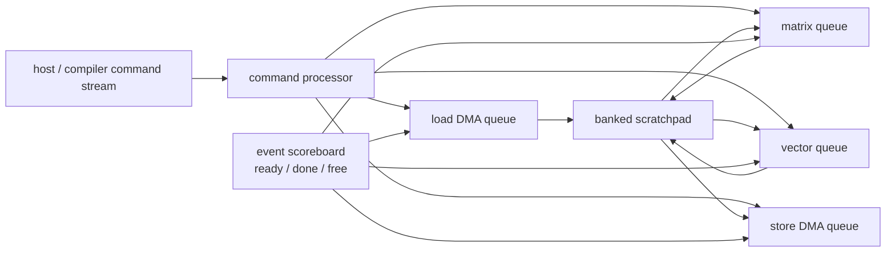
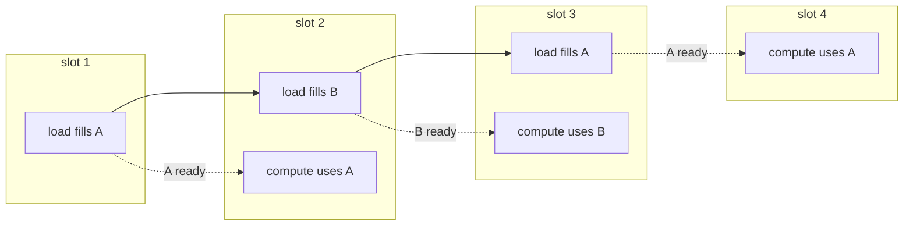
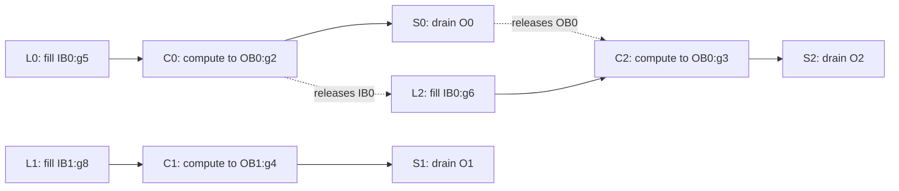

# Decoupled Access–Execute — DMA, Scratchpad, and Event-Driven NPU Scheduling

> **First-time reader orientation:** A neural processing unit (NPU) does not need a CPU-like instruction for every multiply. It usually receives coarse commands: move this tensor tile, run this matrix operation, normalize that result. Advanced performance comes from letting memory movement and several compute engines run independently while a dependency system prevents them from using a tile too early or overwriting it too soon.

> **Abbreviation key — skim now and return as needed:** neural processing unit (NPU); direct memory access (DMA); static random-access memory (SRAM); dynamic random-access memory (DRAM); high-bandwidth memory (HBM); input/output memory management unit (IOMMU); translation lookaside buffer (TLB); processing element (PE); matrix multiply-accumulate (MMA); multiply-accumulate (MAC); first in, first out (FIFO); quality of service (QoS); error-correcting code (ECC); memory-level parallelism (MLP); power, performance, and area (PPA).

> **Prerequisites:** [Tensor Tiling and Data Movement](01_Tensor_Tiling_and_Data_Movement.md) for tiles and double buffering, [NPU Accelerators](../01_Compute_Dataflows/01_NPU_Accelerators.md) for the array–scratchpad organization, and [Host Memory Visibility](../03_System_Integration/01_Host_Interface_Memory_Visibility_and_Scheduling.md) for system ownership.
> **Hands off to:** [Transformer and Attention Engines](../01_Compute_Dataflows/03_Transformer_and_Attention_Engine_Microarchitecture.md) and [Dynamic Sparsity and MoE](../01_Compute_Dataflows/04_Dynamic_Sparsity_MoE_and_Irregular_Execution.md) for workloads that use this machinery.

---

## 0. Access and execute are different pipelines

A simple accelerator performs:

1. load tile;
2. compute tile;
3. store tile.

Its time is a sum:

$$
T_{simple}=T_{load}+T_{compute}+T_{store}.
$$

A decoupled design has independent access and execute queues. With sufficient buffers, tile $n+1$ loads while tile $n$ computes and tile $n-1$ stores, so steady-state time approaches

$$
T_{steady}=\max(T_{load},T_{compute},T_{store}).
$$

That overlap is not free. The architecture needs descriptors, queues, address generators, scratchpad allocation, events, barriers, error handling, and backpressure.



Before the full machinery, it helps to see the overlap in its smallest form: **double buffering** (ping-pong). Keep two input buffers, $A$ and $B$. While the compute engine drains one, the load DMA fills the other; on the next tile they swap. The consumer never walks out to memory — it only ever reads whichever buffer the producer just handed it. This *is* decoupled access–execute in miniature: an *access* stream (address generation and DMA) and an *execute* stream (the array), each running at its own pace, joined only by buffers and a ready signal.

Analogy: a short-order line where one runner keeps two trays stocked from the pantry and the cook only ever cooks from the full tray. As long as the runner refills the spare tray before the cook empties the current one, the cook never waits on the pantry.



Solid arrows are the load stream advancing tile by tile; each dotted arrow hands the just-filled buffer to compute one slot later, so $A$ and $B$ alternate and the two engines run concurrently after the first slot.

**When is the load fully hidden?** Let one tile take $T_{load}$ cycles to transfer and $T_{compute}$ cycles to process. One buffer forces them serial, $T_{load}+T_{compute}$ per tile; two buffers slide the next fill *underneath* the current compute, dropping the steady cost to $\max(T_{load},T_{compute})$. The load leaves the critical path exactly when $T_{load}\le T_{compute}$.

Numbers with $T_{load}=4$, $T_{compute}=6$, and $N=8$ tiles:

- **one buffer:** $N(T_{load}+T_{compute})=8\times 10=80$ cycles.
- **two buffers:** one startup fill, then compute-bound: $T_{load}+N\,T_{compute}=4+8\times 6=52$ cycles.

The $52$ is a $4$-cycle fill of $A$ followed by eight $6$-cycle computes; each concurrent $4$-cycle load finishes with $2$ cycles to spare, so no compute ever stalls. That is a $80/52=1.54\times$ speedup, approaching $10/6\approx1.67\times$ for large $N$. Flip the ratio to $T_{load}=8>T_{compute}=6$ and load becomes the bottleneck at $\max=8$ cycles/tile; now *no* number of buffers helps, because two already let both engines run flat out and the memory pipe cannot deliver faster.

**Prefetch distance — when two buffers are not enough.** Double buffering hides *throughput* (how long a tile occupies the pipe), not *latency* (how long its first byte takes to arrive). If a tile's data takes $L$ cycles to come back after its request — an HBM round trip of, say, $L=240$ — then one-tile lookahead issues that request only $T_{compute}=6$ cycles early, far too late. To keep the array fed, launch each load a *prefetch distance*

$$
D=\left\lceil \frac{L}{T_{compute}} \right\rceil=\left\lceil \frac{240}{6} \right\rceil=40
$$

tiles ahead and provision about $D+1$ live buffers (or generations), so $D$ loads stay in flight while one tile is consumed. This is Little's law at tile granularity, $\text{in-flight}=\text{rate}\times\text{latency}$ — the same relation Section 3 applies to individual DMA transactions. Ordinary double buffering is just the special case $L\le T_{compute}$; deep memory pipelines need multi-buffering.

### 0.1 Build the scheduler by replaying three tiles

Start with a blocking controller and three independent tiles `T0`, `T1`, and `T2`. Each load takes four cycles, matrix compute takes six, and store takes three. The baseline controller reuses one input and one output buffer and executes

```text
LOAD T0 → COMPUTE T0 → STORE T0 → LOAD T1 → ...
```

for $3(4+6+3)=39$ cycles. The array is idle during 21 of them. Adding a DMA engine does not fix this if one program counter still waits for each phase; the first required feature is independent queues plus physical storage for overlapping lifetimes.

The compiler/runtime emits three command types per tile. A compact executable stream might be:

| ID | Command and essential descriptor fields | Wait events | Signal event |
|---|---|---|---|
| L0 | `LOAD src=A0, dst=IB0:g5, shape/strides, ctx=7` | `IB0_FREE:g5` | `T0_INPUT_READY` |
| C0 | `MMA in=IB0:g5, out=OB0:g2, mapping=17` | `T0_INPUT_READY`, `OB0_FREE:g2` | `T0_COMPUTE_DONE` |
| S0 | `STORE src=OB0:g2, dst=O0, visibility=system` | `T0_COMPUTE_DONE` | `T0_STORED` |
| L1/C1/S1 | same roles using alternate `IB1/OB1` generations | corresponding phase events | tile-1 events |
| L2/C2/S2 | reuse `IB0/OB0` only after tile 0 releases them | generation-6 free events | tile-2 events |

`IB0:g5` means input-bank group 0, generation 5. Reuse for tile 2 increments the generation to 6, so a late response naming generation 5 cannot corrupt tile 2.



With two input and two output phases, one legal replay is:

| Cycles | Load DMA | Matrix engine | Store DMA | Important state transition |
|---|---|---|---|---|
| 0–3 | fill T0 in IB0 | idle | idle | `IB0 FILLING→READY` |
| 4–7 | fill T1 in IB1 | compute T0, cycles 4–9 | idle | C0 consumes IB0; L1 owns IB1 |
| 8–9 | idle | finish T0 | idle | T1 ready but matrix resource busy |
| 10–12 | begin T2 in reused IB0 | compute T1, cycles 10–15 | store T0 | C0 release increments IB0 generation |
| 13 | finish T2 load | compute T1 | idle | T2 ready |
| 16–18 | idle | compute T2, cycles 16–21 | store T1 | three engines overlap where dependencies allow |
| 19–21 | idle | finish T2 | idle | final output becomes ready |
| 22–24 | idle | idle | store T2 | command group completes at required visibility |

Total time falls to 25 cycles. The arithmetic did not change; overlap came from (1) distinct queues, (2) duplicate storage, (3) generation-tagged ownership, and (4) events that name data readiness rather than original program order. The achieved interval is still six cycles because compute is the slowest stage. Making load faster cannot improve steady throughput until compute changes.

### 0.2 What state actually enables decoupling

The finished block diagram hides five interacting state machines:

- **Descriptor state:** opcode, tensor extents/strides, current multidimensional index, protection context, command/tile/epoch, and error policy.
- **Transaction state:** physical address, byte mask, destination bank/generation, outstanding fragments, retry/fault state, and response count. One tile descriptor may split into many transactions at page or burst boundaries.
- **Allocation state:** `FREE→FILLING→READY→IN_USE→DRAINING→FREE`, owner engine, reader count, last-consumer event, and generation.
- **Event state:** generation, expected producer count, arrivals, waiting commands, terminal error, and memory-visibility scope.
- **Scheduler state:** ready queues, resource reservations, age/priority, bank-conflict prediction, power/QoS limits, and a progress guarantee.

Queues without generations are unsafe after reset; generations without a drain/quarantine rule can wrap and alias; events without allocation ownership permit overwrite; ownership without backpressure deadlocks when all phases wait on one another. Decoupling is therefore a distributed protocol, not merely “run DMA asynchronously.”

### 0.3 Replay a fault while independent work passes it

Suppose L1 faults on its second source page at cycle 6. The load transaction records `(context, command=L1, tile=T1, source index, destination=IB1:g8, completed-byte bitmap/count, epoch)`, marks IB1 `FAULTED`, and signals an error-pending state rather than `T1_INPUT_READY`. C1 and S1 remain blocked. C0 continues because it already owns valid IB0/OB0 state.

At cycle 10, C0 releases IB0. If T2 is independent and its descriptor has no declared dependence on T1, the scheduler may issue L2 into `IB0:g6` and then C2 while T1 waits for page service. This is coarse-grained out-of-order execution: no speculative value is consumed, and the explicit event graph proves independence. Once software resolves the page and translation invalidation completes, L1 reissues only the missing fragment into IB1:g8. Its ready event fires after old and replayed fragments together reach the expected byte count; then C1 can execute. Final group completion waits for S0, S1, and S2, so bypassing the fault improves utilization without hiding failure from the host.

A terminal permission fault instead transitions L1 and all dependent commands to error, releases or quarantines their allocations, and suppresses S1 success. Unrelated T0/T2 may complete if the ABI permits partial command-group success. A late response updates state only when context, command epoch, bank number, and bank generation all match. These rules prevent the classic corruption in which a canceled DMA writes into a newly allocated tile.

### 0.4 Cost ledger and losing cases

| Feature | Benefit | Main PPA/complexity cost | When it loses |
|---|---|---|---|
| independent load/compute/store queues | overlap stage latency | queue SRAM, arbitration, tags, verification state | one short tile or a single dominant stage with no concurrent work |
| ping-pong banks | overlap adjacent tile lifetimes | duplicated SRAM capacity/leakage and more bank routing | duplication forces smaller tiles and destroys reuse |
| many DMA transactions | hides HBM/translation latency | transaction-table SRAM, comparators, reorder responses | bandwidth is already saturated or transfers are tiny/metadata-heavy |
| dynamic scratchpad allocator | adapts to mixed tile sizes | free-list/bitmap logic, fragmentation and deadlock cases | static predictable workload fits a fixed partition |
| event-driven out-of-order issue | bypasses busy/faulted independent commands | associative readiness checks or wakeup lists, starvation policy | command graph is nearly serial |
| precise page replay | preserves completed work | fault queues, checkpoints, epochs, partial-byte bookkeeping | pinned-memory deployment never faults |

The scheduler must be evaluated at equal SRAM capacity. Comparing a double-buffered design with twice the SRAM against a single-buffered baseline confounds scheduling with capacity and may conceal a tile-size/reuse loss.

### 0.5 Trace-derived counters and assertions

Expose timestamps for enqueue, ready, issue, first/last transaction, engine start/end, visibility, and completion under one command/tile identity. Count queue occupancy and full cycles; transactions and bytes outstanding; useful bandwidth versus short/alignment overhead; buffer-state residency and fragmentation; bank conflicts by competing engine; event wait reason; overlap of each engine pair; out-of-order bypasses; page faults/replay bytes; stale-generation responses; throttle cycles; and final critical-path stage.

Assert that a ready event equals the expected transaction count/bytes for one descriptor generation; an engine consumes only a `READY` allocation with matching tile and generation; writers cannot overlap live readers; an allocation is released exactly once after its last consumer; event errors propagate to all dependent commands without producing success; scheduler reservations cannot create a resource cycle under the documented command constraints; replay cannot duplicate completed bytes; and terminal completion implies no live allocation, transaction, or event remains for the command epoch.

## 1. Descriptor-driven commands

A descriptor describes work at tensor or tile granularity. Fields commonly include:

- source and destination address or scratchpad allocation;
- dimensions and element size;
- byte strides for each dimension;
- padding, transpose, swizzle, or broadcast mode;
- precision and numeric scale;
- engine opcode and tile shape;
- predecessor events to wait for;
- completion event to signal;
- protection context, priority, and exception policy.

Descriptors amortize control over thousands of MACs. They also form an architectural interface between compiler/runtime and hardware. Versioning matters: a future engine may add a field without changing older binaries, so descriptors need explicit format, reserved bits, and validation.

The command processor may translate graph-level commands into smaller internal commands. It should reject illegal shapes, address overflow, unsupported strides, and overlapping buffers before issuing external requests.

## 2. Multidimensional address generation

A tensor element at indices $(i_0,\ldots,i_{n-1})$ has byte address

$$
A=A_0+\sum_{k=0}^{n-1}i_ks_k,
$$

where $s_k$ is the byte stride of dimension $k$. A DMA engine implements nested counters and incremental adders rather than a general multiplier for every element.

Advanced address generators support:

- contiguous bursts and strided lines;
- gather/scatter through index arrays;
- padding with a constant value;
- layout transforms and bank swizzles;
- multicast to several scratchpad destinations;
- partial tiles at tensor edges;
- circular buffers for streaming data.

The generator must split transfers at page, cache-line, interconnect-burst, or protection boundaries. One logical tile can therefore become many physical transactions whose completions must be counted before the ready event fires.

## 3. DMA queues and outstanding transactions

Separate load and store queues prevent output drain from blocking input fetch, but both compete for memory bandwidth. Each command expands into requests tracked by transaction entries similar to cache MSHRs (miss-status handling registers).

An entry needs:

- descriptor and tile identity;
- current multidimensional indices;
- translated physical address and permissions;
- outstanding request/byte count;
- scratchpad destination and generation;
- retry, error, and partial-completion state;
- completion event.

If memory latency is $L$ cycles and each tile generates requests at rate $\lambda$, Little's law requires at least

$$
N_{out}\ge\lambda L
$$

outstanding slots to sustain that rate. Having HBM bandwidth without enough transaction identities leaves the link idle.

## 4. Scratchpad allocation and ownership

A scratchpad removes cache tags and replacement but makes allocation explicit. Treat each live tile buffer as a resource with states:

```text
FREE -> FILLING -> READY -> IN_USE -> DRAINING -> FREE
```

Not every tile uses every state; an intermediate result may go from `IN_USE` back to `READY`. What matters is that transitions are owned by named events.

A buffer handle should include a generation. Reallocating bank group 3 to a new tile while an old DMA response still names “bank group 3” is unsafe; `(group=3, generation=9)` distinguishes it from generation 8.

Allocation policies include:

- static compiler partitioning;
- hardware free lists of bank groups;
- reservations per engine or priority;
- elastic borrowing between input, weight, accumulator, and output roles;
- eviction/spill to HBM for long-lived intermediates.

Static allocation is predictable but can strand banks. Dynamic allocation improves utilization but adds deadlock and fragmentation risk.

## 5. Banking and port conflicts

Scratchpad peak bandwidth is the sum of bank bandwidth only when accesses distribute across banks. If bank mapping is

$$
bank=(address / word\_bytes)\bmod B,
$$

a power-of-two stride can repeatedly hit one bank. Swizzling selected address bits or compiler padding spreads common tensor patterns.

The bank arbiter must coordinate:

- DMA refill writes;
- matrix operand reads;
- vector read-modify-write;
- accumulator traffic;
- output drain;
- ECC scrub and repair.

Priority alone can starve a low-priority engine. Weighted round robin, age promotion, or reserved service slots provide forward progress. QoS policy belongs in the architecture because it determines whether a latency-sensitive vector epilogue can be blocked by a long DMA burst.

## 6. Event scoreboards and command dependencies

**What a scoreboard is, intuitively.** Picture a wall of numbered pigeonholes, one per data item, each showing *empty* or *ready* and holding the list of commands parked on it. A producer that finishes flips its hole to *ready* and wakes everything parked there; a consumer that arrives early simply parks and sleeps. Nothing polls memory and nothing tracks program order — readiness of *named data* is the only currency. It is the bookkeeping a classic CPU scoreboard does for register results, lifted from registers to tensor tiles.

Commands communicate through events rather than physical registers. A command may wait for several predecessor events and signal one or more completions.

An event entry can hold:

- valid and generation;
- expected producer count;
- arrival or byte count;
- waiting command bitmap/list;
- error status;
- optional memory-order scope.

Multi-producer events support reductions or tiles assembled by several DMAs. Phase reuse requires generation protection. Event exhaustion is a real backpressure source: the compiler may expose thousands of graph dependencies while hardware supports only tens or hundreds of live tokens.

Event graphs can deadlock. If command A holds buffer X while waiting for event from B, and B needs X to run, no queue policy fixes it. Prevent this with an allocation order, compiler analysis, separate reserved buffers for progress, or hardware deadlock detection and abort.

## 7. Coarse-grained out-of-order execution

Independent queues may execute commands out of original program order when dependencies permit. For example, matrix tile 5 and vector epilogue tile 3 can overlap even if their descriptors were submitted in the opposite order.

This is not CPU-style speculation. The dependency graph is explicit, and commands should not execute until their declared inputs are ready. However, hardware may optimistically prefetch addresses or translations before data readiness, provided faults and side effects obey the command's protection context.

A command scheduler chooses among ready commands using:

- engine availability;
- scratchpad bank conflicts;
- age and starvation;
- predicted duration;
- memory queue pressure;
- QoS/deadline;
- opportunities to reuse resident weights.

Weight-residency-aware scheduling can save large HBM transfers, but reordering across requests must preserve isolation and any promised latency policy.

## 8. Translation, protection, and faults

An integrated NPU often uses virtual addresses through an IOMMU or accelerator-local TLB. Translation may be performed per page while a descriptor spans many pages.

Design questions include:

- may translation prefetch run ahead of command execution?
- are page faults recoverable, replayed, or fatal to the command?
- how is process/address-space identity attached to queued descriptors?
- what happens if mappings change while work is in flight?
- are scratchpad contents cleared between protection domains?
- may a partially completed output become visible after a fault?

A precise accelerator fault normally reports descriptor identity and the first failing address, stops younger dependent commands, and prevents output completion signaling. Independent commands from another context may continue only if queues and scratchpad allocations are truly isolated.

## 9. Memory ordering and visibility

DMA completion has several possible meanings:

- requests were accepted by the interconnect;
- data reached the NPU scratchpad;
- output reached a coherent point visible to the CPU;
- output reached persistent or device memory.

The event definition must state which one. A host interrupt sent before stores become visible creates a race even if the compute is correct.

Input ownership also matters. The host must finish writes and perform any required cache maintenance before launching a non-coherent DMA. A coherent client may avoid explicit maintenance but still needs ordering fences and completion semantics. The detailed system contract lives in [Host Memory Visibility](../03_System_Integration/01_Host_Interface_Memory_Visibility_and_Scheduling.md).

## 10. Power management and throttling

Decoupled engines can create correlated bursts: DMA, matrix, and vector units all switch simultaneously. Power or thermal control may throttle issue, reducing the overlap the schedule assumed.

Hardware can:

- cap outstanding DMA requests;
- insert engine duty cycles;
- choose lower-precision or lower-frequency modes;
- stagger high-current operations;
- expose throttling counters to the runtime;
- reserve bandwidth for thermal-management and ECC traffic.

Backpressure must propagate cleanly. A throttled matrix engine fills its input queue, which must eventually stop DMA from overwriting full buffers rather than dropping data.

## 11. Verification and observability

Verify:

1. every descriptor access lies inside its validated tensor and protection bounds;
2. multidimensional counters handle zero, one, and partial-edge dimensions;
3. a ready event fires only after all constituent transactions complete;
4. generation tags reject stale DMA and engine completions;
5. scratchpad state transitions never allow read-before-fill or overwrite-before-release;
6. bank arbitration and queue backpressure guarantee forward progress;
7. faults suppress success events and externally visible partial results as specified;
8. translation context remains attached through replay;
9. host completion implies the documented memory visibility point;
10. reset, cancellation, and preemption reclaim every event and buffer exactly once.

Counters should expose queue occupancy, outstanding reads/writes, TLB misses, bytes by stream, bank conflicts by engine, event stalls, allocator fragmentation, overlap efficiency, throttling cycles, and fault/replay causes.

## 12. Worked examples

**1 — Overlap.** Load is 420 cycles, matrix work 650, vector work 180, and store 220. Serial cost is 1470 cycles/tile. With independent engines and adequate buffering, the lower bound is 650 cycles/tile, a $1470/650=2.26\times$ possible throughput gain. The matrix engine remains the bottleneck.

**2 — Outstanding depth.** A DMA must issue one 128-byte request per cycle and HBM response latency is 240 cycles. It needs at least 240 transaction slots, representing 30 KiB in flight, to sustain the request rate. Sixty-four slots cap the rate near $64/240=0.267$ request/cycle even if the memory link is otherwise idle.

**3 — Scratchpad liveness.** Two input buffers of 64 KiB, two weight buffers of 128 KiB, two output/accumulator buffers of 96 KiB, and 32 KiB of vector workspace require $2(64+128+96)+32=608$ KiB before bank-fragmentation and ECC overhead. A nominal 512 KiB scratchpad cannot run that schedule; it needs smaller tiles, fewer live versions, or spilling.

## Numbers to remember

| Quantity | Typical scale | Why it matters |
|---|---:|---|
| descriptor | one command for a tile or tensor operation | amortizes control over many MACs |
| buffering | 2–4 live tile versions | converts sum of stage times toward a maximum |
| transaction depth | request rate × memory latency | required to reach external bandwidth |
| scratchpad states | free/filling/ready/in-use/draining | explicit lifetime replaces cache replacement |
| event identity | slot plus generation/phase | prevents stale completion corruption |
| overlap efficiency | serial stage sum / steady bottleneck | measures benefit of decoupling |

## Cross-references

- [Tensor Tiling and Data Movement](01_Tensor_Tiling_and_Data_Movement.md) derives tile sizes and reuse.
- [Transformer and Attention Engines](../01_Compute_Dataflows/03_Transformer_and_Attention_Engine_Microarchitecture.md) uses these queues for fused attention.
- [Dynamic Sparsity and MoE](../01_Compute_Dataflows/04_Dynamic_Sparsity_MoE_and_Irregular_Execution.md) adds variable-rate decode and token queues.
- [Advanced GPU Execution](../../02_GPU_Architecture/01_Core_Architecture/04_Independent_Thread_Scheduling_and_Asynchronous_Pipelines.md) provides a SIMT implementation of the same producer–consumer principles.
- [AHB, AXI, and APB](../../04_SoC_and_Chiplet_Architecture/03_Transaction_Protocols/01_AHB_AXI_APB.md) covers the system transactions generated by DMA.

## References

1. N. P. Jouppi et al., “In-Datacenter Performance Analysis of a Tensor Processing Unit,” ISCA 2017 — [Google Research](https://research.google/pubs/in-datacenter-performance-analysis-of-a-tensor-processing-unit/).
2. Y.-H. Chen et al., “Eyeriss v2,” JETCAS 2019 — [paper](https://eems.mit.edu/wp-content/uploads/2019/04/2019_jetcas_eyerissv2.pdf).
3. NVIDIA, “Hopper Tuning Guide,” for descriptor-driven asynchronous tensor movement — [documentation](https://docs.nvidia.com/cuda/hopper-tuning-guide/).
4. Arm, “AMBA AXI and ACE Protocol Specification,” for burst, ordering, and completion concepts — [documentation](https://developer.arm.com/documentation/ihi0022/latest/).

---

← [Sparsity, Quantization, and Compression](02_Sparsity_Quantization_and_Compression.md) · [Mapping and Memory index](00_Index.md) · next → [System Integration](../03_System_Integration/00_Index.md)
