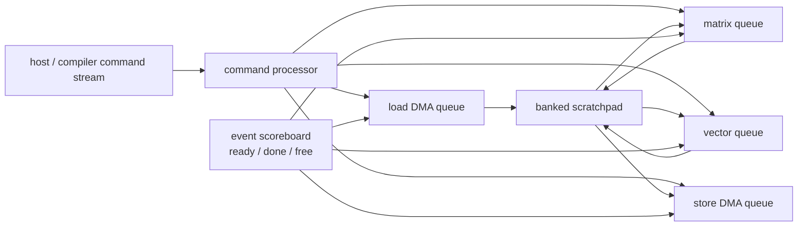

# Decoupled Access–Execute — DMA, Scratchpad, and Event-Driven NPU Scheduling

> **First-time reader orientation:** A neural processing unit (NPU) does not need a CPU-like instruction for every multiply. It usually receives coarse commands: move this tensor tile, run this matrix operation, normalize that result. Advanced performance comes from letting memory movement and several compute engines run independently while a dependency system prevents them from using a tile too early or overwriting it too soon.

> **Abbreviation key — skim now and return as needed:** neural processing unit (NPU); direct memory access (DMA); static random-access memory (SRAM); dynamic random-access memory (DRAM); high-bandwidth memory (HBM); input/output memory management unit (IOMMU); translation lookaside buffer (TLB); processing element (PE); matrix multiply-accumulate (MMA); multiply-accumulate (MAC); first in, first out (FIFO); quality of service (QoS); error-correcting code (ECC); memory-level parallelism (MLP); power, performance, and area (PPA).

> **Prerequisites:** [Tensor Tiling and Data Movement](01_Tensor_Tiling_and_Data_Movement.md) for tiles and double buffering, [NPU Accelerators](../01_Compute_Dataflows/01_NPU_Accelerators.md) for the array–scratchpad organization, and [Host Memory Visibility](../03_System_Integration/01_Host_Interface_Memory_Visibility_and_Scheduling.md) for system ownership.
> **Hands off to:** [Transformer and Attention Engines](../01_Compute_Dataflows/03_Transformer_and_Attention_Engine_Microarchitecture.md) and [Dynamic Sparsity and MoE](../01_Compute_Dataflows/04_Dynamic_Sparsity_MoE_and_Irregular_Execution.md) for workloads that use this machinery.

---

## 0. Access and execute are different pipelines

A simple accelerator performs:

1. load tile;
2. compute tile;
3. store tile.

Its time is a sum:

$$
T_{simple}=T_{load}+T_{compute}+T_{store}.
$$

A decoupled design has independent access and execute queues. With sufficient buffers, tile $n+1$ loads while tile $n$ computes and tile $n-1$ stores, so steady-state time approaches

$$
T_{steady}=\max(T_{load},T_{compute},T_{store}).
$$

That overlap is not free. The architecture needs descriptors, queues, address generators, scratchpad allocation, events, barriers, error handling, and backpressure.



## 1. Descriptor-driven commands

A descriptor describes work at tensor or tile granularity. Fields commonly include:

- source and destination address or scratchpad allocation;
- dimensions and element size;
- byte strides for each dimension;
- padding, transpose, swizzle, or broadcast mode;
- precision and numeric scale;
- engine opcode and tile shape;
- predecessor events to wait for;
- completion event to signal;
- protection context, priority, and exception policy.

Descriptors amortize control over thousands of MACs. They also form an architectural interface between compiler/runtime and hardware. Versioning matters: a future engine may add a field without changing older binaries, so descriptors need explicit format, reserved bits, and validation.

The command processor may translate graph-level commands into smaller internal commands. It should reject illegal shapes, address overflow, unsupported strides, and overlapping buffers before issuing external requests.

## 2. Multidimensional address generation

A tensor element at indices $(i_0,\ldots,i_{n-1})$ has byte address

$$
A=A_0+\sum_{k=0}^{n-1}i_ks_k,
$$

where $s_k$ is the byte stride of dimension $k$. A DMA engine implements nested counters and incremental adders rather than a general multiplier for every element.

Advanced address generators support:

- contiguous bursts and strided lines;
- gather/scatter through index arrays;
- padding with a constant value;
- layout transforms and bank swizzles;
- multicast to several scratchpad destinations;
- partial tiles at tensor edges;
- circular buffers for streaming data.

The generator must split transfers at page, cache-line, interconnect-burst, or protection boundaries. One logical tile can therefore become many physical transactions whose completions must be counted before the ready event fires.

## 3. DMA queues and outstanding transactions

Separate load and store queues prevent output drain from blocking input fetch, but both compete for memory bandwidth. Each command expands into requests tracked by transaction entries similar to cache MSHRs.

An entry needs:

- descriptor and tile identity;
- current multidimensional indices;
- translated physical address and permissions;
- outstanding request/byte count;
- scratchpad destination and generation;
- retry, error, and partial-completion state;
- completion event.

If memory latency is $L$ cycles and each tile generates requests at rate $\lambda$, Little's law requires at least

$$
N_{out}\ge\lambda L
$$

outstanding slots to sustain that rate. Having HBM bandwidth without enough transaction identities leaves the link idle.

## 4. Scratchpad allocation and ownership

A scratchpad removes cache tags and replacement but makes allocation explicit. Treat each live tile buffer as a resource with states:

```text
FREE -> FILLING -> READY -> IN_USE -> DRAINING -> FREE
```

Not every tile uses every state; an intermediate result may go from `IN_USE` back to `READY`. What matters is that transitions are owned by named events.

A buffer handle should include a generation. Reallocating bank group 3 to a new tile while an old DMA response still names “bank group 3” is unsafe; `(group=3, generation=9)` distinguishes it from generation 8.

Allocation policies include:

- static compiler partitioning;
- hardware free lists of bank groups;
- reservations per engine or priority;
- elastic borrowing between input, weight, accumulator, and output roles;
- eviction/spill to HBM for long-lived intermediates.

Static allocation is predictable but can strand banks. Dynamic allocation improves utilization but adds deadlock and fragmentation risk.

## 5. Banking and port conflicts

Scratchpad peak bandwidth is the sum of bank bandwidth only when accesses distribute across banks. If bank mapping is

$$
bank=(address / word\_bytes)\bmod B,
$$

a power-of-two stride can repeatedly hit one bank. Swizzling selected address bits or compiler padding spreads common tensor patterns.

The bank arbiter must coordinate:

- DMA refill writes;
- matrix operand reads;
- vector read-modify-write;
- accumulator traffic;
- output drain;
- ECC scrub and repair.

Priority alone can starve a low-priority engine. Weighted round robin, age promotion, or reserved service slots provide forward progress. QoS policy belongs in the architecture because it determines whether a latency-sensitive vector epilogue can be blocked by a long DMA burst.

## 6. Event scoreboards and command dependencies

Commands communicate through events rather than physical registers. A command may wait for several predecessor events and signal one or more completions.

An event entry can hold:

- valid and generation;
- expected producer count;
- arrival or byte count;
- waiting command bitmap/list;
- error status;
- optional memory-order scope.

Multi-producer events support reductions or tiles assembled by several DMAs. Phase reuse requires generation protection. Event exhaustion is a real backpressure source: the compiler may expose thousands of graph dependencies while hardware supports only tens or hundreds of live tokens.

Event graphs can deadlock. If command A holds buffer X while waiting for event from B, and B needs X to run, no queue policy fixes it. Prevent this with an allocation order, compiler analysis, separate reserved buffers for progress, or hardware deadlock detection and abort.

## 7. Coarse-grained out-of-order execution

Independent queues may execute commands out of original program order when dependencies permit. For example, matrix tile 5 and vector epilogue tile 3 can overlap even if their descriptors were submitted in the opposite order.

This is not CPU-style speculation. The dependency graph is explicit, and commands should not execute until their declared inputs are ready. However, hardware may optimistically prefetch addresses or translations before data readiness, provided faults and side effects obey the command's protection context.

A command scheduler chooses among ready commands using:

- engine availability;
- scratchpad bank conflicts;
- age and starvation;
- predicted duration;
- memory queue pressure;
- QoS/deadline;
- opportunities to reuse resident weights.

Weight-residency-aware scheduling can save large HBM transfers, but reordering across requests must preserve isolation and any promised latency policy.

## 8. Translation, protection, and faults

An integrated NPU often uses virtual addresses through an IOMMU or accelerator-local TLB. Translation may be performed per page while a descriptor spans many pages.

Design questions include:

- may translation prefetch run ahead of command execution?
- are page faults recoverable, replayed, or fatal to the command?
- how is process/address-space identity attached to queued descriptors?
- what happens if mappings change while work is in flight?
- are scratchpad contents cleared between protection domains?
- may a partially completed output become visible after a fault?

A precise accelerator fault normally reports descriptor identity and the first failing address, stops younger dependent commands, and prevents output completion signaling. Independent commands from another context may continue only if queues and scratchpad allocations are truly isolated.

## 9. Memory ordering and visibility

DMA completion has several possible meanings:

- requests were accepted by the interconnect;
- data reached the NPU scratchpad;
- output reached a coherent point visible to the CPU;
- output reached persistent or device memory.

The event definition must state which one. A host interrupt sent before stores become visible creates a race even if the compute is correct.

Input ownership also matters. The host must finish writes and perform any required cache maintenance before launching a non-coherent DMA. A coherent client may avoid explicit maintenance but still needs ordering fences and completion semantics. The detailed system contract lives in [Host Memory Visibility](../03_System_Integration/01_Host_Interface_Memory_Visibility_and_Scheduling.md).

## 10. Power management and throttling

Decoupled engines can create correlated bursts: DMA, matrix, and vector units all switch simultaneously. Power or thermal control may throttle issue, reducing the overlap the schedule assumed.

Hardware can:

- cap outstanding DMA requests;
- insert engine duty cycles;
- choose lower-precision or lower-frequency modes;
- stagger high-current operations;
- expose throttling counters to the runtime;
- reserve bandwidth for thermal-management and ECC traffic.

Backpressure must propagate cleanly. A throttled matrix engine fills its input queue, which must eventually stop DMA from overwriting full buffers rather than dropping data.

## 11. Verification and observability

Verify:

1. every descriptor access lies inside its validated tensor and protection bounds;
2. multidimensional counters handle zero, one, and partial-edge dimensions;
3. a ready event fires only after all constituent transactions complete;
4. generation tags reject stale DMA and engine completions;
5. scratchpad state transitions never allow read-before-fill or overwrite-before-release;
6. bank arbitration and queue backpressure guarantee forward progress;
7. faults suppress success events and externally visible partial results as specified;
8. translation context remains attached through replay;
9. host completion implies the documented memory visibility point;
10. reset, cancellation, and preemption reclaim every event and buffer exactly once.

Counters should expose queue occupancy, outstanding reads/writes, TLB misses, bytes by stream, bank conflicts by engine, event stalls, allocator fragmentation, overlap efficiency, throttling cycles, and fault/replay causes.

## 12. Worked examples

**1 — Overlap.** Load is 420 cycles, matrix work 650, vector work 180, and store 220. Serial cost is 1470 cycles/tile. With independent engines and adequate buffering, the lower bound is 650 cycles/tile, a $1470/650=2.26\times$ possible throughput gain. The matrix engine remains the bottleneck.

**2 — Outstanding depth.** A DMA must issue one 128-byte request per cycle and HBM response latency is 240 cycles. It needs at least 240 transaction slots, representing 30 KiB in flight, to sustain the request rate. Sixty-four slots cap the rate near $64/240=0.267$ request/cycle even if the memory link is otherwise idle.

**3 — Scratchpad liveness.** Two input buffers of 64 KiB, two weight buffers of 128 KiB, two output/accumulator buffers of 96 KiB, and 32 KiB of vector workspace require $2(64+128+96)+32=608$ KiB before bank-fragmentation and ECC overhead. A nominal 512 KiB scratchpad cannot run that schedule; it needs smaller tiles, fewer live versions, or spilling.

## Numbers to remember

| Quantity | Typical scale | Why it matters |
|---|---:|---|
| descriptor | one command for a tile or tensor operation | amortizes control over many MACs |
| buffering | 2–4 live tile versions | converts sum of stage times toward a maximum |
| transaction depth | request rate × memory latency | required to reach external bandwidth |
| scratchpad states | free/filling/ready/in-use/draining | explicit lifetime replaces cache replacement |
| event identity | slot plus generation/phase | prevents stale completion corruption |
| overlap efficiency | serial stage sum / steady bottleneck | measures benefit of decoupling |

## Cross-references

- [Tensor Tiling and Data Movement](01_Tensor_Tiling_and_Data_Movement.md) derives tile sizes and reuse.
- [Transformer and Attention Engines](../01_Compute_Dataflows/03_Transformer_and_Attention_Engine_Microarchitecture.md) uses these queues for fused attention.
- [Dynamic Sparsity and MoE](../01_Compute_Dataflows/04_Dynamic_Sparsity_MoE_and_Irregular_Execution.md) adds variable-rate decode and token queues.
- [Advanced GPU Execution](../../02_GPU_Architecture/01_Core_Architecture/04_Independent_Thread_Scheduling_and_Asynchronous_Pipelines.md) provides a SIMT implementation of the same producer–consumer principles.
- [AHB, AXI, and APB](../../04_SoC_and_Chiplet_Architecture/03_Transaction_Protocols/01_AHB_AXI_APB.md) covers the system transactions generated by DMA.

## References

1. N. P. Jouppi et al., “In-Datacenter Performance Analysis of a Tensor Processing Unit,” ISCA 2017 — [Google Research](https://research.google/pubs/in-datacenter-performance-analysis-of-a-tensor-processing-unit/).
2. Y.-H. Chen et al., “Eyeriss v2,” JETCAS 2019 — [paper](https://eems.mit.edu/wp-content/uploads/2019/04/2019_jetcas_eyerissv2.pdf).
3. NVIDIA, “Hopper Tuning Guide,” for descriptor-driven asynchronous tensor movement — [documentation](https://docs.nvidia.com/cuda/hopper-tuning-guide/).
4. Arm, “AMBA AXI and ACE Protocol Specification,” for burst, ordering, and completion concepts — [documentation](https://developer.arm.com/documentation/ihi0022/latest/).

---

← [Sparsity, Quantization, and Compression](02_Sparsity_Quantization_and_Compression.md) · [Mapping and Memory index](00_Index.md) · next → [System Integration](../03_System_Integration/00_Index.md)
