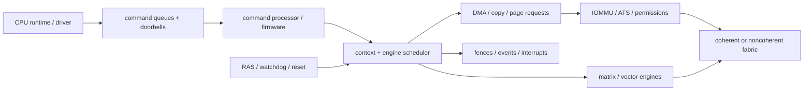
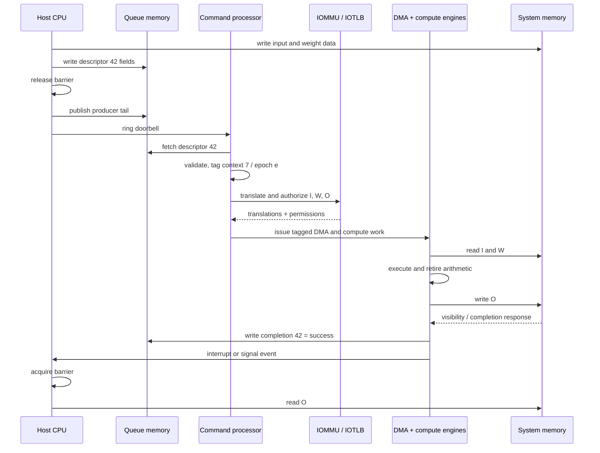
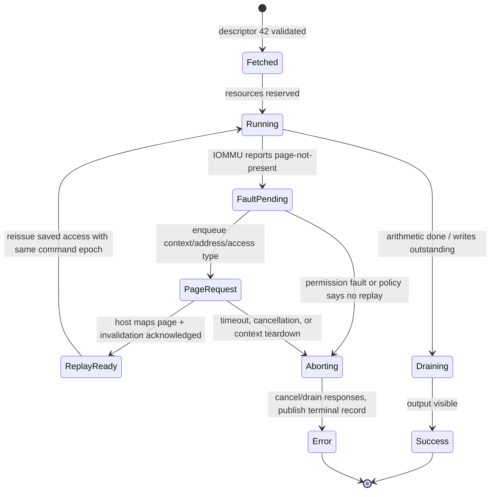
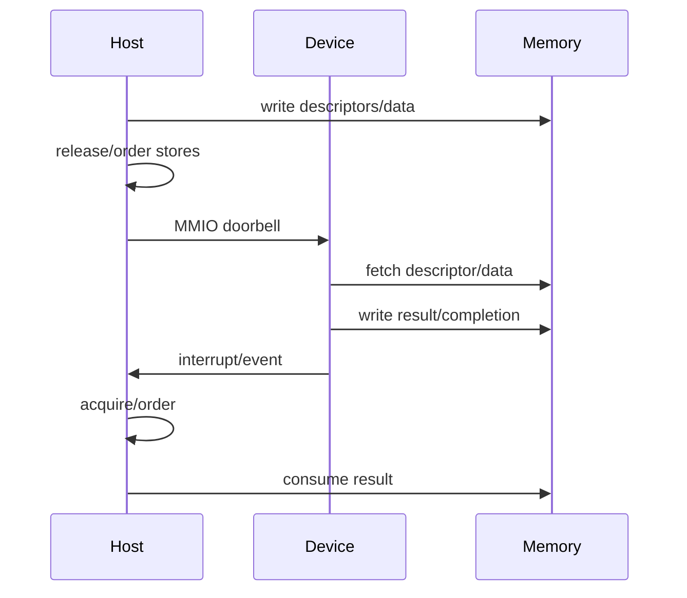
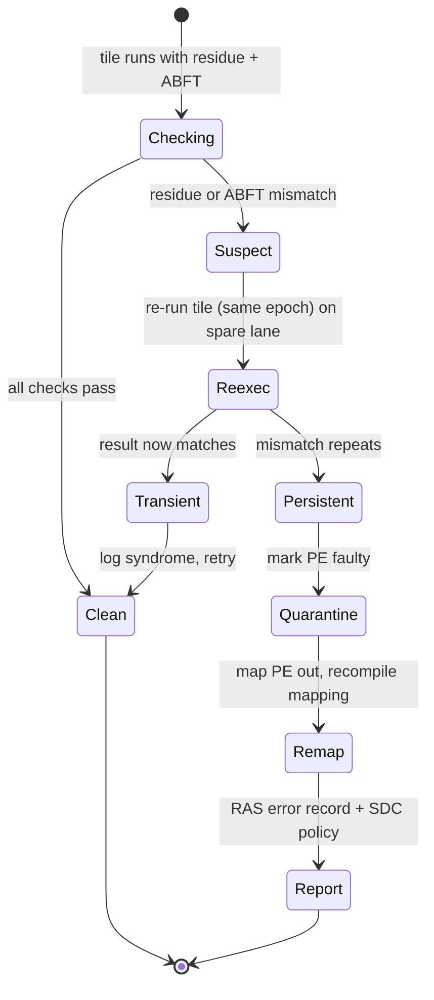

# Host Interface, Memory Visibility, and Scheduling — Making a Neural Processing Unit (NPU) a Safe Agent

> **First-time reader orientation:** An accelerator becomes useful when a host can submit commands, grant protected memory access, observe completion, recover faults, and share the device among contexts. Direct memory access (DMA) moves data without CPU copying; an input-output memory management unit (IOMMU) translates and protects device addresses; command and completion queues define ordering. This chapter explains how an NPU participates as a client; the CPU book owns the cache-coherence protocol itself.

> **Abbreviation key — skim now and return as needed:** central processing unit (CPU); register-transfer level (RTL); translation lookaside buffer (TLB); input-output memory management unit (IOMMU); input-output translation lookaside buffer (IOTLB);
> static random-access memory (SRAM); error-correcting code (ECC); network on chip (NoC); quality of service (QoS); direct memory access (DMA);
> virtual address (VA); Address Translation Services (ATS); Page Request Interface (PRI); reliability, availability, and serviceability (RAS); gigabyte (GB);
> mebibyte (MiB).

> **Prerequisites:** [NPU Accelerators](../01_Compute_Dataflows/01_NPU_Accelerators.md), [Tensor Tiling and Data Movement](../02_Mapping_and_Memory/01_Tensor_Tiling_and_Data_Movement.md), [Page Walkers and IOMMUs](../../01_CPU_Architecture/05_Virtual_Memory/02_Page_Walkers_IOMMUs_and_Virtualization.md), and [Cache Coherence](../../01_CPU_Architecture/06_Coherence_and_Consistency/01_Cache_Coherence.md).
> **Hands off to:** driver/runtime/compiler APIs, firmware, RTL command processors, security, and verification. This page owns the architecture-visible integration contract.

---

## 0. Why this page exists

A matrix engine is not a deployable accelerator. The system also needs command submission, dependency tracking, address translation, direct memory access, a coherent or explicitly synchronized view of memory, interrupts, multi-tenant scheduling, preemption, reset, errors, and observability. These “integration” blocks decide whether peak compute can be used safely. Coherence states, directories, and protocol correctness remain in [CPU Coherence and Consistency](../../01_CPU_Architecture/06_Coherence_and_Consistency/00_Index.md); this page only defines the NPU-side participation contract.



The integration architecture is a distributed state machine spanning untrusted software, device firmware, queues, engines, memory, and the coherent fabric.

## Before the details: a command is a distributed ownership transfer

The host prepares descriptors and input data in memory, then notifies the NPU through a doorbell or queue update. The NPU fetches the descriptor, translates addresses, reads inputs, executes, writes results, and records completion. Correctness depends on the ordering between those steps: the device must not see a new descriptor before its fields, and the host must not see completion before result writes are visible.

A command queue improves throughput by allowing several operations in flight, but every entry needs an identity, context, protection domain, status, and fault policy. Direct memory access moves bulk data; an IOMMU supplies address translation and access checks; coherence or explicit cache maintenance defines visibility. Preemption and virtualization additionally require save/restore boundaries and fair scheduling.

**Beginner checkpoint:** draw the ownership of descriptor, input buffer, output buffer, and completion record at every phase. Then specify fences, invalidation, timeout, cancellation, and fault replay. “The device is coherent” does not define the command protocol.

### Carry command 42 from publication to visible completion

Use one concrete command to derive the required blocks. Context 7 submits command 42 to compute an output tile from input virtual address `I`, weight virtual address `W`, and output virtual address `O`. The descriptor also contains shapes/strides, precision, dependencies, an address for the completion record, and an error policy. The queue is a ring in memory; the host owns entries before publication and the device owns them afterward.



Every arrow implies state that the simple matrix engine did not have:

1. **Prepare, then publish.** The host writes all descriptor fields and input data while it still owns the queue entry. A release barrier orders those stores before the producer-tail update and MMIO doorbell. Without the barrier, the device can legally observe the new tail and fetch an old or partially initialized descriptor. The doorbell is merely a notification; it is not the descriptor and does not repair memory ordering.
2. **Fetch and validate.** The command processor snapshots the ring entry, checks its version, opcode, lengths, alignment, dependency IDs, and reserved bits, then attaches `(context=7, command=42, epoch=e)` to all derived work. An *epoch* is a generation number incremented when state is aborted or reused. It lets the device discard a late response from an older incarnation of command 42.
3. **Translate and authorize.** Descriptor fetches and every generated access to `I`, `W`, `O`, or page/block metadata carry context 7's identity. The input-output memory management unit (IOMMU) translates the device-visible virtual address and checks read/write permission. An input range that crosses a page boundary requires both pages to be translated; validating only the base address is a security bug.
4. **Reserve before issue.** The scheduler reserves command-table, DMA-tag, scratchpad, and engine resources needed to make progress. It then expands the descriptor into input DMA, compute, and output DMA operations joined by events. Reserving scratchpad and waiting indefinitely for a DMA tag while another command holds the tags and waits for scratchpad creates circular wait; admission rules or separate progress resources must exclude this state.
5. **Execute, then drain.** “Matrix done” means arithmetic has stopped; it does not mean `O` is visible to the CPU. Output DMA can still be buffered in the NPU, network on chip, coherent home, or memory controller. The retirement record tracks outstanding writes and waits for the response required by the command's memory contract.
6. **Complete, then observe.** Only after the output reaches that visibility point does the device write the completion record with release ordering and signal the interrupt/event. The host observes completion with acquire ordering before reading `O`. Interrupt delivery before the completion record is safe only if the driver knows to retry; publishing success before result visibility is never safe under this contract.

The ownership transitions are explicit:

| Object | Before publication | After doorbell | During execution | After successful completion |
|---|---|---|---|---|
| descriptor slot | host may write | device reads; host must not overwrite | device retains snapshot/tag | host may reclaim after consumer-head advance |
| input/weight buffer | host initializes | host must obey sharing contract | device reads | reusable after defined read-complete event |
| output buffer | allocated, not valid | device owns writes | host must not consume | host owns valid result after acquire |
| completion record | host clears/allocates | device owns update | pending | host consumes terminal status |
| internal command entry | free | allocated to context 7, command 42, epoch e | owns resources and response count | freed only after all late-response risk is closed |

### Replay command 42 through a recoverable page fault

Now let translation of the second input page miss because the page is not resident. A correct design does not simply retry the whole command or hang the device. It records enough state to suspend and replay the precise access:



Suppose DMA request `r17` faults while earlier request `r16` has completed and later requests have not issued. The fault record stores context 7, command 42, epoch `e`, virtual page, read/write type, descriptor position, and a replay token identifying `r17`. The scheduler marks command 42 suspended, releases resources that are safe to release, but retains or checkpoints any partial sums whose earlier inputs have already executed. Other contexts continue because fault and replay queues have per-context limits.

Software makes the page resident, updates the page table, and requests translation-cache invalidation. The device must wait for invalidation completion before reissuing `r17`; otherwise a stale negative or old translation can refault or access the wrong page. The replayed response updates command 42 only if both its context and epoch still match. If the host canceled command 42 during the fault, reset increments the epoch; the late response is consumed and discarded rather than written into a newly allocated command entry.

A permission fault follows a different branch. It is terminal because software must not turn an unauthorized write into a replay without a new trusted submission. The device stops new issue, cancels or drains outstanding operations according to the fabric contract, prevents partial output from being reported as success, writes an error record containing the offending address/access/engine, and signals the host. Whether partially written `O` is preserved for diagnostics or zeroed is an explicit ABI policy—not an accidental result of reset timing.

### How integration features evolve from failures

| Minimal behavior and observed failure | Added feature | Enabling state/control | Cost and losing case |
|---|---|---|---|
| host writes one MMIO register per operation; CPU overhead dominates | memory-resident command ring + doorbell | producer/consumer indices, phase/wrap bit, descriptor snapshot | queue SRAM/fetch traffic and malformed-descriptor surface; unnecessary for rare commands |
| physical addresses expose/lock memory and prevent safe sharing | IOMMU and per-context identity | IOTLB, page walker, permission/context tags, invalidation protocol | area, walk latency, translation traffic; pinned contiguous buffers are simpler |
| translation miss aborts expensive long work | page request and precise replay | fault queue, saved request, replay token, epoch, suspend state | more live state and denial-of-service risk; not useful when all buffers are pinned |
| CPU waits or polls after every kernel | dependency events and asynchronous completion | timeline counters, wait queues, outstanding-write retirement | wrap/order/error cases; synchronous embedded systems may not benefit |
| one long command blocks urgent work | tile safe points or spatial partitioning | progress marker, saved command/loop state, resource quotas | state-save latency, fragmentation and scheduler complexity |
| reset lets late fabric responses corrupt reused entries | context/command epochs and drain protocol | generation tags on every request/response, quarantine before ID reuse | tag bits/comparators and longer recovery; still mandatory when requests can outlive reset |
| one tenant monopolizes faults, DMA, or interrupts | quotas and reserved progress resources | per-context counters, arbitration, rate limits | reduced peak pooling efficiency and policy complexity |

The general design rule is to add state only when it closes a named failure. Shared virtual addressing is not “better” in isolation: it wins when demand paging or pointer-rich sharing is valuable enough to pay for walkers, invalidations, replay, and fault isolation. Arbitrary-cycle preemption is not automatically superior to tile-boundary preemption: saving megabytes of partial sums can take longer than waiting for a short tile to finish.

### Counters and assertions tied to the command trace

End-to-end counters should let one reconstruct command 42 without guessing: host publish-to-fetch latency; descriptor validation cycles; scheduler wait by resource; IOTLB hits/misses and page-walk time; fault queue and replay latency; DMA bytes, requests, and outstanding depth; compute start/end; output drain/visibility latency; completion-write-to-interrupt latency; abort drain time; and epoch-dropped responses. Each record must carry the same context/command identity so host, firmware, NoC, and memory traces join correctly.

The trace also yields precise invariants:

- the device cannot fetch past the published producer tail, and consumes each queue phase exactly once;
- a descriptor is immutable to the device after snapshot or is protected against host modification while owned;
- every derived memory request carries the descriptor's context and permissions; range splitting cannot escape the validated extent;
- compute cannot consume a DMA destination before the corresponding fill event, and output DMA cannot consume an unfinished tile;
- success completion implies zero outstanding result writes at the required visibility scope;
- a replay occurs only after translation invalidation acknowledgement and retains command/context/epoch identity;
- an old-epoch response cannot modify scratchpad, completion memory, counters attributed to a new command, or a reused internal entry;
- every accepted command reaches exactly one terminal completion—success, fault, cancellation, or reset error—under the documented environment assumptions.

Verification should inject delay and reordering at every arrow in the sequence, then repeat with page faults, queue wrap, cancellation, reset, duplicate interrupts, and late responses. A no-stall success test proves the arithmetic path, but almost none of the integration architecture.

## 1. Submission model

Typical path:

1. software allocates/mappings buffers and command descriptors;
2. writes descriptors into a ring/queue;
3. orders descriptor stores before a doorbell;
4. device fetches descriptors and validates them;
5. command processor expands them into DMA/compute work;
6. engines signal events/fences;
7. device writes completion and optionally interrupts.

Descriptor fields include opcode, buffer addresses, dimensions/strides/layout, precision/mapping ID, dependencies, completion address, context/security ID, and error policy.

Ring invariant: producer never overwrites unconsumed entries; consumer never reads unpublished entries. Head/tail updates need memory ordering and wrap/version handling.

## 2. Doorbells and ordering

Descriptors are normal memory; doorbells are often MMIO. The producer must ensure descriptor writes are visible before ringing. Device completion similarly needs data/results visible before completion flag/interrupt.



Coherent memory can remove explicit cache clean/invalidate, but not the acquire/release ordering. Noncoherent DMA needs both maintenance and barriers.

## 3. DMA engines

DMA supports linear, strided, scatter-gather, multidimensional/tensor, and peer transfers. Architecture parameters:

- outstanding descriptors/transactions;
- burst size/alignment and boundary splitting;
- channels and priorities;
- address-generation width/stride nesting;
- IOMMU/IOTLB interface;
- error/partial completion semantics;
- checksum/ECC/poison handling;
- coherent versus noncoherent attributes;
- copy–compute overlap.

To sustain bandwidth $BW$ with latency $L$ and transfer size $Q$,

$$
N_{out}\gtrsim BWL/Q.
$$

Scatter-gather fetches metadata that itself needs translation and DMA. Validate list lengths/addresses and prevent cycles/unbounded traversal.

## 4. Address spaces and IOMMU

Requests carry device/context/process identity. Options:

- driver pins buffers and supplies physical/device addresses;
- IOMMU translates IOVA with per-context page tables;
- shared virtual addressing uses process VAs and PASID-like identity;
- ATS lets device cache translations; PRI/page requests recover missing pages.

The accelerator needs IOTLB/ATC capacity, context cache, fault queues, invalidation completion, and replay. A page fault may suspend one command/context rather than the entire device; queues require isolation so fault storms do not block unrelated tenants.

Security invariant: every DMA/compute memory access is authorized by the context active for that command, including descriptor fetches and page-table-related traffic.

## 5. Coherence choices

### Noncoherent accelerator

Simpler endpoint; software/runtime performs cache maintenance and ownership handoff. Best for explicit bulk buffers, risky for fine-grained sharing.

### I/O-coherent DMA

Requests snoop/participate enough to observe CPU caches but device may not retain coherent cache lines. Simplifies buffer sharing, adds home/snoop traffic.

### Fully coherent device cache

Device caches lines and responds to probes. Enables fine-grained shared memory/atomics but requires directory state, transient transactions, writeback, reset/drain, and deadlock-proof message resources.

Scratchpads are not coherent caches. If CPU maps device SRAM, define access windows, flushing, ownership, and consistency explicitly.

## 6. Command dependencies and synchronization

Commands form a DAG. Dependencies can be:

- in-order queue semantics;
- explicit event/fence IDs;
- memory semaphore/timeline counter;
- cross-engine barrier;
- host-visible completion;
- cross-device collective.

Use 64-bit or sufficiently wide monotonic timeline values with safe wrap rules. A waiter should sleep in a hardware queue, not poll memory at full bandwidth. Dependency cycles should be detected by software or watchdog; hardware must avoid consuming all resources with commands waiting on later commands in the same full queue.

Memory completion and command completion differ. A compute engine can finish arithmetic while result DMA remains outstanding; publish completion only at the defined visibility point.

## 7. Scheduling and admission

Scheduler chooses contexts, commands, tiles, and engines under constraints:

- scratchpad/register/descriptor capacity;
- matrix/vector/DMA availability;
- bandwidth/QoS budgets;
- dependencies and deadlines;
- thermal/power state;
- faulted/suspended contexts;
- fairness and priority.

Granularities:

- command/kernel nonpreemptive;
- tile boundary;
- engine instruction/safe point;
- partitioned spatial subarrays;
- time slice with state save.

Admission should reserve all resources needed for progress or use deadlock-free incremental acquisition. A command holding scratchpad while waiting for a DMA slot that is occupied by a command waiting for scratchpad is a system deadlock.

## 8. Preemption and context state

Preemptible state may include:

- command pointer/loop counters;
- scratchpad tiles and partial sums;
- matrix/vector pipeline state;
- DMA descriptors/outstanding IDs;
- TLB/ATC context;
- event/barrier state;
- performance counters and debug state.

Saving large scratchpads to memory can take longer than the desired scheduling quantum. Prefer tile safe points, spatial partitioning, or drain-and-resume. Priority work may use reserved resources rather than forcing immediate arbitrary-state preemption.

Context switch must prevent old late responses from updating new state; tag work with context/command epochs and delay ID reuse safely.

## 9. Virtualization and multi-tenancy

Mechanisms:

- mediated software queues;
- hardware virtual functions/queue pairs;
- spatial engine partitions;
- per-context IOMMU address spaces;
- cache/scratchpad/bandwidth quotas;
- interrupt remapping;
- performance-counter virtualization;
- secure firmware-mediated submission.

Isolation covers information and denial of service. Clear or partition scratchpad/register/cache state on reassignment; cap descriptors, page faults, outstanding DMA, and completion interrupts. Validate priority/QoS fields rather than trusting guests.

## 10. RAS, watchdog, and reset

Errors include illegal descriptor, translation fault, ECC/poison, link timeout, engine hang, numerical exception, thermal trip, and firmware fault. Report context/command, address, engine, syndrome, and recoverability.

Reset levels:

- command abort;
- engine reset;
- context reset;
- device warm reset;
- full power reset.

Recovery sequence stops new issue, quiesces/cancels DMA, resolves coherent dirty state, marks completions/errors, increments epochs, resets selected engines, restores configuration, and resumes unaffected contexts if supported.

Watchdog timeouts need progress indicators and workload-aware budgets; a valid long command must not look like a hang. Heartbeats without forward progress are insufficient.

## 11. Firmware and versioning

Command processors often run firmware. Define:

- signed/authenticated loading and rollback policy;
- ABI/descriptor version negotiation;
- capability discovery;
- update/reset behavior;
- watchdog and fault containment;
- privileged registers and debug locks;
- telemetry schema.

Hardware must reject unsupported descriptor versions safely. Firmware queues should not become an opaque performance bottleneck; expose occupancy/service counters and deterministic fast paths for common commands.

## 12. Observability

Per context/queue/engine:

- submit→start, execution, DMA, completion, interrupt latency;
- queue occupancy, head-of-line blocking, dependency wait;
- bytes, bursts, alignment, outstanding DMA and IOTLB/page faults;
- coherent probes/ownership/maintenance traffic;
- matrix/vector/DMA utilization and overlap;
- preemption request→safe-point/save/restore;
- QoS bandwidth/stall and thermal throttling;
- descriptor/permission/ECC/timeouts/reset counts;
- epoch-dropped late responses.

Correlate command IDs across host trace, firmware, engines, NoC, and memory. Without one identity, end-to-end tails are un-debuggable.

## 13. Verification invariants

- unpublished descriptors are never consumed; published descriptors are consumed at most once.
- commands access only memory authorized for their context.
- dependency completion is observed only after required result visibility.
- reset/abort cannot allow late DMA/engine responses to corrupt reused state.
- coherent dirty data is written back/transferred before agent state disappears.
- no context can exhaust resources reserved for mandatory progress or another guarantee.
- every accepted command eventually completes or reports a terminal error under stated environment assumptions.
- interrupts/events correspond exactly to completion records and are safely retryable/coalescible.
- compute-datapath results are covered by an integrity check (residue, accumulator ECC, or ABFT checksum) in a fault domain distinct from the datapath, and a failed check cannot retire as success.

## 14. Numbers to remember

- Descriptor stores must be ordered before doorbells; result visibility before completion notification.
- Coherence simplifies cache maintenance but does not remove synchronization ordering.
- DMA concurrency follows bandwidth × latency ÷ transfer size.
- Scratchpad and partial-sum state make arbitrary preemption expensive; tile safe points are common.
- Context/command epochs protect against late responses after reset/reuse.
- Integration counters need one end-to-end command identity.
- Memory ECC does not guard the compute datapath: residue mod-3 catches every single-bit MAC error, and full-checksum ABFT detects and locates any single wrong element at $O(1/D)$ overhead ($\approx1.6\%$ at $D=128$) versus $100\%$ for duplication.

## 15. Worked problems

### Problem 1 — DMA concurrency

Target 64 GB/s through a path with 500 ns round trip and 256 B transactions:

$$
N\ge64\times10^9\times500\times10^{-9}/256=125.
$$

At least 125 outstanding transactions are needed, plus headroom and per-channel distribution.

### Problem 2 — preemption cost

A context has 8 MiB live scratchpad/partial state. At 100 GB/s save bandwidth, raw save is about 84 µs, before drain, metadata, and restore. A 10 µs scheduling quantum cannot use full-state save; partition or preempt at a smaller tile boundary.

### Problem 3 — completion ordering

Compute finishes at cycle 1000, result DMA drains at 1200, coherent visibility acknowledgement arrives at 1230. If completion semantics promise host-visible results, interrupt/event before 1230 is incorrect even though the matrix engine became idle at 1000.

## 16. Compute-fabric integrity: silent data corruption and ABFT

Section 10's reliability, availability, and serviceability (RAS) coverage stops at the boundary of the arithmetic. Error-correcting code (ECC) protects SRAM and DRAM; parity and translation checks protect descriptors, DMA lists, and page walks; epochs protect reused state after reset. None of that guards the multiplier–adder trees and accumulators *between* the memories. A single-event upset (SEU) — a particle strike flipping one flip-flop — landing in a partial-product register or an accumulator flop yields a wrong but plausible number that flows into the model with no error signal: a silent data corruption (SDC). A harder source is a marginal or aged lane, a "core that does not count," computing some product wrong deterministically. At fleet scale both are statistical certainties: a per-device SDC once per several months, across $10^5$–$10^6$ accelerators, is a fleet event every few minutes, and one corrupted logit can flip an inference or silently poison training weights. The compute datapath therefore needs its own integrity checks, reported and recovered through the same §10 machinery.

### 16.1 Residue checking on the MAC datapath

The cheapest continuous check uses the fact that residue modulo $m$ is a ring homomorphism:

$$
(a\cdot b)\bmod m=\big((a\bmod m)(b\bmod m)\big)\bmod m,\qquad
(a+b)\bmod m=\big((a\bmod m)+(b\bmod m)\big)\bmod m .
$$

A narrow side datapath carries the mod-$m$ residues of the operands, combines them with the same multiply/add structure as the full-width multiply–accumulate (MAC), and compares the reduced result against the residue of the computed accumulator; a mismatch flags a fault. Choosing $m=3$ needs only 2-bit residues and catches **every single-bit error**: a flip at bit $k$ changes a value by $\pm2^{k}$, and $2^{k}\bmod3$ alternates $1,2,1,2,\dots$ — never $0$ — so any single flipped bit perturbs the residue. Arbitrary-magnitude errors escape only when the error is $\equiv0\bmod3$, so coverage of random corruption is about $2/3$.

```tikz
\usepackage{circuitikz}
\begin{document}
\begin{circuitikz}[american,thick,scale=0.8,transform shape]
  \tikzset{blk/.style={draw,rounded corners,minimum height=0.8cm,align=center,font=\small}}
  \node[blk,minimum width=1.5cm] (mul) at (0,1.2) {$\times$};
  \node[blk,minimum width=1.5cm] (add) at (2.9,1.2) {$+$};
  \node[blk,minimum width=1.6cm] (acc) at (5.6,1.2) {acc};
  \draw[->] (-1.9,1.45) node[left]{$a$} -- ([yshift=0.16cm]mul.west);
  \draw[->] (-1.9,0.95) node[left]{$b$} -- ([yshift=-0.16cm]mul.west);
  \draw[->] (mul.east) -- (add.west);
  \draw[->] (add.east) -- (acc.west);
  \draw[->] (acc.south) -- ++(0,-0.5) -| (add.south);
  \node[blk,minimum width=1.7cm] (rmul) at (0,-1.4) {$\times\bmod 3$};
  \node[blk,minimum width=1.7cm] (radd) at (2.9,-1.4) {$+\bmod 3$};
  \node[blk,minimum width=1.6cm] (rres) at (5.6,-1.4) {res};
  \draw[->] (-1.9,-1.15) node[left]{$a\bmod 3$} -- ([yshift=0.16cm]rmul.west);
  \draw[->] (-1.9,-1.65) node[left]{$b\bmod 3$} -- ([yshift=-0.16cm]rmul.west);
  \draw[->] (rmul.east) -- (radd.west);
  \draw[->] (radd.east) -- (rres.west);
  \node[blk,minimum width=1.4cm] (mod) at (8.2,1.2) {$\bmod 3$};
  \node[blk,minimum width=1.2cm] (cmp) at (8.2,-0.1) {$=?$};
  \draw[->] (acc.east) -- (mod.west);
  \draw[->] (mod.south) -- (cmp.north);
  \draw[->] (rres.east) -| (cmp.south);
  \draw[->] (cmp.east) -- ++(1.1,0) node[right]{error};
\end{circuitikz}
\end{document}
```

The checker must occupy a different fault domain than the datapath it watches; a residue lane sharing the broken multiplier fails identically (common-mode) and confirms the wrong answer.

### 16.2 Algorithm-based fault tolerance for matrix tiles

Residue checks are per-operation but local. Algorithm-based fault tolerance (ABFT) protects a whole matrix tile with one end-to-end invariant whose cost shrinks as the tile grows. Let $e$ be the all-ones vector. Encode the operands of $C=AB$ ($A$ is $M\times K$, $B$ is $K\times N$) with a column-checksum row on $A$ and a row-checksum column on $B$:

$$
A^{c}=\begin{bmatrix}A\\ e^{T}A\end{bmatrix},\qquad B^{r}=\begin{bmatrix}B & Be\end{bmatrix}.
$$

Then

$$
A^{c}B^{r}=\begin{bmatrix}AB & ABe\\ e^{T}AB & e^{T}ABe\end{bmatrix}
=\begin{bmatrix}C & Ce\\ e^{T}C & e^{T}Ce\end{bmatrix}.
$$

The invariant is pure associativity: the checksum carried *through* the multiply equals the checksum taken *from* the result,

$$
(e^{T}A)B=e^{T}(AB)=e^{T}C,\qquad A(Be)=(AB)e=Ce.
$$

So the appended last row must equal the column sums of $C$, and the appended last column must equal its row sums. A single wrong element $C_{ij}$ breaks exactly one row check (row $i$) and one column check (column $j$); their intersection **locates** the fault, and with trusted checksums the correct value is recovered as (row-checksum minus the other elements of the row). ABFT thus detects, locates, and can correct any single erroneous element, and detects any pattern that changes at least one row- or column-sum — all single-bit SEUs and all single-lane faults. Only corruption engineered to preserve every checksum escapes, which is negligible for random upset.

*Overhead.* For a square $D\times D$ tile ($M=N=K=D$) the product is $D^3$ MACs; the checksum border adds about $2D^2+D$ MACs plus $O(D^2)$ additions to form and verify the sums. Relative compute overhead is

$$
\frac{2D^2}{D^3}=\frac{2}{D}=O\!\left(\frac1D\right),
$$

and the storage overhead (one extra row and column) is $\approx2/D$ as well. At $D=128$ that is $1.56\%$; at $D=256$, $0.78\%$ — versus $100\%$ for dual modular redundancy (DMR). ABFT buys single-error-complete coverage of the array for 1–2% at the tile sizes NPUs actually run, a 50–100$\times$ cheaper guard than duplicating it. In fixed point the checksum equality is exact; in floating point $\sum$-then-round $\neq$ round-then-$\sum$, so the comparison needs a tolerance $\tau$ that bounds accumulated rounding without masking a real fault — a genuine tension, and a reason integer or block-floating-point tiles are easier to protect.

### 16.3 Detection, sampling, and quarantine

Residue and ABFT are concurrent detectors. To catch what they miss and to validate the checkers themselves, the scheduler periodically re-executes a sampled fraction $s$ of tiles on a spare lane or a second pass; the chance of catching a persistent bad lane over $t$ sampled tiles rises as $1-(1-s)^t$, so sampling is a throughput/coverage knob, not a per-tile guarantee. When any detector fires, recovery reuses §10:



A transient that clears on re-execution is logged and the tile retried under the same command epoch (§8, and the replay machinery of the command-42 walkthrough). A recurring failure marks the processing element (PE) faulty; the scheduler maps it out — the compute analogue of memory page retirement — while §10 writes the error record (context, tile, PE, syndrome) and, if wrong output was already published, escalates per the application binary interface's (ABI) SDC policy.

### 16.4 Trade-offs

- **Duplication can be simpler.** A small array, or a safety-critical part already running dual or triple modular redundancy (DMR/TMR) for certification, already has 100% coverage and gains nothing from ABFT; and for tiny tiles $O(1/D)$ is not small ($D=8\Rightarrow25\%$), so duplication may win.
- **ABFT assumes linearity.** It guards general matrix multiplication (GEMM) and convolution cleanly but not the nonlinear activation and normalization units, which fall back to residue, range checks, or sampled re-execution.
- **Each layer is partial.** The residue lane adds a comparator to the timing path and covers only $\sim2/3$ of arbitrary errors; accumulator ECC covers retention upsets but not the arithmetic that fills the flops; sampling covers only statistically. The mechanisms are complementary, and the right mix depends on tile size, numeric format, and the fleet-level SDC budget.

This integrity layer extends the RAS and reset path of §10 (it reports through the same error records and epochs) and protects the MAC array of the [Systolic, Spatial, and Vector Dataflows](../01_Compute_Dataflows/02_Systolic_Spatial_and_Vector_Dataflows.md) page, where the checksum row and column fall naturally on the array's boundary PEs.

## Cross-references

- **Accelerator internals:** [NPU Accelerators](../01_Compute_Dataflows/01_NPU_Accelerators.md), [Tensor Tiling and Data Movement](../02_Mapping_and_Memory/01_Tensor_Tiling_and_Data_Movement.md).
- **Translation/coherence/fabric:** [Page Walkers and IOMMUs](../../01_CPU_Architecture/05_Virtual_Memory/02_Page_Walkers_IOMMUs_and_Virtualization.md), [Cache Coherence](../../01_CPU_Architecture/06_Coherence_and_Consistency/01_Cache_Coherence.md), [QoS, Ordering, and I/O Coherence](../../04_SoC_and_Chiplet_Architecture/05_IO_and_Chiplets/01_QoS_Ordering_and_IO_Coherence.md).
- **System modeling:** [Full-Chip Modeling](../../04_SoC_and_Chiplet_Architecture/01_System_Modeling/01_Full_Chip_Modeling.md), [Accelerator and NPU Simulators](../04_Simulation/01_Accelerator_and_NPU_Simulators.md).
- **Compute integrity:** SDC and ABFT (§16) extend the RAS/reset path of §10 and guard the array of the [Systolic, Spatial, and Vector Dataflows](../01_Compute_Dataflows/02_Systolic_Spatial_and_Vector_Dataflows.md) page (§2, §5 there).

## References

1. RISC-V International, [RISC-V IOMMU Architecture Specification](https://docs.riscv.org/reference/iommu/index.html).
2. Arm, AMBA AXI/ACE/CHI and SMMU architecture specifications.
3. PCI-SIG, PCI Express ATS/PRI/PASID specifications.
4. N. Jouppi et al., “In-Datacenter Performance Analysis of a Tensor Processing Unit,” ISCA 2017.
5. Compute Express Link Consortium specifications for coherent accelerator and memory attachment.
6. K.-H. Huang and J. A. Abraham, “Algorithm-Based Fault Tolerance for Matrix Operations,” IEEE Trans. Computers, 1984.
7. H. D. Dixit et al., “Silent Data Corruptions at Scale,” 2021; P. H. Hochschild et al., “Cores That Don't Count,” HotOS 2021.

---

**Navigation:** [System Integration index](00_Index.md) · [NPU index](../00_Index.md)
