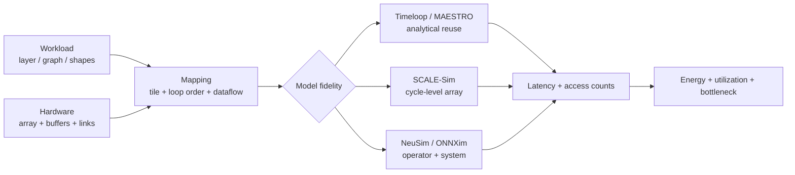

# Accelerator, Deep Neural Network (DNN), and Neural Processing Unit (NPU) Simulators

> **First-time reader orientation:** Accelerator simulators connect a neural-network layer, a hardware description, and a mapping. They estimate cycles, utilization, traffic, energy, or area at different fidelity. A processing element (PE) is one repeated compute unit; a mapping assigns tensor-loop work and data to PEs, time, and memory levels. Tool outputs are conditional on those inputs.

> **Abbreviation key — skim now and return as needed:** central processing unit (CPU); graphics processing unit (GPU); reduced instruction set computer (RISC); register-transfer level (RTL); power, performance, and area (PPA);
> design-space exploration (DSE); reorder buffer (ROB); register file (RF); static random-access memory (SRAM); dynamic random-access memory (DRAM);
> high-bandwidth memory (HBM); double data rate (DDR); network on chip (NoC); direct memory access (DMA); first come, first served (FCFS);
> dynamic voltage and frequency scaling (DVFS); processing element (PE); multiply-accumulate (MAC); general matrix multiplication (GEMM); output stationary (OS);
> artificial intelligence (AI); Open Neural Network Exchange (ONNX); intermediate representation (IR); integer 8-bit (INT8); 8-bit floating point (FP8); key-value (KV) cache; comma-separated values (CSV); tensor processing unit (TPU); compute-in-memory (CIM); million instructions per second (MIPS); service-level objective (SLO);
> kilobyte (KB); gigabyte (GB); terabyte (TB); gigahertz (GHz).

> **Prerequisites:** [NPU simulation methodology](../00_Design_Methodology/03_NPU_Simulation_Methodology_and_Evidence.md) (graph lowering, count/event models, evidence, and validation), [NPU workload and performance methods](../00_Design_Methodology/01_NPU_Workloads_Performance_and_DSE.md) (systolic-array cycles, dataflow/reuse, roofline, engine balance, graph scheduling, and scale-out communication).
> **Hands off to:** [Full_Chip_Modeling §4](../../04_SoC_and_Chiplet_Architecture/01_System_Modeling/01_Full_Chip_Modeling.md) (composing a PE→array→chip→pod NPU model with power/thermal), the companion AI-infra notebook for GPU/TPU microarchitecture.

---

## 0. Why this page exists

A DNN accelerator has almost no branches, no speculation, and a tiny instruction set — so the CPU-simulator machinery ([NPU simulation methodology](../00_Design_Methodology/03_NPU_Simulation_Methodology_and_Evidence.md)) is the wrong tool. What decides an NPU's performance and energy is instead a **mapping problem**: given a layer (a loop nest over tensor dimensions) and a fixed array of MACs (multiply-accumulate units) with a small SRAM hierarchy, *which loop tiling, loop order, and spatial unrolling* you pick sets the data-movement volume, the array utilization, and therefore the latency and — dominantly — the energy. Accelerator simulators are built around that mapping problem, and they split into three paradigms that answer different questions at different cost. This page explains the shared mechanism (how a layer plus a mapping becomes a latency and an energy number), the dataflow taxonomy that mapping expresses, and the tools — analytical (Timeloop/Accelergy, MAESTRO), cycle-accurate (SCALE-Sim v3), and operator-level industrial (NeuSim, ONNXim) — and when each is the right one.

The single habit this page installs: **before you believe an accelerator PPA number, ask whether it came from an analytical mapping model, a cycle-accurate array model, or an operator-level graph model — because each is blind to a different thing.**

### System view — three inputs, two outputs, several fidelity choices

Every accelerator model consumes the same three objects: a workload, a hardware template, and a mapping. Analytical tools count reuse and transfers; cycle models schedule array and memory events; operator/system models compose kernels and collectives. All should converge on latency and energy with explicit provenance.



---

## 1. The three paradigms and when to use each

Accelerator simulation is stratified not by "how detailed" alone but by *what unit of work* the model reasons about. The three NPU-specific rungs are:

| Paradigm | Unit of reasoning | What it computes | What it is blind to | Speed | Representative tools |
|---|---|---|---|---|---|
| **Analytical mapping / dataflow** | one layer + one mapping | access counts per memory level → energy; MACs → ideal cycles; searches the mapping space | cycle-level contention, DRAM scheduling, cross-layer/runtime effects | ~$10^4$–$10^6$ mappings/s | Timeloop+Accelergy, MAESTRO |
| **Cycle-accurate (array)** | one layer, cycle by cycle | array fill/drain + SRAM/DRAM stalls → real cycle counts, stall breakdown, achieved bandwidth | whole-graph scheduling, multi-tenant/runtime, exact RTL corner cases | ~KIPS–MIPS | SCALE-Sim v3 |
| **Operator-level industrial** | the whole model graph, per operator | per-operator time/energy, multi-core/multi-chip contention, perf→power→carbon→SLO | intra-operator cycle detail (compute is a closed-form or table) | fast (graph-scale, distributable) | NeuSim, ONNXim |

The rule mirrors the CPU rule ("use the fastest model that distinguishes the choices you are deciding between"), specialized for accelerators:

- **Choosing a dataflow or a buffer hierarchy, or minimizing energy per inference?** Analytical mapping — you need to search *millions* of mappings, and energy (not cycles) is the objective, so a closed-form access-count model is both sufficient and the only thing fast enough.
- **Sizing the array or the SRAM, or asking "am I compute- or memory-stall-bound on this layer?"** Cycle-accurate — only a time-stepped model produces *stall cycles* and *achieved DRAM bandwidth*, which is exactly where analytical models are optimistic (they assume the mapping's data arrives on time).
- **Planning a datacenter NPU, an LLM (large language model) serving deployment, or a multi-tenant chip?** Operator-level—the questions are whole-graph (parallelism strategy, batch, KV-cache traffic), multi-chip (collectives over the interconnect), and system (power, carbon, SLO), none of which a single-layer model sees. Section 7 develops this NeuSim/ONNXim rung.

**These are complementary, not competing.** A realistic flow uses Timeloop to pick the mapping, SCALE-Sim to check the mapping's real stall behavior on the chosen array/SRAM, and an operator-level tool to roll the per-layer results into a graph- and pod-level PPA number.

### 1.1 From a framework benchmark to the simulator's workload

For the NPU-specific compiler/artifact/ROI/statistics chain, see [NPU source-to-result workflow](../00_Design_Methodology/03_NPU_Simulation_Methodology_and_Evidence.md). NPU simulators usually enter **above assembly**, so the important audit is how the model graph becomes operator and tensor descriptors.

#### Stage A — freeze model semantics and input shapes

A PyTorch, TensorFlow, or JAX benchmark is executable framework code. It may contain Python control, data-dependent shapes, preprocessing, custom operators, and training-only behavior. Exporting inference to ONNX serializes a more constrained artifact:

- a directed graph of operator nodes;
- tensor inputs/outputs with element types and shapes;
- constant initializers such as trained weights;
- node attributes such as stride, padding, axes, or transpose flags;
- operator-set versions defining semantics.

The exported graph is not automatically identical to the source module. Training nodes may disappear; Python control may be specialized for example inputs; dynamic dimensions may remain symbolic; custom operators may be opaque. Record framework/exporter/opset versions, input shapes, batch/sequence length, precision, model weights, and preprocessing. An accelerator result without those is not a reproducible workload.

#### Stage B — graph optimization changes the operator list

Before architecture simulation, a compiler/frontend typically performs shape inference and graph passes:

1. **constant folding** evaluates subgraphs that depend only on weights/constants;
2. **dead-node elimination** removes outputs never consumed;
3. **canonicalization/decomposition** converts unsupported high-level nodes into supported primitives;
4. **fusion** combines patterns such as matrix multiply + bias + activation;
5. **layout selection** chooses tensor dimension order and inserts/removes transposes;
6. **quantization** selects INT8/FP8/etc., scale metadata, accumulator width, and conversion nodes;
7. **partitioning** assigns nodes to matrix, vector, CPU fallback, or multiple NPU cores.

Each pass changes performance inputs. Fusion may eliminate an intermediate DRAM write/read; decomposition may expose several launches; layout conversion adds real bytes; fallback nodes may dominate latency even though the NPU simulator ignores them. Preserve a before/after node list and a **coverage report**:

$$
\text{coverage}_{ops}=\frac{\text{operations modeled on NPU}}{\text{operations in optimized graph}},\qquad
\text{coverage}_{time}=\frac{\text{reference time of modeled nodes}}{\text{whole reference time}}.
$$

Operation-count coverage can be misleading when one unsupported normalization or data-transfer node controls the critical path, so time coverage is preferable when a reference run exists.

#### Stage C — operators become loop bounds

Architecture tools do not simulate a node name; they need dimensions and data movement. A frontend lowers each node:

- `MatMul(A[M,K], B[K,N])` → GEMM $(M,N,K)$ and datatype;
- convolution → $(N,C,K,P,Q,R,S)$ plus stride/dilation/padding, or an equivalent GEMM;
- attention → query/key/value (Q/K/V) projection GEMMs, score GEMM, mask/softmax reductions, value GEMM, output projection, and KV-cache bytes;
- elementwise/reduction → vector length, input/output bytes, reduction axes, and special-function work.

For a GEMM, useful work is usually reported as $M N K$ MACs or $2MNK$ arithmetic operations. State the convention. Tensor bytes require layout and precision:

$$
B_A=MKb_A,\qquad B_B=KNb_B,\qquad B_C=MNb_C,
$$

before tiling/reuse. A tool that receives only $(M,N,K)$ cannot infer surrounding transpose, quantization, softmax, or host-to-device work.

#### Stage D — the tool-specific input is generated

The same lowered operator reaches different tools through different files:

- **SCALE-Sim:** architecture configuration plus a topology CSV containing convolution dimensions or a GEMM CSV containing $M,N,K$. It is already a layer list; SCALE-Sim does not parse PyTorch source or ONNX itself.
- **Timeloop:** a tensor-algebra problem shape, architecture/storage hierarchy, component energy information, mapping constraints, and either a candidate mapping or mapper search directives.
- **MAESTRO:** layer dimensions plus data-centric mapping directives such as spatial/temporal maps and clusters.
- **ONNXim:** consumes an ONNX graph and maps supported nodes into its multi-core NPU/system model, retaining more graph-level scheduling context.
- **NeuSim-style operator model:** consumes per-operator shapes/parallelism and system parameters, then composes operator results across a graph/deployment.

Calling all of these “running the model” hides different coverage. The run manifest should name the exact intermediate artifact and conversion script.

#### Stage E — mapping becomes events or counts

For each operator, a mapping selects tile sizes, loop order, spatial unrolling, double buffers, memory levels, and dataflow. Then:

- Timeloop/MAESTRO count accesses/reuse and apply analytical performance/energy rules;
- SCALE-Sim time-steps systolic demand and produces compute, SRAM and DRAM traces;
- a coupled model feeds those requests to NoC/DRAM event models and lets stalls emerge;
- an operator-level model places the resulting latency/traffic on a graph dependency schedule.

SCALE-Sim's output separation is especially instructive. A run can emit `COMPUTE_REPORT.csv` (cycles, stalls and utilization), `BANDWIDTH_REPORT.csv` (average and maximum SRAM/DRAM bandwidth), `DETAILED_ACCESS_REPORT.csv` (per-layer access and access-cycle totals), and `TIME_REPORT.csv` (modeled layer time in microseconds from the selected hardware-specific linear model), plus optional cycle-by-cycle SRAM/DRAM access traces. These files answer different questions: compute cycles are the direct architectural result, while `TIME_REPORT.csv` is a calibrated conversion that also depends on the configured `TimeLinearModel`. Neither is the wall-clock time spent running the simulator on the host computer; measure that separately if simulation speed matters. Final layer time must come from one consistent timing mode; do not add an analytical bandwidth penalty to compute cycles that already include Ramulator stalls.

#### Stage F — graph time is a dependency schedule, not always a sum

For a strictly sequential inference graph,

$$
T_{graph}=\sum_o(T_{compute,o}+T_{transfer,o}+T_{launch,o}).
$$

With fusion, pipeline parallelism, asynchronous DMA, or multiple engines, operators overlap. The correct time is the length of the critical path through resource/dependency events:

$$
T_{graph}=\max_{p\in\text{dependency paths}}\sum_{o\in p}T_o
$$

after adding serialization edges for shared matrix engines, DMA channels, SRAM banks, NoC links, and DRAM. Merely summing per-layer isolated latencies is pessimistic when overlap is legal and optimistic when shared-resource contention was omitted.

### 1.2 One complete trace: model node → target commands → events → final numbers

The abstract stages become concrete in this toy run. The numbers are deliberately small enough to audit by hand; a real model repeats the same transformations for thousands of operators.

#### A. Freeze and lower the graph

Assume the framework benchmark runs inference with fixed input `X[4,4]`, constant weight `W[4,4]`, and a `MatMul → Add(bias) → ReLU` pattern. Export records exact tensor values/shapes, opset, precision policy, and preprocessing. Shape inference confirms the matrix dimensions; a graph pass fuses bias and ReLU into an NPU-supported epilogue. The optimized graph has one scheduled node rather than three, so its manifest records both forms and the eliminated intermediate.

The compiler lowers the node through progressively more hardware-specific representations:

```text
Graph IR:
  y = relu(matmul(X[4,4], W[4,4]) + bias[4])

Tensor/loop IR:
  for m=0..3, n=0..3, k=0..3:
      acc[m,n] += X[m,k] * W[k,n]
  y[m,n] = relu(acc[m,n] + bias[n])

Mapped IR for a 2x2 output-stationary array:
  tile (m,n,k) by (2,2,4)
  spatial m across array rows; spatial n across columns; temporal k
  retain int32 acc in PEs; run fused vector epilogue before store

Target command/micro-op stream for each output tile t:
  LOAD_XW  t, input_bank[phase], weight_bank[phase] -> INPUT_READY[t]
  MMA_OS   t, K=4, waits INPUT_READY[t]             -> ARRAY_DONE[t]
  EPILOGUE t, bias, relu, waits ARRAY_DONE[t]       -> OUTPUT_READY[t]
  STORE_Y  t, waits OUTPUT_READY[t]                 -> STORED[t]
```

The last block is the NPU equivalent of assembly. Some machines expose binary instructions; others expose fixed-size descriptors interpreted by firmware. In both cases the simulator must consume the same executable semantics as hardware: opcode, tile extents, addresses/strides, bank and phase, precision, mapping ID, waits/signals, context, and fault policy. Simulating the loop IR while assuming a different hidden command schedule does not validate the compiler/runtime stack.

```mermaid
flowchart LR
    SRC["framework benchmark<br/>inputs + weights"] --> ONNX["exported graph<br/>shapes + operator semantics"]
    ONNX --> OPT["optimized graph<br/>fusion + layout + quantization"]
    OPT --> TIR["tensor / loop IR"]
    TIR --> MAP["mapped IR<br/>2×2×4 tiles + OS dataflow"]
    MAP --> BIN["NPU descriptors / micro-ops"]
    BIN --> FE["simulator fetch + decode"]
    FE --> EV["timed resource events"]
    EV --> CNT["cycles + traffic + activity counts"]
    CNT --> MET["latency + utilization + energy + bottleneck"]
```



#### B. Convert commands into timed events

The hardware model declares a 2×2 array, two input phases, two output phases, one load DMA channel, one store DMA channel, banked SRAM, and a 1 GHz clock. For this toy calibration, one tile load occupies load DMA for 5 cycles, the complete systolic MMA including fill/drain occupies the array for 6 cycles, the fused epilogue is included in that reservation, and a store occupies store DMA for 2 cycles.

An event-driven simulator maintains a priority queue ordered by timestamp. `LOAD_START(t0)` reserves load DMA and its destination banks; it schedules `LOAD_DONE(t0)` at cycle 5. That callback sets `INPUT_READY[t0]`, wakes `MMA(t0)`, reserves the array for cycles 5–10, and schedules `ARRAY_DONE(t0)` at cycle 11. Events that request a busy resource remain in a ready queue; they do not disappear and they do not advance simulated time by polling. Completion callbacks update counters and release bank generations.

One legal zero-based timeline is:

| Cycles | Load DMA | 2×2 array | Store DMA | Event at interval end |
|---|---|---|---|---|
| 0–4 | tile 0 | idle | idle | `INPUT_READY[0]` at 5 |
| 5–9 | tile 1 | tile 0, cycles 5–10 | idle | `INPUT_READY[1]` at 10 |
| 10 | idle | finish tile 0 | idle | `OUTPUT_READY[0]` at 11 |
| 11–12 | tile 2 begins, cycles 11–15 | tile 1, cycles 11–16 | tile 0 | `STORED[0]` at 13 |
| 13–15 | finish tile 2 load | tile 1 | idle | `INPUT_READY[2]` at 16 |
| 16 | idle | finish tile 1 | idle | `OUTPUT_READY[1]` at 17 |
| 17–18 | tile 3 begins, cycles 17–21 | tile 2, cycles 17–22 | tile 1 | `STORED[1]` at 19 |
| 19–21 | finish tile 3 load | tile 2 | idle | `INPUT_READY[3]` at 22 |
| 22 | idle | finish tile 2 | idle | `OUTPUT_READY[2]` at 23 |
| 23–24 | idle | tile 3, cycles 23–28 | tile 2 | `STORED[2]` at 25 |
| 25–28 | idle | finish tile 3 | idle | `OUTPUT_READY[3]` at 29 |
| 29–30 | idle | idle | tile 3 | graph completion at 31 |

The unusual load start at cycle 11 is caused by buffer lifetime, not load-DMA availability: tile 2 reuses tile 0's input phase only after tile 0 releases it. Tile 3 likewise waits for tile 1. A model that schedules load 2 immediately at cycle 10 without checking bank ownership is one cycle faster and architecturally impossible. This is why events and resources, not just per-operator lookup times, produce the final answer.

#### C. Reduce the event trace into metrics

The fused GEMM performs $4\cdot4\cdot4=64$ useful MACs. Four tile reservations each occupy four PEs for six cycles, or 96 available MAC slots, so compute-phase utilization is

$$U_{compute}=64/96=66.7\%.$$

End-to-end array utilization additionally includes time when the array has no runnable tile:

$$U_{wall}=64/(4\cdot31)=51.6\%.$$

The reported latency is 31 cycles, or 31 ns at 1 GHz. A report that says only 66.7% utilization conceals load/buffer startup and final store drain; one that says only 51.6% conceals how well the array performs once scheduled. Both denominators belong in the result.

Assume no cross-output-tile reuse in this illustrative mapping. Four tiles each load 8 B of X and 8 B of W and store four 32-bit outputs, so HBM traffic is 64 B read plus 64 B write. The simulator derives those bytes from issued transactions and cross-checks them against descriptor footprints; it does not infer them from elapsed cycles. The same trace increments SRAM writes on refill, operand reads, result writes, and store reads, and MAC/control activity when those events execute.

Energy is then a reduction over counts, never a second timing simulation. For an explicitly *illustrative* energy reference table of 20 pJ/HBM-byte, 1 pJ/SRAM-byte, 0.2 pJ/MAC, and 2 pJ for each of 15 decoded command/event actions, if the trace records 128 HBM bytes and 256 SRAM bytes,

$$
E_{dynamic}=128(20)+256(1)+64(0.2)+15(2)=2858.8\text{ pJ}.
$$

At 50 mW modeled leakage for 31 ns, leakage adds $1.55$ nJ, so the toy total is 4.409 nJ. These values are not technology claims; replacing them with characterized SRAM, link, MAC, and controller tables is what turns the action counts into evidence. Area is similarly the sum of instantiated component areas—not something learned from the cycle trace—and should be calibrated to memory compilers and synthesis.

The final per-run record therefore contains at least: graph latency and critical path; cycles per operator/tile; useful and available MAC slots; stall cycles by input-bank, DMA, SRAM-bank, output, dependency, and fault cause; bytes/accesses per tensor and hierarchy; peak/average bandwidth; queue and buffer occupancy; activity counts and energy-table provenance; static/dynamic energy; modeled area; unsupported/fallback operations; and host wall time used to run the simulator as a separate metric.

#### D. Replay a recoverable fault

If tile 2's load encounters a page-not-present response at cycle 12, its destination bank remains `FILLING`, `INPUT_READY[2]` is suppressed, and the transaction saves descriptor index, completed fragments, context, and epoch. Suppose page service plus invalidation/replay delays readiness until cycle 33. Tile 1 still completes and stores. Under an in-order tile-issue policy, the array then idles because tile 2's dependency is unresolved; an out-of-order policy could use tile 1's released phase to load tile 3 and should expose that bypass explicitly. Tile 2 executes cycles 33–38 once ready, and later events follow the selected policy and released resources. The final result includes `fault_wait_cycles` and the changed critical path exactly once. It must not also add an analytical “average page-fault penalty” to the already delayed event trace.

A terminal permission fault produces no successful graph latency. The simulator emits a terminal command status, offending address/context, cycles until fault observation and cleanup, partial traffic/activity, and whether other independent graph work completed. Converting that run to a normal latency by pretending the failed tile took zero cycles is a modeling bug.

#### E. Validate the simulator and choose fidelity consciously

This toy trace supplies hand-checks: 64 MACs; four output tiles; exactly one terminal store per tile; 128 HBM bytes under the stated no-reuse mapping; no bank generation reused before release; and causally ordered ready/done events. The analytical lower bound is 16 array cycles ($64/4$), while the mapped systolic reservations total 24 cycles because fill/drain is modeled. The end-to-end event result must be at least both the resource-constrained critical path and every traffic/bandwidth lower bound. Small random shapes should compare output tensors and event counts with a reference implementation; selected kernels should then correlate cycles/traffic with RTL or silicon.

| Model feature | What new decision it distinguishes | Enabling model state | Cost / when unnecessary |
|---|---|---|---|
| closed-form mapping counts | tile/dataflow/reuse choices | loop bounds, hierarchy, mapping, action equations | fastest; misses time-varying contention |
| cycle/event array model | fill/drain, bank/DMA stalls, overlap | clocks, queues, resources, ownership, timed events | slower; unnecessary when candidates differ by obvious count bounds |
| translation/fault model | virtual-memory latency and isolation policy | IOTLB/walker/fault queues, context/epoch/replay | expensive state; pinned offline inference may omit it explicitly |
| graph/runtime model | fusion, dependency critical path, multi-engine/multi-request overlap | graph DAG, placement, scheduler, shared resources | kernel tuning does not need full serving state |
| NoC/DRAM timing | interference, row locality, backpressure | packets, banks, queues, arbitration and timing rules | traces and runtime grow sharply; aggregate bandwidth may suffice early |

Simulator invariants include monotonically nondecreasing timestamps; no resource overlap beyond declared capacity; every accepted command reaches one terminal event; dependency events cannot precede producers; bytes and actions are counted exactly once across retry; a bank generation cannot be accessed outside its allocation lifetime; graph completion equals the latest required terminal event; energy equals trace counts dotted with a versioned reference table; and unsupported work cannot silently vanish from coverage. These assertions protect the *measurement instrument* before its results are used to compare architectures.

---

## 2. From a layer + mapping to latency and energy — the shared mechanism

Every tool on this page, analytical or cycle-accurate, is a different realization of the same five-step reduction. Understanding it once demystifies all of them.

**Step 1 — the layer is a loop nest.** A convolution (or, after `im2col`, a GEMM — general matrix multiply) is a perfect nest over tensor dimensions. For a 2-D conv with batch $N$, output channels $K$, input channels $C$, output height/width $P\times Q$, filter $R\times S$, the total useful work is

$$\text{MACs} = N\,K\,C\,P\,Q\,R\,S,$$

with no data-dependent control flow — **the entire compute is known statically from the layer's shape.** That is why accelerator performance is an offline *analysis*, not an *execution*.

**Step 2 — the mapping tiles and unrolls the nest.** A mapping assigns, at each level of the memory/compute hierarchy (DRAM → global SRAM → PE-local register file → the MAC), a *tile size* for each loop, a *loop order* (permutation), and which loops are unrolled *spatially* across the PE array (the parallelism) versus *temporally* (streamed in time). The mapping is the accelerator's "program."

**Step 3 — reuse and access counts fall out of the mapping.** For each tensor $t$ (weights, inputs, partial sums) and each storage level $\ell$, the number of accesses is set by how many times the loops *outside* level $\ell$ re-fetch the tile held *inside* it:

$$\text{accesses}_{t,\ell} = (\text{iterations of loops above }\ell)\times(\text{tile footprint of }t\text{ at }\ell), \qquad \text{reuse}_{t,\ell} = \frac{\text{MACs touching }t}{\text{accesses}_{t,\ell}}.$$

A tensor that stays resident while many outer iterations reuse it has high reuse and few accesses; a poorly ordered nest re-streams it from a distant, expensive level. This is the whole game — **the mapping is chosen to keep the reused tensor in the cheapest level.**

**Step 4 — latency.** Ideal cycles are the useful MACs divided by the array's parallel capacity, inflated by utilization loss and pipeline fill/drain:

$$\text{cycles} \approx \underbrace{\frac{\text{MACs}}{P_{\text{MAC}}\cdot U_{\text{spatial}}} + \text{fill/drain}}_{\displaystyle =\ \text{MACs}/(P_{\text{MAC}}\,U),\ \ U=U_{\text{spatial}}U_{\text{temporal}}} + \text{stall}_{\text{mem}}, \qquad U_{\text{temporal}} = \frac{K}{K+2D},$$

where $P_{\text{MAC}}$ = number of MAC units, $U_{\text{spatial}}$ = fraction of the array actually mapped (edge/quantization loss when a dimension does not fill the array), $U_{\text{temporal}}$ = fill/drain amortization $K/(K+2D)$ for a $D\times D$ array streaming a reduction of length $K$ ([NPU workload and performance methods](../00_Design_Methodology/01_NPU_Workloads_Performance_and_DSE.md)), and $\text{stall}_{\text{mem}}$ = cycles the array is starved because SRAM/DRAM could not deliver operands. The fill/drain ramp lives *inside* $U_{\text{temporal}}$: writing it as a separate "$+\,\text{fill/drain}$" term over the *spatial-only* denominator is the **same** quantity as the compact $\text{MACs}/(P_{\text{MAC}}U)$ form — one must not add it a second time on top of the full $U$ (a common double-count, since $\text{MACs}/(P_{\text{MAC}}U_{\text{spatial}})\cdot\tfrac{1}{U_{\text{temporal}}}$ already *is* useful-cycles-plus-ramp). **Analytical tools drop $\text{stall}_{\text{mem}}$ (they assume perfect delivery); cycle-accurate tools compute it — that difference is the whole reason both paradigms exist.**

**Step 5 — energy.** Energy is the sum over every action of its count times its per-action cost:

$$E = \sum_{\ell}\sum_{t} \text{accesses}_{t,\ell}\cdot e_{\ell} \;+\; \text{MACs}\cdot e_{\text{MAC}},$$

where $e_\ell$ = energy per access at level $\ell$ (a register read is ~$10^2\times$ cheaper than a DRAM access) and $e_{\text{MAC}}$ = energy per MAC. Because $e_{\text{DRAM}} \gg e_{\text{SRAM}} \gg e_{\text{RF}}$, **energy is dominated by where the accesses land, which the mapping controls — so the mapping is far more an energy decision than a cycle decision.** This is the accelerator analogue of the activity × per-event-energy model that McPAT applies to CPUs ([Full_Chip_Modeling §1.1](../../04_SoC_and_Chiplet_Architecture/01_System_Modeling/01_Full_Chip_Modeling.md)); Accelergy (§4) is literally that model for accelerators.

The two families on this page are exactly the two ways to run steps 3–5: **analytical** tools compute the access counts in closed form from the loop bounds and search over mappings; **cycle-accurate** tools step the array in time and let the access pattern and the stalls emerge.

---

## 3. The dataflow taxonomy and why it is mostly an energy lever

A *dataflow* is the equivalence class of mappings that hold the same tensor stationary in the PEs. The three canonical ones — plus input-stationary, which several tools implement — are summarized as a reuse table in [NPU workload and performance methods](../00_Design_Methodology/01_NPU_Workloads_Performance_and_DSE.md); here is the mechanism behind that table, because it is what the mapping tools are searching over.

- **Weight-stationary (WS).** Each weight is loaded into a PE register and held while a stream of activations flows past, so a weight is read from SRAM once and reused across the whole activation stream. Minimizes *weight* movement. This is the TPU-style GEMM dataflow; it wins when there are many activations per weight (large batch or large spatial map).
- **Output-stationary (OS).** Each output/partial-sum accumulates *in place* in a PE accumulator across the entire $K$ reduction, so partial sums are never spilled to and reloaded from SRAM. Minimizes *partial-sum* movement (which is read-modify-write traffic, the most expensive kind). Wins when the reduction dimension $K$ is long.
- **Row-stationary (RS).** Eyeriss's dataflow: a 1-D convolution primitive (one filter row × one ifmap row → one psum row) is kept resident in each PE, and the 2-D convolution is tiled across the PE array so that weights, inputs, *and* partial sums are all reused locally. It balances all three reuse types rather than maximizing one, which is why Eyeriss reported it **1.4×–2.5× more energy-efficient than WS/OS/no-local-reuse on AlexNet** — a scoped, workload-specific result, not a global optimum.

The load-bearing point: **the dataflow changes cycles only modestly (via utilization) but changes energy substantially (via which level absorbs the accesses).** Two mappings can have identical MAC counts and near-identical cycle counts yet differ 2–3× in energy because one keeps psums in accumulators and the other spills them to SRAM. That is precisely why an analytical *energy* model (§4–5) is the primary dataflow-selection tool and a cycle model (§6) is the confirmation step, not the other way around.

---

## 4. Analytical mapping + energy — Timeloop and Accelergy

**Timeloop** (MIT, Parashar et al., ISPASS 2019) is the reference *mapper*. It describes the accelerator not as RTL but as an abstract **hierarchy of storage and compute levels** (DRAM, global buffer, PE-local buffers, the arithmetic units), each with a capacity, a fanout (spatial parallelism), and a bandwidth. Given a layer's dimensions and that hardware template, Timeloop constructs the **mapspace** — every legal combination of per-level tile sizes, loop permutations, and spatial partitionings — and searches it (exhaustively for small spaces, or by random/heuristic sampling for large ones). For each candidate mapping it evaluates steps 3–4 of §2 analytically: it computes, per tensor and per level, the exact number of reads/writes/updates (the "action counts") and the cycle count under an idealized bandwidth model, then keeps the mapping that minimizes the chosen objective (energy, energy-delay product, or cycles). **Its output is the optimal mapping plus a full per-level access-count breakdown** — the numerator of every energy term.

**How big is the mapspace? — the counting argument.** "Searches it" hides an explosion worth quantifying, because the size *is* the reason the tool exists. Fix a layer as a loop nest of $L$ loops with bounds $b_1,\dots,b_L$ over a hierarchy of $S$ storage levels. A mapping is three independent choices, so the mapspace is their product:

- **Tile factorization.** Each loop bound must split into one tile factor per level, $b_i=\prod_{\ell=1}^{S}t_{i,\ell}$ — an *ordered* factorization of $b_i$ into $S$ parts. Count them by stars-and-bars on the prime exponents: if $b_i=\prod_p p^{a_p}$, each prime's $a_p$ copies distribute among $S$ levels in $\binom{a_p+S-1}{S-1}$ ways, so one loop admits $\phi_S(b_i)=\prod_p\binom{a_p+S-1}{S-1}$ factorizations and the tiling subspace is $\prod_{i=1}^{L}\phi_S(b_i)$.
- **Loop order.** At each level the $L$ loops may be permuted: $(L!)^{S}$ orderings.
- **Spatial partition.** At each fanout level (the array's two physical axes) each loop is placed spatial-row, spatial-column, or temporal — up to $3^{L}$, of which only the subset whose spatial factors multiply to $\le$ the array's $D\times D$ is legal.

A fourth axis — per-tensor *bypass*, whether each of $T$ tensors is even stored at each level — multiplies by up to $2^{ST}$ more. Collecting the three headline axes,

$$|\mathcal M| \;=\; \underbrace{\Big(\textstyle\prod_{i=1}^{L}\phi_S(b_i)\Big)}_{\text{tile sizes}}\times\underbrace{(L!)^{S}}_{\text{loop order}}\times\underbrace{\textstyle\prod_{\text{fanout }\ell}\sigma_\ell}_{\text{spatial}}, \qquad \sigma_\ell\le 3^{L},$$

where $\phi_S(b)$ = ordered $S$-factorizations of $b$ and $\sigma_\ell$ = legal spatial partitions at fanout level $\ell$. **Worked number — a modest layer.** A square GEMM $M{=}N{=}K{=}256$ ($L{=}3$ loops, each $b_i{=}2^{8}$) over $S{=}3$ levels (DRAM, global buffer, RF): each loop factorizes in $\phi_3(2^8)=\binom{8+3-1}{3-1}=\binom{10}{2}=45$ ways, so tiling $=45^{3}\approx9.1\times10^{4}$; loop order $=(3!)^{3}=216$; spatial $\lesssim3^{3}=27$. Product $\approx9.1\times10^{4}\times216\times27\approx5.3\times10^{8}$ — over half a billion legal mappings for *one small square GEMM*. A 7-loop conv ($L{=}7$) is worse by the ordering factor alone, $(7!)^{3}\approx1.3\times10^{11}$, and with realistic composite bounds the full space reaches $10^{15}$+.

**Why this forces sampling — a population-independent coverage bound.** At $\sim\!10^{5}$–$10^{6}$ mappings/s an exhaustive sweep of $5.3\times10^{8}$ is minutes but $10^{15}$ is millennia, so Timeloop instead draws *random valid mappings* and keeps the best. The order-statistic guarantee is direct: $n$ uniform draws *all* miss the top-$q$ fraction of mappings with probability $(1-q)^{n}$, so landing in the top-$q$ with confidence $1-\delta$ needs

$$n \;\ge\; \frac{\ln\delta}{\ln(1-q)} \;\approx\; \frac1q\ln\frac1\delta\quad(\text{small }q),$$

where $q$ = target quantile and $\delta$ = miss probability — **independent of $|\mathcal M|$.** Hitting the top $0.1\%$ ($q{=}10^{-3}$) with $99\%$ confidence ($\delta{=}10^{-2}$) needs $n\ge\ln(0.01)/\ln(0.999)\approx4.6\times10^{3}$ mappings — the *same* few thousand whether the space is $10^{8}$ or $10^{15}$. That population-independence is exactly why heuristic sampling, not exhaustive search, is the mapper's engine, and it is the accelerator instance of the §5 DSE funnel ([NPU workload and performance methods](../00_Design_Methodology/01_NPU_Workloads_Performance_and_DSE.md)): prune analytically, then sample the survivors under a computable confidence.

**Accelergy** (MIT, Wu et al., ICCAD 2019) is the *energy/area* back end that consumes those action counts. It holds an **Energy Reference Table (ERT)**: a per-component table of energy-per-action (a 64 KB SRAM read, a MAC, a NoC hop) generated by **plug-in estimators** — CACTI for SRAM/buffers, Aladdin-style models or technology plug-ins for logic — at a specified technology node. Energy is then the plain dot product

$$E = \sum_{\text{component }c}\ \sum_{\text{action }a} N_{c,a}\cdot e_{c,a},$$

where $N_{c,a}$ = action count from Timeloop and $e_{c,a}$ = the ERT entry. Accelergy also composes *compound components* (e.g., a PE = registers + MAC + local control) so the library matches the architecture's real hierarchy. **This is the McPAT pattern — activity × per-event energy — for accelerators**, and it is why the pair is the standard mapping-and-energy loop: Timeloop supplies activity, Accelergy supplies the physics.

**The access-count evaluation, exactly.** Where do the action counts $N_{c,a}$ come from? Straight from the tiling, by the §2 accounting identity — here derived. For tensor $t$ at level $\ell$, split the loops into those *at-or-below* $\ell$ (they set the resident *footprint*) and those *above* $\ell$ (they set how often that footprint is refilled), and note the load-bearing subtlety: a loop above $\ell$ triggers a refill **only if it indexes $t$** — a loop that leaves $t$ invariant gives *temporal reuse*, not a refetch. Hence

$$N_{t,\ell}^{\text{fill}} = \underbrace{\Big(\textstyle\prod_{x\in\text{above}(\ell)\cap\text{idx}(t)}f_x\Big)}_{\text{\# distinct tiles streamed in}}\times\underbrace{\Big(\textstyle\prod_{x\in\text{atbelow}(\ell)\cap\text{idx}(t)}f_x\Big)}_{\text{footprint }=\ \text{tile}_{t,\ell}}, \qquad \text{reuse}_{t,\ell}=\frac{\text{MACs touching }t}{N_{t,\ell}^{\text{fill}}},$$

where $f_x$ = the tile factor (iteration count) of loop $x$ at its level, $\text{idx}(t)$ = the loops that index $t$, and $\text{above}/\text{atbelow}(\ell)$ = loops assigned outside / at-or-inside level $\ell$. The reuse falls out for free: MACs-touching-$t$ counts every operand *use* while $N^{\text{fill}}$ counts every operand *fetch*, so their ratio is uses-per-fetch by construction — the §2 identity made computable. **Worked number — one tensor, one level.** GEMM $M{=}N{=}K{=}256$ (MACs $=1.68\times10^{7}$), output-stationary on a $D{=}128$ array. Tensor $A$ ($\text{idx}=\{m,k\}$) at DRAM: footprint $=MK=65{,}536$ (all of $A$); the only above-and-indexing loop is the output-column-block sweep, which re-reads $A$ once per column block, $N/D=2$ times, so $N_{A,\text{DRAM}}^{\text{fill}}=2\times65{,}536=131{,}072$ and $\text{reuse}_{A,\text{DRAM}}=MNK/131{,}072=N/2=128$ ($=D$ here): each $A$ element, once on-chip, feeds a full $D$-long row of MACs before eviction — the systolic $O(D)$ reuse of [NPU_Accelerators §2](../01_Compute_Dataflows/01_NPU_Accelerators.md), recovered from the loop bounds alone.

**The energy dot product falls out.** Summing fills over the three tensors gives off-chip traffic; for this OS mapping the DRAM re-fetch multipliers are $R_A{=}R_B{=}N/D{=}2$, $R_C{=}1$ (psums stay in the PEs), so $N_{\text{DRAM}}=R_A MK+R_B KN+R_C MN=131{,}072+131{,}072+65{,}536=327{,}680$ accesses (overall reuse $=MNK/N_{\text{DRAM}}=51.2$ MAC/byte). Dotting the action counts with the Accelergy ERT in the §3 energy-ladder units ($e_{\text{DRAM}}{:}e_{\text{SRAM}}{:}e_{\text{RF}}{:}e_{\text{MAC}}=200{:}6{:}1{:}1$),

$$E=\sum_{c}\sum_{a}N_{c,a}\,e_{c,a}\;\supset\;\underbrace{327{,}680\times200}_{E_{\text{DRAM}}=6.55\times10^{7}}\;+\;\underbrace{1.68\times10^{7}\times1}_{E_{\text{MAC}}=1.68\times10^{7}},$$

and the DRAM term dominates the *mapping-dependent* energy: a worse map that spilled partial sums (weight-stationary, $R_C\!\sim\!K/D$, [NPU §3](../01_Compute_Dataflows/01_NPU_Accelerators.md)) lifts $N_{\text{DRAM}}$ to $\approx4.6\times10^{5}$ and $E_{\text{DRAM}}$ to $\approx9.2\times10^{7}$ — a $\sim\!40\%$ energy swing from the *same MACs*, which is exactly the quantity Timeloop searches to minimize and Accelergy prices. The whole analytical loop is these two arithmetic steps: **Timeloop computes $N_{c,a}$ from the tiling, Accelergy supplies $e_{c,a}$, the dot product is the energy.**

The paradigm's boundary is explicit in step 4: because Timeloop's timing uses an *idealized* bandwidth model, it reports the cycles a mapping *would* take if every level delivered operands on schedule. It cannot tell you that a real DRAM channel with first-ready, first-come, first-served (FR-FCFS) scheduling and refresh will stall the array 18% of the time — that is the cycle-accurate rung's job (§6). Use Timeloop+Accelergy to *choose the mapping and rank the energy*; do not quote its cycle count as an achieved latency for a memory-bound layer.

---

## 5. Analytical data-centric reuse — MAESTRO

**MAESTRO** (Georgia Tech, Kwon et al., MICRO 2019) attacks the same analytical problem from the opposite direction. Where Timeloop is *loop-nest-centric* (you describe the nested loops and tiling, and reuse is derived), MAESTRO is **data-centric**: you describe how each tensor dimension is *distributed over space and time* with a small set of directives, and it derives everything else. The directives are:

- **`TemporalMap(size, offset)`** — a dimension is tiled and streamed *in time* within each PE (temporal reuse from the PE's local buffer).
- **`SpatialMap(size, offset)`** — a dimension is partitioned *across PEs in space* (spatial reuse via multicast/forwarding on the NoC).
- **`Cluster(size)`** — groups PEs into a hierarchy, so maps can be nested (e.g., spatial across clusters, then spatial within a cluster).

From this data-centric description plus a hardware config (number of PEs, NoC bandwidth, buffer sizes), MAESTRO computes, in closed form: the **temporal and spatial reuse** of each tensor; the resulting **buffer-size requirement** at each level; the **NoC bandwidth requirement** (spatial multicast reduces it, but demands a matching network); the **PE utilization**; and a **roofline runtime** (whichever of compute or the buffer/NoC bandwidth is the binding constraint). It emits latency, energy, and hardware-cost estimates fast enough to sweep enormous spaces — the paper reports searching 480M designs to find 2.5M valid ones at ~0.17M designs/s.

**The same combinatorics, re-parameterized.** MAESTRO's directive triples (`TemporalMap`/`SpatialMap`/`Cluster` per dimension per level) are a *coordinate change* on the very mapspace §4 counted, not a smaller space: choosing a map size/offset per dimension per level *is* choosing a tile-factor-and-spatial assignment, so the number of legal directive sets is combinatorial for the same $\prod_i\phi_S(b_i)\cdot(L!)^S\cdot\prod\sigma_\ell$ reason. That is why MAESTRO too must *sample* — its 480M candidates against 2.5M legal is the $\sim\!0.5\%$ legality rate of a constrained combinatorial space, and its $\sim\!0.17$M designs/s is what makes the §4 coverage bound ($n\!\approx\!q^{-1}\ln\tfrac1\delta$, population-independent) affordable. The two tools hit the identical wall and answer it identically (heuristic search over a space no one can enumerate); they differ only in *which projection* of a mapping is the free variable — loop-nest tiling (Timeloop) versus per-tensor space/time distribution (MAESTRO).

Why keep both MAESTRO and Timeloop in the toolbox? They *frame the same analytical model differently, and the framing changes what is easy to express.* Data-centric directives make spatial reuse and NoC/buffer sizing first-class outputs, which is ideal when the question is "what interconnect bandwidth and buffer capacity does this dataflow need?" Loop-centric mapspaces make exhaustive mapping search and per-level action counts first-class, which is ideal for energy-optimal mapping. Both are analytical (no cycle stepping), both are blind to runtime contention, and both are orders of magnitude faster than §6.

---

## 6. Cycle-accurate systolic — SCALE-Sim v3

**SCALE-Sim** (originally ARM/Georgia Tech, Samajdar et al., ISPASS 2020; **v3**: Ramachandran et al., ISPASS 2025, [arXiv:2504.15377](https://arxiv.org/abs/2504.15377)) is the standard **cycle-accurate** model of a systolic array, and it exists precisely to compute the $\text{stall}_{\text{mem}}$ term the analytical tools drop. It represents a layer as a GEMM, the array as a $D_r\times D_c$ grid of MACs running a chosen dataflow — **weight-, output-, or input-stationary** — and it time-steps the array's *demand* for operands against the SRAM's ability to supply them. Each cycle it advances the systolic wavefront (paying the fill/drain latency of [NPU workload and performance methods](../00_Design_Methodology/01_NPU_Workloads_Performance_and_DSE.md)), reads the required IFMAP/filter operands from the on-chip SRAM buffers, writes OFMAP results, and — when a buffer must be refilled from DRAM and the DRAM bandwidth cannot keep up — **stalls the array**. Total cycles are therefore compute cycles plus emergent memory stalls, not an idealized quotient.

**Deriving the stall — double-buffer imbalance.** The $\text{stall}_{\text{mem}}$ term §2 named (and analytical tools drop) is not free-form; it is forced by a rate mismatch you can write down. Split the layer's wall-clock into the array's own compute and the wait memory imposes:

$$T=\underbrace{\Big\lceil\frac{\text{MACs}}{D^{2}\,U_{\text{spatial}}}\Big\rceil+\text{fill/drain}}_{T_{\text{compute}}}\;+\;\text{stall}_{\text{mem}}, \qquad \text{stall}_{\text{mem}}=\max\!\Big(0,\ \frac{Q_{\text{DRAM}}}{\beta_{\text{DRAM}}}\,f-T_{\text{compute}}\Big),$$

where $Q_{\text{DRAM}}$ = off-chip bytes the mapping moves, $\beta_{\text{DRAM}}$ = *delivered* DRAM bandwidth, $f$ = clock, $D^2$ = array MAC count, $U_{\text{spatial}}$ = edge/mapping efficiency. The derivation is the double-buffer accounting of [NPU_Accelerators §4](../01_Compute_Dataflows/01_NPU_Accelerators.md): while the array crunches tile $A$ (time $t_{\text{cmp}}=\text{tile MACs}/D^{2}f$), DMA must refill tile $B$ (time $t_{\text{dma}}=\text{tile bytes}/\beta_{\text{DRAM}}$). If $t_{\text{dma}}\le t_{\text{cmp}}$ the refill hides under compute and the array never stalls; if $t_{\text{dma}}>t_{\text{cmp}}$ it idles $t_{\text{dma}}-t_{\text{cmp}}$ *each* tile. Summed over a uniform layer these per-tile gaps telescope to $\max(0,\,T_{\text{mem}}-T_{\text{compute}})$ with $T_{\text{mem}}=Q_{\text{DRAM}}f/\beta_{\text{DRAM}}$ — so **a layer is DRAM-bound (all stall) exactly when demanded bandwidth $Q_{\text{DRAM}}f/T_{\text{compute}}$ exceeds supplied $\beta_{\text{DRAM}}$**, and $\text{stall}_{\text{mem}}$ is precisely the slack (the first tile's fill and last tile's drain are the un-hideable prologue/epilogue — one tile out of many, folded into fill/drain). The stall is *emergent* in the exact sense of §2: no closed form ordered the array to wait; the wait fell out of stepping supply against demand, tile by tile.

*Worked number — stall when DRAM BW < demand.* The §4 layer ($M{=}N{=}K{=}256$, OS, $Q_{\text{DRAM}}=327{,}680$ B) on a $D{=}128$ array at $f{=}1$ GHz. Compute: $\text{MACs}/D^{2}=256^{3}/16{,}384=1024$ useful cycles, inflated by $U_{\text{temporal}}=K/(K{+}2D)=256/512$ to $T_{\text{compute}}=2048$ cycles ($2.05\,\mu$s). Demanded bandwidth $=Q_{\text{DRAM}}f/T_{\text{compute}}=327{,}680/2048\times10^{9}=160$ GB/s. Feed it a *delivered* $\beta_{\text{DRAM}}=100$ GB/s ($<160$): $T_{\text{mem}}=327{,}680/100\times10^{9}\cdot f=3277$ cycles, so $\text{stall}_{\text{mem}}=3277-2048=1229$ cycles — the array sits **idle 37.5%** of a $3277$-cycle run, and achieved compute utilization is $2048/3277=62.5\%$ though spatial mapping was $100\%$. Raise $\beta_{\text{DRAM}}$ to the $160$ GB/s demand and $\text{stall}_{\text{mem}}\to0$; put the layer on $1$ TB/s HBM and $T_{\text{mem}}=328$ cycles $\ll T_{\text{compute}}$, fully hidden — **the identical layer is memory-bound on DDR and compute-bound on HBM, and only a cycle model surfaces which.** That flip is invisible to Timeloop's idealized quotient (§4), and closing it is the entire reason SCALE-Sim exists.

Its outputs are the ones only a cycle model produces: **total cycles, compute cycles, stall cycles, array mapping efficiency (spatial utilization), compute utilization (including stalls), and per-buffer SRAM and DRAM traffic and achieved bandwidth.** Feed it a layer (or a full network, layer by layer, end-to-end) plus the array dimensions, dataflow, SRAM sizes, and memory bandwidth; read out where the cycles went.

Version 3 is the one to cite because it closes the gaps that made v1/v2 optimistic on real systems:

- **Cycle-accurate DRAM via Ramulator** — replaces v2's flat bandwidth assumption with a real bank/rank/channel plus Joint Electron Device Engineering Council (JEDEC) timing and an FR-FCFS model ([DDR_Controller](../../04_SoC_and_Chiplet_Architecture/02_Shared_Memory/01_DDR_Controller.md)), so $\text{stall}_{\text{mem}}$ reflects actual DRAM scheduling, not an average.
- **Multi-core** — spatio-temporal partitioning of a layer across multiple arrays with a shared hierarchical memory, so contention for shared SRAM/DRAM is modeled.
- **Sparsity** — layer-wise and row-wise sparse GEMM, so the MAC count and traffic reflect skipped zeros.
- **Energy/power via Accelergy** — the same action-count × ERT overlay as §4, so v3 emits energy alongside cycles.

The v3 paper's headline is a direct lesson in *why* you need the cycle rung: on ViT-base a 128×128 array is 6.53× faster than a 32×32 by latency, but the 32×32 is **2.86× more energy-efficient** — and, separately, output-stationary shows 30.1% lower *execution* cycles than weight-stationary once DRAM stalls are counted versus only 21% lower *compute* cycles. **The ranking flips depending on whether you look at compute cycles, execution cycles, or energy — which is unknowable from an analytical cycle count alone.**

---

## 7. Operator-level, graph-scale — NeuSim and ONNXim

The single-layer tools above answer "how good is this mapping on this array?" They do not answer "how does a 70B-parameter model, sharded tensor/pipeline/data-parallel across a 64-chip pod, meet a latency SLO at what power and carbon?" That is the **operator-level industrial** rung, whose unit of reasoning is the whole model graph and whose scope is the chip, the pod, and the datacenter.

**NeuSim** (UIUC PlatformX) is the notebook's worked reference for this rung. The architecture-owned [NPU workload and performance methods](../00_Design_Methodology/01_NPU_Workloads_Performance_and_DSE.md) supply its systolic, vector, memory-roofline, graph, and collective equations; this section explains how an operator-level tool composes those equations into a performance→power→carbon→service-level-objective (SLO) study. NeuSim is *not* cycle-accurate: per operator, compute time comes from closed-form systolic/vector models rather than a time-stepped array. Its value is at the graph-and-system scope that the single-layer tools cannot reach:

- It emits **per-operator** execution time, FLOPS, and memory traffic, and **classifies each operator SA-/VU-/HBM-bound** automatically — the §2.4 bottleneck taxonomy as a direct output rather than a hand calculation.
- It models the **inter-chip interconnect (ICI)** and collectives (AllReduce over a 2D/3D torus), so multi-chip parallelism strategies (TP/PP/DP/EP — tensor/pipeline/data/expert parallelism) are first-class.
- It overlays **power, carbon (embodied + operational), and SLO filtering**, making it a datacenter-scale DSE tool, not a microarchitecture tool.

So NeuSim complements, rather than competes with, §4–6: you would still use Timeloop/SCALE-Sim to characterize *one* operator on *one* array, then feed those per-operator characterizations into a NeuSim-style graph/pod model. It is the accelerator analogue of "leaf models composed into a full chip" ([Full_Chip_Modeling §4](../../04_SoC_and_Chiplet_Architecture/01_System_Modeling/01_Full_Chip_Modeling.md)), operator-level and carbon-aware.

**One layer, three paradigms — where they converge, and where they disagree diagnostically.** Run the *same* §4/§6 layer through all three rungs ($M{=}N{=}K{=}256$, OS, $Q_{\text{DRAM}}=327{,}680$ B, $D{=}128$ at $1$ GHz; $T_{\text{compute}}=2048$ cyc $=2.05\,\mu$s; demand $160$ GB/s) and watch what each reports:

| Paradigm | This layer's number | How it gets there | Cost / reach |
|---|---|---|---|
| **Analytical mapping** (Timeloop+Accelergy) | $\max(T_{\text{compute}},\,Q/\beta_{\text{peak}})=\max(2.05,\,2.62)=2.62\,\mu$s; energy from the §4 dot product | access counts ÷ *peak* per-level BW ($\beta_{\text{peak}}{=}125$ GB/s) | ~µs/mapping → sweep $10^{5}$–$10^{6}$ maps |
| **Cycle-accurate** (SCALE-Sim v3) | $Q/\beta_{\text{delivered}}=327{,}680/100\,\text{GB/s}=3.28\,\mu$s; $\text{stall}=1229$ cyc | steps array vs Ramulator; delivered $\beta{\approx}80\%$ of peak (FR-FCFS + refresh) | ms–s/layer → one array |
| **Operator-level** (NeuSim) | $t_{\text{op}}=\max(t_{\text{SA}},t_{\text{mem}})=\max(2.05,\,3.28)=3.28\,\mu$s, **HBM-bound** | one roofline maximum per operator with a calibrated per-core bandwidth cap ([hierarchical roofline](../00_Design_Methodology/01_NPU_Workloads_Performance_and_DSE.md#4-hierarchical-roofline-and-operational-intensity)) | ~µs/op → whole graph, pod-scale |

The pattern, not the digits, is the lesson. **Timeloop is optimistic** ($2.62\,\mu$s): it has a bandwidth model, so it *does* see the layer as memory-bound, but it prices DRAM at *peak* and cannot know the channel delivers only $\sim\!80\%$ of it—the [NPU simulation methodology](../00_Design_Methodology/03_NPU_Simulation_Methodology_and_Evidence.md) "contention emerges from shared resources" effect (bank conflicts, refresh, FR-FCFS) that a peak-bandwidth quotient structurally cannot express, and precisely the $\sim\!20\%$ ($\to25\%$ longer wall-clock) the §6 stall makes real. **NeuSim recovers the cycle-accurate truth** ($3.28\,\mu$s) *without stepping a cycle*, because its per-operator $\max(t_{\text{SA}},t_{\text{mem}})$ is the [hierarchical roofline](../00_Design_Methodology/01_NPU_Workloads_Performance_and_DSE.md#4-hierarchical-roofline-and-operational-intensity) with a per-core bandwidth cap calibrated to delivered bandwidth. It can then price every operator across a pod using the [matrix/vector balance](../00_Design_Methodology/01_NPU_Workloads_Performance_and_DSE.md#6-vector-reduction-and-special-function-balance), [graph schedule](../00_Design_Methodology/01_NPU_Workloads_Performance_and_DSE.md#9-graph-completion-is-a-dependencyresource-schedule), and [ring-collective model](../00_Design_Methodology/01_NPU_Workloads_Performance_and_DSE.md#91-scale-out-communication-belongs-in-the-npu-workload-model). What NeuSim still cannot see is *why* the cap is $0.8\times$: the intra-DRAM scheduling detail that only SCALE-Sim's Ramulator resolves. Thus the three are **not competing estimates of one number—they are blind to different things**, and their disagreement localizes the missing physics. The deliberate trade is to buy graph-and-pod reach with calibrated analytical component models and step real cycles only where contention determines those calibration values.

**ONNXim** (POSTECH, Ham et al., IEEE Computer Architecture Letters 2024, [arXiv:2406.08051](https://arxiv.org/abs/2406.08051)) occupies the same operator-level rung but with a sharper focus: **fast, cycle-level multi-core NPU simulation for DNN inference serving**, especially multi-tenant. Its inputs are ONNX model graphs (framework-agnostic, no per-kernel reimplementation). Its key modeling choice is a *deliberate asymmetry* of fidelity: it **abstracts compute** (a tensor tile from on-chip scratchpad has a deterministic compute latency, so the array is not time-stepped internally) but keeps **cycle-level DRAM and NoC** models, because in a multi-tenant NPU running several models at once the thing that actually determines performance is *contention* for shared memory and interconnect — exactly what a functional or purely analytical model would miss ([NPU simulation methodology](../00_Design_Methodology/03_NPU_Simulation_Methodology_and_Evidence.md): "contention emerges from shared event resources"). That asymmetry is why it reports up to **384× faster** simulation than Accel-Sim while still capturing the interference that matters. Use ONNXim when the question is scheduling/interference across concurrent DNNs on a many-core NPU; use SCALE-Sim when the question is one array's internal stall behavior.

**Deriving the asymmetry — fidelity belongs where the contention is.** Why *abstract* compute yet keep DRAM/NoC *cycle-level*? Apply the minimal-sufficient (ROB-lens) test: what must a multi-tenant simulator *resolve* that a single-tenant one need not, and where does that quantity live? A single tenant's array time is **deterministic** — no data-dependent control, no branches, and its own MACs never contend with each other — so it is a closed-form function of the tile shape (§2). Cycle-stepping it spends host time re-deriving a number already available in closed form: fidelity there returns *nothing*. Contention, by contrast, is a property of **shared** resources *only*. With $T$ tenants pinned to $T$ private cores, each core's compute is private, but they **share the DRAM channels and the NoC**, and serving performance is set by how tenant $A$'s memory burst delays tenant $B$'s — an emergent, interleaving-dependent quantity ([NPU simulation methodology](../00_Design_Methodology/03_NPU_Simulation_Methodology_and_Evidence.md): "contention emerges from shared event resources") that *no per-tenant closed form can carry*. So the fidelity allocation is forced, not chosen: closed-form exactly where the answer is analytic (private compute), cycle-level exactly where it is emergent (shared DRAM/NoC) — the *least* model that still resolves interference.

The **384×** is the event-count face of the same argument. A $D{=}128$ array retires $D^{2}=16{,}384$ MAC-events per cycle, all predictable; the shared-resource traffic that tile generates is only $\sim\!Q/w_{\text{flit}}$ transfer-events (a $128^{3}$ tile touches $\sim\!64$ KB $\approx$ a couple thousand $32$-B flits over its $\sim\!128$ compute-cycles). A simulator that cycle-steps compute (Accel-Sim-style) pays for the $\sim\!10^{6}$ predictable MAC-events per tile; ONNXim keeps only the $\sim\!10^{3}$ contention-bearing transfer-events and replaces the compute with a single deterministic-latency lookup — dropping $\gtrsim\!99\%$ of the events while retaining $100\%$ of the interference signal, and shedding the *most* on exactly the compute-heavy (high-intensity) operators where cycle-stepping compute bought the least. That ratio is why the deliberate asymmetry runs up to $384\times$ faster than Accel-Sim with the multi-tenant contention intact: **speed and fidelity placed by where the information is, not spread uniformly.**

---

## Numbers to memorize

| Quantity | Value | Why it matters |
|---|---|---|
| Accelerator MAC count | $N\,K\,C\,P\,Q\,R\,S$ (static) | compute is known offline → performance is analysis, not execution |
| Energy per access ordering | $e_{\text{DRAM}} \gg e_{\text{SRAM}} \gg e_{\text{RF}}$ (~$10^2$–$10^3\times$ spread) | why the mapping is an *energy* decision |
| Fill/drain amortization | $K/(K+2D)$ for a $D\times D$ array | small reductions waste the pipeline; drives large-$K$ tiling |
| Row-stationary vs others (Eyeriss/AlexNet) | 1.4×–2.5× energy-efficiency | dataflow is mostly an energy, not a cycle, lever |
| SCALE-Sim v3 array-size trade (ViT-base) | 128×128 is 6.53× faster; 32×32 is 2.86× more energy-efficient | latency-only metrics mis-rank designs |
| OS vs WS with DRAM stalls (SCALE-Sim v3) | 30.1% fewer execution cycles vs 21% fewer compute cycles | stalls change the ranking → need the cycle rung |
| ONNXim vs Accel-Sim | up to 384× faster | abstract compute, keep cycle-level DRAM/NoC for contention |
| Analytical mapping search rate (MAESTRO) | ~0.17M designs/s | why analytical models own dataflow/mapping DSE |
| Mapspace size | $\prod_i\phi_S(b_i)\cdot(L!)^S\cdot\prod_\ell\sigma_\ell$ ($\approx5\times10^{8}$ for a $256^3$ GEMM; $10^{15}$+ for conv) | exhaustive search infeasible → forced to sample (§4) |
| Random-mapping coverage bound | $n\ge\ln\delta/\ln(1{-}q)\approx q^{-1}\ln\tfrac1\delta$ (~4600 for top-0.1% @ 99%) | population-independent → a few thousand samples suffice (§4) |
| Timeloop access count | $N_{t,\ell}^{\text{fill}}=(\text{above}\cap\text{idx})\times\text{footprint}$; reuse $=$ MACs$/N$ | the numerator of every energy term (§4) |
| Timeloop→Accelergy energy | $E=\sum_{c,a}N_{c,a}e_{c,a}$; DRAM term dominates the *mapping-dependent* part | activity × per-event energy for accelerators (§4) |
| SCALE-Sim stall | $\max(0,\ Q_{\text{DRAM}}f/\beta-T_{\text{compute}})$ | emergent when demand $>$ delivered BW (§6) |
| Three-paradigm convergence | analytical ≈ operator-level (peak/capped BW); cycle-accurate $+\sim\!20\%$ (FR-FCFS/refresh) | disagreement *localizes* the missing physics (§7) |

---

## Cross-references

- **Down the stack:** [NPU simulation methodology](../00_Design_Methodology/03_NPU_Simulation_Methodology_and_Evidence.md) (graph lowering, count/event models, evidence, and validation), [DDR Controller](../../04_SoC_and_Chiplet_Architecture/02_Shared_Memory/01_DDR_Controller.md) (the FR-FCFS/JEDEC DRAM model SCALE-Sim v3 pulls in via Ramulator), and [NPU PPA and Physical Implementation](../00_Design_Methodology/02_NPU_PPA_and_Physical_Implementation.md#10-cim-and-emerging-memory-claims) (compute-in-memory, the substrate NeuroSim models).
- **Up the stack:** [NPU workload and performance methods](../00_Design_Methodology/01_NPU_Workloads_Performance_and_DSE.md) supplies systolic cycles, dataflow/reuse, roofline, matrix/vector balance, graph scheduling, and scale-out collective equations; [Full-Chip Modeling](../../04_SoC_and_Chiplet_Architecture/01_System_Modeling/01_Full_Chip_Modeling.md) composes processing-element-to-pod power and thermal behavior; [Block Activity and Power](../../../02_Power_and_Low_Power/02_Block_Activity_and_Power.md) develops the activity × per-event-energy method Accelergy applies.
- **Sibling pages (this folder):** [NPU simulator/tool selection](../00_Design_Methodology/03_NPU_Simulation_Methodology_and_Evidence.md) (manycore/CPU, NoC, CIM/neuromorphic, datacenter, chiplet, RISC-V), and the gem5 / DRAM / GPU per-tool pages.

## References

- A. Parashar et al., "Timeloop: A Systematic Approach to DNN Accelerator Evaluation," ISPASS 2019 — [timeloop.csail.mit.edu](https://timeloop.csail.mit.edu/), [paper PDF](https://accelergy.mit.edu/timeloop.pdf).
- Y. N. Wu, J. S. Emer, V. Sze, "Accelergy: An Architecture-Level Energy Estimation Methodology for Accelerator Designs," ICCAD 2019 — [accelergy.mit.edu](https://accelergy.mit.edu/), [Energy Reference Table docs](https://timeloop.csail.mit.edu/v4/parsing_and_intermediate_files/energy-and-area-reference-tables).
- H. Kwon et al., "Understanding Reuse, Performance, and Hardware Cost of DNN Dataflows: A Data-Centric Approach (MAESTRO)," MICRO 2019 — [arXiv:1805.02566](https://arxiv.org/abs/1805.02566), [maestro.ece.gatech.edu](https://maestro.ece.gatech.edu/).
- R. Ramachandran et al., "SCALE-Sim v3: A modular cycle-accurate systolic accelerator simulator for end-to-end system analysis," ISPASS 2025 — [arXiv:2504.15377](https://arxiv.org/abs/2504.15377), [github.com/scalesim-project/scale-sim-v3](https://github.com/scalesim-project/scale-sim-v3).
- A. Samajdar et al., "A Systematic Methodology for Characterizing Scalability of DNN Accelerators using SCALE-Sim," ISPASS 2020 — [github.com/scalesim-project/SCALE-Sim](https://github.com/scalesim-project/SCALE-Sim).
- H. Ham et al., "ONNXim: A Fast, Cycle-level Multi-core NPU Simulator," IEEE CAL 2024 — [arXiv:2406.08051](https://arxiv.org/abs/2406.08051), [github.com/PSAL-POSTECH/ONNXim](https://github.com/PSAL-POSTECH/ONNXim).
- NeuSim (UIUC PlatformX) — [github.com/platformxlab/NeuSim](https://github.com/platformxlab/NeuSim) (full treatment in [NPU workload and performance methods](../00_Design_Methodology/01_NPU_Workloads_Performance_and_DSE.md)).
- Y.-H. Chen, J. Emer, V. Sze, "Eyeriss: A Spatial Architecture for Energy-Efficient Dataflow for CNNs (row-stationary)," ISCA 2016.
