# Neural Processing Unit Performance, Compiler, Profiling, and Research Methodology

```mermaid
flowchart LR
    WL["graph / shapes / precision / sparsity"] --> MAP["actual compiler mapping + executable"]
    MAP --> WORK["useful/padded operations + bytes + lifetimes"]
    WORK --> BND["array / vector / bank / DMA / memory / communication bounds"]
    BND --> TRACE["command / event / DMA / array trace"]
    TRACE --> CNT["counter hierarchy + serving timeline"]
    CNT --> RES["residual and bottleneck attribution"]
    RES --> EXP["ablation / sensitivity / validation"]
```

> **First-time reader orientation:** Performance analysis is a chain of evidence, not a single utilization number. Start with useful model work, derive legal lower bounds from compute, memory, communication, and dependencies, inspect what the compiler actually emitted, measure the runtime and hardware events that occurred, and validate each attribution with controlled experiments. A counter explains only the events it counts; it does not automatically identify the root cause.

> **Abbreviation key — skim now and return as needed:** neural processing unit (NPU); central processing unit (CPU); graphics processing unit (GPU); large language model (LLM); machine learning (ML); processing element (PE); multiply-accumulate (MAC); general matrix multiplication (GEMM); operations per second (OPS); floating-point operations per second (FLOP/s); tera operations per second (TOPS); high-bandwidth memory (HBM); static random-access memory (SRAM); dynamic random-access memory (DRAM); direct memory access (DMA); network on chip (NoC); intermediate representation (IR); application programming interface (API); register-transfer level (RTL); time to first token (TTFT); time per output token (TPOT); inter-token latency (ITL); service-level objective (SLO); quality of service (QoS); key–value (KV); mixture of experts (MoE); design-space exploration (DSE).

> **Prerequisites:** [NPU Workloads, Performance Modeling, and DSE](../00_Design_Methodology/01_NPU_Workloads_Performance_and_DSE.md), [NPU Simulation Methodology and Evidence](../00_Design_Methodology/03_NPU_Simulation_Methodology_and_Evidence.md), and the preceding [serving chapter](02_End_to_End_AI_Inference_and_Serving_on_NPUs.md).

---

## 0. Research claims require an explicit boundary

Before collecting a number, write the claim as:

> For model/version **M**, input distribution **D**, precision/quality contract **Q**, compiled artifact **C**, hardware/topology **H**, runtime/scheduler **R**, and measurement boundary **B**, metric **Y** changes by **X** relative to baseline **Z**.

This forces hidden variables into the experiment. Examples of distinct boundaries are:

- one matrix kernel on one core;
- one fused operator region on one NPU;
- one graph invocation including host launch;
- one online request including queueing and preprocessing;
- a multi-NPU replica including collectives;
- a fleet including model loading, failures, and routing.

Never compare an NPU device-only time against a GPU end-to-end time or an offline batch throughput against an online tail-SLO throughput.

## 1. Build a workload census before a performance model

For every executable region, record:

| Field | Why it matters |
|---|---|
| original and lowered operator identity | detects changed work/fusion |
| exact dimensions and distribution | array utilization and traffic depend on shape |
| useful MAC/operation count convention | prevents one-MAC/one-op/two-op confusion |
| physical padded operations | quantifies compiler/hardware waste |
| input/output/weight/metadata bytes | establishes memory bounds |
| precision and accumulator | changes throughput, bytes, and numerical result |
| sparsity/routing values | determines actual skipped/imbalanced work |
| tile/dataflow/layout | determines reuse and bank behavior |
| engine and core/device placement | identifies shared resources |
| predecessor/successor and buffer lifetime | establishes the critical path |
| fallback/custom-call boundary | exposes unmodeled time |

For LLM serving, segment at least model load, preprocessing, queue, prefill, KV handoff, decode, sampling, and streaming. Aggregate prefill and decode separately because they occupy different roofline regimes.

## 2. Factor utilization instead of reporting one opaque percentage

Peak utilization loss has several causes. A useful diagnostic factorization is

$$
U_{effective}\approx U_{coverage}U_{shape}U_{fill}U_{issue}U_{memory}U_{vector}U_{sync}U_{availability},
$$

where:

- $U_{coverage}$: fraction of useful work assigned to the measured NPU engine;
- $U_{shape}$: active PEs versus provisioned PEs on edge/skinny tiles;
- $U_{fill}$: systolic pipeline fill/drain efficiency;
- $U_{issue}$: scheduled matrix slots actually issued;
- $U_{memory}$: fraction not stalled by SRAM/HBM/NoC service;
- $U_{vector}$: fraction not blocked by vector/reduction stages;
- $U_{sync}$: fraction not waiting at dependencies/collectives;
- $U_{availability}$: fraction not lost to host gaps, throttling, faults, or preemption.

The factors are not always statistically independent, so the product is a diagnostic approximation, not an identity. Its value is causal separation. A low final utilization could require a smaller array, more banks, a faster softmax unit, better batching, or fewer host gaps—completely different interventions.

## 3. Systolic fill, drain, edge, and wave analysis

For a $P\times Q$ array processing one output tile with active dimensions $m\le P$, $n\le Q$, and reduction length $k$, a common wavefront lower bound is approximately

$$
C_{wave}=k+m+n-2+C_{pipeline},
$$

where $C_{pipeline}$ covers implementation-specific register and output drain stages. Useful MACs are $mnk$. Provisioned PE-cycle utilization for this tile is

$$
U_{array}=\frac{mnk}{PQ\,C_{wave}}.
$$

This combines inactive rows/columns and fill/drain. If $M>P$ or $N>Q$, count all waves, including edge waves. Do not multiply the final wave time by a naïve ceiling if weights, input streams, or drains overlap between waves; use the actual initiation interval.

For repeated tiles with latency $L$, initiation interval $II$, and tile count $T$, one pipeline engine takes approximately

$$
C_{tiles}=L+(T-1)II.
$$

Confusing latency with initiation interval overestimates or underestimates throughput. A simulator or trace should demonstrate when successive wavefronts enter the array and when outputs release accumulator/buffer capacity.

### Worked example

Map $m=32,n=128,k=128$ to a $128\times128$ array and ignore extra pipeline cycles. Then

$$
C_{wave}=128+32+128-2=286,
$$

$$
U_{array}=\frac{32\times128\times128}{128\times128\times286}\approx11.2\%.
$$

Quoting 25% from row occupancy alone misses fill/drain. Batching four independent 32-row problems into a 128-row wave can improve both shape occupancy and fill amortization if layouts and scheduling allow it.

## 4. Hierarchical roofline: every memory level can be the roof

For memory level $l$, define operational intensity

$$
I_l=\frac{N_{useful\ ops}}{B_l},
$$

where $B_l$ is delivered bytes crossing that level's boundary. Then

$$
P\le\min\left(P_{matrix},P_{vector},I_{PE}BW_{PE},I_{SRAM}BW_{SRAM},I_{NoC}BW_{NoC},I_{HBM}BW_{HBM}\right).
$$

Use **delivered**, workload-specific bandwidth after protocol, bank, direction, and contention effects. Peak HBM bandwidth cannot explain an SRAM bank conflict or a reduction-network bottleneck.

For a tile with compute time $T_c$ and transfer time $T_m$, perfect double buffering gives steady stage time

$$
T_{tile}\ge\max(T_c,T_m),
$$

but only when different buffers and sufficient ports/engines make overlap legal. Initial fill, final drain, shared NoC/HBM ports, and a finite number of outstanding transfers reduce overlap.

### 4.1 Traffic conservation

At each hierarchy boundary, bytes should reconcile:

$$
B_{read}+B_{write}=B_{payload}+B_{padding}+B_{metadata}+B_{refetch}+B_{protocol}.
$$

If measured HBM bytes exceed compiler-estimated payload, investigate layout conversions, cache/scratchpad spills, refetch from insufficient lifetime/reuse, writeback, collective buffers, or unrelated tenants. If they are lower, investigate caching, compression, counter scope, or missing events in the model.

## 5. Capacity is time-dependent, not one sum

For object $i$ with size $B_i$ and lifetime interval $[s_i,e_i)$, instantaneous occupancy is

$$
C(t)=\sum_i B_i\mathbf{1}[s_i\le t<e_i].
$$

The legal capacity condition is

$$
\max_t C(t)+C_{reserved}+C_{fragmentation}\le C_{physical}.
$$

This catches cases where every tile individually fits but double buffers, collective workspaces, fused live ranges, or speculative KV branches overlap. Apply it separately to PE-local storage, accumulator SRAM, per-core scratchpad, shared SRAM, HBM, host-pinned memory, and remote KV tiers.

For serving, distinguish:

- immutable weights;
- executable code/constants;
- per-core workspaces;
- KV pages and metadata;
- communication buffers;
- allocator reserve/fragmentation;
- temporary model-loading or adapter state.

## 6. Dense, quantized, and sparse performance models

### 6.1 Dense and quantized compute

For $N_{MAC}$ useful MACs and one-MAC-as-two-operations convention,

$$
P_{useful}=\frac{2N_{MAC}}{T}.
$$

Also report executed/padded operations. A compiler may increase hardware TOPS by padding while useful model throughput falls.

Quantized throughput needs a precision-specific peak and must include scale application, format conversion, correction terms, and wider accumulation. If a low-bit matrix unit produces results faster than the vector unit can requantize, the vector rate is the bound.

### 6.2 Sparse break-even

Let nonzero fraction be $\rho$, dense compute time $T_d$, ideal skipped compute $\rho T_d$, metadata/decode time $T_m$, imbalance factor $\eta\ge1$, and compaction/routing time $T_r$. A first sparse model is

$$
T_s\ge \eta\rho T_d+T_m+T_r.
$$

Speedup requires $T_s<T_d$ and memory traffic must be evaluated independently. A sparse format can save MACs but increase bytes when indices dominate small values. Report density distribution per tile, not only a model-wide average; the slowest tiles and load balance set completion.

### 6.3 MoE imbalance

For expert token counts $n_e$ on their assigned devices, useful balance efficiency can be approximated by

$$
U_{balance}=\frac{\sum_e n_e}{E\max_e n_e}
$$

for equal-rate experts without overlap. Add router, permutation, all-to-all, capacity padding, and combine time. Trace actual routing under representative inputs because synthetic uniform routing removes the central workload property.

## 7. Attention, KV capacity, and decode bounds

For a single-token dense projection using weight bytes $B_W$ and operations $O_W$, decode intensity is $O_W/B_W$ unless batching reuses weights. At batch $B$, perfect reuse could multiply weight-side intensity by $B$, but activation/output bytes and array/padding limits remain.

KV capacity per sequence is

$$
C_{KV}=2LH_{KV}d_hSb_{KV}.
$$

KV read bytes per decode step depend on attention algorithm, sharding, cached length, head sharing, precision, and page/layout overhead. Establish separate lower bounds:

$$
T_{decode}\ge\max(T_{weights},T_{KV},T_{matrix},T_{vector},T_{collective})+T_{exposed\ dependency}.
$$

The max form applies only to fully overlapping independent work. Build an event critical path when phases are serial or share resources.

For prefill, attention arithmetic can scale quadratically with prompt length while weights scale linearly with token batch reuse. Plot latency and bytes against prompt length; a single point cannot reveal the crossover.

## 8. Communication and sharding model

For each collective record message bytes, participant group, topology, algorithm, chunk size, synchronization, and overlap. Generic lower bound:

$$
T_{comm}\ge N_{steps}L_{step}+\frac{B_{wire}}{B_{eff}}+T_{queue}+T_{software}.
$$

$B_{wire}$ may exceed logical tensor bytes due to algorithmic replication, padding, headers, or retransmission. Effective bandwidth depends on topology cuts and simultaneous collectives.

For pipeline parallel stages with times $T_1,\ldots,T_K$, steady throughput is bounded by $1/\max_i T_i$ per microbatch, while latency includes the sum across stages and communication. Model stage imbalance, bubbles, and activation/KV transfers.

**Overlap proof:** show a trace in which communication and compute intervals coexist, then identify any shared HBM/DMA/NoC resource. “Asynchronous” in an API means the caller need not block; it does not prove physical overlap or zero contention.

## 9. Graph and serving critical paths

Represent execution as a directed acyclic event graph for one bounded interval. Node duration can be measured or modeled; edges encode data dependence, buffer ownership, queue order, resource serialization, or collective synchronization. Completion time is the longest legal path after resource conflicts are scheduled.

For serving, nest three graphs:

1. **request graph:** preprocessing → queue → prefill → repeated decode → response;
2. **device graph:** DMA, matrix, vector, reduction, collective, completion events;
3. **fleet graph:** routing, replica queue, remote KV/model storage, failure/retry.

A local optimization matters only if it shortens the relevant critical path. Reducing a fully hidden DMA by 20% need not change request latency; it may still reduce energy or create headroom under higher load.

## 10. Queueing and tail-SLO analysis

Measure service-time distributions by phase and input class. Then drive the system with a declared arrival process. At minimum report:

- offered and achieved requests/s and token rates;
- queue length and wait distribution;
- TTFT, TPOT/ITL, and total-latency percentiles;
- input/output/context length distributions;
- batch size and padding distributions;
- rejection, timeout, cancellation, and error rates;
- device/host/network utilization.

Average latency does not establish a percentile SLO. The **p99** value is the 99th-percentile latency: 99% of measured requests are no slower than it. Do not derive p99 by summing independently measured p99 stages: percentiles are not generally additive, and stage times can correlate. Use per-request timestamps and compute percentiles on the final samples.

When comparing schedulers, fix the same offered load and SLO. One scheduler can appear faster merely because it rejects or truncates more work.

## 11. Compiler evidence: inspect the program that actually ran

Archive the compiler version, flags, target, graph/weight hash, shape/precision policy, and executable hash. Extract reports at several levels:

| Compiler evidence | Question answered |
|---|---|
| captured graph | what semantics entered compilation? |
| optimized/fused graph | which operations disappeared or merged? |
| partition report | what ran on NPU versus fallback/custom calls? |
| shape guards/buckets | what input class selects this executable? |
| layouts and padding | what physical work/traffic was introduced? |
| tile/dataflow schedule | how are loops mapped in space/time? |
| buffer assignment/liveness | where do spills and capacity peaks arise? |
| DMA/collective schedule | what overlap and communication are intended? |
| command/instruction statistics | what does the backend ask hardware to execute? |

Compiler cost models are hypotheses. If the compiler predicts one mapping as faster, compare its estimated cycles/bytes with simulator and hardware evidence. A mismatch can reveal a missing bank conflict, underestimated vector work, inaccurate delivered bandwidth, or poor shape distribution.

## 12. Counter hierarchy and derived metrics

Useful counters should be grouped by ownership:

### Matrix/vector engines

- active cycles, issued operations, busy/idle reason;
- active PE/lane mask or padded operations;
- accumulator stalls, reduction/vector backlog;
- precision/mode distribution.

### Memory and movement

- bytes/transactions at PE, SRAM, NoC, HBM, and host boundaries;
- bank conflicts, queue occupancy, DMA outstanding requests;
- page/translation misses and faults;
- compression/metadata bytes and decode stalls.

### System and runtime

- submissions, doorbells, completions, interrupts/polls;
- host-to-device gaps and queue depth;
- context switches, preemption, faults, resets, throttling;
- collective bytes/time and topology link occupancy.

### Serving

- scheduler decision timestamps, logical/padded batch size;
- prefill/decode tokens, KV allocated/used/evicted;
- admission wait, cancellations, rejected requests;
- TTFT/TPOT/total latency per request.

Derived metrics need explicit denominators. For example:

$$
U_{matrix}=\frac{N_{issued\ MAC}}{N_{PE}\,C_{eligible}},
$$

The expression above is valid only for a mode capable of one MAC per PE per eligible cycle. In the general case use

$$
U_{matrix}=\frac{N_{issued\ MAC}}{N_{PE}\,r_{MAC}(mode)\,C_{eligible}},
$$

where $r_{MAC}(mode)$ is peak MACs per PE-cycle for the exact precision, packing, sparsity, and instruction mode, and $C_{eligible}$ excludes powered-down or unavailable cycles only if that convention is documented. Numerator and peak must use the same convention for packed low-precision operations and sparse skipped work. “Duty cycle” with an undocumented denominator cannot support microarchitectural attribution.

## 13. Trace methodology

A trace should share a synchronized time base or provide calibrated clock mappings among frontend, host runtime, NPU cores, and collective fabric. Essential events include:

- request lifecycle and scheduler decisions;
- executable/shape-bucket identity;
- command submission/start/end/completion;
- DMA and memory intervals;
- matrix/vector/reduction intervals and stall reason;
- collectives with participant/message identity;
- power/thermal/frequency state;
- errors, retries, cancellation, and buffer release.

Use stable correlation IDs from request → batch → graph invocation → command group → tile/collective. Without this lineage, overlapping requests make attribution ambiguous.

Trace overhead must be measured. Ring buffers can overflow and bias samples toward short events. Validate event counts against counters and use sampled/truncated traces only with a declared policy.

## 14. Simulation and analytical model roles

Different tools answer different questions:

| Model | Best use | Major omission risk |
|---|---|---|
| operation-count/roofline | quick bounds and bottleneck regimes | dependencies, banks, startup, control |
| mapping/access model | dataflow, capacity, traffic, energy search | runtime and irregular timing |
| cycle-level array model | fill/drain, edge utilization, SRAM demand | full graph, host, collectives |
| event-driven NPU model | DMA/engine overlap, queues, graph timing | detailed circuit timing, software if omitted |
| serving simulator | admission, batching, tail SLO, fleet placement | incorrect device-service model |
| RTL/emulation | implementation correctness and selected cycles | workload scale and wall-clock feasibility |

Compose models through explicit interfaces: compiler supplies shapes/mapping; cycle model supplies per-region service distributions; communication model supplies topology-dependent collective time; serving simulator supplies arrivals/batching. Do not silently substitute peak compute for measured device service.

See [Accelerator and NPU Simulators](../04_Simulation/01_Accelerator_and_NPU_Simulators.md) for tool mechanics.

## 15. Validation ladder and residual analysis

Validate from simplest to most integrated:

1. **algebra:** hand-check operation, byte, capacity, and collective formulas;
2. **microkernel:** one known tile/shape, no contention;
3. **engine interaction:** DMA + matrix + vector overlap and bank conflicts;
4. **operator:** compare compiler estimates, simulator, and hardware;
5. **graph:** include fusion, fallbacks, and dependencies;
6. **multi-NPU:** validate message sizes, steps, routes, and overlap;
7. **serving:** replay representative arrivals/lengths and compare per-request traces;
8. **stress/fault:** overload, cancellation, reset, thermal, and degraded links.

For modeled time $T_m$ and measured time $T_h$, residual is

$$
\epsilon=T_h-T_m.
$$

Break it into candidate omitted terms rather than applying one global correction:

$$
\epsilon\approx T_{launch}+T_{queue}+T_{bank}+T_{vector}+T_{sync}+T_{thermal}+T_{unmodeled}.
$$

Use controlled experiments to change one candidate: increase SRAM banks, eliminate host gaps with replay, disable a fusion, change batch/shape, isolate the link, or lock frequency. A causal explanation predicts how counters and runtime change together.

## 16. Experimental design for research-quality conclusions

### 16.1 Baseline discipline

Keep semantics, quality, input distribution, hardware state, and measurement boundary equal. Tune both baseline and proposal comparably. Report compiler autotuning budget and whether results are best-of-search or default.

### 16.2 Warm-up and steady state

Warm executables, allocators, pages, caches, collectives, and clocks. Define the exclusion interval. For online serving, do not remove queueing created by the target offered load.

### 16.3 Replication and uncertainty

Run independent repetitions, retain raw samples, and report distribution or confidence intervals. Long correlated serving traces need block/bootstrap or repeated-window analysis rather than treating every token as independent.

### 16.4 Sensitivity, not one configuration

Sweep the variables that govern the claimed mechanism:

- batch, prompt/output/context length;
- model/operator shape and precision;
- sparsity/routing distribution;
- tile/array/SRAM/bank configuration;
- offered load and SLO;
- device count, sharding, collective size, and topology;
- memory/network bandwidth and latency;
- host preparation and scheduler cost.

A good paper identifies regime boundaries: where an optimization starts helping, stops helping, and why.

### 16.5 Ablation

For a proposal with fusion, new dataflow, compression, and scheduling, enable components independently and in meaningful combinations. Component speedups are not generally additive because they change the same critical path and resource contention.

### 16.6 Quality and correctness

Performance is invalid if outputs violate the target. Evaluate model accuracy/perplexity/task quality, numerical tolerances, deterministic/nondeterministic behavior, overflow/NaN handling, and rare control/routing paths. Quantization and approximate special functions require representative datasets, not random tensors alone.

## 17. Energy and cost methodology

Energy is the integral of power over the same measurement boundary:

$$
E=\int_{t_0}^{t_1}P(t)dt.
$$

Separate idle baseline, NPU/device, host CPU/DRAM, network, and cooling if the claim spans a system. For one operation/memory model:

$$
E_{est}=\sum_i N_i e_i,
$$

where event count $N_i$ and energy/event $e_i$ must match precision, voltage/frequency, memory level, and physical implementation. Energy per output token can improve with batching while user latency worsens; report both under the same SLO.

Cost/performance claims need device-hours, host/network/storage, replication headroom, utilization, model load time, and failed/rejected work. Peak TOPS per dollar is not serving cost per accepted token.

## 18. Research questions the notebook should let you answer

- Which model shapes justify a partitionable array rather than one large systolic array?
- When does adding SRAM reduce HBM traffic enough to beat adding MACs?
- What vector/reduction throughput keeps fused attention from backpressuring the matrix engine?
- Which dynamic-shape policy minimizes padding plus compile/cache cost?
- At what sparsity and metadata rate does sparse execution beat dense fallback?
- How do routing skew and all-to-all topology bound MoE tail latency?
- When does paged KV capacity benefit exceed gather/metadata overhead?
- Which sharding minimizes communication under real topology and per-device memory limits?
- When does prefill/decode disaggregation overcome KV-transfer latency?
- How much NPU underutilization comes from shape, memory, vector work, synchronization, host gaps, or scheduler policy?
- Does a compiler cost model predict hardware ordering across mappings, not just absolute time?
- Does an optimization improve p99 TTFT/TPOT at fixed quality and offered load?

## 19. Model-validity and failure boundaries

The analytical and measurement chain is invalid outside its declared assumptions. Common boundaries are:

- **shape:** a mapping calibrated on large aligned GEMMs does not predict skinny, ragged, or edge-heavy work;
- **values:** shape-only models cannot infer sparse density, MoE routing skew, compression ratio, numerical overflow, or speculative acceptance;
- **resources:** independent max-of-stage bounds fail when stages share SRAM banks, DMA engines, NoC links, HBM ports, power, or thermal headroom;
- **timing:** average service models do not predict burst-driven tails, correlated stragglers, preemption, or failure/retry;
- **software:** device traces omit preprocessing, host launch gaps, allocator behavior, fallbacks, and network unless explicitly correlated;
- **topology:** one-device or ideal-link conclusions do not generalize to physical collective routes and competing traffic;
- **quality:** lower precision, sparsity, or approximation results do not generalize beyond the evaluated accuracy/quality distribution;
- **instrumentation:** counters may wrap, multiplex, omit events, use undocumented denominators, or perturb execution; traces may drop records or have unsynchronized clocks;
- **simulation:** cycle detail does not repair an incorrect graph, mapping, bandwidth calibration, arrival distribution, or missing feedback loop.

Treat disagreements as data. Report which boundary was crossed, whether the model can be extended, and which conclusion must be narrowed. An unexplained residual should reduce confidence rather than be hidden in an average error.

## 20. Reproducibility package

Archive:

- model/checkpoint/tokenizer/preprocessing hashes and licenses;
- representative input/arrival/routing distributions;
- precision, calibration, and quality results;
- frontend graph, optimized graph, partition/fusion report;
- compiler/runtime/firmware/hardware/topology versions and flags;
- executable hash, shape buckets, layouts, tile/buffer/collective reports;
- raw counters, traces, power samples, timestamps, and error logs;
- analytical/simulator inputs and validation residuals;
- aggregation scripts, warm-up rules, exclusion policy, and random seeds;
- failures, rejected/canceled requests, and all negative results affecting scope.

The package should make every reported point traceable from useful model work to final metric.

## References

1. S. Williams, A. Waterman, and D. Patterson, “Roofline: An Insightful Visual Performance Model for Multicore Architectures,” CACM 2009 — [paper](https://doi.org/10.1145/1498765.1498785).
2. A. Parashar et al., “Timeloop: A Systematic Approach to DNN Accelerator Evaluation,” ISPASS 2019 — [paper](https://arxiv.org/abs/1811.04037).
3. A. Samajdar et al., “SCALE-Sim: Systolic Convolutional-Neural-Network (CNN) Accelerator Simulator,” 2018 — [paper](https://arxiv.org/abs/1811.02883).
4. Google Cloud, [Profile your model on Cloud TPU VMs](https://docs.cloud.google.com/tpu/docs/profile-tpu-vm) — primary documentation for XProf trace capture and analysis.
5. MLCommons, [MLPerf Inference submission guide](https://docs.mlcommons.org/inference/submission/) — load generation, latency, logging, accuracy, and final result workflow.
6. P. Barham et al., “Pathways: Asynchronous Distributed Dataflow for ML,” MLSys 2022 — [Google Research](https://research.google/pubs/pathways-asynchronous-distributed-dataflow-for-ml/).

## Cross-references

- [NPU Simulation Methodology and Evidence](../00_Design_Methodology/03_NPU_Simulation_Methodology_and_Evidence.md) explains graph-to-count/event transformation and error budgets.
- [NPU PPA and Physical Implementation](../00_Design_Methodology/02_NPU_PPA_and_Physical_Implementation.md) connects event counts to physical bandwidth, timing, energy, area, and thermal limits.
- [Accelerator and NPU Simulators](../04_Simulation/01_Accelerator_and_NPU_Simulators.md) compares mapping, analytical, cycle, energy, and graph-scale tools.
- [End-to-End NPU Serving](02_End_to_End_AI_Inference_and_Serving_on_NPUs.md) defines the deployment/request boundary that these measurements must preserve.

---

← [End-to-End AI Inference and Serving on NPUs](02_End_to_End_AI_Inference_and_Serving_on_NPUs.md) · [AI Workloads and Serving index](00_Index.md) · [NPU Architecture](../00_Index.md)
