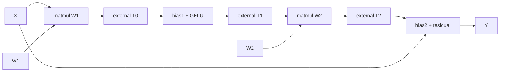
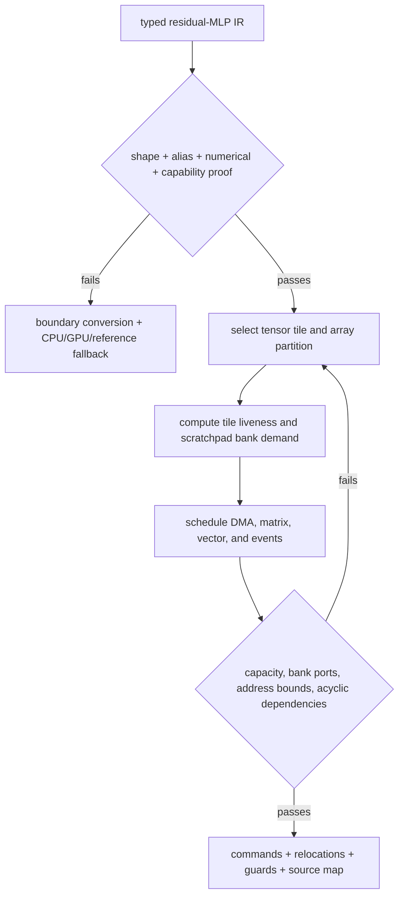
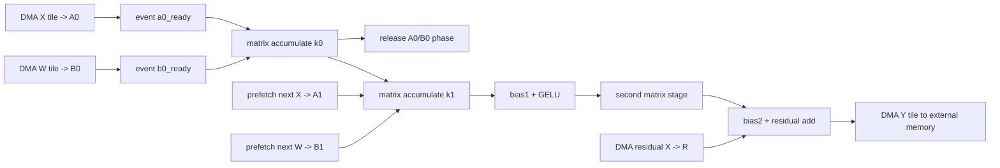

# NPU Compiler, Runtime, and Executable Implementation Blueprint

> **Abbreviation key:** neural processing unit (NPU); artificial intelligence (AI); intermediate representation (IR); direct memory access (DMA); input-output memory management unit (IOMMU); central processing unit (CPU); graphics processing unit (GPU); application programming interface (API).

## 0. Purpose and design ideology

This chapter reconstructs an NPU software stack from framework import through a versioned executable and protected runtime submission. The design ideology is **move dynamic decisions into a compiler only when their assumptions are representable and validated; retain explicit runtime state for everything that remains dynamic**. A highly scheduled NPU reduces hardware control but increases compiler proof, artifact compatibility, and fallback obligations.

Read [AI Workload and Graph Mapping](01_AI_Workload_and_Graph_Mapping_to_NPUs.md) for mapping theory and [NPU Graph-Compiler and Array Blueprint](../06_Implementation_Blueprints/01_Graph_Compiler_and_Execution_Array_Implementation_Blueprint.md) for target command/array contracts.

## 1. Stack components and ownership

~~~mermaid
flowchart LR
    FW["framework model + parameters"] --> IMP["importer + semantic validator"]
    IMP --> IR["typed tensor/graph IR"]
    IR --> PART["capability partition + fallback"]
    PART --> OPT["precision / fusion / layout / tile / schedule"]
    OPT --> MEM["buffer lifetime + DMA/event plan"]
    MEM --> EXE["versioned NPU executable"]
    EXE --> RT["runtime: contexts / queues / memory / events"]
    RT --> NPU["firmware + device commands"]
    PART --> HOST["CPU/GPU fallback runtime"]
~~~

Importer owns semantic equivalence. Capability database owns legal target operations/limits. Compiler owns partition/transforms/schedule. Packager owns executable identity. Runtime owns live contexts, tensors, commands, dependencies, and faults. Driver/firmware owns queue consumption and device recovery. Fallback coordinator owns cross-device transfer and ordering.

## 2. Capability and IR schema

The capability database is versioned with hardware/firmware. For every operation it describes supported ranks/dimensions, layouts/strides/alignment, precisions and quantization schemes, sparsity, dynamic bounds, numerical behavior, fusion patterns, memory limits, and command features. Compiler and runtime reject mismatch rather than approximate.

IR values store symbolic/static shape, bounds/constraints, type/accumulator/quantization, logical and physical layout, memory space, alignment, alias/lifetime, mutability, placement/sharding, and source identity. Operations store semantics, side effects, control dependencies, numerical order, randomness, fallback eligibility, and quality attributes.

Dynamic shapes use bounded symbols and guards. Control flow can be statically unrolled, represented as target loops/predicates when supported, dispatched among compiled regions, or executed as host fallback. State which values cross boundaries and how device/host visibility is established.

## 3. Partition and fallback contract

Partitioning builds maximal or cost-effective NPU regions while considering transfers, conversions, synchronization, and fallback frequency—not merely operator support. A boundary record includes source/target devices, tensor schema/layout/precision, ownership, conversion, transfer method, dependency event, fault propagation, and expected cost.

Fallback correctness requires the CPU/GPU implementation to match declared numerical semantics and consume the same versioned state. A dynamic fallback in the middle of a stateful decode must either preserve/convert KV and random state or reject the plan; recomputing one operator is not enough when layouts or quantization differ.

## 4. Compiler pass pipeline

1. import and validate graph/tensor artifacts;
2. infer shapes/types/layouts/aliases and constant values;
3. canonicalize/decompose into the target semantic core;
4. partition NPU and fallback regions with boundary costs;
5. calibrate/select precision, quantization, sparsity, and conversions;
6. fuse under numerical, shape, liveness, and resource legality;
7. select layouts and lower operators to tensor/vector/reduction primitives;
8. choose tiles, dataflows, array partitioning, and multi-NPU sharding;
9. allocate scratchpad/workspace using buffer lifetimes and bank constraints;
10. schedule DMA, compute, vector, reduction, collective, and event dependencies;
11. validate address bounds/resource peaks/dependency acyclicity;
12. emit commands, constants/packed weights, relocation, profiles, diagnostics, and source map.

Each pass records before/after work, bytes by level, buffer peak, conversion/padding, array/vector utilization estimate, fallback nodes, and reason alternatives lost. A compiler without diagnostics prevents architecture research from separating mapping limits from hardware limits.

## 5. Executable package

An NPU executable contains format/target/firmware version, graph/plan identity, shape profiles and guards, command programs, weight/constant shards and layouts, relocation/symbol tables, buffer/lifetime/bank plan, DMA/event graph, precision/quantization metadata, parallel-group/topology requirements, workspace and queue bounds, entry points, fallback regions, profiling/source map, integrity/signature, and build manifest.

Executables are immutable. Runtime relocation fills approved addresses/context identifiers without rewriting semantics. Load-time validation checks versions, commands, resource bounds, memory ranges, dependencies, signatures, and model/quality identity before device admission.

Shape-profile dispatch chooses the narrowest compatible profile according to a policy. If none matches, options are bounded compilation, fallback, padding under legal semantics, or rejection. Record the chosen profile and guard result.

## 6. Runtime API and state

Public/runtime interfaces cover device discovery/capabilities, context creation, executable load/unload, memory allocation/import/export, tensor binding, command/request submission, events, synchronization, cancellation, faults, profiling, and reset.

A context record stores tenant/process/address space, device/partition, executable references, memory quota, command/event namespace, security state, reset epoch, health, and error. An invocation stores executable/profile/entry, tensor bindings and generations, dynamic dimensions, workspace, dependencies, command queue, completion, cancel epoch, timestamps, and terminal result.

Buffer state includes device/host/tier, virtual address, extent/alignment, tensor layout, owner, readiness/last-use events, reference count, IOMMU mapping, and zeroization. Submission validates bindings against executable tensor schemas and guards; publishes descriptor/producer index after memory visibility; and completes only after output visibility.

## 7. Engine cache, packing, and model residency

The compiler/engine cache key includes source artifact, compiler options, capability/firmware, shape profiles, precision/quality, topology, and fallback library versions. Cached plans are revalidated on load. Weight packing keys include tensor hash, layout/quantization/shard version, target, and compiler pass.

Model residency states Registered → Validated → Compiling/Loading → Relocating → Warming → Ready → Draining → Unloaded, with Failed/Rollback. Reference counts pin an executable and weights while invocations/live state use them. Multiple versions coexist during rollout within capacity.

## 8. Cost model and design trade-offs

The cost model predicts compute waves/fill/drain, array edge/padding, vector/reduction work, scratchpad bank/port demand, DMA and external bytes/concurrency, event/command overhead, communication, and critical path/overlap. Calibrate by target and shape regime.

| Choice | Benefit | Cost/failure region |
|---|---|---|
| coarse scheduled commands | control efficiency | inflexible dynamic work |
| many shape profiles | utilization | compile/storage/validation explosion |
| padding to a profile | reuse plans | wasted work and possible mask semantics |
| aggressive fusion | traffic/launch reduction | scratchpad pressure and fallback granularity |
| static memory plan | predictable capacity | poor dynamic concurrency |
| host fallback | coverage | transfer/synchronization/layout and tail |
| runtime compilation | adaptability | cold latency and fleet reproducibility |

## 9. Worked construction: lower one residual multilayer perceptron region

Take the region

$$
Y=X+\mathrm{GELU}(XW_1+b_1)W_2+b_2,
$$

where GELU is the Gaussian error linear unit, `X` has a bounded token dimension, and weights are constant for a model version. This example is small enough to trace but exercises graph legality, weight packing, tiling, scratchpad allocation, DMA/compute overlap, vector activation, residual state, executable relocation, and runtime recovery.

### 9.1 Begin with one operator at a time

The minimum correct NPU partition emits a separate command region for the first matrix multiplication, bias, GELU, second matrix multiplication, second bias, and residual add. Intermediate tensors go to external memory because no cross-command liveness has been planned. It is slow but supplies a numerical oracle and a fallback.



Measure that baseline. If intermediate bytes and command gaps dominate, derive a requirement to retain live tiles in scratchpad and issue a coarse scheduled program. If the two matrix operations have incompatible tile shapes or the residual `X` cannot remain live within capacity, full fusion may lose; split at the least expensive materialization boundary. The compiler is selecting a liveness/data-movement plan, not merely combining operator names.

### 9.2 Make legality and physical layout explicit

For a chosen profile, shape analysis proves matrix dimensions, token bounds, broadcast rules, and edge masks. Quantization records input, packed-weight, product, accumulator, vector-function, and output types plus scale granularity and saturation/rounding. Alias analysis proves whether `Y` may reuse `X`; if it can, the plan must retain each residual tile until its final read before overwriting it.

Weights `W1/W2` are transformed from logical matrices into the target array's physical blocked layout. Padding values must be neutral for the operation, and the packer version, source tensor hash, quantization metadata, and target revision enter the cache key. A packed byte blob without these semantics is not a reusable weight.



The compiler's candidate object must be reproducible: tile sizes; loop/order; array partitions; scratchpad offsets, banks, and double-buffer phases; DMA strides/bursts; matrix/vector/reduction commands; event producer/consumer counts; edge predicates; expected operations and bytes; resource peaks; and rejection reason. A cost-model score without the selected schedule cannot be audited.

### 9.3 Exact command and buffer lifecycle for one output tile

Assume two scratchpad input buffers `A0/A1`, two packed-weight buffers `B0/B1`, accumulator `ACC`, vector temporary `V`, and residual tile `R`. The executable encodes dependencies such as:



Each buffer has `(allocation, generation, bank, offset, extent, producer_event, remaining_consumers, phase)`. A DMA descriptor has source/destination address and address-space identity, extents/strides, transfer size, burst/alignment, expected translation/fault behavior, completion event, and invocation epoch. A compute command names input phases, output phase, operation parameters, edge mask, and completion event. The event table stores produced/not-produced, remaining waiters, error/poison, and epoch.

```wavedrom
{ "signal": [
  { "name": "dma_A0_B0",  "wave": "01..0........" },
  { "name": "compute_k0", "wave": "0...1..0....." },
  { "name": "dma_A1_B1",  "wave": "0...1..0....." },
  { "name": "compute_k1", "wave": "0.......1..0." },
  { "name": "vector",     "wave": "0..........10" },
  { "name": "output_dma", "wave": "0...........1" }
] }
```

At cycle boundaries shown conceptually above, `compute_k0` may consume `A0/B0` only after both ready events. DMA may overwrite `A0/B0` for a later tile only after their consumer count reaches zero and the phase toggles. A single ready bit without a phase/generation has an ABA failure: a delayed waiter can mistake a later reuse for its original data. Double buffering therefore requires both storage and control state.

### 9.4 From executable bytes to a live invocation

At load time the runtime verifies target/firmware versions, signature/integrity, command opcodes and bounds, event graph, scratchpad peak, relocation types, and shape-profile guards. It allocates weight storage, installs packed shards, applies only approved relocations, and warms the executable before publishing model state `Ready`.

Invocation `I52` follows a precise path:

```mermaid
sequenceDiagram
    participant H as Host runtime
    participant Q as Submission queue
    participant F as Firmware scheduler
    participant D as DMA / IOMMU
    participant E as NPU engines
    H->>H: choose profile; validate X/Y bindings + generations
    H->>H: reserve workspace and invocation epoch
    H->>Q: write descriptor I52 and command-list pointer
    H->>Q: release-store producer index / ring doorbell
    Q->>F: consume descriptor after visibility check
    F->>D: issue first tile DMAs
    D-->>F: completion events or translation fault
    F->>E: issue ready matrix/vector commands
    E-->>F: command completion + counters
    F->>D: write output tiles
    D-->>F: output-visible completion
    F->>Q: terminal record(I52, epoch, status)
    Q-->>H: interrupt/poll; acquire completion; publish Y
```

The release/acquire operations in this trace are memory-ordering operations: the producer publishes a fully initialized descriptor before advancing the queue index, and the host reads a terminal record only after firmware makes output and status visible. A doorbell alone does not make stale cache lines coherent.

### 9.5 Failure and replay are designed per boundary

Inject a recoverable IOMMU page fault on the DMA for `A1`. Firmware marks that command `FaultWait`, stops consumers of its event, records the faulting address/access/context and invocation epoch, and allows only independent commands that cannot overwrite its live buffers. Software resolves the mapping and responds. The DMA reissues with the same logical command identity but a new transport attempt; the ready event is produced once. Denial or timeout poisons dependent events and completes `I52` once with failure.

A reset is coarser. It advances the context/device epoch, invalidates outstanding queue entries and buffer generations, and makes late completions from the old epoch non-authoritative. Replay begins from a declared checkpoint—normally the entire side-effect-free region using immutable inputs. It cannot restart at “the last matrix command” unless scratchpad contents, event phases, DMA effects, random state, and output visibility are all checkpointed. If a command has published a collective contribution or mutated shared serving state, recovery needs an upper-layer idempotence/transaction protocol.

Other failures derive distinct actions:

- guard mismatch before publication selects another profile/fallback or rejects without device work;
- command validation failure quarantines the executable rather than asking firmware to interpret it;
- scratchpad/event/resource shortage discovered at compile/load time reschedules or rejects, while runtime queue pressure backpressures admission;
- numerical validation failure disables the plan/precision combination and preserves diagnostic artifacts;
- device completion with wrong epoch or unknown command ID is logged and discarded, never matched by address alone.

### 9.6 PPA, losing cases, and evidence

Coarse static scheduling shrinks dynamic arbitration and instruction-fetch overhead, but moves complexity into event tables, DMA queues, scratchpad banking, firmware validation, compiler search, and executable variants. More scratchpad can remove external bytes yet lengthen wires/access, increase leakage, and reduce the number of replicated cores. More DMA channels expose memory parallelism but add descriptors, translation pressure, arbitration, and proof state. Aggressive profiles lose for rare dynamic shapes; fusion loses when live ranges spill or vector work blocks matrix progress; packing loses when a model is used too briefly to amortize conversion.

Trace `source node → IR/pass → region/profile → executable command → invocation/epoch → DMA/event → engine counters → terminal result`. Measure useful/padded operations, bytes by hierarchy, array/vector active and dependency-wait cycles, scratchpad bank conflicts, DMA queue/translation/fault time, event-table occupancy, profile/fallback choice, and compiler prediction error. Differentially compare the baseline and scheduled region across minimum/maximum/edge shapes, inject delays and faults at every event, randomize legal bank/queue backpressure, and assert conservation: every produced event is consumed exactly as planned, every live buffer has one current generation, no command reads before its producer, and every accepted invocation terminates once.

## 10. Invariants, validation, and build path

Invariants: every source node belongs to one compiled/fallback region; boundary tensors preserve semantic schema; executable commands/resources match capability; buffer lifetimes/banks do not conflict illegally; DMA/event graph is acyclic or has defined loops; invocation bindings satisfy profiles; context epochs reject stale completions; each invocation terminates once.

Compiler/runtime observability preserves model/source-node → IR operation/pass → partition/region → executable entry/command → invocation/event identity. Emit pass diagnostics, guards/profile selection, fallbacks, operations/bytes, predicted cycles and resource peaks, load/relocation, queue/event/DMA timing, device counters, and first failing command/buffer generation. The build manifest and effective configuration make those traces reproducible.

Validate adjacent IRs, compiler passes, target command functional model, executable parser/security, runtime memory/dependencies, fallback equivalence, dynamic guards, faults/cancellation, and device output. Build importer plus one static dense region; capability/partition and fallback; typed executable; runtime memory/queue/events; quantization/fusion; shape profiles; compiler cache; multi-NPU; bounded dynamic compilation.

The stack is reconstructable when compiler legality and diagnostics, executable bytes/metadata, runtime objects, binding/fault behavior, and fallback state are specified without “the NPU compiler handles it.”

---

← [NPU Performance/Compiler Research](03_Performance_Compiler_Profiling_and_Research_Methodology.md) · next → [NPU Serving Engine, Scheduler, and State](05_NPU_Serving_Engine_Scheduler_and_State_Implementation_Blueprint.md)
