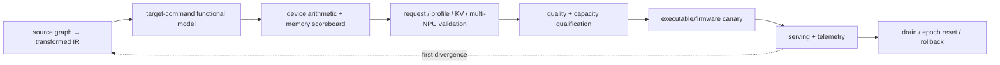

# NPU AI-Stack Verification, Operations, and Deployment Blueprint

> **Abbreviation key:** neural processing unit (NPU); artificial intelligence (AI); intermediate representation (IR); key-value (KV) cache; service-level objective (SLO); time to first token (TTFT); time per output token (TPOT); direct memory access (DMA); error-correcting code (ECC).

## 0. Purpose and design ideology

This chapter makes an NPU stack deployable and diagnosable. The design ideology is **treat compiler output as a safety-critical executable contract and validate the whole model-to-command chain**. NPU specialization increases the risk that an unsupported shape, stale capability description, numerical conversion, or buffer schedule escapes ordinary tests.

## 1. Compiler validation strategy

Validate importer, shape/type/layout inference, each rewrite/fusion, quantization, partition/fallback, tiling/dataflow, memory lifetime/bank assignment, DMA/event dependency, command emission, executable packaging, and load-time validation independently.

Use small exhaustive graphs and randomized bounded graphs. The reference stack includes framework, transformed-IR interpreter, target-command functional model, bit-accurate array/vector model, and runtime memory scoreboard. Compare adjacent layers to find the first divergence.

Coverage crosses operator/fusion × static/dynamic/edge shape × layout × precision/quantization/sparsity × target/capability × profile/guard × fallback × buffer pressure × device count × fault. Test unsupported cases for clean fallback/rejection, not only supported success.

## 2. Numerical and model-quality contract

For every target operation specify input/storage/compute/accumulator/output types, scaling, rounding, saturation/overflow, special values, reduction order, and deterministic boundary. Quantized calibration dataset/method, scales, clipping, and quality acceptance are versioned artifacts.

Test extrema, rounding ties, zero points/scales, accumulator overflow, sparse metadata, padding/masks, edge tiles, dynamic profile boundaries, reduction trees, and conversions at fallback boundaries. Evaluate end-model quality and task-specific slices; a small tensor tolerance can still cause unacceptable ranking/generation behavior.

## 3. Runtime, concurrency, and security tests

Randomize queues, events, DMA return order, buffer reuse, command completion, page faults, cancellation, context reset, executable unload, multiple profiles/tenants, and fallback delays. Inject malformed executable/descriptor/address/shape and verify validation contains it before unauthorized writes.

Security tests cover signatures/provenance, executable parser, context/IOMMU isolation, memory quotas, stale scratchpad/buffer zeroization, cross-tenant events/IDs, administrative/debug access, model confidentiality, and bounded compilation. Fuzz all binary/schema parsers.

## 4. System and serving validation

End-to-end scenarios cover cold load/compile/relocate/warm, shape buckets, continuous batches, KV allocation/prefix, output, cancellation, overload, device faults, collective failures, state transfer, model update, drain, and rollback. Compare single versus multi-NPU and NPU versus fallback/reference within contract.

Liveness tests fill every command/event/DMA/memory queue, delay the producer of a dependency, trigger translation/communication errors, and verify terminal completion/failure without leaks. A watchdog snapshot names oldest request/invocation/command/event/transfer and its missing dependency.

## 5. Telemetry and conservation

Propagate model/artifact/compiler/executable/profile/configuration, request, scheduler epoch, batch/slot, invocation, graph node, command, buffer generation, DMA/event, device/array, collective/transfer, sampling, and response identities.

Metrics include compile/pass/profile/cache and fallback; model load/relocation/warm; admission/queue/batch/padding; resource ledger; command/event/DMA queue; array/vector/reduction utilization; useful/padded/skipped operations; scratchpad/bank/external bytes; KV/prefix; collectives/transfers; faults/retries/cancel waste; TTFT/TPOT/goodput/quality; clocks/power/thermal/ECC.

Conservation: source nodes = compiled + named fallback coverage; executable commands = terminal + live; buffer bytes = allocated states; DMA issued = terminal + live; admitted requests = terminal + live; KV/token ranges agree with completed decode. Validate counter definitions against simulator/command traces.

## 6. Performance and capacity qualification

Build mechanism microbenchmarks, operator/profile sweeps, full graphs, and open-loop serving tests. Regimes include array compute, vector/reduction, local bank, DMA/external bandwidth, host command, fallback, collective, KV capacity, and scheduler/tail. Measure compile/load warm and steady paths separately.

Capacity envelopes state hardware/firmware/executable/config/model mix, input/output/shape distribution, SLO/quality, safe offered load, memory/KV, power, and failure headroom. Include rare shapes/fallbacks because their tails can dominate.

Physical or firmware changes invalidate capability and timing calibration. Qualify a new target through commands/counters, then operators, graphs, and serving before promotion.

## 7. Release and compatibility bundle

Bundle model/tokenizer, source graph, compiler and capability database, executable/profile/guards, weights/quantization, runtime/driver/firmware requirements, topology, configuration schema, quality/performance evidence, signatures/provenance, state-layout versions, and rollback predecessor.

Startup validates device identity/health/ECC, firmware/capability, executable signature/target/resources, memory, runtime APIs, collectives, smoke commands, numerical reference, and warm graph. Readiness reflects the exact model/profile path.

Compatibility crosses graph/IR, compiler passes, executable format/commands, capability/firmware, weight/KV layout, runtime, device revision, collective topology, and fallback libraries. Refuse ambiguous combinations.

## 8. Rollout and recovery state machine

Registered → Compiled/Validated → Staged → Loading/Relocating → Warming → Canary → Serving → Draining → Retired. Each transition has timeout, evidence, cleanup, and rollback. Canary samples supported profiles, rare shapes/fallbacks, quality, errors, and SLO goodput.

Existing requests remain on compatible executable/state. Drain stops admission, completes/cancels/migrates under policy, waits for command/DMA/event quiescence, frees KV/buffers, then unloads. A firmware reset changes epoch and invalidates old completions.

Rollback can reuse live state only when model, tokenizer, precision, sharding, and KV layout are compatible or a validated converter commits ownership. Otherwise keep old workers until drain or fail requests explicitly.

## 9. Incident and fleet operations

Alert on compile/profile/fallback anomalies, load/readiness, queue/deadline, resource leaks, command/event/DMA age, utilization/bytes deviation, KV, device/ECC/reset, collectives/transfers, quality drift, and SLO. Snapshot immutable identities, oldest state, resource ledger, device queues/events, buffer/KV ownership, counters, topology, recent rollout, and safe reproducer.

Mitigate with admission/load shedding, profile/kernel/executable disable, reduced concurrency, stop prefill, route/fallback, drain/reset epoch, or rollback. Automatic fallback is visible because it may change performance/quality. Recovery validates the complete path before readiness.

## 10. Trade-offs, invariants, and operational bring-up

| Choice | Gain | Cost |
|---|---|---|
| exhaustive target variants | coverage/performance | compiler/test/release matrix |
| strict profile rejection | predictable correctness | lower availability for rare shapes |
| automatic fallback | coverage/availability | tail and semantic/layout risk |
| live state migration | maintenance/failover | conversion and ownership protocol |
| rich command trace | diagnosis | bandwidth/security |

Operational invariants: every executable matches capability/firmware; every response names model/executable/profile/config; compiler transformations and fallback cover the source graph once; live state has one authority; no old epoch publishes; rollout/rollback preserve semantics or explicitly terminate; work/state/telemetry conserve; readiness means end-to-end validated execution.

Bring up offline compiler/reference, device command smoke, one operator/profile, full graph, concurrent runtime, serving/KV, multi-NPU/faults, and canary/drain/rollback. The stack is reconstructable when another team can implement the compiler/runtime contracts, qualify numerical quality and capacity, safely deploy target executables, and diagnose failures to their first semantic or resource divergence.

---

← [NPU Serving Engine](05_NPU_Serving_Engine_Scheduler_and_State_Implementation_Blueprint.md) · [NPU AI Index](00_Index.md)
