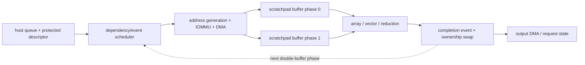
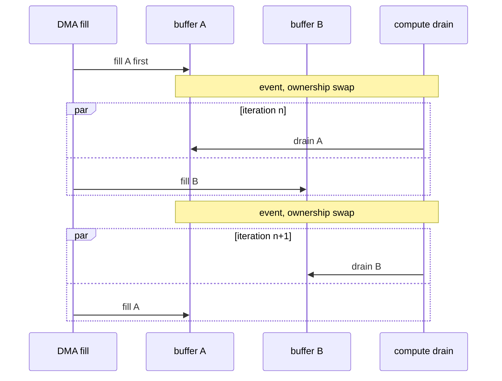

# NPU Scratchpad, DMA, Runtime, and Serving Implementation Blueprint

> **Abbreviation key:** neural processing unit (NPU); artificial intelligence (AI); direct memory access (DMA); static random-access memory (SRAM); network on chip (NoC); input-output memory management unit (IOMMU); key-value (KV) cache; mixture of experts (MoE); service-level objective (SLO).

## 0. Purpose and design ideology

The NPU array is useful only when tensors arrive before compute needs them, remain in the right local banks, and leave without overwriting live data. The surrounding machine therefore implements a distributed producer-consumer schedule. Its design ideology is **explicit lifetime, decoupled movement, and bounded dynamism**: make regular dependencies static, represent unavoidable dynamic conditions as events/queues, and keep ownership visible.

## 1. Scratchpad interface, contract, and allocation

A scratchpad is explicitly addressed on-chip SRAM, not a hardware-replaced cache. Define capacity, bank count/width/depth, access ports, alignment, error correction, address interleave, arbitration, read/write latency, and which agents may access it. Partition address space into protected contexts or validate every descriptor against assigned ranges.

Represent each allocated buffer with base, byte extent, logical shape/layout, bank mapping, element type, owner context, producer event, consumer count, phase/generation, and error/poison. Allocation lifetime begins before the first producer writes and ends only after the last consumer and outstanding DMA access complete. Aliasing is legal only when the compiler proves lifetimes do not overlap or specifies in-place semantics.

For double buffering, phase 0 is filled while phase 1 computes/drains, then ownership swaps after events. A phase bit or generation travels with commands; otherwise a delayed completion from the previous iteration can release the wrong buffer. The value of the scheme is the *overlap*: one buffer is drained by compute while the other is filled by DMA, and the roles alternate every iteration, so fill latency hides behind the previous drain.

Bank mapping should distribute the exact scheduled access vectors. If $p$ consumers each request $w$ bytes/cycle, raw demand is $pw$. Bank bandwidth must cover the worst legal simultaneous pattern or the schedule must include conflict cycles. Padding changes mapping but consumes capacity; compiler cost includes both.

## 2. Descriptor DMA engine

Direct memory access (DMA) moves data without per-word CPU instructions. A reconstructable DMA has:

- command fetch/validation queue;
- multidimensional address generators;
- translation/protection requester;
- request segmentation/alignment engine;
- outstanding-transaction table;
- data pack/unpack, conversion, or compression path;
- scratchpad arbitration endpoint;
- completion/event and fault recorder.

A descriptor stores source/destination base and space, dimensions, extents, source/destination strides, element and transaction sizes, gather/scatter metadata if supported, conversion/compression, context, dependency events, completion event, priority, and fault policy. Calculate the last address with checked arithmetic before issuing; integer overflow is a protection failure.

The outstanding table records descriptor, sub-transaction index, address/byte mask, destination buffer/offset/phase, fabric ID/generation, returned bytes, retry, and error. Arbitrarily ordered returns are placed by identity, not arrival order. Completion fires only after all destination writes are accepted and visible to the consumer scope.

DMA throughput is bounded by

$$B_{DMA}\le\min(B_{source},B_{fabric},B_{destination},N_{out}S/L),$$

where $N_{out}$ is outstanding transactions, $S$ average bytes/transaction, and $L$ round-trip time. At 64 outstanding, 128 bytes, and 200 ns, the concurrency bound is 40.96 GB/s. To reach 100 GB/s at the same latency/size requires at least about 157 live transactions, before burst and partition effects.

## 3. Event and command scheduler

An event table stores event ID/generation, expected producer count, arrived count/mask, error, and waiting command list. A command becomes ready only when all dependency events match the expected generation and resources are reservable. Allocation of output buffers, array slot, DMA entry, and completion event should be atomic or rollback-safe.

The scheduler state for each command includes validated descriptor pointer, dependencies, priority/deadline, age, resource needs, issued sub-engines, completion mask, fault/cancel state, and profiling tag. Arbitration may be static order, oldest-ready, priority/deadline, or fairness weighted. State starvation limits.

Static schedules minimize control and are ideal for fixed shapes. Dynamic readiness handles variable latency, sparse work, cache/memory interference, and multi-request serving. A hybrid compiles static command groups but allows event-driven group admission.

Progress requires an acyclic resource dependency or reserved escape capacity. Do not let every command reserve output space while waiting for input transfers whose completion requires that same output port. A compile-time dependency-cycle check catches graph cycles; hardware timeouts/watchdogs catch missing events and fabric failures.

## 4. Host queue, virtual memory, and isolation

The host creates a context, maps model/activation buffers, uploads a versioned executable, and writes submission descriptors to a queue. Publishing the producer index or ringing a doorbell occurs after a memory-ordering barrier. The NPU validates context, executable version, addresses, bounds, resources, and dependencies before admission.

An input-output memory management unit (IOMMU) translates device virtual addresses and enforces access permissions. Specify process/context identifiers, page sizes, translation-cache invalidation, page faults, replay, and whether faults are recoverable. Retain enough descriptor/sub-transaction state to retry after the host resolves a page fault. If retry is unsupported, fail the command without making later dependent work visible.

Context reset uses an epoch: stop new admission, cancel or drain accepted commands, quiesce DMA, discard late responses with old epochs, clear events/buffers, report terminal status, then reuse identifiers. Security requires zeroing or ownership transfer for scratchpad contents before another context can read them.

## 5. Dynamic AI work

### 5.1 Transformer prefill and decode

Prefill processes many input tokens and presents large matrix operations with reuse. Decode produces one or a few tokens per sequence: matrix dimensions become narrow, key-value (KV) cache reads grow with sequence length, and service batching determines array utilization. The runtime should classify phases and select different tiles/concurrency.

Paged KV storage represents logical token blocks by page/block identifiers and a mapping table. A descriptor needs sequence identity, head/layer range, logical token interval, page-list address/version, layout/precision, and causal mask. Mapping changes require generation/version protection. Prefetch can stage page lists and KV blocks but must not evict live compute tiles.

### 5.2 Mixture of experts and sparsity

Mixture-of-experts routing creates variable token counts per expert. The runtime counts/routes tokens, packs expert batches, schedules available weights/arrays, and later unpacks results. Load imbalance, network/memory movement, and expert-weight capacity dominate. Admission policy can group requests for reuse but increases tail latency.

Dynamic sparsity similarly produces variable nonzero work. Bound descriptor/output capacity before launch or support overflow/retry. Do not reserve resources based only on average sparsity.

## 6. Serving scheduler and capacity model

A request state record contains model/version, input location, arrival/deadline, prompt/decode state, sampling parameters, KV allocation/page table, current layer/token, assigned device/context, dependencies, output queue, cancel/fault, and accounting/profiling tags.

Admission checks memory/KV capacity, command/event entries, expected compute/memory demand, tenant quota, and service-level objective (SLO). Continuous batching adds/removes sequences at decode iterations. The batch descriptor maps logical sequences to slots and masks completed/canceled lanes.

For arrival rate $\lambda$ requests/s and mean system time $W$, Little’s law gives average in-flight requests $L=\lambda W$. Capacity planning uses tail distributions and memory per request, not only the mean. KV bytes for a simplified decoder are proportional to layers $N_L$, tokens $T$, KV heads $H_{KV}$, head dimension $D$, two tensors K/V, and bytes/element $b$:

$$S_{KV}=2N_LTH_{KV}Db.$$

Add page fragmentation, metadata, and replication. This can limit concurrency before compute.

End-to-end latency decomposes into admission queue, preprocessing/transfer, command launch, prefill, per-token decode, sampling/communication, and output. Time to first token includes all stages through first decode; time per output token is the steady decode cadence. State exact boundaries.

## 7. Scheduling trade-offs

| Policy | Gain | Cost/failure region |
|---|---|---|
| largest batch | array efficiency | queue/tail latency and KV capacity |
| deadline-first | SLO protection | fragmentation and lower aggregate reuse |
| weight/model affinity | fewer weight loads | tenant fairness and hot-device imbalance |
| static scratchpad plan | minimal control | dynamic shapes need variants/fallback |
| dynamic allocator | flexibility/concurrency | fragmentation, metadata, nondeterminism |
| many DMA transactions | latency hiding | NoC/HBM congestion and state area |
| aggressive prefetch | overlap | wrong-path bandwidth and capacity pollution |

The chosen ideology should be stated by product: offline throughput, interactive tail latency, edge energy, or multi-tenant isolation lead to different answers.

## 8. Verification, invariants, and observability

The central ownership invariants are: a buffer has at most one active producer phase; a consumer starts only after the matching producer event is visible; a physical range cannot be allocated to overlapping live generations unless in-place semantics were proven; a DMA response writes only the destination generation recorded at issue; each accepted command reaches exactly one terminal state; and a reset/cancel epoch prevents all older completions from changing current state.

Assertions implement those invariants and also check outstanding-ID uniqueness, bounded descriptor address arithmetic, credit conservation, and eventual terminal state under fair service.

Directed tests cover multidimensional stride edges, unaligned head/tail, page crossing/fault/retry, out-of-order returns, partial errors, event wrap, double-buffer phase races, full queues, cancellation during DMA/compute, context reset, malformed descriptors, scratchpad ECC, dynamic sparse overflow, and KV page remap during queued work.

Expose useful/physical bytes by level, DMA queue and latency distributions, translation walks, scratchpad bank conflicts, buffer occupancy/fragmentation, command ready-versus-resource-stalled time, array/vector utilization, event wait, overlap efficiency, per-request phase time, KV capacity, batch composition, deadline misses, cancel waste, and error/retry counts.

## 9. Staged build

1. Statically assigned scratchpad and one synchronous copy/compute/copy sequence.
2. Versioned transfer/compute descriptors with bounds validation.
3. Multiple outstanding DMA transactions and deterministic event dependencies.
4. Double buffering and overlap with ownership assertions.
5. Host queues, IOMMU protection, faults, and reset epochs.
6. Multiple commands/contexts with fairness and admission controls.
7. Dynamic shapes, KV paging, continuous batching, and sparse/MoE work.

The layer is reconstructable when a tensor byte has an unambiguous owner and address from host memory through DMA, scratchpad phase, compute, and completion—and when every dynamic wait, fault, cancellation, and capacity limit is represented in state.

---

← [Compiler and Array Blueprint](01_Graph_Compiler_and_Execution_Array_Implementation_Blueprint.md) · next → [NPU Verification, Performance, and Bring-up](03_NPU_Verification_Performance_and_Bringup_Blueprint.md)
