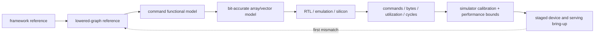
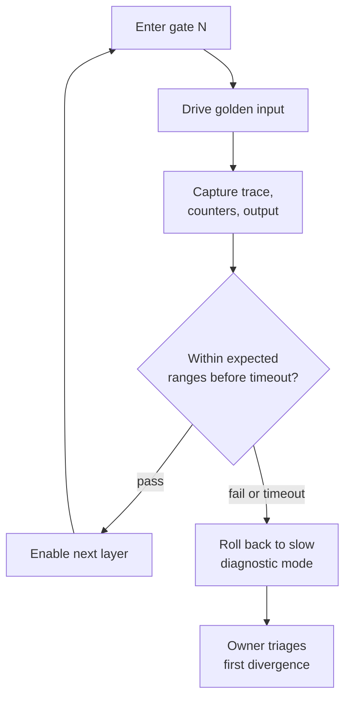

# NPU Verification, Performance, and Bring-up Blueprint

> **Abbreviation key:** neural processing unit (NPU); register-transfer level (RTL); direct memory access (DMA); network on chip (NoC); power, performance, and area (PPA); error-correcting code (ECC); key-value (KV) cache; mixture of experts (MoE); service-level objective (SLO); tera operations per second per watt (TOPS/W).

## 0. Purpose

An NPU can return numerically plausible tensors while using the wrong graph, wrong quantization scale, wrong buffer version, or an unsustainable amount of bandwidth. Verification must therefore cover four kinds of correctness at once: graph semantics, numerical semantics, command/memory safety, and cycle/resource behavior. Bring-up must preserve the same identities and reference models so the first failing layer is observable.

The design ideology is **validate transformations before timing and validate intermediate work before final speed**. A fast final answer is evidence only after operations, values, bytes, and events are known to be the intended ones.

## 1. Reference-model stack

Maintain distinct references rather than one monolith:

1. **Framework/graph reference:** evaluates original operators in high precision or specified framework semantics.
2. **Lowered-graph reference:** evaluates canonicalized, fused, quantized, and decomposed operations, exposing divergence introduced by compilation.
3. **Command functional model:** executes exact target descriptors, layouts, masks, and numerical modes without timing.
4. **Array/RTL numerical model:** bit-accurate PE, accumulator, vector, reduction, conversion, sparsity, and edge behavior.
5. **Memory/transaction scoreboard:** tracks each byte/version through host memory, DMA, scratchpad, compute, and output.
6. **Timing/performance model:** assigns resource occupancy, contention, and timestamps without changing functional results.

Compare adjacent layers. If the framework and final hardware differ, adjacent comparison locates whether the error began in lowering, descriptor emission, memory movement, arithmetic, or timing/control. Store tensor hashes or sampled values at named graph/command boundaries, with full capture on first divergence.

## 2. Verification plan by contract

Across all subplans, preserve these invariants: the lowered graph accounts for every supported source operation or named fallback; compiler resource declarations equal hardware reservations; each buffer generation has a single legal producer and bounded consumers; every accepted command/transaction terminates once; canceled or faulted work cannot publish output; numerical modes are identical in command model and hardware; and raw event conservation holds before any performance metric is trusted.

### 2.1 Compiler legality

Property-test shape inference, layout conversion, fusion, quantization, tiling, buffer lifetime, and dependency generation. Generate small exhaustive tensors for edge cases and random bounded shapes for breadth. Check that each pass preserves its declared semantics and that unsupported cases fall back rather than miscompile.

Cross coverage includes operator × shape regime × layout × precision × dynamic bound × fusion × edge tile × sparsity. For numerical tolerance, define absolute/relative error, units-in-last-place where appropriate, distributional metrics, and end-model quality. Do not choose tolerances after observing failures.

### 2.2 Arithmetic and array

Bit-exact tests cover zero, extrema, overflow, rounding ties, denormals, NaN/infinity if supported, saturation, signedness, quantization zero points/scales, accumulator drain, and reduction ordering. Array tests cross tile edge masks, dataflows, stalls at legal boundaries, simultaneous vector/tensor activity, sparsity metadata, and error injection.

### 2.3 Commands, DMA, and protection

Constrained-random command graphs exercise valid and invalid dependencies, buffer aliases, generations, maximum extents, arithmetic overflow, unaligned boundaries, translation faults, out-of-order returns, retry, poison, cancellation, reset, and queue wrap. A security scoreboard confirms no context can access stale scratchpad or foreign virtual memory.

### 2.4 Liveness

Safety says nothing bad occurs; liveness says accepted work eventually terminates. Model or assert resource-dependency ordering, reserved response capacity, fair arbitration, event production, and watchdog/timeout behavior. Stress every queue full simultaneously and inject a delayed response at each protocol channel.

## 3. Simulator reconstruction and result chain

A detailed NPU simulator consumes the exact compiled executable and descriptors when possible:

1. capture model/weights/input and compiler/runtime versions;
2. lower graph and record chosen operations, shapes, layouts, precisions, tiles, dataflows, buffer plan, and dependency directed acyclic graph;
3. instantiate host queues, address spaces, scratchpad banks, DMA engines, command scheduler, arrays, vector/reduction units, NoC/cache/memory, and optional multi-NPU links;
4. admit commands only when dependencies/resources permit;
5. generate DMA sub-transactions and schedule translation, NoC, memory, bank, and return events;
6. reserve the array for a calculated wave schedule and generate accumulator/vector/drain events;
7. update buffer ownership/events at modeled visibility points;
8. aggregate raw timestamps, bytes, operations, occupancies, stalls, energy events, and request phases;
9. compare functional outputs to the command model and intermediate counters to RTL/hardware.

Event identity includes context, request, graph node, command, tile, buffer generation, DMA sub-transaction, and array wave. Without this chain, a final cycle count cannot explain a bottleneck.

For command $i$, decompose latency:

$$T_i=T_{ready\ wait}+T_{resource\ wait}+T_{transfer}+T_{compute}+T_{drain}+T_{sync},$$

then identify overlap rather than summing blindly. The critical path through the command dependency graph determines request latency; total work divided by resource capacity bounds throughput.

## 4. Analytical bounds and performance counters

For each operator/tile, calculate:

- required operations and useful bytes by memory level;
- array shape utilization and pipeline fill/drain;
- local bank bandwidth and conflicts;
- DMA outstanding-concurrency bound;
- NoC/external-memory bandwidth and partition balance;
- vector/reduction time;
- dependency critical path and available overlap.

The roofline bound is $P\le\min(P_{peak},I B)$, with arithmetic intensity $I$ at the stated memory boundary and delivered bandwidth $B$. For scratchpad-managed accelerators, use a multilevel roofline because host/HBM, shared cache, scratchpad, and array networks can each be active bounds.

Counters must allow the model to be recomputed: valid operations versus padded/masked/skipped, array active/idle by reason, vector/reduction use, useful and physical bytes, DMA occupancy/latency, bank conflicts, translation walks, NoC/memory queue time, command dependency/resource wait, buffer fragmentation, and fault/retry. Serving adds queue delay, batch size, prefill/decode phase, KV bytes/pages, time to first token, time per output token, deadline misses, and cancellation waste.

## 5. Calibration and uncertainty

Calibrate from small mechanisms upward:

1. array initiation, latency, fill/drain, and edge utilization;
2. scratchpad bank/port timing;
3. DMA request formation and concurrency;
4. NoC/cache/memory latency and bandwidth distributions;
5. command/event overhead;
6. compiled operators;
7. graphs and serving traces.

Match multiple observables, reserve holdout shapes/models, and report error by regime—large dense, small/narrow, bandwidth-bound, dynamic/sparse—not one aggregate. Sensitivity analysis varies uncertain latencies, traffic, sparsity, and compiler decisions. If a design ranking changes within plausible error, the simulator cannot support that decision.

## 6. PPA closure and co-design loop

Maintain per-layer budgets for array arithmetic, accumulator SRAM, scratchpad, DMA/translation, command/event control, NoC, clocking, and physical interfaces. Estimate dynamic energy per useful operation, per local SRAM access, per NoC hop, and per external byte; integrate leakage over workload time.

Physical consequences feed the compiler:

- partitioned scratchpad changes legal bank layouts and transfer schedules;
- pipelined array distribution changes fill/drain and dependency latency;
- narrower accumulator bandwidth changes drain overlap;
- distributed arrays change tile placement and reduction traffic;
- frequency/voltage domains add crossings and wake latency;
- thermal/power caps change sustained, not peak, throughput.

Compare energy per *useful* operation. Padding, low utilization, retries, and fallback work consume energy but not model operations. A larger array can have better nominal TOPS/W and worse workload energy.

## 7. Research experiment contract

An architecture study must publish:

- model and input/shape distribution, including dynamic/sparsity traces;
- numerical precision and accuracy/quality result;
- compiler passes, search space, cost model, and tuning budget;
- hardware configuration, clocks, memory topology, and capacity;
- baseline with comparable software optimization;
- warm-up, region of interest, repetitions, seeds, and uncertainty;
- intermediate operations/bytes/utilization/stalls;
- simulator calibration/validation and error boundary;
- ablations that isolate the proposed mechanism;
- cases where the mechanism loses.

Avoid giving a new architecture an exhaustive autotuning budget while using default baseline mappings. Separate benefits from more arithmetic, more memory, a better compiler, and the proposed policy.

## 8. Bring-up gates

Design observability includes descriptor trace, command/event state, buffer ownership/generation, DMA sub-transactions, translation faults, scratchpad error state, array wave/precision/mask, tensor hashes, performance counters, watchdog oldest command, and feature-disable controls.

Enable in this order:

1. power, clock, reset, debug, identity, SRAM self-test/repair;
2. host queue and one no-op/completion descriptor;
3. bounded DMA copy with known patterns and error injection;
4. scratchpad access/ECC and one fixed matrix operation;
5. edge tiles, precisions, vector/reduction, and bit-accurate checks;
6. events, double buffering, and overlapped command graphs;
7. translation/fault/replay, context reset, and isolation;
8. compiler-generated operators, then full graphs;
9. dynamic batching, KV paging, sparsity/MoE, and multi-NPU links;
10. voltage/frequency/temperature characterization and long service stress.

Each gate has a golden input/output, expected trace/counter ranges, timeout, rollback mode, and owner. Preserve a slow diagnostic mode with one outstanding command/transaction and disabled overlap.

Every gate runs the same monotonic loop: a layer is enabled only after the one below it passes, and any failure or timeout rolls back to the diagnostic mode instead of advancing, so the first failing layer stays isolated and observable.

## 9. Failure triage

For wrong output, find the first mismatching named tensor/tile and compare compiler IR, descriptor, source bytes, buffer generation, array inputs, accumulator, and conversion. For a hang, inspect the oldest command, missing dependency event, allocated resources, oldest DMA, credits, bank ownership, and reset/power epochs. For low performance, compare actual operations/bytes and each latency component to the model before changing hardware.

The reproducibility packet contains model/executable hashes, descriptors, inputs, context/configuration, first divergence, command/event/buffer snapshot, transaction log, seed, simulator/hardware version, voltage/frequency/temperature, and whether the failure survives diagnostic serialization.

## 10. Completion checklist

An NPU implementation is review-ready when adjacent reference models localize errors, command/data ownership is provable, every reported performance result can be reconstructed from raw work and resource time, the compiler cost model reflects physical constraints, error bars cannot reverse the claimed conclusion unnoticed, and bring-up can enable each layer independently.

---

← [Runtime and Serving Blueprint](02_Scratchpad_DMA_Runtime_and_Serving_Implementation_Blueprint.md) · [NPU Blueprint Index](00_Index.md)
