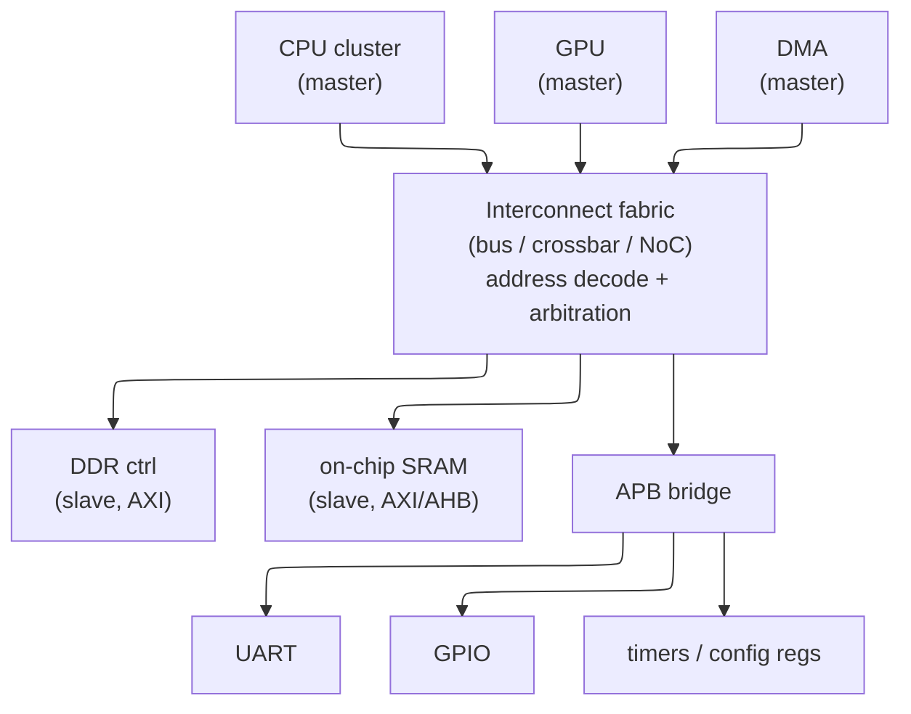
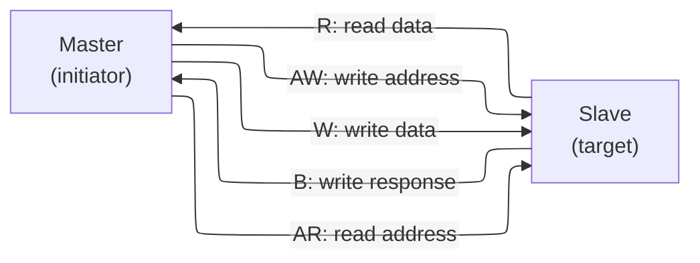

# On-Chip Interconnect — AXI, AHB, APB as a Composition Contract

> **Prerequisites:** [CPU_Architecture](../02_CPU/01_CPU_Architecture.md) (pipelining, stalls, the handshake discipline), [OoO_Execution](../02_CPU/03_OoO_Execution.md) (outstanding transactions, MLP, latency hiding — the same idea applied to a wire).
> **Hands off to:** [ACE_and_CHI](02_ACE_and_CHI.md) (coherence riding on AXI's channels), [Network_on_Chip](03_Network_on_Chip.md) (the packet fabric that replaces the crossbar at scale), [DDR_Controller](../03_Memory/04_DDR_Controller.md) (the memory the widest AXI port feeds), [Async_Design_and_CDC](../../03_Frontend_RTL_and_Verification/06_Async_Design_and_CDC.md) (the metastability/FIFO physics behind CDC bridges).

---

## 0. Why this page exists

A modern SoC is not one design — it is *dozens to hundreds of independently designed IP blocks* (CPU clusters, GPU, NPU, DMA engines, DDR controller, display, USB, UART, GPIO…) that must exchange data without any two teams having read each other's RTL. The single idea that makes this possible is a **standardized on-chip interconnect protocol**: a fixed contract at each block's boundary so that the block can be designed, verified, and reused **without knowing what is on the other side or what fabric sits between**. AMBA (AXI/AHB/APB) is that contract, and everything on this page is a consequence of it.

This is a concept page, not a signal dictionary. Instead of listing `AWADDR`, `AWLEN`, `AWSIZE`… we ask the questions that generate them: *why does a standard interconnect exist at all* (§1); *why is the valid/ready handshake the universal flow-control primitive and not a fixed-timing contract* (§2); *why does high-throughput communication force AXI's five independent channels* (§3); *why do outstanding, ID-tagged, out-of-order transactions hide latency* — the bus analog of pipelining and memory-level parallelism (§4); *why bursts exist* (§5); and *why there is a three-tier family* — AXI, AHB, APB — rather than one protocol (§6, the central bandwidth-vs-complexity-vs-power trade). Topology (§7), bridges and clock-domain crossing (§8), and the policy sidebands (§9) then fall out. Signal tables, burst-encoding arithmetic, waveform cycle-dumps, and exclusive/atomic mechanics are deliberately cut; their *ideas* survive in the concept treatment. By the end you should be able to reason about a fabric quantitatively — size outstanding depth from Little's law, predict burst efficiency, and pick the right tier for a block — rather than recite port names.

---

## 1. The problem a standard interconnect solves: composing IP

Start from the pain a standard removes. Suppose $N$ blocks must talk and each pair uses a bespoke point-to-point interface. The wiring, the adapters, and the verification all grow as the number of pairs:

$$
\text{bespoke interfaces} \;\sim\; \binom{N}{2} \;=\; O(N^2)
$$

Nothing is reusable — a block wired to its neighbours' private conventions cannot be lifted into another SoC — and every new block re-opens the integration of every old one. A **standard interface** collapses this: each block speaks *one* protocol to a shared fabric, so integration cost is $O(N)$ and the fabric absorbs the cross-product. That is the whole value proposition, and it buys three separable things:

- **Reuse / composition.** A block that presents a spec-compliant AXI port drops into any AXI system — across SoCs, across vendors, across process nodes — because its contract is the protocol, not a neighbour.
- **Separation of concerns (independent verification).** Because the boundary is a published spec, a block is verified against *protocol Verification IP* (VIP), not against the rest of the chip. The same UVM environment and register model check it in isolation ([UVM_Methodology](../../03_Frontend_RTL_and_Verification/10_UVM_Methodology.md)).
- **A swappable fabric.** The transport between blocks — shared bus, crossbar, or NoC — becomes a *separate design problem* (§7). You can replace a crossbar with a mesh without touching a single endpoint, because endpoints only ever saw the protocol.

The abstraction that makes this work is **memory-mapped, master/slave transactions**: every block is reachable at an address, a *master* (initiator: CPU, DMA, GPU) issues read/write transactions, a *slave* (target: memory, register block) responds, and an *address* is the one universal namespace. AXI, AHB, and APB are three points on a trade surface (§6) that all share this abstraction — which is exactly why they bridge cleanly into one another (§8).

The picture already contains §6's answer: the CPU→DDR path wants maximum bandwidth (AXI), the leaf peripherals want minimum area/power (APB behind one bridge). One chip, three tiers, because the requirements differ per edge.

---

## 2. The valid/ready handshake: flow control as *whether*, not *when*

Before any channel structure, one primitive underlies all of AMBA (and most on-chip streaming interfaces): the **VALID/READY handshake**. A transfer happens on a rising clock edge **iff both `VALID` (source has data) and `READY` (sink can accept) are high**. That is the entire mechanism. Its importance is easiest to see by asking what the naive alternative costs.

**Why not a fixed-timing contract?** The obvious protocol is a *timing contract*: "master asserts request in cycle 0; slave guarantees data in cycle $N$." It works for exactly one slave. It fails the moment you have:

- **Variable latency.** A cache hit and a DRAM miss differ by 100× ; a fixed $N$ cannot describe both. Real slaves have data-dependent latency.
- **Heterogeneous speeds.** The same interface must serve a 1-cycle SRAM and an off-chip flash. A single $N$ over-serves one and breaks the other.
- **Buffering, pipelining, and CDC.** Insert a register stage on a long wire and every $N$ shifts — the contract breaks. You cannot close timing on a fabric, or cross a clock domain, under a fixed-latency promise.

VALID/READY replaces **when** with **whether**: the data moves on *any* cycle both sides agree, and latency becomes a *runtime* property rather than a *protocol constant*. This single move is what makes the fabric **elastic** — an arbitrary number of buffer/register stages can be inserted transparently, because each stage just re-handshakes. Backpressure and clock-domain crossing (§8) are then free consequences, not bolt-ons.

**The one asymmetry rule — and why it prevents deadlock.** The handshake is symmetric except for a single constraint:

- **`VALID` must not depend on `READY`.** The source commits — it raises `VALID` when it has data, regardless of the sink.
- **`READY` *may* depend on `VALID`.** The sink is allowed to look before it leaps.

If *both* sides waited for the other ("I'll assert VALID once I see READY" / "I'll assert READY once I see VALID"), neither ever moves — a circular wait, i.e. deadlock. Breaking the symmetry on one side is the minimal fix, and it is why the spec fixes the *source* as the committing party. The companion rule — once `VALID` is asserted, the source holds it and the payload stable until the handshake completes — is what lets the sink take its time without the data evaporating.

**Backpressure.** `READY` low is the sink saying *"not yet."* It propagates upstream: a stalled consumer deasserts `READY`, its producer's buffer fills and it deasserts *its* `READY`, and the stall ripples back to the origin with no data lost. This is the same producer/consumer discipline as a pipeline stall ([CPU_Architecture](../02_CPU/01_CPU_Architecture.md)) — a bus is just a very long, buffered pipeline.

**The elastic-buffer knee.** A `READY` that is combinational from `VALID` gives zero added latency but threads a timing path straight through the sink; registering `READY` breaks that path at the cost of a cycle. The canonical resolution is the **skid buffer / register slice**: a 2-entry elastic buffer that registers both directions *and* sustains full throughput (it absorbs exactly the one beat in flight when the downstream deasserts). Deasserting `READY` whenever your output is `VALID` is the naive half-throughput alternative — 50% duty under any stall. The register slice is the atom of every AXI pipeline stage and every CDC bridge (§8).

---

## 3. Why AXI is five independent channels

Now derive AXI's shape from what *high-throughput* communication requires. A memory transaction has two natural phases — **address** (where/how much) and **data** (the payload) — and two independent directions — **read** and **write**. If you carry all of that on one shared, arbitrated wire (the AHB model, §6), then address and data contend for the same cycles, and reads and writes serialize behind one another. Every one of those couplings is a throughput ceiling. AXI removes them by giving each concern its **own VALID/READY channel**:

| Channel | Carries | Direction | Exists because |
|---|---|---|---|
| **AW** — write address | address + attributes of a write | master → slave | the *where* of a write can be sent before its data |
| **W** — write data | the write payload (+ byte strobes) | master → slave | data flows independently of its address |
| **B** — write response | completion / error status | slave → master | the master learns a write finished without blocking data |
| **AR** — read address | address + attributes of a read | master → slave | reads issue independently of any write |
| **R** — read data | the read payload (+ status) | slave → master | responses stream back on their own channel |

Read this as *five concerns that have independent timing, so they get independent flow control*. The consequences are exactly the throughput wins:

- **Read/write are full-duplex.** A read and a write can be in flight in the same cycle; there is no bus-turnaround bubble between a read and a write as on a shared tri-state bus.
- **Address runs ahead of data.** Because AW/AR handshake independently of W/R, the master can pour addresses into the fabric before any data returns — the precondition for outstanding transactions (§4).
- **Write completion is decoupled.** The separate B channel lets a master fire a write and pick up its acknowledgment later, rather than stalling the data path waiting for a status code.

The essential state to remember is the *set of five channels and what decouples from what* — not the ~40 signals inside them. Each channel is "just" a VALID/READY stream (§2) with a payload; that uniformity is why the whole protocol pipelines, buffers, and bridges with one mechanism.

---

## 4. Outstanding, ID-tagged, out-of-order transactions: hiding latency

This is the section that makes AXI *fast*, and it is the same idea as everything in [OoO_Execution](../02_CPU/03_OoO_Execution.md) — applied to a wire.

**Why outstanding transactions exist (Little's law).** A slave (DRAM especially) answers with latency $L$. If the master issues one transaction, waits for its data, then issues the next, the channel sits idle for $L$ every time and throughput collapses. To keep a fabric of bandwidth $B$ busy across latency $L$, you must keep

$$
N_{\text{inflight}} \;\ge\; B \times L
$$

bytes in flight — the **bandwidth–delay product**. Because AW/AR handshake independently of R/W (§3), the master *can* launch many addresses before any data returns; the number it is allowed to have unfinished is its **outstanding depth**. This is precisely the OoO core keeping many loads in flight against DRAM, and precisely a non-blocking cache's MSHRs. The efficiency of a single stream is

$$
\eta \;=\; \frac{N \cdot B_{\text{beat}}}{N \cdot B_{\text{beat}} + L}, \qquad
\text{where } N=\text{outstanding transactions},\ B_{\text{beat}}=\text{bytes moved per transaction},\ L=\text{round-trip latency in beats.}
$$

To reach efficiency $\eta$ you need $N \gtrsim \tfrac{\eta}{1-\eta}\cdot\tfrac{L}{B_{\text{beat}}}$; hitting 90% costs $N \approx 9L/B_{\text{beat}}$. This is the knee: outstanding depth is bought until $\eta$ flattens, then stopped, because each additional in-flight transaction costs tracking state and buffering (§8).

**Why IDs, and why they enable *out-of-order* completion.** Once many transactions are outstanding, a fast slave (SRAM) may be ready before a slow one (DRAM) issued earlier. Forcing strict return order would let the slow response *head-of-line block* the fast one — throwing away the concurrency you just paid for. AXI tags every transaction with an **ID** and defines ordering *per ID*:

- **Same ID → ordered.** Transactions sharing an ID are one logical stream and must complete in issue order.
- **Different ID → reorderable.** The fabric and slaves may return them in any order.

That is exactly the renaming/ROB logic of an OoO core: a shared ID is a dependence chain that must stay ordered (like a RAW chain on one architectural register); distinct IDs are *independent* work that may overlap and complete out of order (like independent instructions overlapping cache misses to build MLP). The ID on the response (`RID`/`BID`) is the completion *tag* that tells the master which stream a returning beat belongs to — the bus analog of the common-data-bus tag that wakes the right consumer. A master that wants strict global order simply uses one ID; a master that wants maximum concurrency spreads IDs across independent streams.

**The trade-offs this opens:**
- *Outstanding depth vs area.* Every in-flight transaction needs a tracking slot and reorder buffering; depth is sized to the BW-delay product of the *slowest* slave it talks to, no deeper.
- *ID width vs reorder freedom.* More ID bits = more independent streams the fabric can juggle, at more buffering and more complex reorder logic.
- *Ordering vs simplicity.* AXI3 allowed **write-data interleaving** (data from different write transactions mixed on W, tagged by `WID`); AXI4 **removed** it because it complicated every slave and interconnect for a benefit almost nobody used. The general rule — weaker ordering buys concurrency but costs verification state-space — is why AXI4 keeps read reordering (high value) but drops write interleaving (low value).

**The one hard boundary: 4 KB.** A single burst may not cross a 4 KB address boundary. This is load-bearing: 4 KB is the minimum page size, so the rule guarantees a burst stays within one page and therefore within one slave and one protection region — the interconnect can route and permission-check a whole burst from its start address alone, without splitting mid-burst.

---

## 5. Bursts: amortizing the address phase

Every transaction pays for one address handshake. When the data is *sequential* — a cache-line fill, a DMA block, a framebuffer scan — sending a fresh address per beat is pure overhead. A **burst** sends the address once and streams $n$ data beats under it. The payoff is the same amortization curve as any fixed-cost-per-batch system:

$$
\eta_{\text{burst}} \;=\; \frac{n}{n + c},\qquad
\text{where } n=\text{beats per burst},\ c=\text{address/overhead beats amortized over the burst.}
$$

A single-beat access ($n{=}1$) wastes half its cycles on address overhead; a long burst ($n{=}16$) runs at ~94% of the raw wire bandwidth. This is *the* reason DMA and cache traffic use long bursts and register accesses do not — random single-word accesses cannot amortize the address and live near 50% efficiency.

Three burst *kinds* exist as points on a use-case space (the address arithmetic is not worth memorizing):
- **INCR** — addresses increment; the workhorse for sequential block moves.
- **WRAP** — addresses increment then wrap to an aligned boundary; this is **critical-word-first cache-line fill** — start at the word the CPU stalled on so it can resume immediately, then wrap to fill the rest of the line ([Cache_Microarchitecture](../03_Memory/01_Cache_Microarchitecture.md)).
- **FIXED** — the same address every beat; for streaming a peripheral data port (e.g. a FIFO register) rather than a memory region.

**Byte strobes as a concept.** Real writes are not always full-width or aligned: a 32-bit store on a 128-bit bus, or an unaligned copy, touches only some byte lanes. Rather than special-case each, AXI carries a **write strobe** (`WSTRB`) — one enable bit per byte lane — and the slave writes only the enabled bytes. Narrow and unaligned transfers then need no separate mechanism: they are just bursts with the appropriate lanes masked. Keep the *idea* (per-byte enables make width/alignment a data-plane detail); the lane-by-lane arithmetic is mechanical.

---

## 6. The three-tier family: AXI vs AHB vs APB as a PPA trade

Why does AMBA ship *three* protocols instead of one? Because a single design point cannot be simultaneously high-bandwidth and low-area/low-power, and a real SoC needs both — on different edges. The family is a **bandwidth ↔ complexity ↔ power** trade, and each tier is one point on it:

| | **APB** (peripheral) | **AHB** (legacy fabric) | **AXI** (high-perf fabric) |
|---|---|---|---|
| Channels | 1 (shared) | 1 (shared, addr-pipelined) | 5 (independent) |
| Pipelining | none | address-phase overlap | full, per channel |
| Burst / outstanding / OoO | no / no / no | yes / no / no | yes / yes / yes |
| Cost per transfer | 2 cycles | ~1 cycle (pipelined) | ~1 beat/cycle × wide, deep |
| Relative slave complexity | ~hundreds of gates | moderate | thousands of gates + reorder |
| Optimized for | **area / power** | moderate BW, simplicity | **throughput / concurrency** |
| Use | UART, GPIO, config regs | on-chip SRAM, DMA (legacy) | DDR, GPU, CPU cluster |

**APB — optimize for simplicity, because the traffic is trivial.** A UART or a GPIO or a config register is touched rarely and moves a handful of bytes. Spending AXI's five channels, ID tracking, and reorder logic on it is pure waste — of area, of leakage power, and of verification effort. APB is deliberately minimal: one channel, no pipeline, no burst, no outstanding, a two-phase (SETUP → ACCESS) transfer that costs 2 cycles. The quantitative argument is decisive: a chip may have 50–100 leaf peripherals; giving each a full-AXI port would multiply the interconnect's gate count and verification surface by that count, whereas hanging them all off **one** AXI-to-APB bridge (§8) spends AXI complexity *once* and APB's few-hundred-gate cost per leaf. That 50–100× saving on structures that never needed bandwidth is why APB is not going away.

**AHB — the middle that history left behind.** AHB is a *single, shared, pipelined* bus: the address phase of transfer $n{+}1$ overlaps the data phase of transfer $n$, so it sustains ~1 transfer/cycle — double APB — without AXI's channel count. But it is fundamentally one-transaction-at-a-time and arbitrated: a slow slave stalls the whole bus (the historical SPLIT/RETRY responses existed precisely to let the arbiter reclaim the bus from a slow slave, an ancestor of AXI's outstanding model). AHB has largely collapsed to **AHB-Lite** — single-master, no arbitration, no SPLIT/RETRY — used for a simple subsystem where one master talks to a few SRAM/ROM slaves and AXI would be overkill. Treat full AHB as legacy; its ideas (address pipelining, bursts) were absorbed and generalized by AXI.

**AXI — pay maximum complexity for maximum concurrency.** Everything in §3–§5 is AXI spending gates to remove couplings: five channels (no address/data or read/write contention), outstanding + OoO (latency hiding), long bursts (address amortization). It earns that cost only where bandwidth dominates — the DDR path, the GPU, the CPU cluster — which is why it anchors the SoC backbone (ARM CoreLink NIC-400 class interconnects, AMD/Xilinx Zynq PS↔PL ports, virtually every mobile application processor).

**Two AXI *dialects* fill out the space:**
- **AXI4-Lite** — AXI's channel structure and handshake, but single-beat, no IDs, no bursts. It is the register-interface point: a control/status block wants AXI's toolchain and VIP but none of its throughput, and dropping burst/outstanding logic cuts slave gate count by ~50–70% versus full AXI.
- **AXI4-Stream** — pure dataflow: **no address at all**, just `TVALID`/`TREADY`/`TDATA` with a `TLAST` packet marker. For video, DSP, and networking there is no random access — data simply *flows* from producer to consumer — so the entire address apparatus is removed and only the §2 handshake (plus backpressure) remains. It is the clearest proof that the handshake, not the address, is the irreducible core.

The system-level picture is separation of concerns made physical: **AXI backbone, AHB-Lite subsystems, APB peripheral leaves behind a bridge** — complexity spent exactly where bandwidth is, and nowhere else.

---

## 7. Topology: the fabric as a separate, scalable concern

Because endpoints only see the protocol (§1), the *transport* is free to be whatever scales best. Three points on the topology curve:

| Topology | Concurrent paths | Area | Scales to | Why it stops |
|---|---|---|---|---|
| Shared bus | 1 | $O(M{+}S)$ | a handful of masters | one transfer at a time; arbitration + wire capacitance bottleneck |
| Crossbar | $\min(M,S)$ | $O(M\times S)$ | ~8–16 ports | area/wiring grow **quadratically** in port count |
| NoC (mesh) | many | $O(N)$ | 100s of nodes | — (see [Network_on_Chip](03_Network_on_Chip.md)) |

The crossbar's $O(M\times S)$ area is the knee: it gives full concurrency (any master to any free slave in parallel) but its cost explodes past ~8–16 ports, which is exactly where a packet-switched **NoC** — routers, links, $O(N)$ area, many concurrent flows — takes over (ARM CMN-600/700 meshes in Neoverse; §13). The fabric changed; not one endpoint did.

Two invariants any fabric must uphold, both derived from correctness rather than performance:
- **Address decode + a default slave.** The fabric routes by decoding the address; an access to an *unmapped* region must be steered to a **default slave** that returns an error, because the alternative — no slave responds, `READY`/`VALID` never complete — hangs the master forever. "Someone must always answer, even if only to say no" is a liveness requirement, not an optimization.
- **ID-width expansion.** Two different masters may innocently use the *same* transaction ID. If both reach one slave, their responses would be indistinguishable and the per-ID ordering rule (§4) would be violated. The interconnect prevents this by **prepending master-identifying bits** to the ID on the way in (widening it to $\text{ID\_WIDTH} + \lceil\log_2 M\rceil$) and stripping them on the way back — so streams from different masters are always distinct IDs at the slave. It is the fabric's version of renaming a namespace to avoid false collisions.

Arbitration policy (round-robin for fairness, fixed-priority for latency, weighted for differentiated service) is the last fabric concern; QoS (§9) is how a transaction influences it.

---

## 8. Bridges: everything reduces to buffering behind a handshake

A **bridge** sits wherever two interfaces disagree — different protocol, different width, different rate, different clock — and *every* such adapter reduces to the same recipe: **two VALID/READY interfaces with a buffer between them.** The elasticity of §2 is what makes this legal; a FIFO can sit in the middle of a handshake transparently because each side just re-handshakes against the FIFO.

- **Protocol bridge (e.g. AXI → APB).** Accept the rich transaction on one side, drive the poorer protocol's sequence on the other, funnel status back. An AXI burst becomes a series of APB single transfers; the bridge is a small state machine plus the backpressure to stall AXI while APB grinds through its 2-cycle transfers. (This is why one bridge can serve a whole APB peripheral island — §6.)
- **Width bridge (down/up-sizer).** A 128-bit master to a 32-bit slave: one wide beat becomes four narrow beats (adjust address, split `WSTRB`, accumulate the worst error into one response). Width mismatch is just a beat-count transform behind the handshake.
- **Rate bridge.** Different clock frequencies, *same* clock source: a FIFO decouples a fast producer from a slow consumer; backpressure (§2) does the throttling with zero protocol changes.

**CDC bridges — the interesting case.** When master and slave live in **asynchronous clock domains** (a 500 MHz CPU issuing to a 200 MHz peripheral island), a signal sampled near its transition can go **metastable** and resolve unpredictably, corrupting the handshake state machines. You cannot naively wire VALID/READY across the boundary. The canonical solution is an **asynchronous FIFO**: data is written in the source clock and read in the destination clock, and the *only* thing that crosses each way is a **pointer**, encoded in **Gray code** and passed through a **two-flop synchronizer**. The two ideas are worth carrying:

- *Why Gray code:* consecutive values differ by exactly **one bit**, so a pointer sampled mid-transition resolves to either the old or the new value — never a garbage intermediate. (A binary pointer with several bits changing at once could resolve to any combination.)
- *Why two flops:* the first flop may catch metastability; the second gives it a full clock period to resolve, driving the failure rate down to negligibility. The mean time between failures is

$$
\text{MTBF} \;=\; \frac{e^{t_s/\tau}}{W \cdot f_{\text{src}} \cdot f_{\text{dst}}},\qquad
\text{where } t_s=\text{settling time available},\ \tau,W=\text{technology metastability constants},\ f=\text{domain clocks.}
$$

The exponential in $t_s$ is why one extra flop (one more $t_s$ worth of settling) buys astronomical MTBF and two flops suffice for almost all SoC crossings. This page uses CDC bridges as a *concept*; the full metastability derivation, the MTBF numbers, and the production Gray-code FIFO live in [Async_Design_and_CDC](../../03_Frontend_RTL_and_Verification/06_Async_Design_and_CDC.md) §1, §5 and are signed off by the static checks in [Lint_CDC_RDC_Signoff](../../03_Frontend_RTL_and_Verification/07_Lint_CDC_RDC_Signoff.md). The point here is architectural: because AXI is per-channel VALID/READY, a CDC bridge is *five independent async FIFOs* (one per channel, B and R running the reverse direction) — the protocol's uniformity makes crossing clocks mechanical.

---

## 9. Policy sidebands: QoS, security, and atomics

A shared fabric needs more than data movement — it needs *policy*. AXI carries a few orthogonal sideband fields alongside every transaction; they are hints/attributes, not part of the data plane, and they exist because the fabric is shared.

**QoS — arbitration priority.** With many masters contending for one slave (the DDR controller especially), the fabric must choose an order, and pure fairness is wrong for real-time traffic. Each transaction carries a 4-bit **QoS** value (0–15); the arbiter favours higher QoS. The load-bearing example is a **display controller**: it must never underrun its line FIFO or the screen tears, so it raises QoS *dynamically* — low when its FIFO is full (yield bandwidth to others), maximum when the FIFO is nearly empty (an under-run is imminent and non-negotiable). This is how a throughput-optimal DRAM schedule ([DDR_Controller](../03_Memory/04_DDR_Controller.md) §5) is overridden by hard deadlines: the `AxQOS` tag carries the urgency into the memory scheduler.

**Security — access control at the fabric.** ARM TrustZone partitions the system into Secure and Non-secure worlds, and the partition is enforced *on the bus*: every transaction carries an `AxPROT` bit declaring secure vs non-secure, and a filter (TrustZone Controller) at the fabric/memory boundary checks each access against a region table, returning an error and raising an interrupt on a violation. The concept is the important part — **the interconnect is the natural chokepoint for a hardware security boundary**, because every access to protected memory must pass through it — not the bit encodings.

**Atomics — pushing read-modify-write to the slave.** A lock or counter update is a read-modify-write that must be indivisible. AXI4 does this with **exclusive access** (an exclusive read then a conditional exclusive write, retried on contention) — two round trips plus a retry loop. AXI5 adds **far-atomics (ATOP)**: the master sends the operation (add, swap, compare-and-swap…) in a *single* transaction and the *slave* performs the read-modify-write internally, collapsing two round trips (plus retries) to one. The mechanics and the operation tables are out of scope here; the concept is the same round-trip-reduction logic that motivates outstanding transactions and bursts — *do the work where the data is, and cross the fabric as few times as possible.* Full coherent/atomic protocols are the subject of [ACE_and_CHI](02_ACE_and_CHI.md).

---

## 10. Numbers to memorize

| Quantity | Value | Why / section |
|---|---|---|
| AXI independent channels | **5** (AW, W, B, AR, R) | decouple addr/data and read/write (§3) |
| APB transfer cost | **2 cycles** (SETUP → ACCESS) | minimal, no pipeline (§6) |
| AHB throughput | **~1 transfer/cycle** (pipelined) | address/data overlap (§6) |
| AXI raw bandwidth | $\text{width}\times f/8$ | e.g. 64 b @ 200 MHz = **1.6 GB/s** (§10) |
| Data-bus widths | 32 / 64 / 128 / 256 / 512 / 1024 b | width is the first bandwidth lever (§6) |
| Burst efficiency | $n/(n{+}c)$ | 1 beat ≈ 50%, 16 beats ≈ **94%** (§5) |
| Outstanding for ~90% $\eta$ | $N \approx 9L/B_{\text{beat}}$ | BW-delay product, Little's law (§4) |
| Burst address boundary | **4 KB** (never crossed) | one page → one slave/region (§4) |
| Max burst length | **256** beats (AXI4), 16 (AXI3) | `AxLEN` is 8 bits in AXI4 (§5) |
| Read ordering | same ID in-order, **diff ID reorderable** | ID = completion tag / dependence chain (§4) |
| AXI4-Lite gate saving | **50–70%** vs full AXI | drops burst/outstanding logic (§6) |
| APB leaf saving | ~50–100 peripherals behind **1** bridge | spend AXI complexity once (§6) |
| Crossbar area | $O(M\times S)$ | quadratic knee at ~8–16 ports (§7) |
| Slave-side ID width | $\text{ID\_W} + \lceil\log_2 M\rceil$ | fabric prepends master bits (§7) |
| CDC crossing | Gray-code pointer + **2-flop** sync | one-bit-change + MTBF (§8) |
| QoS field | **4 bits**, 0–15 | arbitration priority (§9) |

**Bandwidth-hiding intuition (why outstanding is mandatory for DRAM):** at a 40-cycle DDR read latency, a single-outstanding 16-beat burst runs at ~29% of peak; 4 outstanding ≈ 55%; 8 outstanding ≈ 76%; enough to cover the BW-delay product ≈ 100%. The address channel must run far ahead of the data — the bus form of MLP.

---

## 11. Worked problems

**1 — Size the outstanding depth for a DDR port (Little's law).** A 64-bit AXI port at 200 MHz (5 ns/cycle) feeds a DDR controller with ~40-cycle read latency; bursts are 16 beats (16 cycles of data, 128 bytes). One burst in flight yields $\eta = 16/(16+40) = 29\%$. To cover the latency you need the data phase to fill the pipeline: $N \gtrsim L/n = 40/16 \approx 2.5$, so **3 outstanding** reaches ~55% and **~4** approaches full bandwidth. The number tracks the BW-delay product, not the slave's speed — the same reason an OoO ROB is sized to $\text{IPC}\times L_{\text{miss}}/\text{MLP}$ (§4, [OoO_Execution](../02_CPU/03_OoO_Execution.md)).

**2 — Burst vs single-beat bandwidth.** On the same 1.6 GB/s port, a stream of *single*-beat transactions pays one address cycle per data cycle: $\eta = 1/(1+1) = 50\%$ → 800 MB/s. Switching to INCR16 amortizes that address over 16 beats: $\eta = 16/17 = 94\%$ → ~1.5 GB/s. **Long bursts, not a faster clock, recover the missing half** — which is why DMA and cache traffic burst and register accesses (which cannot) live at ~50%.

**3 — Pick the tier.** A block is a set of 20 config registers written once at boot. It needs no bandwidth, no burst, no outstanding. Giving it a full-AXI port adds thousands of gates and a large verification surface for zero benefit; **APB (or AXI4-Lite) behind the SoC's one peripheral bridge** is correct — spend the interconnect complexity on the DDR/GPU edges where §4–§5 actually pay, and nowhere else. This is §6's separation-of-concerns argument in one decision.

---

## Cross-references

- **Down the stack (what this is built from):** [Async_Design_and_CDC](../../03_Frontend_RTL_and_Verification/06_Async_Design_and_CDC.md) (metastability, MTBF, the Gray-code async FIFO behind §8's CDC bridges), [Lint_CDC_RDC_Signoff](../../03_Frontend_RTL_and_Verification/07_Lint_CDC_RDC_Signoff.md) (the static sign-off those crossings must pass), [Memory](../03_Memory/03_Memory.md) (the SRAM/FIFOs that implement buffers and outstanding-transaction tracking), [CMOS_Fundamentals](../../00_Fundamentals/01_CMOS_Fundamentals.md) (the wire RC and metastability physics that bound shared-bus fanout and synchronizer settling).
- **Up the stack (what builds on it):** [ACE_and_CHI](02_ACE_and_CHI.md) (coherence and far-atomics extending AXI's channels with snoop), [Network_on_Chip](03_Network_on_Chip.md) (the packet fabric that replaces the §7 crossbar past its area knee), [DDR_Controller](../03_Memory/04_DDR_Controller.md) (where the `AxQOS`-tagged, outstanding read stream lands and is scheduled), [Performance_Modeling_and_DSE](../01_Modeling/01_Performance_Modeling_and_DSE.md) (bus bandwidth/latency in the virtual platform), [Xiangshan_CPU_Design](../02_CPU/05_Xiangshan_CPU_Design.md) (an open core whose memory subsystem speaks TileLink/AXI).
- **Adjacent / conceptual mirror:** [OoO_Execution](../02_CPU/03_OoO_Execution.md) (outstanding transactions = MLP; the ID = the ROB/rename tag; the handshake = pipeline backpressure), [Cache_Microarchitecture](../03_Memory/01_Cache_Microarchitecture.md) (the critical-word-first line fill that motivates WRAP bursts, §5), [TLB_and_Virtual_Memory](../03_Memory/02_TLB_and_Virtual_Memory.md) (the physical addresses these buses carry, and the 4 KB page behind §4's burst boundary), [UVM_Methodology](../../03_Frontend_RTL_and_Verification/10_UVM_Methodology.md) (the VIP/RAL that verify a block against this contract).

---

## References

1. Arm, *AMBA AXI and ACE Protocol Specification* (IHI 0022). The five-channel model, handshake rules, ordering by ID, and the 4 KB burst rule of §2–§5.
2. Arm, *AMBA APB Protocol Specification* (IHI 0024). The two-phase peripheral transfer of §6.
3. Arm, *AMBA 3 AHB-Lite / AMBA 5 AHB Protocol Specification* (IHI 0033). Address pipelining, bursts, and the legacy arbitration/SPLIT model of §6.
4. Cummings, C.E., "Simulation and Synthesis Techniques for Asynchronous FIFO Design," *SNUG*, 2002. The Gray-code pointer async FIFO underpinning §8.
5. Pasricha, S. and Dutt, N., *On-Chip Communication Architectures: System on Chip Interconnect*, Morgan Kaufmann, 2008. Bus/crossbar/NoC topology and the composition arguments of §1, §7.
6. Hennessy, J.L. and Patterson, D.A., *Computer Architecture: A Quantitative Approach*, 6th ed., 2017. Little's law and the bandwidth–delay reasoning reused in §4.
