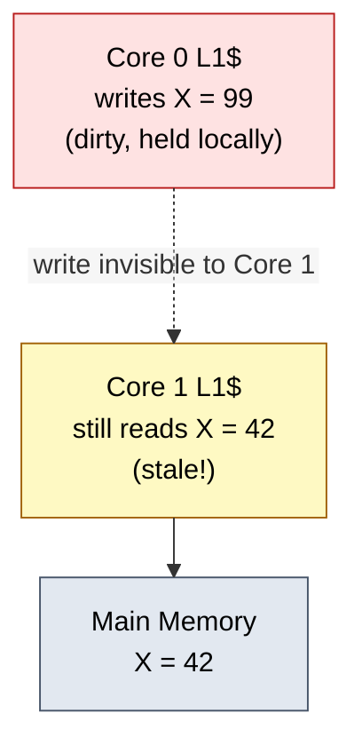
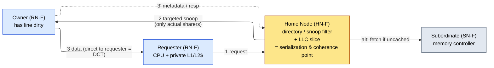
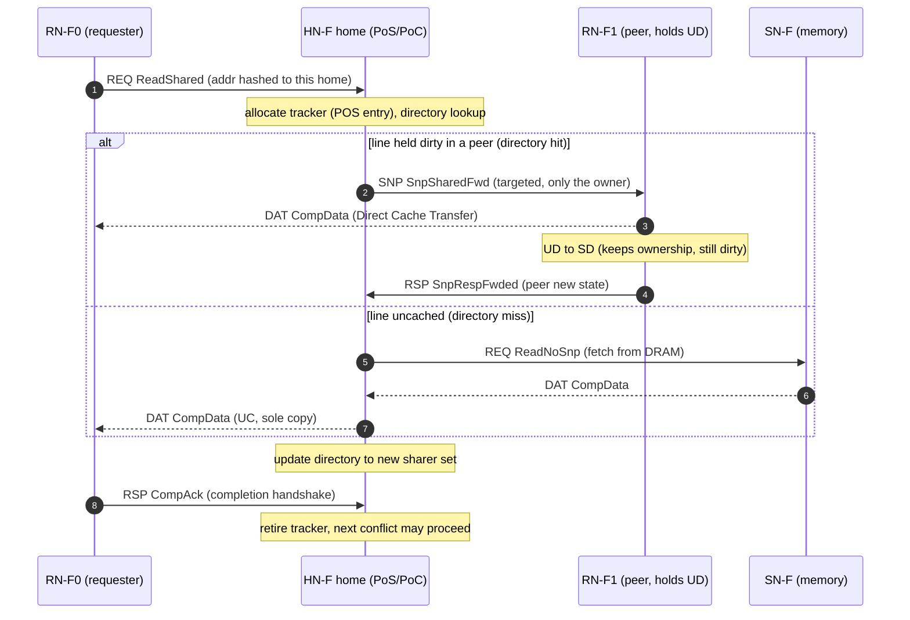
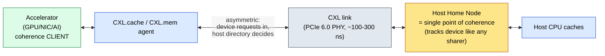

# ACE and CHI — Realizing Cache Coherence at the Interconnect

> **Prerequisites:** [CPU_Architecture](../../02_CPU/01_Core_Foundations/01_CPU_Architecture.md) §8–§9 (the architectural coherence/consistency contract), [Cache_Coherence](../../03_Memory/03_Coherence_and_Consistency/01_Cache_Coherence.md) (stable/transient controller states, races, directory formats, and correctness), [AHB_AXI_APB](01_AHB_AXI_APB.md) (AXI4 channels and handshake, the substrate ACE extends), [Cache_Microarchitecture](../../03_Memory/01_Cache_Hierarchy/01_Cache_Microarchitecture.md) §8 (private caches, MSHRs, and inclusion).
> **Hands off to:** [Network_on_Chip](../02_Network_on_Chip/01_Network_on_Chip.md) (the mesh, routing, flow control, and deadlock the CHI protocol rides on), [DDR_Controller](../../03_Memory/05_Main_Memory/01_DDR_Controller.md) (the memory subordinate at the far end), [GPU_Architecture](../../05_GPU/01_Core_Architecture/01_GPU_Architecture.md) & [NPU_Accelerators](../../06_NPU/01_Compute_Dataflows/01_NPU_Accelerators.md) (coherence *clients* over CXL).

---

## 0. Why this page exists

[CPU_Architecture §8](../../02_CPU/01_Core_Foundations/01_CPU_Architecture.md) handed you the coherence **contract** — the Single-Writer/Multiple-Reader invariant (for any line, at any instant, either one cache writes and no other holds, or any number read and none writes) and the Data-Value invariant (a read returns the last write in coherence order) — and the four MESI (Modified/Exclusive/Shared/Invalid) states each cache uses to play its part. But a protocol is not a state machine sitting inside one cache. **It is an agreement enforced across many caches, over a real fabric that has latency, races, and no global atomic bus.** The MESI diagram assumes a genie that can instantly tell a cache "you are the only copy" or "invalidate everyone else." This page is about building that genie out of wires.

That construction has exactly two shapes, and the whole page is the argument for why the second one becomes mandatory as you add cores:

- **ACE** (AXI Coherence Extensions, AMBA (Advanced Microcontroller Bus Architecture) 4) — *broadcast* the coherence question to every cache and let each answer. Simple, low-latency, and it dies at ~8 cores for a reason we will derive.
- **CHI** (Coherent Hub Interface, AMBA 5) — keep a **directory** at a **home node** that already knows who holds the line, and send *targeted* messages only there. More storage and an extra hop, but it scales to 128+ cores over a mesh.

We do **not** re-derive MESI state-by-state — that is [§8](../../02_CPU/01_Core_Foundations/01_CPU_Architecture.md)'s job. We own the interconnect realization: what the fabric must fundamentally provide, why broadcast is an $O(N^2)$ wall, why the home node is simultaneously the directory, the serialization point, and the point of coherence, why CHI is layered and rides a mesh, and why coherence eventually had to leave the die entirely (CXL (Compute Express Link)). By the end you should be able to size the snoop-bandwidth ceiling, estimate directory storage, and explain why every large server fabric on the market is directory-based — not recite channel names.

---

## 1. What the fabric must provide that a lone cache cannot

Take the MESI state machine of [§8](../../02_CPU/01_Core_Foundations/01_CPU_Architecture.md) as given and ask what it *assumes* the outside world does for it. Three things — and every coherent interconnect, ACE or CHI, is a different way to provide exactly these:

1. **Find the other copies.** Every transition that touches sharing ("I want to write, invalidate everyone"; "I want to read, does anyone have it dirty?") requires answering *who else holds this line?* A cache cannot know this alone. The fabric must implement the lookup — by **broadcast** (ask everyone, ACE) or by **directory** (look it up, CHI). This is the axis the rest of the page turns on.

2. **Serialize conflicting requests to a line.** On a real fabric there is no atomic global bus; a coherence "transaction" is many messages spread over many cycles, and two cores can have in-flight, conflicting requests to the *same* line at the *same* time. SWMR is an ordering invariant — the writer→reader and reader→writer transitions of a line must occur in *some* agreed total order — so **something must be the arbiter** that decides request A is ordered before request B. That agent is the **point of serialization**. Without it, two cores could both believe they are the single writer.

3. **Make a multi-message transaction appear atomic.** Because a request, its snoops, the snoop responses, the data, and the completion acknowledgment span many cycles, the protocol must handle the window in which a line is *in transit*. The cache controller records transient permissions and unfinished obligations in a TBE; the fabric's ordering point serializes same-line transactions and delivers the messages that discharge those obligations. [Cache_Coherence §3–§5](../../03_Memory/03_Coherence_and_Consistency/01_Cache_Coherence.md) owns the controller side of that handshake.

Obligations 1 and 2 are the load-bearing ones. Broadcast answers (1) by asking everyone and answers (2) by bus arbitration (winning the bus for an address *is* winning the order). A directory answers (1) with a lookup and answers (2) at the home node. Hold that framing and ACE and CHI stop being two protocols to memorize and become **two points on one trade-off curve.**

The hardware alternative to this bug is not software cache maintenance (clean/invalidate instructions — slow, error-prone, and it pushes a hardware invariant onto programmers); it is a protocol on the interconnect that makes the staleness *impossible*. That is the whole point of ACE and CHI.

### 1.1 The invariant, and the minimal message set it forces

Make the contract precise before building to it. Write $\mathcal{C}(x)$ for the set of caches holding line $x$ and $\mathcal{W}(x)\subseteq\mathcal{C}(x)$ for those holding it *writable*. The two invariants are

$$
\underbrace{\;|\mathcal{W}(x)|\le 1 \ \wedge\ \big(|\mathcal{W}(x)|=1 \Rightarrow \mathcal{C}(x)=\mathcal{W}(x)\big)\;}_{\text{SWMR}}, \qquad \underbrace{\;\mathrm{read}(x)=\text{value of the last write in }\prec_x\;}_{\text{data-value}}
$$

$$
\text{where } \mathcal{C}(x),\mathcal{W}(x) = \text{holders / writable-holders of line } x,\ \ \prec_x = \text{the coherence order (a single total order of all accesses to } x).
$$

SWMR says the writable set is empty or a singleton that *excludes every reader*; data-value says every read returns the most recent write in the per-line order $\prec_x$ (ordering *across* addresses is [§9](../../02_CPU/01_Core_Foundations/01_CPU_Architecture.md)'s separate consistency contract). [CPU_Architecture §8](../../02_CPU/01_Core_Foundations/01_CPU_Architecture.md) derives the **state** set from these invariants by a counting argument — MSI is correctness-minimal, $+$E is traffic-minimal, $+$O enables cache-to-cache dirty supply — and we do not repeat it. This page owns the dual object the state derivation implies: the minimal **message** set the fabric must carry to *move* a line between those states without ever transiently breaking SWMR or data-value.

Enumerate the transitions that touch sharing and each forces exactly one message archetype:

- **Read miss** (I→S/E): the cache needs a copy *and* needs to learn whether it is alone → a **get-shared** request; the reply carries data plus one bit, "others share (→S)" or "you are alone (→E)."
- **Write to a line not held writable** (I/S→M): SWMR demands $\mathcal{W}(x)$ be emptied of everyone else *first* → a **get-unique** request that invalidates all $|\mathcal{C}(x)|-1$ other copies before granting write. That invalidation count is the term §3 and §4 fight over.
- **Write to a line already held shared** (S→M): the data is already local, so re-fetching it is waste → an **upgrade** (invalidate-only, no data payload) — the message-level analog of the E optimization: it strips the *data* half off a get-unique exactly as E strips a whole transaction off a private read-then-write.
- **Eviction of a dirty line** (M/O→I): data-value forbids losing the last write → a **writeback** to the home/memory.
- The fabric's own two messages: the **snoop** (the query "do you hold $x$, in what state?") and the **snoop response** (hit/miss, $\pm$ the line's data).

That is the entire protocol at interconnect level: three request archetypes $\{$get-shared, get-unique, upgrade$\}$, a writeback, and snoop/response — every richer transaction name in ACE or CHI is one of these five specialized. The single *interconnect-relevant* addition of MOESI (Modified/Owned/Exclusive/Shared/Invalid) over MESI is a property of the **snoop response**, not a new request: an **Owned** copy answers a snoop by *supplying dirty data cache-to-cache and remaining the authority*, so the writeback-to-memory is deferred rather than performed on every shared read. That message-level move — dirty data returned by a *cache* instead of memory — is precisely what Direct Cache Transfer (§5.2) accelerates, and why CHI's cache states $\{$I, UC$\approx$E, UD$\approx$M, SC$\approx$S, SD$\approx$O$\}$ carry a distinct *shared-dirty* encoding (the full five-state lattice and its transitions are diagrammed in §4.3).

**The transaction flow, and why it must appear atomic.** A coherence transaction is therefore not one message but a *chain* — request → (serialize) → snoop(s) → response(s)/data → completion — spread over many cycles and, on CHI, many hops. Obligation 3 of §1 is the requirement that this chain act as one indivisible step in $\prec_x$: between a requester's get-unique and its completion, no *other* requester may also be told it is the unique owner. The agent that guarantees this is the **ordering point** (the bus in ACE, the home node in CHI, §4.1); it admits one transaction per line into $\prec_x$ at a time, and the transient states (I→M is really I→*pending*→M) are the bookkeeping that holds the line "in flight" until the chain closes. This is the exact sense in which the fabric, not the cache, makes a multi-message transaction appear atomic.

---

## 2. Snoop coherence (ACE): broadcast the question

ACE's answer to "find the other copies" is the oldest and simplest one: **ask all of them at once.** It layers three snoop paths onto AXI4 so the interconnect can interrogate every cache — an outbound *snoop-address* path (the interconnect drives a line address into every master), and inbound *snoop-response* and *snoop-data* paths (each master answers "hit/miss, and here is the line if I had it dirty"). The load-bearing idea is not the channel names; it is that **the coherent interconnect is now an active agent** that can pose the "who holds X?" question to the whole cache ensemble and combine the answers. When a core misses, the interconnect broadcasts the snoop, gathers responses, and either forwards a dirty copy cache-to-cache or fetches from memory — enforcing SWMR by construction.

Two design elements matter conceptually; the rest of ACE's transaction menu is just MESI transitions ([§8](../../02_CPU/01_Core_Foundations/01_CPU_Architecture.md)) named for the bus.

- **The bus is the serialization point.** In a snoop system there is no separate directory agent, so obligation (2) of §1 falls to the shared ordering medium itself: whichever request wins arbitration for a line's address is ordered first, and its snoop completes before the next request to that line is presented. Serialization by arbitration is elegant — no extra state — but it is exactly what ties snoop coherence to a *shared* medium, and shared media do not scale (§3).

- **Scope the broadcast: shareability domains.** The first defense against broadcasting to everyone is to not broadcast to everyone. ACE tags each access with a **shareability domain** — *non-shareable* (private; snoop nobody), *inner-shareable* (coherent within one CPU cluster; snoop only that cluster), *outer-shareable* (coherent across clusters), *system* (everything). Cluster-private data (a thread's stack, page tables) never leaves the inner domain, so its coherence traffic never touches the rest of the machine. This is a real and important optimization — but notice it only *shrinks the constant*; the broadcast is still $O(\text{domain size})$, and the domain that actually shares data still pays the full snoop.

**IO coherence (ACE-Lite).** A DMA (direct memory access) engine, GPU, or NIC (network interface controller) usually needs coherent *access* to shared memory but has no coherent cache of its own to be interrogated. ACE-Lite is the asymmetric case: the IO master issues coherent reads/writes (correctly marking shareability) and the interconnect snoops the *full* ACE masters on its behalf, but the IO master itself is never snooped (it has no snoop-response path). This "one-way" coherence — participate as a requester, opt out as a snoopee — is the same asymmetry that CXL formalizes for off-chip accelerators (§7). It is cheap precisely because a device with no cache cannot hold a stale copy.

> Memory *ordering* (barriers: DMB (data memory barrier)/DSB (data synchronization barrier)) also rides these transactions, because the consistency model of [§9](../../02_CPU/01_Core_Foundations/01_CPU_Architecture.md) is enforced partly at the interconnect — a barrier must observe prior accesses reaching their ordering point before later ones issue. The *model* is [CPU_Architecture §9](../../02_CPU/01_Core_Foundations/01_CPU_Architecture.md)'s; the interconnect merely carries and honors the ordering, and we defer the derivation there.

---

## 3. The $O(N^2)$ wall: why broadcast cannot scale

This is the theoretical heart of the page and the single fact that forces directories. Model each core as generating coherence transactions (misses needing a coherence action) at rate $r$ per cycle. In a broadcast system every such transaction must be presented to all other caches, each of which does a snoop tag lookup. We first name what those transactions *are* (§3.1 — the coherence miss and its cost as fabric bandwidth), then cost broadcasting them (§3.2 — the wall).

### 3.1 Where $r$ comes from: the coherence miss (the fourth C), and false sharing

The rate $r$ is not free traffic — it is the **coherence miss**, the *fourth* C beyond the compulsory/capacity/conflict misses of a uniprocessor cache ([Cache_Microarchitecture](../../03_Memory/01_Cache_Hierarchy/01_Cache_Microarchitecture.md)): a miss caused not by the cache being too small but by *another core's write invalidating a line this core still wanted*. It exists only because sharing exists, and it is the entire reason a coherence fabric carries traffic at all. It has two sources — one irreducible, one pure waste:

- **True sharing.** Two cores genuinely communicate through a line — a lock word, a shared counter, a producer's output. Core A's write invalidates B's copy (SWMR forbids a reader beside a writer), so B's next access misses and re-fetches. This traffic is intrinsic to the algorithm; you cut it only by sharing less.
- **False sharing.** Two cores touch *different* bytes that merely fall in the *same* line. Because coherence tracks state at **line granularity** ($B_{\text{line}}=64$ B), not per byte, the protocol cannot tell the independent accesses apart — A's write to byte 0 invalidates B's line even though B only ever reads byte 40. The miss is an artifact of *layout*, yet costs the full price of a real conflict.

**The ping-pong, costed as fabric bandwidth.** Take two cores alternately writing one line. Each write must acquire the line Unique, so it invalidates the other holder and drags the whole line across — the line *ping-pongs* between the two private caches, one line transfer per write. [CPU_Architecture §8.2](../../02_CPU/01_Core_Foundations/01_CPU_Architecture.md) derives the *latency* view (each write stalls at coherence-miss latency instead of ~1 cycle — a ~100× per-access slowdown); here we own the *bandwidth* view the fabric feels. Every ping-pong write moves a full $B_{\text{line}}$-byte line to deliver only the $w$ bytes actually written, so the fabric hauls

$$
\text{amplification} \;=\; \frac{B_{\text{line}}}{w} \;=\; \frac{64\text{ B}}{8\text{ B}} \;=\; 8\times, \qquad w = \text{bytes written per update (an 8 B counter here),}
$$

more bytes than the computation needs. *Worked number.* Two 3 GHz cores ping-pong one line. The line is a single exclusive token — at most one core holds it writable — so every write waits a full cache-to-cache transfer and the writes are serialized: the *pair* lands one contended store per $\approx\!190$ cycles (a $\sim\!10$-cycle loop body plus a $\sim\!180$-cycle $\approx\!60$ ns cache-to-cache miss), not one per core. Thus $3\times10^9/190 \approx 15.8$ M ping-pong writes/s for the pair ($\approx\!7.9$ M/s each), driving $\approx 15.8$ M line-moves/s $\times\,64$ B $\approx \mathbf{1.0\ GB/s}$ of coherence traffic to accomplish only $15.8\text{ M}\times 8$ B $\approx 126$ MB/s of real updates — $8\times$ the bandwidth the work requires, burned on a single hot line. Direct Cache Transfer (§5.2) shrinks the $\sim\!60$ ns cache-to-cache latency toward $\sim\!22$ ns and so *raises the rate* of the ping-pong (cutting the slowdown to $\sim\!7$–8×), but it moves the *same* 64 B per bounce — DCT speeds the transfer, it does not touch the amplification. Only breaking the granularity does: padding each core's datum onto its **own 64 B line** turns every ping-pong miss back into a local L1 write, erasing both the latency and the $8\times$ bandwidth tax for the price of $B_{\text{line}}/w = 8\times$ the memory footprint.

**Why the granule is 64 B — the trade this exposes.** False-sharing pressure pushes the line *small* (finer granularity → fewer independent data per line → less false invalidation), while tag/state overhead and spatial-locality prefetch push it *large* (a wide line amortizes its metadata and fetches neighbors you will likely use). The false-sharing collision probability of two independently-placed objects rises roughly linearly in $B_{\text{line}}$, so 64 B is the near-universal knee where the two pressures balance — and it is why the coherence *granule*, the directory *entry* granule (§5.1), and the cache *line* are the same 64 B. This coherence-miss traffic is the term the Universal Scalability Law bills as contention ([Performance_Modeling §2.2](../../01_Modeling/01_Performance_Analysis/01_Performance_Modeling_and_DSE.md)); the rest of §3 shows how even *one* such miss per core, broadcast, hits a wall.

### 3.2 The broadcast wall: $O(N)$ messages per miss, $O(N^2)$ aggregate

Now cost that traffic on a broadcast fabric. The defining property is **per-miss fan-out**: because no node knows who holds the line, a single coherence miss must be *presented to every other cache* — $N-1$ snoop deliveries out and $N-1$ responses back, so each miss costs

$$
M_{\text{snoop}}(N) \;=\; 2(N-1) \;=\; O(N) \quad\text{messages per coherence miss,}
$$

the "every node must see every request" tax. A shared bus amortizes the $N-1$ *address* deliveries into one electrical broadcast, but not the $N-1$ tag *lookups* nor the responses — the work is $O(N)$ per miss regardless of medium. Multiply by the miss rate to get the sustained load.

**Per-cache snoop load — the first-order cost.** Each of the $N$ caches must absorb the snoops generated by all the others:

$$
\Lambda_{\text{snoop/cache}} \;=\; (N-1)\,r \;\approx\; N r
$$

Every cache needs a snoop-lookup port with bandwidth $B_{\text{snoop}}$, and it caps the machine at $N \le B_{\text{snoop}}/r$. But that port is stolen from the cache's *own* demand pipeline: each snoop is a tag lookup that competes with real loads and stores, so snooping taxes every cache's throughput even when the line is absent (the common case — a broadcast asks $N$ caches and typically 0–2 have the line).

**Aggregate fabric load — the wall.** Sum the snoop traffic the shared ordering medium must carry: $N$ caches each receiving $\approx Nr$ snoops means the fabric moves

$$
\boxed{\;\Lambda_{\text{fabric}} \;=\; N \times N r \;=\; N^2 r\;}
$$

$$
\text{where } N = \text{coherent masters},\; r = \text{coherence transactions / core / cycle},\; \Lambda = \text{snoop bandwidth}.
$$

The shared medium (bus, ring segment, or broadcast crossbar) has a fixed bandwidth $B_{\text{fabric}}$, so the ceiling is $N \le \sqrt{B_{\text{fabric}}/r}$: **snoop bandwidth grows quadratically in core count.** Doubling cores quadruples coherence traffic. A **snoop filter** (a shared directory-like structure that remembers which lines are cached anywhere and suppresses snoops for lines held by nobody) pushes the constant down and is universal in real ACE interconnects (Arm CCI (Cache-Coherent Interconnect)/CMN (Coherent Mesh Network)), but it does not change the $N^2$ *asymptote* for lines that are actually shared. Empirically the knee lands at **~8 coherent masters**, ~16 with an aggressive filter — which is exactly the mobile-cluster regime ACE targets and exactly where it stops.

The lesson is structural: broadcast spends **bandwidth on a shared medium**, and shared-medium bandwidth is a *hard* wall — you cannot encode your way around a saturated bus. The escape is to stop asking everyone.

---

## 4. Directory coherence (CHI): the home node

CHI's answer to "find the other copies" is to **remember** them. For each line, a **directory** records which caches hold it and in what state; a coherence request is *routed* to the agent holding that record — the **home node (HN)** for the line — which consults the directory and sends **targeted** snoops only to the caches that actually have a copy. Broadcast is replaced by lookup, and the snoop traffic collapses:

$$
\Lambda_{\text{fabric}}^{\text{dir}} \;=\; N \, r \, \bar{K}, \qquad \bar{K} \approx 1\text{–}3
$$

where $\bar{K}$ = mean number of actual sharers per line. Because the typical line is held by one or a few caches, coherence traffic now grows as $O(N)$, not $O(N^2)$ — the wall is gone, and CHI scales to **64–128+ cores.**

Per **coherence miss** the contrast with §3.2 is the whole argument. A directory transaction is a lookup, not a broadcast: request → home ($1$) → targeted snoops to the $\bar{K}$ *actual* sharers ($\bar{K}$ out, $\bar{K}$ back) → data → requester, so

$$
M_{\text{dir}}(\bar{K}) \;=\; 2 + 2\bar{K} \;=\; O(1) \quad\text{messages per miss, independent of } N,
$$

against snoop's $M_{\text{snoop}}=2(N-1)=O(N)$. The directory converts a per-miss cost that *grows with the machine* into one that grows with the *sharing* — and real sharing, $\bar{K}\approx1\text{–}3$, does not grow with core count. That single swap, $O(N)\!\to\!O(1)$ per miss, is why the aggregate fell from $N^2 r$ to $N r\bar{K}$, and it sets up the crossover made precise in §5.2 and §11.

### 4.1 Why the home node is three things at once

The deep point is *not* "CHI has a directory." It is that the directory's location is forced by §1's obligations to coincide with two other roles, and understanding **why they coincide** is understanding CHI:

- **It is where the directory lives** — the agent that knows the sharer set (obligation 1).
- **It is the point of serialization** (obligation 2). The agent that owns the sharer record for a line is the natural agent to *order* conflicting requests to it: it processes requests to a given line one transaction at a time (tracking outstanding transactions, and stalling, retrying, or forwarding a conflicting second request), and that per-line serialization is what makes the sprawling multi-message transaction *appear atomic* (obligation 3) and keeps SWMR intact. Two cores racing to write the same line meet at its home node, which lets exactly one win.
- **It is the point of coherence (PoC)** — the ordering point *is*, by definition, where a write becomes globally ordered in the coherence order and hence "visible." That is not a separate mechanism; it is what serialization *means*.

So the home node is the directory **because** it must be the serializer, and it is the serializer **because** SWMR is an ordering invariant that needs an arbiter. The three roles are one agent by necessity, not by convenience.

Formally, the serializer admits transactions to line $x$ one at a time, which *is* a construction of the total coherence order $\prec_x$ of §1.1 — so "the agent that orders writes to $x$" and "the agent at which a write joins $\prec_x$ and becomes visible (the PoC)" are the *same* point by definition, leaving nothing for a separate coherence point to do. Split them — directory in one place, serializer in another — and you would need two agents to keep their orderings of $x$ mutually consistent, resurrecting exactly the multi-agent agreement problem the home node exists to collapse into one authority. Coincidence of the three roles is thus not an implementation choice but a corollary of $\prec_x$ being a *single* total order.

The node taxonomy is just this picture: **Request Nodes (RN)** issue requests (RN-F = *full*, a coherent CPU with a cache that can be snooped; RN-I = *IO*, an uncacheable DMA/IO master — the CHI cousin of ACE-Lite); **Home Nodes (HN)** hold the directory and serialize; **Subordinate Nodes (SN)** are the memory controllers and slaves at the far end. That is the whole model — three roles, not a channel table.

### 4.2 One serializer per line, many home nodes

A single home node serializing all of memory would be a bottleneck as brutal as the bus it replaced. The fix is that **each *line* needs exactly one serializer, but different lines can use different ones.** Physical addresses are **hash-interleaved across many HN-F slices**, so the coherence-ordering workload spreads uniformly while each individual line still has one, and only one, point of coherence (preserving its order). By Little's law a home node with $E$ outstanding-transaction trackers and per-transaction occupancy $T_{\text{occ}}$ sustains $\lambda = E/T_{\text{occ}}$ transactions/s; $H$ interleaved homes give $H \lambda$. **Coherence throughput scales with home-node count, not core count** — which is why an Arm CMN mesh scatters dozens of HN-F slices across the die ([Network_on_Chip](../02_Network_on_Chip/01_Network_on_Chip.md) §7). The same address-hashing trick reappears at every scale (GPU L2 slices, DRAM channels): distribute to avoid a hotspot, but keep one owner per address to keep order.

### 4.3 The five CHI cache-line states — the MOESI lattice, named

[§8](../../02_CPU/01_Core_Foundations/01_CPU_Architecture.md) derived the coherence *states* a cache uses; this page owns the *transactions* that move a line between them. CHI's cache states are the interface between the two, so name them precisely. A CHI line is in one of **five** states — **I, UC, UD, SC, SD** — and the choice of exactly five is *forced*, not stylistic, by the same counting logic §8 used for MESI, read here at the message level.

**The state set is a cross-product of two orthogonal bits.** A snoop response must answer exactly two yes/no questions about the responding cache's copy — and those two are the only questions the fabric ever needs to place a line correctly:

- **Uniqueness** — *is this the only cached copy?* (**U**nique) or *may others hold it?* (**S**hared). This is what a would-be writer must know: SWMR permits a write only from a Unique state, so every write-permission request (`ReadUnique`, `CleanUnique`, `MakeUnique`) must drive all other copies out and leave the requester Unique. It is the SWMR bit.
- **Dirtiness** — *does this copy owe memory a write-back?* (**D**irty) or *is memory already current?* (**C**lean). This is what the fabric must know to place data: on a snoop a Dirty copy must *supply* the line (memory is stale), and on eviction a Dirty copy must write it back. It is the data-value bit.

Two independent bits give $2\times2=4$ present-states, plus the absent state I:

$$
\{\text{Unique},\text{Shared}\}\times\{\text{Clean},\text{Dirty}\}\ +\ \text{Invalid}\;=\;\{\text{UC},\text{UD},\text{SC},\text{SD}\}+\text{I}\;=\;5,
$$

$$
\text{where } U=\mathbb{1}[\text{sole cached copy}],\ \ D=\mathbb{1}[\text{memory stale — this copy owes a write-back}].
$$

That is the whole derivation: **five is $2^2+1$**, the cross-product of the two questions a coherence snoop must resolve — exactly §8's MESI count with the (Shared, Dirty) cell *restored*. CHI keeps that cell, so its native lattice is **MOESI, not MESI**, and the five states map one-to-one onto the letters §8 derived:

| CHI state | bits (U, D) | MOESI | Read? | Write? | Supplies on snoop? | Owes write-back? |
|---|---|---|---|---|---|---|
| **UD** (UniqueDirty) | U, D | **M** | yes | yes (hit) | yes | yes |
| **UC** (UniqueClean) | U, C | **E** | yes | yes → UD silent | no | no |
| **SD** (SharedDirty) | S, D | **O** | yes | no (upgrade first) | **yes** (owner) | **yes** (owner) |
| **SC** (SharedClean) | S, C | **S** | yes | no (upgrade first) | no | no |
| **I** (Invalid) | — | **I** | no | no | no | — |

**Why CHI admits SD when MESI forbids it — the message-level reason.** §8 proved SD (=O) is the one legal cell MESI drops, and that dropping it forces a memory write-back on every producer→consumer hand-off. At the interconnect that write-back is *traffic to the SN-F memory node* — the most expensive kind, a full round-trip off-die. SD lets the dirty owner answer a snoop by supplying the line **cache-to-cache and staying the authority** (the O-state move of §1.1), deferring the write-back to eviction instead of paying it per share. This is exactly the responder behavior **Direct Cache Transfer** (§5.2) accelerates, and why CHI's encoding needs a *shared-dirty* point MESI has no name for. A sixth state would need a third orthogonal bit (none exists at this granularity); a fourth would drop a capability the fabric wants. Five is minimal-and-sufficient.

The transitions below are the §1.1 message archetypes — get-shared (`ReadShared`/`ReadNotSharedDirty`), get-unique (`ReadUnique`/`MakeUnique`), upgrade (`CleanUnique`), write-back (`WriteBackFull`/`Evict`), and snoop (`SnpShared`/`SnpUnique`) — now labelling the edges of the same lattice §8 drew with `Pr`/`Bus` events. **It is the message-level dual of §8's state diagram, not a duplicate:** identical states, but the arrows are CHI transactions on the wire, not a cache's local FSM events.

```mermaid
%%{init: {"flowchart": {"defaultRenderer": "elk", "nodeSpacing": 55, "rankSpacing": 55, "htmlLabels": false}}}%%
stateDiagram-v2
    direction LR
    I:  Invalid
    UC: UniqueClean (E)
    UD: UniqueDirty (M)
    SC: SharedClean (S)
    SD: SharedDirty (O)
    I --> SC:  ReadShared / ReadNotSharedDirty (a sharer exists)
    I --> UC:  ReadShared (no other copy, filled Unique)
    I --> UD:  ReadUnique then Store / MakeUnique (write intent)
    UC --> UD: Store (silent upgrade, no transaction)
    UC --> SC: snoop SnpShared (a reader appears)
    UC --> I:  snoop SnpUnique / Evict
    UD --> SD: snoop SnpShared (supply dirty, keep ownership)
    UD --> UC: WriteCleanFull (flush to memory, keep clean)
    UD --> I:  snoop SnpUnique / WriteBackFull (evict dirty)
    SC --> UC: CleanUnique (upgrade, invalidate sharers, no data)
    SC --> I:  snoop SnpUnique / Evict
    SD --> UD: CleanUnique (upgrade, now unique, still dirty)
    SD --> SC: snoop SnpNotSharedDirty (relinquish ownership)
    SD --> I:  snoop SnpUnique / WriteBackFull
    UC --> UC: Read hit
    UD --> UD: Read or Store hit
    SC --> SC: Read hit; snoop SnpShared
    SD --> SD: Read hit; snoop SnpShared (supply, keep owner)
```

Read the diagram as the two bits moving independently. A **vertical** move flips dirtiness (a Store dirties UC→UD; `WriteCleanFull` cleans UD→UC; a snoop that extracts data cleans the responder). A **horizontal** move flips uniqueness (`CleanUnique` collapses SC→UC by invalidating the other sharers; `SnpShared` shares UC→SC or UD→SD by admitting a reader). The write path is load-bearing: `ReadUnique`/`MakeUnique`/`CleanUnique` all exist to reach a **Unique** state (UC or UD) because SWMR permits a write only there — the message-level restatement of "a writer must be alone." And the silent **UC→UD Store** is CHI's name for MESI's silent E→M, the single most valuable optimization in the protocol (§8), surviving intact into the directory world.

### 4.4 The life of a coherent read miss — channels, the home lifecycle, and CompAck

Now run one transaction end to end and watch the home node discharge all three obligations of §1 in order. An `RN-F` misses on a read; the line is held **dirty** in a peer cache. The transaction crosses CHI's **four independent message channels** — **REQ** (requests, RN→HN), **SNP** (snoops, HN→RN), **DAT** (data: `CompData`, `SnpRespData`), and **RSP** (responses: `SnpResp`, `CompAck`, `Comp`) — and each is a separate virtual network for the deadlock reason §6 derives. This is the concrete, per-transaction instance of that abstract argument.

Without DCT the peer would instead return `SnpRespData` (DAT) *to the home*, which then relays `CompData` to the requester — the extra hop DCT removes (§5.2).

**The home's transaction lifecycle — allocate → snoop → collect → respond → retire.** Every box above is the home executing the five steps that *are* the point of serialization:

1. **Allocate.** On the REQ the home allocates a **tracker** — its **Point-of-Serialization (PoS)** entry — for the address. This single act discharges obligation 2: a *second* request to the same line now finds the tracker busy and is queued or bounced (`RetryAck`, §6), so the home admits **one transaction per line at a time** into $\prec_x$. Trackers are the finite resource §4.2's Little's-law throughput $\lambda=E/T_{\text{occ}}$ counts — $E$ = tracker count, $T_{\text{occ}}$ = the allocate-to-retire span below.
2. **Snoop.** Consult the directory (obligation 1) and issue **targeted** `SnpShared` only to the actual owner — the $O(1)$-per-miss message count of §4, not §3's broadcast. If the directory shows the line uncached, skip the snoop and fetch from the `SN-F` with `ReadNoSnp`.
3. **Collect.** Gather the outcome: a `SnpResp`/`SnpRespData` telling the home the peer's new state, and — under DCT — the data going *straight to the requester* while only metadata returns. A dirty owner's copy supersedes memory, so the home takes it over any DRAM fetch.
4. **Respond.** Deliver `CompData` to the requester (directly, under DCT) and **update the directory** to the new sharer set (requester → SC, owner → SD). The line's position in $\prec_x$ is now decided.
5. **Retire.** On `CompAck`, free the tracker; the line's serialization slot reopens for the next transaction.

**Why `CompAck` exists — the ordering handshake, derived.** Steps 1–4 *decide* the order; `CompAck` *commits* it. The subtlety is the window between the home sending `CompData` and the requester actually observing it: on a mesh those are separated by $\bar{h}$ hops of variable latency. If the home retired the tracker the instant it sent data, a *second* requester's conflicting snoop could reach the first requester **before** it had installed the line — and now the caches and the home disagree on whether the first read precedes or follows the second write. $\prec_x$ would be ambiguous exactly at the hand-off. `CompAck` closes that window: it is the requester's signal *"I hold the completion and am now ordered,"* and the home withholds any dependent conflicting transaction until it lands. Formally, `CompAck` is the instant a transaction **joins** $\prec_x$ — the multi-message chain of §1.1 collapses to a single point in the coherence order there, which is precisely how the fabric makes the sprawling transaction *appear atomic* (obligation 3).

That derivation also forces `CompAck` onto its **own** channel (RSP). The home cannot retire a tracker until `CompAck` lands, so its latency sits *inside* $T_{\text{occ}}$ and throttles home throughput; worse, if `CompAck` could be blocked *behind* the very REQ/DAT traffic it orders, a flood of new requests would stall the acknowledgements that free the trackers those requests need — a closed loop through the home's tracker pool, the exact endpoint deadlock §6 gives each class an independent VN to prevent. *Worked number.* A home with $E=64$ trackers and occupancy $T_{\text{occ}}\approx200$ ns (a snoop round-trip plus the `CompAck` hop) sustains $\lambda=E/T_{\text{occ}}=64/200\text{ ns}\approx 320$ M transactions/s (§4.2). Were `CompAck` blockable and it queued $\sim\!20$ ns behind other flits, $T_{\text{occ}}\to220$ ns and $\lambda\to64/220\text{ ns}\approx 291$ M/s — a $\sim\!10\%$ throughput loss *and* a standing deadlock hazard. On its own RSP VN it is neither. This is the $\{$REQ, SNP, RSP, DAT$\}$ = 4-VN count of §6 seen from one transaction: REQ opens it, SNP interrogates, DAT carries the answer, and the RSP `CompAck` closes it — four roles that must never block one another.

**Ordering guarantees, briefly.** Because every access to a line passes its one home node and is committed at its `CompAck`, the home constructs the single total order $\prec_x$ per line that §1.1 requires — that is the coherence guarantee. Ordering *across* different lines is deliberately **not** the fabric's to invent: distinct addresses hash to distinct homes (§4.2) with no mutual ordering, so multi-address ordering (barriers, release/acquire) is layered *on top* by the consistency model of [CPU_Architecture §9](../../02_CPU/01_Core_Foundations/01_CPU_Architecture.md), which uses these per-line commit points as its primitives. The fabric guarantees per-line coherence order and honors the barriers the core issues; it does not, by itself, supply a global memory order.

---

## 5. The price of the directory: storage and indirection

Directories are not free. They trade the snoop's *bandwidth* problem for two costs of their own — and the reason directory still wins is that both of its costs are *spendable*, while a saturated broadcast medium is not.

### 5.1 Storage: the directory has its own quadratic

A full **bit-vector** directory stores, per tracked line, one presence bit per cache plus a few state bits.

**The full-map baseline and its overhead ratio.** Track *all* of memory with a full $N$-bit sharer vector per line and the directory becomes a fixed fraction of memory itself: each $B_{\text{line}}$-byte line holds $8B_{\text{line}}$ data bits and carries $N$ presence bits, so

$$
\text{overhead} \;=\; \frac{N\ \text{presence bits}}{8\,B_{\text{line}}\ \text{data bits}} \;=\; \frac{N}{8\,B_{\text{line}}} \qquad(\text{full-map, per line, independent of memory size}).
$$

This linear-in-$N$ ratio is what kills full-map at scale: it reaches **100 %** — a directory as large as the memory it describes — at $N = 8B_{\text{line}} = 512$ cores (64 B lines), and exceeds it above. *Worked number (64 B lines):* $N{=}64 \Rightarrow 64/512 = \mathbf{12.5\%}$ (already a heavy SRAM budget); $N{=}1024 \Rightarrow 1024/512 = \mathbf{200\%}$ — the directory would be *twice* the DRAM it tracks, plainly untenable. Full-map is thus abandoned on two independent axes at once: the ratio grows with $N$, *and* tracking all of memory is wasteful when almost none of it is cached at any instant.

If it tracked all of memory it would be hopeless, so real directories are **sparse** (a snoop filter): they track only lines *actually cached*, giving roughly $N \cdot C_{\text{core}} / B_{\text{line}}$ entries. Combine the two factors:

$$
S_{\text{dir}} \;\approx\; \underbrace{N\,\frac{C_{\text{core}}}{B_{\text{line}}}}_{\text{entries} \,\propto\, N} \;\times\; \underbrace{(N + s)}_{\text{bits/entry} \,\propto\, N} \;=\; O(N^2)
$$

$$
\text{where } C_{\text{core}} = \text{cache bytes per core},\; B_{\text{line}} = \text{line size (64 B)},\; s = \text{state bits}.
$$

So the directory is **also** $O(N^2)$ — but in *storage*, not bandwidth, and that distinction is the whole ballgame. (The per-line law is unchanged: the *ratio* to the cache it covers stays $N/8B_{\text{line}}$ from the full-map derivation above; the absolute $O(N^2)$ is just that per-line $O(N)$ vector multiplied by the $O(N)$ cached lines a machine of $N$ caches holds.) Storage you can *engineer down* with encoding, and there are several standard moves, each a precision-vs-area trade:

- **Coarse vector** — one bit per *cluster* of $g$ cores. Vector width drops to $N/g$; the cost is a snoop to a whole cluster when any of its cores holds the line (over-snooping). Storage $\propto N/g$ — but a write now snoops up to $g$ caches to reach the one real sharer, trading a factor-$g$ storage cut for up to a factor-$g$ rise in snoop traffic (the very §3 bandwidth it saved elsewhere). That bounded precision loss is why $g$ is kept small (4–8).
- **Limited pointers** — store $p$ explicit sharer IDs ($\log_2 N$ bits each) instead of a full vector, betting on $\bar{K}\approx 1\text{–}3$; on overflow, fall back to broadcast or force an eviction. Entry cost $O(p \log N)$, essentially flat in $N$ — *exact* whenever the sharer count $K\le p$, which by $\bar{K}\approx1\text{–}3$ covers the vast majority of lines, and imprecise only on the small tail $\Pr[K>p]$ that overflows. So $p$ is a direct storage-vs-precision dial: $p{=}2$ costs 18 bits at 64 cores (§11) versus a 70-bit full vector — a ~4× cut, exact for all but the rare widely-shared line.
- **Sparse / undersized filter** — provision fewer entries than the caches can hold and evict directory entries under pressure, forcing a **back-invalidation** of the line it stops tracking (you cannot forget a sharer silently). This is exactly the flow CXL.mem uses off-chip (§7).
- **Hierarchical / multi-level** — a root directory records which *cluster* shares, a per-cluster leaf records which *core*; each level is a small vector, total storage $O(N)$ spread over $O(\log N)$ levels, and precision is recovered by descending only into clusters that actually share. It is the §4.2 distribute-and-refine idea applied to the *sharer set* itself, trading extra lookup hops for a storage bound that beats the flat $O(N^2)$.

A full-map 64-core entry is about **70 bits** (64-bit sharer vector + state); a small 4-core snoop-filter entry is about **24 bits** (4-bit sharer + partial tag). The point stands: you can *trim* directory storage with cluster-coarsening or pointers, so the $O(N^2)$ is negotiable — whereas the snoop's $O(N^2)$ bandwidth on a fixed medium is not.

### 5.2 Indirection: the home hop, and DCT to claw it back

The second cost is latency. A snoop is logically a single out-and-back broadcast; a directory transaction can be **three hops** — requester → home (lookup) → owner (targeted snoop) → back — and each hop is a mesh traversal of $\bar{h}$ routers, with $\bar{h}$ growing as $\sim\!\sqrt{N}$ on a 2-D mesh:

$$
T_{\text{dir}} \;\approx\; 3\,\bar{h}\,(t_r + t_w), \qquad T_{\text{snoop}} \;\approx\; 2\,t_{\text{bus}} + t_{\text{lookup}}
$$

Structurally $T_{\text{dir}} > T_{\text{snoop}}$ — indirection is the directory's inherent tax. Three mechanisms recover most of it:

- **A shared LLC (last-level cache) slice at the home.** The home node usually *is* a last-level-cache slice, so a large fraction of requests are satisfied from the slice in **two hops with no snoop at all** — the directory lookup and the data live together.
- **Direct Cache Transfer (DCT).** When another cache must supply the line, the naive path routes the data *through* the home (owner → home → requester), traversing the interconnect twice. DCT lets the home tell the owner to forward the line **directly to the requester** while only the coherence *metadata* returns to the home to update the directory. This collapses the 3-hop data path to essentially 2 and drops cache-to-cache latency from **~40–80 ns to ~15–30 ns.** The critical invariant is that the home must *still* learn the new sharer set (the metadata response is not optional) — lose that and the directory would be blind to a copy it never snoops, and coherence breaks silently. DCT is worth it because cache-to-cache sharing is **20–30 % of coherence misses** on server workloads.
- **Hash-distributed homes + un-saturated fabric** (§4.2) mean the average request is not queued behind others.

The crossover, then, is not subtle. At small $N$, snoop wins on latency *and* has spare bandwidth. Past the $O(N^2)$ bandwidth wall (§3) snoop is simply **infeasible at any latency**, so large machines pay the indirection and engineer it back down with DCT and home-side caching. There is no regime where broadcast beats directory at 64 cores; the only question at small scale is whether the directory's storage and latency overhead is worth it, and below ~8 cores it usually is not — which is precisely the ACE/CHI split.

**The two crossovers, made precise.** Put the per-miss message counts head to head. The directory undercuts snoop in raw *traffic* as soon as $2(N-1) > 2 + 2\bar{K}$, i.e.

$$
N \;>\; \bar{K} + 2 \quad(\approx 4 \text{ for } \bar{K}=2) \qquad\text{— the traffic crossover,}
$$

barely past a handful of cores. Yet ACE survives to ~8–16, because message count is not the only ledger: the directory *also* pays $O(N)$ storage per line (§5.1) and one extra indirection hop (this section), and at small $N$ snoop's spare bus bandwidth and its 2-hop (vs 3-hop) latency outweigh its higher message count. So there are **two** distinct crossovers — the traffic one above, and a **feasibility crossover** at $N \approx \sqrt{B_{\text{fabric}}/r} \approx 8$ (§3, §11) where snoop's *aggregate* bandwidth saturates the shared medium and broadcast becomes impossible at any latency. The practical switch happens at the second: below it the directory's fixed overheads are not yet worth paying; above it they are not optional. That gap between "directory sends fewer messages" ($N\!\gtrsim\!4$) and "snoop physically cannot continue" ($N\!\gtrsim\!8$) *is* the ~8-core ACE/CHI boundary.

---

## 6. Why CHI is layered, and why it rides a mesh

CHI is not "ACE with more channels." It is a **clean-sheet, layered** coherence architecture, and the layering is the point. The coherence **protocol** (states, transactions, the ordering rules at the home node) is specified independently of the **link** layer (how a packet — a *flit* — is formatted and flow-controlled) and the **physical** fabric (mesh, ring, crossbar, or die-to-die link). This separation is what lets **one coherence semantics** run over a tiny ring in a mobile SoC, a 128-node mesh in a server, or a UCIe (Universal Chiplet Interconnect Express) link between chiplets (§7) — without redefining the protocol each time.

Three consequences are load-bearing; the rest is transport detail owned by [Network_on_Chip](../02_Network_on_Chip/01_Network_on_Chip.md).

- **Message classes must not block each other — and the number of classes is derived, not chosen.** A coherence protocol carries a deadlock hazard invisible to routing analysis: the messages of a transaction form a **dependency chain** — a *request* triggers a *snoop*, a snoop triggers a *response*, a response carries or triggers *data*, i.e. $\text{REQ}\to\text{SNP}\to\text{RSP}\to\text{DAT}$ — and an agent cannot consume the earlier class until it can *emit* the next. If one buffer pool carried all four, a flood of requests could fill the very buffers the responses need to drain, closing a cycle **through the endpoints' transaction tables rather than through any channel** — a *protocol (message-dependent)* deadlock that the fabric's own acyclic-CDG proof (the Dally–Seitz channel-dependency theorem, [Network_on_Chip §4](../02_Network_on_Chip/01_Network_on_Chip.md)) cannot even see, because the cycle does not live in the channel dependency graph. The cure is forced by the chain: give each class its **own independent virtual network** — separate buffers and flow control end to end — so a lower class can *always* drain into the next without waiting on a busy predecessor. The minimum number of virtual networks is therefore the **length of the longest simultaneously-outstanding dependency chain**, and CHI's four classes $\{$REQ, SNP, RSP, DAT$\}$ are exactly that chain — *why there are four*, not three or five. There is a throughput half to the same argument: even absent deadlock, mixing classes in one queue lets a stalled *data* packet head-of-line-block unrelated *requests*, so independent VNs also keep one class's backpressure from throttling the others. The deadlock theorem and the virtual-network mechanism are [Network_on_Chip §4](../02_Network_on_Chip/01_Network_on_Chip.md); CHI supplies the coherence-specific reason the fabric must run $\ge\!4$ of them. (§4.4 walks one read miss through all four VNs and shows the `CompAck` closing handshake riding the independent RSP class.)

- **Flow control is decoupled, because the endpoints are far apart.** AXI/ACE use same-cycle `valid`/`ready` handshakes, which assume both ends share a bus segment. Across a multi-hop mesh, propagating a `ready` back through routers every cycle is untenable, so CHI uses **credit-based** flow control: a receiver grants a sender $N$ credits (= buffer depth); the sender transmits while it has credits and the receiver returns them as it drains. This decouples sender and receiver timing across arbitrary hop counts. It is the *fabric's* mechanism, shared with any NoC, so the derivation lives in [Network_on_Chip](../02_Network_on_Chip/01_Network_on_Chip.md) §3 — the coherence-relevant fact is only that CHI *needs* it because its endpoints are not on a shared bus.

- **Retry instead of stall, because the home node is contended.** With 64+ requesters hammering a handful of home nodes, a home whose trackers are full cannot simply stop accepting flits — that would back-pressure the fabric and block *unrelated* requests (head-of-line blocking). Instead the home **accepts the request and bounces it** ("retry later, here is the credit to use"), freeing its buffer immediately; the requester re-sends when the home grants a protocol credit. Retry converts a blocking stall into a non-blocking rejection — a scalability mechanism for a many-to-few contention pattern, the same reason a busy web server returns 503 rather than holding the socket. The signaling is bookkeeping; the concept is *don't let one busy home stall the whole fabric.*

Because a directory transaction is a *routed* message rather than a bus broadcast, CHI naturally lives on a **mesh**: home nodes and memory controllers are tiles, addresses hash across the home tiles (§4.2), and coherence becomes ordinary NoC traffic in dedicated virtual networks. The mesh is what makes 128 coherent cores physically buildable — and it is [Network_on_Chip](../02_Network_on_Chip/01_Network_on_Chip.md)'s subject from here.

---

## 7. Off-chip coherence: why the story left the die (CXL)

Everything above assumes the coherent agents are peers on one die: hop latency in the low nanoseconds, all agents in one trust and timing domain, any cache snoopable on the critical path. Two pressures broke that assumption and pushed coherence *across a link*:

1. **Accelerators need fine-grained sharing.** A GPU, SmartNIC, or AI accelerator that shares data structures with the host at cache-line granularity cannot afford the classic "explicit DMA + cache flush" dance — it is slow and, exactly as with multi-core caches, it pushes a hardware invariant onto software. The same argument that motivated hardware coherence *inside* the chip now applies *between* chip and accelerator.
2. **Memory disaggregation.** DRAM capacity and bandwidth per socket are pin-limited. Attaching memory over a serial link — and *pooling* it across hosts — breaks that limit, but only if the attached memory can be coherent host memory, not a second-class IO region.

**Why on-chip coherence cannot simply stretch over the link.** A CXL/PCIe (PCI Express) link adds **~100–300 ns** of latency — 10–100× an on-chip mesh hop — and the device is a separate vendor, timing, and trust domain. You cannot put a remote device on the host's snoop critical path (every host miss would pay a link round-trip to interrogate the device), and you cannot trust an arbitrary device to serialize the host's coherence order. Symmetric coherence across the link is therefore off the table.

**The resolution is asymmetric coherence.** The *host's* home node/directory remains the single point of coherence and serialization; the device is a coherence **client**, never a peer:

- **CXL.cache** — the device *caches host memory*. To the host home node the device is **just another sharer**: it issues coherent reads (shared/exclusive) that the host directory tracks and back-invalidates exactly like a CPU's cache. Conceptually this maps onto CHI as one more RN with a longer wire; the directory does not care that the sharer is off-chip.
- **CXL.mem** — the device *provides memory* (a Type-3 expander). The host home node treats it as a **remote subordinate (SN)**; before the device's memory is read, the home issues any snoops/**back-invalidations** needed to keep host-cached copies coherent (the undersized-directory eviction flow of §5.1, now spanning the link).
- **Bias, for devices with their own memory (Type-2).** An accelerator crunching its *local* HBM (high-bandwidth memory) should not snoop the host on every access. **Host-bias vs device-bias** lets the device own the common case: in device-bias it accesses its own memory freely, and only a **bias flip** (mediated by the host) is needed when the host wants that data. This is the off-chip cousin of MESI's Exclusive state — avoid a coherence transaction on the overwhelmingly common private-access pattern — recast as an asymmetry of *access frequency* across a slow link.

The three CXL device types are just this taxonomy: **Type-1** (cache, no device memory — NIC/accelerator, CXL.io+.cache), **Type-2** (cache *and* device memory — GPU with HBM, all three protocols, needs bias), **Type-3** (device memory only, no cache — memory expander, CXL.io+.mem). Coherence is maintained by the host directory in every case; **no software intervention is required**, which is the entire value proposition over DMA.

**The transport is what made it feasible now.** Coherent memory over a link is only sane if the link's bandwidth rivals a memory channel. **PCIe 6.0** delivers it: **PAM-4** signaling (4 voltage levels → 2 bits per unit interval, doubling rate without doubling frequency) plus **FLIT-mode** framing reach **64 GT/s**, so a ×16 link carries **~128 GB/s** — comparable to a DDR5 channel. That is the enabling condition for treating CXL-attached memory as real, NUMA (non-uniform memory access)-node memory rather than an IO buffer. The PAM-4 eye is noisier (it trades voltage margin for bits), so PCIe 6.0 adds lightweight forward error correction — a *transport* detail; the coherence story only needs the bandwidth headline.

**Chiplets are the middle ground (CHI over D2D).** Between one die and an off-package accelerator sits the multi-die package: dies that *are* trusted and tightly coupled, connected by a die-to-die PHY (physical-layer interface) (UCIe). Here you do **not** go asymmetric — you *extend the CHI directory protocol* across the D2D link, carrying the same REQ/SNP/RSP/DAT classes over UCIe flits. Link latency still forces optimizations: **per-die home nodes** (keep most coherence on-die) and **cross-die snoop shortcuts** (a directory on die 0 that tracks die 1's sharers snoops them directly rather than proxying through die 1's home), cutting D2D crossings and roughly **40–60 % of cross-die coherence latency** in the common two-die case. The D2D physical layer itself is [Network_on_Chip](../02_Network_on_Chip/01_Network_on_Chip.md) §8 and [IC_Packaging](../../../07_Manufacturing_and_Bringup/02_IC_Packaging.md).

---

## 8. The ordering point's other duties

Because the coherent interconnect already **mediates and serializes every access to a line**, it is the natural place to enforce two more system properties. Both are frequently asked about; both reduce to "the point of coherence is also a point of control," so we keep the concept and drop the signal encodings.

- **Security isolation (TrustZone).** Arm partitions the system into Secure and Non-secure worlds, and the partition is carried as an attribute on every bus/flit access. The enforcement point is the fabric: a Non-secure request — or a Non-secure *snoop* — must never be allowed to read or interrogate a Secure line, and because the interconnect (in ACE, the coherent bus; in CHI, the home node) already sees and orders every access, it can reject the cross-domain access in hardware with **no software involvement**. Security lands on the interconnect for the same reason coherence does: it is the one agent that sees everything.

- **Atomics at the serialization point.** A read-modify-write to a *contended* counter is pathological under load/store-exclusive (LL/SC): the line ping-pongs between cores, each stealing it, mutating, and losing it — coherence traffic dominated by a single hot address. The fix exploits the fact that the home node **already serializes** that address: perform the RMW **at the home node / near memory** (Arm's ARMv8.1 Large-System-Extension atomics, carried as ACE/CHI atomic transactions) so the operation completes in **one round-trip** without ever migrating the line. Far/near atomics are a coherence optimization — they move the computation *to* the ordering point instead of dragging the data through every contender's cache. The choice of near-atomic vs bring-the-line-home is itself contention-dependent (do the RMW where the line already is), and high-performance interconnects switch adaptively.

---

## 9. ACE vs CHI: where real silicon lands

Every row of the comparison below is a consequence of one trade-off — **broadcast bandwidth ($O(N^2)$, §3) vs directory storage-plus-indirection (§5)** — and the core count at which that trade-off flips is the whole story.

| Property | **ACE** (snoop) | **CHI** (directory) |
|---|---|---|
| Find-the-copies mechanism | broadcast to all masters | directory lookup at home node |
| Serialization point | shared-bus arbitration | home node (per address) |
| Coherence traffic scaling | $O(N^2)$ fabric bandwidth (§3) | $O(N\bar{K})$, $\bar{K}\approx1\text{–}3$ (§4) |
| Practical core count | ~8 (16 with snoop filter) | 64–128+ |
| Cost paid instead | none extra (bandwidth-bound) | directory storage $O(N^2)$-but-trimmable + home-hop latency (§5) |
| Natural topology | shared bus / small crossbar | mesh / ring / D2D (§6) |
| Off-chip extension | ACE-Lite (IO, one-way) | CXL client, chiplet D2D (§7) |
| Typical silicon | Cortex-A55/A78 clusters (Snapdragon, Dimensity) | Neoverse N1/V1/V2 over CMN mesh (Graviton, Altra, Cobalt) |

Read it as one decision. A mobile SoC with a 2–8 core cluster sits *below* the $O(N^2)$ knee, so it takes ACE's simplicity and low latency and pays nothing for a directory it does not need. A server SoC with 64–128 cores is *far past* the knee, where broadcast is physically impossible, so it pays CHI's directory storage and home-hop indirection — and buys them back with sparse directories, DCT, hash-distributed homes, and a mesh. The industry did not choose two protocols; it chose one trade-off curve and reads off the point set by its core count.

---

## 10. Numbers to memorize

| Parameter | Value | Why (section) |
|---|---|---|
| ACE practical core count | **~8** (16 with snoop filter) | $O(N^2)$ snoop-bandwidth wall (§3) |
| CHI core count | **64–128+** | $O(N\bar{K})$ directory traffic (§4) |
| Snoop-traffic scaling | $\Lambda \propto N^2 r$ | broadcast to all caches (§3) |
| Directory-traffic scaling | $\Lambda \propto N r \bar{K}$, $\bar{K}\approx 1\text{–}3$ | targeted snoops only (§4) |
| ACE snoop latency | 2–4 cycles | one broadcast round-trip (§2) |
| CHI mesh hop latency | 2–3 cycles / hop | routed transaction, $\bar{h}\!\sim\!\sqrt{N}$ (§5.2) |
| DCT cache-to-cache latency | **15–30 ns** (vs 40–80 ns) | data bypasses the home (§5.2) |
| Cache-to-cache sharing rate | 20–30 % of coherence misses | why DCT pays (§5.2) |
| Directory entry (64-core, full map) | ~70 bits | 64-bit sharer vector + state (§5.1) |
| Snoop-filter entry (4-core) | ~24 bits | 4-bit sharer + partial tag (§5.1) |
| Cache line size | 64 B | the coherence granule (§5.1) |
| Interconnect fabric clock | 800 MHz – 2 GHz | cores clock faster than the fabric |
| CHI message classes | 4 (REQ / SNP / RSP / DAT) | independent VNs stop protocol deadlock (§6) |
| ACE snoop paths added to AXI | 3 (snoop addr / resp / data) | the broadcast interrogation path (§2) |
| CHI flit width (typical) | 128–256 bits | single-flit packets, credit-flow-controlled (§6) |
| CXL / off-chip link latency | ~100–300 ns | 10–100× a mesh hop → asymmetric coherence (§7) |
| CXL device types | 1 (cache), 2 (cache+mem, bias), 3 (mem) | client taxonomy (§7) |
| PCIe 6.0 rate / ×16 BW | 64 GT/s (PAM-4, FLIT) / ~128 GB/s | ≈ a DDR5 channel — enables CXL.mem (§7) |
| Cross-die coherence saving (CHI D2D) | 40–60 % latency | per-die homes + cross-die snoop (§7) |
| Coherence miss (the 4th C) | another core's write invalidates a wanted line | the source of $r$ (§3.1) |
| False-sharing amplification | $B_{\text{line}}/w \approx 8\times$ (64 B / 8 B) | 64 B moved per 8 B updated; ~1.0 GB/s on one hot line (§3.1) |
| False-sharing fix | pad each datum to its own 64 B line | erases the ping-pong, latency + BW (§3.1) |
| Snoop messages / miss | $2(N{-}1) = O(N)$ | broadcast reaches every cache (§3.2) |
| Directory messages / miss | $2 + 2\bar{K} = O(1)$ | targeted to $\bar{K}$ actual sharers (§4) |
| Full-map dir. overhead | $N/8B_{\text{line}}$: 12.5 % @64, 200 % @1024 | 100 % at $N{=}512$ cores → untenable (§5.1) |
| Traffic vs feasibility crossover | $N\!\approx\!\bar{K}{+}2$ vs $N\!\approx\!\sqrt{B/r}$ | why ACE lasts to ~8, not ~4 (§5.2) |
| Min interconnect message set | get-shared / get-unique / upgrade / writeback / snoop | +O ⇒ dirty cache-to-cache (§1.1) |
| Virtual-network count | = dependency-chain length REQ→SNP→RSP→DAT (4) | protocol-deadlock cure (§6) |
| CHI cache-line states | **5** = MOESI lattice (I, UC≈E, UD≈M, SC≈S, SD≈O) | 2 orthogonal bits (unique × dirty) $+$ I (§4.3) |
| CHI message channels | REQ / SNP / DAT / RSP | one VN per message role; `CompAck` on RSP (§4.4, §6) |
| Home transaction lifecycle | allocate → snoop → collect → respond → retire | the $T_{\text{occ}}$ in $\lambda=E/T_{\text{occ}}$ (§4.2, §4.4) |
| Completion handshake | `CompAck` commits the txn to $\prec_x$ | serializes the transaction at the PoS (§4.4) |

---

## 11. Worked problems

**1 — The snoop-bandwidth ceiling.** A coherent cluster runs at $f$; each core generates $r = 0.02$ coherence transactions/cycle, and each snoop tag-lookup costs one cache cycle. A shared bus can broadcast $B_{\text{fabric}} = 1$ snoop/cycle to all caches. The fabric load is $\Lambda = N^2 r$, so saturation is $N^2 (0.02) = 1 \Rightarrow N = \sqrt{50} \approx 7$. That $\approx\!7$–8 is not a coincidence — it is the arithmetic behind "ACE tops out near 8 cores." Halving $r$ with a snoop filter (suppress lookups for uncached lines) buys $N \approx \sqrt{100} = 10$: a constant-factor win, *not* a change in the $O(N^2)$ law, which is why filters extend ACE but do not save it.

**2 — Directory storage crossover.** 64 cores, 1 MB private cache each, 64 B lines → $64 \times 2^{14} = 2^{20}$ tracked lines. A full bit-vector entry is $64 + 6 = 70$ bits → $\approx 9$ MB of directory SRAM. Switch to **limited pointers** with $p=2$ sharers ($2 \times 6 = 12$ bits + 6 state = 18 bits/entry) → $\approx 2.3$ MB, a 4× cut, correct as long as $\bar{K}\le 2$ (true for most lines; overflow falls back to broadcast). This is the §5.1 point in numbers: the directory's $O(N^2)$ storage is *negotiable by encoding*, whereas the snoop's $O(N^2)$ *bandwidth* on a fixed bus is not — which is why scale goes directory. As a *ratio to memory*, the full-map baseline (§5.1) is $N/8B_{\text{line}} = N/512$: **12.5 %** at 64 cores but **200 %** at 1024 cores (64 B lines) — a directory outweighing DRAM itself, which is why past a few hundred cores even sparse full-vectors yield to limited-pointer or hierarchical encodings.

**3 — DCT latency payoff.** Cache-to-cache misses are 25 % of coherence misses on a 64-core server; non-DCT cache-to-cache costs 60 ns (data through the home), DCT costs 22 ns. If coherence misses are 30 % of all LLC misses at 5 M misses/s, cache-to-cache misses are $5\text{M}\times0.30\times0.25 = 375$k/s, and DCT saves $(60-22)\,\text{ns} \times 375\text{k} \approx 14$ ms/s of aggregate latency — plus it removes those transfers from the home node's data path entirely, which is often the larger win because it *unclogs the serialization point* (§4.1) rather than merely speeding one transfer.

**4 — Snoop vs directory, per miss: 4-core SoC vs 64-core server.** Count messages per coherence miss, $M_{\text{snoop}}=2(N-1)$ vs $M_{\text{dir}}=2+2\bar{K}$ (§3.2, §4). *4-core mobile cluster* ($\bar{K}\approx1.5$): snoop $=2(3)=6$, directory $\approx 2+3=5$ — a near tie, and the directory would still owe an $N$-bit vector per line plus a third hop, so the SoC keeps **ACE** and pays nothing for a directory it does not need; aggregate snoop load $N^2 r = 16r$ sits trivially under any bus. *64-core server* ($\bar{K}\approx2$): snoop $=2(63)=126$, directory $\approx 2+4=6$ — **21× fewer** messages per miss, and aggregate snoop load $N^2 r = 4096r$ has long since blown past the shared medium (the $N\!\approx\!8$ ceiling of problem 1). Broadcast is infeasible at any latency, so the server takes **CHI**, pays the $O(N)$-per-line directory storage (spendable, §5.1) and the home hop (clawed back by DCT, problem 3). One trade-off curve; the core count reads off the point.

---

## Cross-references

- **Down the stack (what this fabric is built from):** [Network_on_Chip](../02_Network_on_Chip/01_Network_on_Chip.md) (the mesh topology, credit-based flow control §3, routing/protocol deadlock and virtual networks §4, and the coherent-mesh/CMN realization §7 that CHI rides on; D2D physical layer §8), [AHB_AXI_APB](01_AHB_AXI_APB.md) (the AXI4 channels and handshakes ACE extends), [Memory](../../03_Memory/04_Memory_Technologies/01_Memory_Arrays_and_Technologies.md) & [DDR_Controller](../../03_Memory/05_Main_Memory/01_DDR_Controller.md) (the SN-F memory endpoint), [IC_Packaging](../../../07_Manufacturing_and_Bringup/02_IC_Packaging.md) (the chiplet/D2D substrate of §7).
- **Up the stack (what defines the contract this realizes):** [CPU_Architecture](../../02_CPU/01_Core_Foundations/01_CPU_Architecture.md) §8 (the SWMR/Data-Value invariants and the MESI/MOESI *state*-count derivation whose *message*-set dual is §1.1 here — this page names and diagrams those same five states as CHI's I/UC/UD/SC/SD in §4.3, and walks their canonical read-miss transaction flow with the `CompAck` ordering handshake in §4.4) and §9 (the consistency model the fabric's ordering honors) — specifically §8.2 for the core-side *latency* of the ping-pong whose *fabric-bandwidth* cost is derived in §3.1, [Cache_Microarchitecture](../../03_Memory/01_Cache_Hierarchy/01_Cache_Microarchitecture.md) §8 (the in-cache coherence controller, MSHRs, and inclusion policy on the other side of the snoop; the four-Cs miss taxonomy and 64 B line geometry behind §3.1/§5.1).
- **Controller dual:** [Cache_Coherence](../../03_Memory/03_Coherence_and_Consistency/01_Cache_Coherence.md) owns the transient states/TBEs, same-line races, acknowledgement proof, directory encodings, protocol deadlock, and safety/liveness properties that these fabric transactions must satisfy.
- **Adjacent / consumers:** [OoO_Execution](../../02_CPU/03_Out_of_Order_Backend/01_OoO_Execution.md) §5 (the LSQ that enforces per-core ordering the fabric completes), [GPU_Architecture](../../05_GPU/01_Core_Architecture/01_GPU_Architecture.md) & [NPU_Accelerators](../../06_NPU/01_Compute_Dataflows/01_NPU_Accelerators.md) (accelerators that become CXL coherence clients, §7), [Xiangshan_CPU_Design](../../02_CPU/04_Core_Case_Studies/01_Xiangshan_CPU_Design.md) (a complete core that plugs into such a fabric), [Performance_Modeling_and_DSE](../../01_Modeling/01_Performance_Analysis/01_Performance_Modeling_and_DSE.md) §2.2 (the Universal Scalability Law contention term the §3.1 coherence miss feeds; where these scaling models feed system design-space exploration).

---

## References

1. ARM IHI 0022 — *AMBA AXI and ACE Protocol Specification* (AXI4, ACE, ACE-Lite; shareability domains and snoop channels).
2. ARM IHI 0050 — *AMBA 5 CHI Architecture Specification* (home nodes, directory, message classes, credit flow control, DCT, retry).
3. ARM 100453 — *CoreLink CMN-600/700 Coherent Mesh Network* (HN-F interleaving, snoop filter, the mesh realization of §4–§6).
4. Lenoski, D. et al., "The Directory-Based Cache Coherence Protocol for the DASH Multiprocessor," *ISCA*, 1990. Foundational directory coherence and the storage-scaling argument of §5.1.
5. Martin, M.M.K., Hill, M.D., and Sorin, D.J., "Why On-Chip Cache Coherence Is Here to Stay," *CACM*, 55(7), 2012. The snoop-vs-directory scaling case.
6. Nagarajan, V., Sorin, D.J., Hill, M.D., and Wood, D.A., *A Primer on Memory Consistency and Cache Coherence*, 2nd ed., Morgan & Claypool, 2020. Points of serialization/coherence and transient-state protocols.
7. Hennessy, J.L. and Patterson, D.A., *Computer Architecture: A Quantitative Approach*, 6th ed., Morgan Kaufmann, 2017. Ch. 5 (coherence, directories, consistency).
8. CXL Consortium, *Compute Express Link Specification*, rev. 3.1, 2023. CXL.cache/.mem, device types, bias-based coherence, memory pooling of §7.

---

## Navigation

| Direction | Link |
|---|---|
| Prerequisite | [CPU_Architecture](../../02_CPU/01_Core_Foundations/01_CPU_Architecture.md) (coherence contract §8–§9) |
| Prerequisite | [Cache_Coherence](../../03_Memory/03_Coherence_and_Consistency/01_Cache_Coherence.md) (controller and correctness) |
| Prerequisite | [AHB_AXI_APB](01_AHB_AXI_APB.md) (AXI4 substrate) |
| Hands off to | [Network_on_Chip](../02_Network_on_Chip/01_Network_on_Chip.md) (the fabric CHI rides on) |
| Related | [STA](../../../06_Signoff/01_STA.md) (interconnect timing closure) |
| Back to Index | [Index](../../../Index.md) |
