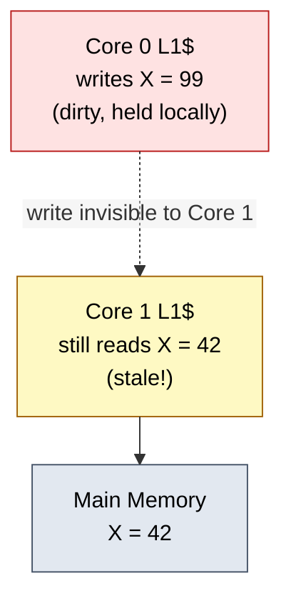
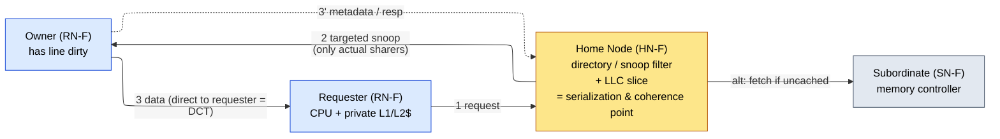
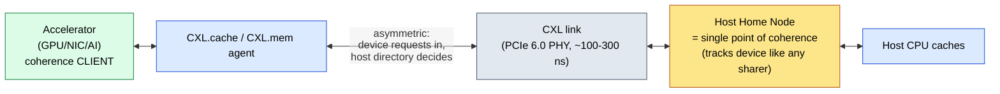

# ACE and CHI — Realizing Cache Coherence at the Interconnect

> **Prerequisites:** [CPU_Architecture](../02_CPU/01_CPU_Architecture.md) §8–§9 (the coherence *contract* — SWMR, MESI, snoop-vs-directory — and the consistency model this page realizes), [AHB_AXI_APB](01_AHB_AXI_APB.md) (AXI4 channels and handshake, the substrate ACE extends), [Cache_Microarchitecture](../03_Memory/01_Cache_Microarchitecture.md) §8 (private caches, MSHRs, inclusion — the caches being kept coherent).
> **Hands off to:** [Network_on_Chip](03_Network_on_Chip.md) (the mesh, routing, flow control, and deadlock the CHI protocol rides on), [DDR_Controller](../03_Memory/04_DDR_Controller.md) (the memory subordinate at the far end), [GPU_Architecture](../05_GPU/01_GPU_Architecture.md) & [NPU_Accelerators](../06_NPU/01_NPU_Accelerators.md) (coherence *clients* over CXL).

---

## 0. Why this page exists

[CPU_Architecture §8](../02_CPU/01_CPU_Architecture.md) handed you the coherence **contract** — the Single-Writer/Multiple-Reader invariant (for any line, at any instant, either one cache writes and no other holds, or any number read and none writes) and the Data-Value invariant (a read returns the last write in coherence order) — and the four MESI states each cache uses to play its part. But a protocol is not a state machine sitting inside one cache. **It is an agreement enforced across many caches, over a real fabric that has latency, races, and no global atomic bus.** The MESI diagram assumes a genie that can instantly tell a cache "you are the only copy" or "invalidate everyone else." This page is about building that genie out of wires.

That construction has exactly two shapes, and the whole page is the argument for why the second one becomes mandatory as you add cores:

- **ACE** (AXI Coherence Extensions, AMBA 4) — *broadcast* the coherence question to every cache and let each answer. Simple, low-latency, and it dies at ~8 cores for a reason we will derive.
- **CHI** (Coherent Hub Interface, AMBA 5) — keep a **directory** at a **home node** that already knows who holds the line, and send *targeted* messages only there. More storage and an extra hop, but it scales to 128+ cores over a mesh.

We do **not** re-derive MESI state-by-state — that is [§8](../02_CPU/01_CPU_Architecture.md)'s job. We own the interconnect realization: what the fabric must fundamentally provide, why broadcast is an $O(N^2)$ wall, why the home node is simultaneously the directory, the serialization point, and the point of coherence, why CHI is layered and rides a mesh, and why coherence eventually had to leave the die entirely (CXL). By the end you should be able to size the snoop-bandwidth ceiling, estimate directory storage, and explain why every large server fabric on the market is directory-based — not recite channel names.

---

## 1. What the fabric must provide that a lone cache cannot

Take the MESI state machine of [§8](../02_CPU/01_CPU_Architecture.md) as given and ask what it *assumes* the outside world does for it. Three things — and every coherent interconnect, ACE or CHI, is a different way to provide exactly these:

1. **Find the other copies.** Every transition that touches sharing ("I want to write, invalidate everyone"; "I want to read, does anyone have it dirty?") requires answering *who else holds this line?* A cache cannot know this alone. The fabric must implement the lookup — by **broadcast** (ask everyone, ACE) or by **directory** (look it up, CHI). This is the axis the rest of the page turns on.

2. **Serialize conflicting requests to a line.** On a real fabric there is no atomic global bus; a coherence "transaction" is many messages spread over many cycles, and two cores can have in-flight, conflicting requests to the *same* line at the *same* time. SWMR is an ordering invariant — the writer→reader and reader→writer transitions of a line must occur in *some* agreed total order — so **something must be the arbiter** that decides request A is ordered before request B. That agent is the **point of serialization**. Without it, two cores could both believe they are the single writer.

3. **Make a multi-message transaction appear atomic.** Because a request, its snoops, the snoop responses, the data, and the completion acknowledgment span many cycles, the protocol must handle the window in which a line is *in transit* — transient states, races against a second requester, and acknowledgments that close the transaction. The fabric owns this "coherence over a non-atomic medium" bookkeeping; the cache only sees clean M/E/S/I.

Obligations 1 and 2 are the load-bearing ones. Broadcast answers (1) by asking everyone and answers (2) by bus arbitration (winning the bus for an address *is* winning the order). A directory answers (1) with a lookup and answers (2) at the home node. Hold that framing and ACE and CHI stop being two protocols to memorize and become **two points on one trade-off curve.**

The hardware alternative to this bug is not software cache maintenance (clean/invalidate instructions — slow, error-prone, and it pushes a hardware invariant onto programmers); it is a protocol on the interconnect that makes the staleness *impossible*. That is the whole point of ACE and CHI.

---

## 2. Snoop coherence (ACE): broadcast the question

ACE's answer to "find the other copies" is the oldest and simplest one: **ask all of them at once.** It layers three snoop paths onto AXI4 so the interconnect can interrogate every cache — an outbound *snoop-address* path (the interconnect drives a line address into every master), and inbound *snoop-response* and *snoop-data* paths (each master answers "hit/miss, and here is the line if I had it dirty"). The load-bearing idea is not the channel names; it is that **the coherent interconnect is now an active agent** that can pose the "who holds X?" question to the whole cache ensemble and combine the answers. When a core misses, the interconnect broadcasts the snoop, gathers responses, and either forwards a dirty copy cache-to-cache or fetches from memory — enforcing SWMR by construction.

Two design elements matter conceptually; the rest of ACE's transaction menu is just MESI transitions ([§8](../02_CPU/01_CPU_Architecture.md)) named for the bus.

- **The bus is the serialization point.** In a snoop system there is no separate directory agent, so obligation (2) of §1 falls to the shared ordering medium itself: whichever request wins arbitration for a line's address is ordered first, and its snoop completes before the next request to that line is presented. Serialization by arbitration is elegant — no extra state — but it is exactly what ties snoop coherence to a *shared* medium, and shared media do not scale (§3).

- **Scope the broadcast: shareability domains.** The first defense against broadcasting to everyone is to not broadcast to everyone. ACE tags each access with a **shareability domain** — *non-shareable* (private; snoop nobody), *inner-shareable* (coherent within one CPU cluster; snoop only that cluster), *outer-shareable* (coherent across clusters), *system* (everything). Cluster-private data (a thread's stack, page tables) never leaves the inner domain, so its coherence traffic never touches the rest of the machine. This is a real and important optimization — but notice it only *shrinks the constant*; the broadcast is still $O(\text{domain size})$, and the domain that actually shares data still pays the full snoop.

**IO coherence (ACE-Lite).** A DMA engine, GPU, or NIC usually needs coherent *access* to shared memory but has no coherent cache of its own to be interrogated. ACE-Lite is the asymmetric case: the IO master issues coherent reads/writes (correctly marking shareability) and the interconnect snoops the *full* ACE masters on its behalf, but the IO master itself is never snooped (it has no snoop-response path). This "one-way" coherence — participate as a requester, opt out as a snoopee — is the same asymmetry that CXL formalizes for off-chip accelerators (§7). It is cheap precisely because a device with no cache cannot hold a stale copy.

> Memory *ordering* (barriers: DMB/DSB) also rides these transactions, because the consistency model of [§9](../02_CPU/01_CPU_Architecture.md) is enforced partly at the interconnect — a barrier must observe prior accesses reaching their ordering point before later ones issue. The *model* is [CPU_Architecture §9](../02_CPU/01_CPU_Architecture.md)'s; the interconnect merely carries and honors the ordering, and we defer the derivation there.

---

## 3. The $O(N^2)$ wall: why broadcast cannot scale

This is the theoretical heart of the page and the single fact that forces directories. Model each core as generating coherence transactions (misses needing a coherence action) at rate $r$ per cycle. In a broadcast system every such transaction must be presented to all other caches, each of which does a snoop tag lookup.

**Per-cache snoop load — the first-order cost.** Each of the $N$ caches must absorb the snoops generated by all the others:

$$
\Lambda_{\text{snoop/cache}} \;=\; (N-1)\,r \;\approx\; N r
$$

Every cache needs a snoop-lookup port with bandwidth $B_{\text{snoop}}$, and it caps the machine at $N \le B_{\text{snoop}}/r$. But that port is stolen from the cache's *own* demand pipeline: each snoop is a tag lookup that competes with real loads and stores, so snooping taxes every cache's throughput even when the line is absent (the common case — a broadcast asks $N$ caches and typically 0–2 have the line).

**Aggregate fabric load — the wall.** Sum the snoop traffic the shared ordering medium must carry: $N$ caches each receiving $\approx Nr$ snoops means the fabric moves

$$
\boxed{\;\Lambda_{\text{fabric}} \;=\; N \times N r \;=\; N^2 r\;}
$$

$$
\text{where } N = \text{coherent masters},\; r = \text{coherence transactions / core / cycle},\; \Lambda = \text{snoop bandwidth}.
$$

The shared medium (bus, ring segment, or broadcast crossbar) has a fixed bandwidth $B_{\text{fabric}}$, so the ceiling is $N \le \sqrt{B_{\text{fabric}}/r}$: **snoop bandwidth grows quadratically in core count.** Doubling cores quadruples coherence traffic. A **snoop filter** (a shared directory-like structure that remembers which lines are cached anywhere and suppresses snoops for lines held by nobody) pushes the constant down and is universal in real ACE interconnects (Arm CCI/CMN), but it does not change the $N^2$ *asymptote* for lines that are actually shared. Empirically the knee lands at **~8 coherent masters**, ~16 with an aggressive filter — which is exactly the mobile-cluster regime ACE targets and exactly where it stops.

The lesson is structural: broadcast spends **bandwidth on a shared medium**, and shared-medium bandwidth is a *hard* wall — you cannot encode your way around a saturated bus. The escape is to stop asking everyone.

---

## 4. Directory coherence (CHI): the home node

CHI's answer to "find the other copies" is to **remember** them. For each line, a **directory** records which caches hold it and in what state; a coherence request is *routed* to the agent holding that record — the **home node (HN)** for the line — which consults the directory and sends **targeted** snoops only to the caches that actually have a copy. Broadcast is replaced by lookup, and the snoop traffic collapses:

$$
\Lambda_{\text{fabric}}^{\text{dir}} \;=\; N \, r \, \bar{K}, \qquad \bar{K} \approx 1\text{–}3
$$

where $\bar{K}$ = mean number of actual sharers per line. Because the typical line is held by one or a few caches, coherence traffic now grows as $O(N)$, not $O(N^2)$ — the wall is gone, and CHI scales to **64–128+ cores.**

### 4.1 Why the home node is three things at once

The deep point is *not* "CHI has a directory." It is that the directory's location is forced by §1's obligations to coincide with two other roles, and understanding **why they coincide** is understanding CHI:

- **It is where the directory lives** — the agent that knows the sharer set (obligation 1).
- **It is the point of serialization** (obligation 2). The agent that owns the sharer record for a line is the natural agent to *order* conflicting requests to it: it processes requests to a given line one transaction at a time (tracking outstanding transactions, and stalling, retrying, or forwarding a conflicting second request), and that per-line serialization is what makes the sprawling multi-message transaction *appear atomic* (obligation 3) and keeps SWMR intact. Two cores racing to write the same line meet at its home node, which lets exactly one win.
- **It is the point of coherence (PoC)** — the ordering point *is*, by definition, where a write becomes globally ordered in the coherence order and hence "visible." That is not a separate mechanism; it is what serialization *means*.

So the home node is the directory **because** it must be the serializer, and it is the serializer **because** SWMR is an ordering invariant that needs an arbiter. The three roles are one agent by necessity, not by convenience.

The node taxonomy is just this picture: **Request Nodes (RN)** issue requests (RN-F = *full*, a coherent CPU with a cache that can be snooped; RN-I = *IO*, an uncacheable DMA/IO master — the CHI cousin of ACE-Lite); **Home Nodes (HN)** hold the directory and serialize; **Subordinate Nodes (SN)** are the memory controllers and slaves at the far end. That is the whole model — three roles, not a channel table.

### 4.2 One serializer per line, many home nodes

A single home node serializing all of memory would be a bottleneck as brutal as the bus it replaced. The fix is that **each *line* needs exactly one serializer, but different lines can use different ones.** Physical addresses are **hash-interleaved across many HN-F slices**, so the coherence-ordering workload spreads uniformly while each individual line still has one, and only one, point of coherence (preserving its order). By Little's law a home node with $E$ outstanding-transaction trackers and per-transaction occupancy $T_{\text{occ}}$ sustains $\lambda = E/T_{\text{occ}}$ transactions/s; $H$ interleaved homes give $H \lambda$. **Coherence throughput scales with home-node count, not core count** — which is why an Arm CMN mesh scatters dozens of HN-F slices across the die ([Network_on_Chip](03_Network_on_Chip.md) §6). The same address-hashing trick reappears at every scale (GPU L2 slices, DRAM channels): distribute to avoid a hotspot, but keep one owner per address to keep order.

---

## 5. The price of the directory: storage and indirection

Directories are not free. They trade the snoop's *bandwidth* problem for two costs of their own — and the reason directory still wins is that both of its costs are *spendable*, while a saturated broadcast medium is not.

### 5.1 Storage: the directory has its own quadratic

A full **bit-vector** directory stores, per tracked line, one presence bit per cache plus a few state bits. If it tracked all of memory it would be hopeless, so real directories are **sparse** (a snoop filter): they track only lines *actually cached*, giving roughly $N \cdot C_{\text{core}} / B_{\text{line}}$ entries. Combine the two factors:

$$
S_{\text{dir}} \;\approx\; \underbrace{N\,\frac{C_{\text{core}}}{B_{\text{line}}}}_{\text{entries} \,\propto\, N} \;\times\; \underbrace{(N + s)}_{\text{bits/entry} \,\propto\, N} \;=\; O(N^2)
$$

$$
\text{where } C_{\text{core}} = \text{cache bytes per core},\; B_{\text{line}} = \text{line size (64 B)},\; s = \text{state bits}.
$$

So the directory is **also** $O(N^2)$ — but in *storage*, not bandwidth, and that distinction is the whole ballgame. Storage you can *engineer down* with encoding, and there are three standard moves, each a precision-vs-area trade:

- **Coarse vector** — one bit per *cluster* of $g$ cores. Vector width drops to $N/g$; the cost is a snoop to a whole cluster when any of its cores holds the line (over-snooping). Storage $\propto N/g$.
- **Limited pointers** — store $p$ explicit sharer IDs ($\log_2 N$ bits each) instead of a full vector, betting on $\bar{K}\approx 1\text{–}3$; on overflow, fall back to broadcast or force an eviction. Entry cost $O(p \log N)$, essentially flat in $N$.
- **Sparse / undersized filter** — provision fewer entries than the caches can hold and evict directory entries under pressure, forcing a **back-invalidation** of the line it stops tracking (you cannot forget a sharer silently). This is exactly the flow CXL.mem uses off-chip (§7).

A full-map 64-core entry is about **70 bits** (64-bit sharer vector + state); a small 4-core snoop-filter entry is about **24 bits** (4-bit sharer + partial tag). The point stands: you can *trim* directory storage with cluster-coarsening or pointers, so the $O(N^2)$ is negotiable — whereas the snoop's $O(N^2)$ bandwidth on a fixed medium is not.

### 5.2 Indirection: the home hop, and DCT to claw it back

The second cost is latency. A snoop is logically a single out-and-back broadcast; a directory transaction can be **three hops** — requester → home (lookup) → owner (targeted snoop) → back — and each hop is a mesh traversal of $\bar{h}$ routers, with $\bar{h}$ growing as $\sim\!\sqrt{N}$ on a 2-D mesh:

$$
T_{\text{dir}} \;\approx\; 3\,\bar{h}\,(t_r + t_w), \qquad T_{\text{snoop}} \;\approx\; 2\,t_{\text{bus}} + t_{\text{lookup}}
$$

Structurally $T_{\text{dir}} > T_{\text{snoop}}$ — indirection is the directory's inherent tax. Three mechanisms recover most of it:

- **A shared LLC slice at the home.** The home node usually *is* a last-level-cache slice, so a large fraction of requests are satisfied from the slice in **two hops with no snoop at all** — the directory lookup and the data live together.
- **Direct Cache Transfer (DCT).** When another cache must supply the line, the naive path routes the data *through* the home (owner → home → requester), traversing the interconnect twice. DCT lets the home tell the owner to forward the line **directly to the requester** while only the coherence *metadata* returns to the home to update the directory. This collapses the 3-hop data path to essentially 2 and drops cache-to-cache latency from **~40–80 ns to ~15–30 ns.** The critical invariant is that the home must *still* learn the new sharer set (the metadata response is not optional) — lose that and the directory would be blind to a copy it never snoops, and coherence breaks silently. DCT is worth it because cache-to-cache sharing is **20–30 % of coherence misses** on server workloads.
- **Hash-distributed homes + un-saturated fabric** (§4.2) mean the average request is not queued behind others.

The crossover, then, is not subtle. At small $N$, snoop wins on latency *and* has spare bandwidth. Past the $O(N^2)$ bandwidth wall (§3) snoop is simply **infeasible at any latency**, so large machines pay the indirection and engineer it back down with DCT and home-side caching. There is no regime where broadcast beats directory at 64 cores; the only question at small scale is whether the directory's storage and latency overhead is worth it, and below ~8 cores it usually is not — which is precisely the ACE/CHI split.

---

## 6. Why CHI is layered, and why it rides a mesh

CHI is not "ACE with more channels." It is a **clean-sheet, layered** coherence architecture, and the layering is the point. The coherence **protocol** (states, transactions, the ordering rules at the home node) is specified independently of the **link** layer (how a packet — a *flit* — is formatted and flow-controlled) and the **physical** fabric (mesh, ring, crossbar, or die-to-die link). This separation is what lets **one coherence semantics** run over a tiny ring in a mobile SoC, a 128-node mesh in a server, or a UCIe link between chiplets (§7) — without redefining the protocol each time.

Three consequences are load-bearing; the rest is transport detail owned by [Network_on_Chip](03_Network_on_Chip.md).

- **Message classes must not block each other.** A coherence protocol has a built-in deadlock hazard: a *request* can occupy the buffering that its own *response* needs to drain, and a cycle forms across endpoints — a **protocol (message-dependent) deadlock**, distinct from routing deadlock. CHI's cure is to split traffic into independent classes — **request, snoop, response, data** — carried on **independent virtual networks** with separate buffering and flow control, so no class can be starved by another. This is *why* CHI has four message classes at all; it is a coherence-correctness requirement, not a convenience. The deadlock theory and the virtual-network mechanism are [Network_on_Chip](03_Network_on_Chip.md) §5.3.

- **Flow control is decoupled, because the endpoints are far apart.** AXI/ACE use same-cycle `valid`/`ready` handshakes, which assume both ends share a bus segment. Across a multi-hop mesh, propagating a `ready` back through routers every cycle is untenable, so CHI uses **credit-based** flow control: a receiver grants a sender $N$ credits (= buffer depth); the sender transmits while it has credits and the receiver returns them as it drains. This decouples sender and receiver timing across arbitrary hop counts. It is the *fabric's* mechanism, shared with any NoC, so the derivation lives in [Network_on_Chip](03_Network_on_Chip.md) §3.3 — the coherence-relevant fact is only that CHI *needs* it because its endpoints are not on a shared bus.

- **Retry instead of stall, because the home node is contended.** With 64+ requesters hammering a handful of home nodes, a home whose trackers are full cannot simply stop accepting flits — that would back-pressure the fabric and block *unrelated* requests (head-of-line blocking). Instead the home **accepts the request and bounces it** ("retry later, here is the credit to use"), freeing its buffer immediately; the requester re-sends when the home grants a protocol credit. Retry converts a blocking stall into a non-blocking rejection — a scalability mechanism for a many-to-few contention pattern, the same reason a busy web server returns 503 rather than holding the socket. The signaling is bookkeeping; the concept is *don't let one busy home stall the whole fabric.*

Because a directory transaction is a *routed* message rather than a bus broadcast, CHI naturally lives on a **mesh**: home nodes and memory controllers are tiles, addresses hash across the home tiles (§4.2), and coherence becomes ordinary NoC traffic in dedicated virtual networks. The mesh is what makes 128 coherent cores physically buildable — and it is [Network_on_Chip](03_Network_on_Chip.md)'s subject from here.

---

## 7. Off-chip coherence: why the story left the die (CXL)

Everything above assumes the coherent agents are peers on one die: hop latency in the low nanoseconds, all agents in one trust and timing domain, any cache snoopable on the critical path. Two pressures broke that assumption and pushed coherence *across a link*:

1. **Accelerators need fine-grained sharing.** A GPU, SmartNIC, or AI accelerator that shares data structures with the host at cache-line granularity cannot afford the classic "explicit DMA + cache flush" dance — it is slow and, exactly as with multi-core caches, it pushes a hardware invariant onto software. The same argument that motivated hardware coherence *inside* the chip now applies *between* chip and accelerator.
2. **Memory disaggregation.** DRAM capacity and bandwidth per socket are pin-limited. Attaching memory over a serial link — and *pooling* it across hosts — breaks that limit, but only if the attached memory can be coherent host memory, not a second-class IO region.

**Why on-chip coherence cannot simply stretch over the link.** A CXL/PCIe link adds **~100–300 ns** of latency — 10–100× an on-chip mesh hop — and the device is a separate vendor, timing, and trust domain. You cannot put a remote device on the host's snoop critical path (every host miss would pay a link round-trip to interrogate the device), and you cannot trust an arbitrary device to serialize the host's coherence order. Symmetric coherence across the link is therefore off the table.

**The resolution is asymmetric coherence.** The *host's* home node/directory remains the single point of coherence and serialization; the device is a coherence **client**, never a peer:

- **CXL.cache** — the device *caches host memory*. To the host home node the device is **just another sharer**: it issues coherent reads (shared/exclusive) that the host directory tracks and back-invalidates exactly like a CPU's cache. Conceptually this maps onto CHI as one more RN with a longer wire; the directory does not care that the sharer is off-chip.
- **CXL.mem** — the device *provides memory* (a Type-3 expander). The host home node treats it as a **remote subordinate (SN)**; before the device's memory is read, the home issues any snoops/**back-invalidations** needed to keep host-cached copies coherent (the undersized-directory eviction flow of §5.1, now spanning the link).
- **Bias, for devices with their own memory (Type-2).** An accelerator crunching its *local* HBM should not snoop the host on every access. **Host-bias vs device-bias** lets the device own the common case: in device-bias it accesses its own memory freely, and only a **bias flip** (mediated by the host) is needed when the host wants that data. This is the off-chip cousin of MESI's Exclusive state — avoid a coherence transaction on the overwhelmingly common private-access pattern — recast as an asymmetry of *access frequency* across a slow link.

The three CXL device types are just this taxonomy: **Type-1** (cache, no device memory — NIC/accelerator, CXL.io+.cache), **Type-2** (cache *and* device memory — GPU with HBM, all three protocols, needs bias), **Type-3** (device memory only, no cache — memory expander, CXL.io+.mem). Coherence is maintained by the host directory in every case; **no software intervention is required**, which is the entire value proposition over DMA.

**The transport is what made it feasible now.** Coherent memory over a link is only sane if the link's bandwidth rivals a memory channel. **PCIe 6.0** delivers it: **PAM-4** signaling (4 voltage levels → 2 bits per unit interval, doubling rate without doubling frequency) plus **FLIT-mode** framing reach **64 GT/s**, so a ×16 link carries **~128 GB/s** — comparable to a DDR5 channel. That is the enabling condition for treating CXL-attached memory as real, NUMA-node memory rather than an IO buffer. The PAM-4 eye is noisier (it trades voltage margin for bits), so PCIe 6.0 adds lightweight forward error correction — a *transport* detail; the coherence story only needs the bandwidth headline.

**Chiplets are the middle ground (CHI over D2D).** Between one die and an off-package accelerator sits the multi-die package: dies that *are* trusted and tightly coupled, connected by a die-to-die PHY (UCIe). Here you do **not** go asymmetric — you *extend the CHI directory protocol* across the D2D link, carrying the same REQ/SNP/RSP/DAT classes over UCIe flits. Link latency still forces optimizations: **per-die home nodes** (keep most coherence on-die) and **cross-die snoop shortcuts** (a directory on die 0 that tracks die 1's sharers snoops them directly rather than proxying through die 1's home), cutting D2D crossings and roughly **40–60 % of cross-die coherence latency** in the common two-die case. The D2D physical layer itself is [Network_on_Chip](03_Network_on_Chip.md) §7 and [IC_Packaging](../../07_Manufacturing_and_Bringup/02_IC_Packaging.md).

---

## 8. The ordering point's other duties

Because the coherent interconnect already **mediates and serializes every access to a line**, it is the natural place to enforce two more system properties. Both are frequently asked about; both reduce to "the point of coherence is also a point of control," so we keep the concept and drop the signal encodings.

- **Security isolation (TrustZone).** Arm partitions the system into Secure and Non-secure worlds, and the partition is carried as an attribute on every bus/flit access. The enforcement point is the fabric: a Non-secure request — or a Non-secure *snoop* — must never be allowed to read or interrogate a Secure line, and because the interconnect (in ACE, the coherent bus; in CHI, the home node) already sees and orders every access, it can reject the cross-domain access in hardware with **no software involvement**. Security lands on the interconnect for the same reason coherence does: it is the one agent that sees everything.

- **Atomics at the serialization point.** A read-modify-write to a *contended* counter is pathological under load/store-exclusive (LL/SC): the line ping-pongs between cores, each stealing it, mutating, and losing it — coherence traffic dominated by a single hot address. The fix exploits the fact that the home node **already serializes** that address: perform the RMW **at the home node / near memory** (Arm's ARMv8.1 Large-System-Extension atomics, carried as ACE/CHI atomic transactions) so the operation completes in **one round-trip** without ever migrating the line. Far/near atomics are a coherence optimization — they move the computation *to* the ordering point instead of dragging the data through every contender's cache. The choice of near-atomic vs bring-the-line-home is itself contention-dependent (do the RMW where the line already is), and high-performance interconnects switch adaptively.

---

## 9. ACE vs CHI: where real silicon lands

Every row of the comparison below is a consequence of one trade-off — **broadcast bandwidth ($O(N^2)$, §3) vs directory storage-plus-indirection (§5)** — and the core count at which that trade-off flips is the whole story.

| Property | **ACE** (snoop) | **CHI** (directory) |
|---|---|---|
| Find-the-copies mechanism | broadcast to all masters | directory lookup at home node |
| Serialization point | shared-bus arbitration | home node (per address) |
| Coherence traffic scaling | $O(N^2)$ fabric bandwidth (§3) | $O(N\bar{K})$, $\bar{K}\approx1\text{–}3$ (§4) |
| Practical core count | ~8 (16 with snoop filter) | 64–128+ |
| Cost paid instead | none extra (bandwidth-bound) | directory storage $O(N^2)$-but-trimmable + home-hop latency (§5) |
| Natural topology | shared bus / small crossbar | mesh / ring / D2D (§6) |
| Off-chip extension | ACE-Lite (IO, one-way) | CXL client, chiplet D2D (§7) |
| Typical silicon | Cortex-A55/A78 clusters (Snapdragon, Dimensity) | Neoverse N1/V1/V2 over CMN mesh (Graviton, Altra, Cobalt) |

Read it as one decision. A mobile SoC with a 2–8 core cluster sits *below* the $O(N^2)$ knee, so it takes ACE's simplicity and low latency and pays nothing for a directory it does not need. A server SoC with 64–128 cores is *far past* the knee, where broadcast is physically impossible, so it pays CHI's directory storage and home-hop indirection — and buys them back with sparse directories, DCT, hash-distributed homes, and a mesh. The industry did not choose two protocols; it chose one trade-off curve and reads off the point set by its core count.

---

## 10. Numbers to memorize

| Parameter | Value | Why (section) |
|---|---|---|
| ACE practical core count | **~8** (16 with snoop filter) | $O(N^2)$ snoop-bandwidth wall (§3) |
| CHI core count | **64–128+** | $O(N\bar{K})$ directory traffic (§4) |
| Snoop-traffic scaling | $\Lambda \propto N^2 r$ | broadcast to all caches (§3) |
| Directory-traffic scaling | $\Lambda \propto N r \bar{K}$, $\bar{K}\approx 1\text{–}3$ | targeted snoops only (§4) |
| ACE snoop latency | 2–4 cycles | one broadcast round-trip (§2) |
| CHI mesh hop latency | 2–3 cycles / hop | routed transaction, $\bar{h}\!\sim\!\sqrt{N}$ (§5.2) |
| DCT cache-to-cache latency | **15–30 ns** (vs 40–80 ns) | data bypasses the home (§5.2) |
| Cache-to-cache sharing rate | 20–30 % of coherence misses | why DCT pays (§5.2) |
| Directory entry (64-core, full map) | ~70 bits | 64-bit sharer vector + state (§5.1) |
| Snoop-filter entry (4-core) | ~24 bits | 4-bit sharer + partial tag (§5.1) |
| Cache line size | 64 B | the coherence granule (§5.1) |
| Interconnect fabric clock | 800 MHz – 2 GHz | cores clock faster than the fabric |
| CHI message classes | 4 (REQ / SNP / RSP / DAT) | independent VNs stop protocol deadlock (§6) |
| ACE snoop paths added to AXI | 3 (snoop addr / resp / data) | the broadcast interrogation path (§2) |
| CHI flit width (typical) | 128–256 bits | single-flit packets, credit-flow-controlled (§6) |
| CXL / off-chip link latency | ~100–300 ns | 10–100× a mesh hop → asymmetric coherence (§7) |
| CXL device types | 1 (cache), 2 (cache+mem, bias), 3 (mem) | client taxonomy (§7) |
| PCIe 6.0 rate / ×16 BW | 64 GT/s (PAM-4, FLIT) / ~128 GB/s | ≈ a DDR5 channel — enables CXL.mem (§7) |
| Cross-die coherence saving (CHI D2D) | 40–60 % latency | per-die homes + cross-die snoop (§7) |

---

## 11. Worked problems

**1 — The snoop-bandwidth ceiling.** A coherent cluster runs at $f$; each core generates $r = 0.02$ coherence transactions/cycle, and each snoop tag-lookup costs one cache cycle. A shared bus can broadcast $B_{\text{fabric}} = 1$ snoop/cycle to all caches. The fabric load is $\Lambda = N^2 r$, so saturation is $N^2 (0.02) = 1 \Rightarrow N = \sqrt{50} \approx 7$. That $\approx\!7$–8 is not a coincidence — it is the arithmetic behind "ACE tops out near 8 cores." Halving $r$ with a snoop filter (suppress lookups for uncached lines) buys $N \approx \sqrt{100} = 10$: a constant-factor win, *not* a change in the $O(N^2)$ law, which is why filters extend ACE but do not save it.

**2 — Directory storage crossover.** 64 cores, 1 MB private cache each, 64 B lines → $64 \times 2^{14} = 2^{20}$ tracked lines. A full bit-vector entry is $64 + 6 = 70$ bits → $\approx 9$ MB of directory SRAM. Switch to **limited pointers** with $p=2$ sharers ($2 \times 6 = 12$ bits + 6 state = 18 bits/entry) → $\approx 2.3$ MB, a 4× cut, correct as long as $\bar{K}\le 2$ (true for most lines; overflow falls back to broadcast). This is the §5.1 point in numbers: the directory's $O(N^2)$ storage is *negotiable by encoding*, whereas the snoop's $O(N^2)$ *bandwidth* on a fixed bus is not — which is why scale goes directory.

**3 — DCT latency payoff.** Cache-to-cache misses are 25 % of coherence misses on a 64-core server; non-DCT cache-to-cache costs 60 ns (data through the home), DCT costs 22 ns. If coherence misses are 30 % of all LLC misses at 5 M misses/s, cache-to-cache misses are $5\text{M}\times0.30\times0.25 = 375$k/s, and DCT saves $(60-22)\,\text{ns} \times 375\text{k} \approx 14$ ms/s of aggregate latency — plus it removes those transfers from the home node's data path entirely, which is often the larger win because it *unclogs the serialization point* (§4.1) rather than merely speeding one transfer.

---

## Cross-references

- **Down the stack (what this fabric is built from):** [Network_on_Chip](03_Network_on_Chip.md) (the mesh topology, credit-based flow control §3.3, routing/protocol deadlock and virtual networks §5, and the coherent-mesh/CMN realization §6 that CHI rides on; D2D physical layer §7), [AHB_AXI_APB](01_AHB_AXI_APB.md) (the AXI4 channels and handshakes ACE extends), [Memory](../03_Memory/03_Memory.md) & [DDR_Controller](../03_Memory/04_DDR_Controller.md) (the SN-F memory endpoint), [IC_Packaging](../../07_Manufacturing_and_Bringup/02_IC_Packaging.md) (the chiplet/D2D substrate of §7).
- **Up the stack (what defines the contract this realizes):** [CPU_Architecture](../02_CPU/01_CPU_Architecture.md) §8 (the SWMR/Data-Value invariants and MESI/MOESI states this page enforces on wires) and §9 (the consistency model the fabric's ordering honors), [Cache_Microarchitecture](../03_Memory/01_Cache_Microarchitecture.md) §8 (the in-cache coherence controller, MSHRs, and inclusion policy on the other side of the snoop).
- **Adjacent / consumers:** [OoO_Execution](../02_CPU/03_OoO_Execution.md) §5 (the LSQ that enforces per-core ordering the fabric completes), [GPU_Architecture](../05_GPU/01_GPU_Architecture.md) & [NPU_Accelerators](../06_NPU/01_NPU_Accelerators.md) (accelerators that become CXL coherence clients, §7), [Xiangshan_CPU_Design](../02_CPU/05_Xiangshan_CPU_Design.md) (a complete core that plugs into such a fabric), [Performance_Modeling_and_DSE](../01_Modeling/01_Performance_Modeling_and_DSE.md) (where these scaling models feed system design-space exploration).

---

## References

1. ARM IHI 0022 — *AMBA AXI and ACE Protocol Specification* (AXI4, ACE, ACE-Lite; shareability domains and snoop channels).
2. ARM IHI 0050 — *AMBA 5 CHI Architecture Specification* (home nodes, directory, message classes, credit flow control, DCT, retry).
3. ARM 100453 — *CoreLink CMN-600/700 Coherent Mesh Network* (HN-F interleaving, snoop filter, the mesh realization of §4–§6).
4. Lenoski, D. et al., "The Directory-Based Cache Coherence Protocol for the DASH Multiprocessor," *ISCA*, 1990. Foundational directory coherence and the storage-scaling argument of §5.1.
5. Martin, M.M.K., Hill, M.D., and Sorin, D.J., "Why On-Chip Cache Coherence Is Here to Stay," *CACM*, 55(7), 2012. The snoop-vs-directory scaling case.
6. Nagarajan, V., Sorin, D.J., Hill, M.D., and Wood, D.A., *A Primer on Memory Consistency and Cache Coherence*, 2nd ed., Morgan & Claypool, 2020. Points of serialization/coherence and transient-state protocols.
7. Hennessy, J.L. and Patterson, D.A., *Computer Architecture: A Quantitative Approach*, 6th ed., Morgan Kaufmann, 2017. Ch. 5 (coherence, directories, consistency).
8. CXL Consortium, *Compute Express Link Specification*, rev. 3.1, 2023. CXL.cache/.mem, device types, bias-based coherence, memory pooling of §7.

---

## Navigation

| Direction | Link |
|---|---|
| Prerequisite | [CPU_Architecture](../02_CPU/01_CPU_Architecture.md) (coherence contract §8–§9) |
| Prerequisite | [AHB_AXI_APB](01_AHB_AXI_APB.md) (AXI4 substrate) |
| Hands off to | [Network_on_Chip](03_Network_on_Chip.md) (the fabric CHI rides on) |
| Related | [STA](../../06_Signoff/01_STA.md) (interconnect timing closure) |
| Back to Index | [Index](../../Index.md) |
