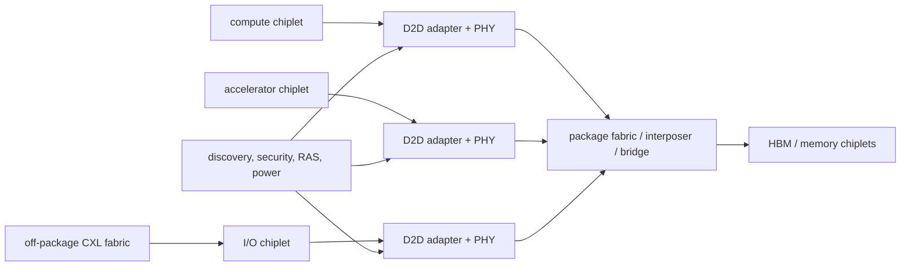

# Chiplets, CXL, and Die-to-Die — Architecture Across a Package Boundary

> **Prerequisites:** [Full-Chip Modeling](../../01_Modeling/02_System_and_PPA/01_Full_Chip_Modeling.md), [ACE and CHI](../01_Protocols/02_ACE_and_CHI.md), [Network on Chip](../02_Network_on_Chip/01_Network_on_Chip.md), and [IC Packaging](../../../07_Manufacturing_and_Bringup/02_IC_Packaging.md).
> **Hands off to:** package implementation, signal/power integrity, thermal design, and system software. This page owns partitioning and link/protocol architecture.

---

## 0. Why this page exists

A chiplet system moves boundaries that were once internal wires onto standardized or proprietary die-to-die links. The move can improve yield, reuse, reticle scaling, technology specialization, and product composition. It also adds serialization, PHY power, protocol conversion, package dependencies, and new reset/RAS/security domains.

The architecture must decide **where semantics terminate**, not only how many gigabits cross the package.

## 1. Why partition a die?

Partitioning benefits:

- yield improvement from smaller dies;
- reuse of validated I/O, compute, cache, and analog tiles;
- mixing process nodes (dense logic, SRAM, analog/PHY);
- scaling past reticle limits;
- product binning and configurable chiplet counts;
- independent development schedules and suppliers.

Costs:

- duplicated PHY/adapters, clocks, test, management, and keepout;
- higher latency/energy per crossing;
- package/interposer area, yield, and routing constraints;
- limited edge/bump bandwidth;
- cross-die coherence/directory complexity;
- known-good-die test and repair;
- thermal and power-delivery coupling;
- security/trust between dies.

The right partition cuts few latency-critical, high-bandwidth paths and many modular/technology-specific ones.

## 2. A first partition cost model

For boundary $b$ with traffic $T_b$ bytes/s, energy $E_b$ J/byte, and latency sensitivity coefficient $\lambda_b$, crossing cost is

$$
C_b=T_bE_b+\lambda_bL_b+ A_{adapter,b}+P_{idle,b}.
$$

Total value also includes die yield and reuse. With defect density $D_0$ and die area $A$, a simple Poisson yield is

$$
Y\approx e^{-D_0A}.
$$

Splitting reduces individual die area but package yield multiplies component/assembly yields and adds link/test overhead. More chiplets are not automatically cheaper.

Use traffic matrices from representative workloads. An average boundary traffic number hides bursts and coherence fanout that set queue/credit requirements.

## 3. Semantic partition choices

### 3.1 Protocol tunneling

Carry an existing on-die transaction/coherence protocol across the link. Benefits: preserves semantics and can make remote agents look local. Costs: link must carry fine-grained messages, ordering, retries, and virtual channels; latency may expose protocol assumptions designed for short wires.

### 3.2 Protocol termination and translation

Terminate on-die protocol at an adapter, then use a die-to-die transport and reconstruct transactions remotely. This localizes domains and supports heterogeneous chiplets, but bridges need reorder buffers, flow-control translation, error mapping, and precise completion semantics.

### 3.3 Message/software boundary

Partition at coarse queues, DMA, or software messages. It minimizes coherence and fine-grained latency coupling, but shifts data placement and synchronization to software/compiler.

Choose the coarsest boundary compatible with product latency and programmability.

## 4. UCIe stack as an architectural framework

Universal Chiplet Interconnect Express (UCIe) standardizes die-to-die physical/link capabilities and protocol mappings so chiplets can interoperate. Conceptually:

| Layer | Owns |
|---|---|
| protocol | PCIe/CXL or streaming/raw protocol semantics |
| die-to-die adapter | flitization, CRC/retry, ordering/flow mapping |
| physical | lanes, training, repair, clocking, electrical signaling |
| management/DFx | discovery, test, telemetry, reset, power, debug |

The exact feature set depends on specification version and package class. Architecture models should parameterize lane count, data rate, flit overhead, retry buffer, training, and repair rather than hard-coding a headline bandwidth.

Effective bandwidth:

$$
BW_{eff}=N_{lane}R_{lane}\eta_{encoding}\eta_{flit}\eta_{protocol}\eta_{retry}.
$$

Small coherence/control packets can have lower efficiency than large streaming transfers because headers/CRC/flow-control consume a larger fraction.

## 5. Link latency and credit sizing

Crossing latency includes source adapter, serialization, PHY/link, package propagation, destination adapter, and protocol reconstruction:

$$
L_{D2D}=L_{src}+L_{ser}+L_{phy}+L_{pkg}+L_{dst}+L_{protocol}.
$$

Round-trip coherence or load latency crosses twice and may visit a remote home/cache. Link replay after CRC errors adds a tail, so retry-buffer depth must cover the link round-trip bandwidth-delay product.

Credits need enough outstanding bytes to fill the pipe:

$$
C_{bytes}\gtrsim BW_{target}L_{credit}.
$$

Partition credits by virtual channel/protocol class to keep mandatory responses moving. A wide physical link can still underperform if transaction limits or adapter reorder entries are too small.

## 6. Coherence across chiplets

Options:

- one system-wide coherent domain with distributed homes/directories;
- coherent within compute chiplets, noncoherent/DMA across selected boundaries;
- hierarchical coherence: local directories summarized to a global level;
- memory-side coherence through a host/home agent;
- explicit software-managed sharing.

System-wide coherence improves programmability but makes remote latency, directory placement, snoop filtering, and failure recovery architectural. A hierarchical directory can track one bit per chiplet at the upper level and finer sharers locally, trading extra hop/lookup for scalable storage.

Coherence deadlock proof must include adapter queues and link VCs. A chiplet reset must not discard dirty owned data or outstanding acknowledgements silently.

## 7. CXL: coherent and memory semantics off package

Compute Express Link (CXL) layers cache/memory protocols with PCIe-based discovery/I/O. Architecturally, devices can expose:

- accelerator functions with coherent access to host memory;
- device-attached memory accessed by the host;
- memory expansion/pooling through switches/fabrics;
- device caches participating under host-managed coherence rules.

The host typically remains a key coherence/management authority. CXL memory is not “slow DRAM with a different connector”; it has fabric/host bridge latency, device controllers, failure domains, poison/RAS, hot-plug/fabric management, and NUMA placement.

For tiered memory, break-even migration follows

$$
N_{reuse}(L_{remote}-L_{local}) > L_{copy}+L_{coherence}+L_{mapping}.
$$

Capacity-only data may remain remote; hot latency-sensitive data may migrate or be replicated under consistency constraints.

## 8. Memory pooling and sharing

Pooling raises utilization by assigning memory capacity dynamically among hosts/devices. Architecture questions:

- allocation granularity and address-map updates;
- fabric manager availability and failover;
- isolation/encryption/key ownership;
- bandwidth oversubscription and QoS;
- poison containment and error attribution;
- coherent versus exclusive ownership;
- migration/quiescence during reallocation;
- topology-aware NUMA placement.

A pooled capacity number is useless without bisection bandwidth and contention policy. Ten hosts cannot each receive peak device bandwidth simultaneously through one oversubscribed switch.

## 9. Clock, reset, power, and discovery

Each chiplet may have independent clocks/voltages/power states. Links need:

- clock-domain crossing and elastic buffering;
- training and lane repair after reset/power-up;
- ordered power-state entry/exit;
- retention or re-discovery of routing/configuration;
- timeout behavior when a peer disappears;
- firmware ownership and version compatibility;
- telemetry for link errors and margins.

Reset is a distributed protocol: stop injection, drain/cancel transactions, resolve dirty coherence state, reset/train link, rediscover capabilities, re-enable routing. Partial reset should not force a full package reset unless the architecture chooses that availability trade.

## 10. Security and trust

Multi-vendor or separately managed chiplets enlarge the trust boundary. Protect:

- identity/authentication and lifecycle state;
- configuration and debug access;
- memory/request address permissions;
- protocol conformance and malformed flits;
- denial of service through credits/priority;
- replay/injection on links;
- data confidentiality/integrity where threat model requires;
- side channels in shared caches/fabrics.

Adapters should validate protocol fields before allocating scarce downstream resources. Rate-limit faulting peers and contain errors to a declared domain.

## 11. Physical/package co-design

Logical topology is constrained by bumps and package routing. A full crossbar among many chiplets may be unroutable; ring/mesh/package switches trade hops against wires. PHY placement fixes die edges and competes with memory interfaces and power delivery.

Thermal gradients affect link timing and stacked memory. Power delivery must handle simultaneous switching on wide die-to-die interfaces. Package escape, microbump pitch, interposer reticle/stitching, bridges, and organic substrate choices change bandwidth density and cost.

Feed package estimates back into architecture before freezing chiplet shapes and link counts.

## 12. Evaluation checklist and counters

Evaluate:

- boundary traffic matrix, burst/fanout, and locality by workload;
- effective bandwidth and tail latency by packet class;
- adapter/credit/reorder occupancy;
- flit overhead and small-message efficiency;
- retry, lane repair, degraded-width performance;
- remote coherence/home transactions and directory storage;
- power/energy per transferred byte including adapters;
- package routing/yield/cost scenarios;
- reset/recovery time and fault containment;
- memory-tier placement/migration benefit.

Simulate protocol and traffic jointly. A link-level bandwidth test cannot reveal coherence serialization or home-node hot spots.

## 13. Numbers to remember

- Partition at boundaries with low latency-critical traffic and high reuse/technology value.
- Chiplet economics combine die yield, package yield, adapter overhead, test, and reuse—not die yield alone.
- Effective link bandwidth multiplies lane rate by encoding/flit/protocol/retry efficiency.
- Credit and retry storage follow bandwidth × round-trip latency.
- Coherence across a resettable/fallible boundary needs explicit dirty-state and transaction recovery.
- CXL memory is a NUMA/fabric tier with management, RAS, security, and contention semantics.

## 14. Worked problems

### Problem 1 — effective link bandwidth

Sixteen lanes each provide 32 Gb/s raw. Combined encoding/flit/protocol efficiency is 82%:

$$
BW=16\times32/8\times0.82=52.48\ \text{GB/s}
$$

per direction if the lanes are unidirectional as modeled. Transaction limits may reduce achieved rate further.

### Problem 2 — credit window

A 50 GB/s link has 80 ns credit round trip:

$$
C\ge50\times10^9\times80\times10^{-9}=4000\ \text{B}.
$$

Roughly 4 KiB of usable outstanding credit is required per fully utilized aggregate path, then partitioned/headroom-adjusted by traffic class.

### Problem 3 — hierarchical directory

An eight-chiplet system with eight cores/chiplet could track 64 core sharers globally. A hierarchical upper directory uses eight chiplet bits; only the owning local directory tracks eight core bits. Storage falls at the global level, but a request may add a local-directory lookup/hop.

## Cross-references

- **Protocols and coherence:** [ACE and CHI](../01_Protocols/02_ACE_and_CHI.md), [Cache Coherence](../../03_Memory/03_Coherence_and_Consistency/01_Cache_Coherence.md).
- **Transport/package:** [Network-on-Chip Architecture](../02_Network_on_Chip/01_Network_on_Chip.md), [Routing, Flow Control, and Deadlock](../02_Network_on_Chip/02_Routing_Flow_Control_and_Deadlock.md), [IC Packaging](../../../07_Manufacturing_and_Bringup/02_IC_Packaging.md).
- **Memory/system:** [HBM and Advanced Memory Systems](../../03_Memory/05_Main_Memory/02_HBM_and_Advanced_Memory_Systems.md), [Full-Chip Modeling](../../01_Modeling/02_System_and_PPA/01_Full_Chip_Modeling.md).

## References

1. UCIe Consortium, [UCIe Specifications](https://www.uciexpress.org/specifications).
2. Compute Express Link Consortium, [CXL Specification](https://computeexpresslink.org/).
3. R. St. Amant et al., “Die-to-Die Interconnects and Chiplet-Based Systems,” IEEE Micro.
4. Arm, [Chiplet System Architecture overview](https://developer.arm.com/community/arm-community-blogs/b/architectures-and-processors-blog/posts/arm-a-profile-architecture-developments-2024).
5. [IC Packaging](../../../07_Manufacturing_and_Bringup/02_IC_Packaging.md) and its primary references.

---

**Navigation:** [System Fabrics index](00_Index.md) · [Interconnect index](../00_Index.md)
