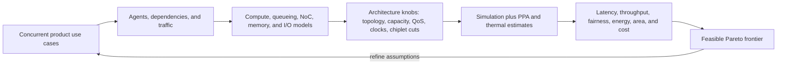
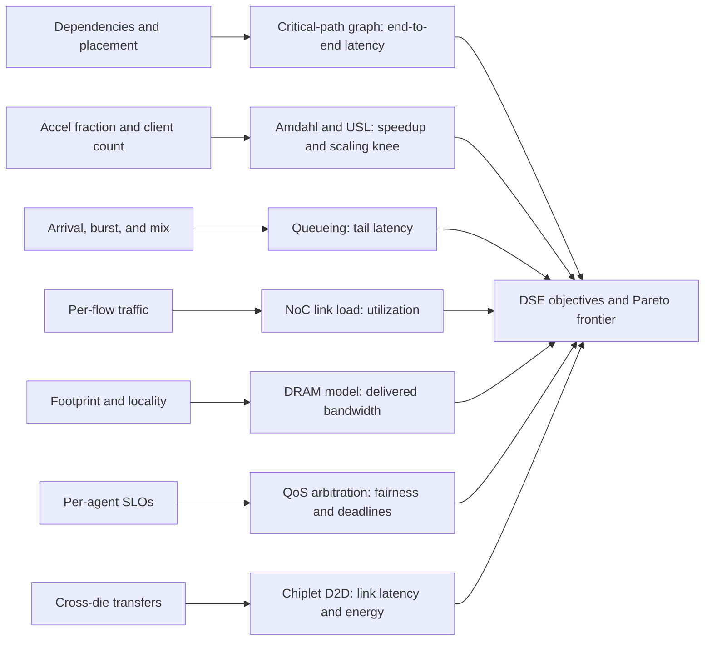
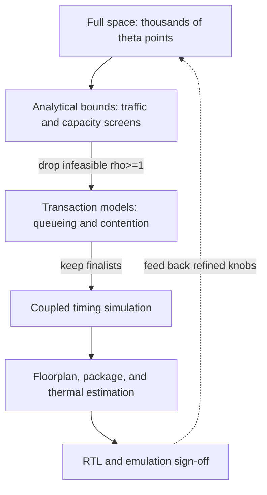

# SoC and Chiplet Workloads, Performance Modeling, and Design-Space Exploration

> **First-time reader orientation:** A system on chip (SoC) succeeds when processors, accelerators, memories, fabrics, devices, software, clocks, power modes, and package links cooperate under concurrent product use cases. Optimizing each block in isolation can make the system worse by shifting traffic, contention, power, or tail latency into a shared resource.

> **Abbreviation key — skim now and return as needed:** system on chip (SoC); central/graphics/neural processing unit (CPU/GPU/NPU); network on chip (NoC); dynamic random-access memory (DRAM); double data rate (DDR); high-bandwidth memory (HBM); direct memory access (DMA); input/output (I/O); quality of service (QoS); service-level objective (SLO); chiplet; compute express link (CXL); design-space exploration (DSE); power, performance, and area (PPA); universal scalability law (USL).

---

The loop is intentionally system-wide: a local acceleration is useful only if the resulting traffic, contention, power, and tail-latency point remains feasible.

## 0. Build use-case contracts, not independent benchmark lists

A use case must identify:

- applications/services, foreground/background tasks, inputs, thread/core placement;
- CPU/GPU/NPU/device commands and dependencies;
- DMA/display/camera/storage/network traffic and interrupt rates;
- memory footprints, page placement, coherence domains, and sharing;
- latency/throughput/tail/fairness requirements;
- clock/voltage/power/thermal modes and transition policy;
- external DDR/HBM/CXL/PCIe/die-to-die configuration;
- boot, steady, burst, idle, fault, and recovery phases.

Examples are a camera frame pipeline while a CPU service and wireless/storage DMA run, or an inference request spanning CPU preprocessing, NPU execution, and CPU postprocessing. The shared-memory/NoC schedule matters more than an isolated peak for any block.

Each contract field above is the input to a specific model whose output is one system metric; the DSE loop (top of page) then trades those metrics against area, power, and cost. This map previews that pipeline and the sections that build each piece:

## 1. End-to-end performance is a dependency graph

Intuitively, completing a request is like finishing a project: the end time is the longest chain of steps that must wait on each other (the critical path), not the sum of all work (that over-counts overlap) and not the single slowest step (that ignores contention).

Represent a request/frame/job as nodes for compute, transfer, synchronization, and service. Add:

- dependency edges for data/control;
- serialization edges for shared engines, queues, links, memory banks, and software locks;
- release/arrival times and priorities;
- clock/power-state transition delays.

For a purely serial path,

$$
T_{end}=\sum_iT_i.
$$

For overlapping resources, completion is the longest dependency/resource-constrained path. Do not sum all block times when DMA overlaps compute; do not take a simple max if they contend for NoC/DRAM.

## 2. Amdahl, scaling, and contention

If fraction $p$ is accelerated by factor $s$,

$$
S=\frac{1}{(1-p)+p/s}.
$$

An accelerator can be 100× faster yet yield little system benefit if preprocessing, transfers, synchronization, or fallback dominate. Amdahl also omits contention. For $N$ parallel clients, the USL form

$$
C(N)=\frac{N}{1+\alpha(N-1)+\beta N(N-1)}
$$

separates serialized sharing $\alpha$ and coherence/coordination growth $\beta$. Use it as a diagnostic fit, then locate mechanisms in locks, coherence, NoC, memory, or software scheduling.

Intuitively, $\alpha$ is a per-client tax for serialized sharing that flattens the curve, while $\beta$ is a coordination tax every client pays against every other, so it grows like $N^2$ and eventually bends the curve back down. With $\beta>0$ throughput does not merely saturate — it peaks at $N^*=\sqrt{(1-\alpha)/\beta}$ and then falls, so beyond that point more clients or cores reduce total throughput. Example: $\alpha=0.03$ and $\beta=0.001$ give $N^*\approx31$; that ceiling comes from sharing and coordination, so no faster core removes it — only shrinking $\alpha$ or $\beta$ does.

## 3. Queueing defines saturation and tail latency

For offered arrival rate $\lambda$, service rate $\mu$, utilization $\rho=\lambda/\mu$, and a simple single-server queue,

$$
W\approx\frac{1}{\mu-\lambda}.
$$

Real NoCs/DRAM/device queues are more complex, but the nonlinear lesson holds: latency rises rapidly near saturation. Average bandwidth is not enough for SLOs. Characterize burst size, inter-arrival distribution, priority, read/write mix, bank/locality, packet size, and dependency chains.

How rapidly? Taking mean service time as the unit, $W=1/(1-\rho)$, so response time blows up as $\rho\to1$:

| Utilization $\rho$ | 0.5 | 0.8 | 0.9 | 0.95 | 0.99 |
|---|---|---|---|---|---|
| Mean response $W$ (service times) | 2 | 5 | 10 | 20 | 100 |

Adding just 19% more offered load (0.8 to 0.95) quadruples latency. This is why an SoC sized to 60-80% of peak bandwidth can hold SLOs that one sized to 95% cannot, even though both have "enough" average bandwidth.

Little's law connects occupancy $L$, throughput $\lambda$, and residence time $W$:

$$
L=\lambda W.
$$

Use it to size outstanding IDs, reorder buffers, credits, miss queues, DMA descriptors, and memory queues for target latency/bandwidth. For example, to hold a DRAM read stream at 20 GB/s with 64 B lines and 100 ns average latency, the required occupancy is $L=\lambda W=(20\text{ GB/s}\div64\text{ B})\times100\text{ ns}\approx32$ outstanding requests. Provision fewer read/miss IDs and the pipeline stalls waiting for returns, capping delivered bandwidth well below the pin rate no matter how capable the DRAM is.

## 4. NoC performance model

For a packet traversing $H$ hops,

$$
T_{packet}=T_{source\ wait}+T_{injection}+\sum_{h=1}^{H}(T_{router,h}+T_{link,h}+T_{queue,h})+T_{ejection}+T_{destination}.
$$

Zero-load hop latency is only part of the result. Packetization, arbitration, virtual channels, flow control, backpressure, topology, routing, and traffic correlations determine queueing.

Bandwidth screening uses link load. For link $e$,

$$
\rho_e=\frac{\sum_{flows\ f\ using\ e}\lambda_fB_f}{BW_e}.
$$

Reject configurations with sustained $\rho_e\ge1$ and keep margin for bursts/control traffic. Then simulate hotspots and priority interference.

Worked screen: a 32 B/cycle link at 2 GHz delivers $BW_e=64$ GB/s. Say three flows cross it — a GPU read stream at 30 GB/s, an NPU tensor stream at 20 GB/s, and CPU coherence traffic at 8 GB/s — for offered load 58 GB/s and $\rho_e=58/64\approx0.91$. It is nominally "under capacity," but by the queueing curve above the link now runs near $1/(1-0.91)\approx11\times$ its unloaded crossing time with no room for bursts or control packets, so reject it. Rerouting the NPU stream off this link drops $\rho_e$ to $38/64\approx0.59$, a healthy point. Screen every link like this first; a topology that fails the static budget cannot pass timing later.

## 5. Shared-memory and DRAM model

Application-visible memory time includes translation/cache/coherence/NoC/controller/DRAM. At the controller, request latency is

$$
L_i=d_i-a_i,
$$

and delivered bandwidth is

$$
BW=\frac{\sum_iB_i}{t_{end}-t_{start}}.
$$

Row-buffer locality, banks, channels, command timing, refresh, read/write turnaround, address mapping, scheduling, and QoS determine service. A peak pin-rate quotient is an upper bound, not delivered performance.

Memory capacity and bandwidth must be allocated among CPU demand, GPU/NPU bulk traffic, display/camera isochronous streams, DMA, page walks, coherence writebacks, and prefetches.

## 6. QoS and fairness are architecture functions

Priority alone can starve low-priority traffic or cause priority inversion through shared buffers/dependencies. Define:

- per-agent latency/bandwidth SLOs;
- admission/shaping and burst budgets;
- arbitration weights/age escalation/deadlines;
- reserved buffers/credits/virtual channels;
- memory-controller and NoC policy alignment;
- observability and software controls.

Report average and tail latency, deadline misses, minimum bandwidth, and fairness under adversarial mixes. Validate liveness: finite buffers and backpressure must not create protocol or network deadlock.

## 7. Chiplet performance composition

Chiplets add serialization/deserialization, protocol bridges, die-to-die PHY/link, package routing, retry/error handling, coherency, and clock-domain crossing. For transferred payload $M$,

$$
T_{D2D}\ge L_{fixed}+\frac{M_{wire}}{BW_{delivered}}.
$$

Here $L_{fixed}$ is a latency floor (SerDes, PHY, package flight, protocol bridge, clock-domain crossing) that no payload can amortize away, and $M_{wire}\ge M$ is the bytes actually driven — the payload $M$ plus framing, headers, and ECC — so protocol overhead both inflates $M_{wire}$ and erodes $BW_{delivered}$. The fixed floor is why one large transfer beats many small ones carrying the same bytes.

Small coherent requests are latency-sensitive; large tensor transfers are bandwidth/energy-sensitive. Topology and placement determine hop count and bisection. Chiplet DSE must include package link count, width/rate, protocol overhead, cache/coherence home placement, memory attachment, and thermal/power constraints.

## 8. SoC/chiplet DSE vector

$$
\theta=(N/type\ compute,cache\ sizes,coherence,NoC\ topology/width/VC/buffers,DDR/HBM\ channels,controllers,QoS,DMA,IO,D2D,f/V\ domains,power\ policy,placement).
$$

Coupled examples:

- more accelerators require NoC/memory/power supply and software concurrency;
- a larger LLC changes area, hit latency, NoC traffic, and DRAM energy;
- more DDR channels require PHY/package pins and controller queues;
- wider NoC links increase router/crossbar/wire/clock power;
- chiplet partition changes link traffic, coherence latency, yield, and thermal spreading.

Stage the exploration: analytical traffic/capacity bounds, transaction models, coupled timing for finalists, floorplan/package/thermal estimation, then RTL/emulation. Each stage is cheaper but coarser than the next, so screen the many and spend high-fidelity simulation only on survivors:

Reading the survivors — dominance and the frontier. A configuration is *dominated* when another is at least as good on every objective and strictly better on one; dominated points are never rational choices and drop out. The rest form the Pareto frontier, the menu where improving one objective must cost another. Five candidates, maximizing throughput and minimizing power:

| Config | Throughput (rel.) | Power (W) | Verdict |
|---|---|---|---|
| A: narrow NoC, small LLC | 100 | 5.0 | frontier (min power) |
| E: mid NoC, mid LLC | 120 | 8.0 | dominated by C |
| C: narrow NoC, large LLC | 130 | 6.5 | frontier |
| B: wide NoC, small LLC | 140 | 7.0 | frontier |
| D: wide NoC, large LLC | 150 | 9.0 | frontier (max throughput) |

E is discarded outright: C gives more throughput (130 vs 120) at less power (6.5 vs 8.0), dominating it on both axes. A, C, B, and D genuinely trade off, and the pick among them is set by the product power cap and tail-latency SLOs — "feasible" in the top-of-page loop means a point must clear those constraints before it is Pareto-ranked. The axes are coupled: the wide NoC that buys D its throughput is also what pushes its power to 9 W, so every $\theta$ change must be re-scored on all resources at once, never on one metric alone.

## 9. Workload sampling at system scale

System phases include boot, app load, steady service, bursts, background maintenance, memory-pressure/reclaim, power transitions, and failures. Sample complete causally connected intervals; a CPU-only ROI can miss device completion or asynchronous DMA.

For service workloads, preserve arrival distribution and queue state. For frame pipelines, sample whole frames and deadline windows. For multi-tenant systems, retain correlated mixes and placement. Warm caches/TLBs/predictors, NoC/DRAM queues, coherence directories, and device buffers as required by the claim.

## 10. Worked shared-resource decision

Suppose CPU, NPU, and display offer 80, 500, and 40 GB/s to a memory system delivering 600 GB/s for their mix. Average offered load is 620 GB/s, already above service. Giving the NPU 2× compute cannot improve end-to-end throughput; it can increase burst pressure.

If NPU tiling reduces its traffic to 420 GB/s, total becomes 540 GB/s (90% utilization). Queueing may still violate CPU/display tail SLOs. Candidate decisions are additional channel bandwidth, traffic shaping/reservations, better NPU reuse, or scheduling the burst. Detailed coupled simulation must evaluate burst correlation and QoS; an isolated NPU model cannot sign off the SoC.

## 11. SoC decision checklist

- Is every use case a concurrent engine/software/traffic contract?
- Is the end metric a valid dependency/resource critical path?
- Are offered load, delivered service, burst, and tail behavior separated?
- Are NoC and memory policies evaluated together?
- Are coherence, DMA, page walks, prefetch, and I/O traffic included?
- Are QoS and liveness checked under adversarial mixes?
- Are chiplet links/protocol/package/thermal effects explicit?
- Does each DSE point update all coupled resources and software mappings?

## Cross-references

- [Full-Chip Modeling](../01_System_Modeling/01_Full_Chip_Modeling.md).
- [DDR Controller](../02_Shared_Memory/01_DDR_Controller.md).
- [Network on Chip](../04_On_Chip_Networks/01_Network_on_Chip.md).
- [Chiplets, CXL, and Die-to-Die](../05_IO_and_Chiplets/02_Chiplets_CXL_and_Die_to_Die.md).

## References

1. J. L. Hennessy and D. A. Patterson, *Computer Architecture: A Quantitative Approach*.
2. N. Gunther, *Guerrilla Capacity Planning* (USL).
3. W. J. Dally and B. Towles, *Principles and Practices of Interconnection Networks*.
4. JEDEC memory standards and contemporary chiplet/die-to-die specifications.

---

← [Methodology index](00_Index.md) · next → [SoC/Chiplet PPA and Physical Implementation](02_SoC_Chiplet_PPA_and_Physical_Implementation.md)
